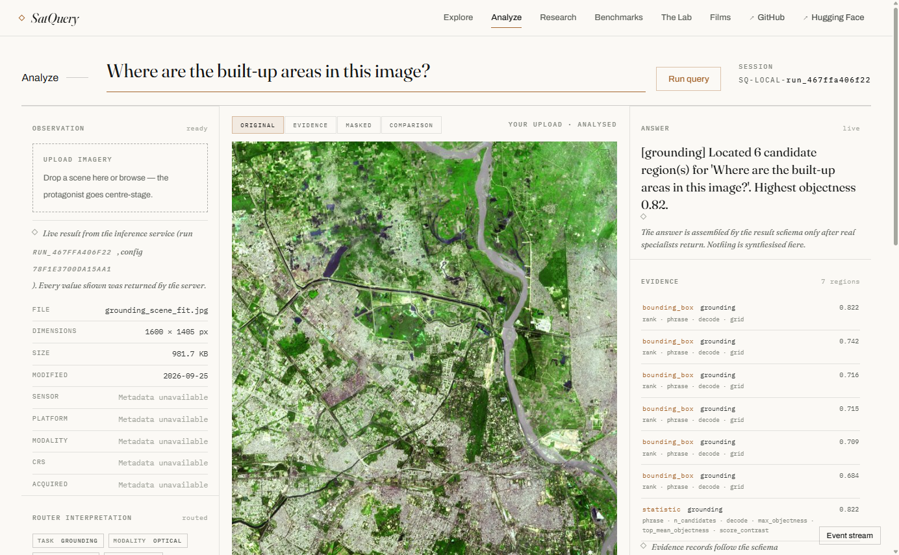
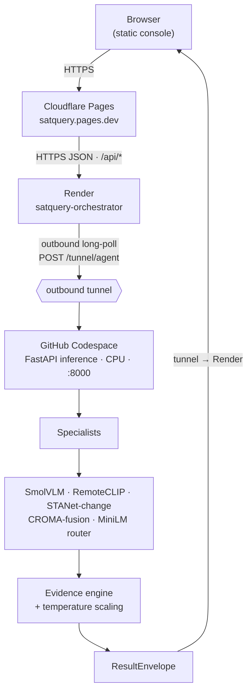
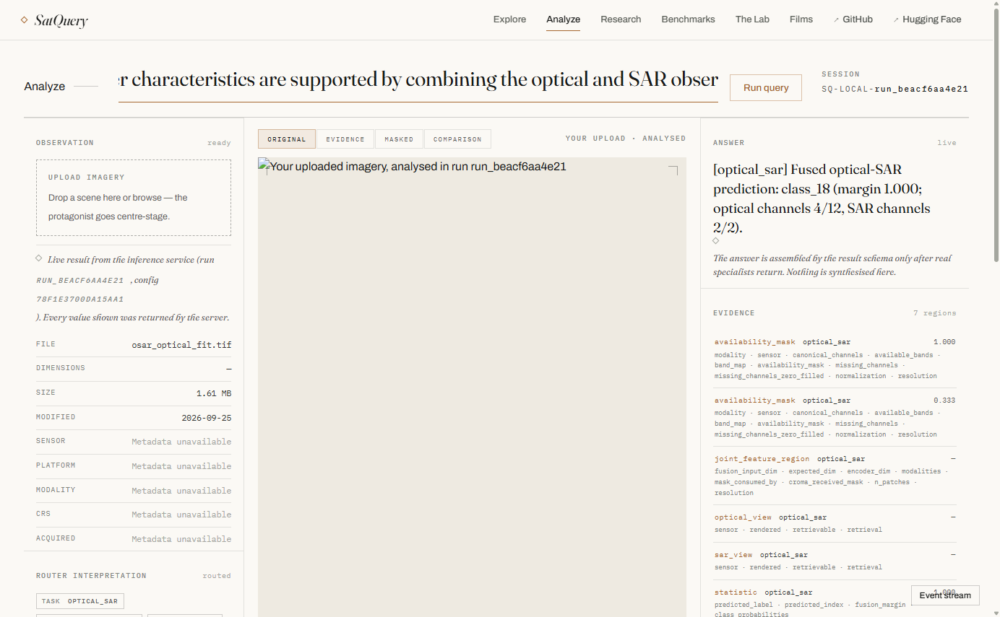
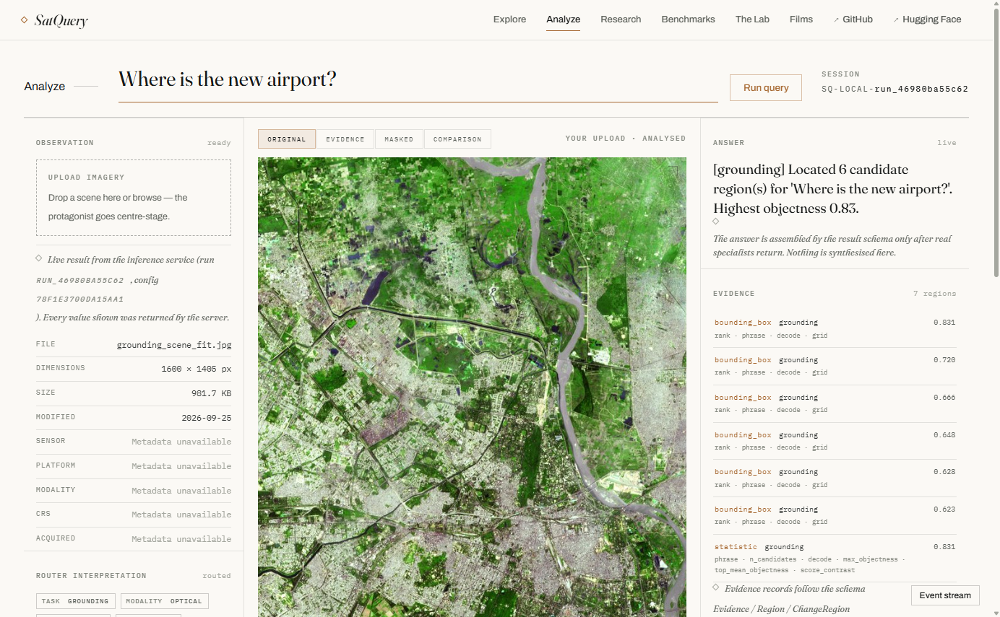
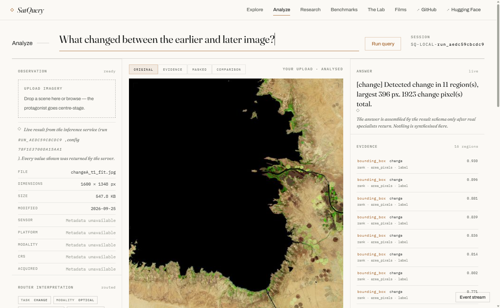
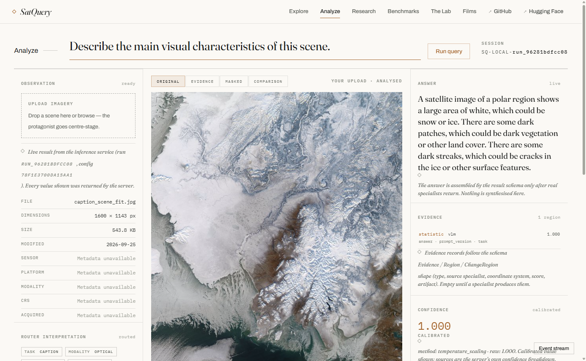
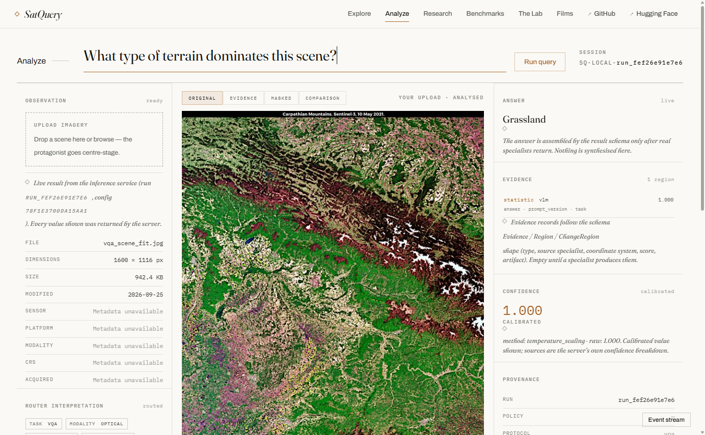
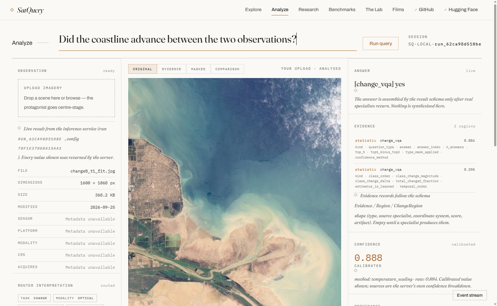

# SatQuery AI — Satellite Imagery Question Answering

**Satellite imagery question answering, remote-sensing change detection, visual grounding and
optical-SAR fusion in one open, CPU-runnable system.**

Ask a natural-language question about a satellite or aerial image — or a pair of images — and SatQuery
AI routes it to the right specialist model, collects evidence, and returns a single confidence-scored
result envelope. It is a **remote-sensing vision-language system** built as a *router plus specialists*
pipeline: satellite image captioning, visual question answering, **text-guided visual grounding**,
**bi-temporal satellite image change detection**, change-VQA, and **Sentinel-1 / Sentinel-2 optical-SAR
fusion**. It runs on **CPU**, is served from a static frontend, and is live at
**https://satquery.pages.dev**.

[](RELEASE_MANIFEST.md)
[](https://satquery.pages.dev)
[](https://huggingface.co/thundercode/SatQuery)
[](docs/architecture/README.md)
[](#license)

<p align="center">
  
</p>

> **Status: research prototype, pre-1.0.** The architecture is frozen. This repository is the
> documented public release of the system, its trained artifacts, and its measured results —
> **including the negative ones.**

This README is the front door to a long-form documentation set. It is written to the same standard as
the rest of the release: **every number, path, run identifier and status is taken from a file that was
actually read**, and where something was never run, that is stated rather than implied.

---

## Topics

This system spans several searchable areas. If you are looking for a **remote-sensing
vision-language model**, a **satellite image change-detection** baseline, a **text-guided visual
grounding** implementation for Earth observation, **Sentinel-1/Sentinel-2 optical-SAR fusion**, or a
**router-and-specialists** design that runs on CPU, this repository covers that ground.

| Area | What is here |
|---|---|
| **Satellite imagery question answering** | six task specialists behind one typed `ResultEnvelope` |
| **Remote-sensing VQA & captioning** | SmolVLM-500M over frozen backbones, with a trained LoRA adapter |
| **Visual grounding (text → box)** | RemoteCLIP ViT-B/32 + a trained grounding head; VRSBench protocol |
| **Change detection (bi-temporal)** | STANet-style Siamese detector on LEVIR-CD-256 |
| **Change-VQA** | natural-language questions over a temporal pair |
| **Optical-SAR fusion** | CROMA-base, 19-class BigEarthNet CLC head |
| **Multimodal / vision-language** | evidence aggregation, calibrated confidence, execution traces |
| **Deployment** | static frontend + gateway + outbound-tunnel inference on CPU |

Search terms this project is described by: `satellite imagery question answering` ·
`remote sensing vision language model` · `satellite image change detection` · `visual grounding remote
sensing` · `optical SAR fusion` · `Sentinel-1 Sentinel-2 fusion` · `satellite image captioning` ·
`LEVIR-CD` · `VRSBench` · `BigEarthNet` · `router and specialists architecture` · `vision-language model
on CPU`.

---

## Table of contents

- [Topics](#topics)
- [Motivation](#motivation)
- [What the system supports](#what-the-system-supports)
- [Supported inputs](#supported-inputs)
- [Architecture](#architecture)
  - [Repository map](#repository-map)
  - [The four endpoints](#the-four-endpoints)
  - [Documentation map](#documentation-map)
- [Routing and the execution trace](#routing-and-the-execution-trace)
  - [The eight execution events](#the-eight-execution-events)
- [Real inference vs. the preview path](#real-inference-vs-the-preview-path)
- [Models](#models)
- [Measured results](#measured-results)
  - [Grounding: three decode variants, two protocols](#grounding-three-decode-variants-two-protocols)
  - [Fusion: measured but the ruling is open](#fusion-measured-but-the-ruling-is-open)
  - [Change-VQA: two test sets, and they disagree](#change-vqa-two-test-sets-and-they-disagree)
  - [Phase 6 / VLM: deployment success ≠ model acceptance](#phase-6--vlm-deployment-success--model-acceptance)
  - [Calibration: it got worse, and we say so](#calibration-it-got-worse-and-we-say-so)
- [Live validation](#live-validation)
  - [Representative real run IDs](#representative-real-run-ids)
  - [Screenshots](#screenshots)
- [Installation](#installation)
- [Local development](#local-development)
- [Deployment](#deployment)
  - [Deployment caveats](#deployment-caveats)
- [Reproducibility](#reproducibility)
- [Known limitations](#known-limitations)
- [Links](#links)
- [Citation](#citation)
- [License](#license)

---

## Motivation

Remote-sensing analysis is fragmented. Detecting change between two acquisitions, localising an
object, captioning a scene, answering a question about it, and fusing optical with SAR each live in a
different model, a different preprocessing convention, and a different output schema. Assembling them
into one answer means re-solving the same problems — tiling, band handling, coordinate systems,
confidence — every time.

SatQuery AI explores a single hypothesis: **a small deterministic router plus a shared evidence
contract can make a heterogeneous specialist ensemble behave like one system**, without a large
language model in the control path. The router *understands* the query. A deterministic policy
*decides* which specialists run. The specialists *compute*. The evidence engine *proves* the answer.

Two design rules follow from that, and they are non-negotiable in the codebase:

- **No LLM-generated coordinates. No LLM-generated confidence.** Coordinates come from detection and
  segmentation heads; confidence comes from a calibrated scoring path.
- **Every result carries an observable execution trace** — never chain-of-thought.

### Why not one end-to-end model

The design is a *router plus specialists*, not a single model that "does satellite QA". Each layer has
exactly one verb, assigned in the architecture freeze:

> router **understands**; policy engine **decides**; specialists **compute**; VLM **explains**;
> evidence engine **proves**.

That division is not decoration — it resolves real ambiguities about *where* a decision belongs. The
`Intent` type makes the first row explicit in code:

```python
class Intent(BaseModel):
    """Output of the learned router. Advisory only — the controller decides."""
```

The four constraints that force the modular design:

| Constraint | Consequence |
|---|---|
| The system must run on **CPU** | End-to-end VLM inference at usable quality needs a GPU; small per-task modules do not. |
| Different tasks have **incompatible outputs** | `change` returns a spatial change map; `caption` returns prose; `optical_sar` returns a class distribution. One head cannot emit all three. |
| Tasks have **different data and metrics** | Each specialist is trained and evaluated on its own split with its own protocol. |
| **Truthfulness** | Per-task metrics are auditable. A single end-to-end number would hide which component failed. |

The cost of this design is that there is **no system-level accuracy number** — because there is no
single model to measure. That absence is stated rather than papered over; see
[Known limitations](#known-limitations) item 1.

### What the system is deliberately not

| Absent | Why |
|---|---|
| Database, authentication, users, job queue | the gateway is stateless by design; inference is synchronous |
| GPU requirement | device is selected via `SATQUERY_DEVICE`; all placement is `.to(device)`, never `.cuda()` |
| Gradio GUI | the frontend is a separate static tier; `app/space_app.py` serves JSON only |
| Chain-of-thought in traces | traces carry observable facts only — states, timings, counts, config hash, model refs |
| Backbone redistribution | backbones are fetched from the Hugging Face Hub, pinned by revision |
| System-level end-to-end benchmark | **NOT RUN — none exists** |
| Router test-split evaluation | **NOT RUN** |

## What the system supports

Six specialist tasks. All six are reported `available: true` by the live capability contract
(`GET /api/capabilities`, probed 2026-09-25, `schema_version 1.0`).

| Task | What it answers | Assets | `requires_pair` | `max_assets` |
|---|---|---|---|---|
| `vqa` | A free-form question about a single scene | 1 | false | 1 |
| `caption` | A description of a single scene | 1 | false | 1 |
| `grounding` | *Where* is a described object or region — returns boxes | 1 | false | 1 |
| `change` | *What changed* between two co-registered acquisitions — returns change regions | 2 | true | 2 |
| `change_vqa` | A yes/no or short question about a detected change | 2 | true | 2 |
| `optical_sar` | Joint scene classification from an optical + SAR pair | 2 | true | 2 |

The live contract also carries per-task notes — `vqa`/`caption` fetch SmolVLM weights from the Hub on
first use, `grounding` fetches the RemoteCLIP encoder on first use, and `optical_sar` declares
`modalities: ["optical", "sar"]`.

### The ontology is wider than the capability list

There are **two** related vocabularies, and they are not the same six:

- `core/schemas.py::Task` carries **seven** values: `vqa`, `caption`, `grounding`, `change`,
  `optical_sar`, `change_vqa`, `unsupported`.
- The router's label space (`router/label_space.py::TASK_CLASSES`) is **six** classes:
  `vqa, caption, grounding, change, optical_sar, unsupported`.
- `GET /api/capabilities` lists **six** tasks — the same six as the router's *minus* `unsupported`,
  *plus* `change_vqa`.

This asymmetry is intentional. `unsupported` is a **routing outcome** ("this is not a satellite-imagery
question"), not a servable capability. `change_vqa` is reached through the change family rather than
being a separate router class, and it is servable. The three sets are reconciled in one place — the
frontend's `ROUTER_TASK_TO_SERVER` map (`frontend/assets/js/mission.js`) — because `AnalysisRequest` is
`extra="forbid"` and any string outside the `Task` enum is a 422.

## Supported inputs

Confirmed by the implementation, not assumed:

| Modality | Task(s) | Format |
|---|---|---|
| Optical, single image | `vqa`, `caption`, `grounding` | JPEG, PNG, TIFF |
| Temporal optical pair | `change`, `change_vqa` | Two images of **identical dimensions** |
| Optical + SAR pair | `optical_sar` | GeoTIFF/TIFF preferred |

**Modality is inferred server-side from band count**, not from the file extension: `{1, 2}` bands ⇒
SAR, `{3, 4, 8, 11, 12, 13}` bands ⇒ optical. The browser cannot read band count, so the console warns
when a submitted pair looks like two ordinary photographs rather than an optical/SAR pair.

**Per-file upload limit: 4,194,304 bytes (4 MiB).** Larger files are refused with HTTP 413 — imagery
must be downscaled first.

### The size cap is one number shared by two layers

The cap is not a literal in two places; both the gateway and the inference service read
`SATQUERY_MAX_FILE_BYTES`, and the default is `4 * 1024 * 1024` in both. The inference service's
`_asset_max_file_bytes()` (`app/space_app.py`) is deliberately strict about it:

- a **missing** variable ⇒ the 4 MiB default;
- a **non-integer** value ⇒ `ValueError` (not silently defaulted);
- a **non-positive** value ⇒ `ValueError` (a cap of `0` refuses every upload, which is a configuration
  error rather than a limit).

The reason is recorded in the source: a silent default would let a deployment whose operator typed a
malformed cap keep accepting uploads against a limit nobody chose, while the gateway refused to boot
for the *same* value — the two layers disagreeing about what "too large" means, which is exactly the
failure the shared variable exists to prevent.

The accepted content types mirror the gateway's allowlist (defence in depth — the Space validates
independently rather than trusting the gateway to be its only caller):

```
image/tiff, image/geotiff, image/png, image/jpeg, application/octet-stream
```

### Uploads are handle-based, and the Space owns the bytes

`POST /v1/assets` accepts one file and returns an **opaque ephemeral handle**. The store lives on the
inference host, not the gateway, because the inference host is where `inspect_raster` reads the bytes
and where `cache_max_models: 1` serialises their consumption — a gateway-side store would put the bytes
on a different machine from the reader. The upload endpoint is **off by default** and enabled only when
`SATQUERY_ASSET_ENABLED` and `SATQUERY_ASSET_DIR` are both set; otherwise it answers a named
`model_unavailable` envelope explaining the switch. Handle capacity defaults to **32** and the handle
TTL to **900.0 s**, both overridable by environment (and read from the environment rather than
`configs/base.yaml` on purpose — adding a key there would move the frozen config hash).

### Input geometry and normalisation

Downstream of the format check, input handling is governed by the frozen registry
(`configs/base.yaml`):

| Key | Value | Meaning |
|---|---|---|
| `image.max_pixels` | 25,000,000 | hard ceiling on decoded pixels |
| `image.tile_size` | 512 | tile edge |
| `image.tile_overlap` | 128 | tile stride overlap |
| `image.max_tiles` | 64 | hard ceiling on tiles *examined* |
| `image.top_k_tiles` | 4 | tiles actually sent through a specialist |
| `optical.normalization` | percentile | 2nd–98th percentile stretch |
| `optical.lower_percentile` / `upper_percentile` | 2 / 98 | stretch bounds |
| `optical.canonical_channels` | 12 | CROMA expects exactly 12 optical channels |
| `sar.representation` | db | SAR is converted to decibels |
| `sar.clip_min_db` / `clip_max_db` | −30 / 5 | dB clip window |
| `sar.canonical_channels` | 2 | CROMA expects exactly 2 SAR channels (VV, VH) |

The tile policy follows the plan's section 9.1: whole-image thumbnail first, then top-K tiles. `max_tiles`
is the hard ceiling on tiles examined; `top_k_tiles` is how many are actually dispatched — and the loader
**rejects** a config where `top_k_tiles > max_tiles`.

## Architecture

This is the **actually deployed** topology. An older direct-client-to-inference design is superseded.



### Why a tunnel

The inference host runs in a GitHub Codespace. The forwarded-port path is not reachable for a private
repo (it returns HTTP 302), so the orchestrator keeps a **long-poll tunnel**: the Codespace dials out
to `POST /tunnel/agent` and holds the connection; Render queues work onto it. `transport_mode` is
`auto`, and the tunnel is the live transport. There is **no** `SATQUERY_UPSTREAM_URL` and **no**
`HF_TOKEN` in the live configuration — the transport is the outbound tunnel, not a forwarded port.

The live health payload (`GET /api/health`, probed 2026-09-25) records the tunnel's state directly:

```json
{"status":"ok","service":"satquery-orchestrator",
 "tunnel":{"agent_connected":true,"agent_id":"codespaces-fd1038","pending":0,"completed":97},
 "config":{"codespace_name":"potential-space-trout-r4ppw969w45j2pvvw\n","codespace_port":8000,
           "transport_mode":"auto","tunnel_timeout_s":150.0,"wake_timeout_s":120.0,
           "upstream_timeout_s":90.0,"device":"cpu","has_github_token":true}}
```

Note `codespace_name` still carries a trailing `\n` — that is item B-02, cosmetic, and
[still open](#deployment-caveats).

### The nine-state controller

The inference host is a FastAPI service built by `build_space_app()`. Behind the transport sits a
deterministic controller with a **nine-state** finite state machine (`core/schemas.py::ControllerState`,
mirrored in `configs/base.yaml` §`agent.states`):

```
RECEIVE → PARSE → VALIDATE → PLAN → PREPROCESS → EXECUTE → AGGREGATE → VERIFY → RESPOND
```

The controller is the **only** component that dispatches. `agent.max_specialists` is 4,
`agent.timeout_seconds` is 120, and `agent.unload_after_workflow` is true — the controller unloads
models after a workflow so that `cache_max_models: 1` is honoured rather than thrashing the cache.

### Frozen backbones, trained modules

Four backbones are pinned by `repo_id` + `revision` and fetched from the Hub on first use. Nothing is
fine-tuned end-to-end.

| Role | Repository | Revision | Size / notes |
|---|---|---|---|
| Router encoder | `sentence-transformers/all-MiniLM-L6-v2` | `1110a243fdf4` | 90.9 MB, 22,713,216 params, 384-dim embeddings |
| VLM | `HuggingFaceTB/SmolVLM-500M-Instruct` | `a7da5b986cb5` | ~1015 MB safetensors |
| Grounding | `chendelong/RemoteCLIP` (`RemoteCLIP-ViT-B-32.pt`) | `bf1d8a3ccf2d` | 605.2 MB; width 768, **projected** dim 512 |
| Optical-SAR | `antofuller/CROMA` (`CROMA_base.pt`) | `0dd28e3d633b` | 777.6 MB; `encoder_dim` 768, `image_resolution` 120 |

Two consequences follow: the system is small (the six trained artifacts total ~125 MiB; everything else
is public weights), and **no backbone weights are redistributed** by this release.

### The evidence and confidence stages

Specialists each emit `Evidence` for what *they* computed. The `EvidenceEngine`
(`evidence/engine.py`) does not re-derive any of it; it aggregates:

```
collect across specialists → deduplicate → order → renumber → cap
```

The pipeline is **pure and deterministic** — no clock, no RNG, no I/O — and its purity is a test
assertion, not a hope. Three details matter:

- **Stable identity.** `Evidence.evidence_id` defaults to a random uuid, which is useless across runs.
  The engine renumbers to `evidence_001`, `evidence_002`, … (zero-padded to three digits, well past the
  `evidence.max_items` bound of 32) so a downstream artefact can cite one item deterministically.
- **Defined order.** Items are sorted by `(type, source_specialist, score DESC, coordinates)`. The
  coordinate tie-breaker is what makes the order *total*; without it, two items sharing type,
  specialist and score would fall back to Python's stable-sort insertion order, reintroducing
  input-order dependence.
- **Content identity, not container identity.** Dedup keys on
  `(type, source_specialist, coordinate_system, rounded coordinates, rounded score)` — `payload`,
  `artifact_ref` and `evidence_id` are deliberately excluded. Two items that agree on the same
  geolocation, one carrying a `crs` and one not, have made the same claim about the world; the surviving
  item's payload is merged with the discarded one's so the `crs` is not lost. Two items that share a type
  and score but **disagree** on coordinates are two different claims and are both kept — suppressing a
  spatial disagreement would be the silent contradiction the freeze forbids.

The engine records `dropped_duplicates` (non-zero is normal and healthy — it means two specialists
agreed), `dropped_over_limit` (non-zero is a warning — a specialist's evidence did not survive), and
`truncated`. `evidence_digest()` exists so that reproducibility is an assertion:

```
aggregate(inputs_a) is reproducible iff digest(a) == digest(b)
```

The confidence stage is `evidence/confidence.py`, and it exists to enforce one rule: **a calibration that
claims to be fitted when it is not is a false claim of reliability.** So when no fitted artifact is
available it passes the raw score through unchanged, sets `method="uncalibrated"`, and leaves
`calibrated=None` — which is what makes it honest, because `ConfidenceBreakdown.value` then returns
`raw`, and any consumer can distinguish "we calibrated this" from "we did not". The temperature scaling
itself is `calibrated = sigmoid(logit(z) / T)`, with two stated failure modes handled explicitly: a
fitted `T` of exactly `1.0` is the identity map and is reported as uncalibrated rather than silently
pretending to have done something, and `z = 0.0` (whose log-odds diverge) is clamped at the boundary so
a hard zero cannot become a NaN.

### Repository map

> **Scope of this repository.** It contains the **documentation and the source code only**. It
> deliberately does **not** contain: datasets, the `artifacts/` tree (trained weights, checkpoints,
> evaluation outputs), Jupyter notebooks, the static frontend, logs, or any credential. The six
> trained artifacts are published on the [Hugging Face Hub](https://huggingface.co/thundercode/SatQuery);
> the frozen backbones are fetched from the Hub at run time. Some documents cite the source
> repository's internal phase reports by filename as provenance — those files are not part of this
> release.

| Path | Contents |
|---|---|
| `app/` | FastAPI inference service and its composition root (`build_space_app()`, `serving.py`) |
| `core/` | The typed contracts, config registry + loader, nine-state controller, planner, registry, errors |
| `router/` | The MiniLM intent router: encoder, five-head adapter, classifier, lexical fallback, label space, dataset, training |
| `specialists/` | One module per specialist: `vqa/`, `grounding/`, `change/`, `optical_sar/`, plus `base.py` |
| `evidence/` | The evidence engine (aggregation) and the confidence/calibration module |
| `preprocessing/`, `geospatial/` | Raster handling, tiling, normalisation, sensor adapters |
| `gateway/` | The orchestrator / gateway (`/api/*`, CORS, wake flow, error translation) |
| `deploy/` | Deployment entrypoints: Codespace `serve.py` + `tunnel_agent.py`, Render blueprint |
| `training/`, `evaluation/` | Training entry points and evaluation harnesses |
| `scripts/` | Repository scripts (data prep, calibration fitting, packaging) |
| `tests/` | The test suite |
| `configs/base.yaml` | The frozen configuration registry — the single source of truth for every tunable |
| `docs/` | Architecture, models, benchmarks, datasets, training, evaluation, deployment, security, testing, operations, performance, glossary, limitations |
| `models/` | The **generated** artifact manifest and checksums (identities, not the weights) |
| `tools/` | Verification tooling (metric verification, manifest generation, archive tools) |
| `screenshots/` | Real live-run captures referenced by the documentation |

Not in this repository: `artifacts/`, `data/`, `notebooks/`, `frontend/`, `logs/`, `reports/`.

The component inventory in full (every path is the authoritative location):

| Layer | Module | Responsibility |
|---|---|---|
| **Contracts** | `core/schemas.py` | the binding typed contract: `Task`, `Intent`, `Evidence`, `SpecialistResult`, `ResultEnvelope`, `ExecutionTrace`, … |
| **Config** | `core/config.py` | load, deep-merge, validate, hash the registry; `get_config()` singleton |
| **Errors** | `core/errors.py` | the error taxonomy (`ConfigError`, `ModelLoadError`, `RoutingError`, `WorkflowPlanError`, …) |
| **Planning** | `core/planner.py` | turn an `Intent` into a concrete, ordered `ExecutionPlan` |
| **Registry** | `core/registry.py` | specialist registration / lookup |
| **Controller** | `core/controller.py` | the nine-state FSM; the only thing that dispatches |
| **Router** | `router/encoder.py` | frozen MiniLM embedding, cached |
| | `router/adapter.py` | the five-head `IntentAdapter` (the only trainable router part) |
| | `router/classifier.py` | learned classification + confidence gate + fallback selection |
| | `router/fallback.py` | deterministic lexical fallback (`lexical_route`) |
| | `router/label_space.py` | the ontology, single source of truth |
| | `router/dataset.py`, `router/train.py` | dataset generation and training |
| **Specialists** | `specialists/base.py` | the specialist interface |
| | `specialists/vqa/{model,inference,prompts}.py` | SmolVLM VQA |
| | `specialists/grounding/{remoteclip,head,inference,specialist}.py` | RemoteCLIP + head |
| | `specialists/change/{stanet,specialist,postprocess,vqa_specialist}.py` | change detection + change-VQA |
| | `specialists/optical_sar/{croma,fusion_head,inference,specialist,sensor_adapter,radiometry,prompts}.py` | CROMA fusion |
| **Evidence** | `evidence/engine.py` | aggregation: dedup → sort → renumber → cap |
| | `evidence/confidence.py` | temperature scaling, honest pass-through |
| **Inference app** | `app/space_app.py` | `build_space_app()`; the four-endpoint JSON contract |
| | `app/serving.py` | the composition root (`build_serving_controller()`) |
| | `app/deployment.py` | capability / health payload builders |
| **Gateway** | `gateway/` | the Render orchestrator, asset store, policy/error translation |
| **Frontend** | `frontend/` | the static site |

### The four endpoints

The inference service serves exactly **four** JSON endpoints (`app/space_app.py`). No Gradio GUI exists
in code; the file serves JSON only, by design, so it cannot compete with the static frontend's contract.

| Endpoint | Method | Purpose |
|---|---|---|
| `/v1/health` | GET | liveness + capability states; **loads no model** |
| `/v1/capabilities` | GET | the six servable tasks with `requires_pair` / `max_assets` |
| `/v1/assets` | POST | accept one uploaded file, return an opaque ephemeral handle |
| `/v1/analyze` | POST | run one analysis; returns a `ResultEnvelope` |

The gateway in front of it exposes the same functionality under `/api/*` and holds the request-side
security boundary. Two details are worth recording because they cost real debugging time:

- **Framework-raised errors carry the same envelope.** An unmatched route (404) and a method mismatch
  (405) are wrapped by a Starlette exception handler so they answer with the contract's error shape
  (`routing_error`, `recoverable: false`) rather than FastAPI's default `{"detail": …}`. An unhandled
  exception answers with `satquery_error` and a fixed, operator-safe message; the exception's own text is
  logged **server-side only**, so a traceback cannot disclose internal paths to an unauthenticated caller.
- **The upload body is read bounded.** `POST /v1/assets` uses `read_body_bounded(request, cap)` rather
  than `await request.body()`, so the cap is applied *while reading* rather than after the whole body has
  been buffered. The measured defect this fixed: with the cap at 1 MiB, a 64 MiB body produced a peak
  allocation of 128 MiB, tracking body size linearly with no ceiling, and the `413` came only after
  everything had been held.

### Documentation map

The architecture reference is a hub plus ten deep sub-documents. Every one of them is written at
long-form depth, with real signatures, schemas, numbers and file paths.

| # | Document | What it covers |
|---|---|---|
| — | [`docs/architecture/README.md`](docs/architecture/README.md) | the architecture hub: thesis, sub-document index, cross-cutting principles, what is deliberately absent |
| 01 | [`docs/architecture/01-system-overview.md`](docs/architecture/01-system-overview.md) | the thesis, the component inventory, the frozen-backbone strategy, what is deliberately absent |
| 02 | [`docs/architecture/02-deployment-topology.md`](docs/architecture/02-deployment-topology.md) | the four tiers, the gateway, the outbound tunnel, wake flow, cold start, `transport_mode` |
| 03 | [`docs/architecture/03-request-lifecycle.md`](docs/architecture/03-request-lifecycle.md) | the nine-state controller, validation rules, modality inference, tiling |
| 04 | [`docs/architecture/04-router.md`](docs/architecture/04-router.md) | frozen MiniLM, the five-head adapter, `interpret()` vs `chooseTask()`, the lexical fallback, the label space |
| 05 | [`docs/architecture/05-specialists.md`](docs/architecture/05-specialists.md) | all six tasks: entry points, preprocessing, postprocessing, outputs |
| 06 | [`docs/architecture/06-evidence-and-confidence.md`](docs/architecture/06-evidence-and-confidence.md) | the evidence schema, the aggregation pipeline, temperature scaling, the eight execution events |
| 07 | [`docs/architecture/07-configuration-freeze.md`](docs/architecture/07-configuration-freeze.md) | the registry, the enforced invariants, the config hash, why it is frozen |
| 08 | [`docs/architecture/08-api-contract.md`](docs/architecture/08-api-contract.md) | the four endpoints, the envelopes, error codes, transport headers |
| 09 | [`docs/architecture/09-frontend.md`](docs/architecture/09-frontend.md) | the static pages, the Analyze console, real-vs-preview, platform traps |
| 10 | [`docs/architecture/10-observability-and-ops.md`](docs/architecture/10-observability-and-ops.md) | health, counters, traces, what is and is not observed |

Companion references, all in this repository:

| Document | Contents |
|---|---|
| [`docs/MODELS.md`](docs/MODELS.md) | the six artifacts in detail, backbone pinning, rejected model decisions |
| [`MODEL_CARD.md`](MODEL_CARD.md) | the Hugging Face model card (intended use, out-of-scope use, measured performance) |
| [`models/manifest.json`](models/manifest.json) | machine-generated byte counts and sha256, one entry per artifact |
| [`docs/BENCHMARKS.md`](docs/BENCHMARKS.md) | the headline metric table and the rules it follows |
| [`docs/EVALUATION.md`](docs/EVALUATION.md) | how each number was produced; evaluation-honesty rules; behavioural validation |
| [`docs/DATASETS.md`](docs/DATASETS.md) | LEVIR-CD-256, VRSBench, BigEarthNet, CDVQA/SECOND — measured corpus figures |
| [`docs/TRAINING.md`](docs/TRAINING.md) | per-artifact hyperparameters and where each was trained |
| [`docs/DEPLOYMENT.md`](docs/DEPLOYMENT.md) | live revisions, env vars, deploy mechanics, platform traps |
| [`docs/REPRODUCIBILITY.md`](docs/REPRODUCIBILITY.md) | what a third party can and cannot reproduce |
| [`docs/RESEARCH_NOTES.md`](docs/RESEARCH_NOTES.md) | findings that changed the code; the router defect; negative results |
| [`docs/LIMITATIONS.md`](docs/LIMITATIONS.md) | the honest catalogue of everything not done or done poorly |
| [`docs/CHANGELOG.md`](docs/CHANGELOG.md) | versioned record of what changed and what was verified |

## Routing and the execution trace

Routing is deliberately two-stage, and the split matters:

1. **`interpret()` — the reading.** A lexical pass over the query produces a *reading*: task intent,
   modality, temporal requirement, spatial scope, and expected evidence kind. It is
   **asset-count-blind**.
2. **`chooseTask()` — the dispatch.** The reading is combined with the number of attached assets to
   decide the task actually dispatched. This is why a reading of `change` with **one** asset dispatches
   `change_vqa` — the documented quantifier upgrade.

The server-side router has the same two-part shape in Python: `router/classifier.py::IntentRouter.route()`
produces an `Intent`, and `core/planner.py` turns that `Intent` into an ordered `ExecutionPlan`. The
planner's docstring states the rule it exists to enforce: **the planner is the only component permitted
to choose what runs; its input is a router prediction, its output is a plan, and the router's `Intent` is
an input to a decision, never the decision.** A design where `intent.task` selects a specialist in one
step has collapsed *understand* into *decide*, and three things break: the router can never be overruled,
a query needing two specialists can never get both, and there is no auditable record of the decision.

### The five router heads

The learned router is a small adapter over frozen MiniLM embeddings. `router/label_space.py` is the single
source of truth for its output ontology — both the dataset generator and the training script import from
it, so a class added in one place cannot silently desynchronise the other.

| Head | Classes / kind | Loss |
|---|---|---|
| `task` | 6 classes: `vqa, caption, grounding, change, optical_sar, unsupported` | softmax cross-entropy |
| `modality` | 4 classes: `optical, sar, optical_sar, unknown` | softmax cross-entropy |
| `temporal` | binary | single logit + `BCEWithLogitsLoss` |
| `spatial_output` | binary | single logit + `BCEWithLogitsLoss` |
| `language_output` | binary | single logit + `BCEWithLogitsLoss` |

The three binary heads use a single logit rather than a two-way softmax: a 2-way softmax would waste a
parameter and make the loss harder to weight. Because the heads are independent by construction, a
confident task label with an incoherent binary head is possible; the classifier resolves that in favour
of the task label (the controller keys off the task), and records that it did so.

Router configuration (`configs/base.yaml` §`router`):

| Key | Value |
|---|---|
| `model` | `sentence-transformers/all-MiniLM-L6-v2` |
| `revision` | `1110a243fdf4` |
| `max_length` | 128 |
| `embedding_dim` | 384 |
| `hidden_dim` | 128 |
| `dropout` | 0.10 |
| `confidence_threshold` | 0.70 |
| `num_tasks` | 6 |
| `training.epochs` / `batch_size` / `learning_rate` | 60 / 64 / 0.001 |
| `training.weight_decay` | 0.01 |
| `training.task_loss_weight` / `modality_loss_weight` / `binary_loss_weight` | 1.0 / 0.3 / 0.5 |
| `training.val_ratio` | 0.15 |
| `training.hard_negatives_to_test` | true |

**Finding F4-1 — the tokenizer ceiling.** The MiniLM tokenizer's own ceiling is **256** (verified by
probe). The project truncates to **128** — a deliberate truncation *well inside* the ceiling, not the
model limit. Satellite queries are short; halving the sequence halves attention cost for no measurable
accuracy loss. The encoder **asserts** `max_length ≤ 256`, because truncating above the ceiling is a
silent no-op.

**Finding F4-2 — the router needs no GPU.** The encoder is frozen, so embeddings are cached and the
50,822-parameter adapter trains on cached vectors. **Measured on CPU: 20 epochs / 4,096 vectors in
0.28 s.**

**Finding F4-3 — splits must be by group.** Splits are by **group** (template / hard-negative family),
never by example. Hard-negative families are placed in the **test** split so their accuracy measures
generalisation rather than memorisation; splitting by example would leak template variants across the
boundary.

### The confidence gate and the fallback

`IntentRouter.route()` runs the learned router first, and falls back to the lexical rules only when the
learned router is below the confidence gate (or when the encoder cannot be loaded at all):

```
query
  → encoder.encode          (frozen MiniLM, 384-d)
  → adapter                 (5 heads, softmax / sigmoid)
  → confidence gate         (router.confidence_threshold = 0.70)
  → lexical fallback        (only if below the gate)
  → Intent                  (validated pydantic model)
```

The router **never refuses to answer**; `above_threshold` carries the uncertainty, and the planner — not
the router — decides what to do about it. The fallback is purely lexical: no model, no embeddings, no
randomness, ordered rules with the highest specificity first, and it **never invents capability** — if
nothing matches it returns `unsupported` with low confidence rather than guessing a task. Its precedence
is explicit, and it matters because the phrasings overlap:

```
dual_modality > temporal > spatial > caption > vqa > unsupported
```

Two examples of why precedence is load-bearing, both from the source:

- *"show me where the change happened"* has both a spatial term and a temporal term → `change` +
  `spatial_output=True`.
- *"compare optical and radar to locate built-up areas"* has dual-modality **and** spatial → `optical_sar`
  (spatial does not apply to the joint workflow, whose output is a classification).

The fallback's confidence band (0.72–0.92) **overlaps and can exceed** the trained model's — on the spec's
own examples the fallback returns 0.850–0.920 against the trained model's 0.780–1.000. So the planner
applies a **provenance discount** to its own reading of the confidence and never edits
`Intent.confidence` itself: a lexical fallback at 0.9 is not the same evidence as a learned model at 0.9,
and treating them identically would let a matched keyword outrank the model it fell back from.
`IntentRouter.adapter_source` returns `'trained'` or `'lexical_fallback'` so a caller can check this in
one place instead of inferring it from a confidence band — because `from_config` defaults `adapter_path`
to `None`, meaning the default router runs the **fallback**, not the trained adapter.

### A router bug worth recording

An earlier revision evaluated the temporal rule before the location rule, so *"Where are the built-up
areas in this image?"* matched `\bbuilt\b` as a *change* marker and `area` inside *"areas"* as a
quantifier. With one asset it collapsed to `vqa` and answered **"River"**. Fixed on 2026-09-25 in
`frontend/assets/js/mission.js`; the fix is covered by regression tests and verified live. The same defect
existed on a second surface (`SQ.policy` in `core.js`) and was fixed the same day.

The fix is four lexical changes, each documented in the source because each was a real failure:

| Change | Why |
|---|---|
| `built` removed from the temporal term set entirely | *"built-up areas"* is land-cover vocabulary, not a change marker. While it sat in the temporal set, the location question *"Where are the built-up areas in this image?"* was read as a change request and answered with the degenerate one-word *"River"*. Measured live, 2026-09-25. |
| `\barea\b` instead of bare `area` | Without the boundary the substring matched inside *"areas"*, so the already-mis-read change question was upgraded **again** to `change_vqa`. The boundary keeps the quantifier reading for a real *"how much area changed"* while refusing the plural land-cover noun. |
| `new` counts as a change marker **only** when the query is not a `where` question | The repo ships `eo/new-airport.jpg`, so *"Where is the new airport?"* is a real question, and `new` is a place descriptor as often as a change marker. |
| the change stem is matched **without** a trailing `\b` | `\bchang\b` cannot match *"changed"*, *"changes"* or *"changing"* — there is no word boundary between the stem and its inflection. With the boundary, the page's own default question (*"What changed here?"*) fell through to the `vqa` branch, so the change path was unreachable from the UI that exists to reach it. |

Both defect queries now dispatch to `grounding` and are captured in the screenshot set below.

### The eight execution events

The console renders an execution trace built from **eight events**, emitted by the frontend around
real network calls (`SQ.EVENT_NAMES` in `frontend/assets/js/core.js`):

| # | Event | Emitted when |
|---|---|---|
| 1 | `QUERY_RECEIVED` | The query and assets are accepted |
| 2 | `QUERY_UNDERSTOOD` | `interpret()` has produced the reading |
| 3 | `ROUTE_SELECTED` | `chooseTask()` has selected the dispatched task |
| 4 | `SPECIALIST_STARTED` | The inference request has been issued |
| 5 | `SPECIALIST_COMPLETED` | The specialist has returned |
| 6 | `EVIDENCE_GENERATED` | Evidence items are available |
| 7 | `CONFIDENCE_COMPUTED` | The calibrated confidence is available |
| 8 | `RESULT_ASSEMBLED` | The `ResultEnvelope` is complete |

These are a **frontend** vocabulary driven by observable events — not a backend protocol and not a
model's reasoning trace. The run engine is deliberately dumb: it renders whatever events it receives, and
swapping the mock driver for a websocket/SSE feed of the same event names is the entire integration
surface. On live runs the trace bar reaches **94.4444 %** (17/18) and every node is marked live; the
preview path is the only source of mock-marked nodes.

The trace is deliberately *not* chain-of-thought. `ExecutionTrace` (`core/schemas.py`) carries
`run_id`, `schema_version`, `task`, `query`, `inputs`, `modalities`, `intent`, `validation`, `workflow`,
`steps`, `selected_models`, `parameters`, `outputs`, `confidence`, `timings`, `fallbacks`, `errors`,
`contradiction`, `config_hash`, `started_at`, `finished_at` — observable facts, with no field for model
reasoning and no LLM-generated confidence. The router's own trace projection is the model of this: it
emits the task, modality, the three booleans, the rounded confidence, the source, `above_threshold`,
`used_fallback` and `fallback_rule` — and nothing else.

## Real inference vs. the preview path

- **Real path (production).** With assets attached, the console calls
  `POST /api/infer` on the Render orchestrator. Every run returns a real `run_*` identifier from the
  inference service. **Live validation recorded 0 mock nodes across 24 live runs.**
- **Preview path.** With *no* files selected, the console renders a labelled illustrative preview so
  the interface is explorable without the stack awake. Preview nodes are explicitly marked `is-mock`
  and never appear in a live run.

The distinction is observable, not asserted: a live run shows `live · N evidence · transport …` and
zero `.trace__node.is-mock` elements.

Two related traps are worth stating because they are the kind of thing a reader will otherwise
misdiagnose:

- **A pair-requiring task with one asset is refused, not silently downgraded server-side.** With one
  asset, `change` answers `invalid_request` (*"change requires exactly 2 assets (T1 and T2); got 1"*) and
  the whole envelope comes back `degraded: true`. Measured live, 2026-09-25. The console's job is to
  avoid asking for a pair-requiring task when only one asset exists; it does so in `chooseTask()`, and it
  **names the substitution** rather than hiding it.
- **The asset set sent is per-task.** `vqa`, `grounding` and `caption` accept a single image, while
  `change`, `change_vqa` and `optical_sar` require a pair. Sending the optional earlier frame to a
  single-image task makes the backend reject the whole request — measured live when a pair was uploaded
  and a VQA question asked. The fix isolates the file set so the pair is only ever sent to the tasks that
  declared it.

## Models

Six trained artifacts are released. **Four are task heads and two are adapters** — none is a complete
standalone model, and each documents its backbone dependency. Full detail: [`docs/MODELS.md`](docs/MODELS.md),
[`MODEL_CARD.md`](MODEL_CARD.md), and the generated [`models/manifest.json`](models/manifest.json).

| Task | Backbone (pinned) | Custom component | Artifact | Size | Eval data | Metric | Status |
|---|---|---|---|---|---|---|---|
| `change` | STANet-style, ResNet-18 encoder, PAM | change head | `head.pt` | 63,231,009 B | LEVIR-CD-256, test n=2048 | pooled IoU **0.8122** · macro IoU **0.8457** · pooled F1 **0.8964** | **VERIFIED** |
| `grounding` | `chendelong/RemoteCLIP` ViT-B/32 @ `bf1d8a3ccf2d` (frozen) | trainable head (2048→512) | `head.pt` | 12,639,041 B | VRSBench, n=16159 | mean_best_IoU **0.2838** · recall@0.5 **0.2198** (canonical) | measured — two protocols |
| `optical_sar` | `antofuller/CROMA` base @ `0dd28e3d633b` | fusion head (2318→512→19) | `head.pt` | 14,427,457 B | BigEarthNet, 19 CLC classes, test n=4000 | accuracy **0.931** · macro_F1 **0.434161** | measured — **ruling OPEN** |
| `change_vqa` | as `change` | change-VQA head | `head.pt` | 5,822,809 B | test n=39686 | accuracy **0.697626** · macro_F1 **0.378373** | measured — **ruling OPEN** |
| `router` | `sentence-transformers/all-MiniLM-L6-v2` @ `1110a243fdf4` | intent adapter | `adapter.pt` | 211,961 B | val n=86 | accuracy **0.965116** | **TEST NOT RUN** |
| `vqa` / `caption` | `HuggingFaceTB/SmolVLM-500M-Instruct` @ `a7da5b986cb5` | **LoRA** (r=16, α=32, dropout 0.05) | `adapter_model.safetensors` | 34,798,048 B | frozen 1000-Q subset | exact_match **0.963** · F1 **0.96432** | **ACCEPTANCE-REJECTED** |

Backbones are third-party and pinned by `repo_id` + `revision` in `configs/base.yaml`; they are
fetched from the Hugging Face Hub, not redistributed here.

### The six artifacts, byte-for-byte

`models/manifest.json` is **generated by reading the files** — no byte count or hash is typed by hand. Its
schema is `satquery_model_manifest_v1`, generated 2026-09-25T18:15:38+00:00, `artifact_count: 6`, and
every entry carries the frozen `config_hash` `78f1e3700da15aa1`.

| # | `id` | Task | Kind | Local path | HF path | Bytes | sha256 (first 16) |
|---|---|---|---|---|---|---|---|
| 1 | `change_head` | `change` | trained head | `artifacts/change/levir_change_v001/head.pt` | `change/head.pt` | 63,231,009 | `c5ef31277b67aa01` |
| 2 | `change_vqa_head` | `change_vqa` | trained head | `artifacts/change_vqa/run/head.pt` | `change_vqa/head.pt` | 5,822,809 | `cfae5e43b97ca930` |
| 3 | `optical_sar_fusion_head` | `optical_sar` | trained head | `artifacts/optical_sar/fusion_head_production_v001/head.pt` | `optical_sar/head.pt` | 14,427,457 | `785815729a3a39fc` |
| 4 | `grounding_head` | `grounding` | trained head | `artifacts/grounding/remoteclip_grounding_v001/head.pt` | `grounding/head.pt` | 12,639,041 | `93432f7034be91a8` |
| 5 | `router_adapter` | `router` | trained adapter | `artifacts/router/router_adapter_v001/adapter.pt` | `router/adapter.pt` | 211,961 | `8527c3ed28a293e1` |
| 6 | `vlm_lora_adapter` | `vlm` | LoRA adapter | `.scratch/phase6_real_adapter/phase6_adapter/adapter_model.safetensors` | `vlm/adapter_model.safetensors` | 34,798,048 | `07c76a75fa046248` |

Total released weight payload: **131,130,325 bytes (~125 MiB)**. Two of the six hashes are cross-checked
against values recorded **independently** elsewhere in the project — `change_vqa_head` against
`artifacts/change_vqa/run/PROMOTION.json`, and `vlm_lora_adapter` against the adapter's own provenance
manifest — and both agree. That is an external cross-check, not a self-consistency claim.

The manifest also records each artifact's architecture and the metric artifact it came from:

| `id` | Architecture | Source metric artifact |
|---|---|---|
| `change_head` | STANet-style Siamese change detector (ResNet-18 + PAM) | `artifacts/change/eval_test/eval_result.json` |
| `change_vqa_head` | `change_vqa_head_v1` (1,453,912 parameters) | `artifacts/change_vqa/run/PROMOTION.json` |
| `optical_sar_fusion_head` | CROMA-base fusion head (input 2318 → hidden 512 → 19 classes) | `artifacts/optical_sar/fusion_head_production_v001/pre_registered_115_metric.json` |
| `grounding_head` | RemoteCLIP ViT-B/32 grounding head (feature 2048, hidden 512) | `artifacts/grounding/remoteclip_grounding_v001/eval_result_canonical.json` |
| `router_adapter` | task/modality adapter over frozen MiniLM embeddings (~50,822 params) | `artifacts/router/threshold_sweep_val.json` |
| `vlm_lora_adapter` | PEFT LoRA (r=16, α=32, dropout 0.05) on text-model projections | `artifacts/vlm/phase6_closure.json` |

Training checkpoints also exist (`checkpoint_last.pt` at 189,291,829 B for change; `checkpoint_last.pt` at
12,640,331 B for grounding; `checkpoint-1500` / `checkpoint-2000` for the LoRA adapter) and are
**not** the released artifacts — they are archived as provenance.

### The Hugging Face release

The six artifacts are published at **https://huggingface.co/thundercode/SatQuery** (public,
`private: false`, `gated: false`), HEAD `55681e0cddb91a4a5655da98a49bc025e537b657`, 22 files, last
modified `2026-09-25T18:21:52Z`.

The release was verified by **re-downloading each artifact over direct HTTPS and hashing the bytes
received**, rather than trusting the upload step: 6/6 `MATCH`, 0 failed, and the four support files
(`README.md`, `MODEL_CARD.md`, `models/manifest.json`, `models/checksums.sha256`) confirmed present. The
pre-existing content was a 25-byte stub README (literally `---\nlicense: unknown\n---`) which was
replaced, and the standard HF LFS routing `.gitattributes`, which was left untouched.

> **A verification method that was itself wrong (recorded).** The *first* verification attempt reported
> all six artifacts `DIFFER`, with every remote hash equal to
> `e3b0c44298fc1c149afbf4c8996fb92427ae41e4649b934ca495991b7852b855` — the sha256 of **empty content**.
> The cause was not the upload: `hf_hub_download` returned an empty file in this environment, so the
> verifier hashed nothing. It was caught by a second, independent method (a direct `curl` download), which
> produced the correct hash for `router/adapter.pt` and confirmed it to be a real PyTorch zip (`PK\x03\x04`).
> The verifier was then rewritten to use direct HTTPS with proxies disabled. The failed first attempt is
> recorded because a verifier that silently hashes an empty file would have produced a **false failure** —
> and, with a different bug, could just as easily have produced a **false pass**.

**No secret was uploaded.** The uploaded set is the model card, the manifest, the checksums, the docs, and
the six weight files; no tokens, keys, environment files or credentials exist in any uploaded file, and
the token used for the upload is not written into any released file.

## Measured results

Every number below traces to an artifact, a test, or a live run. **Nothing here is a system-level
benchmark — no such benchmark exists** (see [Known limitations](#known-limitations)).

| Metric | Value | Split / protocol | Source key | Status |
|---|---|---|---|---|
| Change pooled IoU | 0.8122 | LEVIR-CD-256 test, n=2048, thr 0.50 | `metrics.pooled.iou` | **VERIFIED** |
| Change macro IoU | 0.8457 | same | `metrics.macro.miou` | **VERIFIED** |
| Change pooled F1 | 0.8964 | same | `metrics.pooled.f1` | **VERIFIED** |
| Grounding mean_best_IoU (canonical, `head_threshold`) | 0.2838 | VRSBench, n=16159 | `results.head_threshold.mean_best_iou` | measured |
| Grounding recall@0.5 (canonical, `head_threshold`) | 0.2198 | same | `results.head_threshold.recall.0.50` | measured |
| Grounding mean_best_IoU (matched6, `head_threshold`) | 0.2566 | VRSBench, n=16159 | `results.head_threshold.mean_best_iou` | measured |
| Grounding recall@0.5 (matched6, `head_threshold`) | 0.1938 | same | `results.head_threshold.recall.0.50` | measured |
| Grounding `head_argmax` decode (both protocols) | 0.1215 | same | `results.head_argmax.mean_best_iou` | measured — **worse** |
| Grounding zero-shot baseline | 0.0972 | same | `results.zero_shot_matched.mean_best_iou` | measured |
| Optical-SAR accuracy | 0.931 | BigEarthNet, held-out test n=4000 | `accuracy` | measured — ruling **OPEN** |
| Optical-SAR macro_F1 | 0.434161 | same | `macro_f1` | measured — ruling **OPEN** |
| Change-VQA accuracy (**test**) | 0.697626 | test n=39686 | `verification.test_accuracy` | measured — ruling **OPEN** |
| Change-VQA macro_F1 (**test**) | 0.378373 | same | `verification.test_macro_f1` | measured — ruling **OPEN** |
| Change-VQA accuracy (**test2**) | 0.651469 | second test set | `verification.test2_accuracy` | measured — **lower** |
| Change-VQA macro_F1 (**test2**) | 0.372309 | second test set | `verification.test2_macro_f1` | measured — **lower** |
| VLM adapter exact_match | 0.963 | frozen 1000-Q subset | `artifacts/vlm/phase6_closure.json` | USABLE_VERIFIED — **ACCEPTANCE-REJECTED** |
| VLM adapter F1 | 0.96432 | same | same | USABLE_VERIFIED — **ACCEPTANCE-REJECTED** |
| Router **overall ungated** accuracy | 0.965116 | val, n=86, corpus-limited | `overall_ungated_accuracy` | **TEST NOT RUN** |
| System-level end-to-end benchmark | — | — | — | **NOT RUN — none exists** |

### Source artifacts and the rules the table follows

Each metric family has exactly one source artifact:

| Metric family | Artifact |
|---|---|
| change | `artifacts/change/eval_test/eval_result.json` |
| grounding | `artifacts/grounding/remoteclip_grounding_v001/eval_result_canonical.json`, `…_matched6.json` |
| optical-SAR | `artifacts/optical_sar/fusion_head_production_v001/pre_registered_115_metric.json` |
| change-VQA | `artifacts/change_vqa/run/PROMOTION.json` |
| router | `artifacts/router/threshold_sweep_val.json` |
| calibration | `artifacts/calibration_v001.json` |
| VLM | `artifacts/vlm/phase6_closure.json` |

All **20** quoted metrics are checked against these files by
[`release/tools/verify_readme_metrics.py`](https://github.com/Anish-lab-blip/SatQuery-AI), which resolves
nested artifact keys (including keys that themselves contain dots — the `recall` dict is keyed
`"0.10"/"0.25"/"0.50"`, so a naive `split(".")` walk would break) and compares each value at the precision
printed here. It exits non-zero if any claim fails and prints `ALL CLAIMS VERIFIED` only when everything
matches. The table obeys six rules:

1. **Two protocols are never collapsed.** Grounding is reported under *both* the canonical and matched6
   protocols. Quoting 0.2838 alone would be selective.
2. **Two test sets are never collapsed.** Change-VQA is reported on `test` **and** `test2`.
3. **accuracy never travels without macro-F1.** For imbalanced multi-class heads (optical-SAR,
   change-VQA) the macro-F1 is reported alongside accuracy, always.
4. **Validation is not test.** The router number is labelled "overall **ungated** accuracy", val, n = 86.
5. **A negative result stays negative.** Calibration ECE worsened and is shown worsening.
6. **USABLE ≠ ACCEPTED.** The VLM metrics are real; the artifact is nevertheless acceptance-rejected.

There is also **no composite or vanity score**: no single headline accuracy for the system, and none
invented by averaging the per-task numbers.

### Grounding: three decode variants, two protocols

The grounding head is evaluated under **two matching protocols** (canonical, matched6) and **three**
decode variants. Quoting a single number would misrepresent the result, so all of them are listed:

| Decode | canonical mean_best_IoU | matched6 mean_best_IoU |
|---|---|---|
| `head_threshold` (the headline number) | **0.2838** | **0.2566** |
| `head_argmax` | 0.1215 | 0.1215 |
| `zero_shot_matched` (baseline, no head) | 0.0972 | 0.0972 |

The head clears the zero-shot baseline, but only the threshold decode is meaningfully above it — the
argmax decode (0.1215) is barely better than zero-shot. The absolute level is modest either way:
**grounding is useful, not solved.**

The recall@0.5 numbers travel with the IoU numbers: canonical **0.2198**, matched6 **0.1938**. The box
convention is a common source of silent error, which is why the project converts VRSBench's 0–100 boxes
to its own 0–1 convention through a *declared* `benchmark_box_scale: 100.0` — so the conversion cannot be
applied twice or forgotten — and reports both protocols.

The head itself is a trainable head over the frozen RemoteCLIP ViT-B/32 encoder. Its per-cell feature is
`concat([patch, text, patch·text, global_pool])` = `4 × 512 = 2048` (finding P7-1: the transformer width
is 768, but `visual.proj` maps to a projected dim of **512**). Cells are assigned by ground-truth box
centre (`cell_relative` decode). The objectness BCE is weighted **20×** because only ~1 of 49 cells is
positive; unweighted, the optimum collapses to "no object" everywhere. Image resolution is frozen at
**224** — 448 was evaluated and **rejected** (see below).

### The grounding resolution decision — a pre-registered rejection

**Question:** should grounding decode at 448 or 224? **Answer: 224. 448 was rejected** — and the rejection
is notable because it was *pre-registered* and then *confirmed* by a paired test over identical samples
(n = 16,159):

| Comparison (448 vs 224) | Value |
|---|---|
| mean best IoU | **−0.0147** |
| recall@0.5 | −0.0022 |
| recall@0.10 | −0.0699 |
| recall@0.25 | −0.0243 |
| latency | **1.59×** |
| paired 95 % CI | [−0.0160, −0.0134] |
| paired t | **−22.63** |
| 448 better on | 8.5 % of records |
| 448 worse on | **20.9 %** of records |

448 lost on **every** axis. The pre-registered decision rule and the paired test **agree** on 224. This is
a model of how a resolution decision should be made: declared in advance, then tested. Recorded as
`RESOLVED 2026-09-16` in `configs/base.yaml` and in
[`docs/RESEARCH_NOTES.md`](docs/RESEARCH_NOTES.md) §2.

### Fusion: measured but the ruling is open

Optical-SAR fusion reaches **0.931 accuracy** on a 19-class held-out set of 4,000 — but only
**0.434 macro_F1**. Those two numbers describe very different things: the model is accurate on
frequent classes and weak on rare ones. The acceptance ruling for this head is **OPEN**, and the
headline accuracy must never be quoted without the macro_F1 beside it.

The metric JSON records why the macro score is low by construction: of the 19 classes in the label space,
**14 are present** and **5 are absent** in the scored split, and the **macro-F1 denominator is all 19**
(absent classes contribute 0.0). It also records `is_deciding_statistic: False` — this is a reported
measurement, not a decision statistic. The feature concatenation is the frozen one:

```
input_dim = 3 × 768 + 12 + 2 = 2318   →   hidden 512   →   num_classes 19   (BigEarthNet CLC)
```

and the **availability mask is consumed by the fusion head, not by CROMA** (finding C-1) — CROMA always
sees the canonical channel counts (12 optical, 2 SAR).

Two further caveats on this head, stated rather than hidden:

- **The live service returns a bare class index** (`class_18`), not a human-readable label. The modality
  accounting in the response confirms the right channels reached the fusion head, but the presentation is
  not user-facing.
- **The local BigEarthNet subset is 100 % single-label**, against the official 1–11 multi-label scheme, so
  its metrics are **not comparable** to published BigEarthNet numbers. Any statement of the form
  "BigEarthNet mAP = X" is false for this subset.

### Change-VQA: two test sets, and they disagree

`artifacts/change_vqa/run/PROMOTION.json` records **two** test evaluations:

| Split | accuracy | macro_F1 |
|---|---|---|
| `test` | 0.697626 | 0.378373 |
| `test2` | **0.651469** | 0.372309 |

The `test` numbers are the higher pair. Both are reported here; quoting only `test` would overstate
the result. The acceptance ruling is **OPEN**.

The head was trained **outside this repository**, on an external GPU (Kaggle), and promoted through a
byte-identity gate: sha256 `cfae5e43b97ca930f568dc5b8ae4f36b24e9ff717af226159802206ffd63a82a`, 5,822,809
bytes, architecture `change_vqa_head_v1`, 1,453,912 parameters, **0 non-finite tensors**, weights not
modified during promotion, byte-identical to source, hash agreeing across `model_metadata.json`,
`run_record.json` and `hashes.json`. Selection was epoch **8**, chosen on **val answer accuracy
0.700018**, stopped by early stopping; seed 42. It trains on **cached change + text features**, not on
raw imagery — the raw CDVQA loader loads examples but has no training loop of its own, and the two paths
are not conflated.

### Phase 6 / VLM: deployment success ≠ model acceptance

The Phase-6 SmolVLM LoRA adapter reaches **exact_match 0.963** and **F1 0.96432** on a frozen
1,000-question subset. It is marked **USABLE_VERIFIED** and **ACCEPTANCE-REJECTED**.

Those two verdicts are not in conflict, and the distinction is the point:

- **USABLE_VERIFIED** — the adapter loads, runs, and produces the measured numbers in the deployed
  pipeline. The F1 is **+49.5 pp** over the unadapted baseline.
- **ACCEPTANCE-REJECTED** — the change did not clear the project's own pre-registered acceptance bar. The
  record of *why* is stored in `artifacts/vlm/phase6_closure.json` under `why_acceptance_rejected`; the
  artifact's `status` is `CLOSED`.

A model can be a working engineering artifact and a rejected research result at the same time.
This release keeps both labels. The deployed caption/VQA path therefore uses the **unadapted** SmolVLM.

The adapter's own shape is recorded: PEFT **0.19.1**, `r = 16`, `alpha = 32`, `dropout = 0.05`, targeting
`model.text_model.*.{q,k,v,o,gate,up,down}_proj`, precision **fp16** (finding C-6: the T4 is compute
capability 7.5, so fp16 — **not** bf16), batch size 2, gradient accumulation 8, learning rate 0.0002,
1 epoch, gradient checkpointing on, `save_every_steps` 500.

### Calibration: it got worse, and we say so

The `change_vqa` confidence path applies temperature scaling (`T = 0.9773`). Measured on the
validation split (n=16441):

| | ECE | NLL |
|---|---|---|
| Before temperature scaling | **0.013755** | 0.689741 |
| After temperature scaling | **0.014929** | 0.689631 |

**Calibration did not improve — it moved slightly worse.** The fitted temperature is `0.9772732` and
`ece_improvement` is **−0.001174**: negative. The scaling is retained because it is part
of the frozen configuration, not because it helped. The reliability curve plotted on the Benchmark page
is explicitly labelled as the **pre-scaling** diagram so a reader cannot mistake it for the calibrated
result. The calibrated curve is **not plotted**.

### What is NOT benchmarked

| Benchmark | Status | Note |
|---|---|---|
| **System-level end-to-end accuracy** | **NOT RUN — none exists** | There is no measured end-to-end benchmark of the full router → specialist → envelope pipeline. No such number is claimed anywhere. |
| **Router test split** | **NOT RUN** | Only the validation split (n = 86) was scored. |
| **Benchmark adapters** | **NOT RUN** | Adapter-based benchmark runs were not executed. |
| **Efficiency / latency benchmark** | not systematically measured | Per-specialist latency is recorded incidentally in artifacts (e.g. grounding `latency_ms_per_image` 2.205 ms for the head), but there is no end-to-end latency benchmark. |
| **Cross-dataset generalisation** | **NOT RUN** | Each specialist is evaluated only on its own training-family test split. |
| **Human evaluation** | **NOT RUN** | — |
| **Adversarial / robustness evaluation** | **NOT RUN** | — |

## Live validation

Validation drove the **production site** in a headed browser, one upload per case, with per-case
screenshots and recorded run identifiers. It is **behavioural** evidence — that the pipeline runs and
routes correctly — and it is **not** an accuracy claim; accuracy and behaviour are evaluated separately.

| Property | Result |
|---|---|
| Independent full passes | **3** |
| Cases per pass | 8 (6 regression + 2 defect) |
| Passes at 8/8 | **3 of 3** |
| Live runs executed | **24** |
| Correct dispatches | **24** |
| Mock-node contamination | **0** on every live run |
| Trace fill | 94.4444 % on every live run |
| Frontend regression suite | **106 passed** (`tests/unit/test_frontend_live_wiring.py`) |

Each pass produced **fresh run identifiers** — no run id is shared between passes. The three passes ran
against two frontend revisions:

| Pass | Deployed HEAD | Result |
|---|---|---|
| 1 | `ff46eba42b18` + `d413d3672311` | 8/8 |
| 2 | `2d7ae53b482d` | 8/8 |
| 3 | `2d7ae53b482d` | 8/8 |

The harness asserts the form state **before** dispatch — that the query box really holds the intended
query, that `#obsTail` reads `ready`, and that both frames are attached for pair tasks. This matters:
an earlier harness revision typed with synthetic key events that Chrome silently drops when the window
lacks OS focus, so it dispatched the page's *default* query and still recorded a "result". The
assertions exist because of that failure. The earlier 8/8 run was independently re-examined and confirmed
**not** to have been infected (its answers were query-specific and the query text was embedded in the
answers), but the failure mode is recorded because it is exactly the kind of silent false-positive an
evaluation harness must never have.

Deployed-artifact integrity was checked separately: **9 files** were re-read from the GitHub API and
compared byte-for-byte against local copies, and all 9 were **sha256 byte-identical**; the deployed HEAD
was re-read from the API.

### Representative real run IDs

One full pass (pass 3 of 3) — the same pass the screenshots below are drawn from. Run identifiers
are fresh on every pass; the other two passes recorded different ids.

| Case | Query | Dispatched | Run ID |
|---|---|---|---|
| vqa | What type of terrain dominates this scene? | `vqa` | `run_fef26e91e7e6` |
| caption | Describe the main visual characteristics of this scene. | `caption` | `run_96281bdfcc08` |
| grounding | Where are the visible buildings in this image? | `grounding` | `run_e49adc8d319f` |
| change | What changed between the earlier and later image? | `change` | `run_aedc59cbcdc9` |
| change_vqa | Did the coastline advance between the two observations? | `change_vqa` | `run_62ca98d510be` |
| optical_sar | …combining the optical and SAR observations? | `optical_sar` | `run_beacf6aa4e21` |
| **grounding** | **Where are the built-up areas in this image?** | **`grounding`** | **`run_467ffa406f22`** |
| **grounding** | **Where is the new airport?** | **`grounding`** | **`run_46980ba55c62`** |

The last two are the router-defect queries. Both previously collapsed to `vqa` and answered "River".

Note the fifth row: *"Did the coastline advance between the two observations?"* is read as `change` and
**dispatches `change_vqa`** — the documented quantifier upgrade, because the page's Answer block promises
an answer and the server's `change` returns a spatial map with no language output. With one asset
attached, `change` would instead be refused outright (*"requires exactly 2 assets"*); the console avoids
asking for a pair-requiring task when only one asset exists.

### Screenshots

Eight captures from the post-fix live run (headed browser, 1384×855, one upload per case). Each
panel shows the run identifier, the frozen config hash `78f1e3700da15aa1`, and the evidence list
returned by the specialist — nothing is mocked.

| | |
|---|---|
|  |  |
| **Grounding** — "Where are the built-up areas in this image?" — the fixed router defect (`run_467ffa406f22`, dispatched `grounding`, not `vqa`) | **Optical-SAR** fusion on a real optical/SAR GeoTIFF pair (`run_beacf6aa4e21`, fused class 18) |
|  |  |
| **Grounding** — "Where is the new airport?" — second defect query (`run_46980ba55c62`, dispatched `grounding`) | **Grounding** — "Where are the visible buildings in this image?" (`run_e49adc8d319f`) |
|  |  |
| **Change** detection on a same-shape temporal pair | **Caption** of a single scene (`run_96281bdfcc08`, calibrated confidence 1.000) |
|  |  |
| **VQA** — "What type of terrain dominates this scene?" | **Change-VQA** — "Did the coastline advance between the two observations?" |

All eight are reproduced byte-for-byte in the evidence archive (Phase 7) with SHA-256 recorded in
`RELEASE_MANIFEST.md`.

## Installation

Python 3.11+ and a CPU are sufficient. No CUDA requirement — device is selected via
`SATQUERY_DEVICE`; all placement is `.to(device)`, never `.cuda()`.

```bash
git clone https://github.com/Anish-lab-blip/SatQuery-AI
cd SatQuery-AI
python -m venv .venv
source .venv/Scripts/activate      # Windows git-bash; use .venv/bin/activate on Linux/macOS
pip install -r requirements.txt
```

Backbones are fetched from the Hugging Face Hub on first use, pinned by revision in
`configs/base.yaml`. The frozen config hash is **`78f1e3700da15aa1`** — the loader refuses to run a
config that violates the recorded invariants (for example `fusion.input_dim == 3*encoder_dim + 12 + 2`).

### The invariants the loader enforces

`core/config.py` validates the registry at load time and raises `ConfigError` — naming every violation —
rather than letting a bad value reach runtime. The invariants are not documentation; they are checks:

| Invariant | Why it exists |
|---|---|
| `croma.image_resolution % 8 == 0` | CROMA asserts this (finding C-7); native 120 → 225 patches |
| `training.precision ∈ {fp16, bf16, fp32}` | the T4 is SM 7.5, so bf16 is unavailable (finding C-6) |
| `deployment.torch_compile is not true` | ZeroGPU does not support `torch.compile` (finding C-8) |
| `vlm.processor_longest_edge ≤ image.tile_size` | the processor's default `longest_edge` is 2048, which upscales a 512 px tile 4× and then splits it into **17** sub-images — a ~17× overrun, not the 4× the plan estimated (finding F5-2). Tying the pin to `image.tile_size` makes it a *control*, so the processor cannot silently start upscaling again. |
| `vlm.prompt_must_use_chat_template is true` | SmolVLM raises `ValueError` on prompts lacking one `<image>` token per image (finding F5-3) |
| `fusion.input_dim == 3*encoder_dim + optical_channels + sar_channels` (= 2318) | CROMA emits optical/SAR/joint GAP vectors; the availability mask is consumed by the head (finding C-1) |
| `croma.optical_channels == 12` and `croma.sar_channels == 2` | CROMA's `s2_channels` / `s1_channels` are fixed |
| `grounding_head.feature_dim == 4 * grounding.encoder_projected_dim` (= 2048) | a mismatch is a **silent** shape error — torch raises only at the similarity step, after patch features are already cached (finding P7-1) |
| `router.tasks` includes `unsupported` and `router.num_tasks == len(router.tasks)` | the ontology and its declared size cannot drift apart |
| `change.sa_mode ∈ {BAM, PAM}` and `change.encoder` is set | the change architecture is not implicit |
| `image.top_k_tiles ≤ image.max_tiles` | the dispatch ceiling cannot exceed the examination ceiling |

Because a config edit moves `Config.hash` and invalidates every artifact keyed to it, deployment state
that must not move the hash (asset-store capacity, TTL, the per-file cap) is read from the **environment**
rather than from `configs/base.yaml` — the same reasoning that keeps the config hash frozen.

## Local development

```bash
# Inference service, CPU (this is the launcher the Codespace runs)
PORT=8000 python deploy/codespace/serve.py

# Health
curl localhost:8000/v1/health
```

The frontend is fully static and needs no build step to serve locally:

```bash
python -m http.server 5500 --directory frontend
```

Run the frontend regression suite:

```bash
python -m pytest tests/unit/test_frontend_live_wiring.py -q
```

### The test suites

| Suite | Command | Expected |
|---|---|---|
| Frontend live-wiring | `pytest tests/unit/test_frontend_live_wiring.py` | **106 passed** |
| Doc/frontend suite | `pytest` on the 5 doc/frontend files | **183 passed** |
| Full unit suite | `pytest tests/unit` | 5–6 **environmental** failures (sandbox delete guard × 4, 1 ordering flake, 1 stale adapter test) |

The full-suite failures are **not hidden**, and they are not regressions: 4 are the sandbox's bulk-delete
guard (`test_safe_delete_shim`), 1 is an ordering flake that passes in isolation, and 1 is a stale adapter
test (CROMA is now shipped). Re-running the affected files together gives **137 passed**, confirming the
failures are attributable to the sandbox environment and test ordering rather than the code under test.

### Reproduce a live run

The deployed stack is reachable. Note the authoring sandbox has a dead proxy, so outbound calls need
`--noproxy '*'` (curl) or `ProxyHandler({})` (Python):

```bash
curl --noproxy '*' https://<backend-host>/api/health
curl --noproxy '*' https://<backend-host>/api/capabilities
```

`/api/capabilities` returns six tasks, all `available: true`. A live run requires the tunnel agent to be
connected (`agent_connected: true`); if the Codespace is stopped, the request parks until the tunnel
timeout. See [`docs/DEPLOYMENT.md`](docs/DEPLOYMENT.md) §5–6.

## Deployment

The live topology is **Cloudflare Pages → Render → outbound tunnel → GitHub Codespace**.

| Layer | Role | Source |
|---|---|---|
| Cloudflare Pages | Static frontend at **https://satquery.pages.dev** | `frontend/` |
| Render | Orchestrator / API gateway, `/api/*`, CORS, wake flow | `gateway/` |
| GitHub Codespace | FastAPI inference host, CPU, port 8000 | `app/` |
| Hugging Face | Model cards, released artifacts, checksums | this release |

Deployment sources are **separate repositories** from this release. The wake flow is: Cloudflare →
Render → start the Codespace if stopped → poll `/v1/health` → surface *"Waking inference engine…"* →
`POST /infer` → result.

### Live revisions at this release

| Component | Repository | Visibility | Revision | Host |
|---|---|---|---|---|
| Frontend | `Anish-lab-blip/SatQuery-Frontend` | private | **`2d7ae53b482d`** | Cloudflare Pages → `satquery.pages.dev` |
| Backend / orchestrator | `Anish-lab-blip/SatQuery-Backend` | private | **`89d80eaddec5`** | Render → `<backend-host>` |
| Inference | `Anish-lab-blip/SatQuery-Inference` | private | **`5a0936ace491`** | Codespace, port 8000, via outbound tunnel |
| Public umbrella | `Anish-lab-blip/SatQuery-AI` | **public** | `3dcabd32da41` | this release home |

> **Trap.** `deploy/` inside the monorepo is **stale and untracked**. It is **not** the deployed source.
> Edits must go to the three real repositories. Recorded in
> [`docs/DEPLOYMENT.md`](docs/DEPLOYMENT.md) §1.

### Environment variables

Render (gateway), measured live:

| Variable | Value (live) |
|---|---|
| `CODESPACE_NAME` | `potential-space-trout-r4ppw969w45j2pvvw` |
| `CODESPACE_PORT` | `8000` |
| `SATQUERY_ALLOWED_ORIGINS` | `https://satquery.pages.dev` |
| `SATQUERY_DEVICE` | `cpu` |
| `SATQUERY_TRANSPORT` | `auto` |
| `SATQUERY_TUNNEL_TIMEOUT_S` | `150` |
| `SATQUERY_WAKE_TIMEOUT_S` | `120` |
| `SATQUERY_UPSTREAM_TIMEOUT_S` | `90` |
| `GITHUB_TOKEN` | present |

Codespace (inference):

| Variable | Purpose |
|---|---|
| `PORT` | platform-assigned; **must be read** |
| `SATQUERY_DEVICE` | `cpu` \| `cuda` \| `mps` \| `null`; read **without importing torch** |
| `SATQUERY_MAX_FILE_BYTES` | per-file cap (shared with Render) |
| `SATQUERY_ASSET_ENABLED` / `SATQUERY_ASSET_DIR` | both required for `/v1/assets`; fails closed otherwise |
| `SATQUERY_ASSET_MAX_FILES` / `SATQUERY_ASSET_TTL_S` | optional handle capacity / lifetime |

Deploy mechanics: the frontend is staged by `scripts/stage_pages.mjs` and deployed with
`npx wrangler pages deploy`; the backend is a `render.yaml` blueprint whose `main.py` exposes `app`; the
inference host runs `deploy/codespace/serve.py` on `$PORT` and the devcontainer forwards port 8000 and
starts the tunnel agent on `postStartCommand`. Repository writes are performed through the GitHub Git
Data API (blob → tree → commit → `PATCH` ref) with **sha256 byte-verification** of every uploaded blob,
rather than `git push`, so each deployed file is verified by content hash.

### Deployment caveats

- **Cold start.** The inference host may be stopped when idle. The first request after a cold start
  can exceed the client timeout while weights are fetched; a retry a few seconds later normally
  succeeds. Warm the stack before any demonstration and confirm
  `GET /api/health` reports `tunnel.agent_connected: true`. Cold start is **tens of seconds** and is
  documented rather than papered over.
- **Tunnel gaps.** The tunnel agent can be briefly absent. A request issued during such a gap may hang
  or return HTTP 504. **This is not fixed in production** — a prepared patch
  (`forward_unavailable` 503 / `upstream_timeout` 504 plus a `codespace_name` fix) exists and is
  documented, but it was deliberately not deployed. Root cause: in `auto` transport mode a tunnel
  timeout falls through to the forwarded-port path (`main.py:546`), which then spends the 120 s wake
  timeout on an HTTP 302 — the observed ~249 s failure (150 + 120).
- **`codespace_name`** is still reported with a trailing newline by `/api/health` (cosmetic; the wake
  path strips it).
- **Never retry `POST /api/infer` at the gateway** — a retry consumes inference twice.
- **Platform traps, recorded so they are not rediscovered.** Cloudflare `_headers` rules **concatenate**
  rather than override, and Chromium takes the first `max-age` it encounters, so a later rule cannot "fix"
  an earlier one. Cloudflare 308-redirects `X.html` → `/X`, so the extensionless path must be referenced.
  A forwarded Codespace port returns 302 for a private repo — which is *why* the tunnel exists. And the
  tunnel agent must be started by the devcontainer's `postStartCommand`, or a restarted Codespace comes up
  with `agent_connected: false`.

### Historical context

The superseded design ran inference on an **HF Space with ZeroGPU** behind a **Railway** gateway. The
active design moves to **Render + Codespace**, CPU-first, with an outbound tunnel. The four-endpoint
contract, the gateway responsibility table, the env-var vocabulary and the config freeze are unchanged —
only host names moved. `configs/deploy.yaml` still describes the old HF-Space/ZeroGPU target and is left
**undisturbed as frozen paperwork** (editing it would move the config hash); no Gradio runtime exists in
code. The declared ZeroGPU durations are transcribed, not invented — `app/space_app.py` carries
`GPU_DURATIONS` = `vqa` 20, `caption` 20, `grounding` 45, `change` 30, `optical_sar` 45, `change_vqa` 30,
and a task with no declared duration is a programming error rather than a default, because silently
picking one would reserve the wrong amount of the 5 GPU-minute daily budget. The decoration has **never
executed** here (`spaces` is not installed in this environment); `configs/deploy.yaml` sets
`cpu_mode_required: true`, so a CPU run must work, and it does.

## Reproducibility

1. **Configuration.** `configs/base.yaml` is the single registry; no magic numbers in Python. Its hash
   is recorded in every execution trace. Frozen hash: `78f1e3700da15aa1`. A config edit moves the hash and
   invalidates every artifact keyed to it.
2. **Backbones.** Pinned by `repo_id` + `revision`, never by floating tag:
   `HuggingFaceTB/SmolVLM-500M-Instruct@a7da5b986cb5`,
   `chendelong/RemoteCLIP@bf1d8a3ccf2d`,
   `sentence-transformers/all-MiniLM-L6-v2@1110a243fdf4`,
   `antofuller/CROMA@0dd28e3d633b`.
3. **Released artifacts.** `models/manifest.json` and `models/checksums.sha256` are **generated from
   the actual files** — never hand-typed. Verify with `sha256sum -c models/checksums.sha256`.
4. **Splits.** LEVIR-CD-256: train 7120 / val 1024 / test 2048. Grounding: VRSBench n=16159.
   Fusion: held-out test n=4000. Change-VQA: test n=39686. Leakage isolation is by `scene_id`.
5. **Prompts** are versioned files, frozen before benchmark evaluation.
6. **Negative results are preserved.** Rejected and open rulings are recorded, not removed.

The frozen contract, in the registry's own vocabulary:

| Guarantee | How it is enforced |
|---|---|
| Frozen configuration | all tunables live in `configs/base.yaml`; the loader validates invariants and computes a hash |
| Frozen config hash | `78f1e3700da15aa1`; every artifact records the hash it was produced against |
| Pinned backbones | every backbone is pinned by revision; the Hub resolves the exact commit |
| Seed | `project.seed: 42` |
| Immutable public test | `evaluation.immutable_public_test: true`; `hidden_data_access: false` |
| Byte-verified artifacts | every released artifact ships with a sha256 in `models/checksums.sha256` |
| Verified metrics | every quoted number is checked against its artifact by the metric-verification tool |

### Reproduce the metric check (cheap, no GPU)

```bash
python release/tools/verify_readme_metrics.py
```

It **reads** the artifacts under `artifacts/`, **compares** each of the 20 quoted metrics at the precision
printed in this README, and **also asserts** the statuses (that the VLM headline contains
`ACCEPTANCE-REJECTED`; the router's `corpus_limited` / `n_val`; the calibration temperature and
`ece_improvement`). It **exits 0** and prints `ALL CLAIMS VERIFIED` only when everything matches.

### What "reproduce" means, and what it does not

| Artifact | Where it trains | Reproducible from this release? |
|---|---|---|
| router adapter | local CPU | yes — `configs/base.yaml` §`router.training` |
| grounding head | local | yes — `configs/base.yaml` §`grounding_training` |
| change head | local | yes — `configs/base.yaml` §`change` |
| optical_sar fusion head | local, seed sweep | yes (see [`docs/TRAINING.md`](docs/TRAINING.md) §5) |
| change_vqa head | **external GPU (Kaggle)** | **partly** — the promotion gate, evaluation and serving wiring are reproducible; there is no one-command retrain |
| vlm LoRA adapter | **external GPU** | **partly** — same |

For the two externally-trained artifacts, the repository reproduces the **promotion gate**
(byte-identity, sha256, zero non-finite tensors), the **evaluation**, and the **serving wiring**; it does
**not** ship a one-command retrain. That is stated rather than implied.

### What is NOT reproducible from this release

| Item | Reason |
|---|---|
| The private deployment repos | they are private; the deployed sources are not in this release |
| System-level end-to-end benchmark | **no such benchmark exists** |
| Router test-split number | **not run** |
| CDVQA / SECOND imagery | public but large; the release documents the acquisition + name-verification procedure, not the data |
| BigEarthNet full corpus | **not downloaded** (only a 28k S2 subset was used) |
| The historical ZeroGPU/Gradio deploy target | frozen paperwork only; no runtime exists in code |

Environment traps worth recording for anyone reproducing: the authoring sandbox has a **dead proxy**
(outbound calls need `--noproxy '*'` for curl or `ProxyHandler({})` for Python); pytest is installed only
in the repository virtualenv (`.venv/Scripts/python.exe`); the full-suite run trips the sandbox's
bulk-delete guard; Cloudflare 308-redirects `X.html` → `/X`; and Chrome drops synthetic CDP key events
when the window lacks OS focus, which is relevant to any browser-driven reproduction of the live
validation.

## Known limitations

1. **No system-level end-to-end benchmark exists.** Per-specialist metrics are real; a single
   end-to-end number is **NOT RUN**.
2. **Router accuracy is validation-only** (n=86, corpus-limited). Its **test set was never run**.
3. **Optical-SAR fusion returns a bare class index** (`class_18`), not a human-readable label. The
   modality accounting in the response confirms the right channels reached the fusion head, but the
   presentation is not user-facing.
4. **VQA is weak-but-related.** Asked what terrain dominates a scene, it answers "Grassland".
5. **Fusion macro_F1 is low (0.434161)** against 0.931 accuracy — rare classes are poorly handled. Of
   the 19 classes, 5 are absent from the scored split and contribute 0.0 to macro-F1 by construction.
6. **Grounding IoU is modest** (0.2838 canonical, 0.2566 matched6) — useful, not solved — and it is
   protocol-sensitive: the argmax decode (0.1215) is barely above the zero-shot baseline (0.0972).
7. **Calibration makes ECE slightly worse** (0.013755 → 0.014929), and is retained only because it is
   part of the frozen configuration. The calibrated reliability curve is not plotted.
8. **Router lexical residuals.** *"What is the new runway?"* reads `change` rather than `vqa` (the
   `new`-as-change heuristic fires outside `where` questions), and *"How much built-up area was
   added?"* reads `vqa` (under-trigger). A lexical router cannot cleanly separate "the new X" from
   "what's new"; a trained intent router exists in `artifacts/router/` but is not attached.
9. **B-07 tunnel gaps are not fixed in production** (see [Deployment caveats](#deployment-caveats)).
10. **No license has been selected** for this repository. Until one is, the artifacts carry
    `license: unknown` and no reuse rights should be assumed. This is an open owner decision.
11. **The Anatomy of a Run page** renders a recorded run whose plate uses the 720×720 variant of an
    image analysed at 730×730 — identical content, scaled by the canvas, but the "actual analysed
    image" wording is slightly loose.
12. **The BigEarthNet local subset is single-label** (100 %) against the official 1–11 multi-label
    scheme, so its metrics are **not comparable** to published numbers.
13. **The VLM adapter is not accepted** — metrics usable (exact_match 0.963), status
    acceptance-rejected; the deployed path uses the unadapted model.
14. **The deployment repos are private**, so their links 404 for an outside audience — by design.

### Explicit non-claims

- **No claim of state-of-the-art performance** on any benchmark.
- **No claim of production readiness** for model quality — the deployment runs, but the models carry the
  limitations above.
- **No claim that the trained heads generalise** beyond their training-family test splits.
- **No claim that calibration improves confidence.**
- **No claim that the VLM adapter is accepted** for production use.
- **No system-level accuracy** is claimed anywhere, and none is produced by averaging the per-task
  numbers.

## Links

| | |
|---|---|
| Live demo | https://satquery.pages.dev |
| GitHub | https://github.com/Anish-lab-blip/SatQuery-AI |
| Hugging Face | https://huggingface.co/thundercode/SatQuery |

Third-party models this work builds on (pinned, not redistributed):

| Model | Revision | Role |
|---|---|---|
| [`HuggingFaceTB/SmolVLM-500M-Instruct`](https://huggingface.co/HuggingFaceTB/SmolVLM-500M-Instruct) | `a7da5b986cb5` | VQA + captioning backbone |
| [`chendelong/RemoteCLIP`](https://huggingface.co/chendelong/RemoteCLIP) | `bf1d8a3ccf2d` | remote-sensing grounding encoder |
| [`sentence-transformers/all-MiniLM-L6-v2`](https://huggingface.co/sentence-transformers/all-MiniLM-L6-v2) | `1110a243fdf4` | router embedding |
| [`antofuller/CROMA`](https://huggingface.co/antofuller/CROMA) | `0dd28e3d633b` | optical/SAR fusion encoder |

Datasets referenced by the evaluations: LEVIR-CD-256 (change), VRSBench (grounding),
BigEarthNet (optical-SAR fusion, 19 CLC classes), CDVQA + SECOND (change-VQA). No dataset is
redistributed here.

Documentation in this repository:

| Document | Contents |
|---|---|
| [`docs/architecture/README.md`](docs/architecture/README.md) | architecture hub + index of the ten sub-documents |
| [`docs/architecture/01-system-overview.md`](docs/architecture/01-system-overview.md) | thesis, component inventory, frozen backbones |
| [`docs/architecture/02-deployment-topology.md`](docs/architecture/02-deployment-topology.md) | four tiers, tunnel, wake flow, cold start |
| [`docs/architecture/03-request-lifecycle.md`](docs/architecture/03-request-lifecycle.md) | nine-state controller, validation, modality inference, tiling |
| [`docs/architecture/04-router.md`](docs/architecture/04-router.md) | MiniLM, five heads, `interpret()` vs `chooseTask()`, the lexical fallback |
| [`docs/architecture/05-specialists.md`](docs/architecture/05-specialists.md) | all six tasks end to end |
| [`docs/architecture/06-evidence-and-confidence.md`](docs/architecture/06-evidence-and-confidence.md) | evidence schema, aggregation, temperature scaling, the eight events |
| [`docs/architecture/07-configuration-freeze.md`](docs/architecture/07-configuration-freeze.md) | the registry, invariants, the config hash |
| [`docs/architecture/08-api-contract.md`](docs/architecture/08-api-contract.md) | four endpoints, envelopes, error codes |
| [`docs/architecture/09-frontend.md`](docs/architecture/09-frontend.md) | static pages, the Analyze console, real-vs-preview |
| [`docs/architecture/10-observability-and-ops.md`](docs/architecture/10-observability-and-ops.md) | health, counters, traces |
| [`docs/MODELS.md`](docs/MODELS.md) | the six artifacts in detail; rejected decisions |
| [`docs/BENCHMARKS.md`](docs/BENCHMARKS.md) | headline metrics and the rules they follow |
| [`docs/EVALUATION.md`](docs/EVALUATION.md) | per-task protocols; evaluation-honesty rules |
| [`docs/DATASETS.md`](docs/DATASETS.md) | measured corpus figures and caveats |
| [`docs/TRAINING.md`](docs/TRAINING.md) | per-artifact hyperparameters |
| [`docs/DEPLOYMENT.md`](docs/DEPLOYMENT.md) | live revisions, env vars, traps |
| [`docs/REPRODUCIBILITY.md`](docs/REPRODUCIBILITY.md) | what a third party can reproduce |
| [`docs/RESEARCH_NOTES.md`](docs/RESEARCH_NOTES.md) | findings, the router defect, negative results |
| [`docs/LIMITATIONS.md`](docs/LIMITATIONS.md) | the full limitation catalogue |
| [`docs/CHANGELOG.md`](docs/CHANGELOG.md) | versioned record |
| [`MODEL_CARD.md`](MODEL_CARD.md) | the Hugging Face model card |

Supporting and subsystem documentation:

| Document | Contents |
|---|---|
| [`docs/SECURITY.md`](docs/SECURITY.md) | trust model, secret custody, CORS allowlist, limits, what is *not* defended |
| [`docs/TESTING.md`](docs/TESTING.md) | suite inventory, the doc-guard tests, the harness false-positive lesson |
| [`docs/GEOSPATIAL.md`](docs/GEOSPATIAL.md) | raster contract, CRS, the coordinate-system rule, band inference, normalisation |
| [`docs/DATA_PIPELINE.md`](docs/DATA_PIPELINE.md) | asset → specialist input, cached features, sensor adapter |
| [`docs/OPERATIONS.md`](docs/OPERATIONS.md) | the runbook, warming, incident triage, known operational gaps |
| [`docs/DEVELOPMENT.md`](docs/DEVELOPMENT.md) | local setup, the config-hash rule, how to add a specialist, dev traps |
| [`docs/PERFORMANCE.md`](docs/PERFORMANCE.md) | model footprint, measured component timings, cost traps |
| [`docs/FRONTEND.md`](docs/FRONTEND.md) | the 11 pages, the Analyze console, the eight events, Cloudflare traps |
| [`docs/SERVING.md`](docs/SERVING.md) | `build_space_app()`, the four endpoints, lazy loading, the G-1 trap |
| [`docs/GLOSSARY.md`](docs/GLOSSARY.md) | every domain term and status vocabulary, defined |
| [`docs/MASTER_ARCHITECTURE_PLAN.md`](docs/MASTER_ARCHITECTURE_PLAN.md) | the **original** master plan (historical; superseded in parts) |
| [`HF_RELEASE_VERIFICATION.md`](HF_RELEASE_VERIFICATION.md) | the Hugging Face release verification record |
| [`RELEASE_MANIFEST.md`](RELEASE_MANIFEST.md) | every released file with its size and sha256 |
| [`tools/`](tools/) | the verification tooling (`verify_readme_metrics.py`, manifest generators, archive tools) |

> **Honesty rule.** Every document in this repository uses one status vocabulary —
> `IMPLEMENTED` · `VERIFIED` · `MEASURED` · `ATTEMPTED` · `NOT RUN` · `BLOCKED` · `DEFERRED` ·
> `REJECTED` · `OPEN` · `RESOLVED` · `CLOSED` — and negative results are recorded rather than
> omitted. Where evidence was missing, the text says
> `UNKNOWN — not established from the available evidence` instead of guessing.

## Citation

No paper accompanies this release. Until one exists, cite the repository:

```bibtex
@misc{satqueryai2026,
  title  = {SatQuery AI: an interactive vision-language assistant for
            multimodal remote-sensing image analysis},
  author = {SatQuery AI contributors},
  year   = {2026},
  url    = {https://github.com/Anish-lab-blip/SatQuery-AI}
}
```

## License

**Not yet selected.** See limitation 10. Backbone models remain under their own upstream licenses.

No `LICENSE` file exists in this repository. Until one is selected, the released artifacts carry
`license: unknown` and **no reuse rights should be assumed**. This is an open owner decision, recorded
as `OPEN` in [`docs/LIMITATIONS.md`](docs/LIMITATIONS.md) §5 and
[`docs/CHANGELOG.md`](docs/CHANGELOG.md). The six trained artifacts are small modules over frozen
backbones; the backbones are not redistributed here and remain under their own upstream licences —
consult each backbone's Hugging Face page.

