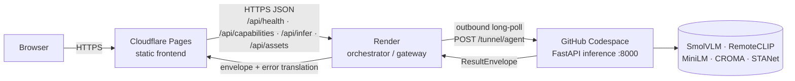

# Deployment

**Status tags:** `IMPLEMENTED` · `VERIFIED` · `MEASURED` · `OPEN` · `DEFERRED` · `BLOCKED` · `BY DESIGN`.

The live SatQuery AI system runs across **three private repositories** plus one **public umbrella
repository**, serving a **static frontend** on Cloudflare Pages, a **thin orchestrator / gateway** on
Render, and a **CPU inference service** in a GitHub Codespace reached over an **outbound tunnel**. The
monorepo working copy is **not** the deployed source.

This document is the exhaustive deployment reference: the four tiers, every live revision, every
environment variable (with measured live values), the deploy mechanics per tier, cold-start
behaviour, the five historical backend blockers, the platform traps, and the superseded design that
the active one replaced. It is written to be readable *without* the source tree, but every non-obvious
claim carries the file it came from.

> **The single most important trap in this document.** `deploy/` inside the monorepo is **stale and
> untracked**. It is **not** the deployed source. The deployed backend is `SatQuery-Backend/main.py`;
> the monorepo's `deploy/render/main.py` is an earlier, tunnel-less revision. Edits must go to the
> three real repositories, never to the local `deploy/` tree.

> **Hostnames are deliberately not published.** The orchestrator's public hostname appears throughout
> this release as `<backend-host>`. The deployment is documented for reproducibility — the topology,
> the environment-variable *names*, the timeout chain and the failure modes are all exact — without
> advertising the live endpoint. The three deployment repositories are private and are not part of
> this release.

**Companions.** [`architecture/02-deployment-topology.md`](architecture/02-deployment-topology.md)
(the long-form topology treatment), [`OPERATIONS.md`](OPERATIONS.md) (running the live system),
[`SECURITY.md`](SECURITY.md) (the trust boundary),
[`architecture/10-observability-and-ops.md`](architecture/10-observability-and-ops.md) (health,
traces and the operator surface), [`LIMITATIONS.md`](LIMITATIONS.md) §4 (operational limitations),
[`RESEARCH_NOTES.md`](RESEARCH_NOTES.md) §6 (the `auto`-mode fallthrough), and
[`TESTING.md`](TESTING.md) (how the deploy-time properties are tested).

---

## 1. How to read this document

| Convention | Meaning |
|---|---|
| **VERIFIED** | Read from a live endpoint, a git ref, or a file on disk during the release reconnaissance |
| **MEASURED** | A value with a recorded number and its source |
| **IMPLEMENTED** | Code exists; whether it ran is stated separately |
| **NOT RUN** | The work has not been executed |
| **OPEN** | A known defect or gap that is not closed |
| **BY DESIGN** | Deliberately absent, and the reason is recorded |
| **UNKNOWN** | `UNKNOWN — not established from the available evidence` |

Every revision, environment variable and finding below was read from a file or a live endpoint. Where
a value could not be established, the text says so rather than guessing.

### 1.1 The three deploy sources versus the working copy

| Artifact | Location | Role |
|---|---|---|
| Frontend source | `Anish-lab-blip/SatQuery-Frontend` (private) | staged from the monorepo's `frontend/` contents |
| Backend source | `Anish-lab-blip/SatQuery-Backend` (private) | Render orchestrator (`main.py`, tunnel client) |
| Inference source | `Anish-lab-blip/SatQuery-Inference` (private) | Codespace FastAPI + `deploy/codespace/tunnel_agent.py` |
| Public umbrella | `Anish-lab-blip/SatQuery-AI` (public) | the intended release home |
| Working copy | `C:/Users/anish/satquery-ai` | **local only, no git remote** |

The working copy's `deploy/` is untracked (`git ls-files deploy/` returns empty) and stale. Its
`deploy/render/main.py` is a **tunnel-less** revision (532 lines by the project's own record); the
deployed `SatQuery-Backend/main.py` is **768 lines** and carries the tunnel client
(`docs/FINAL_DELIVERY_TODO.md` §1.1). The tunnel agent
(`deploy/codespace/tunnel_agent.py`) is **not present in the monorepo working copy at all** — it lives
in the `SatQuery-Inference` repository, and the monorepo's `deploy/codespace/launch.sh` refers to it as
a path that only exists in the deployed checkout.

---

## 2. Live revisions (VERIFIED)

Read from the GitHub API during the release reconnaissance (`release/CURRENT_RELEASE_STATE.md` §1).

| Component | Repository | Visibility | Branch | Revision | Host |
|---|---|---|---|---|---|
| Frontend | `Anish-lab-blip/SatQuery-Frontend` | **private** | `main` | **`2d7ae53b482d`** | Cloudflare Pages → `satquery.pages.dev` |
| Backend / orchestrator | `Anish-lab-blip/SatQuery-Backend` | **private** | `main` | **`89d80eaddec5`** | Render → `<backend-host>` |
| Inference | `Anish-lab-blip/SatQuery-Inference` | **private** | `main` | **`5a0936ace491`** | Codespace `potential-space-trout-r4ppw969w45j2pvvw`, port 8000 |
| Public umbrella | `Anish-lab-blip/SatQuery-AI` | **public** | `main` | `3dcabd32da41` ("Initial commit") | this release home |
| Monorepo (working copy) | `C:/Users/anish/satquery-ai` | local only | `master` | `9d57aed` | **no git remote**; 334 dirty entries |
| Hugging Face | `thundercode/SatQuery` | **public** | `main` | lastModified `2026-09-25T16:26:53Z` | 2 files only: `.gitattributes`, 25-byte `README.md` |

Notes that must not be smoothed over:

- The public umbrella `SatQuery-AI` contains **only** `README.md` (13 bytes: `# SatQuery-AI`). At the
  time of the reconnaissance it was effectively empty; it is the intended home for this release.
- The dirty-entry count is a **snapshot**. `release/CURRENT_RELEASE_STATE.md` §1 records **334** dirty
  entries at release reconnaissance; `docs/FINAL_DELIVERY_TODO.md` §1.1 records **323** (294 untracked,
  20 modified, 8 deleted) at an earlier capture. The working tree changed between the two captures.
- The three deployed repositories are **private**. Their GitHub links return `404` for an outside
  audience. This is **BY DESIGN** (see §11.4).
- The Hugging Face repository `thundercode/SatQuery` carried **only two files** at reconnaissance
  (`.gitattributes` and a 25-byte `README.md`). It is **not** the runtime inference host; the Codespace
  resolves pinned backbones from the Hub at run time.

### 2.1 A note on the "HEAD re-read" verification

Nine deployed frontend files were re-read from the GitHub API and found **sha256 byte-identical** to
the local copies, with the deployed HEAD re-read independently (`verify_deployed_head.py`,
`release/CURRENT_RELEASE_STATE.md` §5). Three live-validation passes ran against successive HEADs:
pass 1 against `ff46eba42b18` + `d413d3672311`, passes 2 and 3 against the final HEAD `2d7ae53b482d`.
No run id is shared between passes.

---

## 3. The four tiers

```
Browser
  │  HTTPS
  ▼
Cloudflare Pages  —  satquery.pages.dev                (static frontend, 11 pages)
  │  HTTPS / JSON  →  /api/*
  ▼
Render            —  <backend-host> (orchestrator / gateway)
  │  outbound long-poll  POST /tunnel/agent
  ▼
GitHub Codespace  —  FastAPI inference, CPU, port 8000
  │  build_space_app()
  ▼
specialists: SmolVLM · RemoteCLIP · MiniLM · CROMA · STANet
  │
  ▼
ResultEnvelope  →  tunnel  →  Render  →  browser
```



The important inversion: the middle arrow is **outbound from the inference host**, not inbound to it.
That is the whole reason the design works for a private repository (§4).

### 3.1 Cloudflare Pages — the static tier

Serves the frontend. **No backend, no secrets, and no API calls of its own** on the static pages. The
one exception is the Analyze console (`mission.html`), which calls the gateway.

- **Staged by:** `scripts/stage_pages.mjs` (builds a Pages bundle).
- **Deployed with:** `npx wrangler pages deploy`.
- **Deploy result (measured, `docs/DEPLOYMENT_DECISION.md` §7):** 60 files staged, 39,173,936 B
  (37.36 MiB) total, largest file `assets/video/satquery-launch-50s.mp4` at 22,710,313 B (21.66 MiB),
  with 3,504,087 B of headroom under the 25 MiB per-file limit; 0 missing references; **0 external
  network dependencies (HERMETIC)**; exit 0.
- **Env vars:** none (static). The Pages project name / domain is still open (§12).

> **The hermetic claim is scoped.** `docs/DEPLOYMENT_DECISION.md` §3 audited `frontend/` (excluding
> `.tools/`) and found zero occurrences of `fetch(`, `XMLHttpRequest`, `axios`, `EventSource`,
> `WebSocket`, `/v1/`, `import.meta.env` or `process.env`. `docs/DEPLOYMENT_TOPOLOGY.md` §3.1 narrows
> this: the "no API calls of any kind" statement holds for every **static** page **except**
> `mission.html`, which calls the orchestrator. The monorepo `README.md`'s older claim that the
> frontend is "hermetic — no backend calls" is materially stale.

### 3.2 Render — the gateway

A deliberately **thin, stateless** orchestrator. It holds **no model, no state, no database**, and
performs **no auth** (`deploy/render/main.py` module docstring; plan §73/§74). Its responsibilities,
from `docs/DEPLOYMENT_ARCHITECTURE.md` §2:

| Responsibility | Detail |
|---|---|
| Schema validation | reject malformed requests before they cost inference |
| Size limits | whole-request body cap, shared with the Codespace |
| Rate limiting | per-IP count + window — **fairness, NOT a security control** (`docs/DEPLOYMENT_ARCHITECTURE.md` §5.2) |
| CORS allowlist | the Pages origin; **never `*`** |
| Request ids | correlate a request across tiers |
| Timeouts | sit inside the task budget (§7.5) |
| Secret custody | holds credentials that must never reach the browser |
| Error translation | upstream failures → the documented error envelope (§7.6) |

It is **not** a model host. It has **no database, no auth, and no queue**.

The gateway's proxied routes (from `deploy/render/main.py`):

| Gateway route | Upstream | Notes |
|---|---|---|
| `GET /api/health` | answered **locally** | reports the orchestrator's own config; never answers for the Codespace |
| `POST /api/infer` | `POST {codespace}/v1/analyze` | wake-then-proxy; sets `X-SatQuery-State: waking|ready` |
| `GET /api/capabilities` | `GET {codespace}/v1/capabilities` | **no second copy** of the capability table |
| `POST /api/assets` | `POST {codespace}/v1/assets` | raw/multipart body relayed verbatim |

> **Hard rule.** The gateway must **not** retry `POST /api/infer` on its own — a retry would consume
> inference a second time. The client decides on retry. The reason is recorded in code
> (`deploy/render/main.py` docstring; `docs/STEP7_BACKEND_CHAIN_REPORT.md` §11).

> **No second capability table.** The gateway proxies `/v1/capabilities` and nothing else decides
> "what can this deployment do?". The authoritative sources are `core.planner.CAPABILITY_ASSETS` and
> `SpecialistSpec.requires_assets` (`docs/DEPLOYMENT_ARCHITECTURE.md` §2.2).

#### 3.2.1 The CORS allowlist is assembled, not just read

`deploy/render/main.py::_allowed_origins` assembles the allowlist in a fixed order:

1. `SATQUERY_ALLOWED_ORIGINS` — the operator's comma-separated list (authoritative for extra origins).
2. `_PRODUCTION_ORIGINS` — `https://satquery.pages.dev`, **always present**, so a missing env var
   cannot take the live site down.
3. `_DEV_ORIGINS` — 10 explicit `host:port` pairs (`localhost` and `127.0.0.1` × ports
   `3000/5500/5173/8000/8080`), added unless `SATQUERY_ALLOW_DEV_ORIGINS` is one of `0`/`false`/`no`/`""`.

A wildcard `*` raises `ValueError` — checked both in `_allowed_origins` and in
`GatewayConfig.__post_init__`, because `CORSMiddleware` does not run that validator
(`deploy/render/main.py`). The list is deliberately explicit, never a regex or suffix match, so
allowing localhost for development cannot admit an arbitrary remote site. The health payload reports
the **effective** list, so a production deployment can prove from outside that the dev origins were
turned off.

#### 3.2.2 The wake flow

`deploy/render/main.py::ensure_codespace_up()` returns `(base_url, woke)`:

1. `GET` the Codespace via the GitHub API (`deploy/render/codespaces.py::get_codespace`).
2. If `state != "available"`, `POST .../start` (`start_codespace`; GitHub returns `202`, and `204` is
   also seen in practice).
3. Poll `GET {base}/v1/health` until `200` or until `SATQUERY_WAKE_TIMEOUT_S` elapses.

Polling knobs: `_WAKE_POLL_INTERVAL_S = 2.0`, `_WAKE_HEALTH_TIMEOUT_S = 10.0`
(`deploy/render/main.py`). The public base URL is derived by `forwarded_url()`, which prefers the
Codespace JSON's `web_url` and rewrites its trailing port segment, falling back to
`https://{name}-{port}.app.github.dev`. That host pattern is an **isolated assumption**: the module's
own docstring records that it "was **not verifiable from the build environment** (no live Codespace to
inspect)".

### 3.3 GitHub Codespace — the inference tier

Runs the real inference service: `build_space_app()` from `app/space_app.py`, served by
`deploy/codespace/serve.py` on `$PORT`, in **CPU mode**. It honours the four-endpoint contract
(`/v1/health`, `/v1/capabilities`, `/v1/analyze`, `/v1/assets`), imports cheaply without torch, reuses
`app/serving.py` as the composition root, and **degrades rather than crashes** on absent artifacts
(`docs/DEPLOYMENT_ARCHITECTURE.md` §3.3).

The serve entrypoint is deliberately tiny (`deploy/codespace/serve.py`):

```python
from app.space_app import build_space_app
import uvicorn

app = build_space_app()

if __name__ == "__main__":
    port = int(os.environ.get("PORT", "8000"))
    uvicorn.run(app, host="0.0.0.0", port=port)
```

The composition root (`app/serving.py::build_serving_controller`) resolves `device` from
`SATQUERY_DEVICE`. It wires three capabilities through the registry's `builders=` seam **without
editing `configs/base.yaml`**:

| Capability | Wired artifact | Why the seam |
|---|---|---|
| `change` | `artifacts/change/levir_change_v001/head.pt` | `change.checkpoint_path` is unset; adding it to config would move `Config.hash` |
| `change_vqa` | `artifacts/change_vqa/run/head.pt` + the same STANet | closes the F2 **train/serve skew** (training and serving must share one detector) |
| `optical_sar` | CROMA (resolved from the pinned identity) + `artifacts/optical_sar/fusion_head_production_v001/head.pt` | `croma.checkpoint_path` is unset, so the encoder was unreachable by default |

The seam is a **call-site argument** (`core/registry.py`'s `builders=` override), not config, so
`Config.hash` stays `78f1e3700da15aa1` (`app/serving.py` docstring). **Degrade, do not crash:** absent
artifacts yield `available: false` **with a reason**; *corrupt* artifacts raise `ModelLoadError`. The
two are deliberately not conflated.

#### 3.3.1 The Codespace launcher and its survivability design

`.devcontainer/devcontainer.json` sets `postStartCommand: bash deploy/codespace/launch.sh`, so the
inference server and the tunnel agent start on **every** Codespace start. `launch.sh` is more
defensive than it looks, and the reasons are recorded in the script:

- **Preflight (refuse to start half-configured).** It checks `import yaml, pydantic, fastapi, uvicorn,
  httpx` and `import app.space_app`, exiting non-zero with a diagnostic if either fails. `httpx` is
  checked explicitly because `tunnel_agent.py` imports it directly and it was previously absent from
  `requirements.txt`, so the agent "died instantly and the supervised restart loop hid the error in a
  log file".
- **Stale-serve detection.** A stamp file (`/tmp/satquery-serve.stamp`) records `rev=<HEAD>
  asset_enabled=<…> asset_dir=<…>`. If the running server's stamp disagrees with the current checkout
  and environment, the serve process is restarted, because "a stale serve process is worse than no
  process: it answers `/v1/health` and `/v1/capabilities` from OLD code".
- **The tunnel agent is supervised and immortal.** `setsid` alone is not enough in Codespaces — the
  lifecycle shell that runs `postStartCommand` can still reap the process group, which "showed up in
  production as 'the agent announced once, then vanished'". The launcher therefore uses
  `setsid + nohup + </dev/null` around a supervising `while true` wrapper that re-launches the agent
  if it exits, so the agent is "effectively immortal for the life of the Codespace".
- **Post-launch verification.** After a 4-second wait it checks the agent process is alive and that
  the log contains a successful announce (`announced to hub`), because "backgrounding with all output
  discarded means a crashing agent is completely invisible".

> `launch.sh` refers to `bash deploy/codespace/doctor.sh` in two diagnostics. `doctor.sh` is **not
> present in the monorepo working copy**; it lives in the deployed `SatQuery-Inference` checkout.
> `UNKNOWN — not established from the available evidence` whether it is present in that repository, as
> the private repository was not readable for this documentation pass.

#### 3.3.2 The `warm_cache.py` pre-warm

`deploy/codespace/post_create.sh` (`postCreateCommand`) installs the lean CPU requirements and runs
`python deploy/codespace/warm_cache.py`, which pre-downloads the pinned HF models into the HF cache so
the first `/v1/analyze` is fast. It is idempotent, reports per-model OK/SKIPPED/FAILED status, and
never aborts on a single miss (`deploy/codespace/README.md`).

### 3.4 Hugging Face — the model tier

Holds the six trained artifacts and the model card. It is **not** the runtime inference host; the
Codespace resolves the pinned backbones from the Hub at run time. At reconnaissance the public
repository `thundercode/SatQuery` contained **two files only** (`.gitattributes` and a 25-byte
`README.md`) — the model card / weights publication is a separate workstream from this deployment.

---

## 4. Why the transport is an outbound tunnel

The inference host is a Codespace in a **private** repository. A forwarded port for a private repo
returns **`302`**, so an inbound-forwarding design cannot work. Instead:

- the Codespace runs `deploy/codespace/tunnel_agent.py` (from `SatQuery-Inference`);
- the agent **dials out** to `POST /tunnel/agent` and long-polls;
- work is executed against `http://127.0.0.1:8000` **locally**.

This inverts the usual direction: the inference host needs **no inbound firewall hole**, and GitHub's
port-forwarding relay, port visibility and the repository's visibility are all irrelevant. It also
means the transport is only alive while the agent is polling.

**Measured:** `GET /api/health` reported `tunnel.agent_connected: true` with a non-zero `completed`
counter, and `POST /api/infer {}` returned `422 invalid_request` with the response header
`x-satquery-transport: tunnel` (`release/CURRENT_RELEASE_STATE.md` §1; `docs/FINAL_DELIVERY_TODO.md`
§6 E-03).

When the Codespace is stopped, the agent stops polling → `GET /api/health` reports
`tunnel.agent_connected: false` and `POST /api/infer` parks until `SATQUERY_TUNNEL_TIMEOUT_S` (150 s),
then returns `tunnel_offline` (503, `recoverable: true`) (`docs/DEPLOYMENT_TOPOLOGY.md` §2).

> **The forwarded-port path is dead**, not merely unused: it returns `302` for the private repo. The
> GitHub-API wake path (`POST /user/codespaces/{name}/start`) still exists in
> `deploy/render/codespaces.py`, but the tunnel design relies on the agent reconnecting on Codespace
> start via the devcontainer `postStartCommand`.

---

## 5. The full live health payload (VERIFIED, probed)

```json
{
  "status": "ok",
  "service": "satquery-orchestrator",
  "tunnel": {
    "agent_connected": true,
    "agent_id": "codespaces-fd1038",
    "pending": 0,
    "completed": 97
  },
  "config": {
    "codespace_name": "potential-space-trout-r4ppw969w45j2pvvw\n",
    "codespace_port": 8000,
    "transport_mode": "auto",
    "tunnel_timeout_s": 150.0,
    "wake_timeout_s": 120.0,
    "upstream_timeout_s": 90.0,
    "device": "cpu",
    "has_github_token": true
  }
}
```

Source: `release/CURRENT_RELEASE_STATE.md` §1. The `completed` counter is a live, monotonically
increasing value — later captures recorded `completed: 314` (`docs/FINAL_DELIVERY_TODO.md` §1.4) and
`completed: 338` (`docs/FINAL_DELIVERY_REPORT.md` §3). The count is a runtime fact, not a fixed
constant; do not quote it as a stable figure.

Two things in this payload are load-bearing:

1. **`codespace_name` still carries a trailing `\n`.** This is **B-02**, cosmetic and `OPEN`; the wake
   path strips it (`_codespace_name()` calls `.strip()`), so only the `/api/health` reporting payload
   shows the raw value (§8.2).
2. **`transport_mode` is `auto`.** This is the root shape of **B-07** (§8.1).

### 5.1 The live capability contract (VERIFIED, probed)

`GET /api/capabilities` → `schema_version 1.0`, **six entries, all `available: true`**
(`release/CURRENT_RELEASE_STATE.md` §1):

| task | requires_pair | max_assets | notes |
|---|---|---|---|
| `vqa` | false | 1 | SmolVLM weights fetched from the HF Hub on first use |
| `caption` | false | 1 | SmolVLM weights fetched from the HF Hub on first use |
| `grounding` | false | 1 | RemoteCLIP encoder fetched from the HF Hub on first use |
| `change` | true | 2 | — |
| `change_vqa` | true | 2 | — |
| `optical_sar` | true | 2 | `modalities: ["optical","sar"]` |

The capability table is served by the **single adapter** `app/deployment.py`, derived from the
registry's spec table plus filesystem presence. The adapter emits only contract vocabulary
(`loaded`/`absent`/`unavailable`/`not_requested`/`evicted`) and — precisely because it must not load a
model to answer a metadata request — it **never emits `loaded` or `evicted`**
(`docs/DEPLOYMENT_ARCHITECTURE.md` §3.3.1). `available: false` always carries a non-null `reason`.

---

## 6. Environment variables

### 6.1 Render (gateway) — measured live values

| Variable | Value (live) | Purpose |
|---|---|---|
| `CODESPACE_NAME` | `potential-space-trout-r4ppw969w45j2pvvw` | which Codespace to wake |
| `CODESPACE_PORT` | `8000` | the inference port |
| `SATQUERY_ALLOWED_ORIGINS` | `https://satquery.pages.dev` | CORS allowlist (never `*`) |
| `SATQUERY_DEVICE` | `cpu` | device preference |
| `SATQUERY_TRANSPORT` | `auto` | tunnel first, then forward (§8.1) |
| `SATQUERY_TUNNEL_TIMEOUT_S` | `150` | how long to wait on the tunnel |
| `SATQUERY_WAKE_TIMEOUT_S` | `120` | how long to wait for a cold start |
| `SATQUERY_UPSTREAM_TIMEOUT_S` | `90` | gateway → upstream budget |
| `GITHUB_TOKEN` | present | Codespace control (existence only; never recorded here) |
| `PORT` | platform-supplied | Render's own listen port |

Source: `docs/DEPLOYMENT_TOPOLOGY.md` (measured 2026-09-25 live note) and
`release/CURRENT_RELEASE_STATE.md` §1.

`render.yaml` in the monorepo declares the blueprint's env vars: `PORT`, `SATQUERY_ALLOWED_ORIGINS`,
`GITHUB_TOKEN`, `CODESPACE_NAME` (`sync: false` — set in the dashboard), plus `CODESPACE_PORT: "8000"`,
`SATQUERY_DEVICE: "cpu"`, `SATQUERY_WAKE_TIMEOUT_S: "120"`, `SATQUERY_UPSTREAM_TIMEOUT_S: "90"`
(`render.yaml`). The blueprint does **not** declare `SATQUERY_TRANSPORT` or `SATQUERY_TUNNEL_TIMEOUT_S`
— those are set in the live dashboard and are part of the deployed `SatQuery-Backend` revision, not the
monorepo's stale blueprint.

> **Measured absence.** There is **no** `SATQUERY_UPSTREAM_URL` and **no** `HF_TOKEN` in the live
> config. The transport is the outbound tunnel, not a forwarded port. This contradicts the older
> `docs/DEPLOYMENT_TOPOLOGY.md` §3.2 table and `docs/DEPLOYMENT_ARCHITECTURE.md` §4, which predate the
> tunnel design (`release/CURRENT_RELEASE_STATE.md` §1 note; `docs/FINAL_DELIVERY_TODO.md` §1.7 item 4).

### 6.2 Codespace (inference)

| Variable | Purpose |
|---|---|
| `PORT` | platform-assigned; **must be read** (historical blocker #2, §9) |
| `SATQUERY_DEVICE` | `cpu` \| `cuda` \| `mps` \| `null`; read **without importing torch** |
| `SATQUERY_MAX_FILE_BYTES` | per-file cap, shared with Render so the two layers cannot disagree |
| `SATQUERY_ASSET_ENABLED` / `SATQUERY_ASSET_DIR` | both required for `/v1/assets`; **fails closed (503)** otherwise |
| `SATQUERY_ASSET_MAX_FILES` / `SATQUERY_ASSET_TTL_S` | optional handle capacity / lifetime |
| `SATQUERY_HUB_URL` | the Render orchestrator the tunnel agent dials out to; default `https://<backend-host>` |

Sources: `docs/DEPLOYMENT_TOPOLOGY.md` §3.3; `deploy/codespace/launch.sh`.

`.devcontainer/devcontainer.json` sets `containerEnv`: `SATQUERY_DEVICE=cpu`, `PORT=8000`,
`SATQUERY_ASSET_ENABLED=1`, `SATQUERY_ASSET_DIR=/tmp/satquery-assets`. The launcher re-exports the
asset variables on every start because `containerEnv` is only applied when the container is
**created** — "setting it there alone would leave an already-running Codespace unconfigured until a
rebuild. This script runs on every start and is therefore the effective source of truth"
(`deploy/codespace/launch.sh`).

Asset-store defaults, from `docs/DEPLOYMENT_ARCHITECTURE.md` §4: handle capacity `32`, TTL `900 s`. A
malformed or non-positive value falls back to the default rather than becoming a zero TTL. The store
**refuses rather than evicts** a live handle, so a full store answers `503` (ambiguous with an
unconfigured store — see `docs/DEPLOYMENT_ARCHITECTURE.md` §5.1).

### 6.3 Config-loader environment overrides

Two registry values can be overridden from the environment **without editing the YAML**
(`core/config.py`):

| Variable | Effect |
|---|---|
| `SATQUERY_PRECISION` | overrides `training.precision` |
| `SATQUERY_TORCH_COMPILE` | overrides `deployment.torch_compile` (`"true"` → `True`) |

Both are still validated by the loader. Setting `SATQUERY_TORCH_COMPILE=true` **fails startup**,
because finding **C-8** forbids `torch.compile` on the (historical) ZeroGPU target — and the loader
hard-fails on `deployment.torch_compile is True` (`core/config.py`; `configs/deploy.yaml` header;
`docs/STEP8_FINAL_CONFORMANCE_AUDIT.md` §6.1). This is an example of the loader refusing an incoherent
configuration rather than silently accepting it.

### 6.4 The environment-variable vocabulary, and where it moved

The active design kept the **env-var vocabulary** and moved only the host names. The superseded
design used `SATQUERY_SPACE_URL`; the tunnel design uses the Codespace name/port pair plus
`SATQUERY_HUB_URL` on the inference side (`docs/DEPLOYMENT_TOPOLOGY.md` §5). The older
`SATQUERY_UPSTREAM_URL` name is **not** set live.

---

## 7. Deploy mechanics per tier

| Tier | Mechanism |
|---|---|
| Frontend → Cloudflare Pages | `scripts/stage_pages.mjs` builds a Pages bundle; `npx wrangler pages deploy` |
| Backend → Render | `render.yaml` blueprint; `main.py` exposes the ASGI object `app` |
| Inference → Codespace | `deploy/codespace/serve.py` binds `build_space_app()` to `$PORT`; `.devcontainer/` forwards 8000 and starts the tunnel agent via `postStartCommand` |
| Repository writes | the **GitHub Git Data API** — blob → tree → commit → `PATCH` ref |

### 7.1 Frontend deploy (measured)

```bash
cd C:/Users/anish/satquery-ai

node scripts/stage_pages.mjs \
  --out=.deploy/dist-final \
  --include=_headers \
  --include=robots.txt \
  --include=assets/img/eo/provenance.json \
  --include=assets/img/eo/CREDITS.md

npx wrangler pages deploy "C:/Users/anish/satquery-ai/.deploy/dist-final" --project-name <name>
```

(`docs/DEPLOYMENT_DECISION.md` §7.) `_headers` and `robots.txt` must be **force-included** because no
page references them; `provenance.json` and `CREDITS.md` likewise. The measured staging result is
quoted in §3.1.

> **`_headers` cannot un-cache an asset — it concatenates.** See §10 for the Cloudflare trap and the
> cache-busting consequence (the EO pair was renamed to new `-720` URLs rather than given a new rule).

### 7.2 Backend deploy

`render.yaml` is the blueprint: `runtime: python`, `plan: free`, `buildCommand: pip install -r
deploy/render/requirements.txt`, `startCommand: uvicorn deploy.render.main:app --host 0.0.0.0 --port
$PORT`, `healthCheckPath: /api/health`. The deployed `SatQuery-Backend` repository is the source of
truth; the monorepo's `render.yaml` is a snapshot of the tunnel-less revision.

### 7.3 Inference deploy

`deploy/codespace/serve.py` binds `build_space_app()` to `$PORT`. `.devcontainer/devcontainer.json`
forwards `8000` as **public** and runs `launch.sh` on every start. The launcher's stale-serve detection
(§3.3.1) means a code or environment change causes the running server to be restarted rather than left
answering from old code.

### 7.4 Repository writes: the GitHub Git Data API

Every deployed file is uploaded as a **blob** whose sha256 is **computed locally and verified against
the uploaded blob**, then assembled into a **tree**, **committed**, and the branch **ref patched**
(`blob → tree → commit → PATCH ref`). This means:

- each file is **content-verified** rather than trusted;
- deletions are expressed explicitly as **`sha: null`** tree entries;
- the deploy is **idempotent** — re-running it with identical content produces no change.

**Measured:** 9 deployed files were re-read from the API and found **sha256 byte-identical** to the
local copies, with the deployed HEAD re-read independently (`verify_deployed_head.py`;
`release/CURRENT_RELEASE_STATE.md` §5).

### 7.5 The timeout relationship (do not invert)

```
gateway upstream timeout  <  agent.timeout_seconds  ≤  the inference host's own request budget
```

Both bounds are **derived from the frozen config**, not chosen
(`docs/BACKEND_DEPLOYMENT_RUNBOOK.md` §4.2):

| Quantity | Value | Source |
|---|---|---|
| `agent.timeout_seconds` | **120 s** | `configs/base.yaml` |
| `gpu_duration_vqa` | **20 s** | `configs/deploy.yaml` |
| `gpu_duration_grounding` | **45 s** | `configs/deploy.yaml` |
| `gpu_duration_change` | **30 s** | `configs/deploy.yaml` |
| `gpu_duration_optical_sar` | **45 s** | `configs/deploy.yaml` |
| Largest single `gpu_duration_*` | **45 s** | derived |

So the upstream timeout belongs **above 45 s** (the longest a single call may run) and **below 120 s**
(the host's own request budget). `GatewayConfig.__post_init__` refuses a timeout ≤ 45 s and ≥ 120 s
(`docs/PHASE19_FINAL_HARDENING.md` §3.2). The live value is `SATQUERY_UPSTREAM_TIMEOUT_S = 90`.

### 7.6 The error contract

Upstream failures are wrapped in the v1 envelope
`{"error": {"code", "message", "detail", "recoverable"}}` (`deploy/render/main.py` docstring;
`docs/DEPLOYMENT_ARCHITECTURE.md` §2.3):

| Condition | Status | `recoverable` | Code |
|---|---|---|---|
| Connection error to the Codespace | `502` | `true` | `upstream_unreachable` |
| Wake times out | `504` | `true` | `wake_timeout` |
| Non-JSON upstream body | `502` | `true` | `schema_validation_error` |
| Missing `GITHUB_TOKEN` / `CODESPACE_NAME` | `500` | `false` | `orchestrator_config_error` |
| Malformed request JSON | `400` | `false` | `invalid_request` |

The `code` is passed through **unchanged** — the gateway must not remap the taxonomy in
`core/errors.py`, because a gateway that remapped codes would make the frontend's error handling
unpredictable (`docs/DEPLOYMENT_ARCHITECTURE.md` §2.3). A non-JSON upstream error is never relayed
verbatim (defect **G-4**, `docs/STEP7_BACKEND_CHAIN_REPORT.md` §13).

---

## 8. Cold start (documented, not hidden)

Render's free tier sleeps when idle, and the Codespace may be stopped. Before a request can be served,
Render must start the Codespace (if stopped) and wait for the tunnel agent to reconnect. The frontend
shows *"Waking inference engine…"* during this.

| Property | Value |
|---|---|
| Cold start | **tens of seconds** |
| Tunnel wait before falling through | `SATQUERY_TUNNEL_TIMEOUT_S` = 150 s |
| Wake wait | `SATQUERY_WAKE_TIMEOUT_S` = 120 s |
| Upstream budget | `SATQUERY_UPSTREAM_TIMEOUT_S` = 90 s |
| Codespace idle timeout | 30 min (GitHub REST: `idle_timeout_minutes=30`) |

Sources: `docs/DEPLOYMENT_TOPOLOGY.md` §2; `docs/FINAL_DELIVERY_TODO.md` §6 E-04.

Cold start is **documented rather than papered over**: an honest "this will take a while the first
time" is better than a silent hang.

### 8.1 The `transport_mode: auto` fallthrough — B-07 (`OPEN`)

`SATQUERY_TRANSPORT=auto` means: **try the tunnel; on timeout, fall through to the forward path.**

The forward path to a **private** repo returns `302` quickly — but the wake step still consumes
`SATQUERY_WAKE_TIMEOUT_S` (120 s) **first**. So a worst-case failed request takes roughly

```
150 s (tunnel timeout)  +  120 s (wake timeout on a 302)  ≈  249 s
```

This is the **root shape** of the observed transient tunnel gap, and it is why a request can appear to
hang and then fail (`release/CURRENT_RELEASE_STATE.md` §6; `docs/FINAL_DELIVERY_TODO.md` §5 B-07:
"in `auto` transport mode a tunnel timeout **falls through** to the forward path
(`SatQuery-Backend/main.py:546`), which then burns `wake_timeout_s=120` on a 302 → the observed 504").

A patch (`fix-b07-forward-unavailable.patch`) was authored and verified (`git apply --check` clean,
`py_compile` clean, applies to the deployed `89d80eaddec5`). It adds:

- `forward_unavailable` (**503**, terminal `302`/`401`/`403` on the forward path), and
- `upstream_timeout` (**504**, tunnel healthy but slow), and
- the `codespace_name` `.strip()` fix.

> **Status: B-07 is `OPEN`.** The patch is **prepared but NOT deployed.** The deployed health payload
> still shows the trailing `\n` and the fallthrough remains live.

### 8.2 B-02 — the trailing newline (`OPEN`, cosmetic)

The `/api/health` payload reports `codespace_name` with a trailing `\n`. This is **B-02**, confirmed
**still live** during the reconnaissance. It is **cosmetic**: the wake path is safe because
`_codespace_name()` calls `.strip()` (`SatQuery-Backend/main.py:123-124`) and the wake path uses it
(`main.py:357`); only the health-reporting payload (`main.py:619`) reads the raw env var
(`docs/FINAL_DELIVERY_TODO.md` §4 P2-T03). Fix = change line 619 to `_codespace_name()`, then Render
redeploys. **Deferred** because a live-backend redeploy before the demonstration was not judged worth
the risk. **Status: `OPEN` (cosmetic).**

---

## 9. The five historical backend blockers

Before any backend could boot, five verified blockers had to be closed. Each was re-verified as a real
blocker (`docs/DEPLOYMENT_DECISION.md` §8), and the current design closes them:

| # | Blocker (verified) | How it is closed |
|---|---|---|
| 1 | `requirements.txt` declared no `fastapi` / `uvicorn` / `httpx` / `starlette` | the runtime installs the ASGI stack so `build_space_app()` and the gateway can import |
| 2 | no code read `$PORT` — a platform port would be ignored | `deploy/codespace/serve.py` binds to `$PORT`; Render reads its own |
| 3 | hand-rolled CORS raised `405` on `OPTIONS`, so browser preflight failed | the gateway registers `OPTIONS` explicitly / uses Starlette's `CORSMiddleware` |
| 4 | module-level `app = create_app()` swallowed config errors into `app = None` | construction errors now **propagate** (fail-fast) instead of leaving a dead `app` |
| 5 | adapter integrity unverified on load (`_adapter_sha256` computed but never compared) | the load path compares the digest against an expected value, or fails startup |

`docs/DEPLOYMENT_TOPOLOGY.md` §4 records these honestly as "closed by construction / to be verified on
the first live run" at the time it was written. The live system subsequently ran and served all six
tasks (`docs/FINAL_DELIVERY_REPORT.md` §4), which is the evidence that the blockers are closed in
production.

### 9.1 The defects the first real run found

`docs/STEP7_BACKEND_CHAIN_REPORT.md` §13 records that the ASGI layer had never executed, and that
running it surfaced four live defects immediately:

| ID | Defect | Severity | Status |
|---|---|---|---|
| **G-1** | `request: Request` never resolved (an in-function import left `Request` out of `__globals__`), so **every POST body was misread as a missing query parameter** and no handler ever ran | **Critical** | **FIXED** |
| **G-2** | an unsupported `force_task` enum value was forwarded upstream instead of refused locally | High | **FIXED** |
| **G-3** | an empty `HF_TOKEN` produced `Authorization: Bearer `, which httpx rejects → a crash reported as an upstream failure | High | **FIXED** |
| **G-4** | a non-JSON upstream error body was relayed verbatim, breaking the error contract and leaking internal text | High | **FIXED** |

The lesson recorded there is worth carrying: "the first hour of actually running the gateway found a
critical defect that had been invisible for as long as nobody could run it". The gateway is the
validation boundary; a gateway that misreads every body while the tests stay green is exactly the
failure a documented blocker hides.

---

## 10. Platform traps (recorded so they are not rediscovered)

| Trap | Detail |
|---|---|
| **Cloudflare `_headers` CONCATENATE** | Two matching rules are **merged, not overridden**. A specific rule nested under a broad `/assets/img/*` rule yields `max-age=604800, …, max-age=0, must-revalidate` — and Chromium takes the **FIRST** `max-age`. The file's own "later rules override" comment is **false**. Measured live 2026-09-25 (`docs/FINAL_DELIVERY_TODO.md` §1.7 item 9). |
| **Cloudflare 308 redirect** | `X.html` → `/X`. Reference the extensionless path. |
| **Forwarded port returns 302** | for a private repo — this is *why* the tunnel exists (§4). |
| **Tunnel agent must start on boot** | via the devcontainer `postStartCommand`, or a restarted Codespace comes up with `agent_connected: false`. |
| **Never retry `/api/infer` at the gateway** | a retry consumes inference twice (§3.2). |
| **`deploy/` is stale and untracked** | not the deployed source (§1.1). |
| **Edge-cache serves deleted files** | The old EO pair URLs still answer `200` from Cloudflare's edge cache (`CF-Cache-Status: HIT`, `Age: 1076`) although the files are deleted; a cache-busted request returns `404`. Nothing references them (`LIVE_VALIDATION_POSTFIX.md`, "Known residuals"). |
| **`containerEnv` applies only at container creation** | hence `launch.sh` re-exports the asset variables on every start (§6.2). |
| **`setsid` alone does not survive `postStartCommand`** | the lifecycle shell can reap the process group; the launcher uses `setsid + nohup + </dev/null` plus a supervising wrapper (§3.3.1). |

---

## 11. The superseded design, and what did NOT change

The earlier design ran inference on an **HF Space with ZeroGPU** (5 GPU-min/day, `@spaces.GPU`
decoration) behind a **Railway** gateway (`docs/DEPLOYMENT_ARCHITECTURE.md` §1;
`docs/DEPLOYMENT_TOPOLOGY.md` §5). The active design changes three things:

1. **CPU-first instead of ZeroGPU.** No code change was required — `device_preference` honours
   `SATQUERY_DEVICE` and defaults to CPU, every specialist defaults to `device="cpu"`, and all
   placement is `.to(device)` (never `.cuda()`). ZeroGPU's GPU-minute quota and `@spaces.GPU`
   decoration are no longer on the critical path (`docs/DEPLOYMENT_DECISION.md` §5).
2. **A real, always-buildable inference environment.** A Codespace gives a reproducible container
   without a GPU quota or a Space's cold-start constraint. The wake flow replaces ZeroGPU lazy loading
   as the cold-start story.
3. **No GPU quota to protect at the gateway.** Rate/size limits remain, but as **fairness** controls
   rather than quota protection.

**What did NOT change:**

| Unchanged | Detail |
|---|---|
| the four-endpoint contract | `/v1/health`, `/v1/capabilities`, `/v1/analyze`, `/v1/assets` |
| the gateway responsibility table | §3.2 above |
| the env-var vocabulary | only host names moved (`SATQUERY_SPACE_URL` → the Codespace name/port pair) |
| the config freeze | `78f1e3700da15aa1` |

`configs/deploy.yaml` still describes the old HF-Space/ZeroGPU target (`platform: huggingface-spaces`,
`sdk: gradio`, `zerogpu: true`, the `gpu_duration_*` values). It is **frozen paperwork**: no Gradio
runtime exists in code, and editing it would move `Config.hash`. It is left undisturbed
(`docs/DEPLOYMENT_DECISION.md` §4; `configs/deploy.yaml` header).

### 11.1 The ZeroGPU/Gradio target, in full, and why it is inert

`configs/deploy.yaml` carries `registry: false`, which makes its non-membership in the config registry
machine-readable; `core/config.py` reads exactly one file (`configs/base.yaml`) through a single
`yaml.safe_load` and never globs `configs/*.yaml`. `scripts/validate_deploy_config.py` asserts the
manifest is inert and that its `deployment:` block is byte-for-byte equal to `configs/base.yaml`'s.
There is **no Gradio runtime**: no `import gradio`, no `gr.Blocks`, no `gr.Interface`, and the one
ZeroGPU code path — `spaces.GPU(duration=…)` inside `decorate_gpu()` — "is never applied to any
route"; routes use plain `@api.get`/`@api.post` (`docs/DEPLOYMENT_DECISION.md` §4). The real
entrypoint is FastAPI: `build_space_app()`.

> The `spaces` package is not installed, so the `@spaces.GPU(duration=…)` path has **never executed**;
> `decorate_gpu()` returns an identity decorator when `spaces` is absent, which is the correct CPU
> behaviour (`docs/PHASE19_FINAL_HARDENING.md` §5.2). **Status: REJECTED (superseded; frozen
> paperwork only).**

### 11.2 The stale `hf/` docs

`hf/SETUP.md` and `hf/README.md` assert that the project "does not own any model weights … ships no
weights, no binaries, and no large artifacts" and that "this environment has no Hugging Face
credentials". Both were **false** at release time — six trained artifacts exist
(`release/CURRENT_RELEASE_STATE.md` §6). This is a documentation defect, not a deployment defect; it is
recorded in [`LIMITATIONS.md`](LIMITATIONS.md) §6.

### 11.3 The stale monorepo `README.md`

The monorepo `README.md` calls the frontend *"hermetic — no backend calls"* (it calls `/api/*` on
Render), puts Render/Codespace as *"in progress"* (both deployed), describes a 4-endpoint `/v1/*`
contract (the live gateway contract is `/api/*`), omits the tunnel, and points at the stale untracked
`deploy/` as the deployment source (`release/CURRENT_RELEASE_STATE.md` §6).

### 11.4 Why the three deploy repos are private

`SatQuery-Frontend`, `SatQuery-Backend` and `SatQuery-Inference` are **private**; their links `404` for
an outside audience. This is **BY DESIGN** — the public umbrella `SatQuery-AI` is the audience-facing
home. The only public code repository at reconnaissance was `Anish-lab-blip/SatQuery-AI`
(`docs/FINAL_DELIVERY_TODO.md` §4 P9-T01).

---

## 12. Deployment preconditions (open items)

1. **Cloudflare Pages project name / domain** — needed for the deploy command and the `Sitemap:` line
   in `robots.txt`. `sitemap.xml` was deliberately **not** created because it needs a canonical
   production domain (`docs/DEPLOYMENT_DECISION.md` §6).
2. **Artifacts present, or capabilities honestly ship `available: false`** — the service degrades
   rather than crashes on absent artifacts.
3. **`HF_TOKEN` on Render _if_ the HF proxy path is used** — not used in the live config (measured
   absence, §6.1).
4. **Codespace `.devcontainer/` forwarding `:8000` and starting the tunnel agent** — both present in
   the live deployment.
5. **The five blockers in §9 closed and verified on the first live run** — closed; the live system
   served all six tasks (`docs/FINAL_DELIVERY_REPORT.md` §4).
6. **The B-07 patch deployed** — **NOT done**; B-07 remains `OPEN` (§8.1).

---

## 13. What is `NOT RUN` / `OPEN` / `BLOCKED` for this topic

| Item | State |
|---|---|
| B-07 tunnel fallthrough (`auto` mode ≈ 249 s worst case) | **OPEN** — patch prepared, **NOT deployed** |
| B-02 `codespace_name` trailing `\n` | **OPEN** (cosmetic) |
| A deployed system-level load test | **NOT RUN** |
| Multi-region / HA deployment | **NOT RUN** |
| A production database / persistence | **BY DESIGN** (absent) |
| Auth / user accounts / queue | **BY DESIGN** (absent; plan §73/§74) |
| The ZeroGPU/Gradio deployment target | **REJECTED** (superseded; frozen paperwork only) |
| `doctor.sh` present in the deployed Inference repo | `UNKNOWN — not established from the available evidence` |
| A latency benchmark of the deployed path | **NOT RUN** (see [`PERFORMANCE.md`](PERFORMANCE.md), [`LIMITATIONS.md`](LIMITATIONS.md) §3) |

---

## 14. Where the evidence lives

| Evidence | Location |
|---|---|
| Live health + capabilities probe | `release/CURRENT_RELEASE_STATE.md` §1 |
| Active topology contract | `docs/DEPLOYMENT_TOPOLOGY.md` |
| Backend contract (gateway responsibilities, env vocabulary, failure modes) | `docs/DEPLOYMENT_ARCHITECTURE.md` §1.1, §2, §3.3, §4, §5 |
| Deployment decision + the frozen HF manifest | `docs/DEPLOYMENT_DECISION.md` |
| Operator runbook (local verification, timeout window, rollback) | `docs/BACKEND_DEPLOYMENT_RUNBOOK.md` |
| Deployment packaging / open items | `docs/PHASE18_DEPLOYMENT_PACKAGING.md` |
| Final hardening + ASGI defects | `docs/PHASE19_FINAL_HARDENING.md`, `docs/STEP7_BACKEND_CHAIN_REPORT.md` |
| The undeployed B-07 patch | session scratch: `fix-b07-forward-unavailable.patch` |
| Deployed-artifact integrity check | `verify_deployed_head.py` (session scratch) |
| Live validation (3 passes, 24 runs) | `.workbuddy-ai/scratch/live_validation/` |
| Delivery status + blocker register | `docs/FINAL_DELIVERY_TODO.md`, `docs/FINAL_DELIVERY_REPORT.md` |
