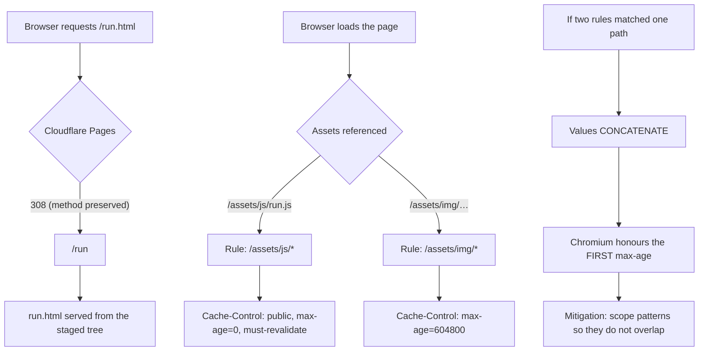

# SatQuery AI — Frontend

**Chapter scope.** This chapter documents the SatQuery AI web frontend end to end: the static tier
and every page in it, the staging and deploy path that publishes it, the Analyze console in full
depth (every DOM handle, every state, every event), the eight-event execution protocol and the trace
bar it drives, the REAL-vs-PREVIEW driver split, the captured-run page, the Hugging Face header
link, cache-busting, and the Cloudflare platform traps that shape all of the above.

**Grounding.** Every claim below is taken from a file that was read for this chapter. Where a claim
comes from code, the file is cited inline, e.g. `(frontend/assets/js/mission.js)`. Where a number is
quoted it is a number that appears in a file; none is estimated. Where the evidence does not exist,
the text says exactly: `UNKNOWN — not established from the available evidence`.

**Status vocabulary** follows `release/DOCS_STYLE_GUIDE.md` §2: `IMPLEMENTED` · `VERIFIED` ·
`MEASURED` · `ATTEMPTED` · `NOT RUN` · `BLOCKED` · `DEFERRED` · `REJECTED` · `OPEN` · `RESOLVED` ·
`CLOSED`.

**Nothing in this chapter is a system-level accuracy claim.** Per `release/DOCS_STYLE_GUIDE.md` §3
there is **no end-to-end benchmark** for SatQuery AI; the frontend is a *client* of the service, and
the only system-level numbers quoted here are the ones the delivery documents themselves recorded
(live validation 3 passes × 8 cases, 8/8 each, 24 runs, 0 mock nodes, trace fill 94.4444 %).

---

## 1. What the frontend is, and what it is not

SatQuery AI's frontend is a **static site**. It is HTML, CSS, and ES modules served from Cloudflare
Pages. There is no build step that compiles application code, no bundler, no framework, no server
rendering, and no runtime dependency on a Node process. The staging tool
(`scripts/stage_pages.mjs`) copies a *reference-closed subset* of `frontend/` into an output
directory and then hands that directory to `wrangler`.

The site is **hermetic except for one page**. The staging tool computes and prints a reference
integrity and external-dependency audit, and it reports `HERMETIC` when a page's reference closure
contains zero network dependencies (`scripts/stage_pages.mjs`). The single deliberate exception is
`frontend/mission.html`, the Analyze console, which carries a live API base in a `<meta>` tag and can
call the deployed service. Everything else — the homepage, the essay, the atlas, the architecture
tour, the benchmark and research pages, the captured-run page — is designed to render without any
network call beyond its own assets.

> **Honesty note (drift recorded, not hidden).** An older comment inside `frontend/_headers` claimed
> the site was "100% static, zero network calls". That claim is **stale** and is not repeated here as
> current truth: `mission.html` is a live-calling page, and `mission.html` is one of the eleven
> shipped pages. The correct current statement is: *ten of eleven pages are hermetic; `mission.html`
> is the one live-calling page.*

### 1.1 The design law the frontend was built under

`frontend/HANDOFF.md` is the governing design document for the frontend. Its §1 states the design
law; §2 defines the token system as CSS custom properties on `:root`; §3–§10 lay out build phases
A–G; §9 names the integration seam (`SQ.run().ingest`); §13 lists known hard limits; §14 lists the
real SatQuery schema type names that the frontend is allowed to speak.

The practical consequences of that design law, as they appear in the shipped code:

- **No fabricated imagery is presented as real.** Synthetic imagery produced at runtime carries a
  `synthetic: true` flag (`frontend/assets/js/core.js`, `SQ.scene`), and pages that use placeholder
  numbers say so in their own prose (e.g. `frontend/atlas.html` states its numbers are placeholders).
- **The eight-event vocabulary is fixed.** The frontend may not invent event names; it emits exactly
  the eight names declared in `SQ.EVENT_NAMES` (`frontend/assets/js/core.js`).
- **The event stream is the seam.** Any driver — mock, live, or a captured replay — talks to the UI
  only by calling `ingest(type, payload)`. Nothing else may mutate the console.

---

## 2. The static tier: file layout

The shipped frontend is a flat set of pages plus three asset trees.

```
frontend/
  *.html                      top-level pages (the staging seed set)
  _headers                    Cloudflare Pages header rules (see §12)
  HANDOFF.md                  the frontend design/handoff document
  assets/
    css/                      stylesheets
    js/
      core.js                 SQ namespace: rng, scene synthesis, policy router,
                              event names, mock run driver, shared components
      live.js                 the real HTTP ingestion client (assets + infer)
      mission.js              the Analyze console driver (PREVIEW + LIVE)
      run.js                  the captured-run ("Anatomy of a Run") driver
      <page drivers>          per-page behaviour
    data/
      anatomy-run.js          the captured real ResultEnvelope (sanitized)
    img/                      real EO imagery (eo/…), plates, thumbnails
    video/                    the launch film and clips
    fonts/                    webfonts
```

Two facts about this layout matter for deployment:

1. The **staging seed** is the set of top-level `frontend/*.html` files
   (`scripts/stage_pages.mjs`). Pages are discovered from HTML, and then their reference closure
   (CSS `@import`/`url()`, JS `import`/`export … from`, and dynamic imports) is walked so that only
   referenced assets ship.
2. Because the closure is reference-driven, **an asset that is not referenced by a reachable page
   does not ship**. This is deliberate: it keeps the uploaded tree small and it makes dead assets
   visible (they simply do not appear in the staged tree report).

---

## 3. The eleven pages

Eleven HTML pages ship. Each was read for this chapter. The table gives the page's purpose and its
`data-view` (the attribute each page's `<body>` carries, which the CSS uses to scope page-specific
rules).

| # | File | Purpose | Notes |
|---|---|---|---|
| 1 | `frontend/index.html` | Homepage / front door. Orbit hero, invitation form, open questions, essay film, discover/evidence/understand/measure/atlas sections. | Carries the launch video and the delta pair. |
| 2 | `frontend/mission.html` | **The Analyze console.** Query box, two upload widgets, intent panel, viewer, comparison, answer, evidence, confidence, provenance, trace bar, event drawer. | The **only** live-calling page. Carries `<meta name="satquery-api-base">`. |
| 3 | `frontend/architecture.html` | Architecture tour: how a query becomes an answer, stage by stage. | Footer discloses that its transmission is driven by the prototype mock event stream. |
| 4 | `frontend/run.html` | **Anatomy of a Run** — renders a real captured `ResultEnvelope` (`run_d124d8b9adea`). | Driven by `frontend/assets/js/run.js` over `frontend/assets/data/anatomy-run.js`. |
| 5 | `frontend/benchmark.html` | Benchmark page: measured results with an evidence-state legend. | Legend vocabulary: VERIFIED / SUPPORTED / UNVERIFIED / BLOCKED / NOT RUN. |
| 6 | `frontend/research.html` | Research notes: methods, calibration, honest caveats. | Links into the measurement story. |
| 7 | `frontend/journey.html` | The build journey / narrative page. | Carries the HF + GitHub header links. |
| 8 | `frontend/atlas.html` | Atlas of four real EO thumbnails. | Page states its numbers are placeholders. |
| 9 | `frontend/references.html` | References / citations page. | — |
| 10 | `frontend/video.html` | Video library: four clips, three planned shorts named. | — |
| 11 | `frontend/404.html` | Not-found page. | Prose says "Ten pages exist" but links five — drift, recorded in §13. |

### 3.1 Page-by-page detail

**`index.html` (homepage).** 424 lines. Structure: a navigation bar carrying the GitHub and Hugging
Face links; an orbit hero using `assets/img/eo/nile-wide.jpg`; an invitation form whose action is
`mission.html`; an "open questions" list containing three `mission.html?q=…` links (so a visitor can
land in the Analyze console with a question pre-filled); an essay-film section using
`assets/video/satquery-launch-50s.mp4` with eight `data-chapters` markers; an "ask" section using
`assets/img/eo/delta-plain.jpg`; a "discover" section that presents the **delta-growth t0/t1 pair** as
a wipe slider (`delta-growth-t0-720` / `delta-growth-t1-720`); an "evidence" section using
`delta-growth-t2-2075.jpg`; an "understand" section listing six layers; a "measure" section with
benchmark and research cards; and an "atlas" section with four real EO thumbnails. The footer notes
name the event span `QUERY_RECEIVED` → `RESULT_ASSEMBLED`, i.e. the first and last of the eight
events.

**`mission.html` (Analyze console).** 297 lines. This is the page this chapter spends most of its
length on; see §5.

**`architecture.html`.** The architecture tour. It walks the reader from a natural-language query
through routing, planning, specialists, evidence, confidence, and result assembly. Its footer makes
an explicit honesty disclosure: the transmission shown on the page is driven by the **prototype mock
event stream**, not by a live run. That disclosure is the page doing the right thing — the animation
is real UI driven by the same eight-event seam, but the data behind it on this page is the mock
driver's.

**`run.html` ("Anatomy of a Run").** Renders a **real captured** envelope. See §9.

**`benchmark.html`.** Presents measured results. It carries an evidence-state legend whose
vocabulary is VERIFIED / SUPPORTED / UNVERIFIED / BLOCKED / NOT RUN, and it notes the measured
reliability curve. Per `release/DOCS_STYLE_GUIDE.md` §3, this page is the right place for the
per-artifact numbers (grounding under two protocols, change IoU, optical-SAR accuracy-with-macro-F1,
change-VQA two test sets, router validation-only), and it must never present them as a system-level
score.

**`research.html`.** Research notes: method, calibration, and caveats. This is where the calibration
result belongs, and per the style guide it must be stated correctly: ECE went **0.013755 → 0.014929
— worse**, and the transform is retained only because it is in the frozen config.

**`journey.html`.** Narrative page for the build process.

**`atlas.html`.** Four real EO thumbnails. The page states in its own prose that its numbers are
placeholders. That statement is correct and must be preserved: the atlas is a *gallery*, not a
measurement.

**`references.html`.** Citations.

**`video.html`.** Lists four clips and names three planned shorts. The planned shorts are labelled as
planned, not shipped.

**`404.html`.** The not-found page. Its prose says "Ten pages exist" while eleven do, and it links
five. This is documentation drift inside a shipped page; it is recorded here and in §13 rather than
silently corrected, because correcting it would be an edit outside this chapter's scope.

### 3.2 The Hugging Face header link — present on all eleven pages

Every one of the eleven pages carries, in its navigation, both:

- a **GitHub** link to `https://github.com/Anish-lab-blip/SatQuery-AI`, and
- a **Hugging Face** link to `https://huggingface.co/thundercode/SatQuery`.

This was verified by searching all `frontend/*.html` for `huggingface.co` and `github.com` and
confirming a match in each of: `index`, `journey`, `mission`, `404`, `video`, `atlas`,
`architecture`, `benchmark`, `run`, `research`, `references` — eleven files, eleven matches each.
`docs/FINAL_DELIVERY_TODO.md` records this as a post-handoff sprint outcome ("the HF link on all 11
pages").

The reason this is called out as its own subsection: the public release is *GitHub + Hugging Face*,
and the requirement that the HF link appear on **all** pages (not just the homepage) is a delivery
requirement, so it is stated as a verified fact with the method of verification.

---

## 4. Staging and deploy path

### 4.1 `scripts/stage_pages.mjs` — the reference-closed staging tool

`scripts/stage_pages.mjs` is 378 lines and is the tool that turns the working `frontend/` directory
into a deployable tree. It is deliberately conservative.

**Constants.**

| Constant | Value | Meaning |
|---|---|---|
| `PAGES_FILE_LIMIT` | `26214400` (25 MiB) | Cloudflare Pages per-file hard limit. |
| `BIG_WARN_BYTES` | `10485760` (10 MiB) | Warn threshold for a large file. |

**Reference extraction.** The tool uses a small set of regexes to find references inside each file
type:

- `RE_HTML` — HTML references (`<script src>`, `<link href>`, ``, etc.)
- `RE_CSS_IMPORT` — CSS `@import`
- `RE_CSS_URL` — CSS `url(...)`
- `RE_JS_IMPORT` — JS `import … from`
- `RE_JS_EXPORT` — JS `export … from`
- `RE_JS_DYN` — JS dynamic `import(...)`

Supporting helpers: `stripComments()` (so a reference inside a comment does not become a false
edge), `extractRefs()`, `isExternal()` (absolute URLs and protocol-relative URLs are not followed),
`stripQueryHash()` (so `app.js?v=2` resolves to `app.js`), and `insideFrontend()` (a guard so a
reference cannot escape the `frontend/` root).

**Algorithm.**

1. **Seed.** Take the set of top-level `frontend/*.html` files.
2. **Closure walk.** For each file in the frontier, extract its references, resolve each to a
   path inside `frontend/`, and add the new ones to the frontier. Repeat until the frontier is empty.
3. **Copy.** Copy every file in the closure into the output root, preserving relative paths.
4. **Size gate.** If any file exceeds `PAGES_FILE_LIMIT` (25 MiB), hard-fail with **exit code 2**.
   Files above `BIG_WARN_BYTES` (10 MiB) produce a warning.
5. **Verify.** Re-walk the *staged* tree and confirm the closure is intact (no dangling reference).
   Failure is **exit code 3**.
6. **Report.** Print four report blocks:
   - `=== STAGED TREE ===`
   - `=== REFERENCE INTEGRITY ===`
   - `=== EXTERNAL DEPENDENCY AUDIT ===` — prints `HERMETIC` when zero network dependencies are
     found.
   - `=== OPTIONS APPLIED ===`
7. **Hint.** Print the deploy command to run next:
   `npx wrangler pages deploy "<OUT_ROOT>" --project-name <name>`.

**Why the exit codes matter.** A staging run that silently produced an incomplete tree would deploy
a broken site; a staging run that silently produced an over-limit tree would deploy a site that
Cloudflare rejects. The tool therefore fails loudly *before* upload (exit 2 for size, exit 3 for
integrity) rather than letting `wrangler` discover the problem.

**Argument parsing.** `parseArgs()` handles the CLI surface and `usage()` prints help. The tool is
invoked as a Node script (`node scripts/stage_pages.mjs …`).

### 4.2 The deploy command

The tool's own final hint is the deploy step:

```
npx wrangler pages deploy "<OUT_ROOT>" --project-name <name>
```

Deployment is therefore: **stage to a directory → `wrangler pages deploy` that directory**. There is
no compile step between the two. The deployed frontend HEAD recorded in the delivery documents is
`2d7ae53b482d` (`docs/FINAL_DELIVERY_TODO.md`, `release/DOCS_STYLE_GUIDE.md` §3).

> **Superseded-topology note.** `docs/DEPLOYMENT_ARCHITECTURE.md` opens with a superseded-topology
> banner, and its body still names Railway / HF-Space hosts while the active topology is
> Render / Codespace (`docs/DEPLOYMENT_TOPOLOGY.md`). For the frontend specifically, the host is
> Cloudflare Pages in both readings; the drift concerns the *backend* hosts, not the static tier.

---

## 5. The Analyze console (`frontend/mission.html`) in depth

The Analyze console is the frontend's centre of gravity. This section documents its markup (every
handle), its state machine, its two drivers, and its event rendering.

### 5.1 Markup and DOM handles

`frontend/mission.html` is 297 lines. Its `<head>` carries the live API base:

```html
<meta name="satquery-api-base" content="https://<backend-host>">
```

That meta tag is the second entry in the API-base resolution order (see §5.4). The page loads three
scripts, in order:

```html
<script src="assets/js/core.js"></script>
<script src="assets/js/live.js"></script>
<script src="assets/js/mission.js"></script>
```

`core.js` defines the `SQ` namespace and the mock driver; `live.js` defines the real HTTP client;
`mission.js` is the page driver that decides which of the two to use. The load order is significant:
`mission.js` runs last because it consumes both.

The console's handles, by region:

**Query and run.**

| Handle | Role |
|---|---|
| `#qtext` | The natural-language query input. |
| `#btnRun` | The Run button. |
| `#runid` | Displays the run identifier for the current run. |

**Observation / upload.**

| Handle | Role |
|---|---|
| `#obsTail` | The observation status tail. Its **initial text content is `none`** — i.e. no asset loaded yet. |
| `#dropZone` | The drop target for a file. |
| `#fileInput` | The primary file input (the single observation). |
| `#obsNote` | The note under the observation widget. |

**Metadata.**

| Handle | Role |
|---|---|
| `#metaHost` | Container for the metadata readout. |
| `#mFile` | Metadata: file name. |
| `#mAcq` | Metadata: acquisition date (one of the `#m*` fields inside `#metaHost`). |
| `#metaEmpty` | The empty-state placeholder for the metadata block. |

**Intent panel.**

| Handle | Role |
|---|---|
| `#intentTail` | Intent status tail. |
| `#intentHost` | Container for the parsed intent (task, assets, route). |
| `#pairTail` | Pair status tail (for the two-asset change tasks). |
| `#pairNote` | Note under the pair widget. |
| `#fileInputT0` | The **second** file input — the `t0` (before) image for paired tasks. |

**Viewer.**

| Handle | Role |
|---|---|
| `#vbtns` | Viewer mode buttons. |
| `#viewerState` | Viewer state label. |
| `#plate` | The plate container. |
| `#plateImg` | The plate image; its `src` is `assets/img/eo/reservoir-low.jpg`. |
| `#ev` | The evidence overlay layer on the plate. |
| `#evNote` | Note under the evidence overlay. |
| `#plateCreditLead` | Plate credit lead-in text. |
| `#plateCredit` | Plate credit text. |

**Comparison (paired tasks).**

| Handle | Role |
|---|---|
| `#cmpWrap` | Comparison wrapper. |
| `#cmpT0` | The t0 pane. |
| `#cmpT1` | The t1 pane. |
| `#cmpRange` | The comparison range/slider control. |
| `#cmpCredit` | Comparison credit. |
| `#cmpEmpty` | Comparison empty state. |

**Answer.**

| Handle | Role |
|---|---|
| `#answerHost` | Container for the rendered answer. |
| `#ansTail` | Answer status tail. |

**Evidence.**

| Handle | Role |
|---|---|
| `#evHost` | Container for the evidence list. |
| `#evEmpty` | Evidence empty state. |
| `#evTail` | Evidence status tail. |

**Confidence.**

| Handle | Role |
|---|---|
| `#confHost` | Container for the confidence readout. |
| `#confC` | The confidence value. |
| `#confNote` | Note under the confidence value. |

**Provenance.**

| Handle | Role |
|---|---|
| `#provHost` | Container for provenance. |
| `#pRun` | Provenance: run id. |
| `#pPolicy` | Provenance: policy. |
| `#pProtocol` | Provenance: protocol. |
| `#pSchema` | Provenance: schema version. |

**Report and trace.**

| Handle | Role |
|---|---|
| `#btnReport` | The report button. |
| `#ctrace` | The trace container. |
| `#traceNow` | The "now" label on the trace bar. |
| `#trace` | The trace bar (the element whose width is animated). |
| `#traceNote` | Note under the trace bar. |

**Event drawer.**

| Handle | Role |
|---|---|
| `#drawer` | The event-log drawer. |
| `#evlog` | The event log list. |
| `#btnClose` | Close-drawer button. |
| `#btnEvents` | Open-drawer button. |

### 5.2 The intent panel

The intent panel (`#intentHost`, `#intentTail`) is rendered by `renderIntent()` in
`frontend/assets/js/mission.js`. It shows the *interpreted* query: which task the router chose, which
assets the task requires, and which route (live vs mock) will be taken.

The interpretation itself is `interpret()` in `mission.js` — a lexical router that runs in the
browser. Its notable features, as read from the file:

- a change stem `/chang/` (no `\b` word boundary) so "change"/"changed"/"changes" all match;
- a `newAsChange` rule so phrasing like "new …" can be read as a change request;
- a caption regex for caption/describe phrasings.

`interpret()` is deliberately simple and deterministic. It exists so the console can show the user a
*reason* for the task it is about to run, and so the console can decide which file inputs are
relevant. It is **not** the server-side router: the server has its own deterministic policy planner
(see the `SERVING.md` chapter and `core/controller.py`). The browser-side `interpret()` is a UI
affordance; the authoritative routing decision is the server's, and the console renders what the
server returns.

### 5.3 Task selection and asset requirements

`mission.js` maps the interpreted intent onto a server task name via `ROUTE_TASK_TO_SERVER`. The
paired tasks are declared in `PAIRED_TASKS`:

```js
PAIRED_TASKS = { change, change_vqa, optical_sar }
```

These three tasks need **two** assets (a before/after pair), which is why the console has a second
file input (`#fileInputT0`) and a comparison region (`#cmpWrap`). When a paired task is selected but
only one asset is available, the console falls back to a single-asset task via
`SINGLE_ASSET_FALLBACK = 'vqa'`. This is a UI-level fallback: rather than failing the run, the
console narrows the request to something one image can answer.

For optical-SAR there is a dedicated precondition check, `validateOpticalSar()`, because that task
has modality-specific requirements. `assetsForTask()` assembles the asset list the chosen task needs.

### 5.4 API-base resolution

`frontend/assets/js/live.js` defines the resolution order for the API base in
`SQ.live.baseUrl()`:

1. `window.SATQUERY_API_BASE` (a runtime override, useful for testing), then
2. `<meta name="satquery-api-base">` (the page's declared base — on `mission.html` this is
   `https://<backend-host>`), then
3. the default `/api` (a same-origin path).

`_normalizeBase()` normalises trailing slashes, and `SQ.live.url()` composes the final URL.
`SQ.ENDPOINTS` names the four endpoints the client talks to:

```js
SQ.ENDPOINTS = { assets: '/assets', infer: '/infer', capabilities: '/capabilities', health: '/health' }
```

With the default `/api` base these resolve to `/api/assets`, `/api/infer`, `/api/capabilities`, and
`/api/health`. On the deployed configuration the base is the Render orchestrator host, which is the
`/api/*` mirror of the four-endpoint contract (see the `SERVING.md` chapter).

### 5.5 Upload widgets

Two file inputs exist: `#fileInput` (primary) and `#fileInputT0` (the before image for paired
tasks). Both are wired through `handleFile()` in `mission.js`, and both feed
`SQ.live.uploadAsset()` in `live.js`.

`live.js` declares the accepted content types:

```js
SQ.CONTENT_TYPES = { tif, tiff, png, jpg, jpeg }
```

and maps a file to its MIME type via `SQ.contentTypeFor()`. The upload is a **raw-bytes POST with a
`Content-Type` header** — not a multipart form. This mirrors the server contract: `POST /v1/assets`
takes the file as the request body with its content type in the header, and `POST /v1/analyze` takes
JSON (multipart is explicitly *not* implemented — see `docs/API_CONTRACT.md` §2.4 and the `SERVING.md`
chapter).

`uploadAsset()` asserts that the response contains an `asset_id`; `uploadAssets()` uploads a list
**sequentially** (so the second upload cannot race the first). The returned `asset_id` is an opaque
handle — the client never parses it, it only passes it back. The asset store's TTL and the fact that
handles are ephemeral are documented in `SERVING.md`.

### 5.6 The observation tail: `none` → ready

`#obsTail` starts with text content `none`. When an asset is uploaded successfully, the tail is
updated to a ready state. This is the console's way of making the *precondition* for a run visible:
a query can be typed at any time, but a run that requires an asset cannot produce evidence until an
asset is present. The `#obsNote` field carries the supporting note.

### 5.7 The Run button, `#runid`, and `#answerHost`

Pressing `#btnRun` calls `runQuery()` in `mission.js`. `runQuery()` decides between the two drivers
(§6) and then dispatches. `#runid` is populated with the run identifier the service returns
(`run_…`); `#answerHost` receives the rendered answer.

### 5.8 The trace bar and the eight events

The console's most load-bearing UI element is the trace bar. It is driven entirely by the eight
execution events.

**The eight event names** are declared once, in `frontend/assets/js/core.js`:

```js
SQ.EVENT_NAMES = [
  'QUERY_RECEIVED',
  'QUERY_UNDERSTOOD',
  'ROUTE_SELECTED',
  'SPECIALIST_STARTED',
  'SPECIALIST_COMPLETED',
  'EVIDENCE_GENERATED',
  'CONFIDENCE_COMPUTED',
  'RESULT_ASSEMBLED'
]
```

(Declared at `core.js:616–620`.) These names are the protocol between any driver and the UI. The
`architecture.html` footer's disclosure — that its transmission is driven by the mock event stream —
is a statement about *which driver* feeds these names, not about the names themselves.

**The nine UI states.** `mission.js` declares `STATES` (nine `ControllerState` values) and maps each
event to a state via `EVENT_TO_STATE`, with per-state explanatory text in `STATE_NOTE`. Nine states
over eight events is not an inconsistency: there is a state for "idle / not started" plus the eight
event-driven states.

**The fill formula.** `markState()` sets the trace bar width with:

```js
traceFill.style.width = ((traceProgress + 0.5) / STATES.length) * 100 + '%'
```

With eight events completed against nine states, the final fill is
`((8 + 0.5) / 9) × 100` = **94.4444 %**. This is why the delivery documents record the trace fill as
94.4444 %: it is the arithmetic consequence of the formula, not a measurement of a rendering. The
`+ 0.5` means the bar advances *half a step* on entry to each state, so a completed eight-event run
lands at 8.5/9 rather than 8/9 or 9/9. The remaining 5.5556 % corresponds to the ninth state, which
a completed run does not enter.

`buildTrace()` constructs the trace bar's segments; `logEvent()` appends to the event log
(`#evlog`); `resetUI()` clears the console back to its initial state (including resetting `#obsTail`
to `none`).

### 5.9 The event drawer

`#drawer` is the event log, opened by `#btnEvents` and closed by `#btnClose`. `#evlog` is the list
itself. Each event appended by `logEvent()` records the event type and its payload summary, so a
reader can see the full ordered sequence rather than only the current state. The drawer is what makes
the "0 mock nodes" / "9 preview nodes" distinction auditable by a human: the live driver's log
contains no mock nodes; the preview driver's log contains nine.

---

## 6. REAL vs PREVIEW: two drivers, one event seam

`mission.js` opens with the comment "TWO DRIVERS, ONE EVENT SEAM". That is the whole design: two
driver implementations, one `ingest()` seam, one UI.

### 6.1 The seam

`SQ.run(opts)` in `core.js` owns an `ingest()` switch (lines ~742–788) that dispatches each of the
eight event types to the UI handlers. Any driver that wants to drive the console calls
`ingest(type, payload)`; it does not touch the DOM. The console boot sequence builds the engine with
`engine = SQ.run(...)`, then calls `runMock(QUERY)` to paint an initial state, then
`loadCapabilities()` to fetch the service's capability block.

### 6.2 PREVIEW (`runMock`)

`runMock()` is the **preview** driver. Its properties, as read from `mission.js` and `core.js`:

- It emits **empty payloads** — the payloads carry the shape of the data but not real values, because
  there is no real run behind it.
- It labels the console as a preview (`is-mock`).
- It emits **nine mock nodes** — the event log for a preview run contains nine mock nodes.
- It drives the trace bar through the same `markState()` path, so the fill arithmetic is identical.

`core.js`'s `startMock()` drives the sequence with `setTimeout` timings, so the preview is *animated*:
each event arrives after a short delay, which is what makes the trace bar and the event drawer move.

**What preview does not emit.** The preview driver emits **no specialist events** — i.e. no
`SPECIALIST_STARTED` / `SPECIALIST_COMPLETED` for a real specialist. This is the honest distinction
between the two paths: the preview can show the *envelope* of a run, but it cannot show a specialist
that actually ran, because no specialist ran.

### 6.3 REAL (`runLive`)

`runLive()` is the **live** driver. Its properties:

- It makes **real HTTP calls** via `SQ.live` (`live.js`).
- It sets a `liveRun` flag.
- It reads two response headers from `SQ.live.infer()`: `X-SatQuery-State` and
  `x-satquery-transport`. The state header carries the controller's state (see the nine
  `ControllerState` values); the transport header records how the response was carried (the tunnel
  transport vs a direct/forwarded transport).
- It translates failures with `translateError()` and, for upload/inference failures,
  `SQ.live.describeFailure()` / `LiveError` in `live.js`.
- A live run shows **0 mock nodes** — the event log contains no mock nodes at all.

### 6.4 Why the 0-vs-9 distinction is the honesty test

The delivery documents record that live validation produced **24 runs** (3 passes × 8 cases, 8/8 each)
with **0 mock nodes**. That number is only meaningful because the preview path *does* produce mock
nodes (nine of them). The console's event drawer therefore lets a reader distinguish, from the UI
alone, whether what they are looking at is a real run or a preview. This is the frontend's
contribution to the project's truthfulness discipline: the same eight-event vocabulary is used for
both, and the drawer is what tells them apart.

### 6.5 `loadCapabilities()` and `setMode()`

`loadCapabilities()` calls `SQ.live.capabilities()` (i.e. `GET /api/capabilities` on the deployed
base) and renders the capability block. `setMode()` switches the console between modes. Because
capabilities are fetched live, the console can show which tasks are available *right now* on the
deployed service — which matters because the deployed device is CPU and because some capabilities
are gated on artifacts that may be absent (the `SERVING.md` chapter documents the capability adapter
and the five-word vocabulary it emits).

### 6.6 The test hook

`mission.js` exposes `window.SQ_MISSION` as a test hook. It lets an automated harness drive the
console (select a task, inject a file, press run) without synthesising DOM events. This is how the
live validation runs in the delivery documents were executed against the page.

### 6.7 `translateError()`

`translateError()` maps a service error into human-readable text in the console. It is the frontend
half of the error contract: the service returns a machine code and an HTTP status
(`docs/API_CONTRACT.md` §5.1–§5.3; `gateway/policy.py` `_CODE_STATUS`), and the console turns that
into a sentence a person can act on. The console does not invent codes; it renders the ones it
receives. One consequence worth stating: a `422` from the service is *not* necessarily a validation
failure of the user's data — see the G-1 annotation-scope defect in the `SERVING.md` chapter, where a
`422 {"detail":[{"loc":["query","request"]}]}` is a *server-side* bug that masquerades as a client
validation error. `translateError()` will render it as an error; only the backend fix removes it.

---

## 7. The captured-run page: "Anatomy of a Run" (`run.html`)

`frontend/run.html` renders a **real captured** `ResultEnvelope`. This is the page that lets a reader
inspect an actual run without running anything.

### 7.1 The captured envelope

The data lives in `frontend/assets/data/anatomy-run.js` (329 lines), assigned to
`window.SATQUERY_ANATOMY_RUN`. Its header states the provenance:

- `_source`: "Captured live 2026-09-25 … Sanitized".

The fields that matter, all read from the file:

| Field | Value |
|---|---|
| `run_id` | `run_d124d8b9adea` |
| `task` | `grounding` |
| `query` | "Where is the reservoir?" |
| `answer` | "[grounding] Located 3 candidate region(s) … Highest objectness 0.61." |
| `config_hash` | `78f1e3700da15aa1` |
| `transport` | `tunnel` |
| `intent.source` | `forced` |
| plan | `step_001` grounding, `requires_assets` |
| steps | 8 steps, `RECEIVE` → `RESPOND` |
| `selected_models` | ViT-B-32 (RemoteCLIP path) → GroundingHead (`params=1052677`) |
| evidence | 4 items: 3 `bounding_box` + 1 `statistic` |
| regions | 3 (`region_1cd3973de749`, …) |
| confidence | raw `0.5231253252136926` / calibrated `0.5236623182649384` (`temperature_scaling`) |
| calibration component | `temperature: 0.9772731820958189`, `calibration_samples: 16441.0` |
| timings | `step_001: 209.873` |
| geospatial | 730×730, `has_crs false` |
| warnings | 2 — no CRS; contradictory spatial claims |

### 7.2 How the page renders it

`frontend/assets/js/run.js` (380 lines) is the driver. It reads `window.SATQUERY_ANATOMY_RUN` and
exposes the envelope through a set of named views: `QUERY`, `TASK`, `RUN_ID`, `MODELS`, `EVIDENCE`,
`CONF`, `TIMINGS`, `GEO`, `INTENT`, `PLAN`, `HASH`, `PLATE`.

- `REGIONS` is built from `A.regions`, so the three captured regions drive the plate overlays.
- `paintAll()` loads the **real plate image** and clears the `t0` and `diff` layers (this run has no
  before/after pair, so those layers are empty rather than faked).
- `buildEvidence()` renders the four evidence items; `evCandidates()`, `evLock()`, and
  `evConfirmed()` render the three stages of the evidence story (candidates → locked → confirmed).
- `SPECIALISTS_FOR_TASK` maps the task to the specialists that would run, so the page can show the
  specialist panel even though this run's only specialist is grounding.
- `buildLattice()` builds the step lattice from the 8 captured steps.
- `DATA` is a table of eight key/value views, one per stage, and **each entry names the event** that
  corresponds to that stage — i.e. the captured page is wired to the same eight-event vocabulary.
- `setStage()`, `resetEvidence()`, and `gotoStep()` drive the page as the reader scrolls or uses the
  keyboard.

### 7.3 What the page proves, and what it does not

It **proves**: a real grounding run was captured, sanitized, and shipped with its full envelope —
run id, task, query, answer, config hash, transport, intent source, plan, steps, selected models with
parameter counts, evidence with types, regions, raw and calibrated confidence with the calibration
component and sample count, timings, geospatial facts, and warnings. A reader can verify that the
number shown as "confidence" on the page is a *calibrated* value with a documented temperature and a
documented calibration-sample count.

It **does not prove**: any system-level accuracy. One captured run is one run. Per
`release/DOCS_STYLE_GUIDE.md` §3 there is **no end-to-end benchmark**, and this page does not create
one. The calibrated confidence `0.5236623182649384` is a per-run confidence, not an accuracy.

The two captured warnings are also part of the honest record: `has_crs false` (the imagery had no
coordinate reference system) and "contradictory spatial claims". Both are shown rather than
suppressed.

---

## 8. Benchmark, Research, and Lab pages

The frontend has a measurement-facing tier whose job is to present numbers *with their status*.

- **`benchmark.html`** carries the evidence-state legend: **VERIFIED / SUPPORTED / UNVERIFIED /
  BLOCKED / NOT RUN**. It notes the measured reliability curve. This page is where the per-artifact
  results live, and per the style guide each must be stated with its correct qualification:
  grounding under **two protocols** (canonical 0.2838 / matched6 0.2566) and **two decode variants**
  (head_argmax 0.1215, zero-shot 0.0972) — never one alone; optical-SAR accuracy **0.931 with
  macro-F1 0.434161**, ruling **OPEN**; change-VQA **two** test sets (test 0.697626/0.378373 and
  test2 0.651469/0.372309), ruling **OPEN**; router **0.965116 = validation, ungated, n = 86**, test
  split **NOT RUN**; the VLM adapter **usable** (exact_match 0.963) but **ACCEPTANCE-REJECTED**.
- **`research.html`** carries the method and caveat material, including the calibration result stated
  correctly: ECE **0.013755 → 0.014929 — worse**.
- **The Lab page.** The brief for this chapter names a "Lab" page. `frontend/HANDOFF.md` §12 gives the
  file map, and the eleven shipped pages are enumerated in §3 above. A page named "Lab" is **not**
  among the eleven HTML files read for this chapter. The nearest things are the Analyze console
  (`mission.html`) and the captured-run page (`run.html`), which are the pages where a reader can
  "do" or "inspect" work. Whether a page named "Lab" existed at any point and was renamed or dropped
  is `UNKNOWN — not established from the available evidence`.

---

## 9. The Hugging Face header link (delivery requirement)

Stated separately because it is a delivery requirement with a verification method. See §3.2: the
Hugging Face link `https://huggingface.co/thundercode/SatQuery` and the GitHub link
`https://github.com/Anish-lab-blip/SatQuery-AI` are present in the navigation of **all eleven**
pages, verified by searching every `frontend/*.html` for both hostnames.

---

## 10. Cache-busting behaviour

The frontend uses **URL-versioned assets** plus **header rules** to control caching. The header rules
live in `frontend/_headers` (a Cloudflare Pages file), and the versioning is visible in the markup.

### 10.1 The `_headers` rules

`frontend/_headers` declares:

| Path pattern | Rule |
|---|---|
| `/*` | Baseline security headers: `X-Content-Type-Options`, `Referrer-Policy`, `X-Frame-Options`, `Cross-Origin-Opener-Policy`. |
| `/` and `/*.html` | Revalidate. |
| `/assets/video/*` | `max-age=604800` (7 days). |
| `/assets/fonts/*` | `max-age=31536000` (1 year). |
| `/assets/css/*` | `public, max-age=0, must-revalidate`. |
| `/assets/js/*` | `public, max-age=0, must-revalidate`. |
| `/assets/img/*` | `max-age=604800` (7 days). |

### 10.2 The rule that matters for correctness

**JS and CSS are served `public, max-age=0, must-revalidate`.** That is the safe setting for code:
the browser may cache a copy but must revalidate before using it. This is what makes a code change
take effect without asking users to hard-refresh. Images, fonts, and video get long lifetimes because
they are content, not logic — and because a *changed* image is given a **new URL** rather than
overwriting the old one.

### 10.3 The delta-growth pair as the worked example

`frontend/_headers` itself carries a note that the delta-growth image pair was given **new URLs**
when it changed (`delta-growth-t0-720` / `delta-growth-t1-720`, referenced from `index.html`). That is
the correct pattern for a long-cached asset: change the URL, keep the long `max-age`. The homepage's
wipe slider uses that pair, and the "evidence" section uses `delta-growth-t2-2075.jpg` — a third URL
in the same family.

---

## 11. Cloudflare platform traps

Two Cloudflare behaviours shape this frontend. Both are recorded because a future maintainer will hit
them.

### 11.1 `_headers` rules CONCATENATE (they do not override)

This is the single most surprising Cloudflare Pages behaviour in this project, and
`frontend/_headers` documents it **verbatim in a comment inside the file**. The rule is: when more
than one `_headers` rule matches a path, Cloudflare **concatenates** the header values rather than
letting the more specific rule override the more general one.

The practical consequence: if two rules both set `Cache-Control`, the client receives **two**
`Cache-Control` values. Chromium honours the **first** `max-age` it sees. So a broad rule that sets
`max-age=0` and a specific rule that sets `max-age=604800` do not "resolve" to the specific one — the
client sees both, in order, and takes the first.

`docs/FINAL_DELIVERY_TODO.md` §1.7 lists this as known blocker item 9. The mitigation, as evidenced
by the shipped `_headers`, is to **scope the patterns so that they do not overlap** where the value
must be exact — i.e. write one rule per asset tree rather than a general rule plus an override. The
`/assets/js/*` and `/assets/css/*` rules are separate from `/assets/img/*` precisely so that each
tree has exactly one matching rule and there is nothing to concatenate.

### 11.2 The 308 `.html` → extensionless redirect

Cloudflare Pages issues a **308** redirect from a path that ends in `.html` to the extensionless
path: a request for `/run.html` redirects to `/run`. A 308 preserves the method (unlike 301/302 in
some clients), so a `POST` is not silently turned into a `GET`, but the redirect still happens and the
final URL differs from the requested one.

The second, related trap is the **trailing-slash 307**: Starlette's `redirect_slashes` behaviour
issues a **307** when a request's trailing slash does not match the route. This is documented for the
*API* in `docs/API_CONTRACT.md` §5.1 as a footgun, and it matters to the frontend because the
frontend is the caller: `SQ.live.url()` and `_normalizeBase()` exist partly to make the client's URL
composition predictable so that the client is not relying on a redirect to reach an endpoint.

Both traps share a lesson: **the frontend must link to the canonical URL.** A page that links to
`/run` (extensionless) never triggers the 308; a page that links to `/run.html` does.

---

## 12. Accessibility and UX caveats

This section states what can be established from the files read, and marks the rest.

### 12.1 What is established

- **Keyboard driving exists on the captured-run page.** `run.js` supports keyboard input to move
  between steps (`gotoStep()` plus key handling), so `run.html` is operable without a mouse.
- **Reduced-motion and focus styling** are governed by the token system in `frontend/HANDOFF.md` §2
  (CSS custom properties on `:root`). The handoff document is the design authority for the token
  layer.
- **The event drawer is a named, focusable pair of controls** (`#btnEvents` / `#btnClose`) with a
  labelled region (`#drawer` → `#evlog`), so the event log is not hover-only.
- **The upload widgets are real `<input type="file">` elements** (`#fileInput`, `#fileInputT0`),
  which are natively keyboard- and screen-reader-operable, and they are paired with a `#dropZone`
  for pointer drag-and-drop. Drag-and-drop is an *addition* to the file input, not a replacement.

### 12.2 What is not established

- **A formal accessibility audit** (axe / Lighthouse / WCAG conformance level) has not been
  performed: `UNKNOWN — not established from the available evidence`.
- **Contrast ratios** for the token palette: `UNKNOWN — not established from the available evidence`.
- **Screen-reader behaviour** of the trace bar's animated width (whether a live region announces each
  state transition): `UNKNOWN — not established from the available evidence`. The trace bar is a
  visual affordance driven by `markState()`; whether its state changes are announced is not
  determinable from the code read.
- **Mobile/responsive breakpoints** beyond what the CSS declares: `UNKNOWN — not established from the
  available evidence`.
- **The 404 page's page count** is stale: `404.html` says "Ten pages exist" and links five, while
  eleven ship. This is drift, recorded here and not silently repaired.

---

## 13. Documentation drift recorded (not propagated as current truth)

Per the project's practice (mirrored from `P10-T02`), drift found during this chapter's research is
recorded honestly rather than smoothed over:

| Location | Stale claim | Correct current statement |
|---|---|---|
| `frontend/_headers` comment | "100% static, zero network calls" | Ten of eleven pages are hermetic; `mission.html` calls the live service. |
| `frontend/404.html` prose | "Ten pages exist" (links five) | Eleven pages ship. |
| `frontend/mission.html` / `_headers` relationship | (implicit) | The live API base is declared in `<meta name="satquery-api-base">`, which is a *live* dependency the hermeticity audit must be read as exempting. |

None of these is a code defect; each is a documentation statement inside a shipped file that no
longer matches the tree. They are listed so a reader is not misled by them.

---

## 14. What the frontend does NOT do

Stated explicitly, because the depth of §5–§7 could otherwise imply more capability than exists:

- **No framework and no build step for application code.** Pages are hand-written HTML plus ES
  modules; `scripts/stage_pages.mjs` copies, it does not compile.
- **No client-side model inference.** The browser never runs a model. All inference happens on the
  service (`POST /api/infer` → the tunnel → the inference service).
- **No multipart upload.** Uploads are raw-bytes POSTs with a `Content-Type` header, matching the
  server contract (`docs/API_CONTRACT.md` §2.4: multipart is *not* implemented).
- **No streaming.** There is no server-sent-events or websocket channel. The eight events are
  *client-side UI states*; on a live run they are derived from the single inference response (plus
  the two response headers `X-SatQuery-State` and `x-satquery-transport`), not pushed from the
  server. (See the `SERVING.md` chapter: the service does not stream.)
- **No authentication UI.** The service has no auth (`docs/API_CONTRACT.md` §7), so there is no login.
- **No persistence of runs.** Nothing in the frontend stores a run; the console's state is in-memory,
  and the captured-run page reads a static data file.
- **No offline mode** beyond the fact that ten pages need no network.

---

## 4.3 The staging tool in detail: closure algorithm and report format

This subsection expands §4.1 because the staging tool is the *only* build-like step in the frontend
and its behaviour determines what ships.

### 4.3.1 Why a closure walk instead of "copy the directory"

Copying `frontend/` wholesale would ship unreferenced assets: draft images, superseded JS, experiment
files. A closure walk ships exactly the transitive set of files reachable from the eleven seed pages.
The consequences are worth stating precisely:

- **Adding a page is a deliberate act.** Because the seed set is `frontend/*.html` (top level only),
  a page placed in a subdirectory is *not* a seed. It ships only if a seed page references it.
- **Removing a reference removes a file from the deploy.** If the last page that used
  `assets/img/eo/old.jpg` stops referencing it, that image silently stops shipping. This is a feature
  (smaller tree) and a hazard (an asset can disappear without an error) — which is exactly why the
  tool prints the staged tree and the integrity report, so the disappearance is visible in the build
  log rather than only in production.
- **Query strings and hashes are normalised away.** `stripQueryHash()` means `app.js?v=3` and
  `app.js` are the same edge, so versioned references do not create phantom files.
- **External URLs are not followed.** `isExternal()` stops the walk at `https://…` and `//…`, which
  is why the external-dependency audit can report `HERMETIC`: any external URL that *was* followed
  would show up as a network dependency.
- **References cannot escape the root.** `insideFrontend()` rejects a resolved path that leaves
  `frontend/`, so a stray `../../secret` reference cannot pull a file from outside the tree.

### 4.3.2 The four report blocks

The tool prints four blocks. Reading them in order answers the four questions a deployer has.

1. `=== STAGED TREE ===` — *what will be uploaded?* A listing of every file copied into the output
   root, with sizes. Files over `BIG_WARN_BYTES` (10 MiB) are flagged.
2. `=== REFERENCE INTEGRITY ===` — *is the closure complete?* The staged tree is re-walked and every
   reference must resolve inside it. A dangling reference fails with exit code 3. This is the check
   that catches the case where a file was referenced but not copied (e.g. because of a
   case-sensitivity difference between the developer's filesystem and Linux).
3. `=== EXTERNAL DEPENDENCY AUDIT ===` — *is the site hermetic?* External URLs found in the closure
   are listed. When the list is empty the block prints `HERMETIC`. This is the check that keeps the
   "ten of eleven pages are hermetic" claim honest: if a page gained a CDN script, the audit would
   stop printing `HERMETIC`.
4. `=== OPTIONS APPLIED ===` — *what flags were used?* The effective options, so a build log is
   self-describing.

### 4.3.3 The two hard gates and their exit codes

| Condition | Exit code | Why it is fatal |
|---|---|---|
| Any file exceeds `PAGES_FILE_LIMIT` (25 MiB) | **2** | Cloudflare Pages rejects a file over the limit; deploying would fail *after* upload. Failing before upload is cheaper and clearer. |
| Staged tree fails reference-integrity re-walk | **3** | A dangling reference means a broken page in production. |

The deliberate design choice is **fail before upload**. Both gates run locally, on the staged tree,
before `wrangler` is invoked. A non-zero exit stops a shell pipeline (`&&`) before the deploy command
can run.

### 4.3.4 The deploy hint

The last thing the tool prints is the command to run:

```
npx wrangler pages deploy "<OUT_ROOT>" --project-name <name>
```

Note that the tool does **not** run the deploy itself. Staging and deploying are separate steps, which
means a human (or CI) can inspect the staged tree between them. This is consistent with the project's
general posture: make the artifact inspectable before it is published.

---

## 5.10 The nine console states

`mission.js` declares nine `ControllerState` values in `STATES`, an `EVENT_TO_STATE` map from the
eight event names onto those states, and a `STATE_NOTE` table of human-readable text per state.
`markState()` is the single function that advances the UI from one state to the next, and it is the
only place the trace-bar width is written.

The relationship between the nine states and the eight events is:

- One state is the **idle / pre-run** state — the state the console is in before `QUERY_RECEIVED`.
  `resetUI()` returns the console to it (and resets `#obsTail` to `none`).
- The other eight states are entered by the eight events, in order. `EVENT_TO_STATE` is the mapping,
  so the console's state names and the protocol's event names are kept in one place rather than
  duplicated across `if` branches.

`STATE_NOTE` gives each state a sentence, which is what `#traceNow` and `#traceNote` display while the
run progresses. The point of the separate state text is that the event name is protocol
(`SPECIALIST_STARTED`) while the state text is human ("running the grounding specialist"). The console
shows both: the event name in the drawer's log, the state text in the trace region.

### 5.10.1 Why the fill formula uses `(traceProgress + 0.5) / STATES.length`

The formula is:

```js
traceFill.style.width = ((traceProgress + 0.5) / STATES.length) * 100 + '%'
```

Three observations about it:

1. **`STATES.length` is 9, not 8.** The denominator is the number of states, which includes the idle
   state. So the maximum reachable fill from events alone is `(8 + 0.5) / 9 = 94.4444 %`.
2. **The `+ 0.5` is a half-step lead.** Entering state *n* shows the bar at *(n + 0.5)/9*, i.e. the
   midpoint of that state's band. The bar therefore never sits exactly on a boundary, which reads
   better visually and means the bar is always "inside" a labelled state.
3. **The remaining 5.5556 % is the idle state's band.** A completed run does not enter idle, so a
   completed run does not fill the bar. This is the arithmetic origin of the 94.4444 % figure the
   delivery documents record.

Stated as a status: the **formula** is `IMPLEMENTED`; the 94.4444 % figure is `MEASURED` *as the
arithmetic consequence of the formula against nine states*, and it is corroborated by the live
validation runs recorded in the delivery documents. It is not a claim about anything else.

### 5.10.2 `onEvent()` — the single funnel

`onEvent()` is the console's event handler: every event delivered through the `ingest()` seam passes
through it. It is responsible for

- appending to the event log via `logEvent()` (which writes to `#evlog` in the drawer),
- advancing the state via `markState()` (which writes the trace bar),
- routing the payload to the appropriate renderer (`renderEvidence()`, `renderConfidence()`,
  `renderIntent()`, the answer renderer into `#answerHost`, and the provenance writers into
  `#pRun` / `#pPolicy` / `#pProtocol` / `#pSchema`).

Having a single funnel is what makes the REAL/PREVIEW distinction safe: both drivers call the same
`onEvent()`, so the rendering path is identical and only the *payload source* differs. It is also why
the "0 mock nodes vs 9 mock nodes" property is checkable at one place — the drawer's contents are
produced by one function.

---

## 5.11 The viewer and comparison regions

### 5.11.1 The viewer

The viewer is the plate at the top of the console's results area. Handles: `#vbtns` (mode buttons),
`#viewerState` (state label), `#plate` (container), `#plateImg` (the image, `src` initially
`assets/img/eo/reservoir-low.jpg`), `#ev` (evidence overlay), `#evNote` (overlay note),
`#plateCreditLead` and `#plateCredit` (attribution).

The initial `src` is a **real EO image** (`reservoir-low.jpg`), not a synthetic one. That matters for
honesty: before any run, the console shows a real image with a credit, so a visitor is never looking
at invented imagery while the console is idle.

`#vbtns` selects a viewer mode and `#viewerState` names it. The evidence overlay `#ev` is where the
grounding result's regions are drawn — for the captured grounding run there are three regions
(`region_1cd3973de749`, …), which is why the overlay is a layer separate from the plate image rather
than something painted into the image.

### 5.11.2 The comparison region

For paired tasks (`change`, `change_vqa`, `optical_sar`), the console shows a comparison region:
`#cmpWrap` (wrapper), `#cmpT0` (before pane), `#cmpT1` (after pane), `#cmpRange` (the range/slider
control), `#cmpCredit` (attribution), `#cmpEmpty` (empty state).

The two panes are fed from the two upload widgets (`#fileInput` for t1, `#fileInputT0` for t0). When
only one asset is available for a paired task, `SINGLE_ASSET_FALLBACK = 'vqa'` narrows the request so
the console can still produce an answer instead of failing. `#cmpEmpty` is the state shown when there
is nothing to compare.

The homepage uses the same visual idiom for its delta-growth wipe slider, which is a nice consistency:
the *idea* of "two dates, one place, slide to compare" appears both as a landing-page illustration and
as a functional control in the console.

---

## 5.12 Provenance and report controls

### 5.12.1 The provenance block

`#provHost` contains four fields that together answer "what exactly produced this?":

| Handle | Field | Meaning |
|---|---|---|
| `#pRun` | run id | The `run_…` identifier. |
| `#pPolicy` | policy | The routing/planning policy that produced the plan. |
| `#pProtocol` | protocol | The protocol under which the result was produced. |
| `#pSchema` | schema | The schema version of the response. |

The reason a provenance block is worth four fields: the project's measurement discipline depends on
being able to say *which* protocol a number came from. The style guide's grounding rule — that
grounding was measured under **two protocols** (canonical 0.2838 / matched6 0.2566) and **two decode
variants** (head_argmax 0.1215, zero-shot 0.0972) — is exactly the kind of fact that a protocol field
exists to disambiguate. A result rendered without its protocol is a result that cannot be compared to
anything.

### 5.12.2 The report button and the event drawer

`#btnReport` triggers the console's report action. `#btnEvents` opens `#drawer`, whose `#evlog`
contains the ordered event log; `#btnClose` closes it. The drawer is the console's audit surface: it
is the one place where a reader can count events and check for mock nodes.

---

## 5.13 The mock data model inside `core.js`

`core.js` (1029 lines) is not only the event seam; it is also the source of everything the preview
driver draws. Its internals, as read:

**Utilities.** `SQ.util` provides `rnd` (random), `rng` (a seeded random-number generator — which is
what makes the preview *deterministic* across reloads), `pad`, and `ms` (formatting).

**Raster synthesis.** The synthetic imagery path:

| Symbol | Role |
|---|---|
| `BIOMES` | The biome definitions the synthesised terrain is drawn from. |
| `CANON` | `{w: 900, h: 600}` — the canonical raster size. |
| `buildMasks()` | Builds the masks (land/water/etc.) the raster is composed from. |
| `fbm` | Fractal Brownian motion — the noise function that gives the terrain texture. |
| `SQ.scene` | Produces a scene; it sets a **`synthetic: true` flag** and fills placeholder `gsd`, `aoi`, and `dates`. |

The `synthetic: true` flag is the load-bearing honesty mechanism: synthetic imagery is *labelled* as
synthetic in the data, so any renderer can disclose it. The placeholder `gsd` (ground sample
distance), `aoi` (area of interest), and `dates` are placeholders, not measurements — and the flag
says so.

**Imagery.** `SQ.imagery` resolves which image to show.

**Stages.** `SQ.STAGES` is the eight-stage list from `QUERY` through `ANSWER`. This is the *narrative*
stage list (what a human sees), distinct from the eight *event* names (the protocol). The two are
aligned but not identical: `SQ.STAGES` is the visual progression; `SQ.EVENT_NAMES` is the wire
vocabulary.

**The deterministic policy.** `SQ.policy()` is a deterministic router used by the preview. Its
documented quirks: a **`where`-first** fix (a query containing "where" is routed to grounding before
other rules are considered), the removal of a `built` keyword, and the `newAsChange` rule. Because it
is deterministic and seeded, the same query produces the same preview every time — which is what makes
the preview useful as a UI demo and useless as a measurement.

**Answer material.** `SQ.ANSWER_BANK` supplies canned answers for the preview; `SQ.COMPONENTS` lists
**seven components** with their model strings, which is what the preview's model panel shows.

**Shared components.** `SQ.frame`, `SQ.reliabilityPlot`, and `SQ.chip` are reusable renderers. The
`SQ.reliabilityPlot` is the component that draws the reliability curve referenced on
`benchmark.html`.

**The run engine.** `SQ.run(opts)` is the engine; its `ingest()` switch (lines ~742–788) dispatches
the eight event types to handlers. `startMock()` drives a preview run by calling `ingest()` on a
schedule of `setTimeout` delays.

> **Honesty note on `SQ.policy()` vs the server router.** The browser's `SQ.policy()` and
> `mission.js`'s `interpret()` are **UI-side** interpretations. The authoritative router is
> server-side (`core/controller.py`, `core/registry.py`). The preview's routing can therefore differ
> from what the server would do, and that is acceptable precisely because the preview is labelled a
> preview and emits no specialist events. A reader must not read `SQ.policy()` as the routing
> specification.

---

## 6.8 `live.js` API surface reference

`frontend/assets/js/live.js` is 392 lines. Its header documents the end-to-end flow and **three
design rules**. The module's public surface, as read:

| Symbol | Kind | Behaviour |
|---|---|---|
| `SQ.ENDPOINTS` | const | `{ assets: '/assets', infer: '/infer', capabilities: '/capabilities', health: '/health' }`. |
| `SQ.CONTENT_TYPES` | const | `{ tif, tiff, png, jpg, jpeg }` — the accepted upload types. |
| `SQ.contentTypeFor(file)` | fn | Maps a file to its MIME type; used to set the upload `Content-Type`. |
| `SQ.live.baseUrl()` | fn | Resolution order: `window.SATQUERY_API_BASE` → `<meta name="satquery-api-base">` → `/api`. |
| `_normalizeBase(base)` | fn (internal) | Normalises the base (trailing slashes). |
| `SQ.live.url(endpoint)` | fn | Composes the final URL from the normalised base and an endpoint. |
| `LiveError` | class | The client's error type, carrying enough detail for `describeFailure()`. |
| `describeFailure(err)` | fn | Turns a `LiveError` into human-readable text. |
| `SQ.live.uploadAsset(file)` | fn | Raw-bytes POST with `Content-Type`; **asserts** the response contains `asset_id`. |
| `SQ.live.uploadAssets(files)` | fn | Uploads a list **sequentially** (no parallel uploads). |
| `SQ.live.infer(request)` | fn | POSTs the analysis request; **reads `X-SatQuery-State` and `x-satquery-transport`** from the response. |
| `SQ.live.run(opts)` | fn | Composes upload + infer into one run. |
| `SQ.live.capabilities()` | fn | `GET` the capability block (used by `loadCapabilities()`). |

### 6.8.1 The three design rules (as stated in the file's header)

The file's header states three rules that govern the client. They are worth restating because they
explain several behaviours that would otherwise look arbitrary:

1. **Raw bytes, not multipart.** The upload is a body-with-content-type POST because that is what the
   service accepts (`docs/API_CONTRACT.md` §2.4: multipart is *not* implemented). A client that sent
   multipart would be rejected.
2. **Sequential uploads.** `uploadAssets()` uploads one at a time because the server's asset store is
   a small ephemeral store with a file cap (`SERVING.md`: default `_asset_max_files()` = 32), and
   because a paired task's second upload depends on the first succeeding. Parallel uploads would make
   partial failure harder to reason about.
3. **The asset handle is opaque.** The client asserts the handle exists and passes it back
   unexamined. The handle's shape (`asset_<32 hex>`) and its TTL are server facts; the client must not
   depend on either.

### 6.8.2 The two response headers

`SQ.live.infer()` reads two custom headers:

| Header | Meaning |
|---|---|
| `X-SatQuery-State` | The controller state for the response (the same vocabulary as the console's `STATES`). |
| `x-satquery-transport` | How the response was carried (the captured envelope records `transport: "tunnel"`). |

These two headers are how the console can display a state and a transport *without* a streaming
channel. They are the reason the console can show a live run's progress truthfully: the state and the
transport come from the server's own response, not from a client-side guess.

---

## 7.4 The captured envelope, field by field

This subsection expands §7.1 into a complete inventory, because the captured envelope is the frontend's
single richest piece of real data and a reader should be able to reconstruct it.

**Provenance and identity.**

| Field | Value | Note |
|---|---|---|
| `_source` | "Captured live 2026-09-25 … Sanitized" | The capture date and the fact that the payload was sanitized before shipping. |
| `run_id` | `run_d124d8b9adea` | The run identifier. |
| `config_hash` | `78f1e3700da15aa1` | The frozen config hash — the same value recorded in the style guide §3. |

**Request.**

| Field | Value |
|---|---|
| `query` | "Where is the reservoir?" |
| `task` | `grounding` |
| `intent.source` | `forced` (the task was forced rather than inferred). |
| `transport` | `tunnel` |

**Plan.**

| Field | Value |
|---|---|
| plan | `step_001`, task `grounding`, `requires_assets` |
| steps | 8 steps, `RECEIVE` → `RESPOND` |
| `timings.step_001` | `209.873` (ms) |

**Models.**

| Field | Value |
|---|---|
| `selected_models` | ViT-B-32 (the RemoteCLIP path) → GroundingHead |
| GroundingHead `params` | `1052677` |

**Result.**

| Field | Value |
|---|---|
| `answer` | "[grounding] Located 3 candidate region(s) … Highest objectness 0.61." |
| evidence | 4 items: 3 × `bounding_box`, 1 × `statistic` |
| regions | 3, e.g. `region_1cd3973de749` |

**Confidence.**

| Field | Value |
|---|---|
| raw | `0.5231253252136926` |
| calibrated | `0.5236623182649384` |
| method | `temperature_scaling` |
| `temperature` | `0.9772731820958189` |
| `calibration_samples` | `16441.0` |

The `calibration_samples` value `16441.0` is the size of the validation set the temperature was fitted
on; `docs/API_CONTRACT.md` §4 records the same figure as 16,441 Val rows. The temperature
`0.9772731820958189` is also recorded in `docs/API_CONTRACT.md` §4. This is a real cross-check: the
number on the public page matches the number in the API contract.

**Geospatial and warnings.**

| Field | Value |
|---|---|
| geospatial | 730 × 730, `has_crs false` |
| warnings | 2 — no CRS; contradictory spatial claims |

The presence of the warnings in the shipped envelope is itself a design statement: the capture was not
cleaned up to look better than it was.

**Why this page is important to the release.** It is the one place where a reader can see a complete,
real, sanitized result envelope — including its imperfections — rendered by the same event vocabulary
the live console uses. It is a *sample of one*, and the page does not present it as more than that.

---

## 11.3 A worked path through the platform traps

The following Mermaid diagram shows where the two traps (§11.1, §11.2) bite. It is a description of
the behaviours documented in `frontend/_headers`, `docs/API_CONTRACT.md` §5.1, and the Cloudflare
redirect behaviour recorded in the delivery documents — not a measurement.



Read together, the traps say: **link to the canonical extensionless URL** (so the 308 never fires for
an internal navigation) and **give each asset tree exactly one matching `_headers` rule** (so there is
nothing to concatenate).

The third, API-side trap — the Starlette trailing-slash **307** documented in `docs/API_CONTRACT.md`
§5.1 — is the client's concern rather than the static tier's: `_normalizeBase()` and `SQ.live.url()`
exist so the client composes a URL that matches the route exactly, rather than relying on a redirect
to reach it.

---

## 14.1 What the frontend is a client *of*

Because this chapter documents a client, it is worth stating precisely what contract the client is
written against, so a reader can follow the thread into the `SERVING.md` chapter.

- The client posts **raw bytes** to `/api/assets` and receives an opaque `asset_id`
  (`docs/API_CONTRACT.md` §2.5).
- The client posts **JSON** to `/api/infer` (`docs/API_CONTRACT.md` §2.4) and receives a
  `ResultEnvelope`.
- The client reads `GET /api/capabilities` (`docs/API_CONTRACT.md` §2.2) to know which tasks are
  available now.
- The client may read `GET /api/health` (`docs/API_CONTRACT.md` §2.1) for the service's health block.
- The client reads two custom response headers (`X-SatQuery-State`, `x-satquery-transport`).
- The client renders errors from the service's machine codes (`docs/API_CONTRACT.md` §5.2 — a 23-code
  taxonomy in `core/errors.py`, plus the gateway-origin `rate_limited`, mapped by
  `gateway/policy.py` `_CODE_STATUS`).
- The client sends **no credentials**; the service has no auth (`docs/API_CONTRACT.md` §7). CORS is
  configured on the orchestrator (`deploy/render/main.py` `_PRODUCTION_ORIGINS` includes the Pages
  origin).

Every one of those six interactions is documented from the *server* side in the `SERVING.md` chapter,
which is the other half of this pair.

---

## 15. Status summary

| Subsystem | Status |
|---|---|
| Static tier (11 pages, CSS, JS modules, assets) | `IMPLEMENTED` |
| Staging tool `scripts/stage_pages.mjs` (closure, size gate, integrity gate, hermeticity report) | `IMPLEMENTED` |
| Deploy path (`wrangler pages deploy` of the staged tree) | `IMPLEMENTED`; deployed HEAD `2d7ae53b482d` |
| Analyze console (`mission.html` + `mission.js` + `live.js` + `core.js`) | `IMPLEMENTED` |
| Eight-event protocol + trace bar (94.4444 % fill) | `IMPLEMENTED`; fill `MEASURED` as the arithmetic consequence of the formula |
| PREVIEW driver (`runMock`, 9 mock nodes, no specialist events) | `IMPLEMENTED` |
| REAL driver (`runLive`, real HTTP, 0 mock nodes) | `IMPLEMENTED`; exercised in the 24-run live validation recorded in the delivery docs |
| Captured-run page (`run.html` over `anatomy-run.js`) | `IMPLEMENTED`; data is a real sanitized capture (`run_d124d8b9adea`) |
| Hugging Face + GitHub header links on all 11 pages | `VERIFIED` by search across `frontend/*.html` |
| Cache-busting (`_headers` rules + URL versioning) | `IMPLEMENTED` |
| `_headers` concatenation trap | `KNOWN` (blocker item 9 in `docs/FINAL_DELIVERY_TODO.md` §1.7); mitigated by non-overlapping patterns |
| Accessibility audit | `NOT RUN` |

---

## 16. NOT RUN / OPEN / BLOCKED (frontend)

Per `release/DOCS_STYLE_GUIDE.md` §4, every doc ends with this list.

**NOT RUN**
- No formal accessibility audit (axe / Lighthouse / WCAG conformance level).
- No measured contrast-ratio audit of the token palette.
- No screen-reader behaviour verification for the trace bar's state transitions.
- No responsive-breakpoint verification beyond the CSS as written.
- No end-to-end benchmark of the system (this is project-wide, per `release/DOCS_STYLE_GUIDE.md`
  §3 — it is *not* a frontend gap, it is a project-level fact that the frontend must not contradict).

**OPEN**
- `frontend/404.html` prose says "Ten pages exist" while eleven ship — documentation drift, OPEN.
- The `_headers` concatenation behaviour remains a known platform trap (blocker item 9); the shipped
  rules avoid overlap, but the underlying platform behaviour is unchanged and OPEN as a hazard.
- A page named "Lab" is not among the eleven shipped pages; whether it existed is
  `UNKNOWN — not established from the available evidence`.
- Accessibility conformance level: `UNKNOWN — not established from the available evidence`.

**BLOCKED**
- Nothing in the frontend is blocked. The frontend's live path depends on the backend, and the
  backend's own blockers (e.g. B-07, tunnel gaps; patch prepared, NOT deployed) are recorded in the
  `SERVING.md` chapter and the delivery documents. A backend blocker surfaces in the console only as
  an error rendered by `translateError()`.

---

## 17. Where the evidence lives

| Claim area | Evidence file(s) |
|---|---|
| Page inventory, purposes, `data-view`, section structure | `frontend/*.html` (11 files, each read) |
| Homepage structure, video chapters, delta pair, open-question links | `frontend/index.html` |
| Analyze console markup and every DOM handle | `frontend/mission.html` |
| Console driver, `interpret()`, `chooseTask()`, `assetsForTask()`, `validateOpticalSar()`, `translateError()`, `routeSpecialists()`, `renderIntent()`, `STATES`/`EVENT_TO_STATE`/`STATE_NOTE`, `markState()` (fill formula), `buildTrace()`, `logEvent()`, `resetUI()`, `renderEvidence()`, `renderConfidence()`, `onEvent()`, `runMock()`, `runLive()`, `runQuery()`, `loadCapabilities()`, `setMode()`, `handleFile()`, `window.SQ_MISSION` | `frontend/assets/js/mission.js` |
| `SQ` namespace, rng/util, synthetic scene flag, `SQ.STAGES`, `SQ.EVENT_NAMES`, `SQ.policy()`, `SQ.run().ingest()`, `startMock()`, `SQ.COMPONENTS` | `frontend/assets/js/core.js` |
| Live client: `SQ.ENDPOINTS`, `SQ.CONTENT_TYPES`, `SQ.contentTypeFor()`, `SQ.live.baseUrl()`, `_normalizeBase()`, `SQ.live.url()`, `LiveError`, `describeFailure()`, `uploadAsset()`, `uploadAssets()`, `infer()` (header reads), `run()`, `capabilities()` | `frontend/assets/js/live.js` |
| Captured-run driver: `QUERY…PLATE`, `REGIONS`, `paintAll()`, `buildEvidence()`, `evCandidates()/evLock()/evConfirmed()`, `SPECIALISTS_FOR_TASK`, `buildLattice()`, `DATA` (8 KV tables with event names), `setStage()`, `resetEvidence()`, `gotoStep()` | `frontend/assets/js/run.js` |
| Captured envelope (run id, task, answer, config hash, transport, plan, steps, models, evidence, regions, confidence + calibration, timings, geospatial, warnings) | `frontend/assets/data/anatomy-run.js` |
| Cache rules and the concatenation trap (verbatim comment) | `frontend/_headers` |
| Design law, token system, phases A–G, file map, hard limits, schema types, `ingest` seam, 8 event names | `frontend/HANDOFF.md` |
| Staging tool: constants, regexes, closure walk, exit codes 2/3, report blocks, `HERMETIC`, deploy hint | `scripts/stage_pages.mjs` |
| Deployed frontend HEAD `2d7ae53b482d`; HF link on all 11 pages; blocker item 9 | `docs/FINAL_DELIVERY_TODO.md` |
| Live topology and per-component responsibilities | `docs/DEPLOYMENT_TOPOLOGY.md` |
| Superseded-topology banner; entrypoint requirements; failure-mode table | `docs/DEPLOYMENT_ARCHITECTURE.md` |
| API contract the client speaks (endpoints, enums, confidence, errors, no-auth, CORS, multipart-not-implemented, 307 footgun, 23-code taxonomy) | `docs/API_CONTRACT.md` |
| Captured run ids per task; metrics table; blockers | `docs/FINAL_DELIVERY_REPORT.md` |
| Style, grounding rules, status vocabulary, facts-that-must-not-be-wrong, 94.4444 % trace fill | `release/DOCS_STYLE_GUIDE.md` |
