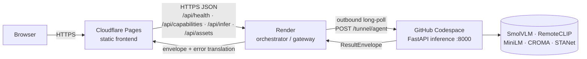
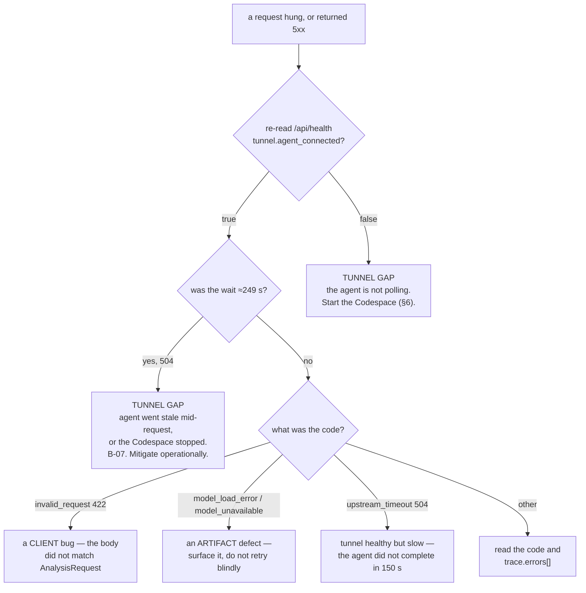
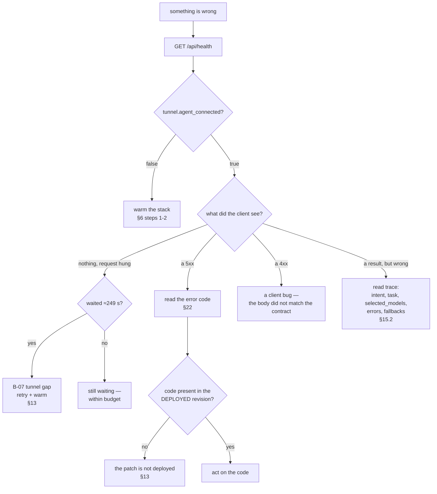

# Operations Manual

**Status tags:** `IMPLEMENTED` · `VERIFIED` · `MEASURED` · `ATTEMPTED` · `NOT RUN` · `BLOCKED` ·
`DEFERRED` · `OPEN` · `RESOLVED` · `BY DESIGN`.

This is the operator-facing manual for the **live SatQuery AI stack**. It answers four questions that
the architecture chapters deliberately do not: *what is running, right now, and who owns it*; *how do I
bring it up and keep it up*; *how do I tell a transient transport gap from a real failure*; and *what
monitoring, capacity and cost machinery is **absent** so I do not assume it exists*.

It is written for the person who has to make the system answer a question in front of an audience, and
for the person who has to diagnose it at 23:00 when it does not.

> **Read this first.** The live system runs across **three private repositories** plus the public
> umbrella. The monorepo working copy — including the `deploy/` directory inside it — is **not** the
> deployed source. `deploy/` in the monorepo is **stale and untracked** (`git status` reports
> `?? deploy/`; verified in the working copy). Any operational fix must be applied to the real
> repositories, never to the monorepo copy (`docs/DEPLOYMENT.md` §1, §10).

> **Second rule.** Two known defects are `OPEN` and are **not** fixed in production: **B-07** (transient
> tunnel gaps) and **B-02** (a cosmetic trailing newline in one health field). Neither may be described
> as resolved, and the B-07 patch is **prepared but NOT deployed**. This document never upgrades them.

---

## Table of contents

**Part I — The operational model**
1. What runs where
2. The tier inventory, with the deployed revision of each
3. Who owns what
4. The operational invariants (four rules that must never be broken)
5. The stale-copy problem, in operational terms

**Part II — The runbook**
6. Warm the stack before a demo
7. Restart after an idle-stop
8. Tell a tunnel gap from a real failure
9. What the client shows while waking

**Part III — Cold start and the timing budget**
10. The cold-start shape
11. The four timeouts, and why the relationship matters
12. The worst case: ≈249 s under B-07

**Part IV — The known defects, in operational terms**
13. B-07 — transient tunnel gaps (`OPEN`)
14. B-02 — the trailing newline (`OPEN`, cosmetic)

**Part V — Monitoring and alerting**
15. What exists
16. What does **not** exist
17. Why "no alerting" is a design fact, not an oversight

**Part VI — Capacity and cost**
18. The capacity shape
19. The cost shape, and the one absence that has a code artifact

**Part VII — Incident triage**
20. The symptom → cause → check → action table
21. The consolidated decision tree
22. The machine-code reference

**Part VIII — Routine maintenance**
23. Rotating credentials (procedure only)
24. Restarting the tunnel agent
25. Re-warming the model cache
26. Deploying a change (the Git Data API path)

**Part IX — Known operational gaps**
27. The explicit gaps list
28. `NOT RUN` / `OPEN` / `BLOCKED` / `UNKNOWN` for operations

**Part X — Evidence**
29. Where the evidence lives

---

# Part I — The operational model

## 1. What runs where

The live stack is four tiers in a straight line, plus a model tier that is reached *through* the
inference tier rather than by the user (`release/repo/docs/DEPLOYMENT.md` §2):

```
Browser
  │  HTTPS
  ▼
Cloudflare Pages  —  satquery.pages.dev                 (static frontend, 11 pages)
  │  HTTPS / JSON  →  /api/*
  ▼
Render            —  <backend-host>  (orchestrator / API gateway)
  │  outbound long-poll  POST /tunnel/agent
  ▼
GitHub Codespace  —  FastAPI inference, CPU, port 8000
  │  build_space_app()
  ▼
specialists: SmolVLM · RemoteCLIP · MiniLM · CROMA · STANet
  │
  ▼
ResultEnvelope  →  tunnel  →  Render  →  browser
```



Three properties of this diagram matter operationally, and each is the subject of a section below:

1. **The transport is an outbound tunnel, not an inbound port.** The Codespace dials *out* to Render.
   Render never dials into the Codespace. The transport is therefore alive only while an agent process
   is polling — which is why "is the agent connected?" is the single most important operational
   question (§6, §8).
2. **There is exactly one inference host.** One Codespace, one Render service, no replicas, no
   autoscaling (`render.yaml` declares a single web service with `plan: free`; plan §74 lists
   `autoscaling` under **Not included**). Capacity is therefore bounded by that one host (§18).
3. **Inference is CPU-only.** `SATQUERY_DEVICE=cpu` is set on both the orchestrator and the Codespace
   (`render.yaml`, `.devcontainer/devcontainer.json`), and every specialist defaults to `device="cpu"`
   (`docs/DEPLOYMENT_DECISION.md` §5). No GPU path is on the live critical path.

## 2. The tier inventory, with the deployed revision of each

Read from the GitHub API during the release reconnaissance (`release/CURRENT_RELEASE_STATE.md` §1;
`release/repo/docs/DEPLOYMENT.md` §1):

| Component | Repository | Visibility | Branch | Revision | Host |
|---|---|---|---|---|---|
| Frontend | `Anish-lab-blip/SatQuery-Frontend` | **private** | `main` | **`2d7ae53b482d`** | Cloudflare Pages → `satquery.pages.dev` |
| Backend / orchestrator | `Anish-lab-blip/SatQuery-Backend` | **private** | `main` | **`89d80eaddec5`** | Render → `<backend-host>` |
| Inference | `Anish-lab-blip/SatQuery-Inference` | **private** | `main` | **`5a0936ace491`** | Codespace `potential-space-trout-r4ppw969w45j2pvvw`, port 8000, via outbound tunnel |
| Public umbrella | `Anish-lab-blip/SatQuery-AI` | **public** | `main` | `3dcabd32da41` ("Initial commit") | this release home |
| Monorepo (working copy) | `C:/Users/anish/satquery-ai` | local only | `master` | `9d57aed` | **no git remote**; 334 dirty entries |
| Hugging Face | `thundercode/SatQuery` | **public** | `main` | lastModified `2026-09-25T16:26:53Z` | model tier |

The three private repositories are private **by design**; their links return 404 for an outside
audience (`release/CURRENT_RELEASE_STATE.md` §6). An operator therefore cannot browse the deployed
source from a public URL — the deployed files must be fetched with an authenticated API call
(`release/repo/docs/DEPLOYMENT.md` §7.1, §10).

> **The monorepo's `deploy/` is not the deployed source.** This is the single most important trap in
> the whole system (§5).

## 3. Who owns what

The ownership table below is derived from the code and the deployment records. "Owner" means *the
person or role that must act when this tier misbehaves*.

| Tier | Owner | What they own | What they must never do |
|---|---|---|---|
| Cloudflare Pages (frontend) | Frontend maintainer | the static bundle, `_headers`, `robots.txt`, the Analyze console | add a server-side secret — the tier holds none |
| Render (gateway) | Backend maintainer | the orchestrator revision, the env-var set, the CORS allowlist, the tunnel hub state | retry `POST /api/infer` (§4) |
| Codespace (inference) | Inference maintainer | the Codespace, the tunnel agent, the asset directory, the HF cache | let a stale serve process keep answering (§5) |
| Hugging Face (model tier) | Release owner | model cards, the pinned model references, the released checksums | treat the Hub as the runtime inference host — it is not |
| Credentials | Owner (human) | the GitHub PAT and the account tokens | record any credential value in a public document (§23) |

Two decisions are explicitly **not** an agent's to make, and both gate operational change
(`docs/PHASE19_FINAL_HARDENING.md` §7): the **SDK choice** (irrelevant on the live path, but still
unmade for the frozen manifest) and the **rate-limit / size-limit values** (which bound one client's
share of capacity). Neither is needed to operate the system as deployed.

## 4. The operational invariants

Four rules are load-bearing. Each is enforced somewhere in code or config, and each has a documented
failure if broken.

### 4.1 The config hash is frozen

`Config.hash == 78f1e3700da15aa1`. The loader computes a sha256 over the whole registry
(`core/config.py:76-80`) and every evaluation run records it. **Editing `configs/base.yaml` moves the
hash and invalidates every artifact keyed to it** (`release/repo/docs/DEPLOYMENT.md` §11;
`docs/BACKEND_DEPLOYMENT_RUNBOOK.md` §6.1). Deployment state that must *not* move the hash — asset-store
capacity, TTL, the per-file cap — is read from the **environment**, not from the YAML
(`release/repo/README.md` §Installation).

Operational consequence: **never edit `configs/base.yaml` to point at a deployment artifact.** The
serving path wires checkpoints through the registry's `builders=` override precisely so it does not have
to (`docs/BACKEND_DEPLOYMENT_RUNBOOK.md` §6.1).

### 4.2 The gateway never retries `POST /api/infer`

> *"Render must not retry `POST /api/infer` on its own — a retry would consume inference a second
> time. The client decides on retry."* (`docs/DEPLOYMENT_TOPOLOGY.md` §2)

This is stated in three places (`docs/DEPLOYMENT_TOPOLOGY.md` §2, `docs/DEPLOYMENT.md` §7,
`docs/BACKEND_DEPLOYMENT_RUNBOOK.md` §4.3) because a retry is the natural thing to add and the wrong
thing to add. On the live CPU deployment it wastes compute; on the historical ZeroGPU target it spent a
metered GPU-minute twice.

### 4.3 The CORS allowlist is explicit and never a wildcard

The gateway assembles its allowlist from `SATQUERY_ALLOWED_ORIGINS` plus a hard-coded production origin
plus a fixed list of development origins (`deploy/render/main.py:139-216`). A `*` raises
(`deploy/render/main.py:204-208`). The live value is `https://satquery.pages.dev`
(`release/repo/docs/DEPLOYMENT.md` §6.1).

Operational consequence: a new frontend origin must be **added** to the env var; it will not work by
accident.

### 4.4 One inference host, one asset store

There is one Codespace, and its filesystem is **ephemeral** (`deploy/codespace/launch.sh:44-47`). Uploaded
assets are written under `SATQUERY_ASSET_DIR` (default `/tmp/satquery-assets`) and are TTL'd (900 s
default). A Codespace restart empties the store and makes every previously issued handle unresolvable
(`docs/BACKEND_DEPLOYMENT_RUNBOOK.md` §3.1.1).

Operational consequence: a handle that worked seconds ago may return `400 input_error` after a restart.
That is documented behaviour, not a bug (§20).

## 5. The stale-copy problem, in operational terms

Three copies of the deployment code exist, and confusing them is the most expensive operational
mistake in the system.

| Copy | What it is | Trustworthy? |
|---|---|---|
| the monorepo `deploy/` | local, **untracked** (`?? deploy/`), stale | **no** — it is not the deployed source |
| the session scratch copy | a local copy used to author and verify the B-07 patch | **no** — it is "deployed + patch", not deployed |
| the private repositories | the real deployed source | **yes** — fetch it before editing |

Evidence for the divergence is direct. The monorepo's `deploy/render/main.py` (532 lines) exposes
`/api/health` with a `config` block that has **no** `tunnel` field and **no** `transport_mode`,
`tunnel_timeout_s` or `wake_timeout_s` keys (`deploy/render/main.py:444-466`), whereas the **live**
payload carries all of them (`release/repo/docs/DEPLOYMENT.md` §5). The monorepo copy also contains no
`tunnel_agent.py` and no `doctor.sh`, even though `deploy/codespace/launch.sh` invokes both
(`deploy/codespace/launch.sh:83,89,153,160-168,179`). The two are different programs.

> **Operational rule.** Before changing anything, fetch the deployed `main.py` from the private
> repository and diff it against what you are about to edit. The monorepo copy will silently disagree.

The `deploy/codespace/launch.sh` file *is* useful as documentation of intent — its header explains why
it is defensive (`deploy/codespace/launch.sh:14-24`) — but it is a copy, and its references to
`tunnel_agent.py` resolve only in the deployed repository.

---

# Part II — The runbook

Every step in this part is grounded in a file. Commands are quoted as they appear in the sources.

## 6. Warm the stack before a demo

Three things can be cold, and all three are warmed differently (`docs/architecture/10-observability-and-ops.md`
§7.1):

| What is cold | How it warms | Bound |
|---|---|---|
| the Render orchestrator | the first request to any `/api/*` route | Render free tier sleep/wake cycle |
| the Codespace | `ensure_codespace_up()` starts it and polls | `wake_timeout_s = 120` |
| the HF model cache | `warm_cache.py`, or the first model-touching request | one download per model |

### Step 1 — confirm the tunnel agent is connected

This is the check that matters most, because the tunnel is the live transport and the forwarded-port
path is dead for a private repository (`release/CURRENT_RELEASE_STATE.md` §2: *"The forwarded-port path
is **dead** (302 for a private repo); the tunnel is the live transport."*).

```bash
curl --noproxy '*' https://<backend-host>/api/health
```

Read `tunnel.agent_connected`. `true` means an agent has polled recently; `false` means **no agent has
polled recently**, and under `transport_mode: auto` a request will then take the forward path, which for
a private repository fails after burning the wake timeout (`docs/architecture/10-observability-and-ops.md`
§7.1).

> **`--noproxy '*'` is not optional in the authoring sandbox.** The sandbox proxy is dead; without the
> flag the request fails before reaching Render. In a normal environment the flag is harmless
> (`release/repo/docs/REPRODUCIBILITY.md` §10.1).

### Step 2 — if `agent_connected` is false, start the Codespace

The agent is launched by the devcontainer's `postStartCommand`, which runs `launch.sh`:

```json
"postStartCommand": "bash deploy/codespace/launch.sh"
```

(`.devcontainer/devcontainer.json:18`)

Starting the Codespace is what re-runs `postStartCommand` and therefore reconnects the agent (§7).
`launch.sh` is defensive by design, and its own header explains why:

> *"`setsid` alone is NOT enough in Codespaces. The lifecycle shell that runs postStartCommand can still
> reap the process group, which showed up in production as 'the agent announced once, then vanished' —
> the hub then reported agent_connected=false and /api/infer fell back to the dead forwarded-port path
> (401 -> wake_timeout)."* (`deploy/codespace/launch.sh:14-19`)

The script therefore uses `setsid + nohup + </dev/null` plus a **supervising wrapper** that restarts the
agent if it exits (`deploy/codespace/launch.sh:20-23,160-168`), and then **verifies** the agent came up:

```bash
sleep 4

if ! pgrep -f "deploy/codespace/tunnel_agent.py" > /dev/null 2>&1; then
  echo "WARNING: the tunnel agent is not running. Last log lines:" >&2
  ...
else
  echo "tunnel agent process is up (pid $(pgrep -f 'deploy/codespace/tunnel_agent.py' | head -1))"
  if grep -q "announced to hub" "$TUNNEL_LOG" 2>/dev/null; then
    echo "tunnel agent announced to the hub successfully"
  ...
```

(`deploy/codespace/launch.sh:177-191`)

The verification exists because of a specific failure:

> *"Backgrounding with all output discarded means a crashing agent is completely invisible — that is
> exactly how a missing `httpx` hid itself."* (`deploy/codespace/launch.sh:174-176`)

### Step 3 — warm the HF cache, if the Codespace was rebuilt

`warm_cache.py` pre-downloads the four pinned models:

```bash
python deploy/codespace/warm_cache.py
```

It reports per-model `OK` / `SKIPPED` / `FAILED`, never aborts on a single miss, and **always exits 0** so
a cache miss cannot fail a build (`deploy/codespace/warm_cache.py:8-10,110-112`). The four models and
their pinned revisions are transcribed verbatim from `configs/base.yaml`
(`deploy/codespace/warm_cache.py:12-16,35-60`):

| key | repo | revision | file |
|---|---|---|---|
| `vlm` | `HuggingFaceTB/SmolVLM-500M-Instruct` | `a7da5b986cb5` | (snapshot) |
| `grounding` | `chendelong/RemoteCLIP` | `bf1d8a3ccf2d` | `RemoteCLIP-ViT-B-32.pt` |
| `router` | `sentence-transformers/all-MiniLM-L6-v2` | `1110a243fdf4` | (snapshot) |
| `croma` | `antofuller/CROMA` | `0dd28e3d633b` | `CROMA_base.pt` |

It is idempotent and safe to re-run; a second run is a no-op because the blob is already on disk
(`deploy/codespace/warm_cache.py:3-6`). Two environment switches skip work:
`SATQUERY_WARM_OFFLINE` / `HF_HUB_OFFLINE` (skip everything) and `SATQUERY_WARM_SKIP="croma,grounding"`
(skip named models) (`deploy/codespace/warm_cache.py:23-25`).

> **Note.** `warm_cache.py` warms four models. The **fifth** pinned backbone in the specialist stack —
`STANet`/change — is a local trained head, not a Hub backbone, and is not in the warm list. If the change
head is absent the capability degrades honestly rather than failing the warm step.

### Step 4 — run one throwaway analysis

A single cheap query confirms the whole chain end to end. Do this **before** the demo, not during it.
Watch for: a `run_id`, a `mock_nodes` count of 0, and an answer carrying a `[task]` tag
(`release/repo/docs/REPRODUCIBILITY.md` §6.3).

### The warm-state checklist

| Check | Command | Expected |
|---|---|---|
| orchestrator up | `curl --noproxy '*' .../api/health` | `status: ok`, `service: satquery-orchestrator` |
| tunnel connected | same payload | `tunnel.agent_connected: true` |
| capabilities | `curl --noproxy '*' .../api/capabilities` | six tasks, all `available: true` |
| one live run | drive the Analyze console | a `run_id`, `mock_nodes: 0` |

## 7. Restart after an idle-stop

A Codespace stops after an idle period. When it stops, the tunnel agent stops polling, and
`GET /api/health` reports `tunnel.agent_connected: false`
(`docs/DEPLOYMENT_TOPOLOGY.md` §2).

**The reconnect is automatic on start, because `postStartCommand` runs `launch.sh`.** The chain is:

```
Codespace start
  → devcontainer postStartCommand:  bash deploy/codespace/launch.sh      (.devcontainer/devcontainer.json:18)
  → launch.sh: start serve.py on $PORT (if not already current)          (launch.sh:110-147)
  → launch.sh: start the supervised tunnel agent -> $SATQUERY_HUB_URL     (launch.sh:149-169)
  → launch.sh: sleep 4, verify the agent process and the announce line    (launch.sh:171-191)
  → the agent dials POST /tunnel/agent and long-polls                     (launch.sh:150-156)
  → GET /api/health: tunnel.agent_connected becomes true
```

The hub URL the agent dials is `SATQUERY_HUB_URL`, defaulting to
`https://<backend-host>` (`deploy/codespace/launch.sh:59-61`).

**What the operator does:**

1. Start the Codespace (or let the wake path start it — `ensure_codespace_up()` calls the GitHub
   Codespaces `POST .../start` API when `state != "available"`, `deploy/render/main.py:299-356`).
2. Wait for `postStartCommand` to run.
3. Re-read `GET /api/health` and confirm `tunnel.agent_connected: true` (§6 step 1).

**Two things that make a restart go wrong, and their mitigation:**

| Failure | Symptom | Mitigation in `launch.sh` |
|---|---|---|
| The agent is launched but immediately reaped by the lifecycle shell | agent announces once, then vanishes; hub reports `agent_connected: false`; `/api/infer` falls back to the dead forward path (401 → wake_timeout) | `setsid + nohup + </dev/null` plus a supervising restart loop (`launch.sh:14-24,160-168`) |
| A **stale** serve process keeps answering from OLD code | `/v1/health` and `/v1/capabilities` answer, but from the previous revision's capabilities | a **stamp** recording the revision + asset config; a mismatch restarts the server (`launch.sh:100-147`) |

> *"A stale serve process is worse than no process: it answers /v1/health and /v1/capabilities from OLD
> code, so the deployment looks alive while reporting the previous revision's capabilities."*
> (`deploy/codespace/launch.sh:111-113`)

The stamp is the closest thing in the system to a deployment-identity check:

```bash
_current_stamp() {
  printf 'rev=%s asset_enabled=%s asset_dir=%s\n' \
    "$(git rev-parse HEAD 2>/dev/null || echo nogit)" \
    "${SATQUERY_ASSET_ENABLED:-}" \
    "${SATQUERY_ASSET_DIR:-}"
}
```

(`deploy/codespace/launch.sh:103-108`)

It is **local to the Codespace** and is not exposed on any HTTP route — an operator on the orchestrator
side cannot see it (`docs/architecture/10-observability-and-ops.md` §7.5).

### The preflight that refuses a half-configured start

`launch.sh` refuses to start if the Python dependencies or the `app` package cannot be imported
(`deploy/codespace/launch.sh:70-91`). The dependency check is explicit about `httpx`, because a missing
`httpx` once made the agent die instantly and the supervised loop hid the error in a log file
(`deploy/codespace/launch.sh:76-79`):

```bash
if ! python -c "import yaml, pydantic, fastapi, uvicorn, httpx" 2>/dev/null; then
  echo "ERROR: Python deps are missing (need yaml, pydantic, fastapi, uvicorn, httpx)." >&2
  ...
  exit 1
fi
```

> **Caveat — the referenced repair tool is not in this tree.** `launch.sh` points the operator at
> `bash deploy/codespace/doctor.sh --install` (`launch.sh:83,89,182`), but **`doctor.sh` does not exist in
> the monorepo working copy**, and neither does `tunnel_agent.py` (§5). Whether `doctor.sh` exists in the
> deployed `SatQuery-Inference` repository is `UNKNOWN — not established from the available evidence`.

## 8. Tell a tunnel gap from a real failure

This is the runbook's most useful procedure, and it is grounded in a measured timing.

### The signature

A request that hangs for **≈249 seconds** and then returns **`504`** is the tunnel-gap signature, not a
broken model. The arithmetic is exact:

```
tunnel_timeout_s (150) + wake_timeout_s (120) = 270 s  (nominal)
measured                                            ≈ 249 s
```

> *"B-07 root shape: in `auto` mode a tunnel timeout **falls through** to the forward path
> (`main.py:546`), burning `wake_timeout_s = 120` on a `302` (~249 s ≈ 150 + 120)."*
> (`release/CURRENT_RELEASE_STATE.md` §6; `release/repo/docs/DEPLOYMENT.md` §8.1)

### The three signals to read, in order

1. **`tunnel.agent_connected` on a fresh `/api/health`.** If `false`, it is a tunnel gap and the remedy is
   §6 step 2. Do not trust a single reading — the flag is a freshness window, so re-read.
2. **The elapsed time.** ≈249 s is the B-07 signature. A fast failure is something else.
3. **The machine code.** The codes are disjoint and each implies a different action (§22).

### The decision tree



> **Note which branches exist only in the patch.** `forward_unavailable` and `upstream_timeout` do **not**
> exist in the deployed revision (§13). An operator on the deployed system will not see them; they will
> see `wake_timeout` after ≈249 s instead.

## 9. What the client shows while waking

The frontend is not silent during a cold start. It shows *"Waking inference engine…"* while Render starts
the Codespace (`docs/DEPLOYMENT_TOPOLOGY.md` §2, §2 mermaid; `release/repo/docs/DEPLOYMENT.md` §8).

The orchestrator's side of this is a response header. The wake path is **blocking wake-then-proxy**: the
client waits and receives the result, and the response is tagged:

```python
out.headers["X-SatQuery-State"] = "waking" if woke else "ready"
```

(`deploy/render/main.py:486-489`)

The module docstring states the intent plainly:

> *"The client simply **waits** (blocking, wake-then-proxy) and receives the result; the frontend
> independently shows 'Waking inference engine...' on slow responses. We optionally tag the response with
> `X-SatQuery-State: waking` so the frontend can confirm the delay was a cold start."*
> (`deploy/render/main.py:13-20`)

So an operator watching a demo sees: the client's "Waking inference engine…" message, a wait, and then
either a result or a `504`. **A `504` after ≈249 s is the B-07 shape, not a broken model** (§8).

---

# Part III — Cold start and the timing budget

## 10. The cold-start shape

The cold start is **blocking and documented**, not hidden. The shape an operator should expect
(`docs/architecture/10-observability-and-ops.md` §7.2):

| Phase | What happens | Bound |
|---|---|---|
| 0 | the client sends `POST /api/infer` and **waits** | — |
| 1 | `GET` the Codespace via the GitHub API; `POST .../start` if not `available` | one API round trip |
| 2 | poll `GET {base}/v1/health` every 2 s, each with a 10 s timeout | ≤ `wake_timeout_s = 120` |
| 3 | on the first `200`, proxy the original request | ≤ `upstream_timeout_s = 90` |
| 4 | the response carries `X-SatQuery-State: waking` | — |

The poll interval and per-poll timeout are module constants:

```python
# Polling knobs for the wake loop.
_WAKE_POLL_INTERVAL_S = 2.0
_WAKE_HEALTH_TIMEOUT_S = 10.0
```

(`deploy/render/main.py:76-78`)

> **Do not quote a single cold-start number.** The documented statement is *"tens of seconds"*
> (`release/repo/docs/DEPLOYMENT.md` §8), and the bounded worst case is `wake_timeout_s = 120` before a
> `504`. **No measured cold-start distribution exists:**
> `UNKNOWN — not established from the available evidence`
> (`docs/architecture/10-observability-and-ops.md` §7.2).

## 11. The four timeouts, and why the relationship matters

The live payload reports three of them; the fourth comes from the frozen config.

| Timeout | Value | Where it lives | What it bounds |
|---|---|---|---|
| `tunnel_timeout_s` | **150.0 s** | live config (`release/repo/docs/DEPLOYMENT.md` §5) | how long a request waits on the tunnel before falling through |
| `wake_timeout_s` | **120.0 s** | live config | how long the wake loop waits for `/v1/health` |
| `upstream_timeout_s` | **90.0 s** | live config | the gateway → upstream proxy budget |
| `agent.timeout_seconds` | **120 s** | `configs/base.yaml` (`agent.timeout_seconds: 120`) | the Space's own total request budget |

The **relationship** between the last two is the one that must not be inverted
(`docs/BACKEND_DEPLOYMENT_RUNBOOK.md` §4.2):

```
gateway upstream timeout  <  agent.timeout_seconds  ≤  the Space's own request budget
         90 s             <         120 s
```

Both failure directions are documented:

- **Gateway timeout too short** — it kills a legitimately running `grounding` or `optical_sar` call and
  reports it as an upstream failure. The Space's error, not the client's.
- **Gateway timeout too long** — it holds a connection past the point the Space itself has given up,
  converting a clean upstream timeout into a client-side hang.

> The lower bound of the *historical* window was 45 s (the longest single `gpu_duration_*`). On the live
> **CPU** deployment the ZeroGPU durations are frozen paperwork (§19), so the binding upper constraint is
> the 120 s agent timeout and the live gateway value is 90 s.

## 12. The worst case: ≈249 s under B-07

`SATQUERY_TRANSPORT=auto` means **try the tunnel; on timeout, fall through to the forward path**
(`release/repo/docs/DEPLOYMENT.md` §8.1). The forward path to a private repository returns `302` quickly,
but the wake step still consumes `SATQUERY_WAKE_TIMEOUT_S` (120 s) first. So a worst-case failed request
takes roughly:

```
150 s (tunnel timeout)  +  120 s (wake timeout on a 302)  ≈  249 s
```

This is the **root shape** of the observed transient tunnel gap, and it is why a request can appear to
hang and then fail (`release/repo/docs/DEPLOYMENT.md` §8.1). It is `OPEN` (§13).

---

# Part IV — The known defects, in operational terms

## 13. B-07 — transient tunnel gaps (`OPEN`)

**B-07 is `OPEN`.** The patch is prepared and **not deployed**. This is the single most important
operational fact in this manual.

> *"B-07 | Transient tunnel-agent gaps → a request can hang or return 504. Patch prepared, **NOT
> deployed**. | **OPEN**"* (`release/CURRENT_RELEASE_STATE.md` §6)

### What an operator experiences

- The tunnel agent is briefly absent (a restart, a reap, a gap).
- A request issued during the gap either hangs or returns `504`.
- In `auto` mode the hang lasts up to ≈249 s before the `504` (§12).
- Once the agent reconnects, the next request succeeds.

### The root cause, exactly

In `auto` mode a tunnel timeout **falls through to the forward path** (`main.py:546`), and the forward
path to a private repository returns `302`. The wake step burns `wake_timeout_s = 120` on that `302`
before the request fails (`release/CURRENT_RELEASE_STATE.md` §6).

### What the patch does

The patch was authored and verified (`py_compile` clean, applies cleanly to the deployed `main.py`)
(`release/repo/docs/DEPLOYMENT.md` §8.1). It makes three changes:

| Change | Code | Effect |
|---|---|---|
| A | `forward_unavailable` (`503`, `recoverable: true`) on a **terminal** `302`/`401`/`403` | converts a 504-after-249 s into a 503-early with an actionable code |
| B | `upstream_timeout` (`504`) for "tunnel healthy but slow" | distinguishes a slow agent from a dead forward path |
| C | `/api/health` `codespace_name` `.strip()` | fixes B-02 |

### The honesty note attached to the patch

> *"The report records that an earlier claim that the patch 'would not have prevented' the observed 504
> 'was wrong and was retracted'. The corrected position: 'Change A is genuinely **on the failing path** —
> it converts a 504-after-249 s into a 503-early with an actionable code.'"*
> (`release/CURRENT_RELEASE_STATE.md` §8 evidence list; `docs/architecture/02-deployment-topology.md` §6.4)

Do not repeat the retracted version.

### Why it is not deployed

> *"the patch is not needed for the demo and touches the live backend. The residual is better mitigated
> operationally (keep the Codespace warm, raise the idle timeout)."*
> (`DELIVERY_REPORT_2026-09-25.md` §4, quoted in `docs/architecture/10-observability-and-ops.md` §7.4)

### The operational mitigation (this is what an operator actually does)

1. Keep the Codespace **warm** before and during any demo (§6).
2. **Raise the Codespace idle timeout** so it does not stop mid-session.
3. Re-read `/api/health` before a run, and treat `agent_connected: false` as "warm the stack now".
4. Expect a ≈249 s hang followed by a `504` if the agent goes stale mid-request — and **retry**, because
   the residual is transient.

> **Do not upgrade B-07.** It is `OPEN`. It is not `RESOLVED`, and the patch is not deployed — the live
> payload's `codespace_name` trailing `\n` is the witness (§14).

## 14. B-02 — the trailing newline (`OPEN`, cosmetic)

`GET /api/health` reports the Codespace name with a trailing newline:

```json
"codespace_name": "potential-space-trout-r4ppw969w45j2pvvw\n"
```

(`release/repo/docs/DEPLOYMENT.md` §5; `release/CURRENT_RELEASE_STATE.md` §1)

**It is cosmetic.** The wake path strips it — `_codespace_name()` calls `.strip()` before using the value
(`deploy/render/main.py:99-106`) — so only the health payload reports the raw value
(`release/repo/docs/DEPLOYMENT.md` §5).

**It is `OPEN`.** Its presence is also the operational **witness** that the B-07 patch is not deployed:
change C of that patch is the `.strip()` fix, so a live payload still showing the trailing `\n` proves the
patch is absent (`docs/architecture/10-observability-and-ops.md` §7.4).

> **Do not "fix" B-02 by editing the health payload on the live service.** The fix ships with the B-07
> patch, which is deliberately not deployed. A cosmetic newline is not worth a live-backend change on
> its own.

---

# Part V — Monitoring and alerting

## 15. What exists

SatQuery AI observes **exactly three things** (`docs/architecture/10-observability-and-ops.md` §6): whether
the transport is up, what one run did, and what failed inside the server.

### 15.1 The health payload

The measured live payload (`release/repo/docs/DEPLOYMENT.md` §5):

```json
{
  "status": "ok",
  "service": "satquery-orchestrator",
  "tunnel": {
    "agent_connected": true,
    "agent_id": "codespaces-fd1038",
    "pending": 0,
    "completed": 97
  },
  "config": {
    "codespace_name": "potential-space-trout-r4ppw969w45j2pvvw\n",
    "codespace_port": 8000,
    "transport_mode": "auto",
    "tunnel_timeout_s": 150.0,
    "wake_timeout_s": 120.0,
    "upstream_timeout_s": 90.0,
    "device": "cpu",
    "has_github_token": true
  }
}
```

Field by field, for the operator:

| Field | Meaning | Operational use |
|---|---|---|
| `status` | orchestrator liveness | a single up/down bit for the gateway tier |
| `tunnel.agent_connected` | an agent polled within the freshness window | **the** check before a demo (§6) |
| `tunnel.agent_id` | which agent | identifies the Codespace agent that is connected |
| `tunnel.pending` | in-flight tunnel requests | a rising value means work is queueing |
| `tunnel.completed` | a monotonic delivery counter, per Render process | trend only — it **resets on restart** |
| `config.codespace_name` | the target Codespace | carries B-02's trailing `\n` (§14) |
| `config.codespace_port` | the inference port | `8000` |
| `config.transport_mode` | `auto` / `tunnel` / `forward` | `auto` is what makes B-07 reachable (§13) |
| `config.tunnel_timeout_s` | the tunnel wait | `150.0` (§11) |
| `config.wake_timeout_s` | the cold-start wait | `120.0` (§11) |
| `config.upstream_timeout_s` | the proxy budget | `90.0` (§11) |
| `config.device` | device preference | `cpu` |
| `config.has_github_token` | whether a token is present (boolean only) | a `false` here means the wake path cannot start the Codespace |

> **`completed` was measured at three different values** across probes (`97`, `314`, and others). It is a
> counter that resets when the Render process restarts, not a constant. **Do not treat any single reading
> as the value** (`docs/architecture/10-observability-and-ops.md` §2.3;
> `docs/architecture/02-deployment-topology.md` §7.3).

### 15.2 The per-run `ExecutionTrace`

Every run carries an `ExecutionTrace` (`core/schemas.py:296-319`) with: `run_id`, `task`, `query`,
`inputs`, `modalities`, `intent`, `validation`, `workflow`, `steps`, `selected_models`, `parameters`,
`outputs`, `confidence`, `timings`, `fallbacks`, `errors`, `contradiction`, `config_hash`, `started_at`,
`finished_at`.

This is the **only** diagnostic surface for a *wrong but successful* answer — no log line records a
successful run (`docs/architecture/10-observability-and-ops.md` §7.6). The operator reads:

| Trace field | What it answers |
|---|---|
| `intent` | what the router thought the query meant |
| `task` | what was dispatched |
| `selected_models` | what actually ran |
| `errors` | what failed inside the run |
| `fallbacks` | what degraded |
| `config_hash` | which config produced the result |

### 15.3 The Codespace's own `/v1/health`

The inference tier answers its own health route, derived rather than asserted, with a torch-free device
probe (`app/space_app.py:521-547`; `core/schemas.py:430-437`; `docs/architecture/10-observability-and-ops.md`
§2.10). `gpu_available: false` is **expected** on a CPU host and must never be surfaced as a fault
(`docs/BACKEND_DEPLOYMENT_RUNBOOK.md` §5.2).

## 16. What does **not** exist

This is the honest inventory. None of it is aspirational — the list exists so that a reader does not
assume a monitoring facility that was never built (`docs/architecture/10-observability-and-ops.md` §6):

| Capability | Present? | Evidence |
|---|---|---|
| **APM** (application performance monitoring) | **no** | no APM client, SDK or agent in any source read |
| **Distributed tracing** | **no** | no trace-context propagation; the three id namespaces do not join |
| **Cost accounting** | **no** | `GPU_DURATIONS` declares durations but nothing meters or reports consumption |
| **Metrics endpoint** (Prometheus / OpenMetrics) | **no** | no `/metrics` route in any app factory |
| **Per-model latency histogram** | **no** | `trace.timings` is per-run, per-step, never aggregated |
| **Error-rate counter** | **no** | no counter exists; `trace.errors` is per-run only |
| **Request counter** | **no** | the tunnel's `completed` counts only tunnel deliveries, per Render process |
| **Uptime / restart tracking** | **no** | no uptime field; the hub's counters reset on restart |
| **Alerting** | **no** | no alerting rule, webhook or threshold anywhere |
| **Structured / JSON logs** | **no** | all log calls use `%s`-style free text |
| **Log shipping / aggregation** | **no** | logs are per-host; the Codespace's are on an ephemeral filesystem |
| **Dashboards** | **no** | none exists |
| **SLO / SLA definition** | **no** | none exists |
| **A system-level end-to-end benchmark** | **no** | `DOCS_STYLE_GUIDE.md` §3: *"does not exist; no system-level accuracy is claimed"* |

**There is no pager, no alert, and no dashboard.** An operator learns the system is down by trying to use
it. This is stated as a fact, not a complaint.

## 17. Why "no alerting" is a design fact, not an oversight

The plan's §74 lists what is **deliberately not included**, and the monitoring gaps are downstream of
that list:

```
authentication
multi-tenant isolation
distributed queues
autoscaling
observability platform
Kubernetes
service mesh
distributed storage
horizontal worker orchestration
enterprise security
billing
SLA infrastructure
```

(`Implementation and Architecture plan.md` §74)

The architecture is described there as **scale-compatible, but not a production implementation**. The
absence of an observability platform, billing and SLA infrastructure is therefore intentional at this
stage. An operator should not expect — and must not claim — production-grade monitoring.

---

# Part VI — Capacity and cost

## 18. The capacity shape

Three facts bound capacity, and none of them is elastic:

| Property | Value | Evidence |
|---|---|---|
| Render plan | **free tier** — sleeps when idle | `render.yaml` (`plan: free`); `release/repo/docs/DEPLOYMENT.md` §8 |
| Inference hosts | **one** Codespace | `release/CURRENT_RELEASE_STATE.md` §1 |
| Device | **CPU-only** | `render.yaml`; `.devcontainer/devcontainer.json`; `docs/DEPLOYMENT_DECISION.md` §5 |
| Autoscaling | **absent** | plan §74 lists `autoscaling` under **Not included** |
| Horizontal workers | **absent** | plan §74 lists `horizontal worker orchestration` under **Not included** |
| Database / queue | **absent** | the gateway has *"no database, no auth, no queue"* (`deploy/render/main.py:4-6`) |

The consequence for an operator:

- **A single client can occupy the system.** The per-IP rate limit is a fairness control, **not** a
  security control (§19.2). There is no queue to absorb a burst.
- **A restart is a full outage.** There is no replica to fail over to. The Codespace filesystem is
  ephemeral (`deploy/codespace/launch.sh:44-47`), so a restart also empties the asset store.
- **Cold starts are unavoidable.** Render's free tier sleeps, so the first request after idle pays the
  cold-start cost (§10).

## 19. The cost shape, and the one absence that has a code artifact

### 19.1 What is declared

`app/space_app.py` declares a per-task ZeroGPU duration, transcribed from the frozen config
(`app/space_app.py:105-116`, quoted in `docs/architecture/10-observability-and-ops.md` §6.1):

```python
GPU_DURATIONS: dict[str, int] = {
    "vqa": 20,
    "caption": 20,
    "grounding": 45,
    "change": 30,
    "optical_sar": 45,
    "change_vqa": 30,
}
```

These values are used **only** to decorate a handler with a ZeroGPU reservation. On the live **CPU**
deployment the decoration is a **no-op**: `_spaces_module()` returns `None` when the `spaces` package is
absent, so `decorate_gpu` returns the identity decorator (`app/space_app.py:143-166`).

> **Do not present `GPU_DURATIONS` as a cost model.** It is a declaration of intended reservation, and on
> the CPU deployment it reserves nothing (`docs/architecture/10-observability-and-ops.md` §6.1). The
> ZeroGPU 5-GPU-minute/day quota and the `@spaces.GPU` decoration are **frozen paperwork** — no Gradio
> runtime exists in code, and the manifest is left undisturbed because editing it would move the config
> hash (`release/repo/docs/DEPLOYMENT.md` §11).

### 19.2 What is **not** metered

Nothing reads `GPU_DURATIONS` back out to compute, record or report consumption. There is no per-run
GPU-second field, no cumulative counter, and no budget-exhaustion signal
(`docs/architecture/10-observability-and-ops.md` §6.1).

**No cost is observed.** There is no cost accounting for:

| Cost | Metered? | Note |
|---|---|---|
| Render compute | **no** | free tier; no usage field is read |
| Codespace compute | **no** | no usage field is read; the quota is a platform property |
| Hugging Face model hosting | **no** | no usage field is read |
| Model download volume | **no** | `warm_cache.py` reports per-model status but not bytes or cost |
| Per-request inference cost | **no** | no field exists |

The rate-limit and size-limit values are the implementation's choices, not the plan's, and the maintainer
should confirm them because they bound one client's share of capacity
(`docs/PHASE19_FINAL_HARDENING.md` §4.4).

### 19.3 The rate limit is fairness, not protection

The limiter keys on the first hop of `X-Forwarded-For`, which is **client-supplied**. A caller that varies
the header is never throttled. Measured in-process at 3 requests / 60 s, 8 requests sent: `5/8` throttled
without the header, **`0/8` with a fresh value per request** (`docs/BACKEND_DEPLOYMENT_RUNBOOK.md` §4.1.2).

> **Do not treat `SATQUERY_RATE_LIMIT_PER_IP` as protecting capacity.** It bounds accidental loops and
> honest clients. Fixing it correctly depends on how many proxy hops Render inserts, which must be
> measured on a deployed gateway — hard-coding a guess would replace a documented weakness with an
> undocumented one (`docs/BACKEND_DEPLOYMENT_RUNBOOK.md` §4.1.2).

---

# Part VII — Incident triage

## 20. The symptom → cause → check → action table

One table, ordered by how often each symptom is seen. "First check" is the single cheapest command that
distinguishes the cases.

| Symptom | Likely cause | First check | Action |
|---|---|---|---|
| Request hangs ~249 s, then `504` | **B-07 tunnel gap** | re-read `tunnel.agent_connected` | retry; keep the Codespace warm (§13) |
| Request returns `503` quickly, `recoverable: true` | no agent connected and `mode == tunnel` | `GET /api/health` | start the Codespace (§7) |
| `GET /api/health` unreachable | Render sleeping or down | re-issue the request | the first request wakes Render; retry |
| `GET /api/health` OK but `agent_connected: false` | Codespace stopped, or the agent was reaped | — | start the Codespace; confirm `postStartCommand` ran (§7) |
| `504 wake_timeout` | the Codespace did not come up within 120 s | `tunnel.agent_connected` | the Codespace is not coming up; check it directly |
| `502 upstream_unreachable` | a connection error to the Codespace | `tunnel.agent_connected` | check the transport |
| `422 invalid_request` | the body did not match `AnalysisRequest` | the client's request body | fix the client; **not** a server fault |
| `503 model_unavailable` | an artifact is absent | `GET /api/capabilities` reasons | expected if not uploaded; ship degraded or upload it |
| `503 model_load_error` | an artifact is present but corrupt | the capability's `reason` | **a defect** — replace the artifact and report |
| `confidence.method: "uncalibrated"` | the calibration artifact was not uploaded | the run's trace | honest, not broken |
| `status: "degraded"` on `/v1/health` | at least one capability is not servable | `GET /api/capabilities` | not an error; the service is up |
| `gpu_available: false` | CPU host | — | expected; never surface as a fault |
| a handle that worked now returns `400 input_error` | the handle lapsed, or the Codespace restarted and its asset dir is ephemeral | re-upload | do not assume handles persist |
| a capability `available: true` **with** a non-null `reason` | hub-backed, no local checkpoint — the first call will be slow | the reason string | not a fault; do not surface as an error |
| a **wrong but successful** answer | a router/dispatch/artifact issue | the run's `ExecutionTrace` | read `intent`, `task`, `selected_models`, `errors`, `fallbacks` (§15.2) |

The first four rows are the ones an operator hits in practice. Rows 8–15 are from
`docs/BACKEND_DEPLOYMENT_RUNBOOK.md` §5.2, which is the canonical degraded-state reference.

## 21. The consolidated decision tree

For the case where something is wrong and the operator has only the client-side report
(`docs/architecture/10-observability-and-ops.md` §7.6):



## 22. The machine-code reference

| Code | Status | Meaning | Action |
|---|---|---|---|
| `tunnel_offline` | 503 | no agent is connected and `mode == "tunnel"` | start the Codespace |
| `forward_unavailable` | 503 | the forwarded port is not anonymously reachable | start the tunnel agent (**patch only**) |
| `wake_timeout` | 504 | the wake loop exhausted `wake_timeout_s` | the Codespace is not coming up |
| `upstream_timeout` | 504 | the tunnel was healthy but no agent completed in `tunnel_timeout_s` | retry; check the agent (**patch only**) |
| `upstream_unreachable` | 502 | a connection error to the Codespace | check the transport |
| `invalid_request` | 422 | the body was not a valid `AnalysisRequest` | fix the client |
| `model_unavailable` | 502 | the gateway could not reach the analysis service | retry |
| `orchestrator_config_error` | 500 | missing `GITHUB_TOKEN` or `CODESPACE_NAME` | fix the env vars (`deploy/render/main.py:256-262`) |
| `upstream_error` | 502 | a non-connection httpx error | check the upstream (`deploy/render/main.py:392-400`) |
| `schema_validation_error` | 502 | a non-JSON upstream body | check the upstream (`deploy/render/main.py:404-414`) |

(`deploy/render/main.py:247-291,383-414`; the full taxonomy is in
[08 — The API Contract](architecture/08-api-contract.md) §12.)

> **The two codes marked "patch only" do not exist in the deployed revision.** An operator on the
> deployed system will not see `forward_unavailable` or `upstream_timeout`; they will see `wake_timeout`
> after ≈249 s instead (§13).

---

# Part VIII — Routine maintenance

## 23. Rotating credentials (procedure only)

> **This document records no credential value, and no path to a credential file.** The repository's own
> evidence index records where credentials are held (`release/CURRENT_RELEASE_STATE.md` §7) by
> **location and kind only**; that index is not reproduced here. The procedure below is deliberately
> value-free.

Four credential purposes exist, and each is rotated by changing a value the operator holds — never a
value in this document:

| Purpose | Where it is consumed | What rotation changes |
|---|---|---|
| Codespace control (wake) | the Render env var `GITHUB_TOKEN` | the token the orchestrator uses to `GET`/`POST .../start` a Codespace (`deploy/render/codespaces.py:65-70`) |
| Repository writes | the operator's local tooling | the token used for the Git Data API deploy path (`release/repo/docs/DEPLOYMENT.md` §7.1) |
| Codespace account access | the GitHub account session | the account credential used to open the Codespace |
| Hugging Face model access | the Hub download path | the token used to resolve pinned model revisions |

**The procedure, in order:**

1. **Create the replacement credential** in the provider's UI, with the minimum scope the purpose needs.
   For the wake path the scope is `codespace` (`deploy/render/codespaces.py:50`, `:90-92`).
2. **Update the consumer's configuration.** For the wake path this is the Render environment variable
   `GITHUB_TOKEN` (`render.yaml:14-15`; `release/repo/docs/DEPLOYMENT.md` §6.1).
3. **Redeploy / restart the consumer** so it reads the new value. The orchestrator reads its environment
   once at process start, so a value change without a restart is invisible.
4. **Verify.** Call `GET /api/health` and confirm `config.has_github_token: true`
   (`deploy/render/main.py:454`). Then trigger one wake to confirm the token is accepted end to end.
5. **Revoke the old credential** at the provider, once step 4 passes.

**Two rules that must not be broken:**

- **Never set a token variable to an empty string.** An empty `HF_TOKEN` produced
  `Authorization: Bearer `, which httpx rejects with a `LocalProtocolError` that is misreported as an
  upstream failure. **Omit the variable entirely rather than setting it empty**
  (`docs/BACKEND_DEPLOYMENT_RUNBOOK.md` §4.1). The same reasoning applies to `GITHUB_TOKEN`: the
  orchestrator raises a clear `orchestrator_config_error` when it is absent
  (`deploy/render/main.py:90-96`), which is better than a confusing transport failure.
- **Never commit a credential.** The Render variables are `sync: false` in `render.yaml` and must be set
  in the dashboard (`deploy/render/README.md` §Environment variables).

> **`has_github_token` is a boolean, never the value.** The health payload reports only whether a token is
> present (`deploy/render/main.py:454`), so a health probe is a safe way to confirm rotation without
> exposing the credential.

## 24. Restarting the tunnel agent

The agent is supervised and should not need a manual restart, but the procedure is:

1. **Check whether it is running** — the Codespace-side check is
   `pgrep -f "deploy/codespace/tunnel_agent.py"` (`deploy/codespace/launch.sh:153,179`).
2. **Re-run the launcher** — `bash deploy/codespace/launch.sh`. It is **guarded** on the process, so
   re-running is a no-op if the agent is already up (`deploy/codespace/launch.sh:24,153-155`).
3. **Confirm the reconnect** — read the agent log for the announce line
   (`grep -q "announced to hub" "$TUNNEL_LOG"`, `deploy/codespace/launch.sh:185`) and then confirm
   `tunnel.agent_connected: true` from outside (§6 step 1).

> **The launcher restarts the serve process too, if it is stale** (`deploy/codespace/launch.sh:100-147`).
> That is intentional: a stale server answering from old code is worse than a restart (§7).

> **Caveat.** The agent log path is `/tmp/satquery-tunnel.log` and the serve log is
> `/tmp/satquery-serve.log` (`deploy/codespace/launch.sh:63-64`). Both are on the **ephemeral** Codespace
> filesystem, so they vanish with the Codespace (`deploy/codespace/launch.sh:44-47`).

## 25. Re-warming the model cache

Re-warm after a Codespace rebuild, or whenever the first analysis is slower than expected:

```bash
python deploy/codespace/warm_cache.py
```

`post_create.sh` runs this automatically on container **creation** (`deploy/codespace/post_create.sh:5-6`),
and it is wired as the devcontainer `postCreateCommand` (`.devcontainer/devcontainer.json:17`).

> **Creation vs. start.** `postCreateCommand` runs only when the container is **created**, whereas
> `postStartCommand` runs on every start (`.devcontainer/devcontainer.json:17-18`). The `containerEnv`
> block is likewise applied only at creation, which is why `launch.sh` re-exports the asset-upload
> variables on every start — *"`containerEnv` is only applied when the container is CREATED"*
> (`deploy/codespace/launch.sh:49-52`). An operator who changes an env var must restart, not just reload.

## 26. Deploying a change (the Git Data API path)

Deployment does **not** use `git push`. Every deployed file is uploaded as a **blob** whose sha256 is
computed locally and verified against the uploaded blob, then assembled into a tree, committed, and the
branch ref patched (`release/repo/docs/DEPLOYMENT.md` §7.1).

Why this matters operationally:

- each file is **content-verified** rather than trusted;
- deletions are expressed explicitly as `sha: null` tree entries;
- the deploy is **idempotent** — re-running it with identical content produces no change.

**Measured:** 9 deployed files were re-read from the API and found **sha256 byte-identical** to the local
copies, with the deployed HEAD re-read independently (`verify_deployed_head.py`,
`release/CURRENT_RELEASE_STATE.md` §5).

**Frontend deploy** (Cloudflare Pages) uses a staging step, not the Git Data API:

```bash
node scripts/stage_pages.mjs \
  --out=.deploy/dist-final \
  --include=_headers \
  --include=robots.txt \
  --include=assets/img/eo/provenance.json \
  --include=assets/img/eo/CREDITS.md

npx wrangler pages deploy "C:/Users/anish/satquery-ai/.deploy/dist-final" --project-name <name>
```

(`docs/DEPLOYMENT_DECISION.md` §7)

`_headers` and `robots.txt` must be **force-included** because no page references them; `provenance.json`
and `CREDITS.md` likewise (`docs/DEPLOYMENT_DECISION.md` §7).

---

# Part IX — Known operational gaps

## 27. The explicit gaps list

Each row is something an operator might reasonably expect and that does **not** exist. None is a
regression; each is a boundary of the current release.

| # | Gap | Consequence | Status |
|---|---|---|---|
| 1 | **No alerting** of any kind | an outage is discovered by trying to use the system | **not implemented** (§16) |
| 2 | **No APM / metrics / distributed tracing** | no latency, error-rate or throughput trend exists | **not implemented** |
| 3 | **No cost accounting** | consumption is unmeasured | **not implemented** (§19.2) |
| 4 | **No dashboard / SLO / SLA** | no shared view of health; no target defined | **not implemented** |
| 5 | **No structured logs / log shipping** | logs are per-host free text; the Codespace's are ephemeral | **not implemented** |
| 6 | **B-07 is unfixed in production** | a request can hang ≈249 s then `504` | **`OPEN`** (§13) |
| 7 | **B-02 trailing `\n`** | cosmetic; a wrong-looking field in health | **`OPEN` (cosmetic)** (§14) |
| 8 | **No autoscaling, no replicas** | a restart is a full outage | **BY DESIGN** (plan §74) |
| 9 | **No database, queue or persistence** | no run history survives a restart | **BY DESIGN** (`deploy/render/main.py:4-6`) |
| 10 | **One Codespace** | capacity is bounded by one CPU host | **BY DESIGN** (§18) |
| 11 | **No auth** | the contract documents *"no auth in v1"*; paths are scrubbed from client-visible fields as a partial mitigation | **BY DESIGN** |
| 12 | **A system-level E2E benchmark does not exist** | no single system accuracy number can be quoted | **NOT RUN** |
| 13 | **No measured cold-start distribution** | only *"tens of seconds"* is documented | **`UNKNOWN`** |
| 14 | **The effective log level / destination per host** | not established | **`UNKNOWN`** |
| 15 | **Whether `doctor.sh` / `tunnel_agent.py` exist in the deployed repo** | the monorepo copy is stale and lacks them | **`UNKNOWN`** (§7) |
| 16 | **The B-07 patch is not deployed** | the fast-fail codes are absent in production | **`OPEN`** (§13) |

## 28. `NOT RUN` / `OPEN` / `BLOCKED` / `UNKNOWN` for operations

| # | Item | Status |
|---|---|---|
| 1 | B-07 — tunnel gaps; patch prepared, **not deployed** | **`OPEN`** |
| 2 | B-02 — `/api/health` `codespace_name` trailing `\n` | **`OPEN` (cosmetic)** |
| 3 | A deployed system-level load test | **`NOT RUN`** |
| 4 | A measured cold-start distribution | **`NOT RUN`** — only "tens of seconds" is documented |
| 5 | Multi-region / HA deployment | **`NOT RUN`** |
| 6 | A system-level end-to-end benchmark | **`NOT RUN`** — none exists |
| 7 | Any APM / metrics / distributed tracing / alerting | **not implemented** |
| 8 | Cost accounting | **not implemented** — `GPU_DURATIONS` is declared, not metered |
| 9 | The effective log level and destination on each host | **`UNKNOWN`** |
| 10 | Whether the deployed `SatQuery-Inference` repo carries `doctor.sh` / `tunnel_agent.py` | **`UNKNOWN`** |
| 11 | Log retention on Render | **`UNKNOWN`** — a platform property, not observable from the code |
| 12 | The ZeroGPU/Gradio deployment target | **`REJECTED`** (superseded; frozen paperwork only) |
| 13 | The five historical backend blockers | **closed by construction, not proven in production** |

> Rows 9 and 11 are copied from `docs/architecture/10-observability-and-ops.md` §8.1 so that the two
> documents cannot drift. Row 13 is the honest framing from `release/repo/docs/DEPLOYMENT.md` §9: the
> design closes the blockers, and the first live run is what would *verify* them.

---

# Part X — Evidence

## 29. Where the evidence lives

| What | Where |
|---|---|
| the live health payload | `release/CURRENT_RELEASE_STATE.md` §1; `release/repo/docs/DEPLOYMENT.md` §5 |
| the live capability contract | `release/CURRENT_RELEASE_STATE.md` §1 |
| the deployed revisions | `release/CURRENT_RELEASE_STATE.md` §1; `release/repo/docs/DEPLOYMENT.md` §1 |
| the B-07 root shape and ≈249 s | `release/CURRENT_RELEASE_STATE.md` §6; `release/repo/docs/DEPLOYMENT.md` §8.1 |
| the undeployed B-07 patch | session scratch: `fix-b07-forward-unavailable.patch` |
| B-02's status and witness role | `release/repo/docs/DEPLOYMENT.md` §5; `docs/architecture/10-observability-and-ops.md` §7.4 |
| the cold-start shape and the wake loop | `deploy/render/main.py:76-78,299-356,486-489` |
| the Codespace launcher | `deploy/codespace/launch.sh`; `.devcontainer/devcontainer.json:18` |
| the warm-up contract | `deploy/codespace/warm_cache.py` |
| the asset-upload environment | `deploy/codespace/launch.sh:36-54` |
| the deploy mechanics (Git Data API) | `release/repo/docs/DEPLOYMENT.md` §7 |
| the platform traps | `release/repo/docs/DEPLOYMENT.md` §10; `release/repo/docs/REPRODUCIBILITY.md` §10 |
| the historical backend blockers | `docs/DEPLOYMENT_DECISION.md` §8; `release/repo/docs/DEPLOYMENT.md` §9 |
| the frozen config and hash | `configs/base.yaml`; `core/config.py:76-80` |
| the observability inventory | `docs/architecture/10-observability-and-ops.md` §6 |
| the triage tables | `docs/BACKEND_DEPLOYMENT_RUNBOOK.md` §5.2, §7 |
| the live validation (3 passes, 24 runs) | `.workbuddy-ai/scratch/live_validation/` |
| the rate-limit finding (F-5) | `docs/BACKEND_DEPLOYMENT_RUNBOOK.md` §4.1.2 |

### Cross-references

| For | See |
|---|---|
| the four tiers, the tunnel, the wake flow, `transport_mode` | [02 — Deployment Topology](architecture/02-deployment-topology.md) |
| health, counters, traces, what is and is not observed | [10 — Observability and Operations](architecture/10-observability-and-ops.md) |
| the four endpoints, the envelopes, the error taxonomy | [08 — The API Contract](architecture/08-api-contract.md) |
| the request lifecycle and the nine-state spine in motion | [03 — Request Lifecycle](architecture/03-request-lifecycle.md) |
| the frozen config and `Config.hash == 78f1e3700da15aa1` | [07 — Configuration and Freeze](architecture/07-configuration-freeze.md) |
| live revisions, env vars, deploy mechanics, platform traps | [../DEPLOYMENT.md](DEPLOYMENT.md) |
| what a third party can and cannot reproduce | [../REPRODUCIBILITY.md](REPRODUCIBILITY.md) |
| how to build, test and extend the codebase | [../DEVELOPMENT.md](DEVELOPMENT.md) |

---

> **Chapter summary.** SatQuery AI runs four tiers — a static frontend, a thin Render orchestrator, one
> CPU Codespace reached over an outbound tunnel, and a Hugging Face model tier — with exactly one
> inference host and no replicas. The operator's single most important check is
> `GET /api/health` → `tunnel.agent_connected: true`; the single most important diagnostic is the
> ≈249 s-then-`504` signature of a B-07 tunnel gap. **B-07 is `OPEN` and the patch is not deployed; B-02
> is `OPEN` and cosmetic.** The system observes three things — the transport, one run's trace, and the
> server logs — and has **no** alerting, APM, distributed tracing or cost accounting. Capacity is one
> free-tier Render service and one CPU Codespace; nothing is metered. Four things are genuinely
> `UNKNOWN — not established from the available evidence`: the effective log level and destination per
> host, log retention on Render, whether the deployed inference repository carries the tools the monorepo
> launcher references, and any measured cold-start distribution.
