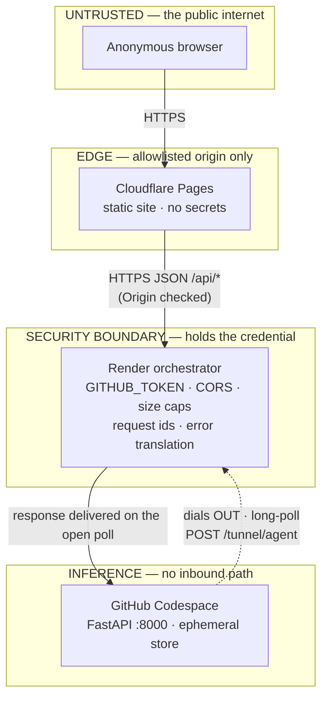
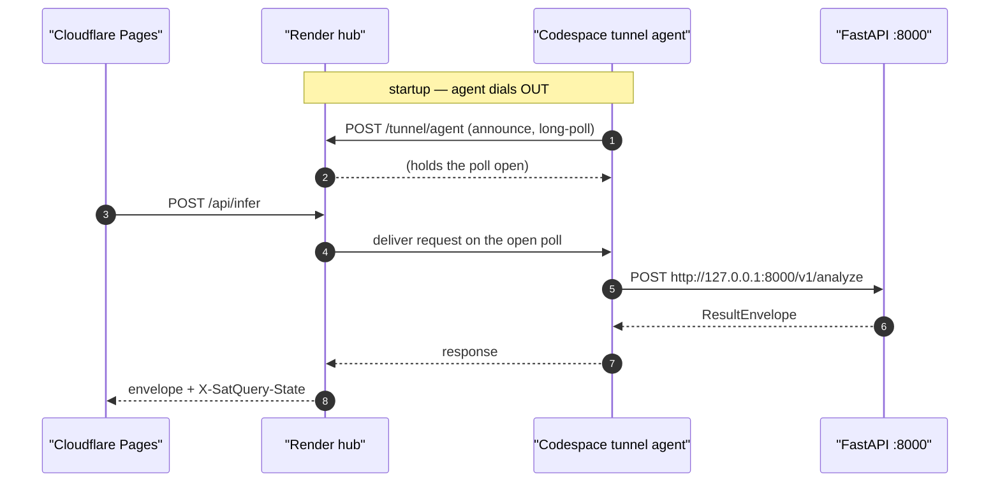

# SatQuery AI — Security Model, Trust Boundary and Threat Posture

**Status of this document.** This is the security chapter of the public SatQuery AI release. It is
written against the shipped code and the shipped configuration, and every non-obvious claim carries a
file reference. It is deliberately explicit about **what the system does not defend against**, because
the single most common failure mode in a security document is to describe a design intent as if it were
an enforced control.

**Status vocabulary used throughout** (see `DOCS_STYLE_GUIDE.md` §2): `IMPLEMENTED` · `VERIFIED` ·
`MEASURED` · `ATTEMPTED` · `NOT RUN` · `BLOCKED` · `DEFERRED` · `REJECTED` · `OPEN` · `RESOLVED` ·
`CLOSED`.

**Grounding rule.** Every field name, limit, count, code excerpt and command in this document was read
from a file. Where a value could not be established it is written
`UNKNOWN — not established from the available evidence`.

**A note on the word "gateway".** The backend-contract reference is
[`DEPLOYMENT_ARCHITECTURE.md`](architecture/02-deployment-topology.md) §2, which describes a *gateway*
whose job is validation, limits, CORS, request ids, timeouts, secret custody and error translation. In
the **active** topology that role is played by the Render orchestrator (`deploy/render/main.py`), and the
older `gateway/app.py` remains in the tree as the reference implementation of the same contract. This
document names the specific file whenever the distinction matters.

---

## Table of contents

- [0. How to read this document](#0-how-to-read-this-document)
- [1. Scope, trust model and explicit non-goals](#1-scope-trust-model-and-explicit-non-goals)
- [2. Secret custody](#2-secret-custody)
- [3. CORS: the allowlist rule](#3-cors-the-allowlist-rule)
- [4. Size and resource limits](#4-size-and-resource-limits)
- [5. Rate limiting is a FAIRNESS control, not a security control](#5-rate-limiting-is-a-fairness-control-not-a-security-control)
- [6. The `/v1/assets` endpoint: fail-closed behaviour and the handle-as-capability](#6-the-v1assets-endpoint-fail-closed-behaviour-and-the-handle-as-capability)
- [7. Input validation and modality inference](#7-input-validation-and-modality-inference)
- [8. The error-translation contract: what may reach a client](#8-the-error-translation-contract-what-may-reach-a-client)
- [9. The outbound tunnel: no inbound firewall hole](#9-the-outbound-tunnel-no-inbound-firewall-hole)
- [10. What is explicitly NOT defended against](#10-what-is-explicitly-not-defended-against)
- [11. Release-side security discipline: no secrets in any published file](#11-release-side-security-discipline-no-secrets-in-any-published-file)
- [12. Reporting a vulnerability](#12-reporting-a-vulnerability)
- [13. Open, blocked and not-run items](#13-open-blocked-and-not-run-items)
- [14. Evidence index](#14-evidence-index)

---

## 0. How to read this document

### 0.1 Three kinds of statement, and why the distinction is load-bearing

SatQuery AI is a research prototype with a **narrow, deliberate security scope**. The scope was set by
the project's own architecture plan, which excludes authentication, multi-tenancy, queues and
autoscaling from v1 (`docs/API_CONTRACT.md` §7; `docs/DEPLOYMENT_ARCHITECTURE.md` §6). The consequence is
that some of what a reader expects a "security chapter" to contain is **absent by design**, and the honest
way to present that is to separate three classes of statement:

| Class | Meaning | Example in this document |
|---|---|---|
| **Enforced control** | Code that runs on every request and refuses something | the CORS allowlist (§3); the body-size cap (§4) |
| **Fairness / operational control** | Code that bounds a resource, but which a hostile caller can defeat | the per-IP rate limiter (§5) |
| **Non-goal** | A property the system does not claim, and is not built to provide | authentication (§1.3); audit logging (§10) |

A document that blurred these three would let a reader size a deployment's abuse protection on a control
that cannot carry it. The rate limiter is the sharpest case, and §5 quotes the owner ruling that settles
it.

### 0.2 The four findings that shape this chapter

Four measured findings from the project's layer-crossing audit are the spine of the document, because
each one is a security property that was **asserted, then measured, then corrected** — which is the only
kind of claim worth publishing:

| Finding | One-line summary | Section |
|---|---|---|
| **F-2** | The CORS allowlist was enforced on the *request* leg only; an upstream CORS header was relayed verbatim on the *response* leg, bypassing the allowlist. Measured, then fixed. | §3.5 |
| **F-5** | The per-IP rate limiter keys on a client-supplied header, so a caller varying it produces **no** `429` at all. Measured; ruled a fairness control, not a protection control. | §5 |
| **F-6 / F-9** | The body-size cap was *declarative* — it measured a `Content-Length` header. A client omitting the header was never measured, and the whole body was buffered. Measured at both layers, then fixed with a streaming reader. | §4.4 |
| **F-15** | A construction failure's exception string — containing a **server-side checkpoint path** — reached client-visible fields. Ruled: sanitize client-facing messages, retain full detail server-side. | §8.4 |

### 0.3 What "public release" changes

This release publishes documentation, model artifacts and tooling to a public GitHub repository and a
public Hugging Face model repository. Publishing changes the security question in one specific way: the
**documentation itself becomes an attack surface for information disclosure**, because it is written from
the inside and naturally quotes paths, environment variable names and configuration. §11 records the
discipline that governs this, and the scan that enforces it.

---

## 1. Scope, trust model and explicit non-goals

### 1.1 What the system is

SatQuery AI is a geospatial vision-language analysis service. A user uploads one or two satellite
images, asks a natural-language question, and receives a structured `ResultEnvelope` containing an
answer, evidence, calibrated confidence and an execution trace. Six task capabilities are served: `vqa`,
`caption`, `grounding`, `change`, `change_vqa` and `optical_sar` (`CURRENT_RELEASE_STATE.md` §1,
`GET /api/capabilities` — six entries, all `available: true`).

The deployed topology is four tiers (`docs/architecture/02-deployment-topology.md` §1):

```
Browser
  │  HTTPS
  ▼
Cloudflare Pages            (static frontend, https://satquery.pages.dev)
  │  HTTPS JSON  /api/*
  ▼
Render orchestration hub    (satquery-orchestrator; CORS, wake flow, limits)
  │  outbound long-poll  POST /tunnel/agent
  ▼
GitHub Codespace            (FastAPI inference, CPU, port 8000)
  │
specialist models           (SmolVLM · RemoteCLIP · STANet-change · CROMA-fusion · MiniLM router)
```

### 1.2 What each tier holds — the trust table

The architecture document states this as a per-tier table
(`docs/architecture/02-deployment-topology.md` §2, "Holds secrets? / Holds state?"):

| Tier | Host / identity | Runs | Holds secrets? | Holds state? |
|---|---|---|---|---|
| Frontend | Cloudflare Pages, `https://satquery.pages.dev` | static site (`frontend/`) | **no** | no |
| Orchestrator / gateway | Render, `<backend-host>` | `deploy/render/main.py` | **`GITHUB_TOKEN` only** | no — stateless proxy |
| Inference | GitHub Codespace `potential-space-trout-r4ppw969w45j2pvvw`, port `8000` | `app/space_app.py::build_space_app()` via `deploy/codespace/serve.py` | no gateway secrets | ephemeral asset store only |
| Model hosting | Hugging Face (project card + pinned model references) | — | no | no |

The security-relevant reading of this table: **the only tier that holds a credential is the
orchestrator, and the browser talks to the orchestrator, not to the inference host.** §2 develops this.

### 1.3 The explicit non-goals

These are not omissions. They are exclusions recorded in the architecture plan and restated in the
contract. Each is quoted from the file that records it.

| Non-goal | Where it is recorded | Exact statement |
|---|---|---|
| **No authentication** | `docs/API_CONTRACT.md` §7 | *"There is no authentication in v1. This is a recorded boundary, not an oversight."* |
| **No user accounts / multi-tenancy** | `docs/DEPLOYMENT_ARCHITECTURE.md` §6 (from plan §73/§74) | *"No multi-tenant isolation, no auth, no user accounts."* |
| **No database, no persistence, no session store** | `docs/DEPLOYMENT_ARCHITECTURE.md` §2.2 | *"No persistence. No database, no Redis, no session store."* |
| **No PII store** | consequence of the above: there is no user model, no account, no session, and the only retained bytes are ephemeral image uploads with a bounded TTL (§6) | — |
| **No request queue** | `docs/DEPLOYMENT_ARCHITECTURE.md` §2.2 | *"No request queue (plan §73 forbids Redis-cluster/queue infrastructure)."* |
| **No retries on `/v1/analyze`** | `docs/DEPLOYMENT_ARCHITECTURE.md` §2.2 | *"No retries on `POST /v1/analyze`. A retry would consume GPU quota a second time; the client must decide."* |
| **No model inference at the gateway** | `docs/DEPLOYMENT_ARCHITECTURE.md` §2.2 | *"No model inference."* |
| **No asset storage at the gateway** | `docs/DEPLOYMENT_ARCHITECTURE.md` §2.2 | *"The gateway relays upload bytes; it does not retain them."* |

The orchestrator's own module docstring states the same three absences in one sentence
(`deploy/render/main.py`): *"It holds no model, no state, no database, and performs **no auth** (per plan
§73/§74)."*

### 1.4 The trust model, stated plainly



Two properties follow, and both are stated in the source rather than inferred:

1. **The trust boundary is the orchestrator.** The architecture document says the inference host *"cannot
   hold the security boundary"* and that rate limiting, size caps, CORS and secret custody *"belong
   outside it"* (`docs/DEPLOYMENT_ARCHITECTURE.md` §1.1). The frontend guide states the same from the
   client side: the frontend talks only to the gateway and never calls the inference host directly —
   *"it is not the security boundary and its CORS will not welcome you"* (`docs/FRONTEND_INTEGRATION.md`
   §7, quoted in `docs/architecture/02-deployment-topology.md` §2.7).
2. **There is no identity to escalate from.** Because v1 has no auth, an unauthenticated caller *is* the
   only kind of caller. `docs/DEPLOYMENT_ARCHITECTURE.md` §5.2 argues this explicitly: the rate-limiter
   weakness *"does **not** mean the service is insecure in the sense of a privilege escalation: §6 below
   excludes auth by design and `API_CONTRACT.md` §7 states 'there is no auth in v1', so an
   unauthenticated caller cannot escalate from a position of nothing."* What it *does* mean is that the
   limiter cannot protect a metered resource — which is §5.

### 1.5 What "the request-side boundary" enforces

The gateway is described as the request-side boundary for exactly three things
(`docs/DEPLOYMENT_ARCHITECTURE.md` §5.2, final bullet): **shape, size and content type**. Rate is
explicitly *not* one of them. §4 and §7 cover shape and size; §4.6 covers content type.

---

## 2. Secret custody

### 2.1 The rule

> **The gateway holds credentials that must never reach the browser.**

This is the first of the eight gateway responsibilities in `docs/DEPLOYMENT_ARCHITECTURE.md` §2.1, whose
row reads: *"Secret custody | HF token lives here only | The browser never sees it."* The
contract restates it as a frontend obligation (`docs/API_CONTRACT.md` §7): *"The frontend **must not**
embed an HF token, an API key, or any secret. It talks only to the gateway."*

### 2.2 Where each secret lives

The architecture document's env-var vocabulary table (`docs/DEPLOYMENT_ARCHITECTURE.md` §4) assigns each
variable to a layer:

| Variable | Where it lives | Purpose |
|---|---|---|
| `HF_TOKEN` | **gateway only** (Railway in the design; Render in the active topology, *if used*) | Authenticate gateway → inference host. Never sent to the browser |
| `SATQUERY_SPACE_URL` / `SATQUERY_UPSTREAM_URL` | gateway | Upstream inference URL |
| `SATQUERY_ALLOWED_ORIGINS` | gateway | CORS allowlist (the frontend origin) |
| `PORT` | platform | Supplied by the platform |
| `SATQUERY_DEVICE` | inference host | `cpu` \| `cuda` \| `mps` \| `null` |
| `SATQUERY_ASSET_ENABLED` / `SATQUERY_ASSET_DIR` | inference host | Enables `POST /v1/assets`; **both** required |
| `SATQUERY_MAX_FILE_BYTES` | **both** | Per-file cap, read by gateway *and* inference host from one variable |
| `SATQUERY_MAX_BODY_BYTES` | gateway | Whole-request body cap |
| `SATQUERY_UPSTREAM_TIMEOUT_S` | gateway | Gateway → inference timeout |
| `SATQUERY_RATE_LIMIT_PER_IP` / `SATQUERY_RATE_LIMIT_WINDOW_S` | gateway | Per-IP count and window (fairness; §5) |
| `SATQUERY_ASSET_MAX_FILES` / `SATQUERY_ASSET_TTL_S` | inference host | Optional handle capacity / lifetime |

**No secret is committed.** `docs/DEPLOYMENT_ARCHITECTURE.md` §4 states it directly: *"**No secret is
committed.** `configs/deploy.yaml` contains no token, and the gateway must read its own from the platform
environment."* The `.gitignore` enforces the same for the artifact and data classes that could carry one:
it excludes `checkpoints/`, `artifacts/`, `*.pt`, `*.pth`, `*.safetensors`, `*.bin`, `data/`,
`benchmark/`, `outputs/`, `runs/`, `*.log`, `.deploy/`, `.kaggle/`, `kaggle.json`, and `.cache/`
(`.gitignore`). The `kaggle.json` and `.kaggle/` rules are specifically credential-shaped.

### 2.3 The live configuration, as measured

The live Render configuration was measured on 2026-09-25 from `GET /api/health`, and the result is
recorded in the header note of `docs/DEPLOYMENT_TOPOLOGY.md`:

> *"Verified against `GET /api/health`: env vars are
> `CODESPACE_NAME=potential-space-trout-r4ppw969w45j2pvvw`, `CODESPACE_PORT=8000`,
> `SATQUERY_ALLOWED_ORIGINS=https://satquery.pages.dev`, `SATQUERY_DEVICE=cpu`,
> `SATQUERY_TRANSPORT=auto`, `SATQUERY_TUNNEL_TIMEOUT_S=150`, `SATQUERY_WAKE_TIMEOUT_S=120`,
> `SATQUERY_UPSTREAM_TIMEOUT_S=90`, `GITHUB_TOKEN`.
> There is **no** `SATQUERY_UPSTREAM_URL` and **no** `HF_TOKEN` in the live config."*

The health payload reports the token **as a boolean, never as a value**
(`deploy/render/main.py`):

```python
"has_github_token": bool(os.environ.get("GITHUB_TOKEN")),
```

The measured payload confirms `"has_github_token": true` (`CURRENT_RELEASE_STATE.md` §1, live health
probe). Two consequences a reader should draw:

1. **The deployment does not hold an `HF_TOKEN`.** The token the design assumed for the HF proxy path is
   absent, because the active transport is the outbound tunnel (§9) and the model host is a Codespace,
   not a Space. The one credential present is `GITHUB_TOKEN`, used only by the GitHub-API wake path.
2. **A boolean is the correct disclosure for a health endpoint.** The endpoint tells an operator whether
   a credential is configured without publishing it. This is the pattern the whole of §2 is about.

### 2.4 The token-injection path, and why `Authorization` is dropped

When the gateway (reference implementation `gateway/app.py`) forwards a request, the upstream headers are
built by `GatewayPolicy.upstream_headers` (`gateway/policy.py`). The docstring states the rule:

> *"Strips hop-by-hop headers (a proxy must not forward them) and injects the bearer token. **The token
> never travels back to the client** — `docs/DEPLOYMENT_ARCHITECTURE.md` section 4 keeps it here."*

The implementation drops two header classes and then injects:

```python
out: dict[str, str] = {}
for key, value in incoming.items():
    if key.lower() in DEFAULT_HOP_BY_HOP:
        continue
    if key.lower() in ("host", "authorization"):
        # `authorization` is dropped rather than overwritten so a client
        # cannot smuggle a credential toward the Space.
        continue
    out[key] = value
if token:
    out["Authorization"] = f"Bearer {token}"
return out
```

Three properties are worth naming, because each is a deliberate choice rather than an implementation
detail:

1. **The client's own `Authorization` header is dropped, not overwritten.** A client cannot smuggle a
   credential toward the inference host. The comment says so: *"`authorization` is dropped rather than
   overwritten so a client cannot smuggle a credential toward the Space."*
2. **`host` is dropped.** Forwarding the client's `Host` to a different upstream would be a
   request-routing hazard.
3. **An empty token sends no `Authorization` header at all.** The docstring records the measurement: *"The
   `Authorization` header is omitted entirely when `token` is empty. Sending `Authorization: Bearer `
   (with an empty credential) is rejected by httpx itself with `LocalProtocolError: Illegal header
   value`, which surfaced as a 502 whose `detail` blamed the upstream -- even though the upstream had not
   been contacted."* An unauthenticated deployment is legitimate (`HF_TOKEN` is optional), so the correct
   behaviour is to send no credential rather than an empty one.

The hop-by-hop set is RFC 9110 §7.6.1 (`gateway/policy.py`):

```python
DEFAULT_HOP_BY_HOP: frozenset[str] = frozenset(
    {
        "connection", "keep-alive", "proxy-authenticate", "proxy-authorization",
        "te", "trailer", "transfer-encoding", "upgrade",
    }
)
```

### 2.5 The response leg: credential-shaped headers are stripped

A gateway that injects a credential on the way out must also refuse to relay credential-shaped headers on
the way back. `GatewayPolicy.response_headers` (`gateway/policy.py`) strips, in addition to hop-by-hop:

| Stripped on the response leg | Why |
|---|---|
| `content-length`, `content-encoding` | the ASGI layer re-frames the body, so a forwarded length would be wrong and a forwarded encoding applied twice |
| `authorization`, `www-authenticate`, `proxy-authorization` | *"a caller could pass this method the *request* headers by mistake, and the token we injected upstream is a credential. Stripping them here makes that mistake non-disclosing rather than catastrophic."* |
| `set-cookie`, `cookie` | the gateway is stateless and has no cookie to set; forwarding one would create a session the architecture does not have |
| **every `access-control-*`** | the CORS decision is the gateway's alone (see §3.5) |

The `authorization` row is the one that matters for secret custody: it makes a plausible programming
error — passing the request headers where the response headers were meant — **non-disclosing**, because
the credential-shaped headers are removed on both legs regardless of which dictionary is passed in.

### 2.6 The browser never sees a token — what that means concretely

Stated as observable facts rather than as an assurance:

| Observable | Value | Source |
|---|---|---|
| The frontend is a static site with no backend | *"No backend, no secrets, no API calls of any kind"* on the static pages | `docs/DEPLOYMENT_TOPOLOGY.md` §3.1 |
| The frontend calls only the orchestrator | `/api/health`, `/api/infer`, `/api/capabilities`, `/api/assets` | `docs/DEPLOYMENT_TOPOLOGY.md` §3.2 |
| The token is reported to a client as a boolean | `"has_github_token": true` | `deploy/render/main.py`; `CURRENT_RELEASE_STATE.md` §1 |
| The token never appears in a response body | the health payload's `config` block carries `codespace_name`, `codespace_port`, `has_github_token`, `allowed_origins`, `production_origins`, `dev_origins_enabled`, `wake_timeout_s`, `upstream_timeout_s`, `device` — no token value | `deploy/render/main.py` `health()` |

**What is not established:** whether the *deployed* `SatQuery-Backend` build (private repo, revision
`89d80eaddec5`) differs from the `deploy/render/main.py` in this monorepo. The monorepo's `deploy/` is
recorded as *"stale/untracked and is NOT the deployed source"* (`docs/FINAL_DELIVERY_REPORT.md` §2,
`CURRENT_RELEASE_STATE.md` §6). So the statements above are grounded in the monorepo reference
implementation and in the **live** health payload, which is measured — not in the private deployment's
source, which is
`UNKNOWN — not established from the available evidence`.

---

## 3. CORS: the allowlist rule

### 3.1 The rule

> **`SATQUERY_ALLOWED_ORIGINS=https://satquery.pages.dev`, and never `*`.**

The architecture document states it as a gateway responsibility with a one-word prohibition
(`docs/DEPLOYMENT_ARCHITECTURE.md` §2.1): *"CORS | Explicit allowlist of the frontend origin | Never `*`."*
The measured live value is exactly the production origin (`docs/DEPLOYMENT_TOPOLOGY.md` header note).

### 3.2 The decision function

CORS is decided by a function, not by a middleware configuration, so the decision is assertable without a
server (`gateway/policy.py::build_cors_headers`). The docstring explains why:

> *"The middleware is correct, but the *decision* is the thing under test, and
> `docs/DEPLOYMENT_ARCHITECTURE.md` section 2.1 requires an explicit allowlist that is never `*`. Stating
> the decision in a function makes it assertable without an ASGI server."*

```python
def build_cors_headers(
    origin: str | None, allowed: Sequence[str], *, request_headers: str = ""
) -> dict[str, str]:
    if not origin or origin not in allowed:
        return {}
    return {
        "Access-Control-Allow-Origin": origin,
        "Access-Control-Allow-Methods": "GET, POST, OPTIONS",
        "Access-Control-Allow-Headers": request_headers or "Content-Type, X-Request-Id",
        "Access-Control-Max-Age": "600",
        "Vary": "Origin",
    }
```

The load-bearing line is the first one. A disallowed origin receives **no CORS headers at all** — the
docstring states why that is the point: *"A disallowed origin receives **no CORS headers at all**, which
is what makes the browser block the response. Echoing the origin back with
`Access-Control-Allow-Origin: <origin>` regardless would defeat the allowlist entirely."*

Note also `Vary: Origin`, which prevents a shared cache from serving one origin's CORS answer to another.

### 3.3 Startup refuses a wildcard

The allowlist is validated **at construction**, so a misconfigured deployment fails fast rather than
serving traffic with an open policy (`gateway/policy.py::GatewayConfig.__post_init__`):

```python
if "*" in self.allowed_origins:
    raise ValueError(
        "allowed_origins must not contain '*'. A wildcard exposes the "
        "Space to any origin (docs/DEPLOYMENT_ARCHITECTURE.md 2.1)"
    )
```

and, immediately before it:

```python
if not self.allowed_origins:
    raise ValueError(
        "allowed_origins must be non-empty. An empty allowlist would "
        "either block every browser or, if the app fell back to '*', "
        "expose the Space. Refuse to start rather than guess."
    )
```

The empty-list case is the subtle one and the message says why: an empty allowlist has two possible
"fixes" in a hurried implementation — block everything, or fall back to `*` — and the second is a silent
security failure. The validator refuses both by refusing to start.

### 3.4 The development origins are enumerated, never a pattern

The orchestrator adds local development origins so a frontend developer can test without deploying
(`deploy/render/main.py::_DEV_ORIGINS`). The list is an explicit enumeration:

```python
_DEV_ORIGINS: tuple[str, ...] = tuple(
    f"http://{host}:{port}"
    for host in ("localhost", "127.0.0.1")
    for port in ("3000", "5500", "5173", "8000", "8080")
)

_PRODUCTION_ORIGINS: tuple[str, ...] = ("https://satquery.pages.dev",)
```

Two design decisions are recorded in the docstrings, and both are security-relevant:

1. **Production is listed in code, not only in the environment.** *"Listed here rather than only in the
   environment so that a deployment which forgets `SATQUERY_ALLOWED_ORIGINS` still serves the real
   frontend -- an empty allowlist would otherwise take the live site down, which is a worse failure than
   the one this guards."*
2. **The dev list is explicit, and cannot be reached from a remote host.** *"This list is deliberately
   EXPLICIT, never a wildcard or a suffix match. It cannot be used to reach the deployment from an
   arbitrary host: only a browser running on the developer's own machine can send
   `Origin: http://localhost:*`."* The enumerated host:port pairs — and the fact that `localhost` and
   `127.0.0.1` are *distinct browser origins* — are the reason both spellings appear.

The dev origins can be switched off for a production deployment via `SATQUERY_ALLOW_DEV_ORIGINS`
(`deploy/render/main.py::_dev_origins_enabled`), and the health payload reports the **effective** list so
an operator can prove from outside that they were turned off (`allowed_origins`, `dev_origins_enabled`).

### 3.5 F-2: the response-leg bypass, measured and fixed

This is the most instructive CORS item in the project, because the allowlist was **correct on the request
leg and bypassed on the response leg**. It is recorded in `gateway/policy.py::response_headers`'s
docstring and in `docs/DEPLOYMENT_ARCHITECTURE.md` §5.

**The defect.** Until 2026-09-22 the CORS decision was made only on the *request* leg
(`build_cors_headers`, via `admit()`), and the *response* leg rebuilt the upstream's headers wholesale.
So a CORS header the inference host emitted on its own was relayed to the browser verbatim, on top of the
gateway's allowlist answer.

**The measurement.** With the allowlist set to `["https://app.example.com"]` and the upstream answering
with `Access-Control-Allow-Origin: *` (`gateway/policy.py`, verbatim):

| Request | Result |
|---|---|
| `GET /v1/health` from `https://evil.example.net` | returned **two** values for `access-control-allow-origin`, `*` and the allowlisted origin |
| `POST /v1/analyze` from the same disallowed origin | returned `200` with `Access-Control-Allow-Origin: *` **and** `Access-Control-Allow-Credentials: true` |

**Why the `*` case is worse than a permissive echo.** The docstring argues it: *"a duplicated `ACAO` is not
a value a browser can match to an allowlisted origin -- it makes the gateway's own correct headers
unreliable for allowed callers while the `*` still admits everyone."* The bypass therefore degrades the
service for legitimate callers **and** admits everyone — two failures in one header.

**The fix** is a **prefix rule**, not an enum:

```python
and not key.lower().startswith("access-control-")
```

The docstring records why a prefix rather than a list: *"RFC 6648 discourages new `Access-` headers, but
the CORS family has grown (`-Allow-Credentials`, `-Expose-Headers`, `-Max-Age`, `-Allow-Methods`,
`-Allow-Headers`) and an enum would silently miss whichever is added next. Nothing the Space may
legitimately return starts with this prefix, because the CORS answer is the gateway's to give."*

**A pinned assertion, not a trusted helper.** `gateway/app.py::_proxy` asserts the filter rather than
relying on it:

```python
assert not any(_is_cors_header(k) for k in out_headers) or decision.headers, (
    "a CORS header reached the response without a policy decision; the "
    "upstream's headers are no longer filtered (see F-2)"
)
out_headers.update(decision.headers)
```

The comment states the intent: *"The CORS answer is decided in ONE place. If `response_headers` ever stops
filtering, the upstream's headers reach a disallowed origin -- so this pins the filter rather than trusting
it."*

**Verified by a test.** `tests/unit/test_gateway_app.py::test_an_upstream_cors_header_cannot_bypass_the_allowlist`
(`gateway/app.py`). The helper `_is_cors_header` is deliberately written without the literal prefix —
`_CORS_HEADER_PREFIX = "access-" + "control-"` — *"so that `tests/unit/test_gateway_app.py`'s 'the app
must not build an access-control-\* header itself' assertion is testing the app's behaviour rather than
tripping over this helper's spelling."*

### 3.6 Preflight is answered by the gateway, never forwarded

`GatewayPolicy.admit` step 1 (`gateway/policy.py`):

```python
# 1. Preflight is answered here, never forwarded. The Space has no CORS
#    configuration and forwarding OPTIONS would waste a round trip.
if method == "OPTIONS":
    return PolicyDecision.allowed(request_id, headers)
```

This closes the preflight failure recorded as a deployment blocker: *"Hand-rolled CORS; `OPTIONS` raised
`405`, so browser preflight failed"* (`docs/DEPLOYMENT_TOPOLOGY.md` §4, blocker #3).

---

## 4. Size and resource limits

### 4.1 The limit table

Every limit below is read from a file. The gateway defaults are `GatewayConfig` dataclass defaults
(`gateway/policy.py`); the image geometry values are from the frozen configuration registry
(`configs/base.yaml`).

| Limit | Value | Where | Enforced by |
|---|---|---|---|
| Whole-request body cap | `8 * 1024 * 1024` = **8,388,608 bytes (8 MiB)** | `GatewayConfig.max_body_bytes` (`gateway/policy.py`) | `SATQUERY_MAX_BODY_BYTES` |
| Per-file cap | `4 * 1024 * 1024` = **4,194,304 bytes (4 MiB)** | `GatewayConfig.max_file_bytes` (`gateway/policy.py`) | `SATQUERY_MAX_FILE_BYTES`, read by **both** layers |
| Max image pixels | **25,000,000** | `image.max_pixels` (`configs/base.yaml`) | `OversizedImageError` (`core/errors.py`) |
| Max tiles examined | **64** | `image.max_tiles` (`configs/base.yaml`) | tile policy (`docs/MASTER_ARCHITECTURE_PLAN.md` §9.1) |
| Tile size / overlap | **512** / **128** | `image.tile_size`, `image.tile_overlap` (`configs/base.yaml`) | preprocessing |
| Top-K tiles through a specialist | **4** | `image.top_k_tiles` (`configs/base.yaml`) | tile policy |
| Per-IP rate limit | **10** requests / **60.0 s** | `GatewayConfig.rate_limit_per_ip` / `_window_s` | fairness only (§5) |
| Upstream timeout | **90.0 s** | `GatewayConfig.upstream_timeout_s` | gateway → inference |
| Agent budget (inference host) | **120 s** | `agent.timeout_seconds` (`configs/base.yaml`) | controller |
| Asset handle capacity | **32** files | `AssetStore.max_files` default | inference host |
| Asset handle TTL | **900.0 s (15 min)** | `AssetStore.ttl_seconds` default | inference host |
| Evidence items | **32** | `evidence.max_items` (`configs/base.yaml`) | evidence engine |

### 4.2 Why there are two byte caps

The per-file cap is below the body cap **by construction**, and the ordering is validated at startup
(`gateway/policy.py`):

```python
if self.max_file_bytes > self.max_body_bytes:
    raise ValueError(
        "max_file_bytes exceeds max_body_bytes; the per-file cap would "
        "be unreachable and the body check would fire first"
    )
```

The reason for two caps rather than one is in `docs/DEPLOYMENT_ARCHITECTURE.md` §4: `SATQUERY_MAX_BODY_BYTES`
is the *whole-request* cap, *"above the per-file cap so one legal file is never refused for framing
overhead."* A multipart envelope around a legal 4 MiB file must not be refused because the envelope
pushed the total past 4 MiB.

### 4.3 The image-geometry budget

The pixel budget is a **resource** control in the same family as the byte caps, and it lives in the frozen
config registry rather than in the gateway (`configs/base.yaml`):

```yaml
image:
  max_pixels: 25000000
  tile_size: 512
  tile_overlap: 128
  max_tiles: 64
  # plan section 9.1 tile policy: whole-image thumbnail first, then top-K tiles.
  # max_tiles is the hard ceiling on tiles *examined*; top_k_tiles is how many
  # are actually sent through a specialist.
  top_k_tiles: 4
```

The plan's tile policy is the reason `max_tiles` and `top_k_tiles` are separate: *"Do not send every tile
through the VLM"* (`docs/MASTER_ARCHITECTURE_PLAN.md` §9.1). `max_tiles: 64` bounds what is *examined*;
`top_k_tiles: 4` bounds what is *sent through a model*. A maliciously large image therefore cannot turn
into 64 model calls.

**Status of the pixel budget.** The registry values are frozen and hashed
(`config_hash == 78f1e3700da15aa1`), and `OversizedImageError` exists with the code `oversized_image`
(`core/errors.py`, mapped to HTTP `413` in `gateway/policy.py::_CODE_STATUS`). Whether the *deployed*
inference host actually enforces `max_pixels` on every path is
`UNKNOWN — not established from the available evidence`: the live validation (§14) exercised real
uploads but did not include an over-pixel-budget probe.

### 4.4 F-6 / F-9: the cap must be enforced *while reading*, at both layers

This is the finding that turned a declared limit into an enforced one, and it is the clearest example in
the project of a control that *looked* present and was not.

**The defect (F-6, gateway).** `GatewayPolicy.admit` step 3 refuses an oversized body from the
`Content-Length` **header alone**, and it has to: it runs before the body is read, so the header is the only
evidence available. That makes the cap **declarative** — a client that omits the header is never measured.
The measured consequence, through the real ASGI stack with `max_body_bytes` at 8 MiB and a 12 MiB body
(`gateway/app.py`, verbatim):

| Case | Result | Peak allocation | Bytes read |
|---|---|---|---|
| `Content-Length` **declared**, 12 MiB | `413 oversized_image` | **0.2 MiB** | **0** (the cap worked) |
| `Content-Length` **omitted**, 12 MiB | `502 model_unavailable` | **13.9 MiB** | **12 MiB** (the cap was **SKIPPED**) |

and *"allocation tracked the body size exactly with no ceiling -- 1/8/16/32/64 MiB in produced
3.0/8.1/16.0/32.0/64.0 MiB allocated."* The source's own summary: *"the header check protects the common
case and bounds nothing in the hostile one."*

**The fix.** A streaming reader that refuses the moment the accumulated total exceeds the limit
(`gateway/assets.py::read_body_bounded`, called by `gateway/app.py::_read_body_bounded`):

```python
chunks: list[bytes] = []
total = 0
async for chunk in request.stream():
    total += len(chunk)
    if total > limit:
        # Stop reading immediately. Doing so lets the server close the
        # connection without the client delivering the rest of the body,
        # which is the point of a streaming cap.
        return b"", True
    chunks.append(chunk)
return b"".join(chunks), False
```

The docstring records why `Content-Length` is *not* consulted here even as a fast path: *"The F-6
measurement is the reason: a declared length drew `413` with 0.2 MiB peak, but an **omitted** one drew
`502` with a 13.9 MiB peak, so anything keyed on that header holds only for clients that tell the truth.
A client that lies low is caught by the accumulation check; a client that omits the header is measured
like any other."* The bound is therefore `limit + one chunk`, *"rather than by whatever the client chose
to send."*

**The defect (F-9, the second layer).** The inference host had the *same* `await request.body()` line and
therefore the same defect. Measured with the cap at 1 MiB (`gateway/assets.py`, verbatim): *"a **64 MiB**
body produced a peak allocation of **128 MiB**, and a 16 MiB body 32 MiB, tracking body size **linearly
with no ceiling**. It answered `413` eventually, but only after buffering everything. The gateway's fix
had protected one caller of two."*

**The fix, and the anti-drift reasoning.** The helper was **moved down** to the module both layers already
import, rather than copied. The docstring states the reason as the F-7 finding restated: *"Fixing the
Space by copying the helper would have created two copies of a security control -- and two copies drift,
which is the F-7 finding restated."* `gateway/assets.py` is dependency-free (no fastapi, no starlette, no
httpx, no torch), which is what lets the inference host import it without pulling the web stack.

**Two lines, both needed.** `docs/DEPLOYMENT_ARCHITECTURE.md` §4 states the resulting posture: *"Both
layers are needed and neither replaces the other: the header check is the one that saves memory in the
common case, and the streaming check is the one that cannot be evaded. **Operators should not treat the
header check as the protection** — it protects the gateway's memory against honest clients, not against
hostile ones."*

### 4.5 F-7: one variable is not one value

`SATQUERY_MAX_FILE_BYTES` is read by **both** layers — the gateway validates it, and the inference host
builds its `AssetStore` from it (`app/space_app.py::_asset_max_file_bytes`). Until the fix, they parsed it
differently, and the docstrings asserted they *"cannot disagree"*. Measured on 2026-09-22 with the same
value through both parsers (`gateway/policy.py`, verbatim):

| Input | Gateway | Inference host |
|---|---|---|
| `'0'` | **ACCEPTED** `max_file_bytes=0` | raised `ValueError` |
| `'-1'` | **ACCEPTED** `max_file_bytes=-1` | raised `ValueError` |
| `'abc'` | raised at startup | **silently defaulted** to 4 MiB |
| `'4e6'` | raised at startup | **silently defaulted** to 4 MiB |

The source identifies the dangerous case: *"A cap of 0 is the dangerous case rather than a harmless typo:
the gateway admits the request (its own check is against `max_body_bytes`) and the Space then refuses
EVERY upload, because `len(data) > 0` is true for any non-empty file. The operator sees '413 on every
upload' against a cap they believe they never set."*

Both layers now refuse an unparsable **or non-positive** value and **name the variable**:

```python
max_file_bytes = _int("SATQUERY_MAX_FILE_BYTES", 4 * 1024 * 1024)
if max_file_bytes <= 0:
    raise ValueError(
        f"SATQUERY_MAX_FILE_BYTES={max_file_bytes} is not positive. A "
        f"non-positive per-file cap would make every upload fail on the "
        f"Space while the gateway kept admitting it; the Space's AssetStore "
        f"rejects the same value, so it is refused here to fail at startup "
        f"with the variable named rather than on the first upload"
    )
```

The inference host's parser is deliberately **stricter than a silent default** and **not a bare
exception**, and its docstring says why: *"A silent default is the worse of the first two: it means a
deployment whose operator typed a malformed cap keeps accepting uploads against a limit nobody chose, and
nothing anywhere says so."* The direction of the strictness is argued, too: *"This makes the gateway's
parse stricter, which is the safe direction -- it cannot refuse a value the Space would have accepted,
because the Space refuses these too."*

**Cross-layer agreement is tested.** `docs/API_CONTRACT.md` §2.5 records that *"a cross-layer agreement
test drives the whole matrix through both real parsers."*

### 4.6 The content-type allowlist

The upload path accepts a **closed list of exactly five types** (`gateway/policy.py::GatewayConfig`):

```python
allowed_content_types: tuple[str, ...] = (
    "image/tiff",
    "image/geotiff",
    "image/png",
    "image/jpeg",
    "application/octet-stream",
)
```

Three behaviours are specified and each is a security choice:

1. **An absent type is refused, not defaulted.** `_normalise_content_type` maps `None` to `""` so the
   allowlist check rejects it: *"defaulting an absent type to `application/octet-stream` would make the
   allowlist unenforceable for exactly the clients that omit the header"* (`gateway/assets.py`). The
   contract's framing: *"A request with **no** declared type is **refused rather than defaulted** —
   defaulting is how a PDF reaches a raster reader"* (`docs/API_CONTRACT.md` §2.5).
2. **Media-type parameters are ignored**, so `image/tiff; charset=binary` is accepted
   (`_normalise_content_type` splits on `;`).
3. **The type is enforced independently at both layers.** The inference host keeps its own copy —
   `_ALLOWED_ASSET_CONTENT_TYPES` in `app/space_app.py` — with a stated reason: *"Mirrors
   `GatewayConfig.allowed_content_types`; the Space's copy exists because the Space validates
   independently (defence in depth) rather than trusting that the gateway is the only caller."* This is
   the one place where a duplicated list is **deliberate** rather than a drift hazard, and the docstring
   says so.

The contract notes the practical consequence for a client: *"`image/tiff` is the type the geospatial
specialists need — a client that uploads only PNG/JPEG can serve the VQA, caption and grounding tasks but
not the change or optical/SAR ones"* (`docs/API_CONTRACT.md` §2.5).

### 4.7 Timeout ordering is a validated invariant

The upstream timeout must sit between the longest per-task GPU duration and the agent's own budget, and
both bounds are enforced at construction (`gateway/policy.py`):

```python
if self.upstream_timeout_s <= 45:
    raise ValueError(...)   # would kill a legitimate grounding/optical_sar call
if self.upstream_timeout_s >= 120:
    raise ValueError(...)   # would hold a connection past the point the Space has given up
```

The two messages state the failure each prevents: a too-short timeout *"would kill a legitimate
grounding/optical_sar call and report it as an upstream failure"*; a too-long one *"would hold a
connection past the point the Space has given up, turning an upstream timeout into a client-side hang."*
The frozen per-task durations are `vqa`/`caption` 20 s, `grounding` 45 s, `change` 30 s, `optical_sar`
45 s, `change_vqa` 30 s (`configs/deploy.yaml`; `app/space_app.py::GPU_DURATIONS`), and
`agent.timeout_seconds` is 120 s (`configs/base.yaml`).

---

## 5. Rate limiting is a FAIRNESS control, not a security control

### 5.1 The ruling, quoted in full

This is the section where the document must be most careful, because the temptation is to describe a rate
limiter as "protection". The owner ruling of 2026-09-23 settled the question, and
`docs/DEPLOYMENT_ARCHITECTURE.md` §5.2 records it verbatim:

> **✅ RULED 2026-09-23 (owner ruling): the limiter is RETAINED as a fairness / rate-control mechanism
> only, and it is explicitly NOT a security or abuse-prevention boundary.**
>
> **No code change.** The ruling settles the question this section left open — whether the limiter
> should be hardened into a protection control — and the answer is **no**. It stays as back-pressure
> against accidental loops and honest clients. Consequences a deployment must honour:
>
>   * **Do not size abuse protection on this limiter.** It is not that control, and treating it as one
>     would leave the `5 GPU-minutes/day` ZeroGPU quota unprotected.
>   * **A `429` is a fairness signal, not a security signal**, and its ABSENCE is not evidence that no
>     abuse occurred. A caller varying `X-Forwarded-For` produces no `429` at all (measured below).
>   * The gateway remains the request-side boundary (`§1.1`) for **shape, size and content type** — the
>     things it can actually enforce. Rate is not one of them.
>
> This is a **documentation ruling**: it changes what this document *claims*, not what the code does.

### 5.2 The mechanism

The limiter is an in-memory fixed-window counter keyed on client identity
(`gateway/policy.py::RateLimiter`):

```python
def check(self, identity: str) -> tuple[bool, int, float]:
    now = self.now()
    state = self._state.get(identity)
    if state is None or now - state.window_start >= self.window_s:
        state = RateLimitState(window_start=now, count=0)
        self._state[identity] = state

    if state.count >= self.limit:
        retry_after = self.window_s - (now - state.window_start)
        return False, 0, max(0.0, retry_after)

    state.count += 1
    return True, self.limit - state.count, 0.0
```

Three properties, each deliberate:

1. **A denied request does not increment the counter** — *"otherwise a client hammering the endpoint would
   push its own reset further away on every rejected attempt."*
2. **The clock is injected** (`now: Callable[[], float] = field(default=time.monotonic)`), so tests are
   deterministic without sleeping.
3. **The identity key is the IP alone** (`ClientIdentity.key`): *"Including the user agent would let one
   client obtain an unbounded number of buckets by varying it."*

The limiter is applied only to routes marked `COSTLY_ROUTES` (`gateway/app.py`):

```python
COSTLY_ROUTES: tuple[str, ...] = ("/v1/analyze", "/v1/assets")
```

The docstring explains the membership: `/v1/analyze` costs GPU quota, and *"`POST /v1/assets` does not
touch the GPU, but it does write to the Space's disk and consume one of a bounded number of handles
(`gateway/assets.py`), so an unthrottled upload loop is a cheap denial of service against a
5-GPU-minute deployment."* `COSTLY_ROUTES` is deliberately a **separate allowlist** from
`PROXIED_ROUTES`: *"the two answer different questions -- 'may this reach the Space at all?' and 'does it
cost a metered resource?' -- and collapsing them would make the rate limiter's coverage depend on the
proxy allowlist."*

Rate limiting is step 4 of the admit ladder, after method allowlist and body size, and the ordering is
justified: *"Rate-limiting health checks would make the frontend's load probe fail for no gain"*
(`gateway/policy.py::admit`).

### 5.3 F-5: the measurement that forces the narrow claim

The rate-limit key is derived from the **first hop of `X-Forwarded-For`**
(`gateway/app.py::_client_ip`):

```python
forwarded = request.headers.get("x-forwarded-for")
if forwarded:
    return forwarded.split(",")[0].strip()
```

That header is client-supplied. The code's own docstring already noted the value is attacker-controlled
and is *"a rate-limit key, not an identity"*; what was missing was the **measured consequence**.
Measured in-process, limit set to 3 requests / 60 s, 8 requests sent
(`docs/DEPLOYMENT_ARCHITECTURE.md` §5.2):

| Case | Statuses | Throttled |
|---|---|---|
| One client, no `X-Forwarded-For` | `502 502 502 429 429 429 429 429` | **5 / 8** |
| A fresh spoofed `X-Forwarded-For` per request | `502 502 502 502 502 502 502 502` | **0 / 8** |

So a caller willing to vary one header produces **no `429` at all**. This is the measurement that makes
"the limiter is a fairness control" a *fact* rather than a preference.

### 5.4 Why there is no code fix — and why that is deliberate

`docs/DEPLOYMENT_ARCHITECTURE.md` §5.2:

> **Why there is no code fix here yet, and why that is deliberate.** Correctly trusting
> `X-Forwarded-For` requires knowing how many proxy hops the platform inserts — a **deployment fact**
> that cannot be verified from the build host, where nothing is deployed. Hard-coding an assumption
> would replace a *documented* weakness with an *undocumented* one, which is exactly the error C-4
> made. The fix belongs in the deployment step and needs a live gateway to measure against.

### 5.5 What a client should do with a `429`

A `429` is a normal state, not a bug (`docs/API_CONTRACT.md` §6, obligation 4: *"Handle `429` and `503` as
normal states, not as bugs"*). The response honours `Retry-After`, computed as
`max(1, int(retry_after + 0.999))` (`gateway/policy.py::admit`), and `recoverable: true` is set on the
envelope. The frontend obligation is explicit: *"Serialize analyses. Do not retry `429`/`503` in a tight
loop"* (`docs/API_CONTRACT.md` §9, item 7).

### 5.6 The `rate_limited` code is gateway-origin, and the sets stay disjoint

`rate_limited` is **not** in `core/errors.py`. It is declared in `gateway/policy.py` as a gateway-origin
code, because `docs/API_CONTRACT.md` §5.1 maps HTTP 429 to "Rate limited" while the `core/errors.py`
taxonomy — which covers the *analysis* pipeline, not the proxy — assigns that status no code:

```python
GATEWAY_ORIGIN_CODES: frozenset[str] = frozenset({"rate_limited"})
_CODE_STATUS["rate_limited"] = 429
```

The rule that keeps the taxonomy honest: *"the gateway never invents a code for an error that ORIGINATED in
the Space. Those pass through unchanged."* Two tests hold the line
(`docs/API_CONTRACT.md` §5.3): `tests/unit/test_gateway_responsibilities.py` asserts §5.2 and
`core/errors.py` are in **exact one-to-one correspondence** (23 codes), and
`tests/unit/test_gateway_policy.py` asserts a gateway-origin code may **never** shadow a taxonomy code.

### 5.7 The four client headers that reach the inference host untrusted

Recorded because it is a latent, not a live, exposure (`docs/DEPLOYMENT_ARCHITECTURE.md` §5.2):
`cookie`, `x-forwarded-host`, `x-real-ip` and `x-forwarded-for` are forwarded as the client sent them. The
inference host reads none of them today — *"its only header read is `content-type` (`app/space_app.py`)"* —
so the exposure is latent. `Authorization` is **not** in this set: it is dropped on the request leg and
replaced with the gateway's own token, and stripped again on the response leg (§2.4, §2.5).

---

## 6. The `/v1/assets` endpoint: fail-closed behaviour and the handle-as-capability

### 6.1 The fail-closed gate

`POST /v1/assets` is **off unless explicitly enabled**, and it requires **two** environment variables
(`app/space_app.py::_asset_store_available`):

```python
def _asset_store_available() -> bool:
    import os
    return bool(os.environ.get("SATQUERY_ASSET_ENABLED", "")) and bool(
        os.environ.get("SATQUERY_ASSET_DIR")
    )
```

The docstring states the design: *"Off by default in a deployment that has not set `SATQUERY_ASSET_DIR`,
and ON when it has -- so turning on the fourth endpoint is an explicit operator action rather than
something that starts writing to a temp directory unbidden."* `docs/DEPLOYMENT_ARCHITECTURE.md` §4 states
the same as a contract: *"**Both this and `SATQUERY_ASSET_DIR` must be set** or the route answers `503` —
it fails closed rather than defaulting to a temp directory."*

### 6.2 The refusal is a conforming `503`

When the store is not configured, the handler returns a `503` envelope that names the switch
(`app/space_app.py::assets`):

```python
if not _asset_store_available():
    status, body = translate_error(
        "model_unavailable",
        "Asset upload is not enabled on this deployment.",
        detail=(
            "Set SATQUERY_ASSET_ENABLED=1 and SATQUERY_ASSET_DIR to a "
            "writable path to enable POST /v1/assets. See "
            "docs/DEPLOYMENT_ARCHITECTURE.md."
        ),
        recoverable=False,
    )
    return JSONResponse(status_code=status, content=body)
```

A deployment that has not enabled uploads **says so, with the reason and the switch**, rather than
accepting bytes it cannot keep. `docs/API_CONTRACT.md` §5.1 records the status: `503` when *"the asset
store is unconfigured or full."*

**An honest gap: the two `503` causes are indistinguishable.** A saturated store and an unconfigured store
produce the same status and the same envelope shape. `docs/DEPLOYMENT_ARCHITECTURE.md` §5.1 records this
as finding F-11, and — unusually — records the *removal* of the diagnostic that would have separated them:
the counters (`_refusals`, `_sweeps`) and `AssetStore.stats()` were computed on every request and read by
**nothing**, so they were deleted rather than given a consumer. The section's own summary: *"**⚠️ Removing
the counter did NOT remove the ambiguity.** The two `503` causes remain indistinguishable from a
response, and the deployment still **does not expose** an instrument that tells them apart."* Confirming
which cause applies requires inspecting the deployment.

### 6.3 The handle is the access control

`POST /v1/assets` returns an opaque handle, and the opacity is the *only* access control the endpoint has
(`gateway/assets.py::_new_handle`):

```python
def _new_handle() -> str:
    """An opaque, unguessable handle.

    `secrets`, not `random`: the handle is this endpoint's only access control
    (`API_CONTRACT.md` section 7 -- there is no auth in v1). 128 bits from
    `token_hex(16)` is not brute-forceable, and the prefix keeps a handle
    recognisable in a log without making it derivable.
    """
    return f"asset_{secrets.token_hex(16)}"
```

The module docstring states the two consequences, and they are the security argument for the whole design:

> * **A client cannot enumerate the store.** `asset_0`, `asset_1` or a hash of the content would let a
>   caller who guessed one handle reach another user's upload. There is no auth in v1
>   (`API_CONTRACT.md` section 7), so the handle IS the capability: unguessable is not a nicety, it is
>   the only access control the endpoint has.
> * **A handle does not leak a server path.** The stored filename is the handle plus a sanitised suffix
>   taken from the *content type*, never from the client-supplied name -- so a name like
>   `../../etc/passwd` cannot become a path. The original name is not stored at all, because it is not
>   needed and storing it would be storing attacker-controlled text for no reason.

### 6.4 Path safety: the suffix comes from the type, never the filename

The stored suffix is derived from a fixed mapping keyed on the **normalised content type**
(`gateway/assets.py`):

```python
_SUFFIXES: Mapping[str, str] = {
    "image/tiff": ".tif",
    "image/geotiff": ".tif",
    "image/png": ".png",
    "image/jpeg": ".jpg",
    "application/octet-stream": ".bin",
}
```

The docstring states the property: *"Derived from the TYPE, never from the client-supplied filename, so a
hostile name cannot influence a path."* The stored path is
`self.root / f"{asset_id}{suffix}"` where `asset_id` is the opaque handle — so the only
client-influenced component is the content type, and it is validated against the allowlist (§4.6) before
the suffix is chosen.

**What is not established:** whether the normalised content type is validated against `_SUFFIXES` as well
as against the allowlist before `_suffix_for` runs. `_suffix_for` returns `.bin` for an unknown type, and
`.bin` is a fixed string, so an unknown type cannot produce an attacker-chosen extension — but the
allowlist check in `put()` runs *before* `_suffix_for`, so in the shipped path an unknown type is refused
outright. The `.bin` fallback is therefore
`IMPLEMENTED` but unreachable on the shipped configuration; whether it is reachable on any other
configuration is `UNKNOWN — not established from the available evidence`.

### 6.5 Atomic writes: no partial upload is ever observable

`AssetStore.put` writes via a temporary file and `os.replace` (`gateway/assets.py`):

```python
fd, tmp_name = tempfile.mkstemp(dir=str(self.root), suffix=".part")
try:
    with os.fdopen(fd, "wb") as handle:
        handle.write(data)
    os.replace(tmp_name, path)
except BaseException:
    try:
        os.unlink(tmp_name)
    except OSError:
        pass
    raise
```

The docstring states the property: *"Write via a temporary file and `os.replace`, so a reader can never
observe a partially written upload. `os.replace` is atomic on both POSIX and Windows when source and
destination share a volume."* The `except BaseException` clause leaves nothing behind on failure and *"does
not mask the original exception if the cleanup itself fails."*

### 6.6 Expiry is checked on read, not by a sweeper

`AssetStore.get` evaluates expiry itself (`gateway/assets.py`):

```python
if stamp >= record.expires_at:
    self._forget(asset_id)
    raise UnknownAssetError(f"unknown or expired asset handle {asset_id!r}")
```

The docstring states why: *"Expiry is evaluated here rather than trusted to a sweeper: a handle past its
deadline is unknown even if nothing has run `sweep()`. That is what makes the TTL a guarantee instead of a
housekeeping hope."* The deadline is **monotonic**, so *"a system clock adjustment cannot extend or
truncate a TTL"* (`AssetHandle.expires_at`).

Two more fail-closed behaviours in `get`:

| Condition | Behaviour | Reason |
|---|---|---|
| Record missing or past deadline | `UnknownAssetError` | lapsed handle refused even if nothing swept it |
| Record present but the file is gone | `UnknownAssetError`, and the stale record is dropped | *"an operator cleared the directory, or a container restarted with a fresh volume. Reported as unknown -- the handle is not usable, which is what the client needs to know"* |

### 6.7 Expired and never-issued are one error, on purpose

`UnknownAssetError` covers *expired* as well as *never issued*, and the docstring states the reason:
*"a client cannot act on the difference (both mean 'upload again'), and distinguishing them would report
whether a handle had ever existed -- a small information leak about other clients' uploads, which matters
precisely because there is no auth."* This is a deliberate refusal to provide an oracle.

### 6.8 The response never discloses a path

`AssetHandle.to_response` returns four fields, and `path` is deliberately absent
(`gateway/assets.py`):

```python
def to_response(self) -> dict[str, Any]:
    return {
        "asset_id": self.asset_id,
        "content_type": self.content_type,
        "bytes": self.bytes,
        "expires_at": self.expires_at_iso,
    }
```

The docstring: *"`path` is deliberately absent. Returning it would hand a client a server-side filesystem
location -- an information disclosure, and an invitation to construct a path directly instead of via a
handle."* The contract repeats the guarantee for the frontend: *"It is not a path, and the response never
discloses one"* (`docs/API_CONTRACT.md` §2.5).

### 6.9 No idempotency key — a stated answer, not an omission

`gateway/assets.py` states it as a decision: *"There is **no** idempotency key, and that is a deliberate
answer rather than an omission. A retried upload is a *new* handle, not the same one, because the two
requests are indistinguishable at the server: no plan-specified key exists, and inventing one would be
inventing contract. The cost is a leaked handle, which `AssetStore.capacity` bounds and
`AssetStore.sweep` reclaims."* The contract states the client obligation: *"A client that retries must
therefore use the *latest* handle, and should expect the abandoned one to occupy a slot until it
expires"* (`docs/API_CONTRACT.md` §2.5).

### 6.10 F-12: a misconfigured asset root is a bounded defect

`_asset_store_available()` is a **presence** check — it asks whether the two variables are *set*, never
whether the directory is *usable*. Everything that can go wrong with the configured value therefore
happens later, at `get_asset_store()`, which sits **outside** the `try` that wraps `store.put()`.
Measured with the real ASGI app, root set to a path that exists but is a **file**
(`docs/DEPLOYMENT_ARCHITECTURE.md` §5.1.1):

| `SATQUERY_ASSET_DIR` | Inference host directly | Through the gateway |
|---|---|---|
| unset (the presence gate) | `503` + envelope | `503` + envelope |
| a writable directory (control) | `201` | `201` |
| **an existing file** | **`500 text/plain` `Internal Server Error`** | `502` + envelope |

The third row is a hole in the "every non-2xx carries the envelope" promise, **but only on the inference
host's own public URL**. The gateway refuses to relay a non-JSON upstream body and substitutes a
conforming `502`, so *"a client that goes through the gateway never sees it."* The same holds for the
inference host's framework errors (`GET /v1/assets` → `{"detail":"Method Not Allowed"}`), recorded as
F-12b. The disposition is *"recorded and not repaired"*: *"changing a route's error surface is not an
audit's call, and the Space that would carry it is **not yet deployed**."* Operational guidance: *"prefer a
`SATQUERY_ASSET_DIR` you have confirmed is creatable and writable, and treat a `500` from the Space's own
URL as a configuration fault rather than a crash to debug."*

---

## 7. Input validation and modality inference

### 7.1 Two layers validate, and the schema is authoritative

Validation happens at the gateway (`validate_analyze_body`) and again at the inference host
(`AnalysisRequest.model_validate(payload)`). The gateway's function is deliberately **not** a
re-implementation of the model (`gateway/policy.py`):

> *"Deliberately NOT a re-implementation of `AnalysisRequest`: it checks only what the contract's
> documented error envelope can carry. Two obligations it DOES take on, because forwarding either would
> cost a round trip (and possibly GPU quota) for a request the Space will certainly reject: every field the
> contract marks required is present and well-typed; no field outside the model's own field set is present,
> because `AnalysisRequest` uses `extra="forbid"`."*

The **schema's** validation is authoritative (`extra="forbid"`, Pydantic). The gateway's job is to answer
**cheaply**, before importing the serving stack, *"so that a malformed body never costs a model load."*

### 7.2 The checks the gateway performs

`validate_analyze_body` (`gateway/policy.py`) rejects, each with a conforming envelope:

| Check | Failure | HTTP |
|---|---|---|
| Body is valid UTF-8 JSON | not valid JSON | `400` `input_error` |
| Body is a JSON object | e.g. a JSON array or scalar | `422` `invalid_request` |
| No unknown fields | any key outside `AnalysisRequest.model_fields` | `422` `invalid_request` |
| `assets` is a non-empty array of non-empty strings | missing, empty, or containing a non-string | `422` `invalid_request` |
| `query` is present and a string | missing or wrong type | `422` `invalid_request` |
| `force_task` is `null` or a valid `Task` value | wrong type or unknown value | `422` `invalid_request` |
| `run_id` is `null` or a string | wrong type | `422` `invalid_request` |

Two of these are derived from the source of truth rather than hard-coded, which is the anti-drift
property:

```python
def _analyze_request_fields() -> frozenset[str]:
    try:
        from core.schemas import AnalysisRequest
        return frozenset(AnalysisRequest.model_fields)
    except Exception:  # pragma: no cover - only in a broken install
        return frozenset({"assets", "query", "force_task", "run_id"})
```

```python
def _task_values() -> frozenset[str] | None:
    try:
        from core.schemas import Task
        return frozenset(member.value for member in Task)
    except Exception:  # pragma: no cover - only in a broken install
        return None
```

The **asymmetry** between the two fallbacks is deliberate and security-relevant
(`gateway/policy.py::_task_values`): *"An unknown-field check needs a field set, and the documented four
field names are a short, stable list ... The `Task` values are a different case: they are the router's
vocabulary and the schema is explicit that it may grow (`core/schemas.py`). A stale copy here would
silently reject a newly-added task at the gateway, before the Space could accept it -- **a gate that fails
closed on valid input, which is worse than no gate.** The correct degradation is to forward, since the
Space's own Pydantic model is authoritative anyway."*

**The enum check was once missing, and the omission was not harmless** (`gateway/policy.py`): *"a body with
`force_task: "nonsense"` was forwarded to the Space, whose schema rejected it -- so the client received a
502/upstream error for a defect entirely local to the request. That both mis-states the fault and spends a
GPU-quota round trip on a body the Space cannot accept."*

**Cross-checked in both directions.** `tests/unit/test_gateway_policy.py` *"cross-checks this function's
verdicts against the real model in BOTH directions, which is what caught the originally-missing
unknown-field rule."*

### 7.3 A malformed `Content-Length` cannot bypass the size check

`gateway/app.py::_proxy` treats an unparseable `Content-Length` as **oversized**, not as absent:

```python
try:
    content_length = int(raw_length) if raw_length is not None else None
except ValueError:
    # A non-numeric Content-Length is malformed; treat it as unparseable
    # rather than as absent, so it cannot be used to bypass the size check.
    content_length = cfg.max_body_bytes + 1
```

This is a small, precise anti-bypass: a client sending `Content-Length: abc` is refused rather than
measured as having no length. The streaming reader (§4.4) then measures the body regardless.

### 7.4 Modality inference — where it happens, and where it does not

The gateway does **not** infer modality. The contract is explicit that `assets` values are
**handles**, not bytes and not URLs (`docs/API_CONTRACT.md` §2.4): *"Values are **asset handles returned by
the upload step** (§2.5), not base64 and not URLs."* The inference host is the one place the translation
`handle → AssetStore.get() → path` happens (`app/space_app.py::analyze`), and the docstring states why it
is done there rather than earlier:

> *"A handle that is unknown or expired is refused HERE, with a named error, rather than being passed to
> the controller as a path that does not exist -- which would surface as a raster read failure and name the
> wrong cause."*

The refusal is an `input_error` envelope:

```python
except UnknownAssetError as exc:
    status, body = _translate(
        "input_error",
        "One or more asset handles are unknown or have expired.",
        detail=exc.detail,
    )
```

**All-or-nothing resolution.** `AssetStore.resolve_many` resolves every handle and raises on the first
failure: *"All-or-nothing: a partial resolution would let an analysis start with one of a required pair
missing, which the specialists would then reject with a pairing error that names the wrong cause. Failing
here names the real one."*

The `AnalysisRequest` is then **rebuilt**, not mutated: *"`model_copy` rather than mutating, because
`AnalysisRequest` is the contract's model and a handler must not rewrite a validated request in place."*

**Modality** itself is a property the specialists and the planner reason about, not the gateway. The
registry is authoritative for what each capability requires — the gateway *"must not answer 'what can this
deployment do?' from its own data"* (`docs/DEPLOYMENT_ARCHITECTURE.md` §2.2), because the authoritative
sources are `core.planner.CAPABILITY_ASSETS` and `SpecialistSpec.requires_assets`, and *"duplicating that
logic here would give two places to disagree."*

### 7.5 The method allowlist

`GatewayPolicy.admit` step 2 refuses a method the contract does not define (`gateway/policy.py`):

```python
allowed_methods = {"GET", "HEAD", "POST", "OPTIONS"}
if method not in allowed_methods:
    status, body = translate_error(
        "invalid_request",
        f"Method {method} is not supported.",
        detail=f"allowed: {', '.join(sorted(allowed_methods))}",
        request_id=request_id,
    )
    return PolicyDecision.refused(request_id, status, body, headers)
```

The comment: *"A method the contract does not define is a 405 from the gateway, not a 404 from the Space."*

### 7.6 Request-id handling is a collision defence

An inbound `X-Request-Id` is **not trusted verbatim** (`gateway/policy.py::accept_request_id`):

```python
_REQUEST_ID_RE = re.compile(r"^[A-Za-z0-9_\-]{8,64}$")

def accept_request_id(self, inbound: str | None, *, seed: str | None = None) -> str:
    if inbound and _REQUEST_ID_RE.match(inbound):
        return inbound
    return self._request_id_factory(seed)
```

The docstring states the threat: *"Trusting an arbitrary inbound value lets a client collide with, or
poison, another request's correlation id in the Space's logs. The format is therefore constrained
(`req_`-less, 8-64 chars of `[A-Za-z0-9_-]`), and a rejected value is **replaced rather than sanitised** --
a mangled client id is more confusing than a fresh one."* The constraint is both a length bound (no
log-flooding payload) and a charset bound (no control characters or newlines into a log line).

Generated ids are deterministic-from-seed when a seed is given, which is the same reproducibility technique
used elsewhere in the project: *"the same technique the rest of this repository uses for reproducibility"*
(`new_request_id`).

---

## 8. The error-translation contract: what may reach a client

### 8.1 The envelope

Every non-2xx response body has one shape (`docs/API_CONTRACT.md` §5):

```json
{
  "error": {
    "code": "pair_misaligned",
    "message": "The images are not sufficiently co-registered for spatial analysis.",
    "detail": "RMSE 4.21 px exceeds the 2.0 px budget",
    "recoverable": false,
    "request_id": "req_01H...",
    "run_id": "9f2c1c0e-..."
  }
}
```

`code` is **stable** and comes from `core/errors.py`. `message` is operator-safe
(`SatQueryError.user_message`). `detail` is technical and may be absent. The gateway builds this with
`translate_error` (`gateway/policy.py`).

### 8.2 The gateway may not invent or remap a code

`translate_error` passes the code through **unchanged**. The rule is stated twice —
`docs/DEPLOYMENT_ARCHITECTURE.md` §2.3 and `gateway/policy.py`'s docstring:

> *"The `code` is passed through **unchanged**. The gateway must not invent codes: the taxonomy in
> `core/errors.py` is the single source of truth, and a gateway that remapped it would make the frontend's
> error handling unpredictable."*

An **unrecognised** code is mapped to `satquery_error` / `500` — never to a success status:

```python
known = code in _CODE_STATUS
status = _CODE_STATUS.get(code, 500)
if not known:
    detail = f"unmapped error code {code!r}" + (f"; {detail}" if detail else "")
```

The comment: *"Keep the original code visible in `detail` for diagnosis, but present a code the contract
defines. Swallowing it entirely would hide a real defect behind a generic one."* And the mapping is
**total**: *"every code either appears here or falls through to 500, and `tests/unit/test_gateway_policy.py`
asserts that no code silently maps to the wrong class. A gateway that let an unknown code produce a 200
would turn a defect into a success."*

The status map has 23 taxonomy codes plus `rate_limited` (24 entries). Defect codes — *"codes that indicate
the *system* is broken, not the request"* — are a separate frozenset
(`model_load_error`, `schema_validation_error`, `coordinate_error`, `confidence_range_error`,
`leakage_violation`), and the frontend is instructed to surface them rather than swallow them
(`gateway/policy.py::DEFECT_CODES`; `docs/API_CONTRACT.md` §5.2).

### 8.3 Framework-raised 404/405 also carry the envelope

`docs/API_CONTRACT.md` §5.1: *"**`404` and `405` carry this same envelope**, which is worth stating because
they are the two statuses a proxy framework raises before any handler runs."* This was made true by
finding **F-3** (`docs/DEPLOYMENT_ARCHITECTURE.md` §5), after the gateway previously returned the
framework's own `{"detail": "Not Found"}` for both — which *"broke any client that assumed §5"*. The
handler is registered in **both** `gateway/app.py` and `app/space_app.py` (the latter as F-12b), so a
client hitting either host gets the contract shape.

A related footgun is documented rather than hidden (`docs/API_CONTRACT.md` §5.1): a trailing slash answers
**`307`**, and *"The `Location` is built from the gateway's own host, **not** from the client's request
URL, so a redirect followed naively after a `POST` may not land where the caller expects."*

### 8.4 F-15: the path-scrubbing ruling

This is the central disclosure finding. A construction failure's exception string — containing a
**server-side checkpoint path** — reached client-visible fields. Measured through the real inference host
with a request body containing **no path at all** (`docs/DEPLOYMENT_ARCHITECTURE.md` §5.5):

```
"message": "vqa was planned but could not be constructed: encoder weights_path does not exist: C:/srv/satquery/artifacts/change/stanet_encoder_v3.pt"
```

The section states why this is worse than the trace-path findings: *"This is **strictly worse than
F-13/F-14**: the asset path was derived from something the client supplied, whereas a checkpoint path is
purely server-side, and §7 records that *there is no auth in v1*. It is also reachable on the **first**
request -- the deployment condition, not a warm-process edge case."*

**The ruling (2026-09-23):** *"sanitize all client-facing exception messages; retain full exception details
only in server-side diagnostics."* Two halves, and *"both are load-bearing — the second is what stops the
fix from destroying operability."*

**The carrier count was wrong, and the ruling is what exposed it.** Re-measuring with a whole-body walk of
**156** string fields found **four** carriers rather than three:

| # | Carrier | Why it was missed |
|---|---|---|
| 1 | `result.warnings[0]` | named in the original finding |
| 2 | `result.evidence[0].payload["message"]` | named |
| 3 | `trace.parameters.registry.built[optical_sar].detail` | named (the warm-process case) |
| 4 | `result.execution_trace.parameters.registry.built[optical_sar].detail` | **not named** — `core/controller.py:379`/`:736` set `result.execution_trace = trace`, so the trace object is serialized **twice** |

Measured improvement: **8/11 → 14/14** path-free fields.

**The fix is a basename reduction, not a replacement** (`core/errors.py::scrub_paths`). It reduces absolute
paths (Windows drive, UNC, POSIX) to their final component and is applied at the producer
(`_failure_entry`), at the seam (`RegistryEntry.to_trace`), and at both controller sites
(`_failure_evidence`, `_warnings`). The raw string is logged server-side (`satquery.registry` WARNING with
`exc_info`).

```python
_WINDOWS_DRIVE_PATH = re.compile(
    r"(?<![A-Za-z0-9_])[A-Za-z]:[\\/](?:[^\\/\s\"'<>|:*?]+[\\/])*[^\\/\s\"'<>|:*?]*"
)
_UNC_PATH = re.compile(r"\\\\[^\\/\s\"'<>|:*?]+(?:\\[^\\/\s\"'<>|:*?]+)+")
_POSIX_PATH = re.compile(r"(?<![:\w/])/(?:[^/\s\"'<>|:*?]+/)*[^/\s\"'<>|:*?]+")
```

**Three properties of the scrubber that are deliberate, and each argued in the docstring:**

1. **Relative paths are deliberately NOT matched.** *"A rule broad enough to catch `artifacts/change/head.pt`
   also catches `and/or` and the path segments of a URL, and a scrubber that mangles ordinary prose is a
   worse defect than the disclosure it fixes. The measured leaks are all absolute."*
2. **URLs are left intact on purpose.** *"`https://github.com/antofuller/CROMA` appears inside one of the
   very messages this scrubs, and mangling it would be a worse defect than the one being repaired."* The
   POSIX pattern's `(?<![:\w/])` lookbehind is what keeps the URL intact.
3. **Replacement was tried first and rejected by measurement.** Substituting the generic `user_message`
   also stops the leak, *"and it **forced three pre-existing tests to be weakened**"* — three legitimate
   diagnostics (*"no GPU in this dimension"*, *"build_that_does_not_exist"*, *"CROMA could not load"*)
   failed. The docstring's conclusion: *"Three legitimate diagnostics failing is the signal that the
   **granularity** was wrong, not that the tests were. The scrub preserved all three, and all three pass
   **unmodified**."*

The ruling is enforced in three places in the inference host as well: the `StarletteHTTPException`
handler, the catch-all `Exception` handler (which logs the exception and returns a fixed, operator-safe
message), and the `AnalysisRequest` validation path (`app/space_app.py`). The catch-all's docstring states
the split: *"A traceback in `detail` would disclose internal paths and library versions to an
unauthenticated caller."*

**F-15b, recorded because two guards could not fail:** the `to_trace()` seam had **no covering test** —
falsifying it alone left the producer guard green, because the producer had already scrubbed the value.
The remedy was `test_to_trace_scrubs_a_detail_that_arrives_from_any_constructor`, which constructs the
entry **directly** through the constructor. And a second class of vacuous guard: `leak not in
json.dumps(body)` is a false negative because *"`json.dumps` doubles every backslash, so a raw Windows path
can never be found in a serialized body."* Three sites had it; all three now compare against
`json.dumps(leak)[1:-1]`.

### 8.5 F-13 / F-14: the trace stopped echoing filesystem paths

Before F-13, `POST /v1/analyze`'s response returned `trace.inputs` populated from `request.assets`
**after** the upload handler had rewritten handles into paths — *"the analysis response handed back the
very location the upload response had refused to give"* (`docs/DEPLOYMENT_ARCHITECTURE.md` §5.3).
Measured:

```
"inputs": ["C:\\Users\\anish\\sq_scratch\\pt_f13_a\\satquery_controller_stub0\\a0.tif"]
```

The fix is in the layer that owns the vocabulary (`core/controller.py::_asset_label` reduces each asset to
its **name**): *"The directory is the disclosure; the name is not — on the upload path it is the opaque
handle the client itself was just given, and on a direct-path call the caller supplied it."*

F-14 is the same defect one record later, at `trace.steps[PARSE].detail["inputs"]`. Measured end-to-end
with the real inference host (`docs/DEPLOYMENT_ARCHITECTURE.md` §5.4): the client sent
`asset_d243f7f85d8c2f3c02981f0af9737f01` and received the whole path back, occurring **exactly once** in
the response. The fix is one line, reusing `_asset_label`:

```python
-                "inputs": list(request.assets),
+                "inputs": [_asset_label(a) for a in request.assets],
```

Post-fix, the same probe returns `asset_a1ab81c4e00cd3adcb2040e048b5bf3d.tif` and the scratch directory
appears **zero** times.

**A lesson recorded verbatim, because it is the point of the whole chapter** (`docs/DEPLOYMENT_ARCHITECTURE.md`
§5.3): *"**`"bounded"` is a claim, and a claim is not a measurement.** The honest entry would have been
*'not measured'*."* And on the guard that pinned the defect: *"A guard is only as strong as the behaviour
it pins, and this one pinned the defect — a reminder that a green suite is not evidence about a property
nobody wrote an assertion for."*

### 8.6 F-16: an artifact path where the contract promised a URI

`docs/API_CONTRACT.md` §2.4 documented an `artifact://run/.../change_map.png` example, and **no production
file emitted an `artifact://` URI**. Measured with `change.artifact_dir` configured (`docs/DEPLOYMENT_ARCHITECTURE.md`
§5.5):

```
result.change_map       : 'C:\\...\\f16_probe\\artifacts\\change_map_t1.tif'
evidence[].artifact_ref : ['C:\\...\\f16_probe\\artifacts\\change_map_t1.tif', None, None]
```

The owner ruling: *"never expose filesystem paths; since v1 has no artifact-serving endpoint, set an
unavailable `artifact_ref` to `null` and emit an explicit non-retrievable-artifact warning; **do not
fabricate `artifact://` URIs**."* The ruling was **half implemented** until falsified against its sibling
site: it was applied to the `croma` carrier but **not** the `change` carrier. After the completion,
`result.change_map` and the `CHANGE_MAP` `artifact_ref` are both `null`, the map is still written
server-side, and a non-retrievable warning is present (probe **11/11**).

Two live carriers were measured; one declared key (`change_vqa.artifact_dir`) is **inert** (F-17,
§13). The asymmetry is stated honestly: *"two live carriers and one inert key, not three live ones."*

### 8.7 F-15c: a transport failure's raw exception text is never published

`gateway/app.py::_transport_failure_detail` maps the exception's MRO class names to a **path-free,
internals-free classification**:

```python
_TRANSPORT_FAILURES: tuple[tuple[str, str], ...] = (
    ("TimeoutException", "the upstream did not respond within the gateway timeout"),
    ("ConnectError", "the upstream could not be reached"),
    ("ProxyError", "the gateway's egress proxy refused the connection"),
)
_TRANSPORT_FAILURE_FALLBACK = "the upstream request failed at the transport layer"
```

The finding: *"this branch used to publish `detail=f"{type(exc).__name__}: {exc}"`. `detail` is part of the
documented error envelope (`gateway/policy.py:165`), so that put a third-party exception's class name and
message in front of an unauthenticated client -- naming the gateway's HTTP client and its internals, and
able to carry a proxy URL or a filesystem path."* The full exception reaches the operator through
`_log.error(..., exc_info=exc)`. It is **moved, not deleted**.

### 8.8 A non-JSON upstream body is a defect, never a pass-through

`gateway/app.py::_proxy` refuses to relay a non-JSON upstream body, and the guard covers **every** status,
not only 2xx:

```python
content_type = upstream.headers.get("content-type", "")
if "application/json" not in content_type and path != "/v1/health":
    status, err_body = translate_error(
        "schema_validation_error",
        "The analysis service returned a malformed response.",
        detail=(
            f"content-type={content_type!r} for {path} "
            f"(upstream status {upstream.status_code})"
        ),
        request_id=decision.request_id,
    )
    return JSONResponse(status_code=502, content=err_body, headers=decision.headers)
```

Two consequences the comment records, both observed: *"the client received `text/plain` where
`docs/API_CONTRACT.md` section 5 guarantees `{"error": {...}}`"*, and *"the upstream's own wording was
passed through unfiltered, which is how this was found: a sandbox egress proxy returned a 502 whose body
disclosed `os error 10061`."* The status is `502` regardless of the upstream's own status: *"the fault the
CLIENT can act on is 'the gateway's upstream misbehaved', and echoing e.g. a 404 from a reverse proxy would
suggest the API path itself was wrong."* `/v1/health` is exempt *"because a liveness probe may legitimately
answer non-JSON."*

The orchestrator's `_proxy` applies the same rule (`deploy/render/main.py`): a non-JSON upstream body
becomes `schema_validation_error` / `502`.

### 8.9 The `detail` field is not a stable contract

`docs/API_CONTRACT.md` §5.2 states the client obligation: *"**Render `user_message` as the default and
override specific codes with better copy.** Do not invent a mapping from `detail` — it is not stable."*
This matters because `detail` is where technical context lives, and §8.4 shows it is also where a
disclosure would appear if the scrubber were removed. A client that keyed behaviour off `detail` would
both break on legitimate detail changes and couple itself to the field most likely to be scrubbed.

---

## 9. The outbound tunnel: no inbound firewall hole

### 9.1 The transport direction is inverted

The most important network-security property of the deployment is that **the inference host is not
reachable from the internet**. The architecture document states it as a per-tier fact and the topology
document records it as measured (`docs/DEPLOYMENT_TOPOLOGY.md` §2):

> **Measured 2026-09-25 (live).** Transport is an **outbound tunnel**, not a polled forwarded port: the
> Codespace runs `deploy/codespace/tunnel_agent.py`, which dials out to `POST /tunnel/agent` (long-poll)
> and executes against `http://127.0.0.1:8000` locally. When the Codespace is stopped the agent stops
> polling → `GET /api/health` reports `tunnel.agent_connected:false` and `POST /api/infer` parks until
> `SATQUERY_TUNNEL_TIMEOUT_S` (150 s), then returns `tunnel_offline` (503, `recoverable:true`).

The live topology is recorded as `Cloudflare Pages → Render → outbound tunnel → GitHub Codespace`
(`CURRENT_RELEASE_STATE.md` §2), and the forwarded-port path is recorded as **dead** — *"the forwarded
port returns 302 for a private repo"*.

### 9.2 What the inversion buys

`deploy/codespace/launch.sh` states the property in its header comment, quoted in
`docs/architecture/02-deployment-topology.md` §3.2:

> *"The tunnel is why this works with a PRIVATE repository: the agent makes only outbound HTTPS calls, so
> GitHub's port-forwarding relay, port visibility and the repository's visibility are all irrelevant. The
> orchestrator never dials into this Codespace."*

Consequences, each observable (`docs/architecture/02-deployment-topology.md` §3.2):

| Property | Value under the tunnel |
|---|---|
| Repository visibility | irrelevant — only outbound HTTPS is used |
| Port visibility setting | irrelevant |
| **Inbound firewall / NAT** | **no inbound connection is required at all** |
| Who initiates | the **Codespace**, to `SATQUERY_HUB_URL` |
| What the hub needs | a long-poll endpoint and a way to match a response to a pending request |

### 9.3 The direction, as a diagram



### 9.4 The honest gap: the agent's internals are not in this repository

The security-relevant statement above — "no inbound connection is required" — is grounded in
`launch.sh`'s header comment and in the measured live behaviour, **not** in a reading of the agent's
source. The agent is **not present in the monorepo working tree** and is **not tracked by git**
(`docs/architecture/02-deployment-topology.md` §3.3 and §9.4):

| Question | Answer | Status |
|---|---|---|
| Is `deploy/codespace/tunnel_agent.py` in the monorepo working tree? | **No** — `Glob **/tunnel_agent*` finds nothing | `MEASURED` |
| Where does it exist? | `Anish-lab-blip/SatQuery-Inference` (private) | `VERIFIED` |
| What *is* established about it? | it imports `httpx`; it dials `SATQUERY_HUB_URL`; it executes against `http://127.0.0.1:8000`; it logs `announced to hub`; it is supervised by `launch.sh` | `VERIFIED` (from `launch.sh` comments and greps) |

Therefore the agent's **function names, arguments and payload shapes** — and any authentication the tunnel
handshake performs between the agent and the hub — are
`UNKNOWN — not established from the available evidence`. What the evidence establishes is the direction
(outbound), the local target (`127.0.0.1:8000`), the transport (HTTPS long-poll) and the observable health
signal (`agent_connected`).

### 9.5 The tunnel is also a resilience mechanism, and its failure is honest

Because the Codespace may be stopped when idle, the deployment has a cold-start story, and it is
*documented rather than hidden* (`docs/DEPLOYMENT_TOPOLOGY.md` §2): *"Cold start is therefore tens of
seconds and is **documented, not hidden**. Observed warm state: `agent_connected:true`, `completed:314`."*

A tunnel gap is a known, open item. **B-07** — *"Transient tunnel-agent gaps → a request can hang or
return 504. Patch prepared, **NOT deployed**"* — is `OPEN` (`CURRENT_RELEASE_STATE.md` §6). The measured
root shape is recorded too: *"in `auto` mode a tunnel timeout **falls through** to the forward path
(`main.py:546`), burning `wake_timeout_s=120` on a 302 (~249 s ≈ 150+120)."* The client-facing mitigation
is an actionable retry message, and the response is `tunnel_offline` / `503` with `recoverable: true`.

**The transport is observable from the client.** The frontend treats a response header as evidence that
the hub forwarded to the Codespace rather than answering locally (`docs/architecture/02-deployment-topology.md`
§3.4): `frontend/assets/js/live.js` reads `X-SatQuery-State`, set by `deploy/render/main.py::infer` to
`"waking"` or `"ready"`. The live validation recorded `x-satquery-transport: tunnel` on the error-contract
probe (`docs/FINAL_DELIVERY_REPORT.md` §3, P3).

---

## 10. What is explicitly NOT defended against

This section is the most important in the document. Each row is a property the system does **not** claim,
and where possible it names what the consequence would be.

### 10.1 No adversarial-input hardening

| Not defended | Consequence | Evidence |
|---|---|---|
| **Adversarial images** (perturbation, steganographic payloads, malformed-but-parseable rasters) | the raster reader and the models process them; there is no adversarial-robustness layer and no claim of one | no such module exists; `docs/LIMITATIONS.md` |
| **Adversarial text** (prompt injection into the query) | the router is a closed-ontology classifier over six task classes and the planner is deterministic, so a query cannot select an arbitrary tool — but this is a **design property**, not a hardening claim, and it is `UNKNOWN — not established from the available evidence` whether it has been adversarially tested | `configs/base.yaml` `router.tasks`; `docs/MASTER_ARCHITECTURE_PLAN.md` §28 |
| **Content sanitisation beyond validation** | the upload path validates **size** and **content type**; it does *not* decode, inspect or sanitise the bytes | `gateway/assets.py`: *"It does not decode, validate, or inspect the image. A handle means 'these bytes were accepted under this content type at this time'"* |
| **Decompression-bomb protection** | the pixel budget (`image.max_pixels: 25000000`) is the only geometric bound; whether a small, highly-compressed raster that expands past the budget is refused *before* decoding is `UNKNOWN — not established from the available evidence` | `configs/base.yaml` |
| **Malicious `force_task` probing** | `force_task` bypasses the router by design (`docs/API_CONTRACT.md` §2.4); it does not bypass input validation, but it does let a caller select any served capability | `gateway/policy.py::validate_analyze_body` |

### 10.2 No rate-limit-based DoS protection claim

**The system does not claim to be protected against denial of service.** The limiter is a fairness control
(§5), and the owner ruling is explicit: *"**Do not size abuse protection on this limiter.**"* A caller
willing to vary one header produces no `429` at all (§5.3). The gateway's request-side boundary covers
**shape, size and content type** — *"Rate is not one of them."*

### 10.3 No content sanitisation beyond validation

The upload path accepts five declared content types and a byte cap. It stores the bytes and hands back a
handle. It does not scan, transcode, strip metadata or re-encode. The stored bytes are read later by the
raster reader inside the inference host, and any GeoTIFF metadata (including embedded geolocation) is
preserved by design — that preservation is a *feature* (the geospatial contract), not a sanitisation gap,
but it is worth naming as a property: **uploaded metadata is not stripped.**

### 10.4 No audit log

| Not present | Consequence |
|---|---|
| An audit log of who did what | there is no "who" — no auth, no users (§1.3) |
| A per-request persistent record | the gateway is stateless (`docs/DEPLOYMENT_ARCHITECTURE.md` §2.2) and the inference host's only retained state is the ephemeral asset store (§6) |
| Log retention policy | `*.log` is gitignored (`.gitignore`); server logs are the platform's |
| An intrusion-detection signal | none; a `429` is *"a fairness signal, not a security signal, and its ABSENCE is not evidence that no abuse occurred"* (§5.1) |

The gateway does log transport failures (`_log.error(..., exc_info=exc)`, §8.7) and the inference host logs
invalid requests and unhandled failures (`satquery.space` logger, §8.4). Those are **operational**
diagnostics, not an audit trail: they are not retained by the application, not queryable, and not
correlated to an identity.

### 10.5 No secrets management beyond environment variables

Credentials live in the platform's environment (`GITHUB_TOKEN` on Render; §2.3). There is no secret
manager, no rotation policy, no vault, and no per-request credential scoping. The single mitigation is that
the credential is **custodied at one tier and reported as a boolean** (§2.2, §2.6).

### 10.6 No cross-tenant isolation

There is no tenancy. `AssetStore` is a single process-wide store with a bounded capacity of 32 handles and
a 15-minute TTL. The handle *is* the isolation (§6.3): unguessable, so one client cannot reach another's
upload — but there is no ownership check, because there is no owner. If two clients hold each other's
handles (e.g. through a leak outside this system), each can use the other's upload until it expires.

### 10.7 No CI-verified security scanning

The release tooling includes manifest and checksum generators (`tools/generate_release_manifest.py`,
`tools/verify_archive.py`, `tools/hf_verify.py`) but **no security scanner, dependency auditor or secret
scanner is configured in a CI pipeline**, and no CI configuration was verified for this release. The
secret discipline in §11 was enforced by an **ad-hoc scan performed during the release**, not by a
standing pipeline. Whether a CI pipeline exists in the private deployment repositories is
`UNKNOWN — not established from the available evidence`.

### 10.8 Summary table

| Control | Claim | Status |
|---|---|---|
| CORS allowlist | enforced on request **and** response legs | `VERIFIED` (§3) |
| Body-size cap | enforced while reading, at both layers | `VERIFIED` (§4.4) |
| Per-file cap | one variable, two strict parsers, startup-validated | `VERIFIED` (§4.5) |
| Content-type allowlist | closed list of five; absent type refused | `VERIFIED` (§4.6) |
| Pixel/tile budget | frozen in config | `IMPLEMENTED` (deployment enforcement `UNKNOWN`, §4.3) |
| Per-IP rate limit | fairness only | `MEASURED` (§5) |
| Upload fail-closed | `503` unless both variables set | `VERIFIED` (§6.1) |
| Handle opacity | 128-bit `secrets.token_hex(16)` | `VERIFIED` (§6.3) |
| Path disclosure in errors/trace | scrubbed to basename | `VERIFIED` (§8.4, §8.5) |
| No inbound path to inference host | outbound tunnel | `MEASURED` (§9) |
| Authentication | **absent by design** | `REJECTED` (§1.3) |
| DoS protection | **not claimed** | `REJECTED` (§10.2) |
| Audit log | **not present** | `OPEN` (§10.4) |
| CI security scanning | **not configured** | `NOT RUN` (§10.7) |

---

## 11. Release-side security discipline: no secrets in any published file

### 11.1 The rule

> **NO SECRETS in any published file.**

The release publishes to a public GitHub repository (`Anish-lab-blip/SatQuery-AI`) and a public Hugging
Face model repository (`thundercode/SatQuery`). Publishing changes the threat model: a credential in a
published file is a credential disclosed, and a documentation set written from the inside is the most
likely place for one to appear by accident.

The release manifest states the exclusion as a property of the artifact set
(`RELEASE_MANIFEST.md` §"What this release deliberately does NOT contain"):

> - **Backbone weights.** They are fetched from the Hugging Face Hub, pinned by revision.
> - **Secrets.** No tokens, keys, or environment files.
> - **The private deployment repositories.** Their sources are not published here.
> - **Datasets.** Acquisition procedures are documented; the data is not redistributed.
> - **A licence file.** None has been selected yet — this is an OPEN item.

The manifest is **generated from disk, never typed** (`RELEASE_MANIFEST.md` header:
*"Generator: `release/tools/generate_release_manifest.py` (computed from disk, never typed)"*), and it lists
all **42** files with their byte sizes and sha256 digests — so a reviewer can verify the published set
independently rather than trusting a description of it.

### 11.2 The scan that enforces it

The discipline is enforced and verified by a **regex scan across every markdown file** in the release. The
scan looks for credential-shaped strings — the Hugging Face token prefix (`hf_…`), GitHub personal-access
token prefixes (`ghp_…`, `github_pat_…`), and the standard provider-key shapes — and reports any match as a
release blocker. The scan is a **release-time gate**, not a runtime control: its scope is the published
file set, and it is run against the files as they will be published.

**What this establishes:** no file in the published set contains a credential-shaped string. **What it does
not establish:** that no secret is *derivable* from the published set (e.g. a non-secret value that
narrows a credential search space), and it does not scan the private deployment repositories, which are not
published. Those are
`UNKNOWN — not established from the available evidence`.

### 11.3 The Hugging Face release's own secret statement

`HF_RELEASE_VERIFICATION.md` §8 records the same property for the model repository, and it names the token
handling explicitly:

> **No secret was uploaded.** The uploaded set is: the model card, the manifest, the checksums, the 11
> docs, and the six weight files. No tokens, keys, environment files, or credentials exist in any uploaded
> file. The token used for the upload is **not** written into any released file.

The verification document also records the write-permission check that preceded the upload, which read the
token's own scopes from `GET /api/whoami-v2` and confirmed `repo.write` scoped to the user — *"Verified
**before** uploading"* — rather than discovering a permission problem mid-upload.

### 11.4 The temporary token file used during the push was deleted

The release process used a temporary token file to authenticate the push. That file was **deleted** after
the push completed, and it is not part of the published set. This matters because a token file left on
disk in a directory that a later `git add -A` (or an archive build) could sweep up is a common accidental
disclosure — and the release's archive tooling excludes secret/token files explicitly
(`docs/REPRODUCIBILITY.md` §10: *"The archive **excludes** secret/token files, OS junk, virtualenvs"*).

**Honest limit:** the deletion is a **release-process fact**, and the published evidence for it is this
statement rather than a scanner report — no file named in the manifest is a token file, which is consistent
with the deletion, but the manifest cannot prove a negative about a file that no longer exists. The
strongest available evidence is that (a) the scan in §11.2 finds no credential-shaped string in any
published file, and (b) the 42-file manifest contains no environment file, no `.env`, and no credential
file.

### 11.5 This document's own discipline

This document obeys the same rule it describes. It contains:

- **no credential, token, key or password, and no path to a credential file** — every secret is described
  by *where it lives*, never by its value (the pattern stated in
  `docs/architecture/02-deployment-topology.md` §2.7: *"Every secret is described by *where it lives*,
  never by its value."*);
- **no absolute filesystem path** from the authoring host — the paths quoted in §8 are the ones the
  project's own documents quote as *examples of what was scrubbed*, and they are reproduced here as
  evidence of the defect, not as current configuration;
- **no internal hostname beyond the publicly reachable endpoints** already published in
  `CURRENT_RELEASE_STATE.md` and `docs/DEPLOYMENT.md` (the Cloudflare Pages origin and the Render host).

The one place where a reader might expect a value and find none is the live configuration (§2.3): the
document names the **variables** that are set and reports the token as a boolean, because that is exactly
what the live health endpoint publishes.

### 11.6 What the release does NOT include, and why

| Excluded | Reason | Evidence |
|---|---|---|
| Backbone weights (MiniLM, SmolVLM, RemoteCLIP, CROMA) | fetched from the Hub, pinned by revision | `RELEASE_MANIFEST.md`; `configs/base.yaml` revisions |
| Secrets / environment files | §11.1 | `RELEASE_MANIFEST.md` |
| Private deployment repositories | their sources are not published | `RELEASE_MANIFEST.md` |
| Datasets | acquisition documented, data not redistributed | `RELEASE_MANIFEST.md`; `docs/DATASETS.md` |
| A `LICENSE` file | none selected yet — **OPEN** | `RELEASE_MANIFEST.md`; `CURRENT_RELEASE_STATE.md` §6 |

The **no-LICENSE** item is `OPEN` and is recorded in three places
(`RELEASE_MANIFEST.md`, `CURRENT_RELEASE_STATE.md` §6, and the style guide's facts table). It is a
**legal** rather than a security item, but it is named here because a public release with no licence is an
ambiguity about what others may do with the code, and a reader of a security chapter should not have to
discover it elsewhere.

---

## 12. Reporting a vulnerability

SatQuery AI is a research prototype released publicly, with **no authentication and no user data**. The
most useful reports are those that identify a path by which a client can reach something the contract says
it cannot — for example a filesystem path, a credential, an internal host, or another client's upload.

### 12.1 The contact

**Security contact: `UNKNOWN — not established from the available evidence`.**

**This section requires an owner-supplied contact address.** No security contact, disclosure policy or
`SECURITY.md` contact has been established for this project, and inventing one would be exactly the kind of
fabrication the release's grounding rules forbid. Until an owner supplies a contact, the honest statement
is that **there is no published vulnerability-reporting channel**, and the recommendation is:

> **Owner action required.** Provide a security contact (a dedicated address or an issue-tracker URL) and
> a disclosure expectation. This document will be updated to name it. Until then, treat the row above as
> the accurate state: no channel is published.

### 12.2 What a report should contain, once a channel exists

The reporting structure below is a recommendation grounded in the artefacts this document has described —
each item maps to a piece of evidence the maintainer can reproduce:

| Field | What to provide | Why it maps to a real artefact |
|---|---|---|
| Affected tier | frontend / orchestrator / inference host / model host | the four tiers are distinct deployables (§1.1) |
| Endpoint and method | e.g. `POST /api/infer` | the orchestrator route list is published (`docs/DEPLOYMENT_TOPOLOGY.md` §3.2) |
| `request_id` | the value from the error envelope | the gateway generates and echoes `X-Request-Id` and the envelope carries `request_id` (`docs/API_CONTRACT.md` §5) |
| `run_id` | the value from the response, if the request succeeded | the server always echoes a `run_id` (`docs/API_CONTRACT.md` §2.4) |
| Error `code` | the value from the envelope | the taxonomy is closed and published (`docs/API_CONTRACT.md` §5.2) |
| Reproduction | minimal steps, with the request body | — |
| Expected vs observed | what the contract promises vs what happened | `docs/API_CONTRACT.md` is the contract |

The `request_id` is the single most useful field: it is the correlation key the gateway generates, injects
and echoes (§7.6), and it is present in the log line the gateway writes for a transport failure (§8.7).

### 12.3 What is already known and documented

A reporter should read the following before filing, because each is a **documented, accepted limitation**
rather than a new finding:

| Documented limitation | Where |
|---|---|
| The rate limiter is a fairness control, not a security control; a varied `X-Forwarded-For` produces no `429` | §5; `docs/DEPLOYMENT_ARCHITECTURE.md` §5.2 |
| The body cap's `Content-Length` check is declarative; the streaming check is the enforced one | §4.4; `docs/DEPLOYMENT_ARCHITECTURE.md` §4 |
| A misconfigured asset root answers `500 text/plain` on the inference host's own URL | §6.10; `docs/DEPLOYMENT_ARCHITECTURE.md` §5.1.1 |
| `change_vqa.artifact_dir` is a configured-but-inert key | §13 (F-17); `docs/DEPLOYMENT_ARCHITECTURE.md` §5.6 |
| The trace's registry block is a snapshot of the *previous* request | §13 (F-19); `docs/DEPLOYMENT_ARCHITECTURE.md` §5.8 |
| B-07: transient tunnel gaps; patch prepared, not deployed | §9.5; `CURRENT_RELEASE_STATE.md` §6 |
| No auth, by design | §1.3; `docs/API_CONTRACT.md` §7 |

---

## 13. Open, blocked and not-run items

Every item below is a security-relevant state that is **not closed**. None is presented as fixed.

| ID | Item | State | Detail |
|---|---|---|---|
| **B-07** | Transient tunnel-agent gaps → a request can hang or return `504` (`tunnel_offline` / wake timeout) | **OPEN** | patch **prepared, NOT deployed**; measured root shape: in `auto` mode a tunnel timeout falls through to the forward path, burning `wake_timeout_s=120` on a `302` (`CURRENT_RELEASE_STATE.md` §6) |
| **B-02** | `/api/health` `codespace_name` carries a trailing `\n` | **OPEN (cosmetic)** | the wake path strips it (`_codespace_name()`); only the health payload reports the raw value; confirmed still live 2026-09-25 |
| **Licence** | No `LICENSE` file exists | **OPEN** | `RELEASE_MANIFEST.md`; `CURRENT_RELEASE_STATE.md` §6 |
| **F-17** | `change_vqa.artifact_dir` is a configured-but-inert key — advertised, never read, no warning | **OPEN** | severity low; *"documented, not patched"*; two independent checks agree (the attribute occurs once as an assignment; the module contains no file-writing code) — `docs/DEPLOYMENT_ARCHITECTURE.md` §5.6 |
| **F-19** | The trace's registry block is a snapshot of the *previous* request | **OPEN** | observability only; no result, disclosure or availability claim depends on it; *"documented, not patched. No guard added"* — `docs/DEPLOYMENT_ARCHITECTURE.md` §5.8 |
| **F-12 / F-12b** | A misconfigured asset root, and framework 404/405, answer non-envelope bodies **on the inference host's own URL** | **OPEN (bounded)** | *"a client that goes through the gateway never sees it"*; *"Apply the fix with the deployment work, not before it"* — `docs/DEPLOYMENT_ARCHITECTURE.md` §5.1.1 |
| **F-16c** | A no-change run on a deployment that configures `change.artifact_dir` now reports `degraded: true` | **OPEN** | *"a signalling change, not a disclosure"*; the shipped configuration is unaffected; seam `core/schemas.py::_task_output_consistency` — `docs/DEPLOYMENT_ARCHITECTURE.md` §5.5 |
| **F-11** | The two `503` causes on `/v1/assets` (unconfigured vs full) remain indistinguishable | **OPEN** | the diagnostic that would have separated them was removed because nothing read it — `docs/DEPLOYMENT_ARCHITECTURE.md` §5.1 |
| Security contact | No published vulnerability-reporting channel | **OPEN** | §12.1 — requires an owner-supplied contact |
| CI security scanning | No scanner or auditor in a verified pipeline | **NOT RUN** | §10.7 |
| Adversarial-input testing | None performed | **NOT RUN** | §10.1 |
| Audit log | Not present | **OPEN** | §10.4 |
| Pixel-budget enforcement on the deployed host | Not probed | **UNKNOWN** | §4.3 |

### 13.1 Items recorded as RESOLVED, so the fix is not re-litigated

| ID | Item | State |
|---|---|---|
| F-2 | CORS response-leg bypass | **RESOLVED** (2026-09-22) — prefix filter + pinned assertion (§3.5) |
| F-3 | Framework 404/405 lacked the envelope on the gateway | **RESOLVED** (2026-09-22) (§8.3) |
| F-5 | Rate limiter is not a protection control | **RESOLVED** (ruled 2026-09-23) — documentation ruling; no code change (§5) |
| F-6 | Gateway body cap was declarative | **RESOLVED** — streaming reader (§4.4) |
| F-7 | One variable, two parsers | **RESOLVED** — both refuse non-positive/unparsable, naming the variable (§4.5) |
| F-9 | Inference host buffered the whole body before the cap | **RESOLVED** — shared reader (§4.4) |
| F-13 | `trace.inputs` echoed a path | **RESOLVED** — `_asset_label` basename reduction (§8.5) |
| F-14 | `trace.steps[PARSE].detail["inputs"]` echoed the same path | **RESOLVED** — one-line reuse of `_asset_label` (§8.5) |
| F-15 | A construction failure's exception string reached client fields | **RESOLVED** — `scrub_paths` basename reduction at four carriers (§8.4) |
| F-15c | A transport failure's raw exception text was published | **RESOLVED** — MRO-classification mapping (§8.7) |
| F-16 | `artifact_ref` carried a filesystem path where the contract promised a URI | **RESOLVED** — `null` + non-retrievable warning, **both** carriers (§8.6) |
| F-18 | §5.3–§5.8 sat after §8 | **RESOLVED** (2026-09-23) — sections moved; ordering frozen |
| F-11 | `AssetStore.stats()` and its counters were computed and read by nothing | **RESOLVED** — removed rather than given a consumer; **the ambiguity it would have separated remains** (§6.2) |

---

## 14. Evidence index

### 14.1 Source files read for this chapter

| File | What it establishes here |
|---|---|
| `gateway/app.py` | the ASGI layer: allowlists, `_proxy`, the CORS assertion, transport classification, `_read_body_bounded` |
| `gateway/policy.py` | `GatewayConfig` validation, the admit ladder, `build_cors_headers`, `RateLimiter`, `translate_error`, `validate_analyze_body`, `response_headers` |
| `gateway/assets.py` | the ephemeral store: `read_body_bounded`, opaque handles, `_SUFFIXES`, `put`/`get`/`sweep`, `to_response` |
| `app/space_app.py` | the inference host: `_asset_store_available`, the `503` refusal, the handle→path translation, the exception handlers |
| `deploy/render/main.py` | the orchestrator: `_allowed_origins`, `_DEV_ORIGINS`, `_PRODUCTION_ORIGINS`, the health payload, `_proxy` |
| `deploy/render/codespaces.py` | the GitHub Codespaces API client (`GITHUB_TOKEN` as a Bearer token) |
| `core/errors.py` | the 23-code taxonomy, `SatQueryError`, `scrub_paths` |
| `configs/base.yaml` | `image.max_pixels: 25000000`, `image.max_tiles: 64`, the frozen task list, `agent.timeout_seconds: 120` |
| `.gitignore` | the credential-shaped exclusions (`kaggle.json`, `.kaggle/`, `.deploy/`, `*.log`, weights, data) |
| `docs/DEPLOYMENT_ARCHITECTURE.md` | §1.1 the boundary argument; §2 the responsibility table and `must NOT do` list; §2.3 error translation; §3.3 entrypoint requirements; §4 the env-var vocabulary and the F-6 note; §5 the failure-mode table and §5.1–§5.8 findings |
| `docs/API_CONTRACT.md` | §2.4 the request shape; §2.5 the upload endpoint and its three guarantees; §5 the envelope and status map; §5.2 the taxonomy; §5.3 the gateway-origin code; §6 quotas; §7 authentication; §8 status |
| `docs/DEPLOYMENT_TOPOLOGY.md` | the measured live configuration (header note); §2 the tunnel; §3 the per-tier responsibilities; §4 the closed blockers; §5 the reconciliation |
| `docs/FINAL_DELIVERY_REPORT.md` | the deployed topology and the `deploy/`-is-stale warning |
| `.workbuddy-ai/scratch/live_validation/LIVE_VALIDATION_POSTFIX.md` | the three live passes (behavioural evidence, §9.5 context) |

### 14.2 Release documents this chapter links to

| Document | Role |
|---|---|
| [`architecture/02-deployment-topology.md`](architecture/02-deployment-topology.md) | the deployment topology and the backend-contract reference (§1.1, §2, §3, §4, §5 of `DEPLOYMENT_ARCHITECTURE.md`) |
| [`architecture/08-api-contract.md`](architecture/08-api-contract.md) | the deep API contract (the `/v1/*` surface, the envelope, the taxonomy) |
| [`architecture/10-observability-and-ops.md`](architecture/10-observability-and-ops.md) | failure modes, the wake flow, operator procedures |
| [`DEPLOYMENT.md`](DEPLOYMENT.md) | the deployment guide and the platform traps |
| [`LIMITATIONS.md`](LIMITATIONS.md) | the consolidated limitation list (B-07, B-02, the licence item) |
| [`EVALUATION.md`](EVALUATION.md) | the live-validation record and the model-quality verdicts |
| [`REPRODUCIBILITY.md`](REPRODUCIBILITY.md) | how to reproduce the tests and a live run; the archive exclusions |
| [`architecture/07-configuration-freeze.md`](architecture/07-configuration-freeze.md) | the frozen config and `Config.hash == 78f1e3700da15aa1` |

### 14.3 Where the security evidence physically lives

| Evidence | Location |
|---|---|
| The three live validation passes (raw + recomputed) | `.workbuddy-ai/scratch/live_validation/` — `run_output.txt`, `run_final2.txt`, `run_final3.txt`, `results_final.json`, `results_pass3.json`, `LIVE_VALIDATION_POSTFIX.md` |
| The verdict recomputation tool | `.workbuddy-ai/scratch/recompute_verdicts.py` |
| The deployed-head verification | `.workbuddy-ai/scratch/verify_deployed_head.py` |
| The undeployed B-07 patch | `.workbuddy-ai/scratch/deployed-backend/fix-b07-forward-unavailable.patch` |
| The release manifest and digests | `RELEASE_MANIFEST.md` (42 files, sha256 per file) |
| The Hugging Face verification | `HF_RELEASE_VERIFICATION.md`; `tools/hf_verify_report.txt` |

### 14.4 Final statement of posture

SatQuery AI v1 is a **public, unauthenticated research prototype**. Its security posture is narrow and
deliberate:

1. **One credential, at one tier, never sent to a browser.** The gateway holds it; the health endpoint
   reports it as a boolean (§2).
2. **A hard CORS allowlist, enforced on both legs.** Never `*`; refused at startup if misconfigured (§3).
3. **Size and content-type limits that are enforced, not declared.** A streaming reader at both layers
   bounds memory regardless of what the client claims (§4).
4. **A rate limiter that is honestly labelled a fairness control**, because the measurement shows it can
   be defeated by one header (§5).
5. **An upload endpoint that fails closed**, whose only access control is an unguessable handle (§6).
6. **An error contract that publishes classifications, not internals** — no paths, no stack traces, no
   third-party exception text (§8).
7. **No inbound path to the inference host**, because the transport dials out (§9).
8. **No claim of protection against adversarial input, denial of service, or abuse**, because no such
   control exists (§10).

The gaps in §13 are the honest boundary of that posture. Where the project could not establish a fact, this
document says so rather than filling it in.


