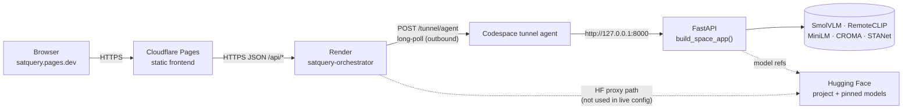
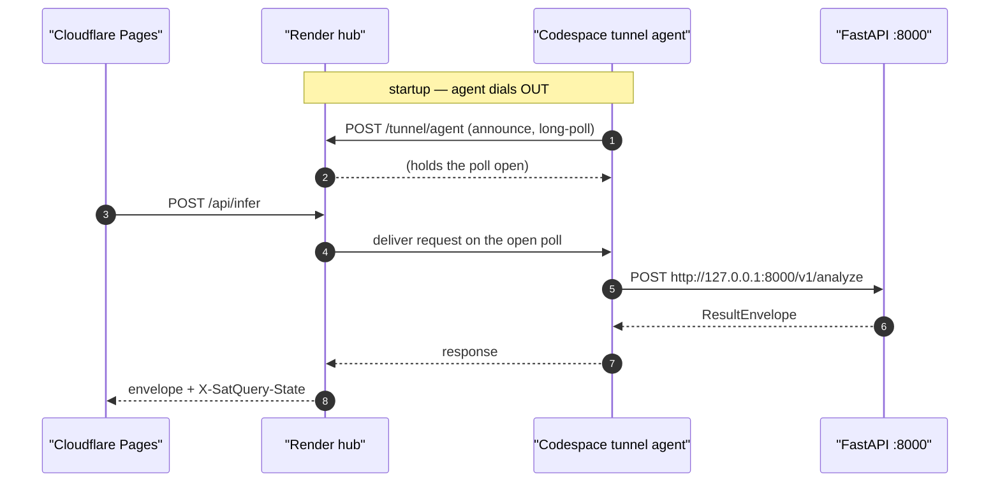
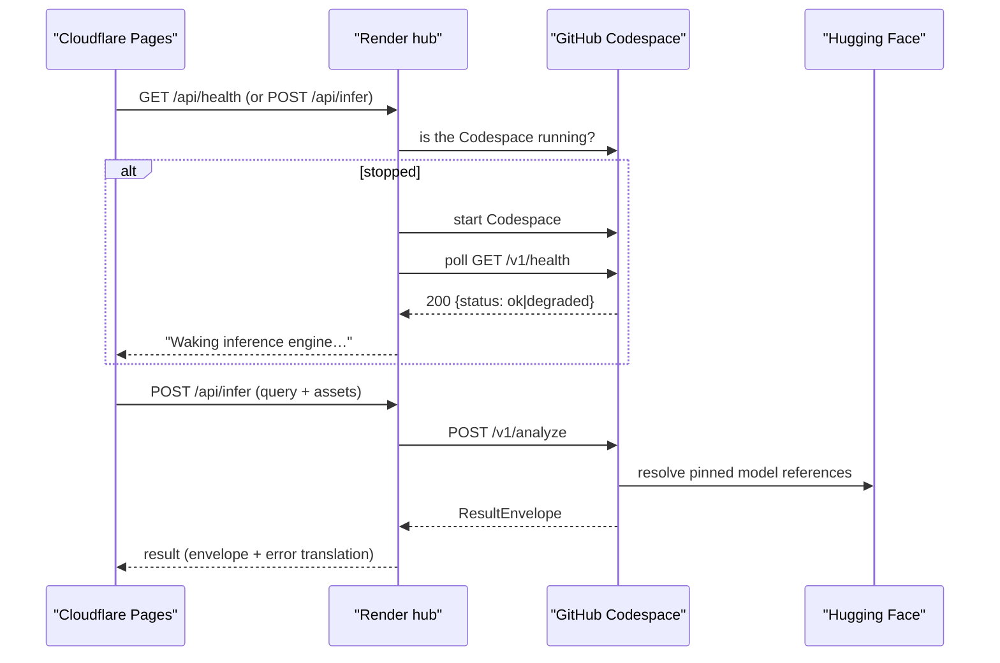
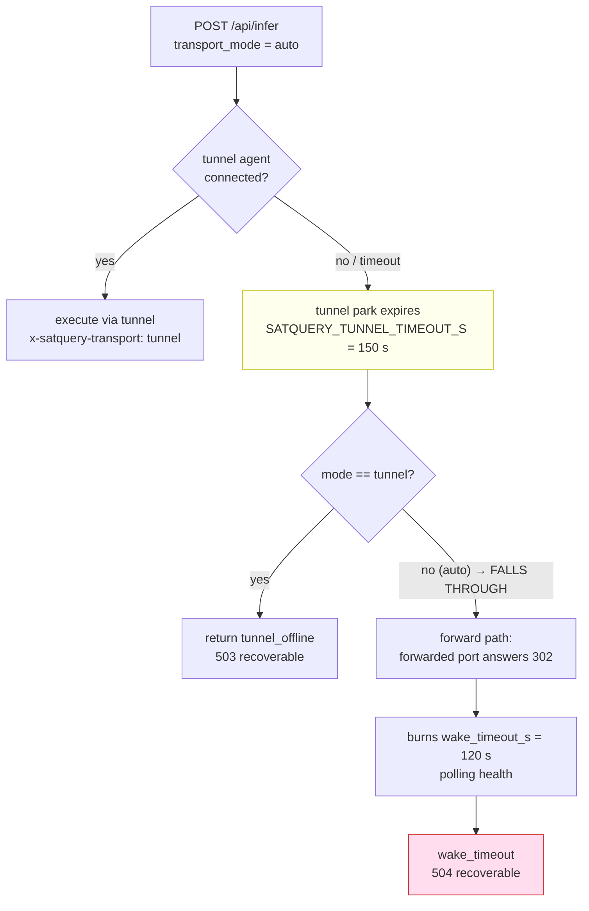

# 02 — Deployment Topology

**Parent:** [Architecture hub](README.md) · **Sibling:** [01 System overview](01-system-overview.md) ·
**Next:** [03 Request lifecycle](03-request-lifecycle.md)

**Status tags used in this document:** `IMPLEMENTED` · `VERIFIED` · `MEASURED` · `ATTEMPTED` ·
`NOT RUN` · `BLOCKED` · `DEFERRED` · `REJECTED` · `OPEN` · `RESOLVED` · `CLOSED`.

> **One-paragraph summary.** SatQuery AI is deployed as **four tiers**: a static browser client on
> **Cloudflare Pages** (`satquery.pages.dev`), a thin stateless **gateway/orchestrator on Render**
> (`satquery-orchestrator` at `<backend-host>`), a **FastAPI inference service inside
> a GitHub Codespace** (FastAPI on port `8000`), and **Hugging Face** as the project/model-presence tier.
> The gateway does not dial into the Codespace. Instead the Codespace **dials out** to the gateway over a
> long-poll **tunnel** (`POST /tunnel/agent`), because a *forwarded* Codespace port returns **HTTP 302**
> for a private repository. That inversion is the single most consequential decision in the topology, and
> it is why the deployment works at all with private repositories.

---

## 1. The four tiers

### 1.1 Tier map

```
USER / BROWSER
  │  HTTPS
  ▼
Cloudflare Pages — static frontend          satquery.pages.dev
  │  HTTPS, JSON, /api/*
  ▼
Render — orchestrator / API gateway         <backend-host>
  │  service: satquery-orchestrator
  │  outbound long-poll  (POST /tunnel/agent)   ← direction is INVERTED
  ▼
GitHub Codespace — FastAPI inference        potential-space-trout-r4ppw969w45j2pvvw :8000
  │  build_space_app(): /v1/health · /v1/capabilities · /v1/analyze · /v1/assets
  │  specialists: SmolVLM · RemoteCLIP · MiniLM · CROMA · STANet
  ▼
Hugging Face — project card + pinned model references
```

Sources: `docs/DEPLOYMENT_TOPOLOGY.md` §1; `docs/FINAL_DELIVERY_TODO.md` §1.2 (the same ASCII topology
reproduced in the delivery single-source-of-truth); `docs/FINAL_DELIVERY_REPORT.md` §2.



### 1.2 Tier responsibilities, at a glance

| Tier | Host / identity | Runs | Holds secrets? | Holds state? |
|---|---|---|---|---|
| Browser | the user's machine | `frontend/` static JS | **No** — never | no |
| Static | Cloudflare Pages, `satquery.pages.dev` | HTML/CSS/JS only | **No** | no |
| Gateway | Render, `satquery-orchestrator`, `<backend-host>` | `deploy/render/main.py` (`SatQuery-Backend` in production) | **Yes** — `GITHUB_TOKEN` (and `HF_TOKEN` if the proxy path is used) | no |
| Inference | GitHub Codespace `potential-space-trout-r4ppw969w45j2pvvw`, port `8000` | `app/space_app.py::build_space_app()` via `deploy/codespace/serve.py` | no gateway secrets | ephemeral asset store only |
| Presence | Hugging Face (`hf/`) | project README / model cards | no | no |

Sources: `docs/DEPLOYMENT_TOPOLOGY.md` §3.1–§3.4; `render.yaml`; `deploy/render/main.py`;
`app/space_app.py`; `.devcontainer/devcontainer.json`.

### 1.3 Why exactly four tiers and not three

The plan forbids "unnecessary microservices" (`docs/DEPLOYMENT_ARCHITECTURE.md` §1.1, §6, quoting plan
§73/§74). A gateway is nevertheless present, and `docs/DEPLOYMENT_ARCHITECTURE.md` §1.1 gives three
concrete reasons rather than an architectural preference:

1. **The inference host cannot hold the security boundary.** It is a public ASGI app on third-party
   infrastructure. Rate limiting, size caps, CORS and secret custody belong outside it
   (`docs/DEPLOYMENT_ARCHITECTURE.md` §1.1 item 1).
2. **A request that can be rejected on shape must never reach inference.** In the original design the
   scarce resource was the ZeroGPU `5 GPU-minutes/day` budget; in the active design it is inference wall
   time on a CPU Codespace. Either way the gateway is where a malformed request dies cheaply
   (`docs/DEPLOYMENT_ARCHITECTURE.md` §1.1 item 2).
3. **The plan's §74 boundary excludes auth, multi-tenancy and queues.** So the gateway is a *proxy with
   validation*, and must not grow into a platform (`docs/DEPLOYMENT_ARCHITECTURE.md` §1.1 item 3, §2.2).

The conclusion recorded in the source document is **"two services, not three"** — a static client, a
gateway, and one inference service (`docs/DEPLOYMENT_ARCHITECTURE.md` §1.1). Hugging Face is a presence
tier, not a runtime tier, in the active design.

---

## 2. Why a gateway exists

This section is the load-bearing one. A reader who understands only one part of the deployment should
understand this: **the gateway is not there to compute anything. It is there to be the boundary.**

### 2.1 The responsibility table (authoritative)

`docs/DEPLOYMENT_ARCHITECTURE.md` §2.1 is the authoritative statement. Reproduced with the active
host name substituted (`Railway` → `Render`):

| Responsibility | Detail | Why it must be here |
|---|---|---|
| **Schema validation** | reject malformed bodies with the §5 error envelope | avoids spending inference on a request that will fail |
| **Size limits** | per-request body cap *and* per-file cap | the inference host cannot refuse a body it has already received |
| **Rate limiting** | per-IP count + window | back-pressure against accidental loops; **fairness, not security** — see §2.4 |
| **CORS** | explicit allowlist of the frontend origin | **never `*`** |
| **Request IDs** | generate, inject, echo `X-Request-Id` | correlation across two services |
| **Timeouts** | upstream timeout **shorter** than the inference host's own budget | prevents a hung proxy holding a connection |
| **Secret custody** | `GITHUB_TOKEN` (and `HF_TOKEN` if used) live here only | the browser never sees them |
| **Error translation** | inference errors → the documented envelope | the error contract is a gateway product |
| **Body relaying for upload** | read and forward the raw body for `POST /v1/assets` | the upload path is not JSON-shaped, so JSON-oriented handling does not apply |

### 2.2 The CORS allowlist is explicit, and never a wildcard

The orchestrator's CORS list is assembled by `_allowed_origins()` in `deploy/render/main.py`, in a
documented order:

1. `SATQUERY_ALLOWED_ORIGINS` — the operator's comma-separated list. The authoritative source for any
   additional deployment origin.
2. `_PRODUCTION_ORIGINS` — `("https://satquery.pages.dev",)`, **always present**, so a deployment that
   forgets the environment variable still serves the real frontend. `deploy/render/main.py` records the
   reasoning: *"an empty allowlist would otherwise take the live site down, which is a worse failure than
   the one this guards."*
3. `_DEV_ORIGINS` — 20 enumerated `host:port` pairs (10 ports × `localhost`/`127.0.0.1`), added unless
   `SATQUERY_ALLOW_DEV_ORIGINS` is set to `0`/`false`/`no`/`""`.

The dev-origin list is **enumerated, not a regex and not a suffix match** (`deploy/render/main.py`):

```python
_DEV_ORIGINS: tuple[str, ...] = tuple(
    f"http://{host}:{port}"
    for host in ("localhost", "127.0.0.1")
    for port in ("3000", "5500", "5173", "8000", "8080")
)
```

A wildcard is refused in **two** places, deliberately:

* `_allowed_origins()` raises `ValueError` if `"*"` appears in the assembled list, and its docstring
  records why the check exists there as well as in the config validator: *"this function cannot be the
  way a `*` reaches `CORSMiddleware`, which does not run that validator."*
* `GatewayConfig.__post_init__` (`gateway/policy.py`) refuses a wildcard at construction, so a
  misconfiguration fails at startup rather than on the first request.

`allow_credentials=False` is set explicitly in `create_app()` (`deploy/render/main.py`), matching the
contract's "no auth, no cookies" position (`docs/API_CONTRACT.md` §7; plan §74).

The gateway also **strips CORS headers coming back from upstream**, so the CORS answer is the gateway's
alone. `gateway/app.py::_proxy` asserts this rather than trusting it:

```python
assert not any(_is_cors_header(k) for k in out_headers) or decision.headers, (
    "a CORS header reached the response without a policy decision; the "
    "upstream's headers are no longer filtered (see F-2)"
)
```

### 2.3 Size limits: two caps, both enforced twice, on purpose

Two independent caps exist, and they are different numbers with different jobs
(`docs/DEPLOYMENT_ARCHITECTURE.md` §4):

| Cap | Default | Scope | Where read |
|---|---|---|---|
| `SATQUERY_MAX_FILE_BYTES` | `4 * 1024 * 1024` = **4,194,304 bytes** | one uploaded file | **both** layers, from one variable |
| `SATQUERY_MAX_BODY_BYTES` | `8 * 1024 * 1024` | the whole request body | gateway |

`gateway/policy.py:221` declares `max_file_bytes: int = 4 * 1024 * 1024`;
`app/space_app.py::_asset_max_file_bytes()` returns `4 * 1024 * 1024` when the variable is unset. The
per-file cap is deliberately shared so the two layers cannot disagree about what "too large" means
(`docs/DEPLOYMENT_ARCHITECTURE.md` §4).

`SATQUERY_MAX_BODY_BYTES` is **enforced twice** — from the `Content-Length` header *and* while reading
the bytes — because the header check is *declarative*: it measures what the client claims. The measured
consequence is in `docs/DEPLOYMENT_ARCHITECTURE.md` §4 (F-6), with the cap at 8 MiB and a 12 MiB body:

| Client behaviour | Result | Peak allocation | Bytes read |
|---|---|---|---|
| `Content-Length` declared, 12 MiB | `413 oversized_image` | **0.2 MiB** | **0** |
| `Content-Length` omitted, 12 MiB | `502 model_unavailable` | **13.9 MiB** | **12 MiB** |

and allocation tracked body size exactly with no ceiling: `1/8/16/32/64 MiB in → 3.0/8.1/16.0/32.0/64.0 MiB
allocated`. The remedy was to make the cap unconditional by enforcing it **while reading**, in the single
shared reader `gateway/assets.py::read_body_bounded`, called by both layers
(`gateway/app.py::_read_body_bounded` is now a thin adapter over it; `app/space_app.py`'s `/v1/assets`
handler calls the same function — that is F-9, which found the Space calling `await request.body()` and
holding 64 MiB in → 128 MiB peak).

> **The honest framing, quoted from the source:** *"Operators should not treat the header check as the
> protection — it protects the gateway's memory against honest clients, not against hostile ones."*
> (`docs/DEPLOYMENT_ARCHITECTURE.md` §4, F-6 note.)

### 2.4 Rate limiting is FAIRNESS, not security

This is a ruling, not an implementation detail. `docs/DEPLOYMENT_ARCHITECTURE.md` §5.2 carries the
owner ruling of 2026-09-23:

> *"✅ RULED 2026-09-23 (owner ruling): the limiter is RETAINED as a fairness / rate-control mechanism
> only, and it is explicitly NOT a security or abuse-prevention boundary."*

The measurement that forced the ruling is reproduced here because it is the whole argument. Limit set to
**3 requests / 60 s**, **8 requests** sent in-process:

| Case | Statuses | Throttled |
|---|---|---|
| One client, no `X-Forwarded-For` | `502 502 502 429 429 429 429 429` | **5 / 8** |
| A fresh spoofed `X-Forwarded-For` per request | `502 502 502 502 502 502 502 502` | **0 / 8** |

The mechanism is `gateway/app.py::_client_ip`, which derives the rate-limit key from the **first hop of
`X-Forwarded-For`** — a client-supplied header. Its own docstring already said the value is
attacker-controlled and is *"a rate-limit key, not an identity"*; what the measurement added is that the
limiter **does not hold at all** against a caller willing to vary one header.

Consequences a deployment must honour (`docs/DEPLOYMENT_ARCHITECTURE.md` §5.2):

* **Do not size abuse protection on this limiter.** It is not that control.
* **A `429` is a fairness signal, not a security signal**, and its **absence is not evidence** that no
  abuse occurred.
* The gateway remains the request-side boundary for **shape, size and content type** — the things it can
  actually enforce. Rate is not one of them.

The limit itself is two variables because the limit *is* the pair (`docs/DEPLOYMENT_ARCHITECTURE.md` §4):
`SATQUERY_RATE_LIMIT_PER_IP` and `SATQUERY_RATE_LIMIT_WINDOW_S`; `10` and `60.0` mean "ten per minute".

> **Why there is no code fix.** Correctly trusting `X-Forwarded-For` requires knowing how many proxy hops
> the platform inserts — a deployment fact not verifiable from the build host. Hard-coding an assumption
> would replace a *documented* weakness with an *undocumented* one
> (`docs/DEPLOYMENT_ARCHITECTURE.md` §5.2).

### 2.5 Request IDs

The gateway generates a request id, injects it on the upstream leg, and echoes it to the client
(`gateway/app.py::_proxy`):

```python
headers = policy.upstream_headers(dict(request.headers), token=token)
headers["X-Request-Id"] = decision.request_id
```

Every non-2xx envelope the gateway owns carries the same id, including ones raised by the framework's own
404/405 handler, which is registered explicitly (`gateway/app.py`):

```python
@app.exception_handler(StarletteHTTPException)
async def _contract_envelope_for_transport_errors(request, exc):
    code = "routing_error" if exc.status_code < 500 else "satquery_error"
    status, body = translate_error(...)
```

The comment above that handler records the measurement that motivated it: before the fix,
`GET /v1/whocares → 404 {"detail":"Not Found"}` and `GET /v1/assets → 405 {"detail":"Method Not
Allowed"}`, while every handler-owned path answered with the contract envelope. A client written to the
contract parses `error.code` and would get a `KeyError` **exactly when it is trying to explain a failure
to a user**. `app/space_app.py` carries the same handler for the same reason (F-12/F-12b) — it was
previously registered on the gateway only.

### 2.6 Timeouts, and the no-retry rule

| Timeout | Default | Meaning |
|---|---|---|
| `SATQUERY_UPSTREAM_TIMEOUT_S` | `90.0` | gateway → inference request timeout; must sit inside the task budget |
| `SATQUERY_WAKE_TIMEOUT_S` | `120` | how long the gateway polls for readiness before giving up |
| `SATQUERY_TUNNEL_TIMEOUT_S` | `150` | how long a tunnel request parks before returning `tunnel_offline` |

Defaults are declared in `deploy/render/main.py`:

```python
def _wake_timeout_s() -> float:
    return float(os.environ.get("SATQUERY_WAKE_TIMEOUT_S", "120"))

def _upstream_timeout_s() -> float:
    return float(os.environ.get("SATQUERY_UPSTREAM_TIMEOUT_S", "90"))
```

**The gateway never retries `POST /v1/analyze`.** `gateway/app.py::_proxy` states it inline:

```python
except Exception as exc:  # network-level failure
    # NO RETRY. A retry on /v1/analyze would spend GPU quota twice
    # (docs/DEPLOYMENT_ARCHITECTURE.md section 2.2).
```

and `docs/DEPLOYMENT_TOPOLOGY.md` §2 repeats it for the active design: *"Render must not retry
`POST /api/infer` on its own — a retry would consume inference a second time. The client decides on
retry."* The client-side consequence is a hard rule in the frontend contract: **never automatically retry
`POST /v1/analyze`** (`docs/FRONTEND_INTEGRATION.md` §6.1).

### 2.7 Secret custody

| Secret | Lives | Never |
|---|---|---|
| `GITHUB_TOKEN` | Render environment only | in the browser, in the repo, in a client bundle |
| `HF_TOKEN` | Render environment only, *if* the HF proxy path is used | as above |

The live Render configuration was measured on 2026-09-25 and **has no `SATQUERY_UPSTREAM_URL` and no
`HF_TOKEN`** (`docs/DEPLOYMENT_TOPOLOGY.md` header note; `release/repo/docs/DEPLOYMENT.md` §3.1). The
token that *is* present is `GITHUB_TOKEN` — needed only by the GitHub-API wake path, and reported in the
health payload as a boolean, never a value:

```python
"has_github_token": bool(os.environ.get("GITHUB_TOKEN")),
```

`docs/FRONTEND_INTEGRATION.md` §7 states the frontend requirement plainly: **no secrets in the browser**,
talk only to the gateway, and never call the inference host directly — *"it is not the security boundary
and its CORS will not welcome you."*

> **This document contains no credential, token, key or password, and no path to a credential file.**
> Every secret is described by *where it lives*, never by its value.

### 2.8 Error translation, and one rule about codes

The gateway translates upstream failures into the documented envelope but **passes the `code` through
unchanged** (`docs/DEPLOYMENT_ARCHITECTURE.md` §2.3):

> *"The `code` is passed through **unchanged**. The gateway must not invent codes: the taxonomy in
> `core/errors.py` is the single source of truth, and a gateway that remapped it would make the
> frontend's error handling unpredictable."*

The envelope shape is fixed (`docs/DEPLOYMENT_ARCHITECTURE.md` §2.3):

```json
{
  "error": {
    "code": "pair_misaligned",
    "message": "The images are not sufficiently co-registered for spatial analysis.",
    "detail": "RMSE 4.21 px exceeds the 2.0 px budget",
    "recoverable": false,
    "request_id": "req_01H...",
    "run_id": "9f2c1c0e-..."
  }
}
```

The orchestrator's own translation table is small and explicit (`deploy/render/main.py`):

| Orchestrator error class | `code` | HTTP | `recoverable` |
|---|---|---|---|
| `WakeTimeout` | `wake_timeout` | `504` | `true` |
| `OrchestratorConfigError` | `orchestrator_config_error` | `500` | `false` |
| `OrchestratorUpstreamError` | `upstream_unreachable` | `502` | `true` |
| connection/timeout to upstream (`_proxy`) | `upstream_unreachable` | `502` | `true` |
| other transport error (`_proxy`) | `upstream_error` | `502` | `true` |
| non-JSON upstream body (`_proxy`) | `schema_validation_error` | `502` | `true` |
| non-JSON request body (`/api/infer`) | `invalid_request` | `400` | `false` |

A **non-JSON upstream body is a defect**, not a pass-through. `gateway/app.py::_proxy` enforces this for
**every** status, not only 2xx, and the comment records why: the guard originally read
`upstream.status_code < 400`, so a non-JSON 4xx/5xx — a proxy error page, an HTML 502 from a load
balancer, a plain-text stack trace — was forwarded verbatim. A sandbox egress proxy returned a 502 whose
body disclosed `os error 10061`; that is how it was found. `/v1/health` is exempt because a liveness probe
may legitimately answer non-JSON.

**A transport failure's raw exception text is never published** (F-15c, owner ruling 2026-09-23).
`gateway/app.py::_transport_failure_detail` maps the exception's MRO class names to a path-free
classification:

```python
_TRANSPORT_FAILURES: tuple[tuple[str, str], ...] = (
    ("TimeoutException", "the upstream did not respond within the gateway timeout"),
    ("ConnectError", "the upstream could not be reached"),
    ("ProxyError", "the gateway's egress proxy refused the connection"),
)
```

The full exception still reaches the operator through `_log.error(..., exc_info=exc)`. It is **moved, not
deleted**.

### 2.9 What the gateway must NOT do

`docs/DEPLOYMENT_ARCHITECTURE.md` §2.2 is a closed list:

* No persistence. No database, no Redis, no session store.
* No model inference.
* No auth system (plan §74).
* No request queue (plan §73 forbids Redis-cluster/queue infrastructure).
* No retries on `POST /v1/analyze`.
* **No second copy of the capability table.** The gateway proxies `/v1/capabilities` and nothing else
  decides that question. The authoritative sources for asset counts are `core.planner.CAPABILITY_ASSETS`
  and `SpecialistSpec.requires_assets`; per `_indices_for`'s docstring, *"duplicating that logic here
  would give two places to disagree."*
* **No asset storage.** The gateway relays upload bytes; it does not retain them. The store lives with the
  inference host, which is the only component that will read them back
  (`app/space_app.py::get_asset_store` docstring).

`deploy/render/main.py`'s module docstring states the same three absences in one line: *"It holds no
model, no state, no database, and performs **no auth** (per plan §73/§74)."* And it repeats the
capability-table rule: *"There is deliberately **no second copy** of the capability table here; the
gateway proxies `/v1/capabilities` and nothing else decides that question."*

### 2.10 The proxied route allowlist

The gateway forwards an **allowlist, not a passthrough** (`gateway/app.py`):

```python
PROXIED_ROUTES: tuple[str, ...] = (
    "/v1/health",
    "/v1/capabilities",
    "/v1/analyze",
    "/v1/assets",
)

COSTLY_ROUTES: tuple[str, ...] = ("/v1/analyze", "/v1/assets")
```

The two tuples answer different questions and are deliberately separate — *"may this reach the Space at
all?"* versus *"does it cost a metered resource?"* — because collapsing them would make the rate
limiter's coverage depend on the proxy allowlist (`gateway/app.py`).

`BLOCKED_ROUTES` is **empty**, and the comment says it should stay that way: the tuple exists so a route
the contract discusses but the server does not implement answers **501 with a reason** instead of a 404
a frontend developer would debug as a typo.

On the orchestrator side the four routes are `/api/health`, `/api/infer`, `/api/capabilities`,
`/api/assets`, each proxying to the matching `/v1/*` route (`docs/DEPLOYMENT_TOPOLOGY.md` §3.2;
`deploy/render/main.py`). `/api/health` is the exception: it **never** answers for the inference host.
Its docstring says so — *"Reports its own configuration; never answers for the Codespace (that is
`/api/capabilities`)."*

---

## 3. Why the transport is an outbound tunnel

### 3.1 The forwarded-port failure

A GitHub Codespace exposes a forwarded port publicly, but **for a private repository that forwarded URL
returns HTTP 302** — a redirect to a sign-in page, not the service. `docs/DEPLOYMENT_TOPOLOGY.md` records
this in its measured note:

> *"Transport is an **outbound tunnel**, not a polled forwarded port: the Codespace runs
> `deploy/codespace/tunnel_agent.py`, which dials out to `POST /tunnel/agent` (long-poll) and executes
> against `http://127.0.0.1:8000` locally."*

`release/repo/docs/DEPLOYMENT.md` §7 lists it among the platform traps:

> *"A forwarded Codespace port returns `302` for a private repo — which is *why* the tunnel exists."*

and `docs/DEPLOYMENT_DECISION.md`'s correction banner records the historical position and its reversal:

> *"Codespaces were **not** dropped; the forwarded-port path is dead (HTTP 302 for a private repo) and an
> outbound tunnel is used instead."*

### 3.2 What the inversion buys

`deploy/codespace/launch.sh` states the property in its header comment, and it is worth quoting because it
is the whole reason the design is robust to repository visibility:

> *"The tunnel is why this works with a PRIVATE repository: the agent makes only outbound HTTPS calls, so
> GitHub's port-forwarding relay, port visibility and the repository's visibility are all irrelevant. The
> orchestrator never dials into this Codespace."*

Consequences, each observable:

| Property | Value under the tunnel |
|---|---|
| Repository visibility | irrelevant — only outbound HTTPS is used |
| Port visibility setting | irrelevant |
| Inbound firewall / NAT | no inbound connection is required at all |
| Who initiates | the **Codespace**, to `SATQUERY_HUB_URL` |
| What the hub needs | a long-poll endpoint and a way to match a response to a pending request |

### 3.3 Direction, restated as a diagram



> **Honest note on the agent's internals.** `deploy/codespace/launch.sh` invokes
> `python deploy/codespace/tunnel_agent.py` and greps its log for the string `announced to hub`. That
> file is **not present in the monorepo working tree** and is **not tracked by git** (see §9.4), so its
> function names, arguments and payload shapes are
> `UNKNOWN — not established from the available evidence`. What *is* established is: the agent exists in
> the production `SatQuery-Inference` repository (`docs/FINAL_DELIVERY_TODO.md` §1.3), it dials
> `SATQUERY_HUB_URL`, it executes against `http://127.0.0.1:8000`, and it is supervised by
> `deploy/codespace/launch.sh`.

### 3.4 The observable proof of transport

The frontend treats a response header as the evidence that the hub forwarded to the Codespace rather than
answering locally. `frontend/assets/js/live.js` reads it, and the unit suite pins the read:

> *"`x-satquery-transport: tunnel` is the proof that Render forwarded to the Codespace rather than
> answering locally. It is only readable before the response object is discarded."*
> (`tests/unit/test_frontend_live_wiring.py`, `test_the_client_reads_the_transport_header_as_evidence`)

The measured live value is `x-satquery-transport: tunnel` on `POST /api/infer` (`docs/FINAL_DELIVERY_TODO.md`
§1.4, §6 E-03; `docs/FINAL_DELIVERY_REPORT.md` §3 P3).

---

## 4. Wake flow

### 4.1 The flow

The inference Codespace is CPU-first and **may be stopped when idle**. Before a request can be served the
hub starts it (if stopped) and polls health until it answers. The frontend shows *"Waking inference
engine…"* while this happens (`docs/DEPLOYMENT_TOPOLOGY.md` §2).



Source: `docs/DEPLOYMENT_TOPOLOGY.md` §2 (verbatim structure).

### 4.2 The wake path in code

`deploy/render/main.py::ensure_codespace_up()` is the wake implementation. Its contract is precise:

```python
async def ensure_codespace_up() -> tuple[str, bool]:
    """Ensure the Codespace is running; return ``(base_url, woke)``.

    Steps:
      1. ``GET`` the Codespace via the GitHub API.
      2. If ``state != "available"``, ``POST .../start``.
      3. Poll ``GET {base}/v1/health`` until 200 or until
         ``SATQUERY_WAKE_TIMEOUT_S`` elapses.
    """
```

Its polling knobs are module constants:

```python
_WAKE_POLL_INTERVAL_S = 2.0
_WAKE_HEALTH_TIMEOUT_S = 10.0
```

and the failure mapping is explicit: a GitHub auth/transport failure becomes
`OrchestratorUpstreamError` (`502`, recoverable), a missing Codespace name becomes
`OrchestratorConfigError` (`500`, not recoverable), and an exhausted deadline raises `WakeTimeout`
(`504`, recoverable) with the last probe error in the detail.

### 4.3 The response header the client reads

`/api/infer` tags the proxied response so the frontend can tell whether the delay was a cold start
(`deploy/render/main.py`):

```python
out = await _proxy("POST", f"{base}/v1/analyze", json=body)
out.headers["X-SatQuery-State"] = "waking" if woke else "ready"
return out
```

The unit suite pins both headers on the client side: `assert "x-satquery-transport" in source` and
`assert "X-SatQuery-State" in source` (`tests/unit/test_frontend_live_wiring.py`).

### 4.4 The wake path is a *fallback* in the tunnel design

The measured note in `docs/DEPLOYMENT_TOPOLOGY.md` §2 is explicit that the tunnel design does not depend
on the GitHub-API wake:

> *"The GitHub-API wake path (`POST /user/codespaces/{name}/start`) still exists but the tunnel design
> relies on the agent reconnecting on Codespace start via the devcontainer `postStartCommand`."*

So there are two mechanisms and they are not equivalent:

| Mechanism | Trigger | Effect when it works | Effect when it fails |
|---|---|---|---|
| Devcontainer `postStartCommand` → `launch.sh` → tunnel agent | every Codespace start | agent reconnects; `agent_connected: true` | `agent_connected: false`; `/api/infer` parks to `SATQUERY_TUNNEL_TIMEOUT_S` |
| GitHub-API wake (`ensure_codespace_up`) | any `/api/*` request | starts a stopped Codespace, polls `/v1/health` | `wake_timeout` (`504`, recoverable) |

---

## 5. Cold start — documented, not hidden

Render's free tier **sleeps when idle**, and the Codespace **may be stopped** (the live GitHub value
recorded is `idle_timeout_minutes=30`, `docs/FINAL_DELIVERY_TODO.md` §6 E-04). The measured statement is:

> *"Render's free tier also sleeps when idle. Cold start is therefore tens of seconds and is **documented,
> not hidden**."* (`docs/DEPLOYMENT_TOPOLOGY.md` §2)

The UI consequence is recorded in `docs/FRONTEND_INTEGRATION.md` §6:

| Constraint | Value | UI consequence |
|---|---|---|
| Cold start | tens of seconds | *"A determinate-looking progress bar would lie. Use an indeterminate state with a 'this can take up to a minute' hint."* |

and the operator consequence in `docs/FINAL_DELIVERY_REPORT.md` §8:

> *"**Warm the demo stack** ~10 min before presenting: open the Codespace and confirm `GET /api/health`
> shows `tunnel.agent_connected:true`. If the Codespace idle-stops, restart it (the tunnel agent
> reconnects via the devcontainer `postStartCommand`)."*

> **No latency characterisation exists.** `docs/FRONTEND_INTEGRATION.md` §9 states it plainly:
> *"Latency is not characterized. No cold-start or throughput measurement has been taken against a live
> Space."* The phrase "tens of seconds" is a documented expectation, not a measurement. A precise cold-start
> distribution is `UNKNOWN — not established from the available evidence`.

---

## 6. `transport_mode: auto`, the fallthrough, and B-07

### 6.1 The live transport configuration

The live Render service reports its transport settings in the health payload. Measured
2026-09-25:

| Setting | Live value |
|---|---|
| `transport_mode` | `auto` |
| `tunnel_timeout_s` | `150.0` |
| `wake_timeout_s` | `120.0` |
| `upstream_timeout_s` | `90.0` |

Source: `release/repo/docs/DEPLOYMENT.md` §2 (live payload) and `docs/DEPLOYMENT_TOPOLOGY.md` header note.

### 6.2 The fallthrough, exactly

`docs/FINAL_DELIVERY_TODO.md` §5 (blocker register, row B-07) records the confirmed root shape:

> *"Root shape confirmed 2026-09-25: in `auto` transport mode a tunnel timeout **falls through** to the
> forward path (`SatQuery-Backend/main.py:546`), which then burns `wake_timeout_s=120` on a 302 → the
> observed 504."*

`DELIVERY_REPORT_2026-09-25.md` §4 gives the mechanism and the arithmetic:

> *"in `auto` transport mode a tunnel timeout **falls through** to the forward path (`main.py:546` returns
> early only when `mode == "tunnel"`); the forward path then burns `wake_timeout_s = 120` on a 302.
> Measured timing ≈ 249 s ≈ `tunnel_timeout_s=150` + `wake_timeout_s=120`."*

So the worst case is:

```
tunnel park        150 s   (SATQUERY_TUNNEL_TIMEOUT_S)
   + wake poll     120 s   (SATQUERY_WAKE_TIMEOUT_S)
   -------------------------
   ≈ 249 s  → a 504 the client waited four minutes for
```



### 6.3 B-07 is OPEN

**`B-07` — Transient tunnel-agent gaps — is `OPEN`.** Stated three times in the sources so it cannot be
mistaken:

> *"`B-07` | **Transient tunnel-agent gaps** | OPEN | A request can hang or return 504 (`tunnel_offline`
> / wake timeout; the forwarded port returns 302). Observed once live. Mitigation: keep the Codespace
> warm before the demo; the client shows an actionable retry message."* (`docs/FINAL_DELIVERY_REPORT.md`
> §6)

> *"`B-07` | Transient tunnel-agent gaps (agent briefly absent) → a request can hang or return 504
> (`tunnel_offline` / wake timeout, forward path 302) | … | **OPEN — patch prepared, not deployed.**"*
> (`docs/FINAL_DELIVERY_TODO.md` §5)

> *"B-07 backend patch **prepared, NOT deployed**."* (`docs/FINAL_DELIVERY_TODO.md` sprint-status note)

### 6.4 The prepared patch — prepared, NOT deployed

The patch is `fix-b07-forward-unavailable.patch`, in the session workspace at
`.workbuddy-ai/scratch/deployed-backend/fix-b07-forward-unavailable.patch`
(`DELIVERY_REPORT_2026-09-25.md` §8). Its content and verification:

| Item | Detail |
|---|---|
| Base | the **deployed** `SatQuery-Backend/main.py` @ `89d80eaddec5` (769 lines) |
| Size | 9 hunks plus a 340-line test |
| Change A | adds `forward_unavailable` (`503`, `recoverable: true`) for a **terminal** 302/401/403 on the forward path, instead of burning the wake timeout |
| Change B | adds `upstream_timeout` (`504`) for "tunnel healthy but slow" |
| Change C | fixes `/api/health` `codespace_name` trailing `\n` via `.strip()` |
| Independent verification | `git apply --check` clean, `git apply` clean, `py_compile` OK |
| Presence check | `forward_unavailable` @ `main.py:326`, `upstream_timeout` @ `:601`, `codespace_name` `.strip()` @ `:686` |
| Deployment status | **NOT deployed** |

Sources: `DELIVERY_REPORT_2026-09-25.md` §4; `docs/FINAL_DELIVERY_TODO.md` §6 E-12.

> **A retracted claim, recorded because the honesty matters.** The report records that an earlier claim
> that the patch *"would not have prevented"* the observed 504 *"was wrong and was retracted"*. The
> corrected position: *"Change A is genuinely **on the failing path** — it converts a 504-after-249 s into
> a 503-early with an actionable code."* (`DELIVERY_REPORT_2026-09-25.md` §4.)

**Why it is not deployed:** *"the patch is not needed for the demo and touches the live backend. The
residual is better mitigated operationally (keep the Codespace warm, raise the idle timeout)."*
(`DELIVERY_REPORT_2026-09-25.md` §4.)

### 6.5 Operational trap recorded with the patch

> *"the local `C:/Users/anish/SatQuery-Backend` (680 lines) is **STALE**. Always fetch the deployed
> `main.py` before touching backend code."* (`DELIVERY_REPORT_2026-09-25.md` §4)

This is the same class of trap as §9.4 below: **the working copy is not the deployed source.**

---

## 7. The full live health payload

### 7.1 The measured payload

Probed live on 2026-09-25 against `https://<backend-host>/api/health`
(`release/repo/docs/DEPLOYMENT.md` §2):

```json
{"status":"ok","service":"satquery-orchestrator",
 "tunnel":{"agent_connected":true,"agent_id":"codespaces-fd1038","pending":0,"completed":97},
 "config":{"codespace_name":"potential-space-trout-r4ppw969w45j2pvvw\n","codespace_port":8000,
           "transport_mode":"auto","tunnel_timeout_s":150.0,"wake_timeout_s":120.0,
           "upstream_timeout_s":90.0,"device":"cpu","has_github_token":true}}
```

Exact command used elsewhere in the project's evidence register:
`curl --noproxy '*' https://<backend-host>/api/health`
(`docs/FINAL_DELIVERY_REPORT.md` §4).

### 7.2 Field-by-field

| Field | Type | Meaning | Live value |
|---|---|---|---|
| `status` | string | the hub's own liveness | `"ok"` |
| `service` | string | the service identity | `"satquery-orchestrator"` |
| `tunnel.agent_connected` | bool | is a tunnel agent currently polling? | `true` |
| `tunnel.agent_id` | string | which agent identity holds the poll | `"codespaces-fd1038"` |
| `tunnel.pending` | int | requests delivered but not yet answered | `0` |
| `tunnel.completed` | int | requests completed since the agent connected | `97` |
| `config.codespace_name` | string | the target Codespace | `"…pvvw\n"` — **carries a trailing `\n`** |
| `config.codespace_port` | int | the inference port | `8000` |
| `config.transport_mode` | string | transport selection | `"auto"` |
| `config.tunnel_timeout_s` | float | tunnel park budget | `150.0` |
| `config.wake_timeout_s` | float | wake poll budget | `120.0` |
| `config.upstream_timeout_s` | float | proxy request timeout | `90.0` |
| `config.device` | string | declared device | `"cpu"` |
| `config.has_github_token` | bool | is a GitHub token configured? | `true` |

### 7.3 `completed` was observed at three different values — do not treat any as a constant

The tunnel counter is a **monotonic runtime counter**, not a fixed fact. Three measured readings exist,
each with its own provenance:

| Reading | Where recorded |
|---|---|
| `completed: 97` | `release/repo/docs/DEPLOYMENT.md` §2 (the live health probe) |
| `completed: 314` | `docs/FINAL_DELIVERY_TODO.md` §1.4 and §6 E-02; `docs/DEPLOYMENT_TOPOLOGY.md` §2 |
| `completed: 338` | `docs/FINAL_DELIVERY_REPORT.md` §3 P2 |

They are consistent with each other — the counter grows — and the honest statement is
**"`completed` was measured at 97, 314 and 338 at three different times on 2026-09-25."** Quoting any one
of them as *the* value would be wrong.

### 7.4 `codespace_name` carries a trailing newline — B-02, OPEN (cosmetic)

`config.codespace_name` reports `…pvvw\n`. This is **B-02**, and its status is `OPEN` **but cosmetic**:

> *"`P2-T03` `/api/health` `codespace_name` trailing `\n` | DEFERRED (cosmetic) | Wake path is safe
> (`_codespace_name()` strips, `main.py:123,357`); only the health payload reports the raw value."*
> (`docs/FINAL_DELIVERY_REPORT.md` §6)

> *"`B-02` | `/api/health` reports `codespace_name` with a trailing `\n` | **Cosmetic** — reporting only;
> the wake path strips via `_codespace_name()` (`main.py:123,357`) | P2-T03 | none needed |
> DOWNGRADED"* (`docs/FINAL_DELIVERY_TODO.md` §5)

The fix is known and one line — *"change line 619 to `_codespace_name()`, then Render redeploys"*
(`docs/FINAL_DELIVERY_TODO.md` §4, P2-T03) — and the row's own reasoning for deferring is that *"a
live-backend redeploy before the demo is not worth the risk."*

> **Do not upgrade this.** `B-02` is `OPEN`. It is not `RESOLVED`, and it is not `CLOSED`.

### 7.5 The orchestrator's *own* `/api/health` shape in the repository

`deploy/render/main.py` — the monorepo copy, which is **not** the deployed source (§9.4) — declares a
different, simpler health payload. Reproduced because it documents the *contract* of the route even where
the deployed implementation has grown:

```python
@app.get("/api/health")
async def health() -> dict[str, Any]:
    """Orchestrator liveness. Reports its own configuration; never answers
    for the Codespace (that is /api/capabilities)."""
    return {
        "status": "ok",
        "service": "satquery-orchestrator",
        "config": {
            "codespace_name": os.environ.get("CODESPACE_NAME", ""),
            "codespace_port": _codespace_port(),
            "has_github_token": bool(os.environ.get("GITHUB_TOKEN")),
            "allowed_origins": _allowed_origins(),
            "production_origins": list(_PRODUCTION_ORIGINS),
            "dev_origins_enabled": _dev_origins_enabled(),
            "wake_timeout_s": _wake_timeout_s(),
            "upstream_timeout_s": _upstream_timeout_s(),
            "device": os.environ.get("SATQUERY_DEVICE", ""),
        },
    }
```

Note the design decision visible here: `allowed_origins` reports the **effective** list, so an operator can
confirm **from outside** what the service will actually accept — not just what they set. The comment says
the dev entries being visible *"is how a production deployment proves it turned them off."*

> **The discrepancy is real and is stated rather than smoothed over.** The deployed payload carries a
> `tunnel` block and `config.transport_mode` / `config.tunnel_timeout_s`, which the monorepo copy does
> not. The monorepo copy is a **532-line** file with no tunnel code at all; the deployed
> `SatQuery-Backend/main.py` is **768–769 lines** with it (`docs/FINAL_DELIVERY_TODO.md` §1.1;
> `DELIVERY_REPORT_2026-09-25.md` §4).

---

## 8. Environment variables

### 8.1 Render (orchestrator) — measured live values

| Variable | Live value | Purpose |
|---|---|---|
| `CODESPACE_NAME` | `potential-space-trout-r4ppw969w45j2pvvw` | which Codespace to target |
| `CODESPACE_PORT` | `8000` | the inference port on that Codespace |
| `SATQUERY_ALLOWED_ORIGINS` | `https://satquery.pages.dev` | CORS allowlist (the Pages origin) |
| `SATQUERY_DEVICE` | `cpu` | declared device |
| `SATQUERY_TRANSPORT` | `auto` | transport selection |
| `SATQUERY_TUNNEL_TIMEOUT_S` | `150` | tunnel park budget |
| `SATQUERY_WAKE_TIMEOUT_S` | `120` | wake poll budget |
| `SATQUERY_UPSTREAM_TIMEOUT_S` | `90` | gateway → upstream request timeout |
| `GITHUB_TOKEN` | present | GitHub API wake path; never sent to the browser |

Source: `docs/DEPLOYMENT_TOPOLOGY.md` header note (measured against `GET /api/health`);
`release/repo/docs/DEPLOYMENT.md` §3.1.

> **Two absences are as important as the presences.** There is **no `SATQUERY_UPSTREAM_URL`** and **no
> `HF_TOKEN`** in the live configuration (`docs/DEPLOYMENT_TOPOLOGY.md`; `release/repo/docs/DEPLOYMENT.md`
> §3.1). `SATQUERY_UPSTREAM_URL` is absent because the transport is the outbound tunnel, not a forwarded
> port; `HF_TOKEN` is absent because the HF proxy path is not used live.

### 8.2 Render — the blueprint's declared variables

`render.yaml` (the blueprint) declares the same vocabulary as a service definition:

```yaml
services:
  - type: web
    name: satquery-orchestrator
    runtime: python
    plan: free
    buildCommand: pip install -r deploy/render/requirements.txt
    startCommand: uvicorn deploy.render.main:app --host 0.0.0.0 --port $PORT
    healthCheckPath: /api/health
    envVars:
      - key: PORT
        sync: false
      - key: SATQUERY_ALLOWED_ORIGINS
        sync: false
      - key: GITHUB_TOKEN
        sync: false
      - key: CODESPACE_NAME
        sync: false
      - key: CODESPACE_PORT
        value: "8000"
      - key: SATQUERY_DEVICE
        value: "cpu"
      - key: SATQUERY_WAKE_TIMEOUT_S
        value: "120"
      - key: SATQUERY_UPSTREAM_TIMEOUT_S
        value: "90"
```

Three things this file establishes that are easy to miss:

1. `plan: free` — the free tier, which is *why* Render sleeps when idle (§5).
2. `healthCheckPath: /api/health` — the platform's own liveness probe points at the orchestrator's
   self-report route, which never touches the inference host.
3. `sync: false` on `SATQUERY_ALLOWED_ORIGINS`, `GITHUB_TOKEN`, `CODESPACE_NAME` and `PORT` means those are
   **operator-supplied**, not blueprint-committed. No secret value appears in the repository.

> The blueprint does **not** declare `SATQUERY_TRANSPORT` or `SATQUERY_TUNNEL_TIMEOUT_S`, which the live
> service reports. The blueprint and the live service have diverged. Whether the live service sets them
> through the dashboard or through a newer blueprint is `UNKNOWN — not established from the available
> evidence`; what is established is the live value set in §8.1.

### 8.3 Codespace (inference) — declared and effective

| Variable | Where set | Purpose |
|---|---|---|
| `PORT` | `containerEnv` = `"8000"`, re-exported by `launch.sh` | platform-assigned; **must be read** (historical blocker #2) |
| `SATQUERY_DEVICE` | `containerEnv` = `"cpu"`, re-exported by `launch.sh` | `cpu` \| `cuda` \| `mps` \| `null`; read **without importing torch** |
| `SATQUERY_ASSET_ENABLED` | `containerEnv` = `"1"`, re-exported by `launch.sh` | enables `POST /v1/assets`; **both** this and the dir are required |
| `SATQUERY_ASSET_DIR` | `containerEnv` = `"/tmp/satquery-assets"`, re-exported by `launch.sh` | where uploaded bytes are written |
| `SATQUERY_MAX_FILE_BYTES` | not set live (default applies) | per-file cap, shared with Render |
| `SATQUERY_ASSET_MAX_FILES` | not set live (default applies) | optional handle capacity, default `32` |
| `SATQUERY_ASSET_TTL_S` | not set live (default applies) | optional handle lifetime, default `900.0` |
| `SATQUERY_HUB_URL` | defaulted by `launch.sh` | the hub the agent dials |
| `PYTHONPATH` | set by `launch.sh` | repo root, so `import app` resolves |

Sources: `.devcontainer/devcontainer.json`; `deploy/codespace/launch.sh`; `app/space_app.py`.

`.devcontainer/devcontainer.json` in full:

```json
{
  "name": "SatQuery AI — Codespace Inference",
  "image": "mcr.microsoft.com/devcontainers/python:3.12",
  "forwardPorts": [8000],
  "portsAttributes": {
    "8000": { "label": "SatQuery inference", "visibility": "public" }
  },
  "containerEnv": {
    "SATQUERY_DEVICE": "cpu",
    "PORT": "8000",
    "SATQUERY_ASSET_ENABLED": "1",
    "SATQUERY_ASSET_DIR": "/tmp/satquery-assets"
  },
  "postCreateCommand": "bash deploy/codespace/post_create.sh",
  "postStartCommand": "bash deploy/codespace/launch.sh",
  "customizations": { "vscode": { "extensions": ["ms-python.python"] } }
}
```

> **A trap worth recording, from `launch.sh`'s own comment:** *"`containerEnv` is only applied when the
> container is CREATED, so setting it there alone would leave an already-running Codespace unconfigured
> until a rebuild. This script runs on every start and is therefore the effective source of truth."* The
> variables are therefore set **twice** — in `containerEnv` and in `launch.sh` — and `launch.sh` is the
> one that governs a running container.

### 8.4 The historical vocabulary — still the contract

`docs/DEPLOYMENT_ARCHITECTURE.md` §4 remains authoritative for the env-var *vocabulary*; only host names
moved. Its full table, reproduced, with the active host substituted:

| Variable | Where it lives (historical → active) | Purpose |
|---|---|---|
| `HF_TOKEN` | Railway only → **Render only, if used** | upstream credential; never sent to the browser |
| `SATQUERY_SPACE_URL` | Railway → **`SATQUERY_UPSTREAM_URL`** | upstream URL |
| `SATQUERY_ALLOWED_ORIGINS` | Railway → **Render** | CORS allowlist |
| `PORT` | Railway → **Render** | supplied by the platform |
| `SATQUERY_DEVICE` | Space → **Codespace** | `cpu` \| `cuda` \| `mps` \| `null`; read **without importing torch** |
| `SATQUERY_ASSET_ENABLED` | Space → **Codespace** | enables `POST /v1/assets`; fails closed |
| `SATQUERY_ASSET_DIR` | Space → **Codespace** | where uploaded bytes are written |
| `SATQUERY_MAX_FILE_BYTES` | **both** | per-file size cap, read by both layers from one variable |
| `SATQUERY_MAX_BODY_BYTES` | Railway → **Render** | whole-request body cap, above the per-file cap |
| `SATQUERY_UPSTREAM_TIMEOUT_S` | Railway → **Render** | gateway → upstream timeout; default `90.0` |
| `SATQUERY_RATE_LIMIT_PER_IP` / `_WINDOW_S` | Railway → **Render** | per-IP count + window |
| `SATQUERY_ASSET_MAX_FILES` / `SATQUERY_ASSET_TTL_S` | Space → **Codespace** | **optional** handle capacity / lifetime |

Three notes from that section are worth carrying forward because they explain *why* the vocabulary has
this shape:

1. **`SATQUERY_MAX_FILE_BYTES` is applied while reading at both layers, not after** (F-9, F-6). Both layers
   call the single reader `gateway/assets.py::read_body_bounded`, so the two enforcement points cannot
   drift.
2. **Both layers refuse an unparsable or non-positive value and name the variable** (F-7). Reading one
   variable is not the same as agreeing on its value: the two parsers previously diverged in **opposite
   directions** — `'abc'` raised at the gateway but silently defaulted to 4 MiB on the inference host;
   `'0'` was accepted at the gateway but rejected on the inference host. A malformed cap now fails startup
   at both layers rather than running on a limit nobody chose.
3. **None of the asset variables is a config key**, and that is deliberate: adding a key to
   `configs/base.yaml` moves `Config.hash` off `78f1e3700da15aa1` and invalidates the frozen Phase-9
   benchmark. Asset storage is deployment state, so it is read from the environment.

The F-8 note on `SATQUERY_DEVICE` is also load-bearing and is reproduced in §8.5.

### 8.5 `SATQUERY_DEVICE`: four read sites, and the case bug

`docs/DEPLOYMENT_ARCHITECTURE.md` §4 records that the served value is validated against the contract's
closed set. Measured before the fix, `SATQUERY_DEVICE` had **four read sites** and only three normalised:

| Site | Behaviour before the fix |
|---|---|
| `core/config.py:88` (`Config.device_preference`) | raw — no strip, no lower |
| `app/deployment.py:570` (`gpu_available`) | `.strip().lower()` |
| `app/deployment.py:946` (the served device resolver) | `.strip()`, **no lower** — the odd one |
| `app/deployment.py:970` (`_cuda_detected`) | `.strip().lower()` |

Two defects followed, both measured:

* **Case changed the answer.** `'cuda'` → `'cpu'` but `'CUDA'` → `'CUDA'`, so one payload could announce
  `gpu_available: true` alongside `device: "CUDA"` — a GPU is claimed and the device name is not a device.
* **An unparsable value was echoed.** `'garbage'` → `device: "garbage"`, against a field the contract
  publishes as a closed set.

The served resolver now normalises and **validates**, returning `None` for anything outside
`{"cpu", "cuda", "mps"}`. `None` is chosen over raising or over a silent `"cpu"`, because it is already a
legal value for the field, it is honest, and defaulting to `"cpu"` *"would mean a typo silently changes
which device the process is believed to use, which is the `_asset_max_file_bytes` mistake from F-7 in a
different variable."* The guard is kept as a literal, not derived from the implementation, so it encodes
the **contract's** set and cannot drift with the code:

```python
_LEGAL_DEVICES: frozenset[str] = frozenset({"cpu", "cuda", "mps"})
```

> `Config.device_preference` still returns the raw override, deliberately: it is a general-purpose property
> whose other callers may legitimately want the operator's literal text, and narrowing it would be a wider
> change than the defect warrants. **The served path is the one the contract constrains, so it is the one
> that validates.**

---

## 9. The tunnel agent and the Codespace launcher

### 9.1 `deploy/codespace/serve.py` — the entrypoint

The file is 25 lines and its whole job is to bind `build_space_app()` to `$PORT`:

```python
import os

from app.space_app import build_space_app
import uvicorn

app = build_space_app()

if __name__ == "__main__":
    port = int(os.environ.get("PORT", "8000"))
    uvicorn.run(app, host="0.0.0.0", port=port)
```

Its docstring records the properties that make it import-safe on a CPU host with no GPU and no weights:

> *"`build_space_app()` is cheap to import: FastAPI is imported inside it and no model is loaded at module
> scope, so this file stays import-safe on a CPU host with no GPU and no weights present."*

and it names the device resolution path: *"The serving controller (via
`app.serving.build_serving_controller`) resolves `device` from the `SATQUERY_DEVICE` env var; set it to
`cpu` for the CPU-first adaptation."*

### 9.2 `deploy/codespace/launch.sh` — what runs on every Codespace start

The script is the devcontainer's `postStartCommand` target. It runs three stages plus a preflight.

**Stage 0 — preflight, refusing to start half-configured.** The header comment states why this exists:

> *"A silently-broken environment is the single worst failure mode here: the server dies, nothing listens
> on the port, and the only external symptom is a bare 401/302 from GitHub's relay — which looks like a
> visibility problem."*

It therefore checks the Python dependencies **including `httpx` explicitly**, and the comment records the
incident:

> *"NOTE: httpx is checked explicitly. `tunnel_agent.py` imports it directly, and it was previously absent
> from `requirements.txt` — so the agent died instantly and the supervised restart loop hid the error in a
> log file."*

```bash
if ! python -c "import yaml, pydantic, fastapi, uvicorn, httpx" 2>/dev/null; then
  echo "ERROR: Python deps are missing (need yaml, pydantic, fastapi, uvicorn, httpx)." >&2
  ...
  exit 1
fi

if ! python -c "import app.space_app" 2>/dev/null; then
  echo "ERROR: cannot import the 'app' package even with PYTHONPATH=$REPO_ROOT" >&2
  ...
  exit 1
fi
```

**Stage 1 — the inference server, with a staleness guard.** The script records a **stamp** of the git
revision and the asset-upload environment, because `_port_open` alone cannot tell you what the running
process was started from:

```bash
_current_stamp() {
  printf 'rev=%s asset_enabled=%s asset_dir=%s\n' \
    "$(git rev-parse HEAD 2>/dev/null || echo nogit)" \
    "${SATQUERY_ASSET_ENABLED:-}" \
    "${SATQUERY_ASSET_DIR:-}"
}
```

and the comment explains the failure a stale process causes:

> *"A stale serve process is worse than no process: it answers `/v1/health` and `/v1/capabilities` from OLD
> code, so the deployment looks alive while reporting the previous revision's capabilities."*

The restart uses the real invocation, not the file path — `pkill -f "python deploy/codespace/serve.py"`,
because *"`pgrep -f serve.py` would also match an editor or this script's own argv."* If SIGTERM is not
enough it escalates to `pkill -9`, and the process is launched detached:

```bash
setsid nohup python deploy/codespace/serve.py > "$SERVE_LOG" 2>&1 < /dev/null &
```

**Stage 2 — the outbound tunnel agent, supervised.** The header comment records the production incident
that shaped the launch:

> *"`setsid` alone is NOT enough in Codespaces. The lifecycle shell that runs `postStartCommand` can still
> reap the process group, which showed up in production as 'the agent announced once, then vanished' — the
> hub then reported `agent_connected=false` and `/api/infer` fell back to the dead forwarded-port path
> (401 -> wake_timeout)."*

The remedy is `setsid + nohup + </dev/null` **plus a supervising wrapper** that relaunches the agent if it
ever exits:

```bash
setsid nohup bash -c '
  while true; do
    echo "[supervisor $(date +%H:%M:%S)] starting tunnel agent" >> "'"$TUNNEL_LOG"'"
    python deploy/codespace/tunnel_agent.py >> "'"$TUNNEL_LOG"'" 2>&1
    rc=$?
    echo "[supervisor $(date +%H:%M:%S)] tunnel agent exited rc=$rc — restarting in 5s" >> "'"$TUNNEL_LOG"'"
    sleep 5
  done
' > /dev/null 2>&1 < /dev/null &
```

The guard is on the **process, not a port** — *"the agent listens on nothing"* — and the supervisor itself
is what gets detached, so *"the agent is effectively immortal for the life of the Codespace."*

**Stage 3 — verify the agent actually connected.** This stage exists because backgrounding with all output
discarded makes a crashing agent invisible:

> *"Backgrounding with all output discarded means a crashing agent is completely invisible — that is
> exactly how a missing `httpx` hid itself. So we wait, then check: the process is alive, and the log shows
> a successful announce."*

```bash
sleep 4

if ! pgrep -f "deploy/codespace/tunnel_agent.py" > /dev/null 2>&1; then
  echo "WARNING: the tunnel agent is not running. Last log lines:" >&2
  tail -n 20 "$TUNNEL_LOG" 2>/dev/null >&2 || echo "  (no log at $TUNNEL_LOG)" >&2
  ...
else
  echo "tunnel agent process is up (pid $(pgrep -f 'deploy/codespace/tunnel_agent.py' | head -1))"
  if grep -q "announced to hub" "$TUNNEL_LOG" 2>/dev/null; then
    echo "tunnel agent announced to the hub successfully"
  ...
```

The hub URL is a defaulted variable, so a renamed Render service can be overridden in the Codespace:

```bash
export SATQUERY_HUB_URL="${SATQUERY_HUB_URL:-https://<backend-host>}"
```

### 9.3 The asset-upload environment, and why `/tmp` is correct

`launch.sh` sets the asset variables on every start, and its comment argues the choice rather than
asserting it:

> *"`/tmp` is correct here and not a compromise: the Codespace filesystem is ephemeral, handles are TTL'd
> (900s), and `cache_max_models: 1` means an uploaded asset is consumed within one analysis, so nothing
> needs to outlive the process. The store creates the directory if absent."*

```bash
export SATQUERY_ASSET_ENABLED="${SATQUERY_ASSET_ENABLED:-1}"
export SATQUERY_ASSET_DIR="${SATQUERY_ASSET_DIR:-/tmp/satquery-assets}"
```

The comment also cross-references the exact fallback path in code — *"the directory is intentionally the
same path the code falls back to (`space_app.py:310`)"* — which is
`Path(tempfile.gettempdir()) / "satquery-assets"` in `app/space_app.py::_asset_root()`. That is a
deliberate alignment: *"a deployment that set only the flag — or neither — cannot silently start writing
to a barely-chosen location."*

### 9.4 The tunnel agent file itself

| Question | Answer | Status |
|---|---|---|
| Is `deploy/codespace/tunnel_agent.py` in the monorepo working tree? | **No** — `Glob **/tunnel_agent*` finds nothing | `MEASURED` |
| Is it tracked by git? | **No** — `git ls-files deploy/` is empty; the whole `deploy/` tree is untracked | `MEASURED` |
| Where does it exist? | `Anish-lab-blip/SatQuery-Inference` (private) — *"Codespace FastAPI + `deploy/codespace/tunnel_agent.py`"* (`docs/FINAL_DELIVERY_TODO.md` §1.3) | `VERIFIED` |
| What are its function names, arguments, payload shapes? | `UNKNOWN — not established from the available evidence` | `OPEN` |
| What *is* established about it? | it imports `httpx`; it dials `SATQUERY_HUB_URL`; it executes against `http://127.0.0.1:8000`; it logs `announced to hub`; it is supervised by `launch.sh` | `VERIFIED` (from `launch.sh` comments and greps) |

> **This is the single largest evidence gap in this chapter**, and it is recorded rather than filled in
> with a plausible guess. A reader who needs the agent's protocol should read
> `SatQuery-Inference/deploy/codespace/tunnel_agent.py`.

### 9.5 The "stale working copy" trap — B-03

**`B-03` is `KNOWN`**, and it is the reason §9.4 has a gap at all:

> *"`B-03` | Local `deploy/` stale + untracked | Edits there do not deploy | all deploy tasks | edit the 3
> real repos instead | KNOWN"* (`docs/FINAL_DELIVERY_TODO.md` §5)

> *"Local `deploy/render/main.py` (532 lines, no tunnel) is superseded by `SatQuery-Backend/main.py` (768
> lines, tunnel)."* (`docs/FINAL_DELIVERY_TODO.md` §1.1)

> *"**Critical:** the deployed backend is **not** this working copy."* (`docs/FINAL_DELIVERY_TODO.md` §1.1)

> *"Local `deploy/` | stale/untracked | Edit the 3 real repos, not this copy."*
> (`docs/FINAL_DELIVERY_REPORT.md` §6)

### 9.6 Repositories of record

`docs/FINAL_DELIVERY_TODO.md` §1.3:

| Repo | Role | Deployed from |
|---|---|---|
| `Anish-lab-blip/SatQuery-Frontend` (private) | Cloudflare Pages (static) | root = local `frontend/` contents |
| `Anish-lab-blip/SatQuery-Backend` (private) | Render hub + `tunnel.py` + `codespaces.py` | Render `satquery-orchestrator` |
| `Anish-lab-blip/SatQuery-Inference` (private) | Codespace FastAPI + `deploy/codespace/tunnel_agent.py` | Codespace |
| `Anish-lab-blip/SatQuery-AI` (**public**) | umbrella / monorepo mirror | — |

### 9.7 Deployed revisions

| Component | Repository | Branch | Revision | Host |
|---|---|---|---|---|
| Frontend | `SatQuery-Frontend` | `main` | **`2d7ae53b482d`** | Cloudflare Pages → `satquery.pages.dev` |
| Backend / orchestrator | `SatQuery-Backend` | `main` | **`89d80eaddec5`** | Render → `<backend-host>` |
| Inference | `SatQuery-Inference` | `main` | **`5a0936ace491`** | Codespace `potential-space-trout-r4ppw969w45j2pvvw`, port 8000 |
| Public umbrella | `SatQuery-AI` | `main` | `3dcabd32da41` | the release home |
| Monorepo working copy | `C:/Users/anish/satquery-ai` | `master` | `9d57aed` | local only, **no remote**, 334 dirty entries |

Source: `release/repo/docs/DEPLOYMENT.md` §1. This is the correct place to look up a deployed revision;
**the monorepo HEAD is not the deployed revision.**

---

## 10. Deployment mechanics

### 10.1 Frontend → Cloudflare Pages

Staged by `scripts/stage_pages.mjs`, deployed with `npx wrangler pages deploy`. The staging run measured on
2026-09-25 (`docs/DEPLOYMENT_DECISION.md` §7):

```
files staged          : 60
total bytes           : 39,173,936 (37.36 MiB)
largest file          : assets/video/satquery-launch-50s.mp4  22,710,313 B (21.66 MiB)
25 MiB headroom left  : 3,504,087 B on the largest file
missing refs in staged : 0
external network deps : 0  (HERMETIC)
exit                  : 0
```

`_headers` and `robots.txt` must be **force-included** because no page references them; `provenance.json`
and `CREDITS.md` likewise, because they are provenance records rather than assets
(`docs/DEPLOYMENT_DECISION.md` §7).

### 10.2 Backend → Render

`render.yaml` is the blueprint (§8.2); `main.py` exposes `app`
(`uvicorn deploy.render.main:app --host 0.0.0.0 --port $PORT`).

### 10.3 Inference → Codespace

`deploy/codespace/serve.py` serves `build_space_app()` on `$PORT`; `.devcontainer/` forwards port `8000`
and runs the tunnel agent on start via `postStartCommand` (`release/repo/docs/DEPLOYMENT.md` §4).

### 10.4 Repository writes use the GitHub Git Data API, not `git push`

> *"Repository writes are performed through the **GitHub Git Data API** (blob → tree → commit → `PATCH`
> ref) with **sha256 byte-verification** of every uploaded blob. Deletions are expressed as `sha: null`
> tree entries. This is used instead of `git push` so each deployed file is verified by content hash."*
> (`release/repo/docs/DEPLOYMENT.md` §4)

The integrity check is recorded: *"Deployed files were re-read from the GitHub API and compared
byte-for-byte against the local copies: **9 files sha256 byte-identical**, and the deployed HEAD re-read
from the API."* (`release/repo/docs/DEPLOYMENT.md` §4.1; `docs/FINAL_DELIVERY_TODO.md` §6 E-10.)

---

## 11. The five historical backend blockers, and how the design closes them

`docs/DEPLOYMENT_DECISION.md` §8 enumerated **five** verified backend blockers that had to be closed
before any backend could boot. `docs/DEPLOYMENT_TOPOLOGY.md` §4 carries them forward with the active
design's response.

| # | Blocker (verified, old doc) | How the new topology addresses it |
|---|---|---|
| 1 | `requirements.txt` declared no `fastapi` / `uvicorn` / `httpx` / `starlette` | the Codespace/Render runtime installs the ASGI stack so `build_space_app()` and the gateway `app` can import |
| 2 | No code read `$PORT` — a platform port would be ignored | `deploy/codespace/serve.py` binds `build_space_app()` to `$PORT`; Render reads its own `$PORT` |
| 3 | Hand-rolled CORS; `OPTIONS` raised `405`, so browser preflight failed | the gateway registers `OPTIONS` explicitly (or relies on Starlette's CORS middleware) so preflight succeeds |
| 4 | Module-level `app = create_app()` swallowed config errors into `app = None` | construction errors propagate (fail-fast) instead of silently leaving a dead `app` |
| 5 | Adapter integrity unverified on load (`_adapter_sha256` computed but never compared) | the load path compares the computed digest against an expected value, or fails startup |

### 11.1 The blockers, with their original verification

`docs/DEPLOYMENT_DECISION.md` §8 is the primary record, and it is more specific than the summary table:

| # | Blocker | State (as recorded) |
|---|---|---|
| 1 | `requirements.txt` declares no fastapi / uvicorn / httpx / starlette | **VERIFIED** |
| 2 | No code reads `$PORT` — a platform-assigned port would be ignored | **VERIFIED** |
| 3 | CORS is hand-rolled (`gateway/policy.py:429-451`); `policy.py:591` admits OPTIONS but routes register only GET/HEAD/POST (`gateway/app.py:334-346`), so Starlette raises **405** and browser preflight fails | **VERIFIED** |
| 4 | Module-level `app = create_app()` swallows config errors into `app = None` (`gateway/app.py:683-690`) | **VERIFIED** |
| 5 | Adapter integrity unverified on load — `_adapter_sha256` is computed and stored (`:258`, `:273`) but never compared against an expected digest | **VERIFIED** |

Blockers 3 and 4 are visible in the code this document cites. `gateway/app.py`'s own tail is blocker 4
exactly:

```python
try:  # pragma: no cover - depends on FastAPI being importable
    app = create_app()
except Exception:  # pragma: no cover - the sandbox path
    app = None  # type: ignore[assignment]
```

and `deploy/render/main.py` is the fail-fast counterpart — its `create_app()` is called at module scope
with no `try`, so a misconfiguration raises at import:

```python
# The ASGI object uvicorn imports: `uvicorn deploy.render.main:app`.
app = create_app()
```

The CORS half of blocker 3 is closed in `deploy/render/main.py` by registering
`CORSMiddleware`, whose comment names the defect it fixes:

> *"CORS fix: `CORSMiddleware` answers OPTIONS preflight itself, which resolves the earlier 405 on
> preflight."*

### 11.2 Status: closed by construction, not proven in production

`docs/DEPLOYMENT_TOPOLOGY.md` §4 is careful about the claim, and this document keeps that caution:

> *"They are recorded honestly here — the new infra (`deploy/render/`, `deploy/codespace/`) is **in
> progress**, so treat these as *closed by construction / to be verified on first live run*, not as
> already proven in production."*

**However**, the live deployment has since been exercised end-to-end: `docs/FINAL_DELIVERY_REPORT.md` §3
records `/api/health` 200, `/api/capabilities` 200 with 6× `available:true`, `/api/infer {}` → 422
`invalid_request` with `x-satquery-transport: tunnel`, and real inference for all six tasks. So the honest
composite statement is: **the five blockers are closed in the deployed system as evidenced by the live
behaviour recorded in the delivery documents, while `docs/DEPLOYMENT_TOPOLOGY.md` §4's own text still
carries the earlier "in progress" framing.** Where the two disagree, the dated measurement is the stronger
evidence, and it is cited here rather than substituted for the source's own words.

---

## 12. The superseded design, and exactly what did NOT change

### 12.1 The historical topology

The superseded design ran inference on an **HF Space with ZeroGPU** (5 GPU-min/day,
`@spaces.GPU(duration=…)` decoration) behind a **Railway** gateway
(`docs/DEPLOYMENT_TOPOLOGY.md` §5; `docs/DEPLOYMENT_ARCHITECTURE.md` §1, §3).

| Old (superseded) | New (active) |
|---|---|
| Railway (gateway/API) | **Render** (orchestrator / API gateway) |
| Hugging Face Space (inference) | **GitHub Codespace** (FastAPI inference) |
| Cloudflare Pages | Cloudflare Pages (**unchanged**) |
| Hugging Face (project/models) | Hugging Face (project card + pinned model references) |

Source: `docs/DEPLOYMENT_TOPOLOGY.md` §1.

### 12.2 The three things that changed

`docs/DEPLOYMENT_TOPOLOGY.md` §5 enumerates them:

1. **CPU-first instead of ZeroGPU.** No code change was required — `device_preference` honours
   `SATQUERY_DEVICE` and defaults to CPU, every specialist defaults to `device="cpu"`, and all placement
   is `.to(device)` (never `.cuda()`). ZeroGPU's GPU-minute quota and `@spaces.GPU` decoration are no
   longer on the critical path.
2. **A real, always-buildable inference environment.** A GitHub Codespace gives a reproducible container
   that builds and runs `build_space_app()` without a GPU quota or a Space's ephemeral-cold-start
   constraint. The wake flow (§4) replaces ZeroGPU lazy-loading as the cold-start story.
3. **No GPU quota to protect at the gateway.** Because there is no ZeroGPU budget, the gateway's
   rate/size limits remain as *fairness* controls, but the "never spend GPU quota on a shape-rejected
   request" rationale no longer dominates the design.

The CPU adaptation is independently verified in `docs/DEPLOYMENT_DECISION.md` §5, which lists the
specific sites: `core/config.py:87-91` (`device_preference`), `specialists/vqa/model.py:234`
(`float16` on cuda, **`float32` on cpu**), the per-specialist `device: str = "cpu"` defaults
(`change/specialist.py:153`, `change/stanet.py:641`, `change/vqa_specialist.py:116`,
`grounding/remoteclip.py:111`, `grounding/specialist.py:682`), `configs/base.yaml:293`
(`cpu_mode_required: true`), and the fact that **no `.cuda()` call exists anywhere** — all placement is
`.to(device)`.

### 12.3 What did NOT change

`docs/DEPLOYMENT_TOPOLOGY.md` §5 closes with the list, and it is the most important part of this section:

> *"**What did NOT change:** the 4-endpoint contract, the gateway responsibility table, the env-var
> vocabulary (only host names moved: `SATQUERY_SPACE_URL` → `SATQUERY_UPSTREAM_URL`), and the
> `Config.hash == 78f1e3700da15aa1` freeze. The backend contract in `DEPLOYMENT_ARCHITECTURE.md` §1.1,
> §2, §3.3, §4, §5 remains authoritative."*

Expanded:

| Unchanged artefact | Where it lives | Why it survived the host change |
|---|---|---|
| **The 4-endpoint contract** | `docs/API_CONTRACT.md`; `app/space_app.py`; `gateway/app.py::PROXIED_ROUTES` | it is a *client-facing* contract; hosts are an implementation detail |
| **The gateway responsibility table** | `docs/DEPLOYMENT_ARCHITECTURE.md` §2.1 | the responsibilities are the same regardless of who hosts the upstream |
| **The env-var vocabulary** | `docs/DEPLOYMENT_ARCHITECTURE.md` §4 | only `SATQUERY_SPACE_URL` → `SATQUERY_UPSTREAM_URL` moved |
| **The config freeze `78f1e3700da15aa1`** | `core/config.py::Config.hash`; `configs/base.yaml` | the deployment was changed *around* the config, never inside it |
| **The gateway failure-mode table** | `docs/DEPLOYMENT_ARCHITECTURE.md` §5 | still governs, host names aside |
| **The entrypoint requirements** | `docs/DEPLOYMENT_ARCHITECTURE.md` §3.3 | import cheaply without torch; reuse `app.serving`; degrade don't crash; never load a model for a metadata request; honour the config hash |

### 12.4 The frozen paperwork

`configs/deploy.yaml` still describes an **HF Space + Gradio + ZeroGPU** target, and it is left
**undisturbed** (`docs/DEPLOYMENT_TOPOLOGY.md` §3.4; `docs/DEPLOYMENT_DECISION.md` §4). The reasoning is
structural, not sentimental, and it is a good example of why the config freeze matters:

1. **`Config.hash` cannot move.** `core/config.py` reads only `configs/base.yaml`. `configs/deploy.yaml`
   carries `registry: false` and is never loaded — **but** `scripts/validate_deploy_config.py` hard-fails
   if the `deployment:` block in `deploy.yaml` differs key-for-key from `base.yaml`'s (assertions at
   `:114-131`). So changing `zerogpu: true` → `false` in `deploy.yaml` alone fails the validator, and
   moving `base.yaml` to match moves the frozen hash. **Both paths are closed.**
2. **There is no Gradio runtime to conflict with.** No `import gradio`, no `gr.Blocks`, no `gr.Interface`
   and no Gradio entrypoint exists anywhere. Gradio appears only as `requirements.txt:36` and the manifest
   value `sdk: gradio` (`configs/base.yaml:284`). The one ZeroGPU code path —
   `spaces.GPU(duration=duration)` at `app/space_app.py:165` — sits inside `decorate_gpu()`, which **is
   never applied to any route**; routes use plain `@api.get`/`@api.post` at `:521/:549/:555/:661`. The real
   entrypoint is FastAPI: `build_space_app()` at `app/space_app.py:409`.

> *"Conclusion: the frozen contract describes a Gradio Space that does not exist in code. It is frozen
> paperwork, not a competing deployment."* (`docs/DEPLOYMENT_DECISION.md` §4)

`configs/base.yaml` still carries the frozen ZeroGPU declarations, and `app/space_app.py` transcribes the
durations into `GPU_DURATIONS`:

```python
GPU_DURATIONS: dict[str, int] = {
    "vqa": 20,
    "caption": 20,
    "grounding": 45,
    "change": 30,
    "optical_sar": 45,
    "change_vqa": 30,
}
```

with `change_vqa` reusing the `change` budget **because adding a key of its own would move `Config.hash`**
(`docs/DEPLOYMENT_ARCHITECTURE.md` §3.4; `app/space_app.py`). And the decoration is applied conditionally,
because `spaces` is not installed on a CPU host:

```python
def decorate_gpu(task: str) -> Callable[[Callable[..., Any]], Callable[..., Any]]:
    ...
    spaces = _spaces_module()
    if spaces is None or not hasattr(spaces, "GPU"):
        def _identity(fn): return fn
        return _identity
    return spaces.GPU(duration=duration)
```

> **The honest status of the ZeroGPU path:** *"the ZeroGPU decoration has **never executed** here. It is
> specified from finding C-8 and the frozen `gpu_duration_*` values, and that is all it is."*
> (`app/space_app.py` docstring; `docs/PHASE19_FINAL_HARDENING.md`.)

---

## 13. Failure modes and their handling

`docs/DEPLOYMENT_ARCHITECTURE.md` §5 is the authoritative table. Reproduced, with the active host names:

| Failure | Detected by | Surface | Recovery |
|---|---|---|---|
| Upstream cold start | gateway upstream timeout | `504` with `recoverable: true` | client retries once, manually |
| Model absent | `capabilities[].available: false` | `503 model_unavailable` | capability disabled in the UI |
| Model corrupt | `ModelLoadError` | `503 model_load_error` | **defect** — report it |
| GPU quota exhausted | allocation error | `503` | wait for the daily reset |
| Request too large | gateway size check | `413` | client re-encodes |
| Upload content type absent or refused | content-type allowlist | `415` | client sends a supported type; **the server does not guess** |
| Uploaded handle expired or unknown | store lookup on read | `400 input_error` | re-upload; handles are ephemeral by design |
| Asset store not configured or full | store construction / capacity check | `503` | ⚠️ **distinguishing these two needs an instrument the deployment does not expose** |
| Asset root configured but unusable | **nothing** — `get_asset_store()` raises outside the route's `try` | **`500 text/plain`** on the upstream directly; the gateway masks it as `502` | ⚠️ bounded defect (F-12) |
| Framework error upstream (`404`/`405`) | **nothing** on the upstream | `{"detail": …}` upstream; the gateway masks it as an envelope | ⚠️ bounded defect (F-12b) — **now fixed upstream too** (`app/space_app.py` registers the handler) |
| Malformed body | gateway schema validation | `422` | client bug |
| `trace.inputs` echoing a path | **nothing** | `200` with a server-side path | ✅ fixed (F-13) — `core/controller.py::_asset_label` |
| `trace.steps[PARSE].detail["inputs"]` echoing the same path | **nothing** | `200` with a path in the `PARSE` step record | ✅ fixed (F-14) |
| A construction failure's exception string reaching the client | **nothing** | `200` with a path in `result.warnings[]`, `evidence[].payload["message"]`, and the registry block **twice** | ✅ fixed (F-15) — path-scrubbed to a **basename**, raw detail logged server-side; **four** live carriers, not three |
| `artifact_ref` / `result.change_map` carrying a path | **nothing**, and only when `artifact_dir` is configured | `200` with a path where the contract documents an `artifact://` URI | ✅ fixed (F-16) — refs are `null`, no `artifact://` fabricated, explicit non-retrievable warning |
| `change_vqa.artifact_dir` configured but never read | **nothing** — the key is accepted and silently ignored | **no surface at all** | ⚠️ documented, not patched (F-17) |
| Upstream unreachable | gateway connection error | `502` | report; do not silently retry analyze |
| Analysis exceeds budget | `SpecialistTimeoutError` | `504`, `recoverable: true` | offer a retry |
| Non-JSON response upstream | gateway parse check | `502` with the upstream body logged | **defect** |
| Per-IP rate limit bypassed | **not detected** | no `429` is produced | fairness only; **not** a protection control (§2.4) |

### 13.1 Two failure modes that the gateway and the upstream now agree on

The `404`/`405` and unhandled-exception rows were originally *upstream* holes that the gateway masked.
Both are now closed **on the upstream as well**, so a client following the runbook to the upstream's own
URL gets the same envelope as a client going through the gateway. `app/space_app.py` registers both
handlers, and its comment records the measurement that forced it:

> *"Measured, direct to the Space, before this fix: `GET /v1/whocares -> 404 {"detail":"Not Found"}`,
> `GET /v1/assets -> 405 {"detail":"Method Not Allowed"}`, an unwrapped failure -> `500 text/plain`, no
> envelope at all."*

### 13.2 A saturated asset store is indistinguishable from a misconfigured one

`docs/DEPLOYMENT_ARCHITECTURE.md` §5.1 records finding F-11 and its resolution. `POST /v1/assets` answers
`503` in two unrelated situations — the store is **not configured**, or the store is **full** — with the
same status and the same envelope shape, so *"a client and an operator cannot tell them apart from a
response."*

The one value that would have separated them (`capacity_refusals` from `AssetStore.stats()`) was computed
on every request and read by nothing. **RESOLVED 2026-09-23 by owner ruling — the unused computation was
REMOVED, not given a consumer.** The owner's reasoning: *"a metrics surface with no reader is a cost paid
on every request for an instrument nobody holds."* The ambiguity itself **remains**, and the document says
so:

> *"Removing the counter did NOT remove the ambiguity. The two `503` causes remain indistinguishable from a
> response, and the deployment still **does not expose** an instrument that tells them apart."*

The remedy is unchanged: `SATQUERY_ASSET_MAX_FILES` / `SATQUERY_ASSET_TTL_S` if the store is saturating,
and those two variables if it is unconfigured — but **confirming which requires inspecting the
deployment**, because the response will not say.

### 13.3 A deployment precondition list, carried forward

`docs/DEPLOYMENT_TOPOLOGY.md` §6, with host names updated:

1. Cloudflare Pages project name / domain (needed for the deploy command and `robots.txt` sitemap).
2. Artifacts present, or capabilities shipped `available: false` (change head, change_vqa head,
   calibration JSON) — degrades honestly, not broken.
3. `HF_TOKEN` set on Render **if** the HF proxy path is used (not used in the live config).
4. Codespace `.devcontainer/` forwarding `:8000` **and** starting the tunnel agent.
5. The five blockers in §11 closed and verified on the first live run.

---

## 14. What is deliberately absent from the deployment

`docs/DEPLOYMENT_ARCHITECTURE.md` §6 records the exclusions so that omission is not mistaken for
oversight. From plan §73/§74:

* **No Kubernetes, no Docker swarm.** Render plus one Codespace is the whole fleet.
* **No Kafka, no Redis cluster, no queue.** Requests are synchronous.
* **No autoscaling.** The free tier has a fixed quota; autoscaling cannot raise it.
* **No multi-tenant isolation, no auth, no user accounts.**
* **No second VLM and no foundation-model retraining.**
* **No vector database.** The retriever-free RAG decision is separate and upstream.
* **No database, no session store** at the gateway (`docs/DEPLOYMENT_ARCHITECTURE.md` §2.2).

`docs/FRONTEND_INTEGRATION.md` §7 adds the client-side counterpart: **no login screen**, because *"There
is none to build (plan §74)."*

---

## 15. What is `NOT RUN` / `OPEN` / `BLOCKED` for this topic

| Item | Status | Note |
|---|---|---|
| **B-07** transient tunnel-agent gaps | **OPEN** | patch prepared, **not deployed**; worst case ≈ 249 s (§6) |
| **B-02** `codespace_name` trailing `\n` | **OPEN (cosmetic)** | reporting only; the wake path strips (§7.4) |
| **B-03** local `deploy/` stale + untracked | **KNOWN** | the working copy is not the deployed source (§9.5) |
| **B-06** Render free-tier sleep / Codespace idle 30 min | **KNOWN** | cold start delay; documented, not hidden (§5) |
| Tunnel agent source (`tunnel_agent.py`) | **UNKNOWN** | not in the monorepo; `UNKNOWN — not established from the available evidence` (§9.4) |
| Cold-start latency distribution | **NOT MEASURED** | "tens of seconds" is a documented expectation; no distribution exists (§5) |
| Throughput / concurrency characterisation | **NOT RUN** | `docs/FRONTEND_INTEGRATION.md` §9: *"Latency is not characterized."* |
| ZeroGPU decoration execution | **NOT RUN** | never executed anywhere; CPU path only (`app/space_app.py`; `docs/PHASE19_FINAL_HARDENING.md`) |
| Sequential-request test under `cache_max_models=1` | **NOT DONE — environment-blocked** | requires a reachable upstream (`docs/DEPLOYMENT_ARCHITECTURE.md` §7) |
| Gateway's rate limiter as an abuse control | **REJECTED** | ruled fairness-only, 2026-09-23 (§2.4) |
| `HF_TOKEN` proxy path | **not used live** | absent from the live Render config (§8.1) |
| `SATQUERY_UPSTREAM_URL` | **not used live** | absent from the live Render config (§8.1) |
| A second copy of the capability table at the gateway | **REJECTED** | `docs/DEPLOYMENT_ARCHITECTURE.md` §2.2 |
| End-to-end benchmark of the deployed stack | **does not exist** | no system-level accuracy is claimed anywhere |
| Asset-store 503 disambiguation instrument | **absent** | removed by ruling; ambiguity remains (§13.2) |

---

## 16. Where the evidence lives

| Claim | Source |
|---|---|
| four tiers, host names, tunnel direction | `docs/DEPLOYMENT_TOPOLOGY.md` §1, §2; `docs/FINAL_DELIVERY_TODO.md` §1.2 |
| gateway rationale (three reasons) | `docs/DEPLOYMENT_ARCHITECTURE.md` §1.1 |
| gateway responsibility table | `docs/DEPLOYMENT_ARCHITECTURE.md` §2.1 |
| what the gateway must NOT do | `docs/DEPLOYMENT_ARCHITECTURE.md` §2.2 |
| CORS assembly + wildcard refusal | `deploy/render/main.py::_allowed_origins`, `_DEV_ORIGINS`, `_PRODUCTION_ORIGINS` |
| CORS header filtering assertion | `gateway/app.py::_proxy` (F-2) |
| per-file cap 4,194,304 B | `gateway/policy.py:221`; `app/space_app.py::_asset_max_file_bytes` |
| body cap 8 MiB + F-6 measurement | `docs/DEPLOYMENT_ARCHITECTURE.md` §4 |
| rate-limiter ruling + measurement | `docs/DEPLOYMENT_ARCHITECTURE.md` §5.2 |
| no-retry rule | `gateway/app.py::_proxy`; `docs/DEPLOYMENT_TOPOLOGY.md` §2 |
| request-id injection | `gateway/app.py::_proxy` |
| 404/405 envelope handler | `gateway/app.py`; `app/space_app.py` |
| error-envelope shape | `docs/DEPLOYMENT_ARCHITECTURE.md` §2.3 |
| orchestrator error classes + statuses | `deploy/render/main.py` |
| transport-failure classification | `gateway/app.py::_transport_failure_detail` (F-15c) |
| proxied / costly / blocked route tuples | `gateway/app.py::PROXIED_ROUTES`, `COSTLY_ROUTES`, `BLOCKED_ROUTES` |
| forwarded port returns 302 | `docs/DEPLOYMENT_TOPOLOGY.md` measured note; `release/repo/docs/DEPLOYMENT.md` §7 |
| tunnel rationale for private repos | `deploy/codespace/launch.sh` header comment |
| `x-satquery-transport` as proof | `tests/unit/test_frontend_live_wiring.py`; `docs/FINAL_DELIVERY_TODO.md` §6 E-03 |
| wake flow | `docs/DEPLOYMENT_TOPOLOGY.md` §2; `deploy/render/main.py::ensure_codespace_up` |
| `X-SatQuery-State` header | `deploy/render/main.py::infer` |
| cold start, documented not hidden | `docs/DEPLOYMENT_TOPOLOGY.md` §2; `docs/FRONTEND_INTEGRATION.md` §6 |
| Codespace idle 30 min | `docs/FINAL_DELIVERY_TODO.md` §6 E-04 |
| B-07 root shape + ≈249 s | `docs/FINAL_DELIVERY_TODO.md` §5; `DELIVERY_REPORT_2026-09-25.md` §4 |
| B-07 patch contents + verification | `DELIVERY_REPORT_2026-09-25.md` §4; `docs/FINAL_DELIVERY_TODO.md` §6 E-12 |
| live health payload | `release/repo/docs/DEPLOYMENT.md` §2 |
| `completed` readings 97 / 314 / 338 | `release/repo/docs/DEPLOYMENT.md` §2; `docs/FINAL_DELIVERY_TODO.md` §1.4; `docs/FINAL_DELIVERY_REPORT.md` §3 |
| B-02 cosmetic | `docs/FINAL_DELIVERY_REPORT.md` §6; `docs/FINAL_DELIVERY_TODO.md` §5 |
| live Render env vars | `docs/DEPLOYMENT_TOPOLOGY.md` header note; `release/repo/docs/DEPLOYMENT.md` §3.1 |
| blueprint env vars | `render.yaml` |
| Codespace env vars | `.devcontainer/devcontainer.json`; `deploy/codespace/launch.sh` |
| env-var vocabulary + F-7/F-8/F-9 | `docs/DEPLOYMENT_ARCHITECTURE.md` §4 |
| `serve.py` entrypoint | `deploy/codespace/serve.py` |
| launcher stages 0–3 | `deploy/codespace/launch.sh` |
| tunnel agent existence + gap | `docs/FINAL_DELIVERY_TODO.md` §1.3; `Glob`/`git ls-files` on the monorepo |
| repos of record | `docs/FINAL_DELIVERY_TODO.md` §1.3 |
| deployed revisions | `release/repo/docs/DEPLOYMENT.md` §1 |
| staging measurement | `docs/DEPLOYMENT_DECISION.md` §7 |
| Git Data API + sha256 verification | `release/repo/docs/DEPLOYMENT.md` §4, §4.1 |
| five blockers + original verification | `docs/DEPLOYMENT_DECISION.md` §8; `docs/DEPLOYMENT_TOPOLOGY.md` §4 |
| superseded design + what did not change | `docs/DEPLOYMENT_TOPOLOGY.md` §5 |
| frozen paperwork | `docs/DEPLOYMENT_DECISION.md` §4; `docs/DEPLOYMENT_TOPOLOGY.md` §3.4 |
| `GPU_DURATIONS` | `app/space_app.py` |
| failure modes | `docs/DEPLOYMENT_ARCHITECTURE.md` §5 |
| asset-store ambiguity (F-11) | `docs/DEPLOYMENT_ARCHITECTURE.md` §5.1 |
| deliberate exclusions | `docs/DEPLOYMENT_ARCHITECTURE.md` §6; `docs/FRONTEND_INTEGRATION.md` §7 |

---

*Continue to [03 — Request lifecycle](03-request-lifecycle.md).*
