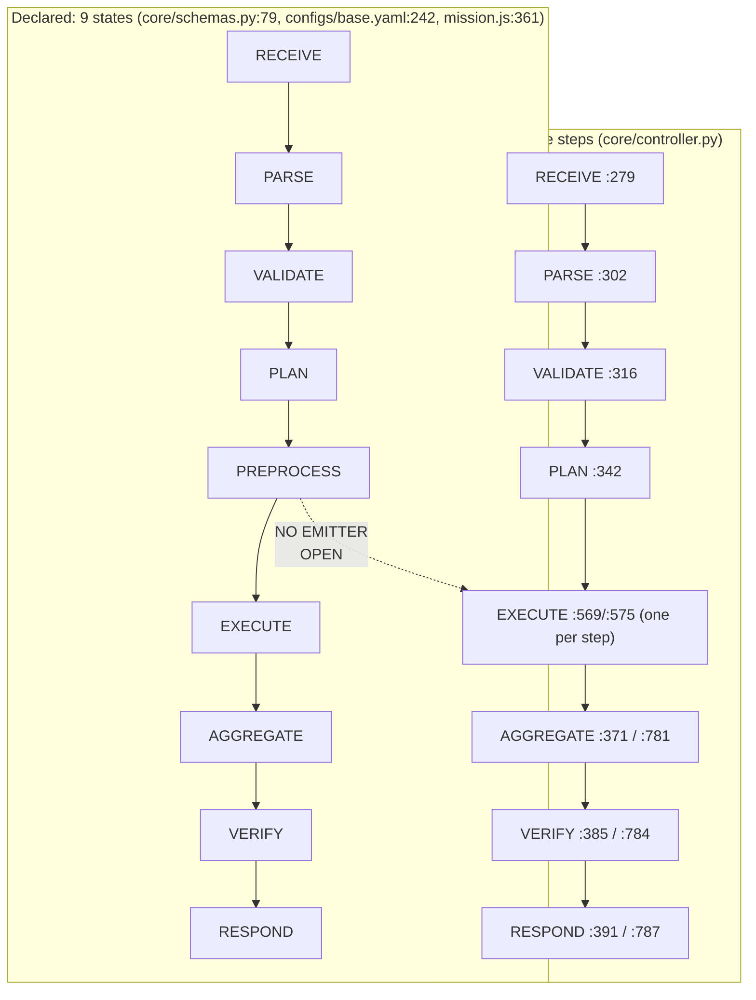
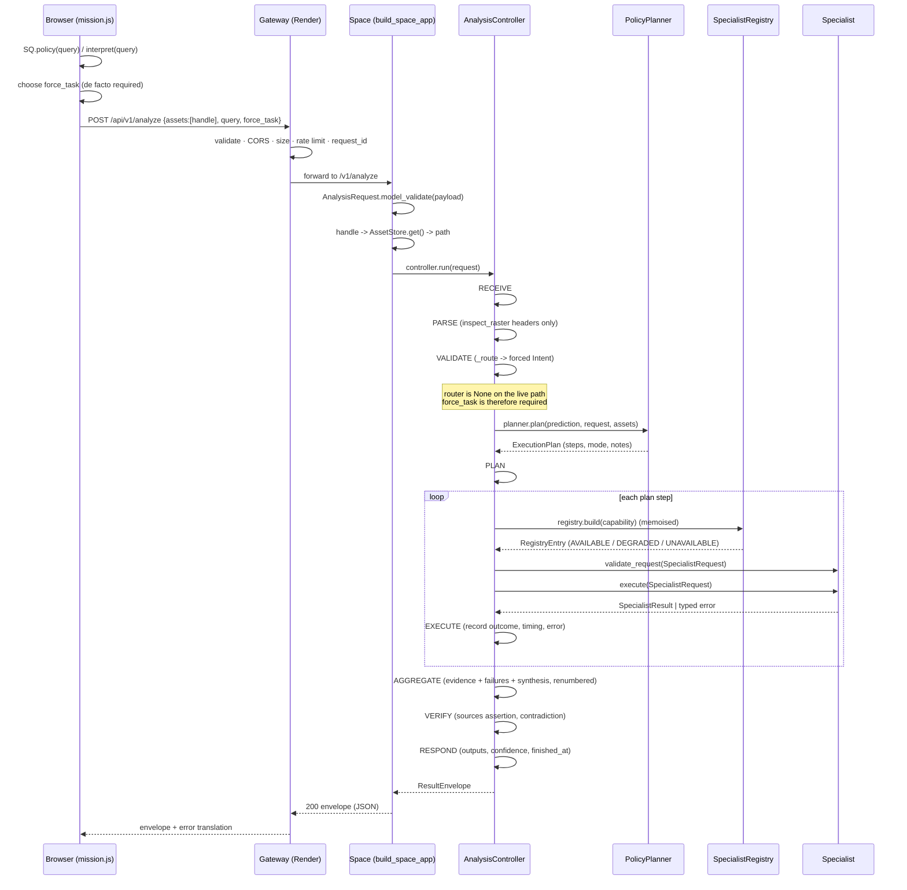

# 03 — Request Lifecycle

**Parent:** [Architecture hub](README.md) · **Previous:** [02 Deployment topology](02-deployment-topology.md) ·
**Next:** [04 Router](04-router.md)

**Status tags used in this document:** `IMPLEMENTED` · `VERIFIED` · `MEASURED` · `ATTEMPTED` ·
`NOT RUN` · `BLOCKED` · `DEFERRED` · `REJECTED` · `OPEN` · `RESOLVED` · `CLOSED`.

> **One-paragraph summary.** One analysis travels through a **nine-state controller**
> (`core/controller.py`) whose authority is deliberately narrow: it may **refuse** a plan that fails its own
> preconditions, and otherwise it **executes the plan it is given and assembles the result**. It does not
> decide what runs — that is `core/planner.py` alone — and it does not compute what a specialist computes.
> The path is `AnalysisRequest → router.route() → PolicyPlanner.plan() → dispatch → ResultEnvelope`
> (`core/controller.py:10`). Two properties dominate the design and explain almost every line of the file:
> **partial failure never erases evidence** (a failed step becomes a typed `STATISTIC` record and the run
> continues — there is no early exit on step failure), and **confidence is never averaged** (the run's
> confidence is the *primary step's* score, calibrated; a run whose primary specialist failed has **no**
> confidence rather than a laundered one). Three honest gaps are recorded in this document and none are
> papered over: the controller emits **eight** trace states while the config declares **nine**
> (`PREPROCESS` is never recorded); the deployed serving composition **attaches no router**, so
> `force_task` is de facto required on the live path; and the tiling / percentile / dB-clip policy that
> `configs/base.yaml` declares is **read by no code on the serving path**.

---

## Part A — The controller and the nine states

### 1. Where this subsystem sits

#### 1.1 The five verbs

`docs/ARCHITECTURE_FREEZE.md` §5 assigns each layer exactly one verb, and the controller is written to obey
that allocation rather than to be convenient:

| Layer | Verb | Module |
|---|---|---|
| Router | **understands** | `router/classifier.py` |
| Policy engine | **decides** | `core/planner.py` |
| Specialists | **compute** | `specialists/**` |
| VLM | **explains** | `specialists/vqa/inference.py` |
| Evidence engine | **proves** | `evidence/engine.py` |

The controller is the **dispatcher and assembler** that sits between them. `core/controller.py:5-14` states
its own authority verbatim:

> `docs/ARCHITECTURE_FREEZE.md` section 5 gives the control tier two verbs that live here: the controller
> *dispatches* and *assembles*. It does not decide which specialists run — that is `core.planner`'s job
> alone — and it does not compute anything a specialist computes.

#### 1.2 What the controller is, precisely

`AnalysisController` (`core/controller.py:171`) is the only class in the control tier. Its constructor is:

```python
def __init__(
    self,
    *,
    registry: SpecialistRegistry,
    planner: PolicyPlanner,
    router: Any | None = None,
    evidence: Any | None = None,
    config: Any | None = None,
    budget_seconds: float | None = None,
) -> None
```

Four constructor behaviours are load-bearing and each is documented in the source:

1. **`evidence` is built here, and the calibration artifact is loaded here.** When `evidence` is omitted the
   controller constructs `EvidenceEngine.from_config(config, calibration=load_calibration(config))`
   (`core/controller.py:217-221`). Before 2026-09-22 this call passed **no** `calibration=`, so
   `EvidenceEngine` fell back to its `None` default and every confidence the system emitted said
   `method="uncalibrated"` even once a fitted artifact existed. The comment at `core/controller.py:203-216`
   calls that "the single section 67 immutable-decision violation (`calibrated confidence`)" and records it
   as **a wiring gap, not a missing capability**.
2. **`load_calibration` returns `None`, never a fabricated default** — so an artifact-less deployment still
   degrades to the honest pass-through rather than failing to construct.
3. **`budget_seconds` defaults to `config.get("agent.timeout_seconds", DEFAULT_BUDGET_SECONDS)`**, where
   `DEFAULT_BUDGET_SECONDS: float = 120.0` (`core/controller.py:122`) and
   `configs/base.yaml:240` sets `agent.timeout_seconds: 120`.
4. **`specialists.base.SpecialistRequest` is imported lazily inside `_execute_one`, NOT at module scope.**
   The reason is a real import cycle, spelled out at `core/controller.py:106-115`:
   `specialists.base → core.errors → core/__init__ → core.controller → specialists.base (partially
   initialised) → ImportError`.

#### 1.3 The one public entry point

```python
def run(
    self,
    request: AnalysisRequest,
    *,
    assets: Sequence[AssetMetadata] | None = None,
    asset_modalities: Mapping[str, str] | None = None,
) -> ResultEnvelope
```

Its contract, verbatim from `core/controller.py:254-256`:

> Never raises for a specialist-level failure: those are recorded in the result, the trace and the evidence.
> Raises only for a caller error the schema cannot catch.

`health()` (`core/controller.py:396`) is the other public method and is **retired as a public API path**
(H-1/H-2, owner ruling 2026-09-22). It is retained only as an operator diagnostic. Its docstring is worth
quoting because it is the clearest statement of the health-shape defect in the codebase:

> 1. **The shape is not the contract's.** … `GET /v1/health` [is] fixed to `HealthStatus`
>    (`core/schemas.py:392`), which is `extra="forbid"` with the fields `status, schema_version, models,
>    device, gpu_available`. This method returns `registry, degraded, unavailable, device` — so
>    constructing a `HealthStatus` from its output raises `extra_forbidden` on three keys and reports
>    `status`/`gpu_available` missing. That is finding H-1 …
> 2. **The vocabulary is the registry's, not the contract's.** …

The replacement is `app.deployment.deployment_report()`, which **constructs nothing** — "requirement 4 of
`docs/DEPLOYMENT_ARCHITECTURE.md` section 3.3 forbids loading a model for a metadata request. Calling this
from `/v1/health` would spend the 5 GPU-minute daily budget on health probes."

### 2. The nine states — declared versus emitted

This is the single most important honesty point in this document, so it is stated first and precisely.

#### 2.1 The enum has nine members

`ControllerState` (`core/schemas.py:79-88`) — exact spellings, all upper-case:

| # | Member | Value |
|---|---|---|
| 1 | `RECEIVE` | `"RECEIVE"` |
| 2 | `PARSE` | `"PARSE"` |
| 3 | `VALIDATE` | `"VALIDATE"` |
| 4 | `PLAN` | `"PLAN"` |
| 5 | `PREPROCESS` | `"PREPROCESS"` |
| 6 | `EXECUTE` | `"EXECUTE"` |
| 7 | `AGGREGATE` | `"AGGREGATE"` |
| 8 | `VERIFY` | `"VERIFY"` |
| 9 | `RESPOND` | `"RESPOND"` |

`configs/base.yaml:242-251` repeats the same nine names under `agent.states`, and the frontend mirrors them
again in `frontend/assets/js/mission.js:361`:

```javascript
var STATES = ['RECEIVE', 'PARSE', 'VALIDATE', 'PLAN', 'PREPROCESS', 'EXECUTE', 'AGGREGATE', 'VERIFY', 'RESPOND'];
```

So **three** places declare nine states: the schema, the frozen config, and the frontend.

#### 2.2 The controller records eight

`AnalysisController.run()` calls `self._record(trace, ControllerState.X, …)` for exactly **eight** of the
nine. The full set of `ControllerState` writes in `core/controller.py` is:

| Line | State | Context |
|---|---|---|
| `:279` | `RECEIVE` | `{"asset_count": len(request.assets)}` |
| `:302` | `PARSE` | `{"inputs": […], "modalities": […], "query_length": …}` |
| `:316` | `VALIDATE` | `{"assets": …, "force_task": …, "router": …}` |
| `:342` | `PLAN` | `{"plan": plan.to_trace()}` |
| `:569` | `EXECUTE` | budget-skip outcome |
| `:575` | `EXECUTE` | per-step outcome |
| `:371` | `AGGREGATE` | `{"evidence": …, "degraded": …}` |
| `:781` | `AGGREGATE` | refusal path: `{"refused": True, "refusal": …}` |
| `:385` | `VERIFY` | `{"contradiction": …}` |
| `:784` | `VERIFY` | refusal path: `{"steps": 0}` |
| `:391` | `RESPOND` | `{"answer_length": …}` |
| `:787` | `RESPOND` | refusal path: `{"refused": True}` |

**`PREPROCESS` appears nowhere in `core/controller.py`.** A repository-wide search for `PREPROCESS`
returns: `configs/base.yaml:247`, `core/schemas.py:84`, three frontend files, and training-script
identifiers (`PREPROCESSING_VERSION` in `training/change_vqa/dataset.py`) that are unrelated. There is no
`_record(trace, ControllerState.PREPROCESS, …)` anywhere.

#### 2.3 A test pins the eight, and that is deliberate

`tests/unit/test_controller.py:379-395` asserts the observed sequence:

```python
def test_run_records_controller_states_in_order() -> None:
    controller = _controller({"vqa": _stub_class("vqa")()}, task=Task.VQA)
    envelope = controller.run(_request(1))
    states = [s.state for s in envelope.trace.steps]
    assert states[0] is ControllerState.RECEIVE
    assert states[-1] is ControllerState.RESPOND
    for required in (
        ControllerState.RECEIVE,
        ControllerState.PARSE,
        ControllerState.VALIDATE,
        ControllerState.PLAN,
        ControllerState.EXECUTE,
        ControllerState.AGGREGATE,
        ControllerState.VERIFY,
        ControllerState.RESPOND,
    ):
        assert required in states
```

Note the list: **eight** members. `PREPROCESS` is not in it, and the test does not fail on its absence.

#### 2.4 Why `PREPROCESS` exists but is unrecorded — stated honestly

Three things are true at once and none of them is a contradiction:

1. The **policy** names a `PREPROCESS` phase: `configs/base.yaml:242` lists it among `agent.states`, and the
   frontend's stage model expects it (`frontend/assets/js/mission.js:364` maps `SPECIALIST_STARTED →
   'PREPROCESS'`, and `:371` labels it `'awaiting backend'`).
2. **No code reads `agent.states`.** A repository-wide search for `agent.states` in Python returns
   nothing. The list is declared and never consumed, so it cannot drive the controller.
3. **The controller's actual preprocessing happens inside the specialist**, not in a controller state:
   `_execute_one` constructs a `SpecialistRequest`, calls `specialist.validate_request(...)`, then
   `specialist.execute(...)` (`core/controller.py:621-630`). Anything that could be called "preprocessing"
   — raster reading, percentile stretch, band mapping — happens inside `execute`, i.e. inside the `EXECUTE`
   state, and is recorded there as one `EXECUTE` trace step per plan step.

So the honest statement is: **`PREPROCESS` is a declared state with no emitter.** The frontend must render it
from its own client-side model, not from the backend trace. `frontend/assets/js/mission.js:371` already
labels it `'awaiting backend'`, which is consistent with this. Status: `OPEN` (a schema/config/frontend
declaration that the controller does not honour).



### 3. State-by-state reference

For each state: what it does, what can fail, and exactly what it emits.

#### 3.1 `RECEIVE` — `core/controller.py:258-279`

**Does.** Allocates the run. `started = time.perf_counter()`; `run_id = request.run_id or self._new_run_id()`
where `_new_run_id()` returns `f"run_{uuid.uuid4().hex[:12]}"` (`core/controller.py:1211-1214`). Constructs
the `ExecutionTrace` with `run_id`, `query=request.query`, `inputs=[_asset_label(a) for a in request.assets]`
and `config_hash=self.config.hash if self.config is not None else None`.

**The `inputs` field is a real disclosure fix, not a cosmetic one.** `core/controller.py:263-275` records
that `ExecutionTrace` is returned verbatim by `POST /v1/analyze`, and it previously echoed `request.assets`
*after* the caller had turned asset **handles** into filesystem **paths** — so the response named the
server-side location of every uploaded byte. `_asset_label` (`core/controller.py:1295-1323`) reduces each
entry to `Path(asset).name`, and it is deliberately the **same call** `_resolve_assets` makes when looking a
modality override up by basename, "so the label and the lookup cannot disagree about what an asset is
called." Recorded as **F-13**.

**Fails.** Nothing. This is a pure allocation.

**Emits.**
```json
{"asset_count": 2}
```

#### 3.2 `PARSE` — `core/controller.py:281-308`

**Does.** Resolves the assets into `AssetMetadata`. If the caller passed `assets=` they are used verbatim
("A caller that has already validated rasters should pass them rather than make the controller inspect the
same files twice"); otherwise `_resolve_assets(request, asset_modalities=…)` inspects each one. Then sets
`trace.modalities = self._modalities(resolved)` — *distinct* modalities in first-seen order
(`core/controller.py:524-531`).

**The inspection is header-only by design.** `_resolve_assets` delegates to
`preprocessing.raster.inspect_raster`, "which opens the raster header and reports band count, dtype, CRS,
transform, bounds and resolution. It does NOT decode pixel data — a 12-band Sentinel-2 tile is ~100 MB and a
four-specialist plan would decode it repeatedly" (`core/controller.py:486-489`).

**The docstring records a real historical defect.** An earlier version built `AssetMetadata(path=path)`,
leaving `geo` and `modality` at their defaults, so every asset reached every specialist with
`band_count=None` and `modality=UNKNOWN`. The visible consequence, quoted at `core/controller.py:497-500`:

> a valid 4-band optical + 2-band SAR pair was rejected by `OpticalSarSpecialist.validate_request` with
> "could not identify one optical and one SAR asset from modalities ['unknown', 'unknown']" — a
> user-visible refusal of a perfectly good request.

**Fails.** A missing or unreadable asset raises `RasterReadError` (typed), which the controller surfaces
with a user message. `core/controller.py:503-506` is explicit that it does **not** degrade to an empty
description, "because 'we could not read this' and 'this had nothing to report' must stay distinguishable."

**Also emits the F-14 fix.** The PARSE detail writes `[_asset_label(a) for a in request.assets]`, not
`list(request.assets)`. `core/controller.py:287-299` records the second instance of the same disclosure with
a **measured** example: "the client sent the handle `asset_d243f7f85d8c2f3c02981f0af9737f01` and received
back `C:\Users\anish\sq_scratch\...\assets\asset_d243...7f01.tif`."

**Emits.**
```json
{
  "inputs": ["a.tif", "b.tif"],
  "modalities": ["optical"],
  "query_length": 47
}
```

#### 3.3 `VALIDATE` — `core/controller.py:310-324`

**Does.** Routes. `prediction = self._route(request)`; `trace.intent = prediction.intent if prediction is not
None else None`; `trace.task = prediction.intent.task if prediction is not None else request.force_task`.

**What routing does, and what it does not.** `_route` (`core/controller.py:458-476`) has two branches:

- **`force_task` is set** → the router is **not consulted at all**. It constructs
  `Intent(task=request.force_task, confidence=1.0, source="forced")` and wraps it in
  `RouterPrediction(intent=intent, above_threshold=True)`. The fact that the router's opinion was bypassed is
  therefore *visible in the trace* (`source="forced"`).
- **`force_task` is `None`** → `if self.router is None: return None`, else
  `return self.router.route(request.query)`.

**`return None` is a hard stop downstream.** `core/controller.py:327-334`:

```python
if prediction is None:
    # No router and no forced task: nothing can be planned. This is a
    # caller error, not a query the system declined.
    raise UnsupportedQueryError(
        "no router configured and no force_task supplied; there is no "
        "way to choose a specialist",
        recoverable=False,
    )
```

**This branch is reachable on the live deployment — see §38.** It is a `raise`, not a recorded failure, and
it is the only `raise` in the happy path.

**Emits.**
```json
{
  "assets": 2,
  "force_task": "change_vqa",
  "router": {"task": "change_vqa", "modality": "unknown", "temporal": true,
             "spatial_output": false, "language_output": true,
             "confidence": 1.0, "source": "forced", "above_threshold": true,
             "used_fallback": false, "fallback_rule": null}
}
```

(The `router` value is `RouterPrediction.to_trace()`, `router/classifier.py:93-106`. When routing is forced it
carries the synthesized prediction, so `source` reads `"forced"`.)

#### 3.4 `PLAN` — `core/controller.py:326-345`

**Does.** `plan = self.planner.plan(prediction, request, assets=resolved)`. Then populates
`trace.parameters` with three things:

```python
trace.parameters = {
    **plan.to_trace(),
    "budget_seconds": self.budget_seconds,
    "registry": self.registry.describe(),
}
```

**Fails.** Nothing here — the planner expresses refusal *in the plan*, never by raising
(`core/planner.py:75-81`: "Refusing is not an error. It returns a valid plan with `refused=True` and a typed
`PlanRefusal`"). If `plan.refused` is true the controller takes the early-return refusal path (§4) and
**never reaches EXECUTE**.

**F-19 is visible in this state's neighbourhood.** `core/controller.py:350-365` records that
`registry.describe()` reports the registry's **memoised** entries, so the PLAN-time snapshot reports the
*previous* request's builds while `trace.selected_models` (populated inside `_execute`) reports *this* one.
Measured in pass 13 with two identical payloads on one controller: "request #1 body `built == []`, request #2
body `built == ['optical_sar']`". The fix re-snapshots **after** execution
(`trace.parameters["registry"] = self.registry.describe()`, `core/controller.py:365`) rather than moving the
PLAN-time assignment, "so the PLAN record's own context stays intact and leaves the early-return refusal path
with a snapshot that is still correct — nothing is built on a refusal."

**Emits.**
```json
{"plan": {"steps": [...], "mode": "sequential", "refused": false, "refusal": null,
          "uncertain": false, "router_source": "forced",
          "effective_confidence": 1.0, "notes": []}}
```

#### 3.5 `PREPROCESS` — **declared, never emitted**

See §2.4. Recorded here as a state so the reference is complete, with its status stated:

| Aspect | Value |
|---|---|
| Declared in | `core/schemas.py:84`, `configs/base.yaml:247`, `frontend/assets/js/mission.js:361` |
| Emitted by | **nothing** — no `_record(trace, ControllerState.PREPROCESS, …)` exists |
| Read from config by | **nothing** — `agent.states` is consumed by no Python code |
| Where the work actually happens | inside `EXECUTE`, inside `specialist.execute(...)` |
| Status | `OPEN` |

#### 3.6 `EXECUTE` — `core/controller.py:347-348`, `:535-709`

**Does.** `outcomes = self._execute(trace, plan, resolved, request, started)`. First sets
`trace.workflow = [step.step_id for step in plan.steps]` (`core/controller.py:545`) — the ordered list of step
ids, which is what makes "step_001 produced the grounding box" a reproducible claim.

Then **for each step**, in plan order:

1. **Budget check, between steps** (`core/controller.py:548-571`). `elapsed = time.perf_counter() - started`;
   if `elapsed > self.budget_seconds` the step is **skipped**, not failed:
   `StepOutcome(step=step, skipped_reason=f"budget_exceeded:{elapsed:.1f}s")`. A trace error is appended with
   `"code": SpecialistTimeoutError.code` and `"message": f"skipped: run budget of {self.budget_seconds}s
   exceeded"`. The comment is an explicit design admission:

   > Budget is checked BETWEEN steps (§5.2). A true per-step timeout needs a worker process or a signal
   > handler, both of which conflict with the single-process monolith constraint more than they benefit. The
   > honest position: v1 bounds total wall clock and records what it skipped.

2. **Run the step** (`_execute_one`, `core/controller.py:599-709`):
   - `entry = self.registry.build(step.capability)` — memoised construction.
   - **If `entry.specialist is None`** the step is a recorded failure:
     `error=self._unavailable_error(step, entry)`, which returns a `ModelUnavailableError` whose detail is
     `f"{step.capability} was planned but could not be constructed"`, suffixed with `entry.detail` when
     present (`core/controller.py:711-719`).
   - Otherwise builds `SpecialistRequest(assets=list(assets), query=request.query,
     params=dict(step.params), run_id=trace.run_id)` and calls `specialist.validate_request(...)` **then**
     `specialist.execute(...)` (`core/controller.py:621-630`).
   - `except SatQueryError as exc:` → recorded as the outcome's error, unchanged.
   - `except Exception as exc:` → **wrapped**, never propagated. The exception's own text is *server-side
     only*: it is logged (`_log.error(..., exc_info=exc)`) and preserved in `context`, while the client
     receives a fixed message. `core/controller.py:687-700`:
     ```python
     error=SpecialistError(
         "unhandled error",
         user_message=(
             "The step failed with an unhandled error. Internal "
             "detail is withheld; see the server-side diagnostics."
         ),
         specialist=step.capability,
         context={
             "step_id": step.step_id,
             "code": "unhandled",
             "exception_type": type(exc).__name__,
             "exception_message": str(exc),
         },
     )
     ```
     The **classification survives**: "the client still learns that this was an UNHANDLED failure rather than
     a known typed error. Losing that would hide the difference between 'we predicted this failure mode' and
     'we did not', which is exactly the distinction `code: unhandled` exists to record"
     (`core/controller.py:644-648`).

3. **Record the outcome** — one `EXECUTE` trace step per plan step, via `outcome.to_trace()`
   (`core/controller.py:154-165`):
   ```json
   {"step_id": "step_001", "capability": "change_vqa", "ok": true,
    "skipped_reason": null, "error_code": null,
    "duration_ms": 8421.377, "registry_state": "available"}
   ```
   And `trace.timings[step.step_id] = round(outcome.duration_ms, 3)`.

4. **Record a client-facing error when the step failed** (`core/controller.py:578-594`):
   ```python
   trace.errors.append({
       "step_id": step.step_id,
       "capability": step.capability,
       "code": outcome.error.code,
       "message": outcome.error.user_message or "The step failed.",
       "recoverable": outcome.error.recoverable,
   })
   ```
   The comment records F-15: "the trace is CLIENT-FACING, so it carries the operator-safe message only. It
   previously preferred `error.detail` — the technical text, which can name filesystem paths and library
   internals — over `user_message`."

**There is no early exit.** The loop body has no `break` and no `return`; the only `continue` is the
budget-skip. `core/controller.py:16-20` states the rule and its reason:

> A failed step never removes itself from the result. It becomes a recorded failure with a typed code, and
> the run continues. Nothing aborts the run; there is no early exit on step failure.

**After the loop.** `trace.selected_models = self._selected_models(outcomes)` (`core/controller.py:596`,
`:721-749`). That walks each outcome's *constructed* specialist and calls `specialist.model_refs()`, deduping
on `f"{name}:{role}"` and building explicit `ModelRef` objects rather than relying on pydantic coercion.

**Fails.** Any `SatQueryError` from `validate_request` or `execute`; any unhandled `Exception` (wrapped); a
`ModelUnavailableError` when construction fails. **None of these aborts the run.**

**Emits.** One `EXECUTE` step per plan step (or per skipped step), plus `trace.workflow`, `trace.timings`,
`trace.errors[]` entries, and `trace.selected_models`.

#### 3.7 `AGGREGATE` — `core/controller.py:367-380`, `_aggregate` `:793-834`

**Does.** `result = self._aggregate(trace, plan, outcomes, prediction, request)`.

`_aggregate` merges N step outcomes into one `SpecialistResult`:

```python
successful = [o for o in outcomes if o.ok]
results = [o.result for o in successful if o.result is not None]

failure_evidence = [self._failure_evidence(o) for o in outcomes if not o.ok]

collection = self.evidence.aggregate(results) if results else None
items: list[Evidence] = list(collection.items) if collection else []
items.extend(self._synthesis_evidence(results, request))
items.extend(failure_evidence)
items = self._renumber(items)
```

Three evidence sources are therefore concatenated in a fixed order:

| Source | Producer | When present |
|---|---|---|
| Aggregated specialist evidence | `EvidenceEngine.aggregate(results)` | whenever any step succeeded |
| Synthesis record | `_synthesis_evidence` | only when **≥ 2** results |
| Failure records | `_failure_evidence` | one per non-ok outcome |

**The failure record is the "absence must be distinguishable from a non-event" rule applied at the control
layer** (`core/controller.py:22-29`):

> If a specialist fails and simply does not contribute evidence, a consumer cannot tell whether it ran and
> found nothing, never ran, or crashed. So a failed step adds one `STATISTIC` evidence item carrying its typed
> code. No schema change is needed: `STATISTIC` is already in the frozen `EvidenceType` vocabulary.

`_failure_evidence` (`core/controller.py:865-887`) produces exactly:
```python
Evidence(
    type=EvidenceType.STATISTIC,
    source_specialist=outcome.step.capability,
    score=0.0,
    payload={
        "step_failed": True,
        "step_id": outcome.step.step_id,
        "code": code,
        "message": message,
        "skipped_reason": outcome.skipped_reason,
    },
)
```
`score=0.0` is deliberate and is not a confidence claim: it is a "strength" slot filled with the only honest
value for "this produced nothing."

`_synthesis_evidence` (`core/controller.py:889-916`) returns `[]` when `len(results) < 2`; otherwise one item
attributed to `"controller"`:
```python
Evidence(
    type=EvidenceType.STATISTIC,
    source_specialist="controller",
    score=None,
    payload={"synthesis": True, "contributors": capabilities, "query": request.query},
)
```
Its docstring names the two facts it exists to make visible: "that several specialists were merged into one
answer, and which query they were answering. Neither belongs to any single specialist, so neither can be
attributed to one."

`_renumber` (`core/controller.py:918-929`) rewrites **every** id to `evidence_{i:03d}` starting at 1, because
"the engine's ids stop being authoritative once controller-authored items are appended."

The state's `detail` re-runs aggregation purely to produce a summary — the aggregate call is cheap and pure:

```python
{"evidence": {"returned": 9, "total_before_limit": 9, "dropped_duplicates": 0,
              "dropped_over_limit": 0, "truncated": false,
              "sources": ["change_vqa"], "types": ["change_map", "statistic"]},
 "degraded": false}
```

**Fails.** Nothing directly. A malformed specialist result would already have failed inside `EXECUTE`.

**Emits.** The `AGGREGATE` trace step, and the assembled `SpecialistResult` (fields enumerated in §14).

#### 3.8 `VERIFY` — `core/controller.py:382-385`, `_verify` `:1120-1147`

**Does two things, both real checks.**

**(a) The `sources` assertion.** `core/controller.py:31-41` explains why this is checkable rather than merely
intended:

> `EvidenceEngine.aggregate` records `sources` BEFORE applying its item cap, so a specialist whose evidence was
> capped away still appears. That makes "no specialist ran and left no trace" *checkable* rather than merely
> intended:
>
> ```
> set(collection.sources) == {capability for each successful step}
> ```
>
> A mismatch means a specialist ran and left nothing behind — the exact failure this design exists to
> prevent. It is enforced in the `VERIFY` state as a real assertion, not a comment.

The implementation (`core/controller.py:1124-1141`):
```python
successful = [o for o in outcomes if o.ok and o.result is not None]
if not successful:
    return
collected = self.evidence.aggregate([o.result for o in successful])
expected = {o.capability for o in successful}
observed = set(collected.sources)
missing = expected - observed
if missing:
    trace.errors.append({
        "step_id": "*",
        "code": "evidence_loss",
        "message": f"specialists produced no evidence: {sorted(missing)}",
    })
```

**(b) A fallback note for an evidence-less result** (`core/controller.py:1143-1147`): for each successful
outcome whose result carries no evidence items, `trace.fallbacks.append(f"{outcome.capability} produced a
result with no evidence items")`.

**Then contradiction detection** runs (`self._detect_contradiction(...)`) and the state's `detail` records the
flag:
```json
{"contradiction": false}
```

**Fails.** Nothing. It records.

**Emits.** The `VERIFY` trace step; possibly `trace.errors[]` with `code: "evidence_loss"`; possibly
`trace.fallbacks[]`.

#### 3.9 `RESPOND` — `core/controller.py:387-394`

**Does.** Final assembly:
```python
result.execution_trace = trace
trace.outputs = [e.evidence_id for e in result.evidence]
trace.confidence = result.confidence
self._record(trace, ControllerState.RESPOND, {"answer_length": len(result.answer)})
trace.finished_at = self._now()
return ResultEnvelope(run_id=run_id, result=result, trace=trace)
```

Three things worth naming:

- **`result.execution_trace = trace`** means the trace is reachable **twice** in the serialized envelope —
  once as `envelope.trace` and once as `envelope.result.execution_trace`. They are the same object. The
  registry docstring at `core/registry.py:570-574` measured the consequence of that duplication for the F-15
  disclosure: a single construction failure "put the vendor directory path into **four** client-visible
  fields — `result.warnings[]`, `result.evidence[].payload["message"]`,
  `trace.parameters.registry.built[<cap>].detail`, and the same registry block again inside
  `result.execution_trace` (the trace is the same object, serialized twice)."
- **`trace.outputs`** is a list of *evidence ids*, not a count and not the answer text. It is the citation
  list a consumer follows to inspect what supported the answer.
- **`trace.finished_at`** is the last write. `TraceStep.started_at` defaults to `_utcnow()` at construction,
  so per-state timings are *start* stamps; per-step durations live in `trace.timings`.

**Fails.** Nothing.

**Emits.** `{"answer_length": 218}`, plus the completed `ResultEnvelope`.

### 4. The refusal path — `_finish_refusal` (`core/controller.py:753-789`)

A refusal is **a successful run with no steps**. The docstring is one line: "A refusal is a successful run
with no steps, not an error."

```python
result = SpecialistResult(
    task=trace.task or Task.UNSUPPORTED,
    answer=message,
    confidence=ConfidenceBreakdown(
        raw=0.0,
        calibrated=None,
        method="uncalibrated",
        degraded=True,
        degradation_reason=f"refused:{refusal.reason}" if refusal else "refused",
    ),
    warnings=list(plan.notes),
    degraded=True,
)
trace.fallbacks.extend(plan.notes)
```

Note the exact state sequence on this path — **it skips `PREPROCESS` and `EXECUTE` entirely, and its
`AGGREGATE` detail is different**:

| State | Detail |
|---|---|
| `RECEIVE` | `{"asset_count": n}` |
| `PARSE` | `{"inputs": […], "modalities": […], "query_length": …}` |
| `VALIDATE` | `{"assets": n, "force_task": …, "router": …}` |
| `PLAN` | `{"plan": {…, "refused": true, "refusal": {…}}}` |
| `AGGREGATE` | `{"refused": true, "refusal": {"code": …, "reason": …, "user_message": …}}` |
| `VERIFY` | `{"steps": 0}` |
| `RESPOND` | `{"refused": true}` |

`trace.confidence = result.confidence` and `trace.finished_at` are set, so the refusal envelope is shaped
exactly like any other. `run_id` comes from `trace.run_id` (the one allocated in `RECEIVE`), so the client's
`run_id` is echoed.

**`raw=0.0, calibrated=None, degraded=True`** is the only honest confidence for a refusal: no specialist ran,
so there is no measurement. `degradation_reason` names the refusal rule, e.g. `"refused:task_unsupported"`.

### 5. The budget — total wall clock, checked between steps

| Aspect | Value | Source |
|---|---|---|
| Key | `agent.timeout_seconds` | `configs/base.yaml:240` |
| Frozen value | `120` | `configs/base.yaml:240` |
| Fallback constant | `DEFAULT_BUDGET_SECONDS = 120.0` | `core/controller.py:122` |
| Read at | `core/controller.py:226` | constructor |
| Checked | between steps, `elapsed > self.budget_seconds` | `core/controller.py:553-554` |
| On exceed | step **skipped**, `skipped_reason="budget_exceeded:{elapsed:.1f}s"` | `core/controller.py:555-558` |
| Trace error code | `SpecialistTimeoutError.code` = `"specialist_timeout"` | `core/errors.py:237-239` |

The design admits the limitation rather than hiding it. There is **no per-step timeout**, because a true one
"needs a worker process or a signal handler, both of which conflict with the single-process monolith
constraint more than they benefit" (`core/controller.py:548-552`).

`SpecialistTimeoutError` is `recoverable=True` (`core/errors.py:256-258`) for two independently recorded
reasons: `API_CONTRACT.md` §5.1 maps `504` with `recoverable: true`, and the plan's Failure Matrix lists
Timeout with recovery "abort specialist" and fallback "partial result" — i.e. the controller continues rather
than failing the request.

### 6. Partial failure never erases evidence

The mechanism is three-part and each part is separately testable:

1. **`StepOutcome` retains the failure** (`core/controller.py:135-165`):
   ```python
   @dataclass
   class StepOutcome:
       step: PlanStep
       result: SpecialistResult | None = None
       registry_entry: RegistryEntry | None = None
       error: SatQueryError | None = None
       duration_ms: float = 0.0
       skipped_reason: str | None = None

       @property
       def ok(self) -> bool:
           return self.result is not None and self.error is None
   ```
   Note `ok` requires **both** a result and no error — a step that somehow produced both is not "ok".

2. **`_failure_evidence` converts it to a `STATISTIC` record** (§3.7) so it survives into `result.evidence`.

3. **`_warnings` converts it to a human-readable line** (`core/controller.py:1014-1052`):
   ```
   "{capability} failed ({code}): {scrubbed reason}"
   "{capability} skipped ({skipped_reason})"
   ```
   The reason comes from `_client_error_reason` — **one** shared implementation, deliberately:
   ```python
   @staticmethod
   def _client_error_reason(error: SatQueryError) -> str:
       return scrub_paths(error.detail) or error.user_message
   ```
   `core/controller.py:838-863` explains that three client-visible carriers report a failed step —
   `result.warnings[]`, `evidence[].payload["message"]` and `trace.errors[].message` — and before F-20 two of
   them published an internals string while the third promised the internals were withheld: "The response
   contradicted itself." The repair has two halves: the **producer** stopped putting internals into `detail`,
   and this function exists "so the rule is written ONCE. Two copies of `scrub_paths(detail) or user_message`
   is how a rule drifts: the next fix lands on whichever copy the author happened to open."

   `detail` is preferred over `user_message` on purpose, because "F-15 established that a typed error's
   `detail` is the actionable diagnostic ("... has no builder 'build_x'", "no GPU in this dimension") while
   the base `user_message` is generic, and three tests pin exactly those diagnostics."

### 7. Contradiction detection — represented, never resolved

`_detect_contradiction` (`core/controller.py:1151-1184`) groups every successful outcome's boxes by
`box.coordinate_system.value`, then compares pairs **within one coordinate system**:

```python
for system, boxes in claims.items():
    if len(boxes) < 2:
        continue
    for i in range(len(boxes)):
        for j in range(i + 1, len(boxes)):
            if _iou(boxes[i], boxes[j]) < CONTRADICTION_IOU_FLOOR:
                trace.contradiction = True
                message = (
                    "specialists produced contradictory spatial claims "
                    f"in {system}; both are retained in evidence"
                )
                if message not in result.warnings:
                    result.warnings.append(message)
                return
```

| Constant | Value | Source |
|---|---|---|
| `CONTRADICTION_IOU_FLOOR` | `0.1` | `core/controller.py:119` |

`_iou` (`core/controller.py:1281-1292`) is plain intersection-over-union returning `0.0` when disjoint.

The design rationale (`core/controller.py:60-66`):

> When two specialists make contradictory spatial claims, both are kept and `trace.contradiction` is set.
> Selecting a winner requires a precedence weight, and any such weight is a value judgment with no measurement
> behind it. It also produces a third box that *neither specialist predicted* — a fabricated coordinate.

Two implementation details matter. **Cross-system comparison is skipped** because "IoU across coordinate
systems is meaningless" (`core/controller.py:1161-1162`). And the method **returns after the first
contradiction**, so at most one warning is added per run.

### 8. Confidence is not averaged

`core/controller.py:43-58` states the rule:

> Per-specialist confidences are uncalibrated and are not probabilities. Averaging two uncalibrated
> hand-weighted sums produces a number that is not a measurement of anything.
>
> The aggregate confidence is therefore the confidence of the **primary step** — the step whose capability
> matches the router's predicted task — passed through the evidence engine's calibration, which degrades
> honestly to `method="uncalibrated"`, `calibrated=None` when no artifact is fitted.

`_confidence` (`core/controller.py:1069-1116`):

```python
primary_task = trace.task
primary = next(
    (r for r in results if primary_task is not None and r.task is primary_task),
    None,
)

components: dict[str, float] = {}
for result in results:
    components[f"{result.task.value}_confidence"] = float(result.confidence.raw)

if primary is None:
    return ConfidenceBreakdown(
        raw=0.0,
        calibrated=None,
        method="uncalibrated",
        components=components,
        degraded=True,
        degradation_reason="primary specialist produced no result",
    )

breakdown = self.evidence.confidence_for(
    primary,
    extra_components=components,
    degraded=primary.degraded,
)
if not breakdown.degraded and prediction is not None:
    if not prediction.above_threshold:
        breakdown = breakdown.model_copy(
            update={
                "degraded": True,
                "degradation_reason": "router confidence below threshold",
            }
        )
return breakdown
```

| Aspect | Behaviour |
|---|---|
| The run's score | the primary step's score, calibrated through the engine's artifact |
| Secondary scores | kept, in `components`, **namespaced** `f"{task.value}_confidence"` |
| Primary absent | `raw=0.0`, `calibrated=None`, `degraded=True`, reason `"primary specialist produced no result"` |
| Specialist said degraded | preserved — `degraded=primary.degraded` is passed through |
| Router uncertain | forces `degraded=True` with reason `"router confidence below threshold"` |

The reasoning for the primary-absent branch is stated flatly: "Reporting a secondary specialist's score as the
run's confidence would launder a failure into a number. Secondaries are not discarded — their raw scores
appear in `components`, namespaced by capability. That is measurable and invents no combination rule"
(`core/controller.py:54-58`).

Note that the final router clause applies **only** when the breakdown is not already degraded, so a
specialist-sourced degradation reason is never overwritten by the router's.

### 9. The answer priority list — a list, not a heuristic

`_answer` (`core/controller.py:933-970`) documents itself as "A priority list, not a heuristic (design
§7.3)":

| # | Rule | Produces |
|---|---|---|
| 1 | the first **ok** outcome whose `capability` is `"vqa"` or `"caption"` and whose `result.answer` is non-empty | that answer verbatim |
| 2 | else the non-empty-answer result with the highest `confidence.value` | `f"[{best.task.value}] {best.answer}"` |
| 3 | else any failures | `f"No result could be produced: {named}."` where `named` is `", ".join(f"{capability} ({error.code or 'skipped'})")` |
| 4 | else `plan.refusal.user_message` | the refusal text |
| 5 | else | `"No specialist produced an answer."` |

Rule 1 exists because "The VLM explains, when it ran (freeze §5)" and rule 2 exists because "else the
highest-confidence specialist answer, **attributed**" — the `[task]` prefix is the attribution, and it is
added here, not by the specialist. The closing note is the constraint that keeps this a list:
"No template composes a narrative from evidence: that is the VLM's job, and only when it actually ran."

### 10. Merging rules — four different operators for four different meanings

`_aggregate` calls four distinct merge helpers, and the choice of helper per field is the design:

| Helper | Semantics | Used for |
|---|---|---|
| `_merge_list` | union, order-preserving, deduped | `labels`, `masks` |
| `_concat` | concatenation in plan-step order, **duplicates preserved** | `regions`, `boxes` |
| `_first_non_none` | first non-`None` in result order | `change_map` |
| `_first_geospatial` | first non-empty geo block | `geospatial` |

`_first_geospatial` (`core/controller.py:1000-1012`) is not merged, and the reason is a coordinate-integrity
argument:

> Not merged: merging CRS or transform fields across assets would silently mix two coordinate reference
> systems into one field, which is a coordinate error the schema cannot catch (design §7.2).

Its selection predicate is `geo.has_crs or geo.crs or geo.bounds`; when nothing qualifies it returns a bare
`GeoMetadata()`.

### 11. `_degraded` — three independent triggers

```python
def _degraded(plan, outcomes, results) -> bool:
    if plan.uncertain:
        return True
    if any(not o.ok for o in outcomes):
        return True
    return any(r.degraded for r in results)
```

So a run is degraded when **any** of: the route was uncertain; any step failed or was skipped; any specialist
result was itself degraded. This is the run-level flag; the *capability-level* flag is a separate vocabulary
(§40).

---

## Part B — The shapes

Everything here is from `core/schemas.py`, which is `SCHEMA_VERSION = "1.0"` (`core/schemas.py:21`). The
module docstring states its status: "This module is the binding contract between every component. Per
docs/ARCHITECTURE_FREEZE.md section 3, no specialist may invent its own result shape."

### 12. `AnalysisRequest` — the inbound shape

`core/schemas.py:412-418`:

```python
class AnalysisRequest(BaseModel):
    model_config = ConfigDict(extra="forbid")

    assets: list[str] = Field(min_length=1)
    query: str
    force_task: Task | None = None
    run_id: str | None = None
```

| Field | Type | Required | Notes |
|---|---|---|---|
| `assets` | `list[str]` | **yes** | `min_length=1`. On the live path these are asset **handles**, rewritten to paths by `app/space_app.py::analyze` before `controller.run()` |
| `query` | `str` | **yes** | no minimum length; an empty string is schema-legal |
| `force_task` | `Task \| None` | no | bypasses the router entirely; recorded as `source="forced"` |
| `run_id` | `str \| None` | no | echoed back; generated as `run_{uuid4hex[:12]}` when omitted |

`extra="forbid"` is why an unknown field is a **422**, not an ignored key. `app/space_app.py:682-703` wraps
`AnalysisRequest.model_validate(payload)` and, on failure, logs the real `ValidationError` server-side while
returning `invalid_request` with the fixed detail "The body was not a valid AnalysisRequest. See
docs/API_CONTRACT.md section 2 for the accepted shape." — F-15 applied at the schema boundary.

### 13. `SpecialistResult` — the master contract

`core/schemas.py:325-343`. Its docstring is one sentence: "Every specialist returns exactly this. No
exceptions."

| Field | Type | Default | Meaning |
|---|---|---|---|
| `task` | `Task` | required | the task this result answers |
| `answer` | `str` | `""` | language output; empty for spatial-only tasks |
| `labels` | `list[str]` | `[]` | class labels |
| `regions` | `list[Region]` | `[]` | spatial results that may not be rectangles |
| `boxes` | `list[Box]` | `[]` | strict rectangles |
| `masks` | `list[str]` | `[]` | artifact refs |
| `change_map` | `str \| None` | `None` | artifact ref — **permanently `null` in v1** (F-16) |
| `evidence` | `list[Evidence]` | `[]` | the citable observations |
| `confidence` | `ConfidenceBreakdown` | required | never an LLM utterance |
| `geospatial` | `GeoMetadata` | `GeoMetadata()` | CRS / transform / bounds |
| `execution_trace` | `ExecutionTrace \| None` | `None` | set by the controller in `RESPOND` |
| `schema_version` | `str` | `"1.0"` | |
| `warnings` | `list[str]` | `[]` | operator-safe warnings |
| `degraded` | `bool` | `False` | |

Two validators run on every construction, and both encode real findings:

**(a) `_unique_evidence_ids`** (`core/schemas.py:345-351`) — `evidence_id` values must be unique within a
result. This is why `_renumber` in the controller exists.

**(b) `_task_output_consistency`** (`core/schemas.py:353-406`) — task-specific degradation rules. Two clauses
are live:

- **GROUNDING with no localisation is degraded, not a crash** (`core/schemas.py:355-361`): if
  `task is Task.GROUNDING and not (self.boxes or self.regions)` and the result is not already degraded, a
  warning is appended and `degraded` is set.
- **CHANGE_VQA with no answer text is degraded** (`core/schemas.py:396-405`): with the explicit caveat that
  "an answer alone is NOT enough to be non-degraded: the specialist sets `degraded` itself when it answered
  from an untrained head, and this validator must not clear that."

A **third** clause was **removed**, and the removal is documented in a long comment at
`core/schemas.py:362-395`. It read:

```python
if self.task is Task.CHANGE and self.change_map is None and not self.regions:
    ... "change analysis produced no spatial output" ... degraded = True
```

The comment records why it died (F-16c, owner ruling 2026-09-23):

> `change_map` was a PROXY for "a map was produced": before F-16 it held a filesystem path whenever a file had
> been written. F-16 made the ref permanently null — a client cannot retrieve it in v1 — so the proxy died,
> the clause collapsed to `not regions`, and a SUCCESSFUL no-change analysis began reporting `degraded: true`.
> A null, non-retrievable artifact ref was manufacturing a degradation.

And the replacement policy:

> No replacement clause is added, deliberately. A narrower "empty answer => degraded" rule was tried and
> backed out: it is not what the ruling asked for, it invented a semantic the specialist already owns, and it
> made a pre-existing, unrelated fixture (`test_change_with_regions_is_not_degraded`, a result with regions and
> no answer) fail. A fix that forces edits to tests it has nothing to do with is signalling over-reach, not
> diligence. **CHANGE is the one task whose `degraded` flag is now set entirely by its specialist.**

That last sentence is a precise, checkable claim about where responsibility sits.

### 14. `ResultEnvelope` — the outbound shape

`core/schemas.py:421-427`:

```python
class ResultEnvelope(BaseModel):
    model_config = ConfigDict(extra="forbid")

    run_id: str
    result: SpecialistResult
    trace: ExecutionTrace
    schema_version: str = SCHEMA_VERSION
```

Three top-level keys plus the version. `extra="forbid"` means the served body has exactly this shape.
`app/space_app.py:728` serializes it with `envelope.model_dump(mode="json")`.

### 15. `ExecutionTrace`, `TraceStep`, `ModelRef`

#### 15.1 `ExecutionTrace` (`core/schemas.py:296-319`)

Its docstring comment above the class reads: "Execution trace (observable facts only — never
chain-of-thought)".

| Field | Type | Default | Written by |
|---|---|---|---|
| `run_id` | `str` | `run_{uuid4hex[:12]}` | `RECEIVE` |
| `schema_version` | `str` | `"1.0"` | schema |
| `task` | `Task \| None` | `None` | `VALIDATE` |
| `query` | `str \| None` | `None` | `RECEIVE` |
| `inputs` | `list[str]` | `[]` | `RECEIVE` (basenames) |
| `modalities` | `list[Modality]` | `[]` | `PARSE` |
| `intent` | `Intent \| None` | `None` | `VALIDATE` |
| `validation` | `dict[str, Any]` | `{}` | **nothing** — see §15.4 |
| `workflow` | `list[str]` | `[]` | `EXECUTE` (step ids) |
| `steps` | `list[TraceStep]` | `[]` | every state |
| `selected_models` | `list[ModelRef]` | `[]` | `EXECUTE` (post-loop) |
| `parameters` | `dict[str, Any]` | `{}` | `PLAN`, then re-snapshotted after `EXECUTE` |
| `outputs` | `list[str]` | `[]` | `RESPOND` (evidence ids) |
| `confidence` | `ConfidenceBreakdown \| None` | `None` | `RESPOND` |
| `timings` | `dict[str, float]` | `{}` | `EXECUTE` (per step) |
| `fallbacks` | `list[str]` | `[]` | `VERIFY`, refusal path |
| `errors` | `list[dict[str, Any]]` | `[]` | `EXECUTE`, `VERIFY` |
| `contradiction` | `bool` | `False` | `VERIFY` |
| `config_hash` | `str \| None` | `None` | `RECEIVE` |
| `started_at` | `str` | `_utcnow()` | construction |
| `finished_at` | `str \| None` | `None` | `RESPOND` |

#### 15.2 `TraceStep` (`core/schemas.py:279-285`)

```python
class TraceStep(BaseModel):
    model_config = ConfigDict(extra="forbid")

    state: ControllerState
    started_at: str = Field(default_factory=_utcnow)
    duration_ms: float | None = None
    detail: dict[str, Any] = Field(default_factory=dict)
```

`_record` (`core/controller.py:1188-1197`) appends `TraceStep(state=state, detail=self._jsonable(detail or
{}))`. `duration_ms` is **left at `None`** by `_record` — the controller never sets it; per-step durations go
to `trace.timings` instead.

`_jsonable` (`core/controller.py:1265-1278`) recursively stringifies anything exotic, because "`ExecutionTrace.
steps[].detail` is a free-form dict, and a plan carries tuples and enums that `json.dumps` would reject.
Stringifying the leaves preserves the fact without inventing structure."

#### 15.3 `ModelRef` (`core/schemas.py:288-293`)

```python
class ModelRef(BaseModel):
    model_config = ConfigDict(extra="forbid")

    name: str
    revision: str | None = None
    role: str | None = None
```

Built explicitly in `_selected_models` rather than relying on dict coercion: "pydantic would coerce a dict
only by emitting a serialization warning. Constructing the type explicitly keeps the contract honest instead
of relying on coercion" (`core/controller.py:724-727`).

#### 15.4 `validation` is always `{}` — an honest gap

`ExecutionTrace.validation` is typed `dict[str, Any]` with a `default_factory=dict`, and a repository-wide
search finds **no writer**: no `trace.validation = …`, no `validation=` construction, no `trace.validation[…]`
subscript anywhere in `core/`, `app/`, `deploy/` or the frontend. So on the live path the field serializes as
`{}` in every response.

The validation facts that *are* observable live elsewhere and are not lost:

| Fact | Where it is observable |
|---|---|
| router decision + provenance | `trace.intent` and the `VALIDATE` step's `detail["router"]` |
| plan steps, mode, refusal, notes | `trace.parameters` and the `PLAN` step's `detail["plan"]` |
| per-step success/failure/skip | each `EXECUTE` step's `detail` |
| evidence-loss check | `trace.errors[]` with `code: "evidence_loss"` |

Status: `OPEN` — a schema field with no producer. It is recorded rather than removed because removing it would
be a schema change to the frozen `SCHEMA_VERSION = "1.0"` contract.

### 16. `ConfidenceBreakdown` (`core/schemas.py:259-273`)

Docstring: "Never an LLM utterance. Always measurable signals (plan section 26)."

| Field | Type | Default | Notes |
|---|---|---|---|
| `raw` | `float` | required | `ge=0.0, le=1.0` |
| `calibrated` | `float \| None` | `None` | `ge=0.0, le=1.0` when present |
| `method` | `str` | `"uncalibrated"` | `"temperature_scaling"` when a fit was applied |
| `components` | `dict[str, float]` | `{}` | diagnostic only |
| `degraded` | `bool` | `False` | |
| `degradation_reason` | `str \| None` | `None` | |

And the one property (`core/schemas.py:271-273`):

```python
@property
def value(self) -> float:
    return self.calibrated if self.calibrated is not None else self.raw
```

`value` is what `_answer`'s rule 2 ranks on. The deeper treatment of calibration — the formula, `_is_effective`,
`_EPS`, `_sigmoid`, the artifact object, and the **measured** result that ECE went 0.013755 → 0.014929
(**worse**) — is in [06 Evidence and confidence](06-evidence-and-confidence.md) §7–§10 and is not repeated here.

### 17. Supporting shapes

#### 17.1 `AssetMetadata` (`core/schemas.py:153-165`)

```python
class AssetMetadata(BaseModel):
    model_config = ConfigDict(extra="forbid")

    asset_id: str = Field(default_factory=lambda: _new_id("asset"))
    path: str
    modality: Modality = Modality.UNKNOWN
    sha256: str | None = None
    geo: GeoMetadata = Field(default_factory=GeoMetadata)
    sensor: SensorDescriptor | None = None
    acquisition_date: str | None = None
    scene_id: str | None = None
    dataset_id: str | None = None
    split: str | None = None
```

`_new_id` is `f"{prefix}_{uuid.uuid4().hex[:12]}"` (`core/schemas.py:28-29`). Note `path` is required and is
the **resolved** path (`inspect_raster` sets `path=str(p.resolve())`).

#### 17.2 `GeoMetadata` (`core/schemas.py:120-135`)

`extra="allow"` — deliberately the one open shape in the module. Fields: `crs`, `transform` (6 affine
coefficients, row-major), `bounds` (`[minx, miny, maxx, maxy]`), `width`, `height`, `band_count`, `dtype`,
`nodata`, `resolution`, `has_crs: bool = False`, `is_georeferenced: bool = False`. `inspect_raster` also
passes `driver` and `is_tiled` (`preprocessing/raster.py:173-174`), which only work because `extra="allow"`.

#### 17.3 `SensorDescriptor` (`core/schemas.py:138-150`)

Frozen sensor-adapter contract (plan §18), `extra="forbid"`: `sensor`, `available_bands`, `band_map`,
`normalization: str = "percentile"`, `availability_mask: list[bool]`, `resolution`, `canonical_channels: int =
0`, `missing_channels_zero_filled: bool = True`. The `availability_mask` is the **C-1** finding's carrier: the
channel-availability mask is a first-class fusion input, never a CROMA input.

#### 17.4 Spatial shapes

| Shape | Line | Fields |
|---|---|---|
| `Box` | `core/schemas.py:171-186` | `x1, y1, x2, y2`, `score ∈ [0,1]`, `label`, `coordinate_system` (default `normalized_0_1`) |
| `Region` | `:189-199` | `region_id`, `box: Box \| None`, `mask_ref: str \| None`, `label`, `score`, `coordinate_system` |
| `ChangeRegion` | `:202-210` | `region_id`, `box: Box`, `area_pixels: int (ge=0)`, `mean_probability ∈ [0,1]`, `stability ∈ [0,1] \| None`, `coordinate_system` |

`Box._ordered` (`core/schemas.py:182-186`) raises unless `x2 >= x1 and y2 >= y1` — a self-intersecting box is
not representable.

`Evidence` and the eleven-member `EvidenceType` vocabulary are the subject of
[06](06-evidence-and-confidence.md) §2–§4 and are cross-referenced rather than restated. The one thing worth
repeating here because it is a **validator on the request lifecycle's output**:
`Evidence._spatial_needs_crs` (`core/schemas.py:238-253`) refuses coordinates without a `coordinate_system`
for the six spatial types (`BOUNDING_BOX`, `MASK`, `CHANGE_MAP`, `TILE`, `IMAGE_CROP`,
`JOINT_FEATURE_REGION`).

### 18. The enums

#### 18.1 `Task` (`core/schemas.py:35-47`) — seven members

| Value | Note from the source |
|---|---|
| `vqa` | question answering about **one** asset |
| `caption` | description of one asset |
| `grounding` | localisation on one asset |
| `change` | the change **detector**; returns a spatial change map with **no language output** |
| `optical_sar` | optical + SAR fusion |
| `change_vqa` | R-02. two temporally corresponding assets + a change-oriented question in, a short answer out |
| `unsupported` | the refusal label |

The `change_vqa` comment is a precise disambiguation and worth quoting: "Distinct from CHANGE, which is the
change *detector* and returns a spatial change map with no language output, and distinct from VQA, which
answers about ONE asset. **The three are not interchangeable and the planner must not substitute one for
another.**"

#### 18.2 `Modality` (`core/schemas.py:50-54`) — four members

`optical` · `sar` · `optical_sar` · `unknown`.

#### 18.3 `CoordinateSystem` (`core/schemas.py:57-62`) — three members

`normalized_0_1` · `pixel` · `geo`. The docstring is the whole point: "Never omit this. A bare box is
meaningless without it. (C-5)".

#### 18.4 `EvidenceType` (`core/schemas.py:65-76`) — eleven members

`image_crop` · `tile` · `bounding_box` · `mask` · `change_map` · `optical_view` · `sar_view` ·
`joint_feature_region` · `statistic` · `geolocation` · `availability_mask`.

`statistic` is the member the controller depends on for both failure records and synthesis records;
`availability_mask` carries the C-1 comment inline: "C-1: modality trust evidence".

#### 18.5 `ControllerState` — see §2.1.

### 19. `Intent` — advisory only

`core/schemas.py:94-114`:

```python
class Intent(BaseModel):
    """Output of the learned router. Advisory only — the controller decides."""
    model_config = ConfigDict(extra="forbid")

    task: Task
    modality: Modality = Modality.UNKNOWN
    temporal: bool = False
    spatial_output: bool = False
    language_output: bool = True
    confidence: float = Field(ge=0.0, le=1.0)
    source: Literal["learned", "lexical_fallback", "forced"] = "learned"

    @model_validator(mode="after")
    def _consistency(self) -> "Intent":
        if self.task in (Task.CHANGE, Task.CHANGE_VQA) and not self.temporal:
            self.temporal = True
        if self.task is Task.OPTICAL_SAR and self.modality is Modality.UNKNOWN:
            self.modality = Modality.OPTICAL_SAR
        return self
```

Two coherence repairs are encoded in the validator: a change-family task is forced `temporal=True`, and an
`optical_sar` task with an unknown modality is forced to `optical_sar`. The comment notes the asymmetry that
is *not* repaired: "A temporal task without spatial output is legal; the reverse is not implied."

`Intent.source` is the **provenance** field, and it has exactly three legal values. It is what the planner's
provenance discount keys on (§28.3).

`RouterPrediction` (`router/classifier.py:80-106`) wraps an `Intent` with the evidence needed to explain it:

| Field | Type | Default |
|---|---|---|
| `intent` | `Intent` | required |
| `task_probs` | `dict[str, float]` | `{}` |
| `modality_probs` | `dict[str, float]` | `{}` |
| `binary_probs` | `dict[str, float]` | `{}` |
| `used_fallback` | `bool` | `False` |
| `fallback_rule` | `str \| None` | `None` |
| `matched_terms` | `tuple[str, ...]` | `()` |
| `above_threshold` | `bool` | `True` |

`to_trace()` publishes ten keys and, like every other trace writer in the codebase, is commented "Observable
facts only. No chain-of-thought."

### 20. `StepOutcome` — the internal outcome record

`core/controller.py:135-165`. Internal (not in `__all__`'s served surface, though it *is* exported). Fields:
`step: PlanStep`, `result: SpecialistResult | None`, `registry_entry: RegistryEntry | None`, `error:
SatQueryError | None`, `duration_ms: float`, `skipped_reason: str | None`. Properties `ok` and `capability`;
method `to_trace()` (the shape shown in §3.6).

---

## Part C — Validation

### 21. The raster contract

`preprocessing/raster.py:1-14` states the chain it implements and the three rules it obeys:

> ```
> file -> dimensions -> bands -> dtype -> CRS -> transform -> bounds -> nodata
>      -> modality -> temporal metadata
> ```
>
> Design rules:
> * Never raise a bare exception. Every failure is a typed SatQueryError.
> * Never silently drop geospatial metadata. If the source had a CRS, the returned AssetMetadata says so.
> * A missing CRS degrades to non-geospatial mode; it does not abort.

`inspect_raster` (`preprocessing/raster.py:96-185`) enforces, in order:

| Check | Failure | Error code | Recoverable |
|---|---|---|---|
| path exists | `not p.exists()` | `raster_read_error` | no |
| is a regular file | `not p.is_file()` | `raster_read_error` | no |
| rasterio importable | `ImportError` | `raster_read_error` | no |
| openable | any rasterio exception | `raster_read_error` | no |
| non-degenerate dims | `width <= 0 or height <= 0` | `raster_read_error` | no |
| pixel budget | `width * height > max_pixels` | `oversized_image` | **yes** |
| band count | `band_count <= 0` | `unsupported_bands` | no |

`OversizedImageError` and `MissingCRSError` both default `recoverable=True` in their own constructors
(`core/errors.py:137-139`, `:152-154`), so "the caller may downscale" is a machine-readable statement rather
than prose.

**CRS absence does not abort.** `GeoMetadata.has_crs` and `is_georeferenced` record the fact, and
`inspect_raster` returns normally. `MissingCRSError` exists in the taxonomy but `inspect_raster` does not
raise it — the degradable path is taken instead.

**Hash is opt-in.** `compute_hash: bool = False`; when true, `file_sha256` streams in 1 MiB chunks
(`preprocessing/raster.py:82-88`). Change detection needs it (see §26).

### 22. Modality inference — band-count heuristic

`preprocessing/raster.py:35-74`. The two sets are exact:

```python
_OPTICAL_BAND_COUNTS = {3, 4, 8, 11, 12, 13}
_SAR_BAND_COUNTS = {1, 2}
```

```python
def infer_modality(band_count: int, explicit: str | None = None) -> Modality:
    if explicit:
        try:
            return Modality(explicit.lower())
        except ValueError:
            pass

    if band_count in _SAR_BAND_COUNTS:
        return Modality.SAR
    if band_count in _OPTICAL_BAND_COUNTS:
        return Modality.OPTICAL
    if band_count >= 4:
        return Modality.OPTICAL
    return Modality.UNKNOWN
```

Resolution order, exhaustively:

| `band_count` | Result | Rule |
|---|---|---|
| 1 | `sar` | member of `{1, 2}` |
| 2 | `sar` | member of `{1, 2}` |
| 3 | `optical` | member of `{3, 4, 8, 11, 12, 13}` |
| 4 | `optical` | member of `{3, 4, 8, 11, 12, 13}` |
| 5–7 | `optical` | `>= 4` fallback |
| 8 | `optical` | member of the set |
| 9, 10 | `optical` | `>= 4` fallback |
| 11 | `optical` | member of the set |
| 12 | `optical` | member of the set |
| 13 | `optical` | member of the set |
| 14+ | `optical` | `>= 4` fallback |
| 0 or negative | `unsupported_bands` raised earlier | `band_count <= 0` check |

**The heuristic is declared as a heuristic.** `preprocessing/raster.py:35-37`: "These are heuristics, not
ground truth — the sensor adapter is authoritative when a sensor descriptor is supplied."

**The genuinely ambiguous case is 1 band, and the code says so.** A single-band GeoTIFF is a perfectly
ordinary SAR product *and* a perfectly ordinary panchromatic optical product; the band count cannot tell them
apart. `_normalise_modality_overrides` (`core/controller.py:1217-1250`) records that "Rather than guess, the
caller may declare the modality" and that the override "is genuinely ambiguous for a 1-band scene".
`infer_modality`'s own comment at `preprocessing/raster.py:70-71` repeats it: "12-band optical and 2-band SAR
are both plausible; default to optical only when the count clearly favours it."

**An unparsable explicit label is silently ignored by `infer_modality`** — the `except ValueError: pass` falls
through to the count heuristic. That is safe only because the caller-side validator is strict (§23).

### 23. Explicit modality overrides — validated at the boundary

`core/controller.py:1217-1250`:

```python
def _normalise_modality_overrides(overrides):
    if not overrides:
        return {}
    valid = {m.value for m in Modality}
    normalised: dict[str, str] = {}
    for key, value in overrides.items():
        text = str(value).strip().lower()
        if text not in valid:
            raise ValueError(
                f"asset_modalities[{key!r}] = {value!r} is not a valid modality; "
                f"expected one of {sorted(valid)}"
            )
        normalised[str(key)] = text
    return normalised
```

| Aspect | Behaviour |
|---|---|
| Values | `.strip().lower()` then membership in `{optical, sar, optical_sar, unknown}` |
| Invalid value | **raises** `ValueError` — never silently ignored |
| Keys | **not** normalised; looked up against the exact asset string *and* its basename |
| Lookup | `overrides.get(str(path)) or overrides.get(Path(path).name)` (`core/controller.py:519`) |
| Authoritative over | the band-count heuristic (`inspect_raster(explicit_modality=…)`) |

The rationale is stated as a principle about boundaries: "Values are normalised and validated here, at the
boundary where they enter the system, so a typo fails immediately and loudly instead of silently degrading to
'unknown' three layers down. A declaration that is ignored without complaint would be worse than a loud
error: the caller would believe an override took effect when it did not" (`core/controller.py:1228-1233`).

**The serving path does not currently pass overrides.** `app/space_app.py::analyze` calls
`controller.run(request)` with no `asset_modalities=`, and `AnalysisRequest` has no field for them. So on the
live path the override channel is reachable only from an in-process caller, and a 1-band ambiguous asset is
resolved by the heuristic. Status: `IMPLEMENTED (not reachable from the HTTP surface)`.

### 24. The per-file cap — 4,194,304 bytes, enforced at two layers

| Layer | Value | Source | Enforcement |
|---|---|---|---|
| Gateway | `max_file_bytes: int = 4 * 1024 * 1024` | `gateway/policy.py:221` | declared `Content-Length` **and** while reading (`gateway/app.py::_read_body_bounded`, F-6) |
| Space | `_asset_max_file_bytes()` default `4 * 1024 * 1024` | `app/space_app.py:359` | while reading via the shared `gateway/assets.py::read_body_bounded` (F-9) |

`4 * 1024 * 1024 = 4,194,304` bytes = 4 MiB. Both layers read the **same** variable,
`SATQUERY_MAX_FILE_BYTES`, and both **refuse** an unparsable or non-positive value rather than defaulting —
F-7. `app/space_app.py:318-378` documents the measured divergence before the fix:

> `SATQUERY_MAX_FILE_BYTES='abc'` or `'4e6'` → this function silently returned the 4 MiB DEFAULT while the
> gateway RAISED AT STARTUP for the same value.
>
> `SATQUERY_MAX_FILE_BYTES='0'` or `'-1'` → this function RETURNED THE VALUE ('0' / -1) while the gateway,
> once its own non-positive guard was added, REFUSED it.

The Space's refusal names the variable and the offending text, because "this is read while building the store
and an operator can only see it in a Space's build or start log."

**The cap is a request-side limit, not a raster limit.** A 4 MiB GeoTIFF is comfortably within the cap; the
*pixel* budget is separate (§25).

### 25. The pixel budget — 25,000,000

| Key | Value | Source |
|---|---|---|
| `image.max_pixels` | `25000000` | `configs/base.yaml:17` |
| Enforced at | `inspect_raster(max_pixels=…)` | `preprocessing/raster.py:152-156` |
| Error | `OversizedImageError` (`oversized_image`), `recoverable=True` | `core/errors.py:147-154` |

25,000,000 pixels is 25 MP. The error carries structured context:
`{"width": …, "height": …, "max_pixels": …}`.

**Who passes `max_pixels` on the live path is not established from the available evidence.** The controller
calls `_inspect_asset(path, explicit_modality)`, which calls `inspect_raster(path,
explicit_modality=explicit_modality)` with **no** `max_pixels` (`core/controller.py:1253-1262`). So unless
the deployed build differs, the live path does **not** enforce the 25 MP budget at inspection time.
Status: `UNKNOWN — not established from the available evidence` for whether the deployed inference build
passes the value. The key is declared, and `tests/geospatial/test_transform.py:381` exercises
`inspect_raster(geotiff, max_pixels=10)`, so the mechanism is tested; the live wiring is not evidenced.

### 26. Equal-dimension pairs for change tasks

The change detector requires T1 and T2 to be the same shape. `specialists/change/stanet.py:417`:

```python
f"T1 and T2 must have the same shape; got {tuple(t1.shape)} "
```

and again at `:580` (`"must have the same shape"`). The comparison is on the **decoded tensor shape**, not on
the raster header, so it is enforced inside the detector forward pass rather than at validation.

**The pair checks that *are* at validation time** are in `specialists/change/specialist.py:225-272`
(`_assess_pair`), and they run in this order:

| # | Check | Error | Code |
|---|---|---|---|
| 1 | `t1.path == t2.path` | `TemporalPairError` | `temporal_pair_invalid` |
| 2 | `t1.sha256 == t2.sha256` (when both present) | `TemporalPairError` | `temporal_pair_invalid` |
| 3 | CRS compatibility (`geospatial.crs.compare_crs`) | **warning**, not an error | — |
| 4 | registration quality (`measure_registration`) | degrades to `is_usable=False` | — |

Check 1's comment names both mistakes it catches: "ONE asset is the common mistake: the caller treated this as
a single-image task. THREE is the other: they attached a time series." Check 2's message is the rule:
"T1 and T2 have identical sha256; a repeated acquisition is not a temporal pair."

Check 3 is deliberately a warning. `specialists/change/specialist.py:255-262`:

> No CRS on either side is NOT fatal for pixel-domain change detection — the two rasters still tile to the
> same grid. It IS fatal for any claim about ground coordinates, so the warning is recorded and the geospatial
> block is withheld downstream.

Check 4 is where the "measurement of failure" distinction lives (`specialists/change/specialist.py:274-307`):
"A failure to MEASURE is not the same as a measurement of failure, but both mean the pair cannot be trusted
spatially, so both produce an unusable verdict. The distinction is recorded in the warning." A measurement
failure returns `RegistrationQuality(shift_x=0.0, shift_y=0.0, response=0.0, max_shift_px=…, is_usable=False,
reason="registration measurement failed")` — and the non-zero `reason` is what makes "we could not measure"
distinguishable from "we measured zero shift".

`execute` reuses the same assessment rather than measuring twice: "Split out so `execute` can reuse the SAME
assessment the validator made, rather than measuring registration twice and reporting two numbers that could
disagree" (`specialists/change/specialist.py:228-230`). The consequence when registration is unusable
(`:321-326`) is a **suppression**, not a failure:

> poor co-registration: {reason}. Spatial change claims are suppressed; confidence reflects the measurement,
> not the change map.

### 27. GeoTIFF acceptance for optical-SAR

The optical-SAR specialist's validation is exactly two assets, both present, one optical and one SAR
(`specialists/optical_sar/specialist.py:192-293`):

| # | Check | Error |
|---|---|---|
| 1 | `request.asset_count != 2` | `InvalidRequestError` |
| 2 | each `Path(asset.path).exists()` | `InvalidRequestError` |
| 3 | `_assess_pair(...)` | `InvalidRequestError` (three distinct messages) |

The user-facing message for check 1 is the clearest statement of the requirement in the codebase:

> "Optical-SAR fusion needs exactly two images: one optical and one radar (SAR)."

`_assess_pair` (`specialists/optical_sar/specialist.py:223-293`) resolves each asset's modality by **declared
value first, band-count inference second**:

> Modality comes from the asset's declared `modality`, falling back to a band-count inference through
> `preprocessing.raster.infer_modality`. The declared value wins when present, because the caller may know
> something the band count does not — a 2-band Cartosat stack, or a 12-band decomposition product.

It then classifies and refuses on three distinct conditions, each with its own `reason` in the error context:

| Condition | `reason` | User message |
|---|---|---|
| two optical | `two_optical` | "Both uploaded images look like optical imagery. This workflow needs one optical image and one radar (SAR) image." |
| two SAR | `two_sar` | "Both uploaded images look like radar (SAR) imagery. This workflow needs one optical image and one radar (SAR) image." |
| neither clean | `indeterminate` | "Could not tell which image is optical and which is radar. Please label the images so one is optical and one is SAR." |

Only the third case — one `optical` and one `sar` — returns a `PairAssessment`. The `indeterminate` branch is
the one the F-13-era `UNKNOWN`/`UNKNOWN` defect produced, and its message is the one quoted in
`core/controller.py:497-500`.

**Band-count inference used for pairing produces a warning, not a silent decision.**
`specialists/optical_sar/specialist.py:309-315` appends:

> asset {name} had no declared modality; inferred '{modality}' from {band_count} band(s). A band count is a
> heuristic, not a sensor declaration -- label the asset explicitly if this is wrong.

So "we guessed" is always visible in `result.warnings[]`.

**A GeoTIFF is required, not merely accepted.** The format gate is upstream: `POST /v1/assets` accepts a
closed list of five content types (`image/tiff`, `image/geotiff`, `image/png`, `image/jpeg`,
`application/octet-stream`), and `API_CONTRACT.md` §2.5 records the consequence in the row itself: "**`image/
tiff` is the type the geospatial specialists need** — a client that uploads only PNG/JPEG can serve the VQA,
caption and grounding tasks but not the change or optical/SAR ones." A PNG therefore passes the upload gate
and fails later at `inspect_raster` with `raster_read_error`.

### 28. The planner's decision rules

The planner is pure: "No models, no torch, no filesystem, no clock — every rule below is unit-testable with a
hand-built `RouterPrediction`" (`core/planner.py:256-258`).

#### 28.1 Refusals — a closed list

`_refusal_for` (`core/planner.py:412-426`) is four lines and its comment is "The closed refusal list from §8.
Order matters: query first."

| # | Condition | `code` | `reason` | `user_message` |
|---|---|---|---|---|
| 1 | `task is Task.UNSUPPORTED` | `unsupported_query` | `task_unsupported` | `UnsupportedQueryError.user_message` = "No specialist supports this request." |
| 2 | `asset_count < 1` | `invalid_request` | `zero_assets` | `InvalidRequestError.user_message` = "The uploaded inputs do not support the requested task." |

A third refusal is produced **after** the availability gate (`core/planner.py:358-372`):

| # | Condition | `code` | `reason` | `user_message` |
|---|---|---|---|---|
| 3 | every step dropped as unavailable | `model_unavailable` | `no_available_specialist` | "No specialist is available for this request in this environment." |

Note that refusal #3 uses `_refusal(...)` with `code="model_unavailable"` — a **string**, not
`ModelUnavailableError.code`. Both happen to be `"model_unavailable"`, so they agree, but they are not the
same source.

`asset_count < 1` is unreachable through the HTTP surface because `AnalysisRequest.assets` is
`Field(min_length=1)`. It is reachable from an in-process caller, and it is kept for that reason.

#### 28.2 Step construction and `§3.5` widening

The primary step is built from `TASK_CAPABILITY[task]` with `reason=f"task:{task.value}"` and
`required=True` (`core/planner.py:325-333`).

Then `_widening_steps` (`core/planner.py:434-508`) may add up to two more, from a closed set of rules:

| Rule | Condition | Step added | `reason` | `required` |
|---|---|---|---|---|
| change + language → answer | `task is CHANGE and asset_count >= 2 and intent.language_output` **and** `change_vqa` is known | `change_vqa` | `task:change+language_output:answer` | `False` |
| change + language → caption | same, **but** `change_vqa` unknown | `caption`, index `asset_count - 1` | `task:change+language_output` | `False` |
| spatial + language | `intent.spatial_output and intent.language_output and asset_count >= 1` and `task is not GROUNDING` | `grounding`, index `0` | `aspect:spatial_output` | `False` |

The first two are **alternatives, not both**, and the comment says why (`core/planner.py:460-469`): "Which
language output … depends on what the deployment has. With a change-VQA capability registered (R-02), the
request is satisfied by an ANSWER to the change question — which is the specific thing that was asked.
Without it, the fallback is to caption the later acquisition, which is the one a 'what changed' answer
describes. These are alternatives, not two things to do … Adding both would spend a step on a strictly weaker
output."

Note the caption fallback indexes `asset_count - 1` — the **later** acquisition — while every other one-asset
capability indexes `0`.

**Availability is deliberately not gated here.** `core/planner.py:450-454`:

> Availability is NOT gated here. The step is added whenever its rule fires, and `_drop_unavailable` removes it
> with a recorded note if the capability is unregistered. Gating here as well would create a second, silent
> availability check whose omission leaves no trace — exactly the "absence indistinguishable from a
> non-event" failure that §4.3 forbids.

Why widening exists at all is stated concretely (`core/planner.py:23-31`): "A query needing two specialists
can never get both. The router returns ONE task; *'what changed between these two images, and describe the
scene'* routes to `change` alone, and the caption is lost. Section §3.5 is what recovers it."

#### 28.3 The provenance discount — a reading, not a gate

| Constant | Value | Source |
|---|---|---|
| `LEXICAL_FALLBACK_DISCOUNT` | `0.75` | `core/planner.py:110` |
| `SETTLED_CONFIDENCE` | `0.60` | `core/planner.py:116` |

```python
@staticmethod
def _effective_confidence(prediction) -> float:
    raw = float(prediction.intent.confidence)
    if prediction.intent.source == "lexical_fallback":
        return raw * LEXICAL_FALLBACK_DISCOUNT
    return raw
```

The distinction is stated as an evidence argument (`core/planner.py:57-62`):

> A lexical fallback at 0.9 is not the same evidence as a learned model at 0.9: one is a regex that matched,
> the other is a learned distribution. Treating them identically would let a matched keyword outrank the model
> it fell back from. So the planner applies a **provenance discount** — not a second numeric gate — to its own
> reading of the confidence, and never edits `Intent.confidence` itself.

The measured fact that makes the discount necessary is in the same comment: "on the spec section 29 examples
the fallback returns 0.850-0.920 against the trained model's 0.780-1.000 — **the fallback can be MORE
confident**."

**`SETTLED_CONFIDENCE = 0.60` is declared but not used as a gate.** A repository search finds it exported in
`__all__` and documented at `core/planner.py:112-116`, but no comparison against it appears in `plan()`. The
uncertainty test that actually runs is `not prediction.above_threshold`
(`core/planner.py:339-344`, `:315`, `:368`, `:389`). The threshold itself is applied **once**, in the router
(`router/classifier.py:289`, `:308`), and the planner's docstring is explicit that re-reading it here would be
a second independent gate over the same quantity:

> So the planner consumes `above_threshold` (a bool), never the numeric threshold. Re-reading
> `router.confidence_threshold` here would be a second, independent gate over the same quantity — two places
> bound to one knob, which is how a threshold ends up meaning two different things.

Status of `SETTLED_CONFIDENCE`: `IMPLEMENTED (declared and exported, not read)`. This is an honest gap of the
same class as `PREPROCESS`.

#### 28.4 The discretionary explanation step

`core/planner.py:339-352`:

```python
if (
    not prediction.above_threshold
    and prediction.intent.language_output
    and "vqa" not in {s.capability for s in steps}
    and self._capability_known("vqa")
):
    self._append(
        steps,
        capability="vqa",
        indices=(0,),
        reason="uncertain_route:explain",
        required=False,
    )
    notes.append("uncertain route: added an explanation step")
```

Four conditions, all necessary: the route must be **uncertain**, the request must want **language**, the plan
must not already contain `vqa`, and the capability must be **known**. `required=False`, so a failure degrades
rather than invalidating.

#### 28.5 The availability gate

`_drop_unavailable` (`core/planner.py:572-602`) removes steps whose capability is not in
`registry.available()`, appending `f"dropped step {step_id} ({capability}): capability not registered"` to
`notes` for each. The docstring distinguishes declaration from construction, which is the boundary the
planner must not cross:

> Note this filters only on *declaration*. Whether a declared capability can actually be CONSTRUCTED is
> discovered by the controller, which records an `UNAVAILABLE` registry entry — the planner must not attempt
> construction, which would defeat the lazy-load design.

If `registry.available()` raises, `_registry_ok()` returns `False` and the filter is **skipped entirely**,
returning the steps unchanged — "a broken registry is not a plan error" (`core/planner.py:569`).

#### 28.6 The step cap, and the honest gap

```python
if self.max_steps is not None and len(steps) > self.max_steps:
    dropped = [s.capability for s in steps[self.max_steps:]]
    notes.append(
        f"plan truncated at {self.max_steps} steps; dropped {dropped}"
    )
    steps = steps[: self.max_steps]
```

| Aspect | Value |
|---|---|
| Constructor parameter | `max_steps: int | None = None` (`core/planner.py:270`) |
| Documented as mirroring | `agent.max_specialists` (`core/planner.py:265-266`) |
| `agent.max_specialists` value | `4` (`configs/base.yaml:239`) |
| **Read by any code** | **no** — a repository search for `agent.max_specialists` in Python returns only the planner's own docstring |
| What the serving composition passes | `PolicyPlanner(registry)` — **no `max_steps`** (`app/serving.py:263`) |
| Consequence on the live path | `max_steps is None`, so **no truncation is applied** |

Status: `OPEN` — the cap exists, is tested (`tests/unit/test_planner.py:454
test_max_steps_truncates_and_records`), and is not wired to the frozen config key that names it. In practice
the reachable plan length is small (primary + at most two widening steps = 3), so the unwired cap is not
currently load-bearing; that is an observation about today's rule set, not a guarantee.

#### 28.7 `PlanMode`

`_mode_for` (`core/planner.py:613-632`) returns `PARALLEL_SAFE` only when there are at least two steps **and**
the asset index sets are pairwise disjoint. The docstring states the outcome plainly:

> With today's four specialists asset indices commonly overlap — a change plan and a caption plan can both
> read asset 1 — so this legitimately returns SEQUENTIAL in normal operation. That is correct, not a
> limitation (§3.4).

And the enum's own docstring (`core/planner.py:148-158`) is emphatic that the marker is a **declaration**, not
a directive: "v1 executes both modes sequentially — freeze section 5 forbids worker pools, queues and async
frameworks. The marker records that a future `ThreadPoolExecutor` would be sound."

### 29. `CAPABILITY_ASSETS` — the asset-count-aware dispatch rule

`core/planner.py:133-142`:

| Capability | Assets | Note |
|---|---|---|
| `vqa` | 1 | |
| `caption` | 1 | |
| `grounding` | 1 | |
| `change` | 2 | |
| `optical_sar` | 2 | |
| `change_vqa` | 2 | "Two assets, like `change` — the difference is the output, not the input: a short language answer rather than a change map." |

`TASK_CAPABILITY` (`core/planner.py:121-128`) maps the six routable tasks onto those keys, with
`UNSUPPORTED` **deliberately absent**: "it is a refusal, not a capability."

```python
TASK_CAPABILITY: Mapping[Task, str] = {
    Task.VQA: "vqa",
    Task.CAPTION: "caption",
    Task.GROUNDING: "grounding",
    Task.CHANGE: "change",
    Task.OPTICAL_SAR: "optical_sar",
    Task.CHANGE_VQA: "change_vqa",
}
```

**`_indices_for`** (`core/planner.py:527-537`) is the dispatch rule:

```python
needed = CAPABILITY_ASSETS.get(capability, 1)
return tuple(range(min(needed, asset_count)))
```

So a two-asset capability on a two-asset request takes `(0, 1)`; on a one-asset request it takes `(0,)` — a
**partial** index set, which the specialist's own `validate_request` then refuses with
`InvalidRequestError`. The planner's comment explains the division of labour: "the specialists validate their
own asset count and pairing rules, and duplicating that logic here would give two places to disagree."

**The registry's spec table independently declares the same counts**
(`core/registry.py:192-259`: `requires_assets=1` for grounding, `2` for change / change_vqa / optical_sar,
`None` for vqa and caption), and `app/deployment.py:199-203` notes that `CapabilityRequirement` carries "**no
new numbers** — it is a view, not a third copy", with a test
(`test_the_adapter_artifact_table_matches_the_registry`) that keeps the two in agreement.

**`change_vqa` is deliberately not keyed `vqa`.** `core/registry.py:221-226`:

> The capability key is `change_vqa`, which is deliberately NOT `vqa`: a `vqa`-keyed row would make the
> planner route a two-asset change question to the one-asset VLM and silently answer about only one of the
> two acquisitions.

### 30. What the router's ontology does and does not contain

`configs/base.yaml:59-66` sets `router.num_tasks: 6` and lists six tasks: `vqa`, `caption`, `grounding`,
`change`, `optical_sar`, `unsupported`.

**`change_vqa` is not in the router's label space.** `router/classifier.py:45-52` maps six labels to schema
tasks and `_assert_schema_alignment()` (`router/classifier.py:62-77`) fails loudly if `label_space.TASK_CLASSES`
contains a label with no schema mapping — but the direction checked is *label → schema*, not *schema → label*.
`Task.CHANGE_VQA` has no router label.

`core/config.py:198-206` validates the two router invariants that *are* checked:

```python
tasks = self.get("router.tasks") or []
if "unsupported" not in tasks:
    errors.append("router.tasks must include 'unsupported'")
if self.get("router.num_tasks") != len(tasks):
    errors.append(
        f"router.num_tasks={self.get('router.num_tasks')} does not match "
        f"router.tasks length ({len(tasks)})"
    )
```

Consequence for the lifecycle: a `change_vqa` result is reachable on the live path only via `force_task`, or
via the planner's widening rule (§28.2) when the router returns `change` **with** `language_output` set. The
widening path is the designed route to it; `force_task` is the direct one. Note that the widening path
requires a **router** to have produced the `change` intent with `language_output=True` — see §38.

---

## Part D — Preprocessing

This part documents the preprocessing policy `configs/base.yaml` declares, and states precisely which parts
are executed. The distinction matters more here than anywhere else in the document, because **the config
declares more than the serving path implements**.

### 31. The tiling policy — declared, validated, and not implemented in serving

#### 31.1 The declared values

`configs/base.yaml:16-24`:

```yaml
image:
  max_pixels: 25000000
  tile_size: 512
  tile_overlap: 128
  max_tiles: 64
  # plan section 9.1 tile policy: whole-image thumbnail first, then top-K tiles.
  # max_tiles is the hard ceiling on tiles *examined*; top_k_tiles is how many
  # are actually sent through a specialist.
  top_k_tiles: 4
```

| Key | Value | Meaning (from the config's own comment) |
|---|---|---|
| `image.tile_size` | `512` | the tile edge |
| `image.tile_overlap` | `128` | overlap between adjacent tiles |
| `image.max_tiles` | `64` | **hard ceiling on tiles *examined*** |
| `image.top_k_tiles` | `4` | how many tiles are **actually sent through a specialist** |
| `image.max_pixels` | `25000000` | see §25 |

#### 31.2 The "whole-image thumbnail first, then top-K tiles" rule

The rule is stated in the config comment above (`plan section 9.1 tile policy: whole-image thumbnail first,
then top-K tiles`), and the two-tier structure is what `max_tiles` versus `top_k_tiles` encodes: 64 is the
examination budget, 4 is the specialist budget. `preprocessing/imagery.py:10-15` names the same stage from
the other direction:

> What this does NOT do
> ---------------------
> It does not resample, crop, or reproject. Those change the pixel grid, and the grounding specialist converts
> normalized boxes to pixel coordinates using the ORIGINAL raster's dimensions — a silent resize here would
> put every box in the wrong place. **Size changes belong in the tiling stage, which records what it did.**

#### 31.3 The invariants that *are* enforced

`core/config.py` validates two cross-keys, and both are enforced at load time:

| Invariant | Check | Line |
|---|---|---|
| `top_k_tiles <= max_tiles` | `errors.append("image.top_k_tiles cannot exceed image.max_tiles")` | `core/config.py:215-216` |
| `processor_longest_edge <= tile_size` | raises if `proc_edge > tile_size`, naming F5-2 | `core/config.py:137-142` |
| `tile_overlap < tile_size` (both image and change) | asserted by test | `tests/test_config.py:219-222` |

The second is the load-bearing one for cost, and its comment records the **measured** figures: the
processor's default `longest_edge` of 2048 upscales a 512 px tile 4× and then splits it into 17 sub-images
with 1142 prompt tokens, versus 1 image when pinned. "The plan estimated a 4x overrun; the real figure is
~17x."

`tests/test_config.py:159-162` pins the pin itself: `test_processor_pin_is_tied_to_tile_size` asserts
`cfg.get("vlm.processor_longest_edge") == cfg.get("image.tile_size")`. So the two values are held equal by
test, not by comment.

#### 31.4 The honest gap: no serving-path tiler exists

A repository search for a tiling implementation — `def tile`, `class Tiler`, `iter_tiles`, `select_tiles` —
returns **nothing** outside `.scratch/`. `preprocessing/` contains exactly four modules:
`__init__.py`, `imagery.py`, `quality.py`, `raster.py`. There is no `preprocessing/tiling.py`.

What the search *does* return for the `image.*` tiling keys is: `core/config.py` (validation),
`scripts/check_env.py:170-172` (a diagnostic print), and `tests/test_config.py` (assertions). The
`change.tile_size` key is a **different** key and is genuinely consumed — by
`training/change/train.py` and `scripts/{eval_change,sweep_change_threshold,train_change,verify_levir_real}.py`
via a `_fit_to_tile` helper that "Centre-crop[s] or zero-pad[s] every array to a `tile_size` square."

So the precise statement is:

| Item | Status |
|---|---|
| The tiling **policy** is declared in config | `IMPLEMENTED` |
| The policy's internal invariants are validated at load | `IMPLEMENTED` |
| The policy's invariants are pinned by tests | `VERIFIED` |
| `change.tile_size` (256) is consumed by training/eval scripts | `IMPLEMENTED` |
| A serving-path tiler that examines `max_tiles` and forwards `top_k_tiles` | **NOT FOUND — not established from the available evidence** |
| `image.tile_size` / `tile_overlap` / `max_tiles` / `top_k_tiles` read by any runtime code path | **NO** |

The `image.*` keys are therefore *frozen declarations awaiting a consumer*. They are not dead values — they
are validated, hashed into `Config.hash`, and they constrain `vlm.processor_longest_edge` — but the specific
behaviour named in the config comment is not executed by the code in this repository. Status: `OPEN`.

### 32. Percentile normalisation 2/98 for optical

#### 32.1 The declared values

`configs/base.yaml:26-31`:

```yaml
optical:
  normalization: percentile
  lower_percentile: 2
  upper_percentile: 98
  canonical_channels: 12
```

#### 32.2 What *is* implemented: a hardcoded 2/98 display stretch

`preprocessing/imagery.py:60-67` — the shared raster-to-displayable conversion:

```python
arr = array.astype(np.float32)
finite = arr[np.isfinite(arr)]
if finite.size:
    lo, hi = np.percentile(finite, (2, 98))
    if hi > lo:
        arr = (arr - lo) / (hi - lo)
arr = np.clip(arr, 0.0, 1.0)
return (arr * 255).astype(np.uint8)
```

The **same** 2/98 pair appears, independently hardcoded, in two more places:

| Site | Line |
|---|---|
| `specialists/vqa/inference.py` | `:87` — `lo, hi = np.percentile(finite, (2, 98))` |
| `specialists/change/postprocess.py` | `:117` — `lo, hi = np.percentile(finite, (2, 98))` |

Three implementations, one numeric pair, and **none of them reads `optical.lower_percentile` /
`optical.upper_percentile`**. The values coincide with the config; the config is not the source.

Two properties of the implemented stretch are worth naming:

- **It is deterministic**, and `preprocessing/imagery.py:7-8` makes that a stated guarantee: "The percentile
  stretch is deterministic: the same file always yields the same array, so a grounding box and a VQA answer
  describe identical pixels." That is why one shared implementation exists rather than two: "duplicating that
  logic in two modules is how the two drift apart."
- **It uses only finite values** (`finite = arr[np.isfinite(arr)]`), so "a nodata sentinel does not crush the
  dynamic range" (`preprocessing/imagery.py:29-30`).

The stretch maps to a `(H, W, 3)` uint8 array. The band selection is the first three bands, with two
special cases (`preprocessing/imagery.py:50-58`): a >3-band raster is truncated to its first three, and a
1-band raster is repeated three times.

#### 32.3 What is *not* implemented: the config-driven conditioning stage

`specialists/optical_sar/radiometry.py:5-14` states the position without hedging:

> `configs/base.yaml` declares two radiometric transforms:
>
> ```
> optical: {normalization: percentile, lower_percentile: 2, upper_percentile: 98}
> sar:     {representation: db, clip_min_db: -30, clip_max_db: 5}
> ```
>
> **Neither is read by any code.**

And `:29-37`:

> NOT implemented: the percentile / dB **conditioning** stage that `base.yaml` names. The ruling
> (`PHASE14_CROMA_NORMALISATION_CHANGE.md` section 2.2) states the two are ordered stages, not alternatives,
> and that both must run. The second is specified here; the first remains unspecified and unsourced — no
> source examined in `docs/CROMA_NORMALISATION_UPSTREAM_EVIDENCE.md` uses or endorses a percentile stretch or
> a dB clip. Implementing a guess for it is exactly the fabrication the DEV-2 ruling exists to prevent, so it
> is left visibly absent rather than silently approximated. **Consequence: the two `optical.*` and three
> `sar.*` config keys are still read by no code.** That is recorded, not fixed.

The pipeline diagram in the same module (`:39-44`) is the clearest statement of where the gap sits:

```
GeoTIFF -> band map + zero-fill + availability mask   (sensor_adapter)
        -> [percentile / dB conditioning]             (NOT IMPLEMENTED)
        -> per-channel mean +/- 2*std -> [0, 1]       <- THIS MODULE
        -> CROMA.encode
```

So: for the **display path** (VQA, caption, grounding, change postprocessing) a 2/98 percentile stretch
exists and is exercised. For the **CROMA fusion path** the percentile stage does not exist, and the module
that would own it says so.

### 33. dB clip −30…+5 for SAR

`configs/base.yaml:33-38`:

```yaml
sar:
  representation: db
  clip_min_db: -30
  clip_max_db: 5
  canonical_channels: 2
```

| Key | Value | Consumed by |
|---|---|---|
| `sar.representation` | `"db"` | **nothing** |
| `sar.clip_min_db` | `-30` | **nothing** |
| `sar.clip_max_db` | `5` | **nothing** |
| `sar.canonical_channels` | `2` | validation only, via `croma.sar_channels` |

`croma.sar_channels: 2` **is** validated: `core/config.py:167-168` raises unless
`self.get("croma.sar_channels") == 2`, with the message "croma.sar_channels must be 2 (CROMA s1_channels is
fixed)". The comment above the check explains the direction: "CROMA expects exactly 2 SAR channels (VV, VH)."

The three `sar.*` conditioning keys (`representation`, `clip_min_db`, `clip_max_db`) are read by no code, as
`specialists/optical_sar/radiometry.py:36-37` states explicitly.

### 34. What *is* implemented on the CROMA input path — mean ± 2σ

`specialists/optical_sar/radiometry.py:21-27`:

> Implemented: the **encoder-input** stage — per-channel `mean +/- 2*std` -> `[0, 1]`, the transform the CROMA
> authors' own README instructs users to apply … (corroborated by the authors' instruction for their released
> benchmark tensors: *"convert tensors to floats and divide by 255"*).

The transform, quoted verbatim from the module (`:48-55`):

```python
min_value = x[:, c].mean() - 2 * x[:, c].std()
max_value = x[:, c].mean() + 2 * x[:, c].std()
img = (x[:, c] - min_value) / (max_value - min_value) * 255.0
img = clip(img, 0, 255).to(uint8)
# before the forward pass:
x = x.float() / 255
```

**A deliberate deviation is documented and justified.** The README computes the mean over the **whole batch**,
which makes one image's encoding depend on its neighbours. `:57-69`:

> That makes a single image's encoding a function of its neighbours, which is unacceptable for a serving
> system whose whole point is reproducibility: the same query must not produce a different answer because
> another request was batched alongside it.
>
> This module computes the window **per sample**, over that sample's channel only.

This is the same reproducibility principle that makes `EvidenceEngine.aggregate` pure and
`evidence_digest()` exist.

### 35. `change.tile_size` — a different key, genuinely consumed

`configs/base.yaml:182-197`:

```yaml
change:
  tile_size: 256
  tile_overlap: 0
  threshold: 0.50
  min_component_pixels: 32
  encoder: resnet18
  sa_mode: PAM
  pretrained: true
  ...
```

| Key | Value | Consumed by | Notes |
|---|---|---|---|
| `change.tile_size` | `256` | `training/change/train.py` + 4 scripts | the detector's input tensor; **not** `image.tile_size` (512) |
| `change.tile_overlap` | `0` | test assertion only | `tests/test_config.py:222` |
| `change.threshold` | `0.50` | `specialists/change/specialist.py:900` | `threshold=float(config.get("change.threshold", 0.5))` |
| `change.min_component_pixels` | `32` | `specialists/change/specialist.py:901` | `min_component_pixels=int(config.get("change.min_component_pixels", 32))` |
| `change.encoder` | `resnet18` | validated required | `core/config.py:209-210` |
| `change.sa_mode` | `PAM` | validated ∈ `{BAM, PAM}` | `core/config.py:211-212` |

Note the two tile sizes are different **and both real**: the VLM/fusion path is pinned to 512 via
`vlm.processor_longest_edge`, and the change detector is pinned to 256. `scripts/train_change.py:159` prints
"tile size : 256px (encoder stride 8)", which is the reason 256 is the value and not something else.

`change.threshold` and `change.min_component_pixels` are the two keys that shape the change output, and both
are read with the config value as the primary and the same number as the fallback — so a config load failure
cannot silently change detector behaviour.

---

## Part E — The execution events, the trace, and the live path

### 36. The eight execution events

`frontend/assets/js/core.js:616-620`:

```javascript
SQ.EVENT_NAMES = [
  'QUERY_RECEIVED', 'QUERY_UNDERSTOOD', 'ROUTE_SELECTED',
  'SPECIALIST_STARTED', 'SPECIALIST_COMPLETED',
  'EVIDENCE_GENERATED', 'CONFIDENCE_COMPUTED', 'RESULT_ASSEMBLED'
];
```

And the eight stages they drive (`frontend/assets/js/core.js:605-614`):

| Stage id | Label | Driven by event |
|---|---|---|
| `QUERY` | QUERY | `QUERY_RECEIVED` |
| `UNDERSTAND` | UNDERSTAND | `QUERY_UNDERSTOOD` |
| `ROUTE` | ROUTE | `ROUTE_SELECTED` |
| `ANALYZE` | ANALYZE | `SPECIALIST_STARTED` |
| `GROUND` | GROUND | `SPECIALIST_COMPLETED` |
| `EVIDENCE` | EVIDENCE | `EVIDENCE_GENERATED` |
| `CONFIDENCE` | CONFIDENCE | `CONFIDENCE_COMPUTED` |
| `ANSWER` | ANSWER | `RESULT_ASSEMBLED` |

The event protocol and its measured trace fill (94.4444 %) are the subject of
[06](06-evidence-and-confidence.md) §13 and are cross-referenced rather than restated here. What matters for
*this* document is the mapping boundary: the eight events are a **frontend** protocol emitted by
`SQ.run`/`SQ.ingest` (`frontend/assets/js/core.js:742`), not a backend protocol. The backend emits
`ControllerState` trace steps (§2.2). `frontend/assets/js/mission.js:361-371` is where the two vocabularies are
reconciled, and it does so by mapping `SPECIALIST_STARTED → 'PREPROCESS'` and `SPECIALIST_COMPLETED →
'EXECUTE'` — which is how the frontend renders the state the backend never emits.

### 37. The client-side policy is not the router

`frontend/assets/js/core.js:623-675` defines `SQ.policy(query)` — a deterministic regex policy that returns
`{task, specialists, route}`. It is explicitly labelled `deterministic: true` and its rule list is returned in
`route.rules` so a UI can display which rules fired. `frontend/assets/js/mission.js` has a parallel
`interpret()`.

**This is not `router/classifier.py`.** It is a client-side stand-in, and the distinction matters because the
task names differ: `SQ.policy` produces `'CHANGE_ANALYSIS'`, `'CHANGE_VQA'`, `'SAR_ANALYSIS'`, `'GROUNDING'`,
`'VLM_CAPTION'`, `'VLM_QA'`, and specialist names like `'CHANGE_DETECTOR'`, `'EVIDENCE_EXTRACTOR'`,
`'VLM_REASONER'`, `'GROUNDING_HEAD'`, `'IMAGE_REGISTRATION'`. The backend's `Task` enum values are lowercase
and are `vqa`, `caption`, `grounding`, `change`, `optical_sar`, `change_vqa`, `unsupported`. The mapping
between the two happens in `mission.js` when it builds `force_task`.

Two comments in `SQ.policy` record real routing defects it fixes, and they are worth quoting because they are
the same class of bug the backend planner's widening rules address:

> `built` was removed and `new` counts only outside a `where` question. "Where is the built-up area?" — the
> architecture page's OWN sample — previously fired `intent.change` on "built", then `intent.quantify` on
> "area", and was answered as CHANGE_VQA with a CHANGE_DETECTOR specialist: a location question routed to a
> change question.

The fix is ordering plus a guard: `where` is evaluated **first**, and `newAsChange = /\bnew\b/.test(q) &&
!where`.

### 38. The live path attaches no router — `force_task` is de facto required

This is the most consequential lifecycle fact about the deployed system, and it is established by three
independent pieces of evidence.

#### 38.1 `build_serving_controller` passes no router

`app/serving.py:247-265`:

```python
def build_serving_controller(config=None, *, device=None) -> AnalysisController:
    cfg = load_config() if config is None else config
    registry = build_serving_registry(cfg, device=device)
    return AnalysisController(
        registry=registry,
        planner=PolicyPlanner(registry),
        config=cfg,
    )
```

Its own docstring says so explicitly (`app/serving.py:254-257`):

> Constructed with `registry=`, `planner=` and `config=` only. **No router is attached**, so a caller drives
> it with `AnalysisRequest(..., force_task=...)`; a natural-language router can be supplied by the caller's
> own composition if the router weights are available.

#### 38.2 `IntentRouter` is never constructed outside tests

A repository-wide search for `IntentRouter(` and `router=` in Python — excluding `.scratch/`, `.venv/` and
`tests/` — returns **nothing**. `app/space_app.py:184` calls `build_serving_controller()`, and
`app/serving.py` is the only constructor. So the router is *implemented and trained* but **not composed into
the serving process**.

#### 38.3 The consequence, and how the system compensates

Because `self.router is None`, `_route` returns `None` for any request without `force_task`, and
`core/controller.py:327-334` raises `UnsupportedQueryError(..., recoverable=False)`. So on the live
deployment:

| Request | Outcome |
|---|---|
| `force_task` present | routed as `source="forced"`, `confidence=1.0`, `above_threshold=True`; the plan runs |
| `force_task` absent | **`unsupported_query`**, `recoverable=false` — no plan is built |

The frontend compensates by always sending it. `frontend/assets/js/live.js:302`:
`if (opts.forceTask) body.force_task = opts.forceTask;` — and `:288` records that "`force_task` is omitted
rather than sent as null" because the schema is `extra="forbid"`-strict about unknown values while a `null`
for a declared optional field is legal. `frontend/assets/js/mission.js:661` sets
`force_task: forced` from the page's own lexical `interpret()`.

`docs/FRONTEND_INTEGRATION.md:94` states the operational rule: "**Always send `force_task` when the UI knows
the intent.** The user picked …" — and `:89` shows the field as `force_task: "change_vqa", // optional; omit
to let the router decide`.

#### 38.4 What follows from this, stated precisely

| Claim | Status |
|---|---|
| The router is `IMPLEMENTED` and trained | `VERIFIED` (`router/classifier.py`, `router/adapter.py`, `router/encoder.py`, `router/fallback.py`, `router/label_space.py`) |
| The router has a measured validation number | `MEASURED` — 0.965116, **validation, ungated, n = 86**; the **test split was NOT RUN** |
| The router is attached to the deployed controller | **NO** — no `router=` argument exists outside tests |
| `force_task` is required on the live path | **YES**, in effect |
| `Intent.source` on the live path | always `"forced"` |
| The planner's `LEXICAL_FALLBACK_DISCOUNT` is exercised on the live path | **NO** — it keys on `source == "lexical_fallback"`, which cannot occur when routing is forced |
| The planner's uncertainty clause (`not above_threshold`) is exercised on the live path | **NO** — a forced prediction is constructed with `above_threshold=True` |
| The planner's widening rules fire on the live path | **only** the `spatial_output + language_output` rule, and only when the caller's own `force_task`/`Intent` says so; the change+language rule requires `intent.language_output`, which a forced `Intent` leaves at its default `True` (`core/schemas.py:102`) |

That last row is worth being careful about. A forced `Intent` is constructed as
`Intent(task=request.force_task, confidence=1.0, source="forced")` (`core/controller.py:468-472`), so
`language_output` takes its **default of `True`** and `temporal`/`spatial_output` take their defaults of
`False` — except that `Intent._consistency` forces `temporal=True` for a change-family task. Therefore a
`force_task="change"` request on a two-asset plan **does** satisfy the widening rule's `intent.language_output`
condition, and if `change_vqa` is registered the planner will add a change-VQA step. So the widening path is
reachable on the live deployment through `force_task` — but the *uncertainty* path is not.

Status: `OPEN` for "the router is not composed into the serving path". This is a composition gap, not a
missing capability, and it is the same shape of defect as the calibration wiring gap documented at
`core/controller.py:203-216`.



### 39. Degraded versus error — the distinction, stated once

The codebase applies the same rule in five places, and it is worth collecting them because the lifecycle
depends on all five agreeing.

| Situation | Behaviour | Why |
|---|---|---|
| An **optional artifact is absent** (no change checkpoint, no fusion head, no calibration) | **degrade** — construct, mark degraded, answer honestly | `app/space_app.py:24-26`: "Absent artifacts degrade; *corrupt* artifacts raise `ModelLoadError`. A Space that refuses to boot because an optional artifact is missing is worse than one serving a reduced capability set." |
| An artifact is **present but corrupt** | **raise** `ModelLoadError` | `core/registry.py:63-75`: "a `ModelLoadError` / `ModelUnavailableError` raised during construction maps to `UNAVAILABLE` (a defect, surfaced loudly), NOT retried as `DEGRADED`. The registry is not the place to helpfully re-add a fallback the builder refused." |
| A **specialist step fails** | **record and continue** | `core/controller.py:16-20`: partial failure never erases evidence; no early exit |
| A **plan cannot run at all** | **refuse** — a successful run with no steps | `core/planner.py:75-81` |
| The **primary specialist failed** | **no confidence** — `raw=0.0`, `degraded=True` | `core/controller.py:54-58`: reporting a secondary's score "would launder a failure into a number" |

The change specialist encodes the absent-vs-corrupt distinction in its builder, and the registry's docstring
quotes it as the canonical statement (`core/registry.py:68-71`, quoting
`specialists/change/specialist.py:834-838`):

> silently running an untrained model because a real checkpoint failed to load would be the worst outcome.

Two further distinctions of the same family, both stated in the source:

- **"we could not measure" ≠ "we measured failure."** `specialists/change/specialist.py:279-281`, with the
  distinction recorded in a non-zero `reason` string.
- **"could not be built" ≠ "was never asked for."** `core/registry.py:49-61` — `build()` returns an
  `UNAVAILABLE` entry rather than raising (except for an unknown capability) "so the controller can say
  'optical_sar was planned but could not be constructed: CROMA could not load' instead of either crashing or
  pretending the step never existed."

### 40. The three registry states, and how they reach the client

`RegistryState` (`core/registry.py:102-107`): `AVAILABLE` (`"available"`), `DEGRADED` (`"degraded"`),
`UNAVAILABLE` (`"unavailable"`).

`PLANABLE_STATES = frozenset({AVAILABLE, DEGRADED})` (`core/registry.py:113-115`) — DEGRADED is planable
deliberately: "a degraded specialist still runs and returns an honest, degraded result, so a local install with
no trained weights exercises real code paths."

`_degradation_of` (`core/registry.py:527-548`) is duck-typed and conservative: it checks `has_checkpoint`,
`has_head`, `has_encoder` for `False`, and `model is None`; "a specialist that does not expose any recognised
flag is reported AVAILABLE, because inventing a degradation the specialist did not declare would be worse than
reporting a clean build."

**The registry vocabulary never reaches a client.** `app/deployment.py:185-189`:

```python
REGISTRY_TO_CONTRACT: Mapping[str, str] = {
    "available": "loaded",
    "degraded": "loaded",
    "unavailable": "absent",
}
```

and `app/deployment.py:179-184` explains why `unavailable → "absent"` is the right default:

> `UNAVAILABLE` is deliberately mapped to `"absent"` here and refined to `"unavailable"` only when the
> artifacts are demonstrably present. Mapping it straight to `"unavailable"` would be the single most damaging
> mistranslation available in this module: it would label every missing artifact a defect.

`CONTRACT_STATES = frozenset({"loaded", "absent", "unavailable", "not_requested", "evicted"})`
(`app/deployment.py:175-177`) is listed as data "so a test can assert the adapter never emits anything outside
it — the whole point of an adapter is that its output range is checked."

The **run-level** `SpecialistResult.degraded` and the **capability-level** `RegistryState` are therefore two
different vocabularies answering two different questions, and `DeploymentReport.status`
(`app/deployment.py:704-725`) is a third:

> `degraded` = *"the service is up but at least one expected artifact is absent"*. Two things follow … a
> capability that is merely `not_requested` does **not** degrade the service — under `lazy_load: true` that is
> every capability on a fresh process, and reporting `degraded` for a healthy idle service would make the
> field useless as a probe; `unavailable` (present but broken) is a defect. It is reported as `error`, not
> `degraded`, because the two have different remedies.

### 41. `_gpu_durations` — declared, never executed

`app/space_app.py:109-116` transcribes the frozen ZeroGPU durations:

| Task | Duration (seconds) |
|---|---|
| `vqa` | 20 |
| `caption` | 20 |
| `grounding` | 45 |
| `change` | 30 |
| `optical_sar` | 45 |
| `change_vqa` | 30 |

`change_vqa` "has no key of its own and reuses `change`, because adding a key would move `Config.hash` off
`78f1e3700da15aa1`" (`app/space_app.py:106-108`).

`decorate_gpu` (`app/space_app.py:144-165`) applies `spaces.GPU(duration=duration)` when the `spaces` package
is importable, and an **identity decorator** when it is not. The module docstring records the consequence
without softening it (`app/space_app.py:40-42`):

> The consequence is recorded in `docs/PHASE19_FINAL_HARDENING.md`: the ZeroGPU decoration has **never
> executed** here. It is specified from finding C-8 and the frozen `gpu_duration_*` values, and that is all it
> is.

`decorate_gpu` raises `KeyError` for a task with no declared duration — "A task with no declared duration is a
programming error, not a default: silently picking a duration would reserve the wrong amount of the 5
GPU-minute daily budget."

---

## Part F — Worked examples

These examples are constructed from the code paths documented above. The trace shapes are exact; the
`duration_ms` and id values are illustrative.

### 42. Worked example — a change-VQA request end to end

**Request.**
```json
{
  "assets": ["asset_7c6f64a4a4c821e25d518467a1cc5d47", "asset_b1f0c2d3e4a59687766554433221100f"],
  "query": "How much new construction appeared between these two dates?",
  "force_task": "change_vqa"
}
```

**Stage 1 — the Space rewrites handles to paths.** `app/space_app.py:705-724` resolves both handles through
`store.resolve_many`, raising `input_error` with "One or more asset handles are unknown or have expired." on
failure, then rebuilds the request with `model_copy(update={"assets": [str(handle.path) for handle in
handles]})`. Note `model_copy` rather than mutation, "because `AnalysisRequest` is the contract's model and a
handler must not rewrite a validated request in place."

**Stage 2 — `RECEIVE`.** `run_id = "run_9c1f4e7a2b30"` (generated; none was supplied).
`trace.inputs = ["t1.tif", "t2.tif"]` — basenames, not the resolved paths.
```json
{"asset_count": 2}
```

**Stage 3 — `PARSE`.** Both rasters are inspected header-only. Both are 4-band → `infer_modality(4)` →
`optical`.
```json
{"inputs": ["t1.tif", "t2.tif"], "modalities": ["optical"], "query_length": 54}
```

**Stage 4 — `VALIDATE`.** `force_task` is set, so the router is bypassed and a synthetic prediction is built.
`Intent._consistency` forces `temporal=True` because the task is in the change family. `trace.task =
Task.CHANGE_VQA`.
```json
{"assets": 2, "force_task": "change_vqa",
 "router": {"task": "change_vqa", "modality": "unknown", "temporal": true,
            "spatial_output": false, "language_output": true, "confidence": 1.0,
            "source": "forced", "above_threshold": true, "used_fallback": false,
            "fallback_rule": null}}
```

**Stage 5 — `PLAN`.** `_refusal_for(CHANGE_VQA, 2)` returns `None`. The primary step is `change_vqa` with
`reason="task:change_vqa"`, `required=True`, `params={}`, `asset_indices=(0, 1)`. `_widening_steps`:
`task is Task.CHANGE` is **false** (it is `CHANGE_VQA`), so the change+language rule does not fire;
`intent.spatial_output` is `False`, so the spatial rule does not fire. `prediction.above_threshold` is `True`,
so no explanation step. `_drop_unavailable` keeps the step because `change_vqa` is registered.
`_mode_for` returns `SEQUENTIAL` (one step).
```json
{"plan": {"steps": [{"step_id": "step_001", "capability": "change_vqa",
                     "specialist": "change_vqa", "asset_indices": [0, 1],
                     "reason": "task:change_vqa", "required": true}],
          "mode": "sequential", "refused": false, "refusal": null, "uncertain": false,
          "router_source": "forced", "effective_confidence": 1.0, "notes": []}}
```

**Stage 6 — `EXECUTE`.** `registry.build("change_vqa")` runs `_wired_change_vqa_builder`, which passes the
shared STANet checkpoint when it exists and the change-VQA head when it exists, `None` otherwise. Suppose both
exist: the entry is `AVAILABLE`. `validate_request` requires exactly two assets and calls `_assess_pair`
(temporal distinctness, CRS compatibility, registration). `execute` runs.
```json
{"step_id": "step_001", "capability": "change_vqa", "ok": true, "skipped_reason": null,
 "error_code": null, "duration_ms": 14203.882, "registry_state": "available"}
```

**Stage 7 — `AGGREGATE`.** One result, so `_synthesis_evidence` returns `[]` (fewer than two results). No
failures. The engine's collection is renumbered to `evidence_001…`.
```json
{"evidence": {"returned": 3, "total_before_limit": 3, "dropped_duplicates": 0,
              "dropped_over_limit": 0, "truncated": false,
              "sources": ["change_vqa"], "types": ["change_map", "statistic"]},
 "degraded": false}
```

**Stage 8 — `VERIFY`.** `expected = {"change_vqa"}`, `observed = {"change_vqa"}` → no `evidence_loss`. One
result with boxes in one coordinate system → no contradiction (a single box cannot contradict itself, and the
pairwise loop needs at least two).
```json
{"contradiction": false}
```

**Stage 9 — `RESPOND`.** `trace.outputs = ["evidence_001", "evidence_002", "evidence_003"]`;
`trace.confidence = result.confidence`.
```json
{"answer_length": 187}
```

### 43. Worked example — a refusal

**Request.** `{"assets": ["a.tif"], "query": "What is the GDP of France?"}` — routed (or forced) to
`unsupported`.

`_refusal_for` returns refusal #1 immediately, before any step is built:

```json
{"plan": {"steps": [], "mode": "sequential", "refused": true,
          "refusal": {"code": "unsupported_query", "reason": "task_unsupported",
                      "user_message": "No specialist supports this request."},
          "uncertain": false, "router_source": "forced",
          "effective_confidence": 1.0, "notes": ["refused:task_unsupported"]}}
```

The envelope carries `result.answer == "No specialist supports this request."`,
`result.confidence.raw == 0.0`, `calibrated == null`, `degraded == true`,
`degradation_reason == "refused:task_unsupported"`, `result.warnings ==
["refused:task_unsupported"]`, and `trace.fallbacks == ["refused:task_unsupported"]`. The state sequence is
RECEIVE → PARSE → VALIDATE → PLAN → AGGREGATE(`{"refused": true, …}`) → VERIFY(`{"steps": 0}`) →
RESPOND(`{"refused": true}`).

### 44. Worked example — partial failure producing a degraded envelope

**Request.** `{"assets": ["a.tif", "b.tif"], "query": "What changed, and describe the later scene?",
"force_task": "change"}`.

**PLAN.** Primary step `change` (`reason="task:change"`, `required=True`, `indices=(0,1)`). `_widening_steps`:
`task is CHANGE` and `asset_count >= 2` and `intent.language_output` is `True` (the forced `Intent`'s
default). If `change_vqa` is **known**, a `change_vqa` step is added with
`reason="task:change+language_output:answer"`, `required=False`; the note
`"change + language request: added a change-VQA step"` is appended. If `change_vqa` is **not** known, a
`caption` step is added at index `asset_count - 1` with `reason="task:change+language_output"` and the note
`"change + language request: added a caption step"`.

**EXECUTE.** Suppose the change step succeeds but the change-VQA step fails with an unhandled exception.
`_execute_one` logs the traceback and returns a `StepOutcome` with the fixed-message `SpecialistError`. Two
`EXECUTE` steps are recorded: `step_001 ok=true`, `step_002 ok=false, error_code="specialist_error"`.

`trace.errors` gains:
```json
{"step_id": "step_002", "capability": "change_vqa", "code": "specialist_error",
 "message": "The step failed with an unhandled error. Internal detail is withheld; see the server-side diagnostics.",
 "recoverable": false}
```

**AGGREGATE.** `results = [change_result]`. `failure_evidence` produces one `STATISTIC` item for
`change_vqa` with `payload.step_failed == true` and `payload.code == "specialist_error"`.
`_synthesis_evidence` returns `[]` because `len(results) < 2` — note that a *failure* does not count as a
result, so the synthesis record does **not** appear here. `_warnings` appends
`"change_vqa failed (specialist_error): <scrubbed reason>"`.

**Confidence.** `primary_task = trace.task = Task.CHANGE`. `primary = next((r for r in results if r.task is
Task.CHANGE), None)` → the change result **is** found. So the run's confidence is the change specialist's,
calibrated, with `components == {"change_confidence": <raw>}`. The failure does **not** zero the confidence —
but `_degraded` returns `True` because `any(not o.ok for o in outcomes)`.

**VERIFY.** `expected = {"change"}`, `observed = {"change"}` → no `evidence_loss`.

**Result.** `answer` comes from rule 1 (no vqa/caption succeeded), then rule 2 (the change result has an
answer), giving `"[change] No change detected above threshold 0.50. …"` or the region-bearing text.
`result.degraded == True`; `result.warnings` carries the failure line; `result.evidence` carries the
`STATISTIC` failure record. The envelope is a **200**, not a 5xx.

---

## Part G — Boundaries

### 45. What is NOT RUN, OPEN, BLOCKED or REJECTED for this topic

| # | Item | Status | Evidence |
|---|---|---|---|
| 1 | `PREPROCESS` emitted as a trace state | `OPEN` | declared in `core/schemas.py:84`, `configs/base.yaml:247`, `mission.js:361`; no emitter in `core/controller.py`; test at `tests/unit/test_controller.py:385-393` lists eight |
| 2 | `agent.states` read by any code | `OPEN` | no Python reader |
| 3 | `agent.max_specialists` wired to `PolicyPlanner(max_steps=…)` | `OPEN` | key at `configs/base.yaml:239`; `PolicyPlanner(registry)` at `app/serving.py:263`; no reader of the key |
| 4 | `agent.unload_after_workflow` read by any code | `OPEN` | no Python reader |
| 5 | `SETTLED_CONFIDENCE` used as a gate | `OPEN` | declared/exported at `core/planner.py:116`; no comparison in `plan()` |
| 6 | `ExecutionTrace.validation` populated | `OPEN` | no writer anywhere; always `{}` |
| 7 | Router composed into the serving controller | `OPEN` | `app/serving.py:247-265` passes no `router=`; `IntentRouter(` never constructed outside tests |
| 8 | Serving-path tiler honouring `image.max_tiles` / `top_k_tiles` | `OPEN` | no tiling module in `preprocessing/`; keys read only by config validation, `scripts/check_env.py` and tests |
| 9 | `optical.lower_percentile` / `upper_percentile` read by code | `OPEN` | `specialists/optical_sar/radiometry.py:36-37` states it; the implemented 2/98 is hardcoded in three places |
| 10 | `sar.representation` / `clip_min_db` / `clip_max_db` read by code | `OPEN` | `specialists/optical_sar/radiometry.py:36-37` |
| 11 | `image.max_pixels` passed to `inspect_raster` on the live path | `UNKNOWN` | `core/controller.py:1253-1262` passes no `max_pixels`; whether the deployed build differs is `UNKNOWN — not established from the available evidence` |
| 12 | Asset modality overrides reachable from the HTTP surface | `IMPLEMENTED (not reachable)` | `_normalise_modality_overrides` exists; `AnalysisRequest` has no field for it |
| 13 | A per-step timeout | `REJECTED` | `core/controller.py:548-552` — needs a worker process or signal handler, which conflicts with the single-process monolith constraint |
| 14 | Any narrative composed from evidence by a template | `REJECTED` | `core/controller.py:946-948` — "that is the VLM's job, and only when it actually ran" |
| 15 | Averaging specialist confidences | `REJECTED` | `core/controller.py:43-47` |
| 16 | Resolving contradictory spatial claims by precedence weight | `REJECTED` | `core/controller.py:60-66` — "any such weight is a value judgment with no measurement behind it" |
| 17 | Parallel execution of plan steps | `NOT RUN` | `PlanMode.PARALLEL_SAFE` is a declaration; "v1 executes both modes sequentially" |
| 18 | ZeroGPU decoration executed | `NOT RUN` | `app/space_app.py:40-42` — "has **never executed** here" |
| 19 | An end-to-end benchmark of the request lifecycle | **does not exist** | no system-level accuracy is claimed |
| 20 | Router test split | `NOT RUN` | 0.965116 is **validation, ungated, n = 86**; the test split was not run |
| 21 | B-07 (tunnel gap; the `transport_mode: auto` fallthrough) | `OPEN` | patch prepared, **NOT deployed** — see [02](02-deployment-topology.md) §6 |
| 22 | B-02 (`codespace_name` trailing `\n`) | `OPEN` (cosmetic) | see [02](02-deployment-topology.md) §7 |

### 46. Where the evidence lives

| Claim area | File(s) |
|---|---|
| The controller, the FSM, `StepOutcome` | `core/controller.py` (1331 lines) |
| All shapes and enums | `core/schemas.py` (462 lines) |
| The planner, refusals, widening, `CAPABILITY_ASSETS` | `core/planner.py` (661 lines) |
| The registry, three states, `PLANABLE_STATES` | `core/registry.py` (639 lines) |
| The error taxonomy and `scrub_paths` | `core/errors.py` |
| Config load, validation, `Config.hash` | `core/config.py` (275 lines) |
| The frozen values | `configs/base.yaml` (295 lines) |
| Raster contract, modality inference | `preprocessing/raster.py` |
| The implemented 2/98 display stretch | `preprocessing/imagery.py` |
| The CROMA input stage and the not-implemented conditioning | `specialists/optical_sar/radiometry.py` |
| Change pair checks and degraded sites | `specialists/change/specialist.py`, `specialists/change/stanet.py` |
| Optical-SAR pair assessment | `specialists/optical_sar/specialist.py` |
| The specialist interface | `specialists/base.py` |
| Evidence aggregation and `confidence_for` | `evidence/engine.py` |
| The serving composition root | `app/serving.py` |
| The four HTTP routes, asset store, GPU decoration | `app/space_app.py` (735 lines) |
| Health / capability payloads, contract vocabulary | `app/deployment.py` (1232 lines) |
| Router inference and the lexical fallback | `router/classifier.py` (474 lines) |
| The eight execution events and the run engine | `frontend/assets/js/core.js`, `frontend/assets/js/mission.js` |
| The state-order test | `tests/unit/test_controller.py:379-395` |
| The tiling invariants | `tests/test_config.py:159-162`, `:214-222` |
| The endpoint contract | `docs/API_CONTRACT.md` §2.4, §4, §5 |
| The frontend integration rule for `force_task` | `docs/FRONTEND_INTEGRATION.md:89-94` |

### 47. Cross-references

| For | See |
|---|---|
| The evidence schema, `EvidenceType`, the aggregation pipeline | [06 Evidence and confidence](06-evidence-and-confidence.md) §2–§6 |
| The confidence system, temperature scaling, the measured ECE result | [06](06-evidence-and-confidence.md) §7–§11 |
| `ExecutionTrace` and the eight events in depth | [06](06-evidence-and-confidence.md) §12–§14 |
| The router, the five-head adapter, the label space, `interpret()` vs `chooseTask()` | [04 Router](04-router.md) |
| Per-specialist entry points, preprocessing, postprocessing, outputs | [05 Specialists](05-specialists.md) |
| The frozen config registry and its invariants | [07 Configuration freeze](07-configuration-freeze.md) |
| The four endpoints and the error envelopes | [08 API contract](08-api-contract.md) |
| The four tiers, the tunnel, the wake flow | [02 Deployment topology](02-deployment-topology.md) |
