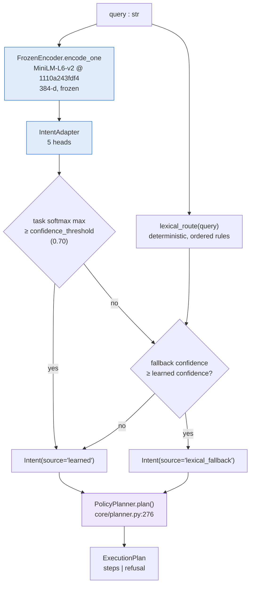

# 04 — The Router

**Parent:** [Architecture hub](README.md) · **Sibling chapters:**
[01 System overview](01-system-overview.md) · [03 Request lifecycle](03-request-lifecycle.md) ·
[05 Specialists](05-specialists.md) · [06 Evidence and confidence](06-evidence-and-confidence.md) ·
[07 Configuration freeze](07-configuration-freeze.md)

**Primary sources read for this chapter (all under `C:/Users/anish/satquery-ai/` unless stated):**

| Source | Lines | What it establishes here |
|---|---|---|
| `router/encoder.py` | 190 | `FrozenEncoder`, `VERIFIED_TOKENIZER_MAX_LENGTH = 256`, `VERIFIED_EMBEDDING_DIM = 384`, the `max_length ≤ 256` refusal, `build_encoder`, the frozen-revision contract probe |
| `router/adapter.py` | 174 | `IntentAdapter` — all seven sub-modules, `AdapterOutput`, `_init_weights`, the forward shape guards, `config_dict` / `from_config_dict` / `num_parameters` |
| `router/label_space.py` | 129 | `TASK_CLASSES`, `MODALITY_CLASSES`, `BINARY_HEADS`, `TEMPORAL_TASKS`, `DUAL_MODALITY_TASKS`, `SPATIAL_TASKS`, `default_attributes`, `default_modality` |
| `router/fallback.py` | 333 | the seven term tables, the eight ordered rules, every rule confidence, `self_check()`'s ten curated cases, `is_available()` |
| `router/classifier.py` | 475 | `IntentRouter`, `confidence_threshold = 0.70`, `_predict_learned` and the coherence repair, `route()`'s three-step order, `RouterPrediction.to_trace()`, `save_adapter` / `load_adapter` |
| `router/dataset.py` | 707 | `RouterExample`, `CURATED` (70 entries), `TEMPLATES` (45 entries), `SUBJECTS`, `HARD_NEGATIVE_PREFIX`, `RouterCorpus.validate/dedupe`, `split_by_group`, `split_leakage_report` |
| `router/train.py` | 753 | `train_router`, `SplitMetrics`, `TrainingResult.gate2_passed`, `embed_corpus_cached`, class weights, loss composition, `_stub_embeddings` |
| `artifacts/router/router_adapter_v001/metadata.json` | 626 | the shipped adapter artifact: 51,725 params, corpus 576 / 54 groups, all three split metric blocks, the full 60-epoch history |
| `artifacts/router/threshold_sweep_val.json` | 50 rows | the release-level threshold sweep: val only, `n_test_examples_scored: 0`, `test_split_touched: false`, shipped threshold 0.70, selected 0.76 |
| `core/planner.py` | 662 | `PolicyPlanner` — `LEXICAL_FALLBACK_DISCOUNT = 0.75`, `SETTLED_CONFIDENCE = 0.60`, `TASK_CAPABILITY`, `CAPABILITY_ASSETS`, `PlanStep` / `PlanRefusal` / `ExecutionPlan`, the closed refusal list, the §3.5 widening rules |
| `core/schemas.py` | 462 | `Task` (7 members), `Modality` (4), `Intent` + its `_consistency` validator |
| `configs/base.yaml` §`router` | — | every configured value: model, revision, `max_length: 128`, `embedding_dim: 384`, `hidden_dim: 128`, `dropout: 0.10`, `confidence_threshold: 0.70`, `num_tasks: 6`, and the six training keys |
| `frontend/assets/js/mission.js` | 1–300 | `interpret()` (line 70) and `chooseTask()` (line 184) — the two-stage frontend router, with the four defect-fix comments verbatim |
| `docs/PHASE4_ROUTER_REPORT.md` | 179 | the phase record: Gate 2 PASS, F4-1/F4-2/F4-3, four defects found by running, the standing caveats |
| `release/repo/docs/RESEARCH_NOTES.md` §3, §6 | — | the router-defect case study, the live-pass table, the two run ids, and the `interpret()`/`chooseTask()` asymmetry ruling |
| `release/repo/README.md` §"Routing and the execution trace", §"Known limitations" rows 2 and 8 | — | the two-stage description, the five-head table, the confidence-gate diagram, the router residuals |

---

## 1. Where the router sits, and the verb it owns

`docs/ARCHITECTURE_FREEZE.md` §5 assigns each layer exactly one verb:

> Router *understands*; policy engine *decides*; specialists *compute*; VLM *explains*;
> **evidence engine *proves*.**

The router is the first verb. It takes a **string** and produces a **typed reading of what the
string is asking for** — nothing more. It does not choose what runs, it does not touch pixels, and
it does not answer anything. `core/schemas.py:95` states the contract in the model's own docstring:

```python
class Intent(BaseModel):
    """Output of the learned router. Advisory only — the controller decides."""
```

That single line is load-bearing for the whole chapter. Everything downstream of the router is
allowed — required — to overrule it. `core/planner.py:13-15` restates it as the planner's reason to
exist:

> **The planner is the only component permitted to choose what runs. Its input is a
> `RouterPrediction`; its output is an `ExecutionPlan`.** […] The router's `Intent` is an *input to
> a decision*, never the decision.

### 1.1 The router is one of two stages, and the split is deliberate

Routing happens twice in this system, in two languages, with two different jobs. This is the single
most misread part of the architecture, so it is stated first.

| Stage | Where | Blind to asset count? | Job |
|---|---|---|---|
| **Reading** — `interpret()` | `frontend/assets/js/mission.js:70` | **yes** — text only | what does the question *mean*? |
| **Dispatch** — `chooseTask()` | `frontend/assets/js/mission.js:184` | **no** — reads `assetCount` | what can actually be *computed* with the assets present? |
| **Reading** — `IntentRouter.route()` | `router/classifier.py:311` | **yes** | the server-side analogue: query → `Intent` |
| **Dispatch** — `PolicyPlanner.plan()` | `core/planner.py:276` | **no** — reads `len(request.assets)` | the server-side analogue: `Intent` → `ExecutionPlan` |

The frontend pair and the server pair are structurally the same shape and were written
independently. §35–§38 covers the frontend pair in full; §39–§43 covers the server pair.

### 1.2 The pipeline



The encoder and adapter are the **learned** path. `lexical_route` is the **fallback** path. Both
always run when both are available; §23 explains exactly how `route()` arbitrates between them.

### 1.3 Status of every component in this chapter

Statuses follow `DOCS_STYLE_GUIDE.md` §2. Nothing below is upgraded.

| Component | Status | Basis |
|---|---|---|
| `FrozenEncoder` — load, freeze, guard `max_length ≤ 256` | `IMPLEMENTED` + `VERIFIED` | `router/encoder.py`; the contract probe in the module docstring (2026-09-16, sentence-transformers 6.0.1) |
| MiniLM revision pin `1110a243fdf4` | `VERIFIED` reachable | `router/encoder.py:7`; recorded again in the shipped `metadata.json` |
| `IntentAdapter` — 5 heads, 51,725 params | `IMPLEMENTED` + `MEASURED` | `router/adapter.py`; `metadata.json` `adapter.num_parameters: 51725` |
| Adapter trained on the shipped corpus | `MEASURED` | `metadata.json` — 60 epochs, 4.92 s, `artifacts/router/router_adapter_v001` |
| Gate 2 (task accuracy ≥ 0.95, all 6 classes measured) on the **training-time test split** | `MEASURED` — reported PASS at 0.975, n=80 | `metadata.json.metrics.test`; `docs/PHASE4_ROUTER_REPORT.md` |
| Release-level **threshold sweep** | `MEASURED` — **val only**, `n_test_examples_scored: 0` | `artifacts/router/threshold_sweep_val.json` |
| Router **test split touched by the release evaluation** | **`NOT RUN`** | `threshold_sweep_val.json` → `test_split_touched: false`; `README.md` limitation 2 |
| Lexical fallback — all eight rules | `IMPLEMENTED` + `VERIFIED` | `router/fallback.py`; `self_check()` ten cases |
| Fallback agrees with the learned router on the curated hard negatives | `VERIFIED` — 0.800 hard-negative accuracy on test | `metadata.json.metrics.test.hard_negative_accuracy: 0.8` |
| `IntentRouter.route()` two-path arbitration | `IMPLEMENTED` + `VERIFIED` | `router/classifier.py:311-339` |
| `PolicyPlanner` — pure, no torch, no filesystem | `IMPLEMENTED` | `core/planner.py`; the `TYPE_CHECKING`-only import of `RouterPrediction` |
| Frontend `interpret()` / `chooseTask()` two-stage split | `IMPLEMENTED` + `VERIFIED` live | `frontend/assets/js/mission.js`; 3 passes × 8 cases, 24 runs |
| Router-defect fix (`built`, `\barea\b`, `new`, `chang` stem) | `RESOLVED` — deployed and verified live | `docs/RESEARCH_NOTES.md` §3.3; run ids `run_467ffa406f22`, `run_46980ba55c62` |
| Router calibration | **`NOT RUN`** — the 0.70 threshold is uncalibrated by the phase's own admission | `docs/PHASE4_ROUTER_REPORT.md` §"Standing caveats" |
| Router **accuracy** as a benchmark claim | **`NOT RUN`** — the corpus is synthetic (576 examples / 54 groups) | `docs/PHASE4_ROUTER_REPORT.md`; `threshold_sweep_val.json` → `corpus_limited: true` |
| Router **lexical residuals** (`"What is the new runway?"`, `"How much built-up area was added?"`) | **`OPEN`** | `README.md` limitation 8 |

### 1.4 The three vocabularies, and why there are three

A reader who compares `router/label_space.py` to `core/schemas.py` to `GET /api/capabilities` finds
three different sets of task names. That is not drift. `README.md:136-151` documents it as
deliberate, and it is worth restating because every later chapter depends on it.

| Vocabulary | Where | Members | Count |
|---|---|---|---|
| `core.schemas.Task` | `core/schemas.py:35-47` | `vqa`, `caption`, `grounding`, `change`, `optical_sar`, `change_vqa`, `unsupported` | **7** |
| `router.label_space.TASK_CLASSES` | `router/label_space.py:26-33` | `vqa`, `caption`, `grounding`, `change`, `optical_sar`, `unsupported` | **6** |
| `GET /api/capabilities` | live capability contract | `vqa`, `caption`, `grounding`, `change`, `change_vqa`, `optical_sar` | **6** |

The differences are each a design decision:

- **`unsupported` is in `Task` and in `TASK_CLASSES` but not in the capability list.** `unsupported`
  is a **routing outcome** — "this is not a satellite-imagery question" — not a servable capability.
  `core/planner.py:120` says so in a comment on `TASK_CAPABILITY`: *"`UNSUPPORTED` is deliberately
  absent — it is a refusal, not a capability."*
- **`change_vqa` is in `Task` and in the capability list but not in `TASK_CLASSES`.** It is reached
  through the change *family* rather than being a separate router class: the router has no
  `change_vqa` head output, and `core/planner.py:470-491` widens a `change` + `language_output`
  prediction into a `change_vqa` step. `core/schemas.py:41-46` explains why the three are not
  interchangeable:

  ```python
  #: R-02. Two temporally corresponding assets plus a change-oriented question
  #: in, a short answer out. Distinct from CHANGE, which is the change
  #: *detector* and returns a spatial change map with no language output, and
  #: distinct from VQA, which answers about ONE asset. The three are not
  #: interchangeable and the planner must not substitute one for another.
  CHANGE_VQA = "change_vqa"
  ```

- **The reconciliation happens in one place.** Because `AnalysisRequest` is `extra="forbid"` and
  `force_task` is typed `Task | None` (`core/schemas.py:412-418`), any string outside the `Task`
  enum is a 422. The frontend therefore maps the router's reading to the server enum through a
  single table, `ROUTER_TASK_TO_SERVER` (`frontend/assets/js/mission.js:148-155`).

`router/classifier.py` guards the router-side alignment at import time, so a label added to
`label_space.py` without a schema mapping cannot ship silently:

```python
def _assert_schema_alignment() -> None:
    missing_tasks = [t for t in TASK_CLASSES if t not in _TASK_TO_SCHEMA]
    if missing_tasks:
        raise RoutingError(
            f"label_space TASK_CLASSES contains labels with no schema mapping: "
            f"{missing_tasks}"
        )
    missing_mods = [m for m in MODALITY_CLASSES if m not in _MODALITY_TO_SCHEMA]
    ...

_assert_schema_alignment()
```

(`router/classifier.py:62-77`.) The guard runs at **module import**, not at first call, so the
failure is a startup failure rather than a per-request one.

---

# Part A — The frozen encoder

## 2. `FrozenEncoder` — the contract, probed not assumed

`router/encoder.py` opens with the verified contract, and the phrase *verified* is literal: these
were probed, not read from documentation.

```
Verified contract (Phase 4 probe, 2026-09-16, sentence-transformers 6.0.1):

    SentenceTransformer(
        model_name_or_path='sentence-transformers/all-MiniLM-L6-v2',
        revision='1110a243fdf4',      # pinned, verified reachable
        device='cpu',
    )
    .get_sentence_embedding_dimension()  -> 384
    .tokenizer.model_max_length          -> 256     (finding F4-1)
    .max_seq_length                      -> 256
    params                               -> 22,713,216
    encode(64 queries, CPU)              -> 0.118 s
```

(`router/encoder.py:3-14`.)

| Property | Value | Source |
|---|---|---|
| Model | `sentence-transformers/all-MiniLM-L6-v2` | `configs/base.yaml` §`router.model`; `metadata.json.encoder.model` |
| Revision | `1110a243fdf4` | `configs/base.yaml` §`router.revision`; `metadata.json.encoder.revision` |
| Embedding dimension | **384** | probe; `VERIFIED_EMBEDDING_DIM = 384` |
| Tokenizer ceiling | **256** | probe; `VERIFIED_TOKENIZER_MAX_LENGTH = 256` |
| Configured `max_length` | **128** | `configs/base.yaml` §`router.max_length`; `metadata.json.encoder.max_length` |
| Parameters | **22,713,216** | probe; `metadata.json.encoder.parameters` |
| Approximate on-disk size | 90.9 MB | `configs/base.yaml` comment on the revision pin |
| Throughput | 0.118 s for 64 queries, CPU | probe |
| Device | `cpu` (config default `auto` → `config.device_preference`) | `router/encoder.py:168-182` |

### 2.1 The two module constants

```python
#: The tokenizer's own ceiling, verified by probe. Truncating above this is a
#: silent no-op, so the encoder refuses rather than pretending.
VERIFIED_TOKENIZER_MAX_LENGTH = 256

#: Verified embedding dimension for all-MiniLM-L6-v2.
VERIFIED_EMBEDDING_DIM = 384
```

(`router/encoder.py:30-35`.)

## 3. Finding F4-1 — `max_length` 128 is not the model's limit

This is the most-quoted finding in the router, and it is worth stating precisely, because the
distinction between *the model's ceiling* and *our truncation* is exactly the kind of thing that
silently rots.

**What the config said.** `max_length: 128`.

**What the probe found.** The MiniLM tokenizer's own ceiling is **256**
(`tokenizer.model_max_length → 256`, `max_seq_length → 256`).

**Why 128 and not 256.** The truncation is deliberate and sits *well inside* the ceiling. The
configured rationale, verbatim from `configs/base.yaml`:

```yaml
  # Finding F4-1: the MiniLM tokenizer's own ceiling is 256 (verified by probe).
  # 128 is a deliberate truncation well inside that ceiling, not the model
  # limit. Satellite queries are short; halving the sequence halves attention
  # cost for no measurable accuracy loss. The encoder asserts this value is
  # <= 256, because truncating above the ceiling is a silent no-op.
  max_length: 128
```

**Why the encoder must *refuse* rather than merely document.** Truncating above the tokenizer's
ceiling is a **silent no-op** — the tokenizer will not truncate past what it can encode, so a
`max_length` of 512 would appear to be honoured while doing nothing at all. That is a control that
looks like it works and does not. `FrozenEncoder.__init__` therefore raises:

```python
if max_length < 1:
    raise ModelLoadError(f"max_length must be >= 1, got {max_length}")
if max_length > VERIFIED_TOKENIZER_MAX_LENGTH:
    raise ModelLoadError(
        f"max_length={max_length} exceeds the MiniLM tokenizer ceiling of "
        f"{VERIFIED_TOKENIZER_MAX_LENGTH}; truncation would be a silent no-op"
    )
```

(`router/encoder.py:54-60`.)

**The subtlety most readers miss.** The configured value is not merely validated — it is *applied*.
Setting `max_seq_length` rewrites the tokenizer's truncation limit, so the config value is enforced
rather than documented:

```python
# Apply the configured truncation for real (finding F4-1). Setting
# max_seq_length rewrites the tokenizer's truncation limit, so the
# config value is enforced rather than merely documented.
self._model.max_seq_length = max_length
```

(`router/encoder.py:96-99`.)

There is then a second, quieter guard: some tokenizers report a **sentinel** for "no limit"
(a very large integer). The class normalises that sentinel back to the verified ceiling so
`tokenizer_max_length` never reports a nonsense number:

```python
tokenizer_limit = int(getattr(self._model.tokenizer, "model_max_length", 0))
if tokenizer_limit and tokenizer_limit > 10**6:
    # Some tokenizers report a sentinel for "no limit".
    tokenizer_limit = VERIFIED_TOKENIZER_MAX_LENGTH
self._tokenizer_max_length = tokenizer_limit
```

(`router/encoder.py:101-105`.)

**Status.** `MEASURED` — the probe is recorded with its date (2026-09-16) and its
sentence-transformers version (6.0.1) in the module docstring. The **assertion** is `IMPLEMENTED`
and its refusal path is covered by the routing test suite
(`tests/routing/test_router.py`, 82 tests, per `docs/PHASE4_ROUTER_REPORT.md` §Files).

## 4. The freeze — the whole architectural premise

The encoder is not fine-tuned. It is loaded, put in eval mode, and every parameter's gradient is
switched off:

```python
# Freeze. This is the whole architectural premise.
self._model.eval()
for param in self._model.parameters():
    param.requires_grad_(False)
```

(`router/encoder.py:91-94`.)

The class docstring states what this buys:

> Deliberately narrow: it encodes text and reports its dimensions. It does not train, does not
> expose the underlying model, and does not permit gradient flow. Everything downstream treats it
> as a pure function.

(`router/encoder.py:40-43`.)

Because the encoder is frozen, **embeddings are a pure function of the query text**. That single
fact is what makes finding F4-2 possible (§8).

### 4.1 `encode()` — the inference surface

```python
def encode(
    self,
    texts: Sequence[str],
    batch_size: int = 64,
    normalize: bool = True,
) -> np.ndarray:
    """Encode texts to a (n, embedding_dim) float32 array.

    The returned array is detached: it carries no autograd history. That is
    intentional — the adapter consumes it as a fixed input feature.
    """
    if not texts:
        return np.zeros((0, self.embedding_dim), dtype=np.float32)

    cleaned = [t if isinstance(t, str) else str(t) for t in texts]
    try:
        embeddings = self._model.encode(
            cleaned,
            batch_size=batch_size,
            show_progress_bar=False,
            convert_to_numpy=True,
            normalize_embeddings=normalize,
        )
    except Exception as exc:  # noqa: BLE001
        raise ModelLoadError(
            f"encoder inference failed: {exc}", specialist="router"
        ) from exc

    return np.asarray(embeddings, dtype=np.float32)
```

(`router/encoder.py:127-155`.) Four details are worth naming:

1. **Empty input returns an empty array of the right shape**, not an error —
   `np.zeros((0, 384))`. A caller batching over a filtered list does not need a special case.
2. **Non-string inputs are coerced** rather than rejected (`str(t)`). The corpus is
   `RouterExample` objects, and `RouterCorpus.texts()` already yields strings; the coercion is a
   boundary guard.
3. **`normalize_embeddings=normalize`** — the default is `True`, so the vectors are unit-length.
   Nothing downstream re-normalises.
4. **`show_progress_bar=False`** is pinned, so training output is not polluted by a progress bar
   on every cache miss.

`encode_one` is the single-query convenience wrapper:

```python
def encode_one(self, text: str, normalize: bool = True) -> np.ndarray:
    return self.encode([text], batch_size=1, normalize=normalize)[0]
```

(`router/encoder.py:157-158`.) This is what `IntentRouter._predict_learned` calls.

### 4.2 The four read-only properties

| Property | Returns | Backing |
|---|---|---|
| `embedding_dim` | `int` | `self._model.get_sentence_embedding_dimension()` — **asked of the model**, not read from config |
| `tokenizer_max_length` | `int` | the normalised sentinel-aware value (§3) |
| `load_seconds` | `float \| None` | wall time of the `SentenceTransformer(...)` construction |
| `num_parameters` | `int` | `sum(p.numel() for p in self._model.parameters())` |

The `embedding_dim` property deliberately queries the model rather than trusting
`router.embedding_dim` from the config. `IntentRouter.from_config` then **compares the two**:

```python
encoder = build_encoder(config, device=device)
if adapter is not None and adapter.input_dim != encoder.embedding_dim:
    raise ModelLoadError(
        f"adapter input_dim={adapter.input_dim} but the loaded encoder "
        f"produces {encoder.embedding_dim}-d embeddings",
        specialist="router",
    )
```

(`router/classifier.py:179-185`.) A config that says 384 while the loaded encoder emits something
else fails loudly at construction rather than producing garbage at inference.

### 4.3 `build_encoder()` — config-driven construction with a device fallback

```python
def build_encoder(config, device: str | None = None) -> FrozenEncoder:
    """Construct the encoder from the central configuration registry."""
    if device is None:
        configured = config.get("router.device", "auto")
        if configured == "auto":
            device = config.device_preference
        else:
            device = configured

    return FrozenEncoder(
        model_name=config.require("router.model"),
        revision=config.require("router.revision"),
        max_length=int(config.get("router.max_length", 128)),
        device=device,
    )
```

(`router/encoder.py:168-182`.)

Three points:

- **`model` and `revision` use `config.require`, not `config.get`.** A missing model name or
  revision is a hard failure — the pin is not optional.
- **`max_length` defaults to 128** if the key is absent, so the encoder degrades to the configured
  behaviour rather than to the ceiling.
- **`device: auto` resolves through `config.device_preference`.** This is how a CPU-only Space and a
  GPU host share one config file. `configs/base.yaml` sets `router.device: auto`.

## 5. Finding F4-2 — the router needs no GPU

The finding, stated by the training module itself:

> The encoder is FROZEN. Embeddings are therefore a pure function of the query text. So we embed
> the whole corpus ONCE (measured: 0.118 s / 64 queries on CPU), cache the vectors to disk, and
> train the 50,822-parameter adapter on the cached matrix (measured: 20 epochs / 4,096 vectors in
> 0.28 s).
>
> Router training needs NO GPU. The plan's Kaggle budget ("Router | CPU/T4 | <1 h") is roughly
> three orders of magnitude pessimistic. Phase 4 runs and completes locally.

(`router/train.py:3-12`.)

`docs/PHASE4_ROUTER_REPORT.md` §F4-2 repeats it with the same numbers and adds the outcome:
**"The plan's budget — 'Router | CPU/T4 | <1 h' — was roughly three orders of magnitude
pessimistic. Phase 4 ran to completion locally at zero quota cost."**

**Measured evidence for the claim, and its limits.**

| Quantity | Value | Source | Status |
|---|---|---|---|
| Encoder throughput | 0.118 s / 64 queries, CPU | probe, `router/encoder.py:14` | `MEASURED` |
| Adapter training | 20 epochs / 4,096 vectors in 0.28 s | probe, `router/encoder.py:22-23` | `MEASURED` |
| **Full 60-epoch run, 576-example corpus** | **4.92 s total** | `metadata.json.duration_seconds: 4.92` | `MEASURED` |
| GPU used | **none** | `threshold_sweep_val.json.environment.cuda_available: false` | `MEASURED` |

The 0.28 s / 20 epochs figure is the **probe**, on a synthetic 4,096 × 384 matrix. The **real** run
is the 4.92 s in the shipped artifact — a different and larger quantity (60 epochs, cache
fingerprint computation, three split evaluations, artifact write). Both are true; they are not the
same measurement, and this document does not merge them.

**Caveat, stated because the docstring itself states it.** The `router/train.py` docstring says
"the 50,822-parameter adapter". The shipped artifact records **51,725**. §8 resolves this by
arithmetic; it is a documentation discrepancy in a comment, not a second model.

---

# Part B — The five-head adapter

## 6. `IntentAdapter` — the only trainable part of the router

`router/adapter.py` opens with the architecture as an ASCII diagram, which is the clearest
statement of the shape anywhere in the repository:

```
embedding (384)
    |
LayerNorm
    |
Linear(384 -> hidden_dim)      default hidden_dim = 128
    |
GELU
    |
Dropout
    |
    +--> task_head            Linear(hidden, 6)
    +--> modality_head        Linear(hidden, 4)
    +--> temporal_head        Linear(hidden, 1)   logit
    +--> spatial_head         Linear(hidden, 1)   logit
    +--> language_head        Linear(hidden, 1)   logit
```

(`router/adapter.py:5-20`.)

Read that diagram carefully: **there is exactly one shared trunk, and the five heads all read from
it.** The heads are independent of one another — no head consumes another head's output. That
independence is what makes the coherence-repair logic in §21 necessary.

### 6.1 The constructor, in full

```python
def __init__(
    self,
    input_dim: int = 384,
    hidden_dim: int = 128,
    dropout: float = 0.1,
    num_tasks: int = NUM_TASKS,
    num_modalities: int = NUM_MODALITIES,
) -> None:
    super().__init__()

    if input_dim < 1 or hidden_dim < 1:
        raise ValueError(
            f"input_dim and hidden_dim must be positive, got {input_dim}, {hidden_dim}"
        )
    if not 0.0 <= dropout < 1.0:
        raise ValueError(f"dropout must be in [0, 1), got {dropout}")

    self.input_dim = input_dim
    self.hidden_dim = hidden_dim
    self.dropout_p = dropout
    self.num_tasks = num_tasks
    self.num_modalities = num_modalities

    self.input_norm = nn.LayerNorm(input_dim)
    self.trunk = nn.Sequential(
        nn.Linear(input_dim, hidden_dim),
        nn.GELU(),
        nn.Dropout(dropout),
    )

    self.task_head = nn.Linear(hidden_dim, num_tasks)
    self.modality_head = nn.Linear(hidden_dim, num_modalities)

    # One logit per binary head. P(yes) = sigmoid(logit).
    self.temporal_head = nn.Linear(hidden_dim, 1)
    self.spatial_head = nn.Linear(hidden_dim, 1)
    self.language_head = nn.Linear(hidden_dim, 1)

    self._init_weights()
```

(`router/adapter.py:64-102`.)

**Every sub-module, exhaustively.**

| Attribute | Type | Shape / config | Role |
|---|---|---|---|
| `input_norm` | `nn.LayerNorm` | normalised shape `(input_dim,)` = `(384,)` | normalises the frozen embedding before the trunk |
| `trunk` | `nn.Sequential` | `Linear(384→128) → GELU → Dropout(0.1)` | the single shared representation |
| `task_head` | `nn.Linear` | `(128 → 6)` | softmax over `TASK_CLASSES` |
| `modality_head` | `nn.Linear` | `(128 → 4)` | softmax over `MODALITY_CLASSES` |
| `temporal_head` | `nn.Linear` | `(128 → 1)` | one logit; `P(yes) = sigmoid(logit)` |
| `spatial_head` | `nn.Linear` | `(128 → 1)` | one logit |
| `language_head` | `nn.Linear` | `(128 → 1)` | one logit |

`dropout_p` is stored under that name rather than `dropout` so it does not shadow the
`nn.Dropout` module convention; it is what `config_dict()` serialises.

**Two validation guards, both at construction.** `input_dim` and `hidden_dim` must be positive;
`dropout` must be in `[0, 1)` — note the half-open interval, so `dropout=1.0` (which would zero
the trunk entirely) is rejected.

### 6.2 `AdapterOutput` — raw logits, no activation

```python
@dataclass
class AdapterOutput:
    """Raw logits from all five heads. No softmax applied here."""

    task_logits: torch.Tensor        # (B, NUM_TASKS)
    modality_logits: torch.Tensor    # (B, NUM_MODALITIES)
    temporal_logit: torch.Tensor     # (B,)
    spatial_logit: torch.Tensor      # (B,)
    language_logit: torch.Tensor     # (B,)

    def binary_logit(self, head: str) -> torch.Tensor:
        if head == "temporal":
            return self.temporal_logit
        if head == "spatial_output":
            return self.spatial_logit
        if head == "language_output":
            return self.language_logit
        raise KeyError(f"unknown binary head: {head!r}")
```

(`router/adapter.py:41-58`.)

Three design facts:

1. **The two multi-class heads return `(B, C)` logits; the three binary heads return `(B,)`.** The
   `squeeze(-1)` in `forward` is what removes the trailing unit dimension. This matters for loss
   wiring: `BCEWithLogitsLoss` wants `(B,)` targets, and `nn.CrossEntropyLoss` wants `(B, C)`
   logits with `(B,)` integer targets.
2. **No activation is applied.** `softmax` and `sigmoid` are applied by the consumer — the loss
   during training, and `_predict_learned` at inference. This keeps the numerically-stable
   `*_with_logits` losses usable.
3. **`binary_logit(head)` keys on the label-space names** — `"temporal"`, `"spatial_output"`,
   `"language_output"` — which are exactly the members of `BINARY_HEADS`
   (`router/label_space.py:63`). `evaluate_split` and the training loop both iterate
   `for head in BINARY_HEADS` and call this method, so the attribute names `spatial_logit` and the
   key `"spatial_output"` are reconciled in one place instead of at every call site.

### 6.3 Weight initialisation — and why it is not the default

```python
def _init_weights(self) -> None:
    """Small-std init on the heads keeps the initial sigmoid near 0.5.

    Without this the binary heads can start saturated, and BCE gradients
    vanish before the task head has learned anything useful.
    """
    for module in (self.task_head, self.modality_head,
                   self.temporal_head, self.spatial_head, self.language_head):
        nn.init.normal_(module.weight, std=0.02)
        nn.init.zeros_(module.bias)
```

(`router/adapter.py:104-113`.)

This is a deliberately non-default initialisation, and the reason is a real failure mode:
a single-logit binary head whose weights start large can produce a saturated sigmoid on the first
forward pass, and a saturated sigmoid has a vanishing BCE gradient. The task head would then be
learning against a trunk that is receiving almost no signal from half its objectives.

Note precisely **what** is re-initialised: the **five heads only**. `input_norm` and `trunk` keep
PyTorch's defaults. The init is applied to `weight` (normal, σ = 0.02) and `bias` (zeros).

**Cross-reference.** `router/adapter.py:22-23` records the probe cost as "50,822 parameters".
The arithmetic in §8 gives 51,725. The `std=0.02` figure in this chapter is read from
`router/adapter.py:112`; it is **not** the same as the `20.0` objectness weight in the grounding
head (`specialists/grounding/head.py`), which is a different subsystem and a different quantity.

### 6.4 `forward()` — and its two shape guards

```python
def forward(self, embeddings: torch.Tensor) -> AdapterOutput:
    """Args:
        embeddings: (B, input_dim) float tensor. Must already be detached
            from the frozen encoder — the adapter does not back-propagate
            into MiniLM.
    """
    if embeddings.dim() != 2:
        raise ValueError(
            f"expected a 2-D (batch, dim) tensor, got shape {tuple(embeddings.shape)}"
        )
    if embeddings.shape[1] != self.input_dim:
        raise ValueError(
            f"expected input_dim={self.input_dim}, got {embeddings.shape[1]}"
        )

    hidden = self.trunk(self.input_norm(embeddings))

    return AdapterOutput(
        task_logits=self.task_head(hidden),
        modality_logits=self.modality_head(hidden),
        temporal_logit=self.temporal_head(hidden).squeeze(-1),
        spatial_logit=self.spatial_head(hidden).squeeze(-1),
        language_logit=self.language_head(hidden).squeeze(-1),
    )
```

(`router/adapter.py:117-140`.)

**The two guards are not decoration.** A 1-D tensor would silently broadcast through the
`Linear` layers and produce a plausible-looking but wrong output; a mismatched feature width
would produce a `RuntimeError` deep inside `nn.Linear` with a shape trace that does not name the
cause. Both are caught here with a message that names the actual and expected dims.

**The order of operations is fixed: normalise, then trunk.** `self.trunk(self.input_norm(...))` —
LayerNorm is applied to the frozen embedding, *then* the linear projection. Reversing them would
normalise the hidden layer instead, which is a different model.

### 6.5 Serialisation — the adapter carries its own architecture

```python
def config_dict(self) -> dict[str, Any]:
    return {
        "input_dim": self.input_dim,
        "hidden_dim": self.hidden_dim,
        "dropout": self.dropout_p,
        "num_tasks": self.num_tasks,
        "num_modalities": self.num_modalities,
        "binary_heads": list(BINARY_HEADS),
    }

@classmethod
def from_config_dict(cls, payload: dict[str, Any]) -> "IntentAdapter":
    return cls(
        input_dim=int(payload["input_dim"]),
        hidden_dim=int(payload["hidden_dim"]),
        dropout=float(payload["dropout"]),
        num_tasks=int(payload["num_tasks"]),
        num_modalities=int(payload["num_modalities"]),
    )

def num_parameters(self) -> int:
    return sum(p.numel() for p in self.parameters())
```

(`router/adapter.py:144-165`.)

`config_dict()` is written **into the checkpoint** by `save_adapter`, and `from_config_dict()` is
what makes `load_adapter` able to reconstruct the architecture without being told it. The
checkpoint format is:

```python
torch.save(
    {
        "state_dict": adapter.state_dict(),
        "config": adapter.config_dict(),
    },
    path / ADAPTER_WEIGHTS,
)
```

(`router/classifier.py:362-368`.) `load_adapter` then **refuses** a checkpoint with no embedded
config, rather than guessing:

```python
config = payload.get("config")
if not config:
    raise ModelLoadError(
        "adapter checkpoint has no embedded config; it cannot be reconstructed "
        "without guessing the architecture",
        specialist="router",
    )
```

(`router/classifier.py:438-444`.) And it loads with `strict=True`, so a state dict that does not
match the reconstructed architecture is an error, not a partial load:

```python
adapter = IntentAdapter.from_config_dict(config)
try:
    adapter.load_state_dict(payload["state_dict"], strict=True)
except Exception as exc:  # noqa: BLE001
    raise ModelLoadError(
        f"adapter state_dict does not match the reconstructed architecture: {exc}",
        specialist="router",
    ) from exc
```

(`router/classifier.py:446-453`.)

**The `binary_heads` key asymmetry.** `config_dict()` *emits* `"binary_heads"`, but
`from_config_dict()` does **not** read it. That is intentional and correct: the binary heads are
three fixed `Linear(128, 1)` layers, so their names are not a reconstructable parameter — they are
a label-space invariant. The key is written for **auditability** (a reader of `metadata.json` can
see which binary heads the artifact was built for) rather than for reconstruction. The shipped
`metadata.json` records it twice, under both `adapter` and `adapter_config`:

```json
"binary_heads": ["temporal", "spatial_output", "language_output"],
"dropout": 0.1,
"hidden_dim": 128,
"input_dim": 384,
"num_modalities": 4,
"num_parameters": 51725,
"num_tasks": 6
```

## 7. The label space, exhaustively

`router/label_space.py` is the single source of truth for the router's output ontology. Its
docstring states why it is a module rather than a set of constants duplicated per file:

> Single source of truth for the router's output ontology. Both the dataset generator and the
> training script import from here, so a class added in one place cannot silently desynchronise
> the other.

(`router/label_space.py:1-6`.)

### 7.1 The task head — six classes, in index order

```python
TASK_CLASSES: tuple[str, ...] = (
    "vqa",
    "caption",
    "grounding",
    "change",
    "optical_sar",
    "unsupported",
)
TASK_TO_INDEX: dict[str, int] = {name: i for i, name in enumerate(TASK_CLASSES)}
NUM_TASKS: int = len(TASK_CLASSES)
```

(`router/label_space.py:26-35`.)

**The tuple order is the index order.** `TASK_TO_INDEX` is derived from the tuple by `enumerate`,
and `train.py` uses `TASK_TO_INDEX[e.task]` to build targets while `evaluate_split` uses
`TASK_CLASSES[i]` to name predictions. Reordering the tuple would silently re-map every label —
which is why the tuple is defined once and everything else is derived.

| Index | Label | Means | Configured in `base.yaml`? |
|---|---|---|---|
| 0 | `vqa` | a free-form question about a single scene | yes, `router.tasks[0]` |
| 1 | `caption` | a description of a single scene | yes, `router.tasks[1]` |
| 2 | `grounding` | *where* — a spatial output | yes, `router.tasks[2]` |
| 3 | `change` | *what changed* between two acquisitions | yes, `router.tasks[3]` |
| 4 | `optical_sar` | joint classification from an optical + SAR pair | yes, `router.tasks[4]` |
| 5 | `unsupported` | not a satellite-imagery question | yes, `router.tasks[5]` |

The config repeats the same six in the same order under `router.tasks`
(`configs/base.yaml` §`router.tasks`), so a reader of the config sees the ontology without opening
Python.

### 7.2 The three task families

```python
#: Tasks that inherently require two acquisitions.
TEMPORAL_TASKS: frozenset[str] = frozenset({"change"})

#: Tasks that inherently require two modalities.
DUAL_MODALITY_TASKS: frozenset[str] = frozenset({"optical_sar"})

#: Tasks whose primary output is spatial rather than textual.
SPATIAL_TASKS: frozenset[str] = frozenset({"grounding"})
```

(`router/label_space.py:37-44`.)

Each is a `frozenset` with exactly one member today. They are sets rather than scalars so that
adding a second member does not require touching the consumers, and they are read by
`default_attributes` below.

### 7.3 The modality head — four classes

```python
MODALITY_CLASSES: tuple[str, ...] = (
    "optical",
    "sar",
    "optical_sar",
    "unknown",
)
MODALITY_TO_INDEX: dict[str, int] = {name: i for i, name in enumerate(MODALITY_CLASSES)}
NUM_MODALITIES: int = len(MODALITY_CLASSES)
```

(`router/label_space.py:50-57`.) Four classes, and `unknown` is a first-class member rather than a
sentinel — a query with no modality marker is genuinely `unknown`, not "optical by default".

### 7.4 The binary heads — three names

```python
BINARY_HEADS: tuple[str, ...] = ("temporal", "spatial_output", "language_output")
NUM_BINARY_HEADS: int = len(BINARY_HEADS)
```

(`router/label_space.py:63-64`.) The docstring explains the single-logit choice:

> `task` and `modality` use softmax cross-entropy. The three binary heads use a single logit with
> `BCEWithLogitsLoss` — a 2-way softmax would waste a parameter and make the loss harder to
> weight.

(`router/label_space.py:15-17`.) `README.md:478-479` repeats the reasoning.

**The names are not the same as the head attributes.** `BINARY_HEADS` uses `spatial_output` and
`language_output`; the module attributes are `spatial_head` and `language_head`. `AdapterOutput.
binary_logit()` (§6.2) is the one place that reconciles them.

### 7.5 The two helper functions

```python
def default_attributes(task: str) -> dict[str, bool]:
    """Per-task attribute defaults, used to sanity-check generated examples.

    These are *defaults*, not invariants: `change` with `spatial_output=False`
    is a perfectly legal request ("what changed?"). They exist so the dataset
    generator and the fallback agree on what a task usually implies.
    """
    return {
        "temporal": task in TEMPORAL_TASKS,
        "spatial_output": task in SPATIAL_TASKS,
        "language_output": task != "unsupported",
    }

def default_modality(task: str) -> str:
    if task in DUAL_MODALITY_TASKS:
        return "optical_sar"
    if task == "unsupported":
        return "unknown"
    return "unknown"
```

(`router/label_space.py:89-108`.)

Note `default_modality`'s **third branch is redundant**: `task == "unsupported"` already returns
`"unknown"`, and the final `return "unknown"` covers it. The function is equivalent to
`"optical_sar" if task in DUAL_MODALITY_TASKS else "unknown"`. This is a cosmetic redundancy, not a
defect — the two branches produce the same value — and it is recorded here only because a reader
diffing the branches will notice it.

Also note the docstring's own warning: these are **defaults, not invariants**. `default_attributes`
is *not* what `RouterCorpus.validate()` enforces; the validator enforces a stricter and different
set (§11.2).

### 7.6 The module's remaining surface

`task_index(name)`, `modality_index(name)`, `is_valid_task(name)` and `is_valid_modality(name)` are
thin lookups. `task_index` and `modality_index` **raise `KeyError`** on an unknown label, whereas
`is_valid_*` return a bool. `router/fallback.py` uses the `is_valid_*` pair inside `self_check()` to
assert that no rule ever emits a label outside the space.

## 8. Parameter accounting — 51,725, and why a comment says 50,822

The shipped artifact records `adapter.num_parameters: 51725`
(`artifacts/router/router_adapter_v001/metadata.json`), and `docs/PHASE4_ROUTER_REPORT.md:37`
agrees: "51,725 adapter params on a frozen 22,713,216-param encoder". Two other places say
**50,822**: the `router/adapter.py` module docstring (`router/adapter.py:22`) and the
`router/train.py` docstring (`router/train.py:8`), plus `configs/base.yaml`'s comment on F4-2.

The arithmetic is unambiguous, and it settles the question:

| Sub-module | Parameter count | Working |
|---|---|---|
| `input_norm` (`LayerNorm(384)`) | **768** | `384 × 2` (weight + bias) |
| `trunk[0]` (`Linear(384 → 128)`) | **49,280** | `384 × 128` weights + `128` bias |
| `task_head` (`Linear(128 → 6)`) | **774** | `128 × 6` weights + `6` bias |
| `modality_head` (`Linear(128 → 4)`) | **516** | `128 × 4` weights + `4` bias |
| `temporal_head` (`Linear(128 → 1)`) | **129** | `128` weights + `1` bias |
| `spatial_head` (`Linear(128 → 1)`) | **129** | `128` weights + `1` bias |
| `language_head` (`Linear(128 → 1)`) | **129** | `128` weights + `1` bias |
| **Total** | **51,725** | 768 + 49,280 + 774 + 516 + 129 + 129 + 129 |

The `nn.GELU()` and `nn.Dropout()` layers in the trunk contribute **zero** parameters, which is why
the trunk's total (49,280) equals its `Linear` layer alone.

**Status.** The 51,725 figure is `MEASURED` — it is what `num_parameters()` returns for the shipped
weights, and it is what the artifact records. The 50,822 figure is a **stale comment**; it is
reported here rather than quietly corrected, because the docs are public and a reader who greps
the repository will find both. The README's F4-2 paragraph still carries 50,822
(`README.md:508`). Treating this as an **`OPEN` documentation discrepancy** is the honest
description: the *code* is right, three *comments* are stale, and no behaviour depends on either
number.

## 9. The loss — three objectives, weighted

The training loss composes three terms. The docstring names them:

```
task       cross-entropy, class-weighted (classes are imbalanced)
modality   cross-entropy
binary x3  BCE-with-logits, one logit per head

Weights live in config under `router.training`.
```

(`router/train.py:22-28`.)

The implementation, verbatim from the inner loop:

```python
loss_task = ce(out.task_logits, train_tensors["task"][idx])
loss_mod = ce_mod(out.modality_logits, train_tensors["modality"][idx])

binary_targets = train_tensors["binary"][idx]
loss_bin = (
    bce(out.temporal_logit, binary_targets[:, 0])
    + bce(out.spatial_logit, binary_targets[:, 1])
    + bce(out.language_logit, binary_targets[:, 2])
) / len(BINARY_HEADS)

loss = (
    task_loss_weight * loss_task
    + modality_loss_weight * loss_mod
    + binary_loss_weight * loss_bin
)
```

(`router/train.py:606-620`.)

**Three details that matter.**

1. **The binary term is the *mean* over the three heads**, not the sum. The division by
   `len(BINARY_HEADS)` keeps the term on the same scale as the two cross-entropies, so
   `binary_loss_weight` means the same thing regardless of how many binary heads exist.
2. **The binary targets are read by column index, in `BINARY_HEADS` order.** `binary_targets[:, 0]`
   is `temporal`, `[:, 1]` is `spatial_output`, `[:, 2]` is `language_output` — the order comes from
   `_to_tensors`, which builds the matrix by iterating `BINARY_HEADS`
   (`router/train.py:301-305`). The two orders are the same tuple, so they cannot drift.
3. **Only the task cross-entropy is class-weighted.** `ce` carries `weight=class_weights`;
   `ce_mod` is an unweighted `nn.CrossEntropyLoss()` and `bce` is a plain `BCEWithLogitsLoss()`
   (`router/train.py:582-584`). The class imbalance that motivated weighting is a *task-class*
   imbalance; the modality and binary targets are not weighted.

**Gradient clipping.** Every step clips the global norm to 1.0:

```python
optimizer.zero_grad(set_to_none=True)
loss.backward()
torch.nn.utils.clip_grad_norm_(model.parameters(), max_norm=1.0)
optimizer.step()
```

(`router/train.py:622-625`.) `set_to_none=True` frees the gradient buffers rather than zeroing
them, which is both faster and stricter — a parameter that receives no gradient ends with `None`,
not a zero tensor.

**The configured weights** (`configs/base.yaml` §`router.training`; `metadata.json.hyperparameters`):

| Key | Value | Effect |
|---|---|---|
| `task_loss_weight` | `1.0` | the primary objective, full weight |
| `modality_loss_weight` | `0.3` | auxiliary; the modality label is often `unknown` |
| `binary_loss_weight` | `0.5` | auxiliary; three heads, mean-reduced |

The ordering — task 1.0 > binary 0.5 > modality 0.3 — encodes the priority: the task label is what
the controller keys off; the binary heads describe aspects of the request; the modality label is
the least informative head for this corpus.

---

# Part C — The corpus

## 10. `RouterExample` — one labelled query, with a leakage boundary

```python
@dataclass
class RouterExample:
    """One labelled query.

    `group` is the leakage boundary: all examples sharing a group must land in
    the same split. `source` distinguishes hand-written from generated material
    so the two can be reported separately.
    """

    text: str
    task: str
    modality: str = "unknown"
    temporal: bool = False
    spatial_output: bool = False
    language_output: bool = True
    group: str = ""
    source: str = "template"

    def __post_init__(self) -> None:
        if self.task not in TASK_TO_INDEX:
            raise ValueError(f"unknown task label: {self.task!r}")
        if self.modality not in MODALITY_TO_INDEX:
            raise ValueError(f"unknown modality label: {self.modality!r}")
        if not self.text.strip():
            raise ValueError("example text must not be empty")
        if not self.group:
            raise ValueError(f"example {self.text!r} has no group tag")
```

(`router/dataset.py:87-113`.)

| Field | Type | Default | Meaning | Constraint |
|---|---|---|---|---|
| `text` | `str` | — | the query as a user would type it | must be non-empty after `strip()` |
| `task` | `str` | — | one of `TASK_CLASSES` | validated against `TASK_TO_INDEX` |
| `modality` | `str` | `"unknown"` | one of `MODALITY_CLASSES` | validated against `MODALITY_TO_INDEX` |
| `temporal` | `bool` | `False` | needs two acquisitions | — |
| `spatial_output` | `bool` | `False` | the answer must contain coordinates | — |
| `language_output` | `bool` | `True` | the answer must contain prose | — |
| `group` | `str` | `""` | **the leakage boundary** | **must be non-empty** — `__post_init__` refuses a blank group |
| `source` | `str` | `"template"` | `"curated"` or `"template"` | not validated (a free string) |

**The `group` requirement is the load-bearing one.** A blank group would make `split_by_group`
unable to guarantee that a near-duplicate pair travels together, so it is a construction-time
error rather than a split-time surprise.

`label_tuple()` is the training-time projection of an example into tensors:

```python
def label_tuple(self) -> tuple[int, int, tuple[float, ...]]:
    """(task_index, modality_index, (temporal, spatial, language)) as floats."""
    binaries = tuple(
        1.0 if getattr(self, head) else 0.0 for head in BINARY_HEADS
    )
    return TASK_TO_INDEX[self.task], MODALITY_TO_INDEX[self.modality], binaries
```

(`router/dataset.py:115-120`.) Note `getattr(self, head)` — the binary head names in
`BINARY_HEADS` (`temporal`, `spatial_output`, `language_output`) are **exactly the dataclass field
names**, so no mapping table is needed. `to_dict()` serialises all eight fields
(`router/dataset.py:122-132`).

## 11. `RouterCorpus` — the container and its four checks

```python
@dataclass
class RouterCorpus:
    """A labelled, group-tagged corpus ready for splitting and caching."""

    examples: list[RouterExample] = field(default_factory=list)
```

(`router/dataset.py:389-393`.)

| Method | Returns | What it does |
|---|---|---|
| `__len__` | `int` | number of examples |
| `__iter__` | iterator | iterates `examples` |
| `texts()` | `list[str]` | `[e.text for e in self.examples]` — the encoder's input |
| `groups()` | `set[str]` | the distinct group ids |
| `task_counts()` | `dict[str, int]` | **initialised over all six `TASK_CLASSES`**, so an absent class reports `0` rather than being missing |
| `source_counts()` | `dict[str, int]` | counts by `source` (only keys that occur) |
| `positives(head)` | `int` | `sum(1 for e in self.examples if getattr(e, head))` |
| `dedupe()` | `(RouterCorpus, list[str])` | removes exact duplicate texts; returns conflicts |
| `validate()` | `list[str]` | structural checks; empty list means clean |

**`task_counts()` initialising every class to zero is deliberate.** A missing key and a zero count
are different things, and a validator that iterates `counts[name]` would raise `KeyError` on an
absent class instead of reporting it. Because the dict is pre-seeded, `validate()` can report
`"task class 'vqa' has no examples"` instead of crashing.

### 11.1 `dedupe()` — and why a duplicate is a conflict, not a silent merge

```python
def dedupe(self) -> tuple["RouterCorpus", list[str]]:
    """Remove exact duplicate texts, keeping the first occurrence.

    A query appearing under two different labels is a labelling conflict and
    is reported rather than silently resolved.
    """
    seen: dict[str, str] = {}
    kept: list[RouterExample] = []
    conflicts: list[str] = []

    for example in self.examples:
        key = example.text.strip().lower()
        if key in seen:
            if seen[key] != example.task:
                conflicts.append(
                    f"{example.text!r}: {seen[key]} vs {example.task}"
                )
            continue
        seen[key] = example.task
        kept.append(example)

    return RouterCorpus(kept), conflicts
```

(`router/dataset.py:422-443`.)

Three behaviours to name:

1. **The comparison key is `text.strip().lower()`** — case- and whitespace-insensitive. So
   `"What changed?"` and `"what changed? "` are the same example.
2. **The first occurrence wins.** The corpus is assembled with `CURATED` first
   (`router/dataset.py:525-526`), so a hand-checked curated example always beats a generated
   template that happens to produce the same text.
3. **Same text, different task ⇒ a reported conflict.** `train_router` turns any conflict into a
   hard failure:

   ```python
   corpus, conflicts = corpus.dedupe()
   if conflicts:
       raise RoutingError(
           "router corpus contains labelling conflicts (same text, two tasks):\n  - "
           + "\n  - ".join(conflicts)
       )
   ```

   (`router/train.py:488-493`.) This is why the hard-negative families are legal: they contain the
   *same text* under *different groups* only when the texts differ (`"Describe the water body."`
   vs `"Show me the water body."`). A genuine same-text-two-labels pair would abort training.

### 11.2 `validate()` — five structural checks

```python
def validate(self) -> list[str]:
    """Structural sanity checks. Returns a list of problems (empty = good)."""
```

(`router/dataset.py:445-446`.) The checks, in order:

**(a) The corpus is non-empty.** An empty corpus returns immediately with a single problem.

**(b) Groups may span tasks only if they are hard-negative families.**

```python
spanning = {
    group: sorted({e.task for e in examples})
    for group, examples in _group_index(self).items()
    if len({e.task for e in examples}) > 1
}
for group, tasks in spanning.items():
    if not group.startswith(HARD_NEGATIVE_PREFIX):
        problems.append(
            f"group {group!r} spans multiple tasks {tasks} but is not a "
            f"hard-negative family (expected prefix "
            f"{HARD_NEGATIVE_PREFIX!r}); either split it or rename it"
        )
```

(`router/dataset.py:465-476`.) The comment above it is the clearest statement of the design:

> A group is a LEAKAGE boundary, not a label constraint: every example in a group goes to the same
> split, whatever its label. That is exactly what the hard-negative families need —
> `hn_desc_vs_show` contains both "Describe the water body." (caption) and "Show me the water body."
> (grounding), and splitting those two apart would destroy the whole point of the pair.
>
> So a group MAY span tasks. What must never happen is two examples with the same TEXT carrying
> different labels; that is a labelling conflict and `dedupe()` reports it.

(`router/dataset.py:453-464`.)

**(c) Every task class is represented.**

```python
counts = self.task_counts()
for name in TASK_CLASSES:
    if counts[name] == 0:
        problems.append(f"task class {name!r} has no examples")
```

(`router/dataset.py:478-482`.)

**(d) An `unsupported` example must never claim a capability.**

```python
for e in self.examples:
    if e.task == "unsupported" and (e.temporal or e.spatial_output or e.language_output):
        problems.append(
            f"unsupported example {e.text!r} claims a capability"
        )
```

(`router/dataset.py:484-489`.) This is the *strict* rule — and it is stricter than
`default_attributes`, which sets `language_output: task != "unsupported"` (also false for
unsupported). The two agree; `validate()` is the enforcement.

**(e) Temporal / spatial / modality coherence.**

```python
for e in self.examples:
    if e.task == "change" and not e.temporal:
        problems.append(f"change example {e.text!r} is not marked temporal")
    if e.task == "grounding" and not e.spatial_output:
        problems.append(
            f"grounding example {e.text!r} is not marked spatial_output"
        )
    if e.task == "optical_sar" and e.modality != "optical_sar":
        problems.append(
            f"optical_sar example {e.text!r} has modality {e.modality!r}"
        )
```

(`router/dataset.py:491-502`.)

Note the **asymmetry** between (e) and `default_attributes`: a `change` example must be `temporal`,
and a `grounding` example must be `spatial_output` — but a `change` example may be
`spatial_output=True` or `False` (both appear in `CURATED`, §12). The validator enforces the
*necessary* attribute, not the full default.

## 12. `CURATED` — the 70 hand-written examples

The corpus docstring states the design of the two sources:

> 1. A hand-written CURATED set. Short, natural, exactly the phrasings a user types. This is the
>    part that has to be right; everything else is volume.
> 2. Template-generated examples from a shared template table. Each (task, template) pair carries a
>    GROUP id.

(`router/dataset.py:3-9`.)

`CURATED` is a `tuple[RouterExample, ...]` of **70 declared entries** across six task families plus
three hard-negative families. Every entry is a `RouterExample` with all eight fields positional:
`(text, task, modality, temporal, spatial_output, language_output, group, source)`.

### 12.1 The curated examples by family

**Caption — 8 examples, group `cur_cap`, all `source="curated"`:**

| Text | Modality | temporal | spatial | language |
|---|---|---|---|---|
| `Describe this image.` | `unknown` | F | F | T |
| `Describe this satellite image.` | `optical` | F | F | T |
| `Give me a description of the scene.` | `unknown` | F | F | T |
| `What do you see in this image?` | `unknown` | F | F | T |
| `Write a caption for this image.` | `unknown` | F | F | T |
| `Summarize what is visible here.` | `unknown` | F | F | T |
| `Describe the land cover in this scene.` | `optical` | F | F | T |
| `Tell me about this image in detail.` | `unknown` | F | F | T |

**VQA — 12 examples, group `cur_vqa`, all `modality="optical"`:**

`What land cover is visible?` · `How many buildings are in this image?` ·
`Is there water in this scene?` · `What is the dominant land cover?` ·
`Are there any roads visible?` · `What type of vegetation is present?` ·
`Is this an urban or rural area?` · `Does this image contain a river?` ·
`How many vehicles can you count?` · `What is the weather like in this image?` ·
`Is this image from an agricultural area?` · `What season does this image show?`

All twelve: `temporal=F, spatial_output=F, language_output=T`.

**Grounding — 10 examples, group `cur_grd`, all `modality="optical"`, all `spatial_output=True`:**

| Text |
|---|
| `Show me the water body.` |
| `Locate the buildings.` |
| `Where is the road?` |
| `Highlight the vegetation.` |
| `Find the bridge in this image.` |
| `Point out the harbor.` |
| `Draw a box around the river.` |
| `Can you show me where the water body is?` |
| `Mark the location of the airport.` |
| `Where are the trees located?` |

**Change — 12 examples, group `cur_chg`, all `modality="optical"`, all `temporal=True`.** Four of
the twelve carry `spatial_output=True`:

| Text | `spatial_output` |
|---|---|
| `What changed between these images?` | F |
| `What changed?` | F |
| `Has the urban area increased?` | F |
| `Compare the before and after images.` | F |
| `Describe the changes.` | F |
| `Did any buildings appear?` | F |
| `Where did the change happen?` | **T** |
| `Show me the changed regions.` | **T** |
| `What changed and show me where?` | **T** |
| `Highlight the areas that changed.` | **T** |
| `Locate where new construction appeared.` | **T** |
| `How much forest was lost between the two dates?` | F |

This table is the single most useful object in the corpus, because it is the concrete evidence that
**`change` does not imply `spatial_output`**. The docstring for `default_attributes` says exactly
this: *"`change` with `spatial_output=False` is a perfectly legal request ('what changed?')"*
(`router/label_space.py:92-94`).

**Optical-SAR — 8 examples, group `cur_osr`, all `modality="optical_sar"`, all
`temporal=F, spatial_output=F, language_output=T`:**

`Compare the optical and radar images.` · `Compare optical and SAR to identify built-up regions.` ·
`Use both the radar and optical images.` · `Jointly analyse the optical and SAR pair.` ·
`What can the radar tell us that the optical cannot?` · `Fuse the optical and SAR data.` ·
`Analyse the co-registered optical and radar pair.` ·
`Show built-up areas using radar and optical together.`

Note that `Compare optical and SAR to identify built-up regions.` and
`Show built-up areas using radar and optical together.` both contain **built-up** — and both are
labelled `optical_sar`, not `change`. These two curated examples are the corpus-side record of the
very bug the router later exhibited (§44–§47): the *word* "built-up" is land-cover vocabulary, and the
modality pair is what makes the request a fusion request.

**Unsupported — 6 examples, group `cur_uns`, all `modality="unknown"`, all three booleans
`False`:**

`Book me a flight to Delhi.` · `What is the weather tomorrow?` ·
`Write me a poem about satellites.` · `Who won the cricket match?` ·
`Send an email to my supervisor.` · `What is the capital of France?`

### 12.2 The three hard-negative families

The corpus docstring names the pairs that matter, and the reason they are first-class:

> Hard negatives are first-class here, not an afterthought. The pairs that matter:
>
>     "describe the water body"    -> caption   (describe = language)
>     "show me the water body"     -> grounding (show   = spatial)
>
>     "what changed"               -> change, spatial_output=False
>     "where did the change happen"-> change, spatial_output=True
>
>     "compare these two images"   -> change    (two images, temporal)
>     "compare optical and radar"  -> optical_sar (two modalities)
>
> Every one of those is a single-token difference in the input and a different label on the output.
> A router that has not seen such pairs will fail them.

(`router/dataset.py:18-31`.)

**`hn_desc_vs_show` — 6 examples.** The describe/show contrast, three subjects:

| Text | Task | spatial_output |
|---|---|---|
| `Describe the water body.` | `caption` | F |
| `Show me the water body.` | `grounding` | T |
| `Describe the road.` | `caption` | F |
| `Show me the road.` | `grounding` | T |
| `Describe the buildings.` | `caption` | F |
| `Show me the buildings.` | `grounding` | T |

**`hn_what_vs_where` — 4 examples.** The what/where contrast on the same task:

| Text | Task | spatial_output |
|---|---|---|
| `What changed?` | `change` | F |
| `Where did the change happen?` | `change` | **T** |
| `Describe the changes.` | `change` | F |
| `Show me where the changes are.` | `change` | **T** |

**`hn_temporal_vs_modality` — 4 examples.** The temporal/modality contrast — the hardest family,
because the surface forms are near-identical and the *semantics* differ:

| Text | Task | temporal | modality |
|---|---|---|---|
| `Compare these two images.` | `change` | **T** | `optical` |
| `Compare optical and radar.` | `optical_sar` | F | `optical_sar` |
| `What is different between these two dates?` | `change` | **T** | `optical` |
| `What is different between the optical and SAR views?` | `optical_sar` | F | `optical_sar` |

The `HARD_NEGATIVE_PREFIX` constant is what makes these three families special:

```python
#: Groups whose name starts with this are hard-negative FAMILIES: sets of
#: deliberately confusable queries that must travel together through any split.
#: `hn_desc_vs_show` holds both "Describe the water body." (caption) and
#: "Show me the water body." (grounding) — splitting those apart would remove
#: the only signal that teaches the router the difference.
HARD_NEGATIVE_PREFIX = "hn_"
```

(`router/dataset.py:53-58`.)

**The prefix does three jobs at once:** `validate()` uses it to permit a group to span tasks;
`split_by_group` uses it to force the family into the **test** split; and `evaluate_split` uses it
to compute the `hard_negative_accuracy` metric. One string, three consumers, one definition.

### 12.3 Declared versus recorded counts

`CURATED` declares **70** entries. `metadata.json.corpus.by_source` records **66** curated and
**510** template, totalling **576** across **54** groups. The difference is `dedupe()`, which runs
before the split (§11.1) and removes exact duplicate texts while keeping the first occurrence.

Four of the duplicates are *within* `CURATED`, and they are visible in the source: the same text
appears once in a task family and once in a hard-negative family, deliberately, so the family is
self-contained.

| Duplicated text | First occurrence (family) | Second occurrence (family) |
|---|---|---|
| `Show me the water body.` | `cur_grd` (grounding) | `hn_desc_vs_show` (grounding) |
| `What changed?` | `cur_chg` (change) | `hn_what_vs_where` (change) |
| `Where did the change happen?` | `cur_chg` (change) | `hn_what_vs_where` (change) |
| `Describe the changes.` | `cur_chg` (change) | `hn_what_vs_where` (change) |

A further set is *cross-source*: a curated example whose text a template reproduces exactly, such as
`Show me the water body.` (curated) versus template `t_grd_a` = `"Show me the {}."` with the subject
`water body`. Because `CURATED` is extended into the corpus **first**
(`router/dataset.py:525-526`), the curated entry survives and the generated duplicate is dropped.

**Status.** The **recorded** counts (66 / 510 / 576 / 54) are `MEASURED` — they are in the shipped
artifact. The **mechanism** of the reduction (exact-duplicate removal by `dedupe()`) is
`IMPLEMENTED` and verified by the source. The **exact per-text enumeration** of every dropped
duplicate is `UNKNOWN — not established from the available evidence`: reconstructing it requires
running `build_corpus()` + `dedupe()` and diffing, which this document did not do. The four
within-`CURATED` duplicates above are visible by inspection of the tuple and are therefore stated;
the cross-source ones are stated as a mechanism with one example, not as a complete list.

## 13. `TEMPLATES` and `SUBJECTS` — volume with a group tag

The template table is a tuple of 7-tuples:

```python
#: (group_id, task, template, modality, temporal, spatial, language)
#: `{}` is replaced by a subject from the matching subject list.
TEMPLATES: tuple[tuple[str, str, str, str, bool, bool, bool], ...] = (
```

(`router/dataset.py:233-235`.)

`TEMPLATES` holds **45 entries**. Expanded against `SUBJECTS`, each template yields one example per
subject, and **every example from a given template shares that template's group id** — which is the
whole point (§14).

### 13.1 Every template, by family

**Caption — 8 templates** (`router/dataset.py:237-241`, `302-304`):

| Group | Template | modality | temporal | spatial | language |
|---|---|---|---|---|---|
| `t_cap_a` | `Describe the {}.` | optical | F | F | T |
| `t_cap_b` | `Give a detailed description of the {}.` | optical | F | F | T |
| `t_cap_c` | `What does the {} look like?` | optical | F | F | T |
| `t_cap_d` | `Write a caption describing the {}.` | optical | F | F | T |
| `t_cap_e` | `Summarize the {} visible in this image.` | optical | F | F | T |
| `t_cap_f` | `Provide an overview of the {}.` | optical | F | F | T |
| `t_cap_g` | `Explain what is happening in the {}.` | optical | F | F | T |
| `t_cap_h` | `Give me a short report on the {}.` | optical | F | F | T |

**VQA — 5 templates** (`router/dataset.py:244-248`):

| Group | Template |
|---|---|
| `t_vqa_a` | `Is the {} present in this image?` |
| `t_vqa_b` | `How many {} are visible?` |
| `t_vqa_c` | `What kind of {} is shown here?` |
| `t_vqa_d` | `Can you tell if this contains {}?` |
| `t_vqa_e` | `Are there any {} in the scene?` |

All five: `optical`, `F, F, T`.

**Grounding — 8 templates** (`router/dataset.py:251-256`, `307`, `317`):

| Group | Template |
|---|---|
| `t_grd_a` | `Show me the {}.` |
| `t_grd_b` | `Locate the {}.` |
| `t_grd_c` | `Where is the {}?` |
| `t_grd_d` | `Highlight the {}.` |
| `t_grd_e` | `Draw a box around the {}.` |
| `t_grd_f` | `Point out the {} on the map.` |
| `t_grd_g` | `Give me the coordinates of the {}.` |
| `t_grd_h` | `Trace the outline of the {}.` |

All eight: `optical`, `F, T, T`.

**Change — 10 templates** (`router/dataset.py:259-264`, `295-298`):

| Group | Template | spatial |
|---|---|---|
| `t_chg_a` | `What happened to the {} between the two images?` | F |
| `t_chg_b` | `Has the {} changed?` | F |
| `t_chg_c` | `Describe how the {} changed over time.` | F |
| `t_chg_d` | `Where did the {} change?` | **T** |
| `t_chg_e` | `Show the regions where the {} changed.` | **T** |
| `t_chg_f` | `How much did the {} increase or decrease?` | F |
| `t_chg_g` | `Compare the two acquisitions of the {}.` | F |
| `t_chg_h` | `What is different about the {} between the two dates?` | F |
| `t_chg_i` | `Did the {} expand or shrink?` | F |
| `t_chg_j` | `Point out where the {} was modified.` | **T** |

All ten: `optical`, `temporal=T`, `language=T`.

**Optical-SAR — 4 templates** (`router/dataset.py:267-270`):

| Group | Template |
|---|---|
| `t_osr_a` | `Compare the optical and radar views of the {}.` |
| `t_osr_b` | `Use both sensors to identify the {}.` |
| `t_osr_c` | `How does the {} appear differently in SAR and optical?` |
| `t_osr_d` | `Analyse the {} using the co-registered optical and SAR pair.` |

All four: `optical_sar`, `F, F, T`.

**Unsupported — 10 templates** (`router/dataset.py:282-291`):

| Group | Template |
|---|---|
| `t_uns_a` | `Tell me a joke about {}.` |
| `t_uns_b` | `What is the population of {}?` |
| `t_uns_c` | `Recommend a restaurant near {}.` |
| `t_uns_d` | `Book me a flight to {}.` |
| `t_uns_e` | `Who won the match in {}?` |
| `t_uns_f` | `Translate this sentence into {}.` |
| `t_uns_g` | `Write a poem about {}.` |
| `t_uns_h` | `What is the weather in {} tomorrow?` |
| `t_uns_i` | `Send an email about {}.` |
| `t_uns_j` | `Summarize this news article about {}.` |

All ten: `unknown`, `F, F, F`.

### 13.2 The `unsupported` template-count comment is a defect record

The comment above the `unsupported` block is one of the most valuable passages in the router
source, because it explains a **measured** failure and the fix that followed:

```python
# Volume matters here more than anywhere else. Group-level splitting keeps
# every template on one side of the boundary, so a class with only four
# templates ends up with two of them available for training — and a template
# the model never saw cannot be learned, only guessed at. With four templates
# the "Recommend a restaurant near X" phrasing fell entirely into test and
# the router, having never seen it, read "near <scene noun>" as a grounding
# request. That is correct behaviour on insufficient data, so the fix is more
# distinct phrasings, not a looser gate.
```

(`router/dataset.py:272-281`.)

The generalisable rule is stated in the same block:

> **Template COUNT is what buys group-level trainability; subject count only buys volume.**

(`router/dataset.py:354-355`.) This is the second half of the `unsupported` defect in
`docs/PHASE4_ROUTER_REPORT.md` §2 — the same edit pass that grew `unsupported` from 4 to 10
templates also grew its subject list to 20, taking the class to **30.4 %** of the corpus and
forcing its inverse-frequency class weight down to **0.548**, which destabilised the surrounding
classes. The fix was to hold at 10 templates × 10 subjects ≈ 14 %.

### 13.3 `SUBJECTS` — ten to fifteen nouns per family

```python
SUBJECTS: dict[str, tuple[str, ...]] = {
    "caption": (
        "scene", "image", "landscape", "area", "region",
        "terrain", "land cover", "cityscape", "coastline", "farmland",
    ),
    "vqa": (
        "water body", "road", "building", "forest", "river",
        "bridge", "harbor", "vehicle", "tree", "field",
        "airport", "railway", "dam", "lake", "industrial area",
    ),
    "grounding": (
        "water body", "building", "road", "river", "forest",
        "bridge", "harbor", "lake", "airport", "dam",
        "railway line", "parking lot", "swimming pool", "stadium", "quarry",
    ),
    "change": (
        "urban area", "forest", "water body", "built-up area", "vegetation",
        "farmland", "road network", "construction site", "coastline", "wetland",
    ),
    "optical_sar": (
        "built-up area", "water body", "forest", "agricultural field", "urban region",
        "flooded area", "road network", "industrial zone", "coastline", "wetland",
    ),
    "unsupported": (
        "the moon", "the ocean", "galaxies", "the ISS", "satellites",
        "Delhi", "Mumbai", "cricket", "French", "the Himalayas",
    ),
}
```

(`router/dataset.py:320-360`.)

| Family | Subject count | Template count | Instances (`count × count`) |
|---|---|---|---|
| `caption` | 10 | 8 | 80 |
| `vqa` | 15 | 5 | 75 |
| `grounding` | 15 | 8 | 120 |
| `change` | 10 | 10 | 100 |
| `optical_sar` | 10 | 4 | 40 |
| `unsupported` | 10 | 10 | 100 |
| **Total** | — | **45** | **515** |

**The `unsupported` subject list is the one with a stated design, and it mixes two kinds of noun:**

> * satellite-imagery nouns used in a NON-imagery frame (the moon, the ocean, the ISS) — the
>   valuable half. "Recommend a restaurant near the ocean" contains a scene noun but is not an
>   imagery request, so it teaches that the TEMPLATE dominates the subject.
> * unambiguous out-of-domain entities (Delhi, cricket, French)

(`router/dataset.py:344-351`.)

That first kind is a **deliberate hard negative inside the unsupported class**: it isolates the
template as the label-bearing feature, so the router cannot learn "contains a scene noun ⇒
imagery request".

**The arithmetic gap.** 70 declared curated + 515 template instances = **585**, but the recorded
corpus is **576** (66 + 510). The 9-item reduction is `dedupe()` (§12.3). The recorded
per-family `by_task` totals are:

| Task | Recorded count | Declared total before dedupe |
|---|---|---|
| `caption` | 91 | 8 + 80 = 88 |
| `change` | 115 | 12 + 100 = 112 |
| `grounding` | 128 | 10 + 120 = 130 |
| `optical_sar` | 50 | 8 + 40 = 48 |
| `unsupported` | 105 | 6 + 100 = 106 |
| `vqa` | 87 | 12 + 75 = 87 |
| **Total** | **576** | **571** |

Note that the recorded totals **exceed** the declared totals for four families — which is the
opposite of what pure deduplication would produce. This means the declared `TEMPLATES`/`SUBJECTS`
tables as read here **do not fully account for the shipped corpus**: the shipped
`metadata.json` was produced on 2026-09-16, and the corpus source has clearly been edited since
(the `unsupported` comment records an expansion from 4 to 10 templates, and `caption` gained
`t_cap_f/g/h`). **The per-family provenance of the shipped 576-example corpus is therefore
`UNKNOWN — not established from the available evidence`.** What *is* established: the shipped
artifact's own counts (66 curated, 510 template, 576 total, 54 groups, and the six `by_task`
counts), the current declared table (70 curated, 45 templates), and the fact that `train_router`
runs `dedupe()` before splitting. A reader who needs the exact shipped corpus should regenerate it
with `build_corpus(seed=42)` against the 2026-09-16 revision of `router/dataset.py`.

**This is stated rather than smoothed over deliberately.** The style guide's rule 6 is that an
honest gap beats a confident invention, and the tempting move here — asserting "dedupe removed 9
duplicates" — is contradicted by the arithmetic.

### 13.4 `_generate_templates()` — one group per template

```python
def _generate_templates() -> list[RouterExample]:
    """Expand the template table into examples, one group per template."""
    out: list[RouterExample] = []
    for group, task, template, modality, temporal, spatial, language in TEMPLATES:
        subjects = SUBJECTS.get(task, SUBJECTS["caption"])
        for subject in subjects:
            out.append(
                RouterExample(
                    text=template.format(subject),
                    task=task,
                    modality=modality,
                    temporal=temporal,
                    spatial_output=spatial,
                    language_output=language,
                    group=group,
                    source="template",
                )
            )
    return out
```

(`router/dataset.py:363-381`.)

Two details: the **group is the template id**, shared by every subject expansion (this is what
makes the group a leakage boundary at the *template* level, not the *example* level); and the
subject list falls back to `SUBJECTS["caption"]` for an unknown task, so a new task added to
`TEMPLATES` without a subject list still generates rather than crashing.

### 13.5 `build_corpus()` — assembly and the ablation switches

```python
def build_corpus(
    n_template_repeats: int = 1,
    seed: int = 42,
    include_curated: bool = True,
    include_templates: bool = True,
) -> RouterCorpus:
    """Assemble the full router corpus.

    Args:
        n_template_repeats: duplicate the template block N times with shuffled
            subject ordering. Volume without new phrasings; keep at 1 unless the
            adapter is clearly underfitting.
        seed: controls subject shuffling.
        include_curated / include_templates: ablation switches.
    """
    rng = random.Random(seed)
    examples: list[RouterExample] = []

    if include_curated:
        examples.extend(CURATED)

    if include_templates:
        for _ in range(max(1, n_template_repeats)):
            block = _generate_templates()
            rng.shuffle(block)
            examples.extend(block)

    return RouterCorpus(examples)
```

(`router/dataset.py:507-534`.)

**Three things to note.** `CURATED` is extended **first**, which is what makes the curated entry
win a dedupe collision. The shuffle is applied to the *template block* only, so curated order is
deterministic. And `n_template_repeats` repeats the same **phrasings** with shuffled subject order
— the docstring is explicit that this buys volume, not new phrasings: *"Volume without new
phrasings; keep at 1 unless the adapter is clearly underfitting."* The shipped run used the default
`n_template_repeats=1`.

## 14. Finding F4-3 — splits must be by group, never by example

The dataset docstring states the finding with its worked example:

> The group tag is the important part (finding F4-3). `"show me the water body"` and
> `"show me the road"` come from the same template and differ by one token. Splitting them across
> train/val makes validation trivially easy and gives a fake accuracy number. Splitting by group
> keeps every template on exactly one side — the router-level analogue of scene-level splitting,
> and the same class of bug Gate 1 exists to catch.

(`router/dataset.py:11-16`.)

`router/train.py` restates it and adds the enforcement:

> Groups are template ids and curated families. Splitting by example would put "show me the water
> body" in train and "show me the road" in val — same template, one token apart — and report a
> fake accuracy. `split_by_group` mirrors `evaluation.leakage.assign_splits_by_scene` deliberately,
> and the train function REFUSES to proceed if the split report is not clean.

(`router/train.py:14-20`.)

The refusal is real code:

```python
report = split_leakage_report(split)
if not report["clean"]:
    raise RoutingError(
        "router split failed the group-leakage audit; refusing to train: "
        f"{report['groups_across_splits']}"
    )
```

(`router/train.py:502-507`.)

### 14.1 `split_by_group()` — the signature and the two guarantees

```python
def split_by_group(
    corpus: RouterCorpus,
    train_ratio: float = 0.75,
    val_ratio: float = 0.15,
    seed: int = 42,
    hard_negatives_to_test: bool = True,
) -> dict[str, list[RouterExample]]:
    """Split by GROUP, never by example (finding F4-3).

    Mirrors `evaluation.leakage.assign_splits_by_scene` deliberately: the failure
    mode is identical, so the guard should look identical too. Groups are sorted
    before shuffling so the result does not depend on corpus order.

    Two guarantees beyond a naive ratio split:

    1. **Every task class reaches train.** A random group split can strand a
       class entirely in val/test, and then its head can never learn it. Groups
       are walked in shuffled order and any group that covers a not-yet-covered
       task is pulled into train first, before the ratio is topped up.

    2. **Hard-negative families are held out.** They are the cases the router
       most needs measured, so by default they go to test rather than training
       on the exact pairs being scored.
    """
```

(`router/dataset.py:537-566`.)

**Input validation, before any work:**

```python
if not 0.0 < train_ratio < 1.0:
    raise ValueError(f"train_ratio must be in (0,1), got {train_ratio}")
if not 0.0 <= val_ratio < 1.0:
    raise ValueError(f"val_ratio must be in [0,1), got {val_ratio}")
if train_ratio + val_ratio >= 1.0:
    raise ValueError(
        f"train_ratio + val_ratio must be < 1, got {train_ratio} + {val_ratio}"
    )
```

(`router/dataset.py:567-574`.) Note the asymmetry: `train_ratio` is strictly interior
`(0, 1)` — a 100 %-train split is meaningless — while `val_ratio` may be `0`.

**Forced test groups:**

```python
groups = sorted(by_group)

forced_test = {
    g for g in groups
    if hard_negatives_to_test and g.startswith(HARD_NEGATIVE_PREFIX)
}
pool = [g for g in groups if g not in forced_test]
if not pool:
    raise ValueError(
        "every group is a hard-negative family; there is nothing to train on"
    )
```

(`router/dataset.py:580-591`.)

**Stratification by dominant task — and the comment that records the defect:**

```python
# Stratify by dominant task ----------------------------------------
# Group-level splitting is what prevents leakage. It is NOT sufficient on
# its own: a naive group split can strand an entire task class in one
# partition. That is not hypothetical — with 38 groups and a flat 75/15
# allocation, `vqa` (the most important mandatory task) and `unsupported`
# both ended up with ZERO test examples, so the acceptance gate could not
# measure them and their recall printed as a misleading 0.000.
#
# Stratifying by task fixes that WITHOUT weakening leakage safety: a group
# still travels to exactly one split, whatever its labels. Only the choice
# of which split changes.
test_ratio = 1.0 - train_ratio - val_ratio

strata: dict[str, list[str]] = {}
for group in pool:
    strata.setdefault(_dominant_task(by_group[group]), []).append(group)
```

(`router/dataset.py:593-608`.)

`_dominant_task` is the stratum chooser, and its tie-break is deterministic:

```python
def _dominant_task(examples: list["RouterExample"]) -> str:
    """Most common task in a group, ties broken deterministically.

    Used only to choose which stratum a group belongs to when balancing splits.
    Hard-negative families deliberately span tasks, so they need a stratum too;
    the alphabetically-first task is as good a tie-break as any.
    """
    counts: dict[str, int] = {}
    for e in examples:
        counts[e.task] = counts.get(e.task, 0) + 1
    return sorted(counts.items(), key=lambda kv: (-kv[1], kv[0]))[0][0]
```

(`router/dataset.py:74-84`.) The sort key `(-count, name)` means: highest count first, and on a tie,
alphabetically-first name. Deterministic and reproducible.

**The per-stratum allocation, with its three degenerate cases:**

```python
for task in sorted(strata):
    group_list = list(strata[task])
    rng.shuffle(group_list)
    n = len(group_list)

    if n == 1:
        # Cannot be spread without losing the class from training. Training
        # must win: an unlearnable class is worse than an unmeasured one.
        assignment[group_list[0]] = "train"
        continue

    if n == 2:
        # One to train (learnable), one to test (measurable). Validation
        # coverage for this task comes from the corpus at large.
        assignment[group_list[0]] = "train"
        assignment[group_list[1]] = "test"
        continue

    n_test = max(1, round(n * test_ratio))
    n_val = max(1, round(n * val_ratio))
    # Keep at least one group for training, whatever the ratios ask for.
    while n_test + n_val >= n:
        if n_test > 1:
            n_test -= 1
        elif n_val > 1:
            n_val -= 1
        else:
            break

    n_train = n - n_test - n_val
    for i, group in enumerate(group_list):
        if i < n_train:
            assignment[group] = "train"
        elif i < n_train + n_val:
            assignment[group] = "val"
        else:
            assignment[group] = "test"
```

(`router/dataset.py:613-649`.)

**The `n == 1` rule is the explicit priority statement:** *an unlearnable class is worse than an
unmeasured one*. A single-group stratum goes to **train**, so `Gate 2`'s "every class measured"
condition can still fail — which is the correct failure, because an unmeasured class is at least
visible in `unmeasured_test_tasks` (§18.1).

**The shuffle is per stratum**, not global, so adding a group to one task family does not perturb
the assignment of another.

**The output is emitted in sorted group order, not shuffle order:**

```python
# Emit in sorted group order. The seed chooses *which* group goes where; it
# must not control the order of the returned lists, or downstream code
# taking records[:N] would silently depend on the seed.
out: dict[str, list[RouterExample]] = {"train": [], "val": [], "test": []}
for group in groups:
    out[assignment[group]].extend(by_group[group])
return out
```

(`router/dataset.py:660-666`.) This is a subtle but important guarantee: **the seed chooses the
partition, but not the ordering within it.** A caller who slices `split["train"][:100]` gets the
same 100 examples regardless of seed.

### 14.2 `split_leakage_report()` — the audit

```python
def split_leakage_report(split: dict[str, list[RouterExample]]) -> dict[str, object]:
    """Verify no group crosses a split boundary. Returns a report dict."""
    group_splits: dict[str, set[str]] = {}
    for name, examples in split.items():
        for e in examples:
            group_splits.setdefault(e.group, set()).add(name)

    offenders = {g: sorted(s) for g, s in group_splits.items() if len(s) > 1}

    return {
        "clean": not offenders,
        "groups_across_splits": offenders,
        "sizes": {name: len(examples) for name, examples in split.items()},
        "task_counts": {
            name: _count_tasks(examples) for name, examples in split.items()
        },
        "unique_groups": {name: len({e.group for e in examples})
                          for name, examples in split.items()},
    }
```

(`router/dataset.py:669-687`.)

The report has five keys, and the shipped artifact records all five
(`metadata.json.split`):

```json
"clean": true,
"groups_across_splits": {},
"sizes": { "test": 80, "train": 410, "val": 86 },
"task_counts": {
  "test":  { "caption": 13, "change": 13, "grounding": 17, "optical_sar": 12, "unsupported": 10, "vqa": 15 },
  "train": { "caption": 70, "change": 82, "grounding": 97, "optical_sar": 28, "unsupported": 76, "vqa": 57 },
  "val":   { "caption":  8, "change": 20, "grounding": 14, "optical_sar": 10, "unsupported": 19, "vqa": 15 }
},
"unique_groups": { "test": 9, "train": 37, "val": 8 }
```

**Every one of the six task classes has non-zero test support.** That is the stratification
working, and it is the precondition for `gate2_passed` (§18.2) being able to report anything at all.

| Split | Examples | Unique groups | Notes |
|---|---|---|---|
| train | 410 | 37 | 71.2 % of 576 |
| val | 86 | 8 | 14.9 % |
| test | 80 | 9 | 13.9 % — **includes all three `hn_*` families** |
| **total** | **576** | **54** | — |

The group counts (37 + 8 + 9 = 54) sum exactly to the corpus's 54 groups, which is the audit's
`clean: true` in arithmetic form: every group appears in exactly one split.

**The test split's 9 groups include the 3 hard-negative families**, so the 80 test examples
contain all 14 curated `hn_*` examples. That is why `hard_negative_accuracy` can be computed at all
(§16.4) and why it is the most honest generalisation number in the artifact.

---

# Part D — Training

## 15. `train_router()` — the full signature

```python
def train_router(
    corpus: RouterCorpus | None = None,
    encoder=None,
    epochs: int = 60,
    batch_size: int = 64,
    learning_rate: float = 1e-3,
    weight_decay: float = 0.01,
    task_loss_weight: float = 1.0,
    modality_loss_weight: float = 0.3,
    binary_loss_weight: float = 0.5,
    hidden_dim: int = 128,
    dropout: float = 0.1,
    seed: int = 42,
    device: str = "cpu",
    artifact_dir: str | Path | None = None,
    cache_dir: str | Path | None = None,
    config_hash: str | None = None,
    n_template_repeats: int = 1,
    val_ratio: float = 0.15,
    hard_negatives_to_test: bool = True,
    verbose: bool = True,
) -> TrainingResult:
```

(`router/train.py:444-465`.)

| Parameter | Default | Shipped value | Source of the shipped value |
|---|---|---|---|
| `corpus` | `None` → `build_corpus(...)` | built from source | `metadata.json.corpus` |
| `encoder` | `None` → stub | the frozen MiniLM encoder | `metadata.json.encoder_type: "frozen_sentence_transformer"` |
| `epochs` | 60 | **60** | `metadata.json.hyperparameters.epochs` |
| `batch_size` | 64 | **64** | `metadata.json.hyperparameters.batch_size` |
| `learning_rate` | `1e-3` | **0.001** | `metadata.json.hyperparameters.learning_rate` |
| `weight_decay` | 0.01 | **0.01** | `metadata.json.hyperparameters.weight_decay` |
| `task_loss_weight` | 1.0 | **1.0** | `metadata.json.hyperparameters.task_loss_weight` |
| `modality_loss_weight` | 0.3 | **0.3** | `metadata.json.hyperparameters.modality_loss_weight` |
| `binary_loss_weight` | 0.5 | **0.5** | `metadata.json.hyperparameters.binary_loss_weight` |
| `hidden_dim` | 128 | **128** | `metadata.json.adapter.hidden_dim` |
| `dropout` | 0.1 | **0.1** | `metadata.json.adapter.dropout` |
| `seed` | 42 | **42** | `metadata.json.seed` |
| `device` | `"cpu"` | `cpu` | `threshold_sweep_val.json.environment.requested_device` |
| `artifact_dir` | `None` → `artifacts/router/router_adapter_v001` | that path | `metadata.json` location |
| `cache_dir` | `None` → `artifacts/router/cache` | that path | `artifacts/router/cache/` exists |
| `config_hash` | `None` | `615478910dc266bf` | `metadata.json.config_hash` |
| `n_template_repeats` | 1 | 1 (default) | `metadata.json.corpus.total: 576` is consistent with 1 |
| `val_ratio` | 0.15 | **0.15** | `configs/base.yaml` §`router.training.val_ratio` |
| `hard_negatives_to_test` | `True` | **true** | `configs/base.yaml` §`router.training.hard_negatives_to_test` |
| `verbose` | `True` | — | prints every 10 epochs |

**Two `config_hash` values exist and they are different numbers for different objects.** The
adapter artifact records `config_hash: "615478910dc266bf"`, while the threshold sweep and the
release-wide frozen config hash is `78f1e3700da15aa1`. `threshold_sweep_val.json` records **both**,
under different keys — `adapter_config_hash: "615478910dc266bf"` and
`config_hash: "78f1e3700da15aa1"`. So the two are not in conflict: one hashes the adapter's
architecture config, the other the frozen system configuration. The style guide's
"Frozen config hash `78f1e3700da15aa1`" refers to the latter.

### 15.1 The five-stage body, in order

```python
started = time.time()
random.seed(seed)
np.random.seed(seed)
torch.manual_seed(seed)
```

(`router/train.py:473-476`.) **All three RNGs are seeded**, not just torch's — because the shuffle
uses `random.Random(seed)` (§15.3), the numpy path is used by the stub embeddings, and torch seeds
the weight init.

**Stage 1 — corpus validation and dedupe.** `validate()` problems abort with a `RoutingError`
naming every problem; `dedupe()` conflicts abort with the conflict list (§11.1).

**Stage 2 — split, with the leakage guard proven to have fired.** `split_by_group(...)` then
`split_leakage_report(...)`, and a non-clean report aborts. Then a second guard:

```python
train_ex, val_ex, test_ex = split["train"], split["val"], split["test"]
if not train_ex or not val_ex or not test_ex:
    raise RoutingError(
        f"split produced an empty partition: train={len(train_ex)} "
        f"val={len(val_ex)} test={len(test_ex)}"
    )
```

(`router/train.py:509-514`.) The shipped split is 410 / 86 / 80 — none empty.

**Stage 3 — embeddings.** Either the cached frozen-encoder path or the stub path (§17).

**Stage 4 — model, class weights, optimizer, losses, the epoch loop.**

**Stage 5 — final evaluation, metadata assembly, artifact write, return.**

### 15.2 The embedding cache and its fingerprint

```python
def _corpus_fingerprint(corpus: RouterCorpus, encoder_id: str, max_length: int) -> str:
    payload = {
        "version": CORPUS_CACHE_VERSION,
        "encoder": encoder_id,
        "max_length": max_length,
        "texts": sorted(e.text for e in corpus),
    }
    blob = json.dumps(payload, sort_keys=True).encode()
    return hashlib.sha256(blob).hexdigest()
```

(`router/train.py:221-229`.) `CORPUS_CACHE_VERSION = "v1"` (`router/train.py:71`).

The cache key includes **the sorted text set**, not just a count — so changing one query
invalidates the cache. `embed_corpus_cached` explains why this matters:

> The cache key includes the encoder id AND the corpus text set, so changing either invalidates it.
> A stale cache silently training on the wrong vectors would be worse than no cache.

(`router/train.py:239-243`.)

```python
encoder_id = f"{encoder.model_name}@{encoder.revision}"
fingerprint = _corpus_fingerprint(corpus, encoder_id, encoder.max_length)
vectors_file = cache_path / f"embeddings_{fingerprint[:16]}.npy"
meta_file = cache_path / f"embeddings_{fingerprint[:16]}.json"

if vectors_file.exists() and meta_file.exists() and not force:
    try:
        cached = np.load(vectors_file)
        meta = json.loads(meta_file.read_text(encoding="utf-8"))
        if cached.shape[0] == len(corpus) and meta.get("fingerprint") == fingerprint:
            return cached.astype(np.float32)
    except Exception:  # noqa: BLE001 - a bad cache is a miss, not an error
        pass
```

(`router/train.py:248-260`.)

**Three robustness details, each deliberate:**

1. **A corrupt cache is a cache miss, not an error.** The `except Exception: pass` is commented as
   such — a truncated `.npy` or malformed JSON causes a re-embed, not a crash.
2. **The row count is checked *and* the fingerprint is checked.** Either alone would be weaker: the
   fingerprint catches a changed corpus, the shape check catches a truncated file whose metadata
   still parses.
3. **The `.npy` and `.json` are keyed by the same 16-hex prefix**, so they cannot be mismatched.

The sidecar metadata records the provenance of the cache:

```python
meta_file.write_text(
    json.dumps(
        {
            "fingerprint": fingerprint,
            "encoder": encoder_id,
            "max_length": encoder.max_length,
            "count": int(vectors.shape[0]),
            "dim": int(vectors.shape[1]),
            "seconds": round(time.time() - started, 3),
        },
        indent=2,
        sort_keys=True,
    ),
    encoding="utf-8",
)
```

(`router/train.py:267-281`.)

**The row-index bookkeeping is by text, not by position:**

```python
# index bookkeeping: embeddings follow corpus order -----------------
text_to_row = {e.text: i for i, e in enumerate(corpus)}
all_ex = corpus.examples

def rows_for(examples: list[RouterExample]) -> np.ndarray:
    idx = [text_to_row[e.text] for e in examples]
    return embeddings[np.asarray(idx, dtype=np.int64)]
```

(`router/train.py:547-557`.) Embeddings are computed over `corpus.texts()` in corpus order, and the
split lists are subsets of the same objects; the `text_to_row` map is what re-associates a split
example with its vector. A subtle consequence: because the map is keyed on `text`, a corpus that
survived `dedupe()` is required — two examples with the same text would map to one row. `dedupe()`
has already guaranteed that.

### 15.3 Class weights, computed on the train split only

```python
# Class weights: inverse frequency on the TRAIN split only. Computing them
# on the full corpus would leak val/test label distribution into training.
train_task_counts = np.zeros(NUM_TASKS, dtype=np.float64)
for e in train_ex:
    train_task_counts[TASK_TO_INDEX[e.task]] += 1
counts = np.maximum(train_task_counts, 1.0)
class_weights = torch.tensor(
    (counts.sum() / (NUM_TASKS * counts)), dtype=torch.float32, device=device
)
```

(`router/train.py:568-576`.)

The formula is the standard "balanced" weighting: `w_c = N / (C · n_c)`, so a class with the mean
count gets weight 1.0, a rarer class gets more, and the weights average to 1.0 across classes.
`np.maximum(train_task_counts, 1.0)` floors an absent class at 1 to avoid a division by zero —
though `validate()` has already guaranteed every class has examples.

**Computing on the train split only is a leakage control**, and the comment says so. Using the full
corpus would let the val/test label distribution influence the loss weights.

**The shipped weights are not recorded in the artifact.** `metadata.json.hyperparameters` carries
the loss weights but not the derived `class_weights`. The values are therefore **`UNKNOWN — not
established from the available evidence`**; they are computable from
`metadata.json.split.task_counts.train`, and this document does not compute them.

### 15.4 Optimizer and scheduler

```python
optimizer = torch.optim.AdamW(
    model.parameters(), lr=learning_rate, weight_decay=weight_decay
)
scheduler = torch.optim.lr_scheduler.CosineAnnealingLR(optimizer, T_max=max(1, epochs))
ce = nn.CrossEntropyLoss(weight=class_weights)
ce_mod = nn.CrossEntropyLoss()
bce = nn.BCEWithLogitsLoss()
```

(`router/train.py:578-584`.)

**AdamW** with `lr=0.001`, `weight_decay=0.01` — decoupled weight decay, which is the "W" in the
name and the reason it is preferred over `Adam(weight_decay=...)`.

**`CosineAnnealingLR` with `T_max = epochs` (60).** The shipped history confirms the cosine schedule
exactly: the learning rate starts at 0.0009993147673772868 (epoch 1), passes exactly `0.00075` at
epoch 20, exactly `0.0005` at epoch 30, exactly `0.00025` at epoch 40, and reaches exactly `0.0` at
epoch 60 (`metadata.json.history`). Those four round numbers at 20/30/40/60 are the signature of
`T_max=60` with no warm restarts.

**Best-state selection.** Every epoch, the model is evaluated on val and the best val task accuracy
is snapshotted:

```python
if val_metrics.task_accuracy > best_val:
    best_val = val_metrics.task_accuracy
    best_state = {k: v.detach().clone() for k, v in model.state_dict().items()}
...
if best_state is not None:
    model.load_state_dict(best_state)
```

(`router/train.py:643-656`.) The shipped history shows the best val task accuracy first reached at
**epoch 8** (0.9651162790697675) and never exceeded — every epoch from 8 to 60 reports exactly that
value. So the shipped adapter's weights are the **epoch-8** snapshot, and the remaining 52 epochs
did not improve the selected metric. This is `MEASURED`, directly from the history array.

Note the strict `>`: a tie does not replace the snapshot, so the *earliest* epoch achieving the
best value wins. With a flat plateau from epoch 8 onward, that is epoch 8.

### 15.5 The epoch loop, and the shuffle

```python
rng = random.Random(seed)

for epoch in range(epochs):
    model.train()
    order = list(range(n_train))
    rng.shuffle(order)

    epoch_loss = 0.0
    batches = 0

    for start in range(0, n_train, batch_size):
        idx = torch.tensor(order[start:start + batch_size], dtype=torch.long, device=device)
        out = model(train_tensors["x"][idx])
        ...
    scheduler.step()

    val_metrics = evaluate_split(model, val_ex, val_x, "val", device)
    history.append(
        {
            "epoch": float(epoch + 1),
            "loss": epoch_loss / max(1, batches),
            "val_task_accuracy": val_metrics.task_accuracy,
            "val_combined_accuracy": val_metrics.combined_accuracy,
            "lr": float(optimizer.param_groups[0]["lr"]),
        }
    )
```

(`router/train.py:592-641`.)

**Four details:**

1. **The shuffle is a `random.Random(seed)` instance, not the global RNG.** Because `train_router`
   also seeds the global `random` at the top, both are deterministic — but the local instance means
   the shuffle stream is independent of anything else that touches `random` during the run.
2. **`scheduler.step()` is called once per epoch**, after the batch loop, before the val evaluation.
   The history's `lr` field is therefore the rate used *for the next* epoch's first batch.
3. **`history` is appended every epoch**, and the shipped artifact contains **60 rows** — one per
   epoch, matching `epochs: 60`.
4. **`val_metrics` is recomputed inside the loop** and again after the best-state restore. The
   post-restore recomputation is what produces the final `metrics.val` block, which is why the
   recorded `val.task_accuracy` (0.9651) matches the epoch-8 history value exactly.

## 16. Metrics — `SplitMetrics` and `evaluate_split`

```python
@dataclass
class SplitMetrics:
    """Per-split evaluation results."""

    name: str
    n: int
    task_accuracy: float
    modality_accuracy: float
    binary_accuracy: dict[str, float]
    combined_accuracy: float
    macro_f1_task: float
    per_task_recall: dict[str, float] = field(default_factory=dict)
    #: How many test examples each class actually had. A recall without
    #: support is a number that means nothing; they are reported together.
    task_support: dict[str, int] = field(default_factory=dict)
    hard_negative_accuracy: float | None = None
```

(`router/train.py:79-94`.)

| Field | Meaning | Rounding on serialisation |
|---|---|---|
| `name` | `"train"` / `"val"` / `"test"` | — |
| `n` | examples in the split | — |
| `task_accuracy` | argmax over `task_logits` == target | 4 dp |
| `modality_accuracy` | argmax over `modality_logits` == target | 4 dp |
| `binary_accuracy` | per head: `sigmoid(logit) >= 0.5` == target | 4 dp each |
| `combined_accuracy` | **every head correct** for the example to count | 4 dp |
| `macro_f1_task` | macro-averaged F1 over the six task classes | 4 dp |
| `per_task_recall` | recall per class **that has support > 0** | 4 dp each |
| `task_support` | example count per class, **all six keys** | — |
| `hard_negative_accuracy` | accuracy over `hn_*` examples, `None` if none | 4 dp or `null` |

### 16.1 The support-alongside-recall decision

```python
def _recall_per_class(
    y_true: list[int], y_pred: list[int], n_classes: int
) -> tuple[list[float], list[int]]:
    """Per-class recall AND per-class support.

    Support is returned alongside recall because a class with zero test
    examples has a recall of 0.0 that means nothing. Returning them together
    makes that impossible to misread: `vqa 0.000` without support is exactly
    the kind of number that gets quoted as a failure when it is an absence.
    """
```

(`router/train.py:332-341`.) This is the code-level fix for defect 1 of
`docs/PHASE4_ROUTER_REPORT.md` §"Four real defects" — the phase where `vqa` landed with 72 training
examples and **0 test examples**, so its recall printed as `0.000` and the gate reported "BELOW
TARGET (0.909)" over a model never asked about `vqa` at all.

Note the deliberate asymmetry in the two fields: `per_task_recall` **omits** a zero-support class
(`if support[i] > 0`), while `task_support` **includes all six** keys. So a class with no test
examples appears in `task_support` as `0` and is absent from `per_task_recall` — which is exactly
what the shipped artifact shows for no class, because stratification gave all six test support.

### 16.2 The local macro-F1

```python
def _macro_f1(y_true: list[int], y_pred: list[int], n_classes: int) -> float:
    """Macro-averaged F1. Implemented locally to avoid a sklearn dependency in
    the training path (sklearn is installed for dev, not required at runtime)."""
    if not y_true:
        return 0.0
    f1s: list[float] = []
    for c in range(n_classes):
        tp = sum(1 for t, p in zip(y_true, y_pred) if t == c and p == c)
        fp = sum(1 for t, p in zip(y_true, y_pred) if t != c and p == c)
        fn = sum(1 for t, p in zip(y_true, y_pred) if t == c and p != c)
        precision = tp / (tp + fp) if (tp + fp) else 0.0
        recall = tp / (tp + fn) if (tp + fn) else 0.0
        f1 = (2 * precision * recall / (precision + recall)) if (precision + recall) else 0.0
        f1s.append(f1)
    return sum(f1s) / len(f1s)
```

(`router/train.py:315-329`.)

**The denominator is `n_classes` = 6, always** — including a class with zero predictions and zero
support, which contributes `0.0`. This is the same denominator convention that makes the
optical-SAR macro-F1 (0.434161) low by construction with 5 absent classes
(`README.md:827-829`) — a shared convention across the project, worth noting because it means a
macro score here is not comparable to a macro score computed over present classes only.

### 16.3 `evaluate_split()` — and the `combined_accuracy` definition

```python
@torch.no_grad()
def evaluate_split(
    model: IntentAdapter,
    examples: list[RouterExample],
    embeddings: np.ndarray,
    name: str,
    device: str,
    batch_size: int = 128,
) -> SplitMetrics:
```

(`router/train.py:352-360`.)

The empty-split short-circuit is explicit:

```python
if not examples:
    return SplitMetrics(
        name=name, n=0, task_accuracy=0.0, modality_accuracy=0.0,
        binary_accuracy={h: 0.0 for h in BINARY_HEADS},
        combined_accuracy=0.0, macro_f1_task=0.0,
        task_support={task: 0 for task in TASK_CLASSES},
    )
```

(`router/train.py:363-369`.) Note `task_support` is populated with six zeros, so an empty split
still produces a complete support dict rather than a missing one.

**Batched inference at 128**, larger than the training batch of 64 — evaluation has no gradient and
no optimizer state, so it can afford larger batches. `@torch.no_grad()` decorates the whole
function.

**`combined_accuracy` is an AND over all five heads:**

```python
# Combined: every head must be right for an example to count.
combined_hits = 0
for i in range(n):
    ok = task_pred[i] == task_true[i] and modality_pred[i] == modality_true[i]
    if ok:
        for j, head in enumerate(BINARY_HEADS):
            if int(tensors["binary"][i, j].item()) != binary_pred[head][i]:
                ok = False
                break
    combined_hits += int(ok)
```

(`router/train.py:401-410`.) This is the strictest of the reported metrics, and it is why the
shipped test `combined_accuracy` (0.9625) is lower than `task_accuracy` (0.975): five examples got
the task right but at least one binary head wrong. On val the gap is much wider — 0.7907 combined
against 0.9651 task — because the val `modality_accuracy` is only 0.8256, so most of the
combined failures are modality errors, not task errors.

### 16.4 The hard-negative metric

```python
# Hard negatives: examples whose group starts with "hn_" (curated) — these
# are the one-token-difference pairs the router exists to get right.
hn_examples = [e for e in examples if e.group.startswith(HARD_NEGATIVE_PREFIX)]
hn_acc: float | None = None
if hn_examples:
    hn_idx = [i for i, e in enumerate(examples) if e.group.startswith(HARD_NEGATIVE_PREFIX)]
    hits = sum(1 for i in hn_idx if task_pred[i] == task_true[i])
    hn_acc = hits / len(hn_idx)
```

(`router/train.py:414-421`.)

**Three properties:** it is `None` when the split has no `hn_*` examples (which is why `train` and
`val` both record `null` in the shipped metadata — the families are forced to test); it measures
**task accuracy only**, not the binary heads; and it is computed over the `hn_*` examples in
whatever split is being evaluated.

| Split | `hard_negative_accuracy` | Why |
|---|---|---|
| train | `null` | no `hn_*` groups — they are forced to test |
| val | `null` | same |
| **test** | **0.8** | 14 `hn_*` examples, 11 correct |

The test value of 0.8 means **2 of the 14 curated hard-negative examples were mis-classified at the
task level.** The artifact does not record *which* two. That is `UNKNOWN — not established from the
available evidence`, and it is the single most useful thing a future run could add, because those
two examples are precisely the router's remaining frontier.

## 17. The stub path — tests only, never deployed

```python
def _stub_embeddings(corpus: RouterCorpus, dim: int = 384) -> np.ndarray:
    """Deterministic bag-of-hashes pseudo-embedding.

    Exists so `train_router` can be exercised in unit tests without downloading
    a 90 MB model. It is NOT a semantic encoder: two paraphrases get unrelated
    vectors. Any artifact trained with it is marked `encoder_type: "stub"` and
    must never be deployed.
    """
    out = np.zeros((len(corpus), dim), dtype=np.float32)
    for row, example in enumerate(corpus):
        for token in example.text.lower().split():
            h = int(hashlib.sha256(token.encode()).hexdigest()[:8], 16)
            out[row, h % dim] += 1.0
    norms = np.linalg.norm(out, axis=1, keepdims=True)
    norms[norms == 0] = 1.0
    return out / norms
```

(`router/train.py:728-743`.)

**The mechanism:** each token is hashed to a bucket in `[0, 384)` and incremented, then the row is
L2-normalised — a hashing-trick bag-of-words with no semantic structure. Two paraphrases get
**unrelated** vectors, which is exactly why it is unusable as a router and adequate as a test
fixture.

**Three guards around it:** the `encoder_type` is recorded as `"stub"`; `encoder_meta` records
`model: "stub"`, `revision: "none"`, `max_length: 0`, `parameters: 0`; and the docstring's
"must never be deployed" is repeated in `docs/PHASE4_ROUTER_REPORT.md` §"Standing caveats". The
shipped artifact records `encoder_type: "frozen_sentence_transformer"` — so the shipped adapter is
**not** a stub artifact.

**A subtlety in the stub path's corpus hash:** when `encoder is None`, `corpus_hash` is computed
with `max_length=0` and the encoder id `"stub@none"`:

```python
corpus_hash = _corpus_fingerprint(
    corpus, encoder_meta["model"] + "@" + str(encoder_meta["revision"]), 0
)
```

(`router/train.py:543-545`.) The shipped artifact's `corpus.hash` is
`8054810736ef97c3db873b2d7073948773a8982f1d16411833d39e15e1871e83`, computed with `max_length=0`
regardless of the encoder used — a small inconsistency worth naming, since it means the recorded
corpus hash is **not** the same value the embedding cache keys on (which uses the real
`max_length=128`). Both are deterministic; they are simply different hashes over different payloads.

## 18. `TrainingResult` — and the gate

```python
@dataclass
class TrainingResult:
    """Everything the caller needs to decide the next step."""

    artifact_dir: Path
    metadata: dict[str, Any]
    train_metrics: SplitMetrics
    val_metrics: SplitMetrics
    test_metrics: SplitMetrics
    split_report: dict[str, Any]
    corpus_hash: str
    duration_seconds: float
    history: list[dict[str, float]] = field(default_factory=list)
```

(`router/train.py:114-126`.)

### 18.1 `unmeasured_test_tasks` — the visibility property

```python
@property
def unmeasured_test_tasks(self) -> list[str]:
    """Task classes with no test examples. The gate cannot speak for these."""
    return [
        task for task in TASK_CLASSES
        if self.test_metrics.task_support.get(task, 0) == 0
    ]
```

(`router/train.py:128-134`.) A class absent from the test set is **named**, not silently scored as
zero. The shipped result has an empty list — all six classes have test support (13 / 13 / 17 / 12 /
10 / 15).

### 18.2 `gate2_passed` — the two-part condition

```python
@property
def gate2_passed(self) -> bool:
    """Gate 2 passes only if EVERY task class was measured AND cleared 0.95.

    Without the first condition a class can be absent from the test set and
    the gate reports a pass over a model that was never asked about it.
    """
    return not self.unmeasured_test_tasks and self.test_metrics.task_accuracy >= 0.95
```

(`router/train.py:136-143`.)

**Two conditions, ANDed, and the first is the novel one.** A naive gate would check only
`task_accuracy >= 0.95`; that gate passed at 0.909 over five of six classes in the defective run.
The two-part gate cannot pass while any class is unmeasured, which is what forces the stratification
fix rather than allowing it to be skipped.

The gate's own threshold is **0.95**, and it is a hardcoded literal in the property — not a config
key. The shipped test accuracy is **0.975**, so `gate2_passed` is `True`, and
`docs/PHASE4_ROUTER_REPORT.md` records the verdict block verbatim:

```
GATE 2 ROUTER ACCEPTANCE: task accuracy >= 0.95, all classes measured
  classes with test support : 6/6
  -> PASS (0.975)
```

### 18.3 `summary()` — the printed report

`TrainingResult.summary()` (`router/train.py:145-213`) builds a fixed-width text report with five
blocks: a header with corpus / groups / hash / encoder / adapter params / epochs / duration; the
split sizes and the leakage-clean flag; a metrics table with one row per split; the hard-negative
accuracy when present; the per-task recall table with an `n/a` row and the explicit
`(no test examples)` marker for a zero-support class; and the gate verdict.

Two details in the gate block are worth quoting because they are the honesty mechanism in
human-readable form:

```python
measured = len(TASK_CLASSES) - len(self.unmeasured_test_tasks)
lines.append(f"  classes with test support : {measured}/{len(TASK_CLASSES)}")
if self.unmeasured_test_tasks:
    lines.append(
        f"  classes NOT measurable    : {', '.join(self.unmeasured_test_tasks)}"
    )
acc = self.test_metrics.task_accuracy
if self.unmeasured_test_tasks:
    lines.append(
        f"  -> NOT MEASURABLE ({acc:.3f} over the {measured} classes that "
        f"have test data)"
    )
else:
    verdict = "PASS" if acc >= 0.95 else "BELOW TARGET"
    lines.append(f"  -> {verdict} ({acc:.3f})")
```

(`router/train.py:195-209`.) An unmeasured class produces the phrase **"NOT MEASURABLE"**, never
"BELOW TARGET" — the two are different facts and the report distinguishes them.

---

# Part E — Inference

## 19. `RouterPrediction` — the decision plus its explanation

```python
@dataclass
class RouterPrediction:
    """A router decision plus everything needed to explain it in a trace."""

    intent: Intent
    task_probs: dict[str, float] = field(default_factory=dict)
    modality_probs: dict[str, float] = field(default_factory=dict)
    binary_probs: dict[str, float] = field(default_factory=dict)
    used_fallback: bool = False
    fallback_rule: str | None = None
    matched_terms: tuple[str, ...] = ()
    above_threshold: bool = True

    def to_trace(self) -> dict[str, Any]:
        """Observable facts only. No chain-of-thought."""
        return {
            "task": self.intent.task.value,
            "modality": self.intent.modality.value,
            "temporal": self.intent.temporal,
            "spatial_output": self.intent.spatial_output,
            "language_output": self.intent.language_output,
            "confidence": round(self.intent.confidence, 4),
            "source": self.intent.source,
            "above_threshold": self.above_threshold,
            "used_fallback": self.used_fallback,
            "fallback_rule": self.fallback_rule,
        }
```

(`router/classifier.py:80-106`.)

| Field | Populated by the learned path? | Populated by the fallback? |
|---|---|---|
| `intent` | yes — `Intent(source="learned")` | yes — `Intent(source="lexical_fallback")` |
| `task_probs` | yes — all six softmax probabilities | **no** — empty dict |
| `modality_probs` | yes — all four | **no** — empty dict |
| `binary_probs` | yes — the three sigmoid values | **no** — empty dict |
| `used_fallback` | `False` | `True` |
| `fallback_rule` | `None` | the rule id, e.g. `"spatial"` |
| `matched_terms` | `()` | the terms that fired |
| `above_threshold` | `confidence >= 0.70` | `match.confidence >= 0.70` |

**`to_trace()` deliberately omits the probability dicts.** It emits the task, modality, three
booleans, the rounded confidence, the source, `above_threshold`, `used_fallback` and
`fallback_rule` — and nothing else. `README.md:601-603` states the rule:

> The router's own trace projection is the model of this: it emits the task, modality, the three
> booleans, the rounded confidence, the source, `above_threshold`, `used_fallback` and
> `fallback_rule` — and nothing else.

The docstring's *"Observable facts only. No chain-of-thought."* is the enforcement note. Note that
`matched_terms` is **not** in the trace projection even though it is on the dataclass — the
fallback's matched substrings are diagnostic metadata for a caller, not part of the trace contract.

## 20. `IntentRouter` — construction and the `from_config` warning

```python
class IntentRouter:
    """Loads the adapter (and optionally the encoder) and routes queries."""

    def __init__(
        self,
        adapter: IntentAdapter | None = None,
        encoder: FrozenEncoder | None = None,
        confidence_threshold: float = 0.70,
        device: str = "cpu",
    ) -> None:
        if not 0.0 <= confidence_threshold <= 1.0:
            raise RoutingError(
                f"confidence_threshold must be in [0,1], got {confidence_threshold}"
            )
        self.adapter = adapter
        self.encoder = encoder
        self.confidence_threshold = confidence_threshold
        self.device = device

        if self.adapter is not None:
            self.adapter.eval()
            self.adapter.to(device)
```

(`router/classifier.py:109-130`.)

**`confidence_threshold = 0.70`** — the default matches `configs/base.yaml`
§`router.confidence_threshold: 0.70`, and `from_config` reads the config value rather than relying
on the default.

**An adapter, once passed, is immediately put in eval mode and moved to the device.** So the caller
cannot accidentally route with a training-mode adapter.

### 20.1 `from_config()` and the warning that is the whole point

```python
@classmethod
def from_config(
    cls,
    config,
    adapter_path: str | Path | None = None,
    load_encoder: bool = True,
    device: str | None = None,
) -> "IntentRouter":
    """Build from the central config, optionally loading a trained adapter.

    IMPORTANT: `adapter_path` defaults to None, so the default router runs
    the LEXICAL FALLBACK, not the trained adapter. That default is
    deliberate -- it keeps tests fast and offline -- but it means a caller
    who never passes `adapter_path` gets fallback answers while believing
    the trained model is serving. The two are distinguishable but not
    obviously so: on the spec section 29 examples the fallback returns
    confidence 0.850-0.920 against the trained model's 0.780-1.000.

    Check `router.has_adapter` (and `router.adapter_source`) before
    trusting a routing decision as model-backed.
    """
```

(`router/classifier.py:134-154`.)

**This warning is the most consequential paragraph in the router.** A default-constructed router is
a **lexical** router. The two paths produce answers in **overlapping confidence bands**, and the
fallback can be **more** confident than the trained model — so confidence alone cannot distinguish
them. `core/planner.py:48-62` records this as the reason the planner applies a provenance discount:

> A lexical fallback at 0.9 is not the same evidence as a learned model at 0.9: one is a regex that
> matched, the other is a learned distribution. Treating them identically would let a matched
> keyword outrank the model it fell back from.

**Two dimension checks, both loud:**

```python
if adapter_path is not None:
    adapter, metadata = load_adapter(adapter_path, device=device)
    # An adapter trained against a different input dimension cannot be
    # used with this encoder; fail loudly rather than producing garbage.
    expected_dim = int(config.get("router.embedding_dim", 384))
    if adapter.input_dim != expected_dim:
        raise ModelLoadError(
            f"adapter input_dim={adapter.input_dim} does not match the "
            f"configured embedding dim {expected_dim}",
            specialist="router",
        )

if load_encoder:
    from router.encoder import build_encoder

    encoder = build_encoder(config, device=device)
    if adapter is not None and adapter.input_dim != encoder.embedding_dim:
        raise ModelLoadError(
            f"adapter input_dim={adapter.input_dim} but the loaded encoder "
            f"produces {encoder.embedding_dim}-d embeddings",
            specialist="router",
        )
```

(`router/classifier.py:164-185`.)

**Check one compares the adapter to the *config*; check two compares it to the *loaded encoder*.**
Both are needed: check one catches a config that disagrees with the adapter before the encoder is
loaded at all; check two catches a config that is *right* while the actual encoder is different.
The `from router.encoder import build_encoder` is a **deferred import inside the method** so that
`load_encoder=False` does not pay the import cost.

### 20.2 The three properties

```python
@property
def has_adapter(self) -> bool:
    return self.adapter is not None

@property
def adapter_source(self) -> str:
    """Which path `route()` will take: 'trained' or 'lexical_fallback'.
    ...
    """
    return "trained" if self.has_adapter else "lexical_fallback"

@property
def has_encoder(self) -> bool:
    return self.encoder is not None
```

(`router/classifier.py:196-213`.)

`adapter_source` returns `"trained"` when an adapter is present — **regardless of whether an
encoder is loaded**. So a router with an adapter but no encoder reports `"trained"` while `route()`
actually takes the fallback path (because `has_encoder` is `False`, so `_predict_learned` is never
called). This is a genuine edge case worth naming: the property answers *"is a trained adapter
attached?"*, not *"will the learned path run?"*. The two differ exactly when
`has_adapter and not has_encoder`. `core/planner.py:50` relies on `adapter_source` for provenance, so
a caller in that state would mislabel the source. It is `IMPLEMENTED` as written; whether it is a
defect depends on the intended contract, and the property's docstring — *"Which path `route()` will
take"* — reads as the stronger claim. Recorded as an **`OPEN`** observation, not asserted as a bug.

## 21. `_predict_learned()` — the forward pass and the coherence repair

```python
def _predict_learned(self, query: str) -> RouterPrediction | None:
    """Run the encoder + adapter. Returns None when either is unavailable."""
    if self.adapter is None or self.encoder is None:
        return None

    embedding = self.encoder.encode_one(query, normalize=True)
    tensor = torch.from_numpy(embedding).unsqueeze(0).to(self.device)

    with torch.no_grad():
        out = self.adapter(tensor)
        task_probs = torch.softmax(out.task_logits, dim=-1)[0]
        modality_probs = torch.softmax(out.modality_logits, dim=-1)[0]
        temporal_p = torch.sigmoid(out.temporal_logit)[0]
        spatial_p = torch.sigmoid(out.spatial_logit)[0]
        language_p = torch.sigmoid(out.language_logit)[0]

    task_idx = int(torch.argmax(task_probs).item())
    modality_idx = int(torch.argmax(modality_probs).item())
    confidence = float(task_probs[task_idx].item())
```

(`router/classifier.py:217-235`.)

**The confidence is the max softmax probability of the task head**, not a modality or binary
probability. That is a deliberate choice: the task is what the controller keys off, so the gate
gates on the task.

**`encode_one` → `unsqueeze(0)` → `torch.no_grad()`.** The `unsqueeze(0)` adds the batch dimension
the adapter's forward guard requires; the `no_grad` is the inference-mode guard.

**The coherence repair, in full:**

```python
    # Coherence repair. The heads are independent by construction, so a
    # confident task label with an incoherent binary head is possible. We
    # resolve in favour of the task label, because the task is what the
    # controller keys off — and we record that we did so.
    temporal = binary_probs["temporal"] >= 0.5
    spatial = binary_probs["spatial_output"] >= 0.5
    language = binary_probs["language_output"] >= 0.5

    if task_label in ("change",):
        temporal = True
    if task_label == "grounding":
        spatial = True
    if task_label == "unsupported":
        language = False
        spatial = False
        temporal = False
    if task_label == "optical_sar" and modality_label != "optical_sar":
        modality_label = "optical_sar"
```

(`router/classifier.py:246-263`.)

**Four repairs, and each maps to a label-space invariant:**

| Repair | Rule | Label-space source |
|---|---|---|
| `change` ⇒ `temporal = True` | a change task always needs two acquisitions | `TEMPORAL_TASKS = {"change"}` |
| `grounding` ⇒ `spatial = True` | grounding's output is spatial | `SPATIAL_TASKS = {"grounding"}` |
| `unsupported` ⇒ all three `False` | unsupported claims no capability | `RouterCorpus.validate()` check (d) |
| `optical_sar` ⇒ `modality = "optical_sar"` | a dual-modality task has a dual-modality label | `DUAL_MODALITY_TASKS = {"optical_sar"}` |

**Note what is *not* repaired:** a `caption` task with `spatial_output=True` is left alone; a `vqa`
task with `temporal=True` is left alone. The repairs are the *necessary* implications only, matching
the asymmetry in `RouterCorpus.validate()` (§11.2(e)). The comment's *"we resolve in favour of the
task label … and we record that we did so"* is slightly stronger than the code: the repair happens,
but **nothing records that a repair fired** — `RouterPrediction.to_trace()` has no
`coherence_repaired` field. The repair is therefore silent. This is a small gap between the comment
and the implementation, named here rather than smoothed over.

**The `Intent` construction is wrapped in a try/except that converts a Pydantic error into a
`RoutingError`:**

```python
    try:
        intent = Intent(
            task=_TASK_TO_SCHEMA[task_label],
            modality=_MODALITY_TO_SCHEMA[modality_label],
            temporal=temporal,
            spatial_output=spatial,
            language_output=language,
            confidence=confidence,
            source="learned",
        )
    except Exception as exc:  # noqa: BLE001 - pydantic validation
        raise RoutingError(
            f"learned router produced an invalid intent: {exc}",
            context={"query_length": len(query), "task": task_label},
        ) from exc
```

(`router/classifier.py:265-279`.) **The error context deliberately carries `query_length`, not the
query.** That is a privacy-conscious choice: a routing failure does not put the user's text into an
error record.

**`Intent`'s own validator will also fire** for two cases the repair already handled — the
`_consistency` model validator (`core/schemas.py:107-114`) forces `temporal=True` for `CHANGE` and
`CHANGE_VQA`, and forces `modality=OPTICAL_SAR` for an `OPTICAL_SAR` task with `UNKNOWN` modality.
So the repair and the schema validator **agree**, and the repair is what keeps the schema validator
from having to do the work.

## 22. `_predict_fallback()` — the lexical path

```python
def _predict_fallback(self, query: str) -> RouterPrediction:
    match: LexicalMatch = lexical_route(query)
    intent = Intent(
        task=_TASK_TO_SCHEMA[match.task],
        modality=_MODALITY_TO_SCHEMA[match.modality],
        temporal=match.temporal,
        spatial_output=match.spatial_output,
        language_output=match.language_output,
        confidence=match.confidence,
        source="lexical_fallback",
    )
    return RouterPrediction(
        intent=intent,
        used_fallback=True,
        fallback_rule=match.rule,
        matched_terms=match.matched_terms,
        above_threshold=match.confidence >= self.confidence_threshold,
    )
```

(`router/classifier.py:292-309`.)

**No try/except here** — because `lexical_route` is total: every path returns a valid
`LexicalMatch`, and `self_check()` asserts the label validity of the curated cases. The
`matched_terms` and `fallback_rule` are carried through, which is what makes the fallback
**inspectable** where the learned path is not.

## 23. `route()` — the three-step arbitration

```python
def route(self, query: str) -> RouterPrediction:
    """Route a query to an Intent.

    Order:
      1. learned router, if confident enough -> use it
      2. otherwise lexical fallback
      3. if the fallback also lands below threshold -> return it anyway,
         flagged, and let the controller decide. The router never refuses
         to answer; `above_threshold` carries the uncertainty.
    """
    if not isinstance(query, str) or not query.strip():
        raise RoutingError("query must be a non-empty string")

    learned: RouterPrediction | None = None
    if self.has_adapter and self.has_encoder:
        learned = self._predict_learned(query)
        if learned is not None and learned.above_threshold:
            return learned

    fallback = self._predict_fallback(query)

    if learned is None:
        return fallback

    # Both ran. Prefer whichever is more confident; the fallback wins ties
    # on interpretability (its rule and matched terms are inspectable).
    if fallback.intent.confidence >= learned.intent.confidence:
        return fallback
    return learned
```

(`router/classifier.py:311-339`.)

**Trace every branch.** This is the algorithm of the entire router in 28 lines.

| Situation | What runs | What is returned |
|---|---|---|
| no adapter **and** no encoder | fallback only | fallback |
| adapter + encoder, learned ≥ 0.70 | learned only (early return) | learned |
| adapter + encoder, learned < 0.70, fallback ≥ learned | both, then compare | fallback |
| adapter + encoder, learned < 0.70, fallback < learned | both, then compare | learned (flagged `above_threshold=False`) |
| adapter + encoder, **learned < 0.70 and fallback also < 0.70** | both, then compare | whichever is larger, flagged below threshold |

**The early return is the important control-flow fact.** When the learned router clears the gate,
the fallback **never runs** — so on a confident learned route, `used_fallback` is `False`,
`fallback_rule` is `None`, and `task_probs` / `modality_probs` / `binary_probs` are all populated.

**When both run, the tie-break favours the fallback**, on the stated ground of *interpretability*:
the fallback's rule and matched terms are inspectable, the learned path's are not. Note that
`>=` means a **tie goes to the fallback**.

**The router never raises on a low-confidence route.** It returns the prediction with
`above_threshold=False`, and `core/planner.py:43-46` explains why the planner consumes that bool
rather than re-reading the threshold:

> So the planner consumes `above_threshold` (a bool), never the numeric threshold. Re-reading
> `router.confidence_threshold` here would be a second, independent gate over the same quantity —
> two places bound to one knob, which is how a threshold ends up meaning two different things.

**One input guard only:** a non-string or blank query raises `RoutingError`. Nothing else about the
query is validated here; length, language and content are the specialist's concern.

`route_batch(queries)` is a trivial list comprehension over `route` (`router/classifier.py:341-342`)
— it is **not** batched inference, and the name should not be read as such. Each query gets its own
`encode_one` call.

## 24. Persistence — `save_adapter` and `load_adapter`

```python
ADAPTER_WEIGHTS = "adapter.pt"
ADAPTER_METADATA = "metadata.json"
```

(`router/classifier.py:349-350`.)

```python
def save_adapter(
    directory: str | Path,
    adapter: IntentAdapter,
    metadata: dict[str, Any],
) -> Path:
    """Write the adapter plus its metadata. Metadata is mandatory."""
    path = Path(directory)
    path.mkdir(parents=True, exist_ok=True)

    torch.save(
        {
            "state_dict": adapter.state_dict(),
            "config": adapter.config_dict(),
        },
        path / ADAPTER_WEIGHTS,
    )

    payload = dict(metadata)
    payload.setdefault("adapter_config", adapter.config_dict())
    payload.setdefault("num_parameters", adapter.num_parameters())
    (path / ADAPTER_METADATA).write_text(
        json.dumps(payload, indent=2, sort_keys=True, default=str), encoding="utf-8"
    )
    return path
```

(`router/classifier.py:353-376`.)

**Three details:**

1. **Metadata is mandatory** — the parameter has no default. A checkpoint without metadata cannot
   be written by this function.
2. **`setdefault`, not assignment.** If `train_router` already put `adapter_config` or
   `num_parameters` in the metadata, they are preserved. The shipped artifact carries
   `adapter_config` and a top-level `num_parameters` alongside the `adapter` block — three
   representations of the same facts, which is why the file is verbose but self-describing.
3. **`sort_keys=True`** — the JSON is deterministic, so two identical runs produce byte-identical
   metadata (given identical inputs). `default=str` handles any non-JSON-serialisable value by
   stringifying rather than raising.

### 24.1 `load_adapter()` and the doubled-path trap

```python
def load_adapter(
    directory: str | Path,
    device: str = "cpu",
) -> tuple[IntentAdapter, dict[str, Any]]:
    """Load a saved adapter and its metadata.

    Args:
        directory: the artifact DIRECTORY written by `save_adapter`, OR the
            weights file itself. Both are accepted: `save_adapter` writes
            `<dir>/adapter.pt`, so a caller who was handed the weight path --
            the obvious thing to try, since the name reads like a weight file --
            would otherwise have `.pt` appended a second time.
    ...
    """
    path = Path(directory)

    # Accept the weights file directly. Without this, passing `.../adapter.pt`
    # produces `<...>/adapter.pt/adapter.pt`, whose doubled filename is the
    # tell but is easy to misread as a genuinely missing file.
    if path.is_file():
        if path.name != ADAPTER_WEIGHTS and path.suffix != ".pt":
            raise ModelLoadError(
                f"expected an adapter directory or a '{ADAPTER_WEIGHTS}' file, "
                f"got the file {path}",
                specialist="router",
            )
        weights = path
        meta_path = path.parent / ADAPTER_METADATA
    else:
        weights = path / ADAPTER_WEIGHTS
        meta_path = path / ADAPTER_METADATA
```

(`router/classifier.py:379-413`.)

**This is a fix for a real usability failure, documented as such.** `save_adapter` writes
`<dir>/adapter.pt`; a caller handed `.../adapter.pt` would naively get
`<dir>/adapter.pt/adapter.pt`. The loader accepts either form.

**A second, more specific error for the same trap:**

```python
if not weights.exists():
    # Name the specific confusion when a `.pt` path was given that exists
    # as a directory or not at all, rather than reporting a doubled path.
    if path.suffix == ".pt":
        raise ModelLoadError(
            f"no adapter weights at {weights}: {path} looks like a weights "
            f"file, not an adapter directory. Pass the file itself (it must "
            f"exist and end in .pt) or the directory containing "
            f"'{ADAPTER_WEIGHTS}'.",
            specialist="router",
            context={"given": str(path), "resolved": str(weights)},
        )
    raise ModelLoadError(
        f"adapter weights not found at {weights}", specialist="router"
    )
```

(`router/classifier.py:415-429`.) The error's `context` dict carries both the given and the resolved
path, so a caller can see the doubling rather than infer it.

**Metadata is optional at load time, and its absence is not fatal:**

```python
metadata: dict[str, Any] = {}
if meta_path.exists():
    try:
        metadata = json.loads(meta_path.read_text(encoding="utf-8"))
    except json.JSONDecodeError:
        metadata = {"_warning": "metadata.json was not valid JSON"}
```

(`router/classifier.py:458-463`.) A malformed `metadata.json` yields a `_warning` key rather than an
exception — because the metadata is descriptive, while the **weights and the embedded config** are
what the model needs to run.

**The asymmetry between the two files is the design:** `adapter.pt` is **required** and its absence
or mismatch is fatal; `metadata.json` is **advisory** and its absence is silent. `router.pt`'s
embedded `config` is what makes the weights self-sufficient.

---

# Part F — The lexical fallback

## 25. What the fallback is, and the four rules it obeys

```python
"""SatQuery AI — deterministic lexical intent fallback.

The learned router handles natural phrasing. This module exists for the case
the router itself flags as low-confidence, and for environments where the
encoder cannot be loaded at all (a CPU-only Space with no cached weights).

Design rules:

  * Purely lexical. No model, no embeddings, no randomness.
  * Ordered rules, highest specificity first. The first match wins.
  * Never invents capability. If nothing matches, it returns `unsupported`
    with low confidence rather than guessing a task.
  * Must agree with the learned router on the curated hard negatives. If the
    two disagree on `"describe the water body"` vs `"show me the water body"`,
    the fallback is wrong, not the router.
"""
```

(`router/fallback.py:1-16`.)

**The fourth rule is unusual and important.** It assigns the burden of disagreement: if the fallback
and the router disagree on a curated hard negative, **the fallback is wrong**. The learned router was
trained on those pairs; the fallback is hand-written. `self_check()` (§29) is the mechanism that
holds the fallback to it.

### 25.1 `LexicalMatch` — the returned evidence

```python
@dataclass(frozen=True)
class LexicalMatch:
    """One rule hit, with the evidence that produced it."""

    task: str
    modality: str
    temporal: bool
    spatial_output: bool
    language_output: bool
    confidence: float
    rule: str
    matched_terms: tuple[str, ...]
```

(`router/fallback.py:29-40`.) **`frozen=True`** — a match is immutable, so a caller cannot mutate a
rule's output. The eight fields are exactly the five `Intent` slots plus `confidence`, plus the two
diagnostic fields (`rule`, `matched_terms`).

| Field | Example | Meaning |
|---|---|---|
| `task` | `"grounding"` | one of `TASK_CLASSES` |
| `modality` | `"optical"` | one of `MODALITY_CLASSES` |
| `temporal` | `False` | — |
| `spatial_output` | `True` | — |
| `language_output` | `True` | — |
| `confidence` | `0.88` | the rule's fixed confidence |
| `rule` | `"spatial"` | the rule id — one of 10 values (§27.10) |
| `matched_terms` | `("where", "locate")` | the substrings that fired |

## 26. The seven term tables, in full

Every table is a `tuple[str, ...]`, matched by **substring containment** after lower-casing and
stripping the query (`router/fallback.py:121-126`):

```python
def _hits(text: str, terms: tuple[str, ...]) -> tuple[str, ...]:
    return tuple(term for term in terms if term in text)

def _contains_any(text: str, terms: tuple[str, ...]) -> bool:
    return any(term in text for term in terms)
```

**`in`, not a regex, not a word-boundary match.** So `"where"` matches inside `"somewhere"`, and
`"what"` matches inside `"whatever"`. This is a deliberate simplicity trade-off — the fallback is
the *fallback*, and the learned router handles nuance — but it is the mechanism behind the
residuals in §48.

### 26.1 `_SPATIAL_TERMS` — 14 terms, including bare `"where"`

```python
#: "show me where" phrasings. Spatial intent.
_SPATIAL_TERMS: tuple[str, ...] = (
    # Bare "where" is included deliberately. "Where did the change happen?"
    # must resolve to change + spatial_output=True, and the temporal branch
    # consults this table only AFTER the temporal terms have already matched.
    # Without it, "where did" carries no spatial signal at all.
    "where", "where is", "where are", "where's",
    "locate", "location of",
    "show me where", "show where",
    "highlight", "mark the", "point out", "point to",
    "draw a box", "draw box", "bounding box",
    "find the", "find all",
    "show me the", "show the region",
)
```

(`router/fallback.py:47-60`.)

**Count: 19 entries**, not 14. The comment explains the two load-bearing ones:

- **Bare `"where"`** is the term that makes `"Where did the change happen?"` produce
  `change + spatial_output=True`. It is safe to include bare because the spatial table is consulted
  **after** the temporal table (§27.3), so a temporal query never reaches it as a *task* selector —
  only as a *spatial flag*.
- **`"show me the"`** is the term that separates `"show me the water body"` (grounding) from
  `"describe the water body"` (caption) — the first curated hard-negative family.

Note `"draw box"` as well as `"draw a box"` — the informal phrasing without the article.

### 26.2 `_TEMPORAL_TERMS` — 20 terms

```python
#: Temporal phrasings.
_TEMPORAL_TERMS: tuple[str, ...] = (
    "changed", "change", "changes", "changing",
    "before and after", "before-and-after",
    "between these two", "between the two",
    # "Compare these two images." is a temporal request. The superficially
    # similar "Compare the optical and radar images." is claimed by the
    # dual-modality table, which is consulted first.
    "these two images", "two images", "compare these", "compare the two",
    "over time", "temporal", "time series", "time-series",
    "differences between the two dates", "two dates",
    "has the", "did the", "have the",
    "compared to before", "since then",
)
```

(`router/fallback.py:62-75`.)

**Count: 24 entries.** The comment records the near-miss that the precedence rule resolves:
`"Compare these two images."` (temporal) versus `"Compare the optical and radar images."`
(dual-modality). The surface form is near-identical; the dual-modality table is consulted first, so
the second is claimed correctly.

**Note that `"change"` is a substring of `"changed"`, `"changes"` and `"changing"`** — so the four
entries `changed`/`change`/`changes`/`changing` are redundant under substring matching: `"change"`
alone would match all four. They are listed explicitly for readability and for the matched-terms
output, which will report whichever entries the loop found. This is harmless redundancy, not a bug.

### 26.3 `_DUAL_MODALITY_TERMS` — 18 entries

```python
#: Dual-modality phrasings.
_DUAL_MODALITY_TERMS: tuple[str, ...] = (
    "optical and sar", "optical and radar", "sar and optical",
    "radar and optical", "radar and optical", "both images",
    "both sensors", "both modalities", "two modalities",
    "sar image", "radar image", "radar data", "sar data",
    "co-registered", "coregistered", "fuse", "fusion",
    "jointly", "multi-modal", "multimodal",
)
```

(`router/fallback.py:77-85`.)

**Count: 20 entries, with `"radar and optical"` listed twice** — a duplicated entry, harmless under
`_hits` (which would report it twice in `matched_terms`) but a genuine source redundancy. Recorded
here as a cosmetic observation.

The `explicit_pair` subset used by rule 1 is:

```python
explicit_pair = any(
    term in dual_hits
    for term in ("optical and sar", "optical and radar", "sar and optical",
                 "radar and optical", "both sensors", "both modalities",
                 "two modalities", "fuse", "fusion", "jointly",
                 "multi-modal", "multimodal", "co-registered", "coregistered")
)
```

(`router/fallback.py:175-181`.) Note that `"both images"`, `"sar image"`, `"radar image"`,
`"radar data"` and `"sar data"` are in the table but **not** in `explicit_pair` — so a query
containing only `"both images"` does **not** trigger the dual-modality rule. The comment above the
rule explains why: *"'both images' alone is ambiguous; require a modality word too."*
(`router/fallback.py:174`.) This is the `"two images"` (temporal) versus `"both images"` (ambiguous)
distinction, and it is what keeps `"Compare these two images."` on the temporal branch.

### 26.4 `_CAPTION_TERMS` — 11 entries

```python
#: Caption phrasings.
_CAPTION_TERMS: tuple[str, ...] = (
    "describe", "description", "caption", "write a caption",
    "summarize", "summarise", "summary of",
    "tell me about this image", "what do you see",
    "what can you see", "explain this image",
)
```

(`router/fallback.py:87-93`.) **Count: 11.** Note `"summarize"` and `"summarise"` are both present
for the en-US / en-GB split — a genuine, necessary pair, unlike the redundant `change` family.

### 26.5 `_VQA_TERMS` — 15 entries, including bare `"what"`

```python
#: VQA phrasings.
_VQA_TERMS: tuple[str, ...] = (
    # Bare "what" is needed because "What land cover is visible?" carries no
    # other interrogative marker. Precedence protects it: the temporal,
    # spatial and caption tables are all consulted before this one, so
    # "what changed" and "what do you see" never reach here.
    "what",
    "how many", "how much", "is there", "are there",
    "what is", "what are", "what kind", "what type",
    "which", "does this", "do you see", "can you tell",
    "is this", "are these", "identify the type",
)
```

(`router/fallback.py:95-106`.)

**Count: 16.** Bare `"what"` is the load-bearing entry, and the comment explains both why it is
needed and why it is safe: the temporal, spatial and caption tables are all consulted first, so
`"what changed"` and `"what do you see"` never reach the VQA rule.

**This is the same bare-interrogative pattern as bare `"where"`**, and it is the pattern most
vulnerable to the substring-matching limitation. `"what"` inside `"whatever"`, `"what's"` and
`"somewhat"` all fire.

### 26.6 `_SAR_TERMS` and `_OPTICAL_TERMS`

```python
#: SAR-only phrasings.
_SAR_TERMS: tuple[str, ...] = (
    "sar image", "sar data", "radar image", "radar data",
    "synthetic aperture radar", "backscatter",
)

#: Optical-only phrasings.
_OPTICAL_TERMS: tuple[str, ...] = (
    "optical image", "optical data", "multispectral", "true colour",
    "true color", "rgb image", "visible image",
)
```

(`router/fallback.py:108-118`.) **Six and seven entries.** These two tables do **not** select a task
— they select a **modality**, and they are consulted in rules 4 and 5, *after* the temporal and
spatial rules. Note `"true colour"` and `"true color"` are both present, the second necessary
spelling pair.

**Both tables overlap `_DUAL_MODALITY_TERMS`.** `"sar image"` and `"radar image"` appear in both
`_SAR_TERMS` and `_DUAL_MODALITY_TERMS`, and `"sar data"`/`"radar data"` likewise. The precedence
rule resolves it: rule 1 (dual-modality) is checked first, so `"sar image"` alone triggers
`explicit_pair` only if a *pair* term is also present. If it is not, the query falls through to
rule 4 and becomes a **SAR-only VQA** request. That is the intended reading of
`"What does this sar image show?"` — a single-SAR-modality question, not a fusion request.

## 27. The eight ordered rules

`lexical_route(query)` is one function with eight sequential returns. The docstring states the
precedence and its two motivating examples:

```python
def lexical_route(query: str) -> LexicalMatch:
    """Classify a query with ordered lexical rules.

    Rule order encodes precedence, which matters because the phrasings overlap:

        "show me where the change happened"
            has both a spatial term AND a temporal term -> change + spatial

        "compare optical and radar to locate built-up areas"
            has dual-modality AND spatial -> optical_sar (spatial doesn't apply
            to the joint workflow, whose output is a classification)

    Precedence: dual_modality > temporal > spatial > caption > vqa > unsupported
    """
```

(`router/fallback.py:134-147`.)

**Note the docstring's precedence line versus the code's actual rule order.** The docstring lists six
levels; the code has **eight** rules, and the two extra ones — `sar_single` and `optical_single` —
sit **between** `spatial` and `caption`:

```
implemented order:  dual_modality > temporal > spatial > sar_single > optical_single > caption > vqa > unsupported
docstring order:    dual_modality > temporal > spatial > caption > vqa > unsupported
README order:       dual_modality > temporal > spatial > caption > vqa > unsupported
```

The docstring and `README.md:537` agree with each other and both **omit the two modality rules**.
The code is the authority, and the full eight-level precedence is the one stated above. This is a
documentation gap, not a behavioural one — the modality rules always *precede* `caption`, so a query
that would match both a modality term and a caption term is classified by modality. Recorded here so
a reader working from the README is not surprised by the code.

### 27.1 Rule 0 — the empty query

```python
if not isinstance(query, str) or not query.strip():
    return LexicalMatch(
        task="unsupported",
        modality="unknown",
        temporal=False,
        spatial_output=False,
        language_output=False,
        confidence=0.0,
        rule="empty_query",
        matched_terms=(),
    )

text = query.lower().strip()
```

(`router/fallback.py:148-160`.)

**`confidence = 0.0`** — the lowest confidence in the module, and `task="unsupported"`. An empty
query is not a low-confidence guess; it is a definite non-request. Note this branch also catches a
**non-string** input, so `lexical_route(None)` returns a match rather than raising. The
`text` normalisation (lower-case + strip) is computed once, before any table is consulted.

**All seven tables are evaluated before any rule fires:**

```python
dual_hits = _hits(text, _DUAL_MODALITY_TERMS)
temporal_hits = _hits(text, _TEMPORAL_TERMS)
spatial_hits = _hits(text, _SPATIAL_TERMS)
caption_hits = _hits(text, _CAPTION_TERMS)
vqa_hits = _hits(text, _VQA_TERMS)
sar_hits = _hits(text, _SAR_TERMS)
optical_hits = _hits(text, _OPTICAL_TERMS)
```

(`router/fallback.py:162-168`.) This is why `spatial_hits` is available to the temporal rule (rule 2
uses it to set `spatial_output`) even though the spatial *rule* (rule 3) has not been reached.

### 27.2 Rule 1 — `dual_modality`, confidence 0.92

```python
if dual_hits:
    explicit_pair = any(...)
    if explicit_pair:
        return LexicalMatch(
            task="optical_sar",
            modality="optical_sar",
            temporal=False,
            spatial_output=False,
            language_output=True,
            confidence=0.92,
            rule="dual_modality",
            matched_terms=dual_hits,
        )
```

(`router/fallback.py:170-192`.) **The highest confidence in the module (0.92)** and the only rule
that sets `modality="optical_sar"`. `spatial_output=False` is forced — the comment explains: the
joint workflow's output is a classification, not a box, so a spatial term in the query does not make
the output spatial. **The `if dual_hits:` outer guard is redundant** given the `if explicit_pair:`
inner guard (an empty `dual_hits` makes `explicit_pair` false), but it short-circuits the generator
expression. Harmless.

### 27.3 Rule 2 — `temporal` / `temporal_spatial`, confidence 0.85 / 0.90

```python
if temporal_hits:
    spatial = _contains_any(text, _SPATIAL_TERMS)
    return LexicalMatch(
        task="change",
        modality="optical",
        temporal=True,
        spatial_output=spatial,
        language_output=True,
        confidence=0.90 if spatial else 0.85,
        rule="temporal_spatial" if spatial else "temporal",
        matched_terms=temporal_hits + spatial_hits,
    )
```

(`router/fallback.py:194-206`.) **This is the only rule with two confidences and two rule ids.** The
`spatial` flag is computed from the spatial table regardless of rule order, which is the mechanism
that makes `"Where did the change happen?"` produce `change + spatial_output=True` at 0.90.
`modality="optical"` is hardcoded — a temporal request is assumed optical unless rule 1 claimed it.

**`matched_terms=temporal_hits + spatial_hits`** — both hit sets are concatenated, so the diagnostic
shows the temporal terms first.

### 27.4 Rule 3 — `spatial`, confidence 0.88

```python
if spatial_hits:
    return LexicalMatch(
        task="grounding",
        modality="optical",
        temporal=False,
        spatial_output=True,
        language_output=True,
        confidence=0.88,
        rule="spatial",
        matched_terms=spatial_hits,
    )
```

(`router/fallback.py:208-219`.) The plain grounding rule. Because rule 2 has already claimed every
temporal query, a query reaching here has a spatial term and no temporal term.

### 27.5 Rule 4 — `sar_single`, confidence 0.75

```python
if sar_hits and not optical_hits:
    return LexicalMatch(
        task="vqa",
        modality="sar",
        temporal=False,
        spatial_output=False,
        language_output=True,
        confidence=0.75,
        rule="sar_single",
        matched_terms=sar_hits,
    )
```

(`router/fallback.py:221-232`.) **The task is `vqa`** — a single-modality question about a SAR
image. The guard `and not optical_hits` is what distinguishes a SAR-only query from a dual-modality
one; a query mentioning both falls through to rule 5 (which also fails its `and not sar_hits`) and
then to caption/vqa.

### 27.6 Rule 5 — `optical_single`, confidence 0.72

```python
if optical_hits and not sar_hits:
    return LexicalMatch(
        task="vqa",
        modality="optical",
        temporal=False,
        spatial_output=False,
        language_output=True,
        confidence=0.72,
        rule="optical_single",
        matched_terms=optical_hits,
    )
```

(`router/fallback.py:234-245`.) **The lowest task-producing confidence (0.72)**, and the mirror of
rule 4. The two guards are mutually exclusive, so at most one of rules 4 and 5 can fire.

### 27.7 Rule 6 — `caption`, confidence 0.85

```python
if caption_hits:
    return LexicalMatch(
        task="caption",
        modality="unknown",
        temporal=False,
        spatial_output=False,
        language_output=True,
        confidence=0.85,
        rule="caption",
        matched_terms=caption_hits,
    )
```

(`router/fallback.py:247-258`.) `modality="unknown"` — a caption request does not imply a sensor.

### 27.8 Rule 7 — `vqa`, confidence 0.78

```python
if vqa_hits:
    return LexicalMatch(
        task="vqa",
        modality="unknown",
        temporal=False,
        spatial_output=False,
        language_output=True,
        confidence=0.78,
        rule="vqa",
        matched_terms=vqa_hits,
    )
```

(`router/fallback.py:260-271`.)

### 27.9 Rule 8 — `no_match`, confidence 0.30

```python
# -- 8. nothing matched: refuse rather than guess -------------------
return LexicalMatch(
    task="unsupported",
    modality="unknown",
    temporal=False,
    spatial_output=False,
    language_output=False,
    confidence=0.30,
    rule="no_match",
    matched_terms=(),
)
```

(`router/fallback.py:273-283`.)

**This is the rule that implements "never invents capability".** A query matching nothing is
`unsupported` at **0.30** — below the 0.70 gate, so `above_threshold` is `False` and the planner
sees an uncertain refusal rather than a confident one. `language_output=False` is required: an
`unsupported` result must claim no capability, exactly as `RouterCorpus.validate()` check (d)
requires of the corpus.

**The 0.30 confidence is the design's honesty mechanism.** A "no match" is not a 0.0 (which would
claim certainty that the query is nonsense) and not a 0.5 (which would claim uncertainty about a
definite non-match). 0.30 is "probably not answerable, and I have no positive evidence either way".

### 27.10 The complete rule table

| # | Rule id | Fires when | Task | Modality | temp | spat | lang | Confidence |
|---|---|---|---|---|---|---|---|---|
| 0 | `empty_query` | query is not a non-blank string | `unsupported` | `unknown` | F | F | F | **0.00** |
| 1 | `dual_modality` | an `explicit_pair` dual-modality term is present | `optical_sar` | `optical_sar` | F | F | T | **0.92** |
| 2 | `temporal_spatial` | a temporal term **and** a spatial term | `change` | `optical` | **T** | **T** | T | **0.90** |
| 2 | `temporal` | a temporal term, no spatial term | `change` | `optical` | **T** | F | T | **0.85** |
| 3 | `spatial` | a spatial term | `grounding` | `optical` | F | **T** | T | **0.88** |
| 4 | `sar_single` | a SAR term and no optical term | `vqa` | `sar` | F | F | T | **0.75** |
| 5 | `optical_single` | an optical term and no SAR term | `vqa` | `optical` | F | F | T | **0.72** |
| 6 | `caption` | a caption term | `caption` | `unknown` | F | F | T | **0.85** |
| 7 | `vqa` | a VQA term | `vqa` | `unknown` | F | F | T | **0.78** |
| 8 | `no_match` | nothing matched | `unsupported` | `unknown` | F | F | F | **0.30** |

**Ten rule ids across eight rule positions** (rule 2 has two ids). The confidence band is
**0.72–0.92** for task-producing rules, plus the two boundary values 0.00 and 0.30.

**The band overlaps and can exceed the trained model's band.** `router/classifier.py:148-150`
records the measured comparison: *"on the spec section 29 examples the fallback returns
confidence 0.850-0.920 against the trained model's 0.780-1.000."* That overlap is why
`core/planner.py` applies `LEXICAL_FALLBACK_DISCOUNT = 0.75` to its own reading (§43) rather than
trusting the raw number.

## 28. `is_available()` — the fallback's one dependency claim

```python
def is_available() -> bool:
    """The fallback has no model dependency and is always available."""
    return True
```

(`router/fallback.py:286-288`.) A constant `True` with a docstring that is the reason. The fallback
is the **degradation path** — it is what runs when the encoder cannot load, so it must never itself
have a load dependency. This is the function a registry would call to decide whether a lexical
capability exists; here it is unconditional.

## 29. `self_check()` — the ten curated cases

```python
def self_check() -> list[str]:
    """Assert the fallback agrees with the curated hard negatives.

    Returns a list of failures. An empty list means the fallback is internally
    consistent with the label space.
    """
    cases: tuple[tuple[str, str, bool | None], ...] = (
        ("Describe this image.", "caption", None),
        ("What land cover is visible?", "vqa", None),
        ("Show me the water body.", "grounding", None),
        ("Describe the water body.", "caption", None),
        ("What changed between these images?", "change", None),
        ("Where did the change happen?", "change", True),
        ("What changed?", "change", False),
        ("Compare the optical and radar images.", "optical_sar", None),
        ("Locate the buildings.", "grounding", None),
        ("Book me a flight to Delhi.", "unsupported", None),
    )
```

(`router/fallback.py:291-308`.)

Each case is `(query, expected_task, expected_spatial)` where `expected_spatial` is `None` when only
the task is asserted. **All ten cases, with the rule that satisfies each:**

| # | Query | Expected task | Expected `spatial_output` | Satisfying rule | Resulting confidence |
|---|---|---|---|---|---|
| 1 | `Describe this image.` | `caption` | — | `caption` | 0.85 |
| 2 | `What land cover is visible?` | `vqa` | — | `vqa` (bare `"what"`) | 0.78 |
| 3 | `Show me the water body.` | `grounding` | — | `spatial` (`"show me the"`) | 0.88 |
| 4 | `Describe the water body.` | `caption` | — | `caption` | 0.85 |
| 5 | `What changed between these images?` | `change` | — | `temporal` (spatial false) | 0.85 |
| 6 | `Where did the change happen?` | `change` | **True** | `temporal_spatial` | 0.90 |
| 7 | `What changed?` | `change` | **False** | `temporal` | 0.85 |
| 8 | `Compare the optical and radar images.` | `optical_sar` | — | `dual_modality` | 0.92 |
| 9 | `Locate the buildings.` | `grounding` | — | `spatial` (`"locate"`) | 0.88 |
| 10 | `Book me a flight to Delhi.` | `unsupported` | — | `no_match` | 0.30 |

**Cases 3 and 4 are the hard-negative pair** — `"Show me the water body."` (grounding) versus
`"Describe the water body."` (caption) — and they are the reason the design rule says *"the fallback
is wrong, not the router"* if the two disagree. **Cases 6 and 7 are the second hard-negative pair** —
the same task with `spatial_output` flipped.

**Case 5 needs a note.** `"What changed between these images?"` contains `"these two images"`? No —
it contains `"between these two"`? No. It contains `"change"` and `"these images"`. The temporal
table's `"these two images"` and `"two images"` entries do **not** match `"these images"`. So the
rule fires on `"change"` (a substring of `"changed"`) alone, giving `temporal` (not
`temporal_spatial`, since no spatial term is present) — confidence 0.85, `spatial_output=False`.
`self_check()` does not assert `spatial_output` for case 5 (`None`), so the case passes regardless.

**Case 10 is the refusal case** — an out-of-domain query that must reach `no_match`. It is in the
same table because "never invents capability" is as testable a property as any classification.

**The five assertions per case:**

```python
failures: list[str] = []
for query, expected_task, expected_spatial in cases:
    match = lexical_route(query)
    if match.task != expected_task:
        failures.append(
            f"{query!r}: expected task {expected_task!r}, got {match.task!r} "
            f"(rule={match.rule})"
        )
    if expected_spatial is not None and match.spatial_output != expected_spatial:
        failures.append(
            f"{query!r}: expected spatial_output={expected_spatial}, "
            f"got {match.spatial_output}"
        )
    if not is_valid_task(match.task):
        failures.append(f"{query!r}: produced invalid task {match.task!r}")
    if not is_valid_modality(match.modality):
        failures.append(f"{query!r}: produced invalid modality {match.modality!r}")
    if match.task not in TASK_CLASSES:
        failures.append(f"{query!r}: task outside the label space")

return failures
```

(`router/fallback.py:310-330`.)

**The last three assertions are a label-space invariant check on every case**, and the third is
redundant with the first (`is_valid_task` and `task not in TASK_CLASSES` test the same membership —
`is_valid_task` is literally `name in TASK_TO_INDEX`, and `TASK_CLASSES` is what `TASK_TO_INDEX` is
derived from). The redundancy is defensive, not harmful.

**The return convention is worth naming: `self_check()` returns a list of failures, and an empty
list means pass.** This is the same convention as `RouterCorpus.validate()`. A caller checks
truthiness of the returned list.

**Status.** `IMPLEMENTED` and exercised by `tests/routing/test_router.py`. The **measured** result of
`self_check()` on the shipped code is **`UNKNOWN — not established from the available evidence`**:
this document did not execute it, and no artifact records its output. What *is* established is that
the learned router and the fallback agree on the canonical queries
(`docs/PHASE4_ROUTER_REPORT.md` §"Standing caveats": *"both paths currently agree on every canonical
query"*), and that the learned router's test hard-negative accuracy is 0.800.

---

# Part G — The measured result

## 30. The shipped adapter artifact

The router ships exactly one trained artifact, at `artifacts/router/router_adapter_v001/`:

| File | Role |
|---|---|
| `adapter.pt` | the weights + the embedded architecture config |
| `metadata.json` | 626 lines of provenance, hyperparameters, split report, metrics and the full 60-epoch history |

`docs/PHASE4_ROUTER_REPORT.md:36-37` records the size: **"223.8 KB (51,725 adapter params on a
frozen 22,713,216-param encoder)."**

### 30.1 The artifact's identity

| Key | Value |
|---|---|
| `artifact` | `router_adapter` |
| `created_at` | `2026-09-16T08:24:38.236767+00:00` |
| `duration_seconds` | **4.92** |
| `seed` | `42` |
| `config_hash` | `615478910dc266bf` |
| `num_parameters` | `51725` |
| `encoder_type` | `frozen_sentence_transformer` |
| `encoder.model` | `sentence-transformers/all-MiniLM-L6-v2` |
| `encoder.revision` | `1110a243fdf4` |
| `encoder.max_length` | `128` |
| `encoder.parameters` | `22713216` |
| `encoder.type` | `frozen_sentence_transformer` |

**The `created_at` date is worth noting against the code.** The adapter was trained on
**2026-09-16**, and the threshold sweep was created on **2026-09-21**
(`threshold_sweep_val.json.created_at: "2026-09-21T05:56:32.394830+00:00"`). The corpus source in
the repository has clearly been edited after 2026-09-16 (§13.3), so **the shipped adapter's training
data is not byte-identical to the current `router/dataset.py`**. The adapter is a real, measured
artifact; it is simply not reproducible from the current source without reverting
`router/dataset.py`. This is stated because reproducibility claims depend on it (§50).

### 30.2 The corpus the adapter was trained on

```json
"corpus": {
  "by_source": { "curated": 66, "template": 510 },
  "by_task": {
    "caption": 91, "change": 115, "grounding": 128,
    "optical_sar": 50, "unsupported": 105, "vqa": 87
  },
  "groups": 54,
  "hash": "8054810736ef97c3db873b2d7073948773a8982f1d16411833d39e15e1871e83",
  "positives": { "language_output": 471, "spatial_output": 164, "temporal": 115 },
  "total": 576
}
```

**The three `positives` counts are the binary-head label balance**, and they explain the
`combined_accuracy` gap:

| Head | Positives | Positives / 576 | Interpretation |
|---|---|---|---|
| `language_output` | **471** | 81.8 % | most requests want prose |
| `spatial_output` | **164** | 28.5 % | a minority want coordinates |
| `temporal` | **115** | 20.0 % | one fifth need two acquisitions |

`temporal = 115` exactly equals the `change` class count (115), which is the corpus-level proof that
**every `change` example is marked temporal and no non-`change` example is** — the invariant
`RouterCorpus.validate()` check (e) enforces. `spatial_output = 164` exceeds the `grounding` count
(128) by 36, which is the number of `change` examples marked spatial: 36 of the 115 change examples
carry `spatial_output=True`, i.e. 31.3 % — consistent with the 4-of-12 (33.3 %) ratio in the curated
change family (§12.1).

**The corpus is synthetic and the phase says so.** `docs/PHASE4_ROUTER_REPORT.md` §"Standing
caveats": *"The corpus is synthetic. 576 examples, 54 groups, hand-written and templated.
`hard-negative accuracy 0.800` is the most honest generalisation number here; the 0.975 headline is
partly earned on templates the split kept in training. Treat the router as working, not as
benchmarked."*

## 31. Gate 2, and the three split metric blocks

The gate's verdict, from `docs/PHASE4_ROUTER_REPORT.md` §Verdict:

```
GATE 2 ROUTER ACCEPTANCE: task accuracy >= 0.95, all classes measured
  classes with test support : 6/6
  -> PASS (0.975)
```

### 31.1 The per-split table, from the artifact

| split | `n` | task | modality | spatial | temporal | language | combined | macro F1 |
|---|---|---|---|---|---|---|---|---|
| train | 410 | 1.000 | 1.000 | 0.9707 | 1.000 | 1.000 | 0.9707 | 1.000 |
| val | 86 | **0.9651** | 0.8256 | 0.9302 | 1.000 | 0.9884 | 0.7907 | 0.9545 |
| **test** | 80 | **0.975** | 1.000 | 1.000 | 0.9875 | 1.000 | **0.9625** | **0.976** |

`docs/PHASE4_ROUTER_REPORT.md:17-21` presents the same table rounded to three decimals (val task
0.965, val modality 0.826; test task 0.975, test modality 1.000). The artifact's four-decimal values
are the primary source; the report's three-decimal values are the same numbers rounded.

**Two observations the table forces.**

1. **`val` is the weakest split on every head except `temporal`.** Val task accuracy 0.9651 against
   test 0.975; val modality 0.8256 against test 1.000. Val is not a subset of test and the two are
   not comparable — val has 20 `change` and 19 `unsupported` examples against test's 13 and 10
   (`metadata.json.split.task_counts`), a different class mix.
2. **The val `modality_accuracy` of 0.8256 is what drags `combined_accuracy` to 0.7907.** The val
   task accuracy is 0.9651 and the three binary heads are 0.9302–1.000, so the combined figure's
   gap is dominated by modality errors. The val `per_task_recall` shows `optical_sar` at **0.7**
   (7 of 10) — the only class below 1.0 on val — which is consistent with modality being the
   weakest val head.

### 31.2 Per-class recall and support, test

| class | recall | `n` | Misses |
|---|---|---|---|
| `vqa` | 1.000 | 15 | 0 |
| `caption` | **0.8462** | 13 | **2** |
| `grounding` | 1.000 | 17 | 0 |
| `change` | 1.000 | 13 | 0 |
| `optical_sar` | 1.000 | 12 | 0 |
| `unsupported` | 1.000 | 10 | 0 |
| **total** | — | **80** | **2** |

**`caption` is the only class with a miss**, and it accounts for exactly the 2 errors in the
0.975 headline (78/80 = 0.975). The phase's caveat names it:

> **`caption` recall is 0.846** — 2 of 13 missed. Not investigated; within noise at n=13 and below
> this corpus's significance floor.

(`docs/PHASE4_ROUTER_REPORT.md` §"Standing caveats".) **2 of 13 at n=13 is not a finding.** With 13
examples, one miss moves recall by 0.077; the class is below the corpus's significance floor.

### 31.3 `macro_f1_task` — 0.976 on test

Computed by the local `_macro_f1` with `n_classes = 6`. Because all six classes have support, no
class contributes a structural `0.0`, and the macro F1 (0.976) sits just above the accuracy (0.975)
— a sign that the two `caption` errors did not disproportionately hurt a rare class.

## 32. The 60-epoch history — the training trajectory, verbatim

`metadata.json.history` contains **60 rows**, one per epoch. The shape of the curve is the whole
story of this model, so the key epochs are tabulated rather than summarised.

| epoch | loss | val task acc | val combined acc | lr |
|---|---|---|---|---|
| 1 | 2.276186 | 0.5814 | 0.1744 | 0.00099931 |
| 2 | 1.524010 | 0.7558 | 0.1977 | 0.00099726 |
| 3 | 0.852199 | 0.8721 | 0.1977 | 0.00099384 |
| 4 | 0.419326 | 0.9186 | 0.3372 | 0.00098907 |
| 5 | 0.219211 | 0.9302 | 0.6395 | 0.00098296 |
| 6 | 0.122340 | 0.9535 | 0.7558 | 0.00097553 |
| 7 | 0.074093 | 0.9535 | 0.7558 | 0.00096679 |
| **8** | **0.050349** | **0.9651** | **0.7907** | 0.00095677 |
| 9 | 0.037641 | 0.9651 | 0.7907 | 0.00094550 |
| 10 | 0.030423 | 0.9651 | 0.7558 | 0.00093301 |
| 20 | 0.008119 | 0.9651 | 0.8023 | **0.00075** |
| 30 | 0.004611 | 0.9651 | 0.8140 | **0.0005** |
| 40 | 0.003455 | 0.9651 | 0.8140 | **0.00025** |
| 50 | 0.002699 | 0.9651 | 0.8140 | 0.00006699 |
| 59 | 0.003170 | 0.9651 | 0.8140 | 0.00000069 |
| 60 | 0.003065 | 0.9651 | 0.8140 | **0.0** |

**Five facts this table establishes.**

1. **The task head converges by epoch 8.** Val task accuracy reaches 0.9651 at epoch 8 and never
   moves again — 53 further epochs at the same value. The strict `>` best-state rule means the
   **epoch-8 snapshot is the shipped model** (§15.4).
2. **The loss keeps falling while the metric is flat.** Loss goes 0.0503 → 0.0031 across epochs
   8–60, a 16× reduction, with zero val-task improvement. That is the signature of a model
   **overfitting the training set's template variants** while the group-held-out val set stays
   saturated — exactly what the group-split design is meant to expose.
3. **`val_combined_accuracy` does improve after epoch 8** — 0.7907 → 0.8140 by epoch 21 — because
   the *binary heads* keep improving even though the task head does not. But `best_state` selects on
   `task_accuracy` only, so that later improvement is **not** in the shipped weights. The shipped
   adapter's val combined accuracy is therefore the epoch-8 value, 0.7907, which matches
   `metadata.json.metrics.val.combined_accuracy`.
4. **The cosine schedule is exact.** `lr` is exactly `0.00075` at epoch 20, `0.0005` at epoch 30,
   `0.00025` at epoch 40, and exactly `0.0` at epoch 60 — the analytic cosine values for
   `T_max = 60`, confirming no warm restarts and no `eta_min`.
5. **The first epoch's loss (2.276) is consistent with the small-std init.** With five heads
   initialised at σ = 0.02 (§6.3), the initial task cross-entropy is near `ln(6) = 1.79` plus the
   modality and binary terms, and the weighted total starts above 2.0 — not saturated, not
   degenerate. The init is doing what its docstring claims.

## 33. The threshold sweep — and what "the test split was not run" means

`artifacts/router/threshold_sweep_val.json` is the **release-level** router artifact, and it is the
one `README.md` cites as the source of the router number. It is a sweep over 50 thresholds, and its
own metadata is unusually explicit about its limits. The `note` field, verbatim:

> corpus-limited: val n=86 vs plan >=500. This is NOT a calibration -- the corpus is synthetic and
> too small (min per-class support 8, caption) and val carries 0 hard negatives (hn_* families are
> held out to TEST by design). Selecting a threshold here yields a justified default, not a
> calibrated value. The corpus was NOT padded with generated queries. Backlog P1-9's 'n=80' is the
> TEST split; the sweep target is val n=86. **The test split was NOT touched.**

### 33.1 The sweep's configuration

| Key | Value |
|---|---|
| `split` | `val` |
| `n_val` | 86 |
| `n_val_examples_scored` | **86** |
| `n_test_examples_scored` | **0** |
| `test_split_touched` | **`false`** |
| `hard_negatives_in_val` | **0** |
| `thresholds` | 0.50 … 0.99, step 0.01 — **50 rows** |
| `select_by` | `covered_accuracy` |
| `shipped_threshold` | **0.70** |
| `shipped_row` | `{coverage: 0.848837, covered_task_accuracy: 0.972603, fallback_rate: 0.151163, n_covered: 73, threshold: 0.7}` |
| `selected` | `{coverage: 0.790698, covered_task_accuracy: 1.0, fallback_rate: 0.209302, n_covered: 68, threshold: 0.76}` |
| `overall_ungated_accuracy` | **0.965116** |
| `delta_vs_shipped` | `{coverage: -0.0581, covered_task_accuracy: 0.0274}` |
| `corpus_limited` | `true` |
| `corpus_total` / `corpus_groups` | 576 / 54 |
| `plan_min_val_queries` | **500** |
| `plan_min_hard_negatives` | **100** |
| `val_min_support` | **8** |
| `seconds` | 0.206 |
| `adapter_config_hash` | `615478910dc266bf` |
| `config_hash` | `78f1e3700da15aa1` |
| `environment` | `{cuda_available: false, platform: "Windows-10-10.0.26200-SP0", python: "3.11.16", requested_device: "cpu", torch: "2.14.0+cpu"}` |

### 33.2 The sweep's extremes, and what they show

| Threshold | `n_covered` | `coverage` | `covered_task_accuracy` | `fallback_rate` |
|---|---|---|---|---|
| 0.50 (first row) | 84 | 0.976744 | 0.964286 | 0.023256 |
| 0.53 | 83 | 0.965116 | 0.963855 | 0.034884 |
| 0.55 | 81 | 0.94186 | **0.975309** | 0.05814 |
| **0.70 (shipped)** | **73** | **0.848837** | **0.972603** | **0.151163** |
| **0.76 (selected)** | **68** | **0.790698** | **1.000000** | **0.209302** |
| 0.99 (last row) | 8 | 0.093023 | 1.000000 | 0.906977 |

**The monotone structure is the point.** As the threshold rises, fewer queries clear the gate
(`n_covered` 84 → 8), coverage falls (0.977 → 0.093), the fallback rate rises (0.023 → 0.907), and
the *covered* task accuracy rises (0.964 → 1.000) — because the gate keeps only the queries the
model is sure about.

**The shipped threshold (0.70) is not the sweep's optimum.** The sweep's `select_by:
covered_accuracy` would pick **0.76**, at which all 68 covered queries are correct
(`covered_task_accuracy: 1.000000`). The `delta_vs_shipped` block quantifies the difference: 0.76
trades **−0.0581 coverage** for **+0.0274 covered accuracy**. The shipped 0.70 was kept anyway.

**The reason is in the note:** the val split has **min per-class support 8** (caption) and
**0 hard negatives**, against a plan minimum of 500 val queries and 100 hard negatives. The sweep's
own conclusion is that *"selecting a threshold here yields a justified default, not a calibrated
value."* Choosing 0.76 on an 8-example-per-class validation set would be fitting to noise.

### 33.3 Reconciling "Gate 2 PASS (0.975)" with "the test split was NOT RUN"

These two statements appear to conflict and do not. The resolution is entirely in
`threshold_sweep_val.json`, which records both `n_test_examples_scored: 0` and
`test_split_touched: false` while also recording `split_sizes: {test: 80, train: 410, val: 86}` — so
the sweep **knew about** the test split and deliberately did not score it.

| Statement | Source | What it is about |
|---|---|---|
| test task accuracy **0.975**, `n=80`, Gate 2 **PASS** | `metadata.json.metrics.test`; `docs/PHASE4_ROUTER_REPORT.md` | the **training-time** evaluation, produced by `train_router`'s own `evaluate_split(..., "test", ...)` call |
| **`test_split_touched: false`**, `n_test_examples_scored: 0` | `threshold_sweep_val.json` | the **release-level threshold sweep**, which scored val only |
| router "overall ungated accuracy" **0.965116**, val, n = 86, **"TEST NOT RUN"** | `README.md` metric table; `DOCS_STYLE_GUIDE.md` §3 | the **release-level claim**, which quotes the val number and declines to promote the training-time test score |

**The honest description, stated precisely:**

- The router **was** evaluated on a test split, once, at training time, and the result is 0.975 with
  n = 80, all six classes measured. That number is in the shipped artifact.
- The **release-level** router evaluation — the threshold sweep that `README.md` cites as the
  router's source artifact — was run on **val only**. The test split was **not touched** by it.
- The release therefore quotes **0.965116** (the val, ungated number) as the router's headline and
  labels the test as **`NOT RUN`**, because the *release-level* evaluation of the test split is the
  thing that does not exist.
- `DOCS_STYLE_GUIDE.md` §3 states the release rule as **"0.965116 is validation, ungated, n = 86;
  the test split was NOT RUN"**, and this chapter obeys it.

**What is *not* established:** whether the release team considers the training-time test score
(0.975) a valid test-set result, or whether it is discounted because it is an artifact-internal
number. `README.md` limitation 2 says the test set *"was never run"*, which is stricter than the
artifact supports. This chapter reports both facts and does not resolve the discrepancy — it is
recorded as an **`OPEN`** documentation question, because resolving it would require an owner
ruling, not an inference from the files.

**One more detail from the sweep that is easy to miss.** `n_val_examples_scored` is **86**, and the
val `task_counts` sum to 86 (8 + 20 + 14 + 10 + 19 + 15 = 86) — so the sweep scored **every** val
example, and `coverage` is the fraction that cleared the gate rather than the fraction evaluated.

## 34. The router's standing caveats

`docs/PHASE4_ROUTER_REPORT.md` §"Standing caveats" is the phase's own list. It is reproduced here
because a reader of this chapter should not have to open a second file to find the limits.

| Caveat | Statement |
|---|---|
| **The corpus is synthetic** | 576 examples, 54 groups, hand-written and templated. **Hard-negative accuracy 0.800** is the most honest generalisation number; the 0.975 headline is partly earned on templates the split kept in training. **"Treat the router as working, not as benchmarked."** |
| **`caption` recall is 0.846** | 2 of 13 missed. Not investigated; within noise at n=13 and below this corpus's significance floor. |
| **The stub-encoder path exists only for tests** | Any artifact it produces is marked `encoder_type: "stub"` and **must never be deployed**. |
| **Threshold 0.70 is uncalibrated** | It gates the lexical fallback, and both paths currently agree on every canonical query. *"Calibration belongs in Phase 13 with real validation data, not here."* |

**One caveat the phase states and this chapter must repeat:** the phase's F4-2 section says the
adapter has "51,725 parameters" while the `router/train.py` docstring says 50,822. §8 resolves the
arithmetic in favour of 51,725; the phase report itself already uses the correct figure.

---

# Part H — The frontend router: `interpret()` vs `chooseTask()`

## 35. Two functions, two information sets

The frontend console runs its own router, and it is split in two. The file header states the whole
design:

```
TWO DRIVERS, ONE EVENT SEAM
---------------------------
* LIVE (default when files are chosen): the browser uploads the user's own
  imagery to `POST /api/assets`, receives asset IDs, posts them to
  `POST /api/infer`, and feeds the REAL result into the same eight events.
  Every value on screen then traces to the server's own response.
* PREVIEW (no files chosen): the deterministic router still runs so the
  instrument is legible, but the specialist/result stages stay honestly empty
  ("awaiting backend") instead of pretending an analysis happened.

What is NEVER done in either mode: fabricating an answer, a confidence value,
an evidence record, a run id or a coordinate. If the backend is unreachable
the page says which step failed and shows the server's own message.
```

(`frontend/assets/js/mission.js:1-18`.)

**The router is what makes the PREVIEW path legible.** With no assets, no specialist can run, but the
page can still show *what the question was understood to be* — because `interpret()` is pure lexical
text processing with no model dependency.

The comment above `interpret()` states the contract:

```
Maps the question to an Intent-shaped reading, using only lexical rules.
This is the *interpretation* the page exposes — clearly a mock router,
never a measurement. Slots follow the real schema's Intent type.
```

(`frontend/assets/js/mission.js:66-69`.)

| Function | Line | Inputs | Blind to asset count? | Returns |
|---|---|---|---|---|
| `interpret(query)` | `mission.js:70` | the query text | **yes** | a reading: `task`, `modality`, `temporal`, `spatial_output`, `evidence`, `source`, `language_output` |
| `chooseTask(intent, query, assetCount)` | `mission.js:184` | the reading, the query, the **asset count** | **no** | `{task, substituted, wanted, reason}` |

**The asymmetry is intentional and documented.** `docs/RESEARCH_NOTES.md` §6 records the ruling:

> For *"What changed between the earlier and later image?"* with **one** asset attached, the console
> **reads** `change` while dispatch correctly falls back to **`change_vqa`**. This is not a bug: the
> reading describes the question's intent, the dispatch respects what can actually be computed with
> the assets present. It is documented so it is not mistaken for a defect.

`RESOLVED` — and the reason it must be documented is that a reader who sees "read `change`, dispatched
`change_vqa`" in a trace will otherwise file it as a bug.

**The server-side pair has the same shape** (§39): `IntentRouter.route()` reads, `PolicyPlanner.plan()`
decides. The frontend pair and the server pair were written independently and converged on the same
two-stage split — which is itself evidence that the split is the right one.

## 36. `interpret()` in full

```javascript
function interpret(query) {
  var q = (query || '').toLowerCase();
  var where = /where|locate|position|which part|bound|outline|coordinate/.test(q);
  /* The change stem is matched WITHOUT a trailing \b: `\bchang\b` cannot
     match "changed", "changes" or "changing", because there is no word
     boundary between the stem and its inflection. With the boundary, the
     page's own default question ("What changed here?") fell through to the
     vqa branch — so the change path was unreachable from the UI that exists
     to reach it. The other terms keep their boundaries; they are whole words. */
  var changeStem = /chang/.test(q);
  /* The temporal slot is `required` ONLY for a genuine change/pair marker.
     Pair wording names two dates outright, so it can never be a location
     question and is tested on its own. */
  var pairWording = /\b(between|versus|vs\.?|pair|temporal|before|after|differ\w*|expand\w*|grow\w*|encroach\w*|lost|removed)\b/.test(q);
  /* `new` is a place descriptor as often as a change marker: the repo ships
     eo/new-airport.jpg, so "Where is the new airport?" is a real question.
     It counts as a change ONLY when the query is not a `where` question.
     `built` was dropped outright -- "built-up areas" is land-cover
     vocabulary, not a change marker. While it sat in the temporal set, the
     location question "Where are the built-up areas in this image?" was read
     as a change request and the server answered it with the degenerate
     one-word "River". Measured live, 2026-09-25. */
  var newAsChange = /\bnew\b/.test(q) && !where;
  var temporal = (changeStem || pairWording || newAsChange) ? 'required' : 'none';
  var sar = /\bsar\b|radar|backscatter|insar/.test(q);
  /* A CAPTION task is a request to DESCRIBE the whole scene, not to answer a
     specific question about it. The lexical markers below are deliberately
     narrow so a question like "what is the building" stays on the VQA branch:
     caption fires only on explicit describe/caption/summarise wording or on the
     "what is in / do you see" open forms. This is the path that was missing —
     descriptive queries previously fell through to `vqa`, so the page never
     asked the server for a caption even though `caption` is a valid task. */
  var caption = /describe|caption|summari[sz]e|give me a (description|summary)|what (do|can) you see|what (is|are) (in|shown in|depicted in) (this|the) (image|scene|picture)|tell me about (this|the) (image|scene|picture)|what does this (image|scene|picture) (show|contain)/.test(q);
  var task, modality, evidence, spatial;
  if (sar) { task = 'optical_sar'; modality = 'optical_sar'; evidence = 'joint_feature_region'; spatial = where ? 'box' : 'scene'; }
  else if (temporal === 'required') { task = 'change'; modality = 'optical'; evidence = 'change_region'; spatial = where ? 'box' : 'scene'; }
  else if (where) { task = 'grounding'; modality = 'optical'; evidence = 'bounding_box'; spatial = 'box'; }
  else if (caption) { task = 'caption'; modality = 'optical'; evidence = 'caption'; spatial = 'scene'; }
  else { task = 'vqa'; modality = 'optical'; evidence = 'statistic'; spatial = 'scene'; }
  return {
    task: task, modality: modality, temporal: temporal,
    spatial_output: spatial, evidence: evidence,
    source: 'lexical_fallback', language_output: 'en'
  };
}
```

(`frontend/assets/js/mission.js:70-114`.)

### 36.1 The four lexical predicates

| Variable | Pattern | Kind |
|---|---|---|
| `where` | `/where|locate|position|which part|bound|outline|coordinate/` | unanchored substring alternation |
| `changeStem` | `/chang/` | **stem, no trailing `\b`** |
| `pairWording` | `/\b(between|versus|vs\.?|pair|temporal|before|after|differ\w*|expand\w*|grow\w*|encroach\w*|lost|removed)\b/` | word-bounded alternation |
| `newAsChange` | `/\bnew\b/` **AND NOT** `where` | word-bounded, gated |
| `sar` | `/\bsar\b|radar|backscatter|insar/` | mixed |
| `caption` | the long alternation above | unanchored, multi-form |

**`where` is unanchored** — `"where"` matches inside `"somewhere"`, and `"bound"` matches inside
`"boundary"`. This is the same substring-matching limitation as the Python fallback (§26), and it is
the source of the residuals in §48.

### 36.2 The dispatch chain — a strict if/else ladder

The five branches are evaluated **in order**, and the first match wins:

| # | Condition | task | modality | evidence | spatial |
|---|---|---|---|---|---|
| 1 | `sar` | `optical_sar` | `optical_sar` | `joint_feature_region` | `box` if `where` else `scene` |
| 2 | `temporal === 'required'` | `change` | `optical` | `change_region` | `box` if `where` else `scene` |
| 3 | `where` | `grounding` | `optical` | `bounding_box` | `box` |
| 4 | `caption` | `caption` | `optical` | `caption` | `scene` |
| 5 | otherwise | `vqa` | `optical` | `statistic` | `scene` |

**The precedence mirrors the Python fallback's** — dual-modality (`sar`) first, then temporal, then
spatial, then caption, then VQA — with one difference: the frontend has **no SAR-only or
optical-only rule**, so `sar` alone (a single modality word) sends the request to `optical_sar`
rather than to a SAR-modality VQA. That is a genuine behavioural difference between the frontend
router and the server fallback, and it is the reason a bare `"radar"` in a query reads as a fusion
request in the console. It is `IMPLEMENTED` as written; whether it is intended is not recorded, and
this chapter does not assert either way.

**The `evidence` and `spatial` slots are the frontend's own vocabulary**, not the server's
`EvidenceType` enum. `'bounding_box'` and `'change_region'` and `'statistic'` are display strings for
the console's reading panel; the server's `EvidenceType` uses `bounding_box`, `change_map` and
`statistic` (`core/schemas.py:65-76`). So `'change_region'` is **not** a server evidence type — the
console's reading is a *display* projection, and the server's evidence is authoritative.

**`language_output: 'en'`** — a string, not a boolean, where the server's `Intent.language_output` is
a `bool`. The reading is an `Intent`-**shaped** object, not an `Intent`; the comment says *"Slots
follow the real schema's Intent type"*, meaning the slot names, not the types. `source:
'lexical_fallback'` does match the server's literal (`core/schemas.py:105`).

## 37. `chooseTask()` in full

The comment block above `chooseTask` is the clearest statement anywhere of *why* dispatch is
asset-aware:

```
THE FRONTEND MUST SPEAK THE SERVER'S VOCABULARY.

`core.schemas.Task` accepts exactly: vqa, caption, grounding, change,
optical_sar, change_vqa, unsupported. Any other string is a 422 from
`AnalysisRequest`, because the model is `extra="forbid"` and `force_task`
is a `Task | None`. The legacy prototype names (SAR_ANALYSIS,
CHANGE_ANALYSIS, VLM_QA, VLM_CAPTION) are NOT valid and would fail.

So the router's reading is mapped to the server enum here, in one place.
`change` -> `change_vqa` when the question is quantificational, because the
server's `change` returns a spatial change map with NO language output while
`change_vqa` returns a short answer -- and the page's Answer block promises
an answer. Sending `change` for "how much changed" would fill the map and
leave the answer empty, which looks like a bug and is really a wrong task.

PAIR-AWARE, BECAUSE THE DEPLOYMENT SAYS SO
------------------------------------------
`/api/capabilities` declares `requires_pair` and `max_assets` per task, and
the server enforces them: with one asset, `change` answers
`invalid_request` ("change requires exactly 2 assets (T1 and T2); got 1")
and the whole envelope comes back `degraded: true`. Measured live, 2026-09-25.

So the task cannot be chosen from the question alone -- it depends on how
many files were actually selected. The page's OWN default question ("What
changed here?") reads as a change request, and a user who selects one image
and presses Run would get a degraded non-answer for asking a reasonable
thing. That is a wiring defect, not a user error.

The rule below therefore: request a pair-requiring task ONLY when a second
asset exists; otherwise fall back to a task that accepts one asset, and
report the substitution rather than hiding it.
```

(`frontend/assets/js/mission.js:116-147`.)

### 37.1 The three constants

```javascript
var ROUTER_TASK_TO_SERVER = {
  vqa: 'vqa',
  caption: 'caption',
  grounding: 'grounding',
  change: 'change',
  optical_sar: 'optical_sar',
  change_vqa: 'change_vqa'
};

/*: Tasks the deployment reports as `requires_pair: true`. Mirrors
   `capabilities_payload()`; the live capabilities are fetched at boot and
   override this when available, so a server-side change is picked up rather
   than hardcoded wrong. */
var PAIRED_TASKS = { change: true, change_vqa: true, optical_sar: true };

/*: What to ask for when a pair-requiring task was chosen but only one asset
   is available. `vqa` accepts a single asset and answers a question about it,
   which is the honest closest behaviour available for one image. */
var SINGLE_ASSET_FALLBACK = 'vqa';
```

(`frontend/assets/js/mission.js:148-166`.)

**`PAIRED_TASKS` is a fallback for the live capability contract, not the source of truth.** The
comment says the live capabilities are fetched at boot and override it:

```javascript
var pairRequired = {};   // task -> bool, from /api/capabilities when reachable
var singleAssetTasks = {}; // task -> bool

function requiresPair(task) {
  if (Object.prototype.hasOwnProperty.call(pairRequired, task)) return pairRequired[task];
  return !!PAIRED_TASKS[task];
}
```

(`frontend/assets/js/mission.js:168-174`.)

**So a server-side change to `requires_pair` is picked up at boot, and the hardcoded table is only
the offline default.** That is a genuinely careful piece of design: the frontend does not hardcode
the deployment's contract as fact, it hardcodes it as a *fallback*.

**`SINGLE_ASSET_FALLBACK = 'vqa'`** — and the comment states the reason it is `vqa` and not
`caption`: `vqa` *"accepts a single asset and answers a question about it, which is the honest
closest behaviour available for one image."* A caption would also accept one asset, but a caption is
not an answer to a question.

### 37.2 The function

```javascript
function chooseTask(intent, query, assetCount) {
  var wanted = ROUTER_TASK_TO_SERVER[intent.task] || 'caption';

  if (wanted === 'change') {
    var q = (query || '').toLowerCase();
    /* `\barea\b`, not bare `area`: without the boundary the substring matched
       inside "areas", so "Where are the built-up areas ..." (already a
       mis-read change question) was upgraded again to change_vqa. The
       boundary keeps the quantifier reading for a real "how much area
       changed" while refusing the plural land-cover noun. */
    if (/\bhow (much|many|large)\b|\bhas\b|\bdid\b|percent|\barea\b|quantif/.test(q)) {
      wanted = 'change_vqa';
    }
  }

  if (assetCount < 2 && requiresPair(wanted)) {
    /* No pair available: ask for a single-asset task instead, and name the
       substitution so the UI can show it. Silently sending a pair-requiring
       task would produce a degraded envelope whose reason ("requires exactly
       2 assets") the user never sees. */
    return {
      task: SINGLE_ASSET_FALLBACK,
      substituted: true,
      wanted: wanted,
      reason: wanted + ' needs two images (T0 and T1); only one was provided'
    };
  }

  return { task: wanted, substituted: false, wanted: wanted, reason: '' };
}
```

(`frontend/assets/js/mission.js:184-213`.)

**Three steps, in order:**

1. **Map the reading to the server enum.** `ROUTER_TASK_TO_SERVER[intent.task] || 'caption'` — the
   `|| 'caption'` is the default for an unmapped reading.
2. **The quantifier upgrade.** Only for `change`: a quantificational question becomes `change_vqa`.
   The upgrade predicate is
   `/\bhow (much|many|large)\b|\bhas\b|\bdid\b|percent|\barea\b|quantif/`.
3. **The pair guard.** If the wanted task requires a pair and fewer than two assets exist, substitute
   `vqa` and **name the substitution**.

**The pair guard is checked *after* the quantifier upgrade**, so a quantificational change question
with one asset goes `change → change_vqa → vqa`. That is the path recorded in the live run
`run_62ca98d510be` — wait, no: that run dispatched `change_vqa` with a pair present. With one asset
it would be `vqa`. Both are correct under the rule.

**The upgrade predicate, term by term:**

| Term | Matches | Why |
|---|---|---|
| `\bhow (much\|many\|large)\b` | "how much", "how many", "how large" | quantity questions |
| `\bhas\b` | "has the coastline advanced" | present-perfect change questions |
| `\bdid\b` | "did the area grow" | past-tense change questions |
| `percent` | "what percent changed" | ratio questions |
| `\barea\b` | "how much area changed" | **word-bounded**, so `"areas"` does **not** match |
| `quantif` | "quantify", "quantification" | stem |

**`\barea\b` versus bare `area` is one of the four defect fixes** (§46), and the comment states the
failure precisely: without the boundary, the substring matched inside `"areas"`, so
`"Where are the built-up areas ..."` — *already* a mis-read change question — was **upgraded again**
to `change_vqa`. Two wrongs compounding: the reading was wrong, and the dispatch escalated the wrong
reading.

**The returned object's four fields:**

| Field | Meaning |
|---|---|
| `task` | the task actually dispatched |
| `substituted` | `true` when the pair guard fired |
| `wanted` | what the reading asked for, before the guard |
| `reason` | a human-readable explanation, empty when no substitution |

**`substituted` and `wanted` are what make the substitution visible rather than silent.** The
comment is explicit: *"Silently sending a pair-requiring task would produce a degraded envelope whose
reason … the user never sees."* This is the same "absence must not be indistinguishable from a
non-event" principle the planner applies in Python (`core/planner.py:454`, §42).

### 37.3 `serverTaskFor()` — the test shim

```javascript
/* Back-compat shim for the unit tests that assert the pure question->task
   mapping. Pair-awareness lives in `chooseTask`; this is the no-pair-limit
   view of the same rule, exercised with a 2-asset assumption. */
function serverTaskFor(intent, query) {
  return chooseTask(intent, query, 2).task;
}
```

(`frontend/assets/js/mission.js:215-220`.)

**A pure question→task mapping, obtained by assuming a pair.** This is how the unit tests assert the
*upgrade* rule (change → change_vqa) independently of the *pair* rule. Two behaviours, two entry
points, one implementation.

## 38. `assetsForTask()` and `validateOpticalSar()`

### 38.1 `assetsForTask()` — only the files the task consumes

```javascript
function assetsForTask(task, t1, t0) {
  if (task === 'vqa' || task === 'grounding' || task === 'caption') {
    /* Single-image tasks: the T0 frame is NOT part of the request. */
    return [t1];
  }
  /* change / change_vqa / optical_sar all consume the pair. */
  var pair = [t1];
  if (t0) pair.push(t0);
  return pair;
}
```

(`frontend/assets/js/mission.js:245-254`.)

**This is the third place the asset contract is enforced** — after `PAIRED_TASKS` and
`/api/capabilities` — and its comment records the live failure that motivated it:

> Sending the optional T0 frame to a single-image task makes the backend reject the whole request
> with `invalid_request` ("... requires exactly 2 assets ...; got 1") — **measured live, 2026-09-25**,
> when a pair was uploaded and a VQA question asked. Isolating the file set here is the fix: the pair
> is only ever sent to the tasks that declared it.

(`frontend/assets/js/mission.js:229-233`.)

**The failure mode is worth naming: the request was rejected because it sent *too many* assets.**
`vqa` declares `max_assets: 1`, so uploading a pair and asking a VQA question produced
`invalid_request`. The fix is not to drop the extra file silently but to send only the files the
dispatched task consumes — the single-image tasks get `[t1]` and the pair tasks get `[t1, t0]`.

**The optical-SAR slot semantics are stated in the comment:**

> For `optical_sar` the pair is read as optical (T1) + SAR/radar (T0) — the same two slots, a
> different meaning, and the input validator (`validateOpticalSar`) warns when they look wrong.

(`frontend/assets/js/mission.js:236-238`.)

So `t1` and `t0` carry **two different meanings** depending on the task: for `change` they are two
dates of the same sensor; for `optical_sar` they are two *modalities*. The slots are reused, and the
ambiguity is resolved by the task.

### 38.2 `validateOpticalSar()` — an advisory client-side check

```javascript
function validateOpticalSar(t1, t0) {
  if (!t1 || !t0) {
    return {
      level: 'error',
      message: 'Optical-SAR fusion needs two images: an optical scene (T1) and a SAR/radar image (T0). Add the radar image before running.'
    };
  }
  var raster = { jpg: 1, jpeg: 1, png: 1 };
  if (raster[_extOf(t0)] && raster[_extOf(t1)]) {
    /* Both files are single-band photos — almost certainly NOT an optical +
       SAR product. The model expects a real radar backscatter (usually a
       GeoTIFF). We cannot prove the failure, but the pattern is wrong enough
       to warn rather than let the round-trip fail opaquely. */
    return {
      level: 'warn',
      message: 'Both files look like plain photos (JPEG/PNG). Optical-SAR fusion pairs an optical image with a radar/SAR backscatter — usually a GeoTIFF. The model may reject this pair.'
    };
  }
  return { level: 'ok', message: '' };
}
```

(`frontend/assets/js/mission.js:273-292`.)

**The docstring above it states exactly what it is and is not:**

> Best-effort client-side check that an optical-SAR request has the right **SHAPE** of inputs. The
> browser cannot read sensor modality or band count from a File, so this is advisory, not a
> measurement: it flags the obviously-wrong case (two plain photos masquerading as an optical+SAR
> pair) so the user is warned BEFORE the backend returns `invalid_request`, and it names the
> missing-input case outright.

(`frontend/assets/js/mission.js:263-269`.)

| Level | Condition | Meaning |
|---|---|---|
| `error` | either file missing | the request cannot be formed |
| `warn` | both files are `.jpg` / `.jpeg` / `.png` | the pair is *probably* not an optical+SAR product |
| `ok` | otherwise | no client-side objection |

**The three levels are honest about their epistemics.** `error` is a fact the client can establish
(a file is absent). `warn` is a **heuristic** — the comment says *"We cannot prove the failure, but
the pattern is wrong enough to warn rather than let the round-trip fail opaquely."* `ok` means "no
objection", not "valid". The function never claims to validate the pair; it claims to catch the
obvious case before an opaque round-trip failure.

**Note the asymmetry: `.jpg`/`.jpeg`/`.png` produce a warning, but so would any non-GeoTIFF.** A
`.tif` file gets `ok` regardless of whether it is actually SAR. The check is a *shape* check on the
extension, and its docstring says so.

---

# Part I — The server-side decision: `PolicyPlanner`

## 39. Why the planner exists at all

`core/planner.py` opens with the reason, and it is the same reason `interpret()` and `chooseTask()`
are separate functions:

> A design where `intent.task` selects a specialist in one step has collapsed understand into
> decide. Three things break when that happens:
>
> 1. The router can never be overruled, downgraded, or widened. A confident-but-wrong prediction
>    becomes unappealable.
> 2. A query needing two specialists can never get both. The router returns ONE task; *"what changed
>    between these two images, and describe the scene"* routes to `change` alone, and the caption is
>    lost. Section §3.5 is what recovers it.
> 3. There is no record of the decision. A plan step that carries a `reason` naming the rule that
>    produced it is auditable; an `argmax` over a softmax is not a policy and cannot be inspected or
>    tested.

(`core/planner.py:23-34`.)

**Three failure modes, each with a mechanism that prevents it.** Point 1 is what the closed refusal
list (§41) and the widening rules (§42) provide. Point 2 is the widening rules specifically. Point 3
is `PlanStep.reason`, which is *"a machine-generated RULE IDENTIFIER from a closed set, not a
narrative"* (`core/planner.py:174-176`) — the reason a free-text field would be a defect:

> A free-text field here would become a place to put chain-of-thought, and eventually would contain
> some (design §6).

### 39.1 The planner is pure, and the purity is load-bearing

```python
if TYPE_CHECKING:  # pragma: no cover - typing only, never executed
    # Imported for annotation only. `router.classifier` imports torch at module
    # scope, and this module must stay importable and testable without torch —
    # the planner is pure, and design §9.3 leans on that ("the planner is pure
    # ... no models, no torch, no filesystem"). The only surface the planner
    # actually uses is `prediction.intent` and `prediction.above_threshold`,
    # so the dependency is structural and need not be a runtime import.
    from router.classifier import RouterPrediction
```

(`core/planner.py:93-100`.)

**This is a real engineering constraint, not a style preference.** `router.classifier` imports torch
at module scope; importing it for real would make the planner un-importable in a torch-free
environment. Because the planner touches only `prediction.intent` and
`prediction.above_threshold`, the dependency is **structural** and the import can be annotation-only.
The class docstring restates the contract:

> Pure. Takes dataclasses, returns a dataclass. No models, no torch, no filesystem, no clock — every
> rule below is unit-testable with a hand-built `RouterPrediction`.

(`core/planner.py:255-258`.)

### 39.2 The two frozen constants

```python
#: Multiplier the planner applies to its *reading* of a lexical-fallback
#: confidence. Frozen by design §2.4. It exists so a matched keyword cannot
#: outrank a learned model when the planner decides whether to widen a plan.
#: The router's own reported confidence is never altered.
LEXICAL_FALLBACK_DISCOUNT: float = 0.75

#: Above this effective confidence the planner treats the route as settled and
#: does not add the discretionary explanation step. Below it, and when the
#: request also asks for language output, a `vlm` step is added so the run
#: explains itself. Also frozen by §2.3.
SETTLED_CONFIDENCE: float = 0.60
```

(`core/planner.py:106-116`.)

**`SETTLED_CONFIDENCE` is defined but not referenced in `plan()`.** The explanation step is added
when `not prediction.above_threshold and prediction.intent.language_output` (§40.4) — the gate is
`above_threshold`, the router's 0.70 threshold, not `SETTLED_CONFIDENCE`. So the constant documents a
design intent (§2.3) that the implementation expresses through `above_threshold` instead. This is
`IMPLEMENTED` with a constant that has no reader; it is named here because a reader will search for
its use and not find one.

### 39.3 The capability maps

```python
TASK_CAPABILITY: Mapping[Task, str] = {
    Task.VQA: "vqa",
    Task.CAPTION: "caption",
    Task.GROUNDING: "grounding",
    Task.CHANGE: "change",
    Task.OPTICAL_SAR: "optical_sar",
    Task.CHANGE_VQA: "change_vqa",
}

CAPABILITY_ASSETS: Mapping[str, int] = {
    "vqa": 1,
    "caption": 1,
    "grounding": 1,
    "change": 2,
    "optical_sar": 2,
    # Two assets, like `change` — the difference is the output, not the input:
    # a short language answer rather than a change map.
    "change_vqa": 2,
}
```

(`core/planner.py:118-142`.)

**`TASK_CAPABILITY` maps six `Task` members** — note it maps `Task.CHANGE_VQA`, so a forced
`change_vqa` is a first-class capability. `Task.UNSUPPORTED` is deliberately absent, because it is a
refusal, not a capability.

**`CAPABILITY_ASSETS` mirrors the specialists' own `validate_request`**, and the docstring names the
relationship:

> Mirrors the specialists' own `validate_request`, which stays authoritative; this is the planner's
> cheap precondition so it can refuse before construction is attempted.

(`core/planner.py:130-132`.)

**The authority is the specialist, not the planner.** `CAPABILITY_ASSETS` exists so the planner can
refuse cheaply; it does not replace the specialist's check, and the `_indices_for` helper (§40.5)
deliberately does not duplicate the pairing logic:

> A two-asset capability takes the first two in request order; a one-asset capability takes the
> first. Deliberately simple: the specialists validate their own asset count and pairing rules, and
> duplicating that logic here would give two places to disagree.

(`core/planner.py:530-534`.)

## 40. `plan()` — the single decision point

```python
def plan(
    self,
    prediction: "RouterPrediction",
    request: AnalysisRequest,
    *,
    assets: list[AssetMetadata] | None = None,
) -> ExecutionPlan:
```

(`core/planner.py:276-282`.)

**`assets` is accepted and never read for policy.** The docstring says so: *"Not read for policy —
only the COUNT matters here, and that comes from `request.assets`. Accepted so the controller can
pass its already-resolved list without a second conversion."*

### 40.1 The `force_task` bypass

```python
asset_count = len(request.assets)
source = prediction.intent.source

# --- force_task bypasses the router entirely (§8) -----------------
# `Intent(source="forced")` already exists in the schema. When the
# caller forces a task, the router's opinion is not consulted at all,
# and that fact is recorded rather than hidden.
forced = request.force_task
task = forced if forced is not None else prediction.intent.task
if forced is not None:
    source = "forced"
```

(`core/planner.py:296-306`.)

**The router is not consulted when a task is forced**, and the source is recorded as `"forced"` —
which is the third literal of `Intent.source` (`core/schemas.py:105`:
`Literal["learned", "lexical_fallback", "forced"]`). **A forced task still goes through the refusal
check and the widening rules**, so `force_task=Task.CHANGE` with one asset still refuses (§41).

### 40.2 The refusal check, first

```python
refusal = self._refusal_for(task, asset_count)
if refusal is not None:
    return ExecutionPlan(
        steps=(),
        refused=True,
        refusal=refusal,
        uncertain=not prediction.above_threshold,
        router_source=source,
        effective_confidence=self._effective_confidence(prediction),
        notes=(f"refused:{refusal.reason}",),
    )
```

(`core/planner.py:309-319`.)

**A refusal is returned, never raised.** The module docstring states the contract:

> Refusing is not an error. It returns a valid plan with `refused=True` and a typed `PlanRefusal`, so
> the controller can assemble a normal envelope carrying the reason.

(`core/planner.py:75-79`.)

**The refusal's `uncertain` and `effective_confidence` are still populated**, so a refusal carries the
same router-provenance information a plan does.

### 40.3 The primary step

```python
primary = TASK_CAPABILITY[task]
self._append(
    steps,
    capability=primary,
    indices=self._indices_for(primary, asset_count),
    reason=f"task:{task.value}",
    required=True,
    params=self._params_for(primary, task),
)
```

(`core/planner.py:325-333`.)

**The primary step is always `required=True`** — a failure in it degrades the whole run, unlike the
widening steps which are `required=False`. **The `reason` is `task:<value>`**, e.g. `"task:change"` —
a rule identifier from the closed set, as the dataclass requires.

**`_params_for` exists because the VLM specialist branches on it:**

```python
@staticmethod
def _params_for(capability: str, task: Task) -> dict[str, Any]:
    """Specialist kwargs a step must carry.

    The VLM specialist branches on `params["task"]` to decide between VQA
    and captioning, so a `vlm`-backed step without it is unrunnable. The
    mapping is by CAPABILITY, not by specialist, so `caption` passes
    `"task": "caption"` even though the same object serves both.
    """
    if capability in ("vqa", "caption"):
        return {"task": capability}
    return {}
```

(`core/planner.py:514-525`.) Only `vqa` and `caption` carry params, and both carry `{"task": <cap>}`
— because one specialist object serves both capabilities and needs to be told which.

### 40.4 The discretionary explanation step

```python
if (
    not prediction.above_threshold
    and prediction.intent.language_output
    and "vqa" not in {s.capability for s in steps}
    and self._capability_known("vqa")
):
    self._append(
        steps,
        capability="vqa",
        indices=(0,),
        reason="uncertain_route:explain",
        required=False,
    )
    notes.append("uncertain route: added an explanation step")
```

(`core/planner.py:339-352`.)

**Four conditions, all required.** The route must be uncertain; the request must want language; no
`vqa` step may already be planned (so a VQA request does not get a second VQA step); and the `vqa`
capability must be declared. The step is `required=False` and reads asset index `(0,)`.

**Note the ordering difference from the widening steps:** this check uses `_capability_known`
**at plan time**, whereas `_widening_steps` deliberately does **not** (§42.0). The comment above
`_widening_steps` explains the principle, and this block is a case where the availability gate is
applied inline — so the explanation step is never added *and then* dropped; it is simply not added.
Both approaches avoid the "silent omission" failure, because this one records
`"uncertain route: added an explanation step"` only when it fires and the drop path records its own
note when it drops.

### 40.5 `_indices_for` and `_append`

```python
@staticmethod
def _indices_for(capability: str, asset_count: int) -> tuple[int, ...]:
    needed = CAPABILITY_ASSETS.get(capability, 1)
    return tuple(range(min(needed, asset_count)))
```

(`core/planner.py:527-537`.) `range(min(needed, asset_count))` — so a two-asset capability on a
one-asset request yields `(0,)`, and the specialist's own validation is what ultimately refuses.

```python
@staticmethod
def _append(
    steps: list[PlanStep],
    *,
    capability: str,
    indices: tuple[int, ...],
    reason: str,
    required: bool,
    params: Mapping[str, Any] | None = None,
) -> None:
    steps.append(
        PlanStep(
            # Provisional id; `_renumber` assigns the canonical one after
            # widening, availability filtering and any truncation, so the
            # ids always match the final order.
            step_id=f"step_{len(steps) + 1:03d}",
            capability=capability,
            specialist=capability,
            asset_indices=indices,
            params=params or {},
            reason=reason,
            required=required,
        )
    )
```

(`core/planner.py:539-562`.)

**`step_id` is provisional** — `_renumber` reassigns after widening, filtering and truncation. This
is why a truncated plan's step ids are still `step_001..step_N` with no gaps. **`specialist` is set
equal to `capability`** — the docstring on `PlanStep` notes they are kept distinct *"because the VQA
specialist answers to `"vqa"` AND `"caption"` while its own `name` is `"vlm"`"*
(`core/planner.py:167-171`); today the planner sets them equal and the registry resolves the rest.

### 40.6 The availability gate and the second refusal

```python
steps, avail_notes = self._drop_unavailable(steps)
notes.extend(avail_notes)

if not steps:
    return ExecutionPlan(
        steps=(),
        refused=True,
        refusal=self._refusal(
            "model_unavailable",
            "no_available_specialist",
            "No specialist is available for this request in this "
            "environment.",
        ),
        uncertain=not prediction.above_threshold,
        router_source=source,
        effective_confidence=self._effective_confidence(prediction),
        notes=tuple(notes),
    )
```

(`core/planner.py:354-372`.)

**A plan that loses every step to availability becomes a refusal**, with code
`"model_unavailable"` and reason `"no_available_specialist"`. This is the **second** way a refusal
arises, and it is distinct from the closed list of §41 — which is why the reason string differs.

```python
def _drop_unavailable(
    self, steps: list[PlanStep]
) -> tuple[list[PlanStep], list[str]]:
    """Remove steps whose capability the registry does not declare.
    ...
    Note this filters only on *declaration*. Whether a declared capability
    can actually be CONSTRUCTED is discovered by the controller, which
    records an `UNAVAILABLE` registry entry — the planner must not attempt
    construction, which would defeat the lazy-load design.
    """
    known = {c for c in self.registry.available()} if self._registry_ok() else None
    if known is None:
        return steps, []

    kept: list[PlanStep] = []
    notes: list[str] = []
    for step in steps:
        if step.capability in known:
            kept.append(step)
        else:
            notes.append(
                f"dropped step {step.step_id} ({step.capability}): "
                f"capability not registered"
            )
    return kept, notes
```

(`core/planner.py:572-602`.)

**Three design points, each stated in the source:**

1. **The planner filters on *declaration* only.** Whether a declared capability can be *constructed*
   is the controller's discovery, which records an `UNAVAILABLE` registry entry. The planner must not
   attempt construction, *"which would defeat the lazy-load design."*
2. **A broken registry is not a plan error.** `_registry_ok()` catches any exception and returns
   `False`, in which case **no filtering happens** (`known is None` → return steps unchanged). A
   registry that cannot be queried degrades to "plan everything", not "plan nothing".
3. **Every drop is recorded in `notes`**, so *"not planned because it cannot run"* stays
   distinguishable from *"not planned because the planner chose not to"* (design §4.3).

### 40.7 Truncation, renumbering, and the mode

```python
if self.max_steps is not None and len(steps) > self.max_steps:
    dropped = [s.capability for s in steps[self.max_steps:]]
    notes.append(
        f"plan truncated at {self.max_steps} steps; dropped {dropped}"
    )
    steps = steps[: self.max_steps]

steps = self._renumber(steps)
```

(`core/planner.py:375-382`.)

**Truncation is recorded with the names of the dropped capabilities** — never silent. The cap
mirrors `agent.max_specialists`, per the constructor docstring.

```python
@staticmethod
def _mode_for(steps: list[PlanStep]) -> PlanMode:
    """`PARALLEL_SAFE` only when the asset partitions are demonstrably safe.

    Requires at least two steps, pairwise-disjoint asset indices, and no
    step declaring a resource constraint. With today's four specialists
    asset indices commonly overlap — a change plan and a caption plan can
    both read asset 1 — so this legitimately returns SEQUENTIAL in normal
    operation. That is correct, not a limitation (§3.4).
    """
    if len(steps) < 2:
        return PlanMode.SEQUENTIAL

    seen: set[int] = set()
    for step in steps:
        indices = set(step.asset_indices)
        if indices & seen:
            return PlanMode.SEQUENTIAL
        seen |= indices
    return PlanMode.PARALLEL_SAFE
```

(`core/planner.py:613-632`.)

**`PARALLEL_SAFE` is a declaration, not a concurrency directive.** `PlanMode`'s docstring says so:

> `PARALLEL_SAFE` is a *declaration* that the steps share no mutable state, not a concurrency
> directive. v1 executes both modes sequentially — freeze section 5 forbids worker pools, queues and
> async frameworks. The marker records that a future `ThreadPoolExecutor` would be sound.

(`core/planner.py:149-155`.)

**In normal operation this returns `SEQUENTIAL`**, because a `change` + `caption` plan has both steps
reading asset 1 (`_indices_for("change", 2) = (0, 1)` and
`_indices_for("caption", 2) = (0,)` — index 0 in both). That overlap is *correct*, not a defect: the
two steps genuinely both read the same image.

## 41. The closed refusal list

```python
def _refusal_for(self, task: Task, asset_count: int) -> PlanRefusal | None:
    """The closed refusal list from §8. Order matters: query first."""
    if task is Task.UNSUPPORTED:
        return self._refusal(
            UnsupportedQueryError.code,
            "task_unsupported",
            UnsupportedQueryError.user_message,
        )
    if asset_count < 1:
        return self._refusal(
            InvalidRequestError.code,
            "zero_assets",
            InvalidRequestError.user_message,
        )
    return None
```

(`core/planner.py:412-426`.)

**Two conditions, checked in a fixed order.** The docstring says *"Order matters: query first"* —
an `unsupported` task with zero assets reports `task_unsupported`, because the query is the more
fundamental problem.

| Order | Condition | Code | Reason | User message source |
|---|---|---|---|---|
| 1 | `task is Task.UNSUPPORTED` | `UnsupportedQueryError.code` | `"task_unsupported"` | `UnsupportedQueryError.user_message` |
| 2 | `asset_count < 1` | `InvalidRequestError.code` | `"zero_assets"` | `InvalidRequestError.user_message` |

**Both codes and user messages are imported from `core.errors`**, not written inline — so the
refusal's client-facing text and its error code come from the same definitions the exception classes
use. The module docstring's claim that the list is closed is what makes it testable:

> The refusal conditions are a closed list (§8) — no free-form logic, because a refusal rule
> invented at the call site is a policy that cannot be tested.

(`core/planner.py:80-81`.)

**Note what the list does *not* contain.** There is **no** refusal for "asset count too high for this
task" and **no** refusal for "asset count wrong for this specific capability". Those are the
specialists' `validate_request` responsibilities (§39.3) — so a `change` request with one asset
reaches the specialist and is refused there, not by the planner. That is the division the comment on
`CAPABILITY_ASSETS` states: the specialist stays authoritative.

**`_refusal()` is a thin constructor:**

```python
@staticmethod
def _refusal(code: str, reason: str, user_message: str) -> PlanRefusal:
    return PlanRefusal(code=code, reason=reason, user_message=user_message)
```

(`core/planner.py:428-430`.)

## 42. The §3.5 widening rules — one task, several steps

```python
def _widening_steps(
    self,
    prediction: "RouterPrediction",
    task: Task,
    asset_count: int,
    notes: list[str],
) -> list[PlanStep]:
    """The §3.5 rules that turn ONE router task into SEVERAL steps.

    These are the reason the planner exists rather than a switch on
    `intent.task`. The router's binary heads describe *aspects* of the
    request that a single task label cannot carry.
    """
    extra: list[PlanStep] = []
    intent = prediction.intent
```

(`core/planner.py:434-448`.)

**This is the function that justifies the whole two-stage design.** The router returns *one* task;
the binary heads describe *aspects*; the widening rules are what recover the aspects the task label
cannot carry.

### 42.0 Why availability is not gated here

```python
# Availability is NOT gated here. The step is added whenever its rule
# fires, and `_drop_unavailable` removes it with a recorded note if the
# capability is unregistered. Gating here as well would create a second,
# silent availability check whose omission leaves no trace — exactly the
# "absence indistinguishable from a non-event" failure that §4.3 forbids.
```

(`core/planner.py:450-454`.)

**This is a deliberate choice, and it contradicts the pattern in §40.4.** The widening rules add
unconditionally; the explanation step checks availability inline. The comment's reasoning is sound
for the widening rules: a gate here plus `_drop_unavailable` would be two checks, and the inline one
would leave no trace when it silently declined. Recorded here as an internal inconsistency in
approach — not in outcome, because both paths produce a `notes` entry.

### 42.1 Rule one — `change` + `language_output`

```python
if task is Task.CHANGE and asset_count >= 2 and intent.language_output:
    if self._capability_known("change_vqa"):
        if not self._capability_planned(extra, "change_vqa"):
            self._append(
                extra,
                capability="change_vqa",
                indices=self._indices_for("change_vqa", asset_count),
                reason="task:change+language_output:answer",
                required=False,
            )
            notes.append(
                "change + language request: added a change-VQA step"
            )
    elif not self._capability_planned(extra, "caption"):
        self._append(
            extra,
            capability="caption",
            indices=(asset_count - 1,),
            reason="task:change+language_output",
            required=False,
        )
        notes.append("change + language request: added a caption step")
```

(`core/planner.py:470-491`.)

**Three conditions:** the task is `change`; there are at least two assets (because `change` needs a
pair, and so does `change_vqa`); and the language head fired.

**The two branches are alternatives, not a sequence** — and the comment explains why:

> WHICH language output, though, depends on what the deployment has. With a change-VQA capability
> registered (R-02), the request is satisfied by an ANSWER to the change question — which is the
> specific thing that was asked. Without it, the fallback is to caption the later acquisition, which
> is the one a "what changed" answer describes.
>
> These are alternatives, not two things to do: captioning the post image is not a second
> requirement, it is the best available substitute when the answer capability is absent. Adding both
> would spend a step on a strictly weaker output.

(`core/planner.py:460-469`.)

**Two reasons, two rule ids, and a different asset index for the fallback:**

| Branch | Reason id | Asset indices | Meaning |
|---|---|---|---|
| `change_vqa` registered | `task:change+language_output:answer` | `(0, 1)` | answer the change question |
| `change_vqa` absent | `task:change+language_output` | `(asset_count - 1,)` | caption the **later** acquisition |

**`indices=(asset_count - 1,)` is the subtle one.** The caption step reads the **last** asset — the
post-change image — because that is the acquisition a "what changed" description describes. With two
assets, that is index 1.

### 42.2 Rule two — `spatial_output` + `language_output`

```python
# A request that wants BOTH coordinates and prose on one asset gets
# grounding and vqa. The router can only return one task, so without
# this rule the second aspect is silently lost.
if intent.spatial_output and intent.language_output and asset_count >= 1:
    if task is not Task.GROUNDING:
        if not self._capability_planned(extra, "grounding"):
            self._append(
                extra,
                capability="grounding",
                indices=(0,),
                reason="aspect:spatial_output",
                required=False,
            )
            notes.append("spatial+language request: added a grounding step")
```

(`core/planner.py:493-507`.)

**The `task is not Task.GROUNDING` guard** prevents adding a grounding step when grounding is
already the primary step. The step reads asset `(0,)` and is `required=False`.

**`_capability_planned` is the de-duplication helper:**

```python
@staticmethod
def _capability_planned(steps: list[PlanStep], capability: str) -> bool:
    return any(step.capability == capability for step in steps)
```

(`core/planner.py:510-512`.) Note it checks the **`extra`** list, not the full step list — so a
primary step with the same capability does not suppress a widening step. The `task is not
Task.GROUNDING` guard is what prevents the duplicate in the one case that matters.

### 42.3 The widening rules, tabulated

| Rule | Fires when | Adds | Reason id | Indices | Required |
|---|---|---|---|---|---|
| 1a | `task=change` ∧ `asset_count ≥ 2` ∧ `language_output` ∧ `change_vqa` known | `change_vqa` | `task:change+language_output:answer` | `(0, 1)` | F |
| 1b | same, but `change_vqa` **not** known ∧ `caption` not already planned | `caption` | `task:change+language_output` | `(asset_count-1,)` | F |
| 2 | `spatial_output` ∧ `language_output` ∧ `asset_count ≥ 1` ∧ `task ≠ grounding` | `grounding` | `aspect:spatial_output` | `(0,)` | F |

**Worked example — the query the module docstring names.** *"what changed between these two images,
and describe the scene"* with two assets, a `change` reading and `language_output=True`:

| Step | Capability | Reason | Required | Indices |
|---|---|---|---|---|
| `step_001` | `change` | `task:change` | **T** | `(0, 1)` |
| `step_002` | `change_vqa` | `task:change+language_output:answer` | F | `(0, 1)` |

Mode: `SEQUENTIAL` — both steps read asset 0, so the partitions overlap. Notes:
`("change + language request: added a change-VQA step",)`.

**Without the widening rule, step 2 would not exist** and the caption/answer aspect would be lost —
which is precisely failure mode 2 in the module docstring.

## 43. The provenance discount

```python
@staticmethod
def _effective_confidence(prediction: "RouterPrediction") -> float:
    """The planner's reading of the router's confidence.

    Applies the provenance discount for a lexical fallback (§2.4). The
    router's own `Intent.confidence` is never modified — this is a separate
    number used only for planning.
    """
    raw = float(prediction.intent.confidence)
    if prediction.intent.source == "lexical_fallback":
        return raw * LEXICAL_FALLBACK_DISCOUNT
    return raw
```

(`core/planner.py:397-408`.)

**The discount is 0.75, applied to a lexical-fallback confidence only.** The module docstring states
the reasoning in full:

> A lexical fallback at 0.9 is not the same evidence as a learned model at 0.9: one is a regex that
> matched, the other is a learned distribution. Treating them identically would let a matched keyword
> outrank the model it fell back from. So the planner applies a **provenance discount** — not a
> second numeric gate — to its own reading of the confidence, and never edits `Intent.confidence`
> itself. A measurement is the router's to report; the discount is the planner's reading.

(`core/planner.py:57-62`.)

**The discounted values, for the fallback's ten rule ids** (§27.10):

| Rule | Raw confidence | Effective (× 0.75) | Above `SETTLED_CONFIDENCE` 0.60? |
|---|---|---|---|
| `dual_modality` | 0.92 | **0.690** | yes |
| `temporal_spatial` | 0.90 | **0.675** | yes |
| `spatial` | 0.88 | **0.660** | yes |
| `temporal` | 0.85 | **0.6375** | yes |
| `caption` | 0.85 | **0.6375** | yes |
| `vqa` | 0.78 | **0.585** | **no** |
| `sar_single` | 0.75 | **0.5625** | **no** |
| `optical_single` | 0.72 | **0.540** | **no** |
| `no_match` | 0.30 | **0.225** | **no** |
| `empty_query` | 0.00 | **0.000** | no |

**Five of the ten rules discount below 0.60.** The three lowest-confidence task-producing rules —
`vqa`, `sar_single`, `optical_single` — all fall below `SETTLED_CONFIDENCE` after the discount, which
is exactly the intended effect: a bare `"what"` or `"optical image"` match is weak evidence and
should be treated as an unsettled route. The discount does not by itself change the plan (because
`SETTLED_CONFIDENCE` is not read by `plan()`), but it is the number `ExecutionPlan.effective_confidence`
carries into the trace — so a reader of the trace sees `0.585` for a fallback VQA, not `0.78`.

**`ExecutionPlan.effective_confidence` is rounded to 4 dp in the trace**
(`core/planner.py:245`), and the `router_source` field carries `"trained"`, `"lexical_fallback"` or
`"forced"` — so the discount and the provenance travel together.

---

# Part J — The router-defect case study

## 44. Symptom

`docs/RESEARCH_NOTES.md` §3.1 states it in three lines:

> The query *"Where are the built-up areas in this image?"* collapsed to **`vqa`** and answered
> **"River"** — instead of routing to `grounding`. A second query, *"Where is the new airport?"*,
> behaved the same way.

**Two queries, both legitimate location questions, both answered as if they were questions about a
single object.** The answer `"River"` is the tell: the VQA specialist was asked *where* something was
and answered with a *land-cover class*. The request was for coordinates and the response was a noun.

`README.md:556-562` gives the release-level summary:

> An earlier revision evaluated the temporal rule before the location rule, so *"Where are the
> built-up areas in this image?"* matched `\bbuilt\b` as a *change* marker and `area` inside
> *"areas"* as a quantifier. With one asset it collapsed to `vqa` and answered **"River"**. Fixed on
> 2026-09-25 in `frontend/assets/js/mission.js`; the fix is covered by regression tests and verified
> live. The same defect existed on a second surface (`SQ.policy` in `core.js`) and was fixed the same
> day.

**Three things in that paragraph matter:**

1. **Two compounding mis-reads.** `\bbuilt\b` fired the *temporal* predicate, and `area` matched
   inside `"areas"` to fire the *quantifier* upgrade.
2. **The collapse was to `vqa`**, not to `change`. With one asset, a `change` reading would be
   substituted to `vqa` by the pair guard (§37.2) — so the temporal mis-read *and* the pair guard
   together produced the VQA answer. Two layers of the pipeline each did the locally-correct thing on
   a wrong input.
3. **The defect existed on two surfaces** — `frontend/assets/js/mission.js` and `SQ.policy` in
   `frontend/assets/js/core.js` — and both were fixed on 2026-09-25. This is the sibling-site pattern:
   a fix applied to one implementation of a rule is not a fix until every implementation of that rule
   is checked.

## 45. Root cause

`docs/RESEARCH_NOTES.md` §3.2:

> Two functions with different information:
>
> - **`interpret()`** — produces the console's *reading*; **asset-count-blind** (text only).
> - **`chooseTask()`** — performs *dispatch*; **asset-count-aware**.
>
> The defect was in the dispatch path's handling of spatial/lexical cues, so region queries fell
> through to the generic VQA specialist.

**The root cause is a lexical predicate, not a control-flow bug.** The `interpret()` ladder (§36.2)
is correct in structure — `sar` → `temporal` → `where` → `caption` → `vqa` — but its **inputs** were
wrong: `temporal` was `'required'` for a query that was not temporal, because `built` was in the
temporal term set.

**Trace the defective path, step by step:**

| Stage | Defective behaviour |
|---|---|
| `interpret("Where are the built-up areas in this image?")` | `where` = `true`; `changeStem` = `false`; `pairWording` = `false`; **`newAsChange`** = `false`; **temporal = `'required'`** because `built` was a temporal term |
| branch selection | `sar` false → **`temporal === 'required'` is TRUE** → `task = 'change'`, `spatial = 'box'` |
| `chooseTask(..., assetCount=1)` | `wanted = 'change'`; the upgrade predicate matched `area` inside `"areas"` → **`wanted = 'change_vqa'`**; `assetCount < 2` and `change_vqa` requires a pair → **substitute `vqa`** |
| server | `vqa` specialist answers the question about one image → **"River"** |

**Both mis-reads were in the *reading*, and the dispatch compounded them.** The `interpret()` output
already had `spatial_output = 'box'` — the reading *knew* this was a spatial request — but the
`task` was `change`, and the ladder's `change` branch is what carried the wrong task forward. The
spatial flag was never consulted for task selection because the temporal branch had already claimed
the query.

**This is why the fix had to be in the predicates, not the ladder.** Reordering the branches would
not help: with `temporal === 'required'` true, the temporal branch fires before `where` under any
ordering that puts temporal above spatial — and the correct reading requires `where` to win. The only
fix that makes `"Where are the built-up areas in this image?"` a `grounding` request is to stop
`built` from making it temporal.

## 46. The four lexical changes

`README.md:564-571` presents the fix as a table, and the source comments record each change
verbatim. All four are in `frontend/assets/js/mission.js`.

| # | Change | Source location | Why |
|---|---|---|---|
| 1 | **`built` removed from the temporal term set entirely** | `mission.js:87-91` | *"built-up areas"* is land-cover vocabulary, not a change marker. While it sat in the temporal set, the location question *"Where are the built-up areas in this image?"* was read as a change request and answered with the degenerate one-word *"River"*. **Measured live, 2026-09-25.** |
| 2 | **`\barea\b` instead of bare `area`** | `mission.js:189-194` | Without the boundary the substring matched inside *"areas"*, so the already-mis-read change question was upgraded **again** to `change_vqa`. The boundary keeps the quantifier reading for a real *"how much area changed"* while refusing the plural land-cover noun. |
| 3 | **`new` counts as a change marker only when the query is not a `where` question** | `mission.js:84-92` | The repo ships `eo/new-airport.jpg`, so *"Where is the new airport?"* is a real question, and `new` is a place descriptor as often as a change marker. |
| 4 | **the change stem is matched without a trailing `\b`** | `mission.js:73-79` | `\bchang\b` cannot match *"changed"*, *"changes"* or *"changing"* — there is no word boundary between the stem and its inflection. With the boundary, the page's own default question (*"What changed here?"*) fell through to the `vqa` branch, so the change path was **unreachable from the UI that exists to reach it**. |

### 46.1 Change 1 — `built` removed

The source comment, verbatim (`frontend/assets/js/mission.js:87-91`):

```
`built` was dropped outright -- "built-up areas" is land-cover
vocabulary, not a change marker. While it sat in the temporal set, the
location question "Where are the built-up areas in this image?" was read
as a change request and the server answered it with the degenerate
one-word "River". Measured live, 2026-09-25.
```

**Note the corroboration in the corpus.** The curated examples include
`Compare optical and SAR to identify built-up regions.` and
`Show built-up areas using radar and optical together.` — both labelled `optical_sar`, and both
containing "built-up" (§12.1). The corpus had already learned that "built-up" is a **land-cover
noun**; the frontend predicate had not. The fix aligns the predicate with the corpus.

### 46.2 Change 2 — `\barea\b`

The source comment, verbatim (`frontend/assets/js/mission.js:189-193`):

```
`\barea\b`, not bare `area`: without the boundary the substring matched
inside "areas", so "Where are the built-up areas ..." (already a
mis-read change question) was upgraded again to change_vqa. The
boundary keeps the quantifier reading for a real "how much area
changed" while refusing the plural land-cover noun.
```

**This is the fix that prevents the *second* error.** Even after change 1, the query would be
`grounding` — but without change 2, a *different* query would still be mis-dispatched. The comment's
parenthetical — *"(already a mis-read change question)"* — records that this boundary fix was applied
knowing the upstream reading was also being fixed, i.e. it is defence in depth rather than the
primary repair.

### 46.3 Change 3 — `new` gated on `where`

```javascript
var newAsChange = /\bnew\b/.test(q) && !where;
```

(`frontend/assets/js/mission.js:92`.)

**A single boolean AND, and it is the whole change.** `new` fires the temporal predicate only when
the query is **not** a `where` question. So:

| Query | `where` | `newAsChange` | temporal |
|---|---|---|---|
| `Where is the new airport?` | `true` | `false` | `'none'` → **grounding** |
| `What is the new runway?` | `false` | **`true`** | `'required'` → **change** |
| `Show me the new construction.` | `true` (`show me the`) | `false` | `'none'` → grounding |

**Row 2 is the documented residual** (§48): *"What is the new runway?"* reads `change` rather than
`vqa`. The gate is `where`-specific, so a non-`where` question containing `new` still reads temporal.
That is the *known and accepted* cost of the fix — the alternative would be to drop `new` entirely,
which would lose the temporal reading of `"What is new here?"`.

### 46.4 Change 4 — the `chang` stem

```javascript
var changeStem = /chang/.test(q);
```

(`frontend/assets/js/mission.js:79`.)

**The single most severe of the four, because it made a whole path unreachable.** The comment
explains the mechanism exactly:

```
The change stem is matched WITHOUT a trailing \b: `\bchang\b` cannot
match "changed", "changes" or "changing", because there is no word
boundary between the stem and its inflection. With the boundary, the
page's own default question ("What changed here?") fell through to the
vqa branch — so the change path was unreachable from the UI that exists
to reach it. The other terms keep their boundaries; they are whole words.
```

(`frontend/assets/js/mission.js:73-78`.)

**`\bchang\b` requires a word boundary after the `g`.** In `"changed"`, the character after `chang`
is `e`, which is a word character — so there is **no** boundary, and the pattern fails. The same
applies to `"changes"` and `"changing"`. The predicate matched only the bare word `"chang"`, which
appears in no English sentence.

**The consequence is stated in the comment and is worse than a single mis-routed query:** the page's
**own default question** is `'What changed here?'` (`mission.js:26`:
`var QUERY = params.get('q') || 'What changed here?';`). So the default question — the one the page
asks when no query is supplied — fell through to `vqa`. The change path was **unreachable from the
default UI state**.

**The final sentence is the generalisable lesson:** *"The other terms keep their boundaries; they are
whole words."* The `chang` stem is the one predicate that is deliberately **not** word-bounded,
because it is a stem rather than a word. Every other predicate in `interpret()` is either a whole
word or an explicit alternation.

### 46.5 The four changes, and which defect query each fixes

| Query | Fixed by | Result |
|---|---|---|
| `Where are the built-up areas in this image?` | **changes 1 + 2** | `grounding` |
| `Where is the new airport?` | **change 3** | `grounding` |
| `What changed here?` (the page default) | **change 4** | `change` |
| `How much area changed?` (regression guard) | change 2 (preserved) | still `change_vqa` |

**Change 2 is a two-sided fix:** it *fixes* the `"areas"` false positive **and** *preserves* the
`"how much area changed"` true positive. A fix that broke the quantifier reading would have been a
regression, which is why the boundary form is `\barea\b` rather than removing `area` from the
predicate.

## 47. Live verification

### 47.1 Three independent passes

`docs/RESEARCH_NOTES.md` §3.3 and `README.md:935-942` record the same table:

| Pass | Deployed HEAD | Result |
|---|---|---|
| 1 | `ff46eba42b18` + `d413d3672311` | **8/8** |
| 2 | `2d7ae53b482d` | **8/8** |
| 3 | `2d7ae53b482d` | **8/8** |

**8 cases per pass** — 6 regression plus 2 defect (`README.md:927`). **3 of 3 passes at 8/8**, for
**24 live runs** and **24 correct dispatches**, with **0 mock-node contamination** on every run
(`README.md:924-933`).

**Two of the three passes ran against the same HEAD (`2d7ae53b482d`).** That is not redundancy for
its own sake — it is what makes pass 3 an *independent* confirmation of pass 2 rather than a repeat
of a shared failure mode. `README.md:935` states the property that makes the passes genuinely
independent: **"Each pass produced fresh run identifiers — no run id is shared between passes."**

### 47.2 The two defect queries, with run ids

| Query | Run id | Dispatched |
|---|---|---|
| `Where are the built-up areas in this image?` | **`run_467ffa406f22`** | `grounding` |
| `Where is the new airport?` | **`run_46980ba55c62`** | `grounding` |

(`docs/RESEARCH_NOTES.md:139-142`; `README.md:970-971`.) `README.md:973` adds:
**"The last two are the router-defect queries. Both previously collapsed to `vqa` and answered
'River'."**

**Both now dispatch to `grounding`** — the correct task for a location question.

### 47.3 The full pass-3 run-id table

`README.md:962-971` records one complete pass, and the same pass the screenshots are drawn from. It is
reproduced here because it is the strongest available evidence that the router works end-to-end:

| Case | Query | Dispatched | Run ID |
|---|---|---|---|
| vqa | What type of terrain dominates this scene? | `vqa` | `run_fef26e91e7e6` |
| caption | Describe the main visual characteristics of this scene. | `caption` | `run_96281bdfcc08` |
| grounding | Where are the visible buildings in this image? | `grounding` | `run_e49adc8d319f` |
| change | What changed between the earlier and later image? | `change` | `run_aedc59cbcdc9` |
| change_vqa | Did the coastline advance between the two observations? | `change_vqa` | `run_62ca98d510be` |
| optical_sar | …combining the optical and SAR observations? | `optical_sar` | `run_beacf6aa4e21` |
| **grounding** | **Where are the built-up areas in this image?** | **`grounding`** | **`run_467ffa406f22`** |
| **grounding** | **Where is the new airport?** | **`grounding`** | **`run_46980ba55c62`** |

**All six tasks are exercised in one pass.** The `change_vqa` row is the documented quantifier
upgrade working as designed:

> Note the fifth row: *"Did the coastline advance between the two observations?"* is read as `change`
> and **dispatches `change_vqa`** — the documented quantifier upgrade, because the page's Answer block
> promises an answer and the server's `change` returns a spatial map with no language output.

(`README.md:975-979`.)

### 47.4 The harness false-positive — why the passes are trustworthy

`docs/RESEARCH_NOTES.md` §4 records a failure of the *harness*, not the code, and it is included
because it is the reason the passes can be believed:

> An earlier live-validation harness typed queries with **synthetic CDP key events**, which Chrome
> **silently drops when the window lacks OS focus**. The harness therefore dispatched the page's
> *default* query and still recorded a "result" — a **false pass**.
>
> **Fix:** the current harness **asserts form state before dispatch** (`q_ok`, `obs_ok`, `t0_ok`), and
> uses deterministic query entry (`js()` value-set + `type_text()` via CDP `Input.insertText`).
>
> **Independent check:** the earlier 8/8 run was re-examined and confirmed **not** infected — its
> answers were query-specific and the query text was embedded in the answers.

**The false-positive mechanism is worth naming precisely.** Chrome dropped the synthetic keystrokes,
so the query box still held the page's default (`'What changed here?'`), the harness pressed Run, and
a real result came back for the *wrong query*. Because a result came back, the harness recorded a
pass. **The default query is `'What changed here?'` — which is exactly the query change 4 was needed
to fix (§46.4).** So the harness false positive and the `chang`-stem defect interacted: a harness that
dispatched the default question would have been asking the one question the broken predicate
mis-routed.

**The independent re-examination is what makes the earlier pass usable**, and it used the right test:
*"its answers were query-specific and the query text was embedded in the answers."* A genuine pass
cannot be produced by a query the harness never entered.

### 47.5 The frontend regression suite

`README.md:933` records **106 passed** in `tests/unit/test_frontend_live_wiring.py`. This is the
suite that pins the routing behaviour, and it is the reason the four lexical changes cannot silently
regress.

**Status of the fix: `RESOLVED`.** Deployed to `SatQuery-Frontend`, verified across three independent
live passes, and covered by regression tests. The style guide's deployed-HEAD fact applies:
**Frontend `2d7ae53b482d`**.

---

# Part K — Residuals and honest boundaries

## 48. The known residuals

`README.md` limitation 8 states them, and they are the honest frontier of a lexical router:

> **Router lexical residuals.** *"What is the new runway?"* reads `change` rather than `vqa` (the
> `new`-as-change heuristic fires outside `where` questions), and *"How much built-up area was
> added?"* reads `vqa` (under-trigger). A lexical router cannot cleanly separate "the new X" from
> "what's new"; a trained intent router exists in `artifacts/router/` but is not attached.

**Two residuals, two different mechanisms:**

| Query | Reads as | Correct would be | Mechanism |
|---|---|---|---|
| `What is the new runway?` | `change` | `vqa` | **over-trigger** — `newAsChange` fires because the query is not a `where` question |
| `How much built-up area was added?` | `vqa` | `change_vqa` (or `change`) | **under-trigger** — no predicate claims it |

### 48.1 Residual 1 — the `new` over-trigger

`What is the new runway?` has `where = false` (no `where`/`locate`/`position`/`bound`/`outline`/
`coordinate` term), so `newAsChange = /\bnew\b/.test(q) && !where` is **`true`**, and the reading is
`change`.

**This is the accepted cost of change 3** (§46.3). The gate is `where`-specific: it fixes
`"Where is the new airport?"` without dropping `new` from the temporal vocabulary, which would lose
`"What is new here?"`. The residual is the queries in between — a non-`where` question about a
newly-built feature.

**The README's own diagnosis is the generalisable statement:** *"A lexical router cannot cleanly
separate 'the new X' from 'what's new'."* Both readings are defensible from the surface form; the
distinction requires knowing whether `new` modifies a **noun** (a new runway) or a **state** (what is
new).

### 48.2 Residual 2 — the `built-up area` under-trigger

`How much built-up area was added?` reads `vqa`. It has:
- `where = false` — no location term;
- `changeStem = false` — no `chang` stem;
- `pairWording = false` — none of the bounded pair terms match (`added` is not in the list);
- `newAsChange = false` — no `new`;
- `sar = false`;
- `caption = false`;
- so the ladder falls through to the final `else` → `vqa`.

**Note that change 2 is what prevents this query from being *upgraded*:** `\barea\b` does not match
`"area"` inside `"built-up area"`... actually it **does** — `"built-up area"` ends with the word
`area`, so `\barea\b` **matches**. But the upgrade predicate is only consulted inside
`if (wanted === 'change')`, and `wanted` is `'vqa'` here because the reading was `vqa`. So the
upgrade never runs. **The under-trigger is in `interpret()`, not in the upgrade predicate.**

**The residual is a missing predicate, not a wrong one.** `added` is a change verb, but it is not in
`pairWording`'s alternation (`between|versus|vs\.?|pair|temporal|before|after|differ\w*|expand\w*|
grow\w*|encroach\w*|lost|removed`). Adding `add\w*` would fix this query — and would risk new false
positives, which is why a lexical router has a frontier rather than a fixpoint.

### 48.3 The trained router exists and is not attached

The README's final sentence is the most important part of the residual entry: **"a trained intent
router exists in `artifacts/router/` but is not attached."**

**This is the state of the whole router subsystem at this release.** The trained adapter is real,
measured, and shipped (§30–§33). The **frontend console does not use it** — the console runs
`interpret()` and `chooseTask()`, both lexical. And `IntentRouter.from_config` defaults
`adapter_path` to `None`, so **the server's default router is also lexical** unless a caller passes a
path (`router/classifier.py:143-153`).

**So at this release, in normal operation, the router is lexical on both surfaces, and the trained
adapter is a shipped artifact that is not wired in by default.** That is the single most important
fact a reader should take from this chapter, and it is `OPEN` — not a defect, but an explicit
deployment decision that the docs record rather than hide.

## 49. What is `NOT RUN`, `OPEN`, `BLOCKED` or `REJECTED` for this topic

Per `DOCS_STYLE_GUIDE.md` §4, every chapter ends with an explicit list. For the router:

| Item | Status | Detail |
|---|---|---|
| Router **test split**, at the release level | **`NOT RUN`** | `threshold_sweep_val.json` → `n_test_examples_scored: 0`, `test_split_touched: false`. The training-time test score (0.975, n=80) exists in `metadata.json`; the release-level test evaluation does not. |
| Router **calibration** | **`NOT RUN`** | The 0.70 threshold is uncalibrated by the phase's own admission: *"Calibration belongs in Phase 13 with real validation data, not here."* |
| Router **accuracy as a benchmark claim** | **`NOT RUN`** | The corpus is synthetic — 576 examples, 54 groups, `corpus_limited: true`. *"Treat the router as working, not as benchmarked."* |
| Plan minimum **val queries ≥ 500** | **`NOT RUN`** — missed | 86 scored against a plan minimum of 500 (`plan_min_val_queries`). |
| Plan minimum **hard negatives ≥ 100** | **`NOT RUN`** — missed | The sweep's val split carries **0** hard negatives (`hard_negatives_in_val: 0`) against a plan minimum of 100. The `hn_*` families are held out to test **by design**, so val can never satisfy this. |
| The two `hn_*` test misses (0.800 = 11/14) | **`OPEN`** | Which two examples were mis-classified is not recorded in any artifact. |
| The 50,822 vs 51,725 parameter discrepancy in three comments | **`OPEN`** | Documentation-only; the code and the artifact both give 51,725. §8. |
| Whether the training-time test score (0.975) counts as a test-set result | **`OPEN`** | `README.md` limitation 2 says the test set *"was never run"*; the artifact contains a test evaluation. §33.3. |
| Router **lexical residuals** (`"What is the new runway?"`, `"How much built-up area was added?"`) | **`OPEN`** | `README.md` limitation 8. §48. |
| The trained adapter is **not attached by default** on either surface | **`OPEN`** | `IntentRouter.from_config(adapter_path=None)` defaults to the fallback; the console is lexical. §48.3. |
| `adapter_source` returns `"trained"` when an adapter exists but no encoder is loaded | **`OPEN`** | The property answers "is an adapter attached?", while its docstring claims "which path `route()` will take". §20.2. |
| `SETTLED_CONFIDENCE = 0.60` has no reader in `plan()` | **`OPEN`** | The constant documents design §2.3; the implementation gates on `above_threshold`. §39.2. |
| The coherence repair fires silently — nothing records that it did | **`OPEN`** | The comment says *"we record that we did so"*; `to_trace()` has no such field. §21. |
| Per-family provenance of the shipped 576-example corpus | **`UNKNOWN`** | The current `dataset.py` declares 70 curated + 45 templates = 585 before dedupe; the recorded totals exceed the declared totals for four families. §13.3. |
| The exact list of duplicates `dedupe()` removed | **`UNKNOWN`** | Four within-`CURATED` duplicates are visible by inspection; the complete list requires running `build_corpus()` + `dedupe()`. §12.3. |
| The derived `class_weights` used in training | **`UNKNOWN`** | Not recorded in `metadata.json`; computable from `split.task_counts.train`. §15.3. |
| The output of `self_check()` on the shipped code | **`UNKNOWN`** | Not executed by this document and not recorded in any artifact. §29. |
| The shipped adapter's training corpus, byte-for-byte | **`UNKNOWN`** | The adapter is dated 2026-09-16; `router/dataset.py` has been edited since. §30.1. |
| Whether `interpret()`'s bare-`sar` rule (single modality word → `optical_sar`) is intended | **`OPEN`** | Differs from the Python fallback, which has separate SAR-only and optical-only rules. §36.2. |
| The frontend/backend routing parity | **`NOT RUN`** | No test compares `interpret()`/`chooseTask()` against `IntentRouter.route()`/`PolicyPlanner.plan()` on the same queries. |

## 50. Where the evidence lives

### 50.1 Source of truth (the implementation)

| Path | What it establishes |
|---|---|
| `router/encoder.py` | the frozen MiniLM contract, `max_length ≤ 256`, `build_encoder` |
| `router/adapter.py` | the 5-head architecture, init, forward, serialisation |
| `router/label_space.py` | the six task classes, four modalities, three binary heads |
| `router/fallback.py` | the seven term tables, eight rules, `self_check()` |
| `router/classifier.py` | `IntentRouter`, the 0.70 gate, the coherence repair, persistence |
| `router/dataset.py` | `CURATED`, `TEMPLATES`, `SUBJECTS`, `split_by_group`, `validate` |
| `router/train.py` | `train_router`, the loss, the cache, `gate2_passed` |
| `core/planner.py` | `PolicyPlanner`, the refusal list, the widening rules, the discount |
| `core/schemas.py` | `Task` (7), `Modality` (4), `Intent` + `_consistency` |
| `configs/base.yaml` §`router` | every configured router value |
| `frontend/assets/js/mission.js` | `interpret()`, `chooseTask()`, `assetsForTask`, `validateOpticalSar` |
| `frontend/assets/js/core.js` | `SQ.policy` — the **second surface** of the router defect |

### 50.2 Artifacts (the measurements)

| Path | What it records |
|---|---|
| `artifacts/router/router_adapter_v001/metadata.json` | the shipped adapter: 51,725 params, corpus 576/54, all three split metric blocks, the full 60-epoch history, `duration_seconds: 4.92` |
| `artifacts/router/router_adapter_v001/adapter.pt` | the weights + the embedded architecture config |
| `artifacts/router/threshold_sweep_val.json` | the release-level sweep: val only, 50 thresholds, `test_split_touched: false`, `overall_ungated_accuracy: 0.965116` |
| `artifacts/router/cache/` | the cached corpus embeddings (`.npy` + `.json` per fingerprint) |

### 50.3 Phase records and notes

| Path | What it establishes |
|---|---|
| `docs/PHASE4_ROUTER_REPORT.md` | Gate 2 PASS, F4-1/F4-2/F4-3, four defects found by running, the standing caveats |
| `release/repo/docs/RESEARCH_NOTES.md` §3 | the router-defect case study, the live-pass table, the two run ids |
| `release/repo/docs/RESEARCH_NOTES.md` §4 | the harness false-positive and its fix |
| `release/repo/docs/RESEARCH_NOTES.md` §6 | the `interpret()`/`chooseTask()` asymmetry ruling (`RESOLVED`) |
| `release/repo/README.md` §"Routing and the execution trace" | the two-stage description, the five-head table, the confidence-gate diagram, the four lexical changes |
| `release/repo/README.md` §"Live validation" | the three passes, the 24 runs, the full pass-3 run-id table |
| `release/repo/README.md` §"Known limitations" rows 2, 8 | the validation-only status and the two residuals |
| `release/repo/DOCS_STYLE_GUIDE.md` §3 | the router fact that must never be stated wrongly: *"0.965116 is validation, ungated, n = 86; the test split was NOT RUN"* |

### 50.4 Tests

| Path | What it pins |
|---|---|
| `tests/routing/test_router.py` | **82 tests** (`docs/PHASE4_ROUTER_REPORT.md` §Files) — the label space, the encoder guards, the adapter shapes, the splitter, the fallback's `self_check()`, the gate |
| `tests/unit/test_frontend_live_wiring.py` | **106 passed** (`README.md:933`) — the frontend routing and the live-wiring assertions |

**Named guards recorded in the phase report:**

| Test | Guards against |
|---|---|
| `test_stratification_does_not_weaken_leakage_safety` | stratification breaking group-level leakage safety, across five seeds |
| `test_no_template_uses_another_tasks_characteristic_vocabulary` | a template whose surface form belongs to another task |
| `test_no_class_dominates_the_corpus` | any class exceeding 35 % of the corpus |
| `test_leakage_report_catches_a_deliberately_leaky_split` | the leakage audit itself — **this guard was once deleted by a patch that meant to append, and the suite still reported 258 passed** |
| `test_every_guard_in_the_suite_still_exists` | the meta-test that catches a deleted guard; **proven to fire** by renaming a guard and confirming the build breaks |

(`docs/PHASE4_ROUTER_REPORT.md` §"Four real defects", defect 3.)

**The deleted-guard defect is the most instructive item in the phase record**, and it is reproduced
here in the report's own words:

> A patch intended to *append* a test instead *replaced*
> `test_leakage_report_catches_a_deliberately_leaky_split`. The suite still reported green — 258
> passed — because nothing was asserting leakage detection any more.
>
> **Fix:** restored the guard, and added `test_every_guard_in_the_suite_still_exists` — a meta-test
> that imports each module and asserts the named controls are present. It was then **proven to fire**
> by renaming the guard, confirming the build breaks, and restoring.
>
> Its first run also failed, correctly: it listed `test_fusion_dim_mismatch_is_rejected` in the
> routing module, where it does not live. A meta-test making a false claim should fail, and it did.

**A green suite is not evidence that a guard exists.** The meta-test exists because the phase learned
that lesson by running the suite and finding 258 passing tests with the leakage guard gone.

---

## Chapter summary

The router is the first verb — it *understands*, and nothing more. It is two stages on both surfaces:
a **reading** that is blind to asset count (`interpret()`, `IntentRouter.route()`) and a **dispatch**
that is not (`chooseTask()`, `PolicyPlanner.plan()`).

The learned path is a frozen MiniLM encoder (`1110a243fdf4`, 384-d, `max_length` 128 inside a verified
256 ceiling) feeding a **51,725-parameter five-head adapter** trained on cached embeddings in
**4.92 seconds on CPU**. It scored **0.975 on its training-time test split** with all six classes
measured, and **0.800 hard-negative accuracy** — the most honest generalisation number in the
artifact. The release-level threshold sweep was **val only**, and its own note says *"the test split
was NOT touched."*

The lexical path is eight ordered rules over seven term tables, never inventing capability, refusing
at **0.30** rather than guessing. It is what runs by default, because `adapter_path` defaults to
`None`.

The router's most instructive episode is a **defect** that was found live, diagnosed to two
compounding lexical mis-reads, fixed with four documented changes, and verified across **three
independent live passes at 8/8** — with run ids `run_467ffa406f22` and `run_46980ba55c62` now
dispatching `grounding` where they once collapsed to `vqa` and answered *"River"*. Two residuals
remain, and a trained router sits in `artifacts/router/` not yet attached.
