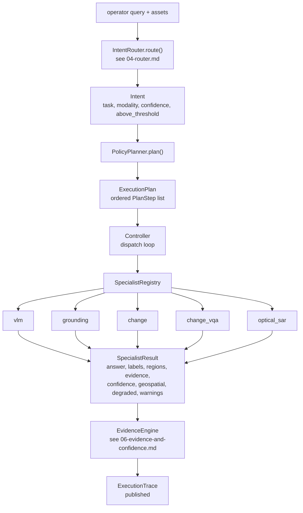

# 05 — Specialists

**Chapter status:** written against the code at `C:/Users/anish/satquery-ai/**`, read directly.
**Companion chapters:** `03-request-lifecycle.md` (how a specialist is selected and called),
`04-router.md` (how the task is decided), `06-evidence-and-confidence.md` (what the emitted
evidence means), `07-configuration-freeze.md` (the config hash and why nothing may move it).

**Read this first.** A specialist is where SatQuery AI stops being a pipeline and starts being a
measurement. Everything upstream of it — the router, the planner, the controller, the API — exists to
decide *which* specialist to call and to carry its output back out with its provenance intact.
Everything downstream of it is presentation. This chapter documents all six specialists
exhaustively: their class, entry point, frozen backbone, trained module, exact preprocessing, exact
postprocessing, output shape, emitted evidence, measured metric with its protocol, and limitations.

**A note on how to read the status labels.** Every substantive claim below carries one of the status
words defined in the release style guide (`IMPLEMENTED` · `VERIFIED` · `MEASURED` · `ATTEMPTED` ·
`NOT RUN` · `BLOCKED` · `DEFERRED` · `REJECTED` · `OPEN` · `RESOLVED` · `CLOSED`). Where a fact is
missing, the text says `UNKNOWN — not established from the available evidence` rather than guessing.

---

## Contents

| Part | Sections | Subject |
|---|---|---|
| 0 | §1–§4 | What a specialist is: the ABC, the registry, the universal rules |
| A | §5–§10 | `vqa` and `caption` — the SmolVLM specialist |
| B | §11–§17 | `grounding` — RemoteCLIP plus the trained head |
| C | §18–§26 | `change` — STANet-style Siamese detector |
| D | §27–§34 | `change_vqa` — the closed-vocabulary CDVQA head |
| E | §35–§43 | `optical_sar` — CROMA plus the fusion head |
| F | §44–§48 | Cross-cutting: evidence, confidence, degradation, open items |

---

# Part 0 — What a specialist is

## §1 The `Specialist` contract

Every specialist is a concrete subclass of `Specialist` in `specialists/base.py` (137 lines). The
contract is small and it is frozen.

### §1.1 `SpecialistRequest`

`SpecialistRequest` is a **frozen** dataclass — the controller builds one and no specialist may
mutate it:

```python
@dataclass(frozen=True)
class SpecialistRequest:
    assets: list[Asset]           # the images this request is about
    query: str                    # the operator's question, verbatim
    params: dict[str, Any]        # plan-step parameters (see 04-router.md §43)
    run_id: str                   # the run this request belongs to
```

It exposes one derived property:

| Property | Meaning |
|---|---|
| `asset_count` | `len(self.assets)`. This is the number every specialist's `validate_request` branches on. |

`params` is where a plan step's parameters arrive. `core/planner.py`'s `_params_for` populates it,
and it is also where a *future* planner could hand a change map to the change-VQA specialist (see
§32.4 — the hook exists and is documented as unused).

### §1.2 The abstract surface

`Specialist` declares three class attributes and four abstract methods:

| Member | Kind | Contract |
|---|---|---|
| `name` | class attr | Stable identifier. Matches the `capabilities` string the planner looks up. |
| `version` | class attr | Semantic version string. Every specialist in this release is `"0.1.0"`. |
| `capabilities` | class attr | Tuple of capability strings this specialist can serve. |
| `validate_request(request)` | abstract | Raise a typed error for anything that cannot be served. Must not silently repair. |
| `execute(request)` | abstract | Produce a `SpecialistResult`. |
| `produce_evidence(result)` | abstract | Return the evidence for an already-computed result. **Never invents a new artifact.** |
| `estimate_confidence(result)` | abstract | Return the `ConfidenceBreakdown` for an already-computed result. |

Four concrete helpers are provided by the base class:

| Helper | Behaviour |
|---|---|
| `supports(capability)` | `capability in self.capabilities`. Used by the registry's capability lookup. |
| `require_assets(request, n)` | Raises `InvalidRequestError` when `asset_count != n`. |
| `require_capability(capability)` | Raises when this specialist does not declare the capability. |
| `model_refs()` | Returns `list[dict[str, str]]` naming the models loaded. Defaults to empty; every specialist that loads a model overrides it. |
| `describe()` | Returns a dict of identity facts. Specialists extend it with their own degradation state. |
| `__repr__` | Includes name, version and capabilities. |

**The `produce_evidence` / `estimate_confidence` shape is deliberate.** They take a *result*, not a
request. That is what makes "evidence is a projection of what was computed" structurally true rather
than a convention: a specialist that never ran has no result to project evidence from, so it cannot
manufacture evidence for a request it did not serve.

### §1.3 The five registered specialists

| `name` | `capabilities` | Module | Backbone | Trained module |
|---|---|---|---|---|
| `vlm` | `("vqa", "caption")` | `specialists/vqa/inference.py` | `SmolVLM-500M-Instruct` @ `a7da5b986cb5` | LoRA adapter (`model.text_model` only) |
| `grounding` | `("grounding",)` | `specialists/grounding/specialist.py` | RemoteCLIP ViT-B/32 @ `bf1d8a3ccf2d` | `GroundingHead`, 1,052,677 params |
| `change` | `("change",)` | `specialists/change/specialist.py` | ResNet-18 (torchvision) | `STANetStyleChangeDetector`, 4-level Siamese |
| `change_vqa` | `("change_vqa",)` | `specialists/change/vqa_specialist.py` | frozen STANet detector + MiniLM | `change_vqa_head_v1`, 1,453,912 params |
| `optical_sar` | `("optical_sar",)` | `specialists/optical_sar/specialist.py` | CROMA-base @ `0dd28e3d633b` | `FusionHead`, 1,201,711 params |

One specialist serves two capabilities. `vlm` declares `("vqa", "caption")` because both are the same
model with a different prompt kind (§10). The planner's `CAPABILITY_ASSETS` in `core/planner.py`
turns each capability into an asset-count requirement, and `TASK_CAPABILITY` maps the six router task
classes onto these capability strings — see `04-router.md` §39–§43.

### §1.4 Status of each specialist, in one table

This is the single most important table in the chapter. **Do not read any metric below without its
status column.**

| Task | Artifact exists | Artifact measured | Wired into serving by default | Status |
|---|---|---|---|---|
| `caption` | yes | yes (`exact_match` 0.963 on 1,000 adapted-test questions) | yes | `USABLE_VERIFIED` — **`ACCEPTANCE-REJECTED`** |
| `vqa` | same adapter | same | yes | `USABLE_VERIFIED` — **`ACCEPTANCE-REJECTED`** |
| `grounding` | yes (`head.pt`, 12.6 MB) | yes (two protocols, two decode variants) | **yes** — `build_grounding_specialist` loads `DEFAULT_HEAD_PATH` | `MEASURED` |
| `change` | yes (`head.pt`) | yes (pooled IoU 0.8122 on 2,048 tiles) | **no** — deliberately not wired (see §22.5) | `VERIFIED` |
| `change_vqa` | yes (`head.pt`, 5,822,809 bytes) | yes (two test sets) | yes (`app/serving.py:76-78`) | `MEASURED`, metric ruling `OPEN` |
| `optical_sar` | yes (production head, 14,427,457 bytes) | yes (accuracy 0.931 **with** macro-F1 0.434161) | head loadable; CROMA resolution is environment-dependent | `MEASURED`, ruling `OPEN` |

Two rows are worth restating because they are the two most common ways to state this project's
results wrongly:

- **`change` is `VERIFIED` and is not deployed.** The trained checkpoint exists, is benchmarked, and
  is deliberately *not* referenced from `configs/base.yaml`. §22.5 gives the exact reason.
- **The VLM adapter is `USABLE_VERIFIED` but `ACCEPTANCE-REJECTED`.** Those are different words about
  different things. §9.4 quotes the closure record.

---

## §2 Where a specialist sits in the pipeline



The registry **caches the specialist instance**. That fact has a measurable consequence for
`change_vqa`: the planner plans both a `change` step and a `change_vqa` step for a change+language
request, so the STANet detector runs twice for one request — but the weights are loaded once, so the
second cost is a forward pass, not a 60 MB load. The specialist's own docstring states this cost
rather than hiding it (`specialists/change/vqa_specialist.py:16-27`).

---

## §3 The three vocabularies you must not confuse

This chapter uses three vocabularies, and conflating any two of them produces a wrong statement.

| Vocabulary | Where it lives | Members | Used for |
|---|---|---|---|
| Router **task classes** | `router/label_space.py:TASK_CLASSES` | 6: `vqa`, `caption`, `grounding`, `change`, `optical_sar`, `unsupported` | What the router predicted |
| **Task** enum | `core/schemas.py:Task` | 7: the six above plus `change_vqa` | What a `SpecialistResult` is labelled with |
| Planner **capabilities** | `core/planner.py:TASK_CAPABILITY` | 6, including `change_vqa`, excluding `unsupported` | What the planner asks a specialist for |

The router's class space has no `change_vqa` member. The `Task` enum and the planner do. This is why
a `change_vqa` result can exist while no router prediction ever names it — the planner *derives* the
`change_vqa` step from a `change` prediction plus a language signal (`04-router.md` §43).

---

## §4 The universal rules every specialist obeys

These rules are not stylistic preferences. Each one is implemented, and each one has a test or a
measured behaviour behind it.

### §4.1 Never invent a value

The strongest statement of this rule in the codebase is in the optical-SAR sensor adapter
(`specialists/optical_sar/sensor_adapter.py:9-28`):

> "No invented missing bands." … "a band the sensor did not produce must never acquire values."

The module names the failure mode precisely: a 4-band Cartosat-2S scene maps cleanly onto canonical
channels 1–4; filling channels 5–12 with a copy of B3 as a fake "red-edge" produces a tensor of the
correct shape whose statistics look plausible. "CROMA would run. Nothing would raise."

The same rule appears in four other places with different subjects:

| Place | What must not be invented |
|---|---|
| `specialists/change/postprocess.py` | A change region where the pair is mis-registered |
| `specialists/grounding/specialist.py` | A coordinate — the VLM is never asked for one (finding C-5) |
| `specialists/change/vqa_specialist.py` | An answer from an untrained 19-way classifier |
| `specialists/optical_sar/radiometry.py` | A dynamic range for a channel the sensor did not measure |

### §4.2 Degrade, do not crash — and say which piece is missing

A **missing** artifact is a deployment fact. A **corrupt** artifact is a bug. Every specialist draws
that line identically:

| Situation | Behaviour | Rationale (verbatim from the code) |
|---|---|---|
| Artifact absent | Construct, mark `degraded=True`, name the missing piece in `warnings` | "a missing artifact is a *deployment* case, not a crash" |
| Artifact named and exists but unreadable | Raise `ModelLoadError` | "Degrading to an untrained model because a real checkpoint failed to load would turn a broken deployment into a silently-wrong one" |

The three specialists that load a checkpoint each restate this:
`specialists/change/specialist.py:866-870`, `specialists/change/vqa_specialist.py:534-538`,
`specialists/optical_sar/inference.py:373-376`.

### §4.3 A signal gap is not a weak signal

When there is nothing to be confident *about*, the confidence is `0.0`, not a discounted mid-range
number. Three specialists implement this floor explicitly:

| Specialist | Floor condition | Source |
|---|---|---|
| `change` | suppressed, untrained, or zero regions | `specialists/change/specialist.py:692-693` |
| `optical_sar` | no prediction, or untrained head | `specialists/optical_sar/specialist.py:526-536` |
| `change_vqa` | no trained head at all | `specialists/change/vqa_specialist.py:322-352` |

The change specialist's comment explains why the third floor exists: an empty result previously
scored ≈0.5, because a well-aligned pair contributes its full 0.50 registration weight while both
signal terms are 0.0. "A confidence of 0.5 on 'no change found' reads as 'we are fairly sure', which
overstates it."

### §4.4 Artifact references are never filesystem paths

Finding **F-16** (owner ruling 2026-09-23) forbids exposing a filesystem path to a client. The
implementation is not "omit the field" — it is "emit the evidence item with `artifact_ref = None`
and say in the payload that the artifact is not retrievable":

```python
payload={
    "rendered": rendered,
    "retrievable": False,
    "retrieval": "no artifact-serving endpoint in v1",
}
```

Both sites that write an artifact implement this: `specialists/change/specialist.py:513-587` (the
change map) and `specialists/optical_sar/specialist.py:752-799` (the optical and SAR views). The
optical-SAR comment calls them "the sibling site of the same ruling" and states why both had to be
brought into line: "fixing one and not the other leaves the ruling half implemented, which is how the
divergence would survive a green suite."

The change specialist adds a second, sharper consequence. When the pair is suppressed the map is
written **without georeferencing**:

> "Copying T1's transform onto it would produce a file that unlocks exactly the placed-on-a-map
> reading the suppression exists to forbid: a downstream tool would happily render it over the wrong
> ground."

`_geospatial` implements the same rule on the metadata path: when registration is unusable it returns
`GeoMetadata(..., is_georeferenced=False)` with the transform dropped.

### §4.5 No LLM-generated confidence, no LLM-generated coordinates

Freeze section 5 states both prohibitions. The implementation is that the VLM is *never asked*:

| Specialist | The VLM's permitted job |
|---|---|
| `grounding` | explain boxes the head produced (prompt kind `explain_grounding`) |
| `change` | "A language model may narrate it; it may not produce it" |
| `change_vqa` | explain the answer the head produced |
| `optical_sar` | narrate a label the classifier already decided |

`specialists/optical_sar/prompts.py:6-18` states the consequence of getting this wrong: "A VLM asked
to classify would produce a plausible label with no measurement behind it, and that label would sit
next to a real confidence score looking equally authoritative."

---

# Part A — `vqa` and `caption`: the SmolVLM specialist

The VQA and caption tasks are served by one specialist, `vlm`, with two prompt kinds. This part
covers the model wrapper (§5), the prompts (§6), the specialist itself (§7), the input-quality gate
that makes the whole thing defensible (§8), and the measured result with its acceptance status (§9).

## §5 The frozen backbone: `specialists/vqa/model.py`

`specialists/vqa/model.py` is 434 lines and is written against findings F5-1 through F5-4. Its
docstring names all four before any code appears.

### §5.1 The checkpoint

| Property | Value | Source |
|---|---|---|
| Checkpoint | `HuggingFaceTB/SmolVLM-500M-Instruct` | `docs/PHASE5_VLM_CONTRACT.md` |
| Pinned revision | `a7da5b986cb5` | same |
| `transformers` version the contract was verified against | `5.17.0` | same |
| Base parameter count | 516,165,824 | `artifacts/vlm/phase6_closure.json` |
| Frozen parameters | 507,482,304 | same |
| Trainable parameters after LoRA | 8,683,520 | same |
| Trainable as a fraction of total | 1.68231208 % | same |
| Trainable as a fraction of base | 1.71109809 % | same |

### §5.2 Finding F5-1 — the loader class is absent, not deprecated

The plan (finding C-2) said `AutoModelForVision2Seq` was "deprecated" and prescribed a fallback. The
Phase 5 probe measured the truth:

| Class | `transformers` 5.17.0 |
|---|---|
| `AutoModelForImageTextToText` | **present** |
| `AutoModelForVision2Seq` | **ABSENT** |
| `AutoModelForMultimodalLM` | present |
| `AutoModel` | present |

"ABSENT" means referencing it raises `AttributeError` at import time. There is nothing to fall back
*to*. So the loader is resolved by `hasattr()` **feature detection**, not by version comparison and
not by try/except around an import. `LOADER_CANDIDATES` holds three class names in preference order,
`resolve_loader_class()` walks them, and `VLMLoadInfo` records which one won. Config key:
`vlm.loader_class_preference: auto`.

### §5.3 Finding F5-2 — the processor must be pinned, and the cost was 17×, not 4×

This is the finding with the largest deployment consequence.

```
INPUT: one 512×512 RGB tile

DEFAULT  (size.longest_edge = 2048, do_image_splitting = True)
    pixel_values  (1, 17, 3, 512, 512)     <- 17 images
    input_ids     (1, 1142)                <- 1142 tokens

PINNED   (size = {"longest_edge": 512})
    pixel_values  (1,  1, 3, 512, 512)     <-  1 image
```

The chain: resize 512 → 2048 (`longest_edge`), then `do_image_splitting=True` cuts the 2048 image
into 4×4 = 16 sub-images of 512 each, plus 1 overview image. 16 + 1 = **17**.

The plan estimated "~4×". The measurement is ~17×. The Phase 5 record states why the correction
matters: "the difference between '4×' and '17×' is the difference between a cost you absorb and a
cost that makes the deployment quota non-viable." At 1,142 prompt tokens per call, an un-pinned
processor would spend a user's entire daily ZeroGPU quota (5 GPU-minutes/day) on one or two queries.

**Resolution, and it is enforced twice.** `_build_processor` passes the pin explicitly:

```python
size={"longest_edge": self.processor_longest_edge}
```

and `generate()` carries a **regression guard**: if `_count_images(...)` reports more than one image
in a batch, it raises. A silent re-widening of the pin cannot survive. The smoke test confirms the
pin holds in the real load path, not just in the probe:

```
max_images_seen      1     <- F5-2 pin holds in the real load path
```

Unpinned, that field would read 17.

### §5.4 Finding F5-3 — `<image>` tokens come from the chat template

Hand-written prompt strings fail:

```
ValueError: The total number of <image> tokens in the prompts should be the
same as the number of images passed. Found [0] <image> tokens and [1] images
per sample.
```

The chat template inserts them; a raw string does not. So `build_messages` never emits a raw string —
it returns a message structure with `{"type": "image"}` entries, and the processor's
`apply_chat_template` renders it. Config key: `vlm.prompt_must_use_chat_template: true`.

`specialists/optical_sar/prompts.py:137-156` reuses the same discipline through `render_for_vlm`, and
it **raises** when the processor lacks `apply_chat_template` rather than falling back:

> "constructing the prompt string by hand is what finding F5-3 records as broken, and there is no safe
> fallback."

### §5.5 Finding F5-4 — the dtype kwarg is not discoverable by signature

Neither `AutoModelForImageTextToText.from_pretrained` nor `PreTrainedModel.from_pretrained` exposes
`dtype` or `torch_dtype` as named parameters. Both are absorbed through `**kwargs`. **Signature
inspection is therefore the wrong tool.**

`DTYPE_KWARG_CANDIDATES = ("dtype", "torch_dtype")` and `_load_with_dtype_fallback` attempts the
preferred spelling (`dtype`, the v5 name) and on `TypeError` retries once with `torch_dtype` (the v4
name). This is a call-time fallback, not an introspection. Verified live: the loader resolves to
`AutoModelForImageTextToText` and the kwarg to `dtype` on `transformers` 5.17.0.

### §5.6 The adapter is attached or the load fails

`_attach_adapter` wraps the base model in a `PeftModel`. If attachment fails it **raises** rather than
silently serving the base model:

> "raises rather than silently serving base"

The adapter path comes from `ADAPTER_ENV_VAR = "SATQUERY_VLM_ADAPTER"`, and `_adapter_sha256` records
the digest so a swapped adapter is detectable. The promoted adapter's weights digest is
`07c76a75fa04624880ed7730590f5fdd7b145a8232e3c0af411c3c545a5adf5e` and its tree hash is
`5c6b86317d1e65962702dc9e377009b3df41cc13de1b15bceccb70ad977775e7`
(`artifacts/vlm/phase6_closure.json`).

### §5.7 The measured wrapper surface

| Symbol | Contract |
|---|---|
| `SmolVLM.__init__(checkpoint, revision, processor_longest_edge, device, torch_dtype, do_image_splitting=True, adapter_path=None)` | Loads base, attaches adapter, builds processor with the pin |
| `generate(...)` | Greedy decode; enforces the single-image guard |
| `_count_images(...)` | Counts images in a prepared batch — the F5-2 guard's input |
| `unload()` | Frees the model. Relevant on a quota-metered deployment. |
| `build_vlm(config, ...)` | Constructs from the central config |
| `VLMLoadInfo` | Records loader class, dtype kwarg spelling, processor pin, adapter digest |

---

## §6 The prompt set: `specialists/vqa/prompts.py`

130 lines, one job: make every prompt a versioned, hashed, chat-template-rendered object.

### §6.1 `PROMPT_VERSION = "v001"`

The version string travels into the execution trace, so a result can be attributed to the exact
wording that produced it. Bumping it on any wording change is the whole mechanism.

### §6.2 `PromptKind` — four kinds, one model

| `PromptKind` | Used by | What it asks for |
|---|---|---|
| `vqa` | task `vqa` | A short answer to the operator's question |
| `caption` | task `caption` | A description of the image |
| `explain_grounding` | task `grounding` (narration only) | Prose about boxes the head produced |
| `explain_change` | task `change` / `change_vqa` (narration only) | Prose about a change the detector produced |

Two of the four are **narration** kinds: they receive already-computed facts and are forbidden from
deriving new ones. That is the §4.5 rule made structural.

### §6.3 `SYSTEM_PREAMBLE`

The system instruction is reproduced verbatim in `docs/PHASE5_VLM_CONTRACT.md` and is the same text
that failed to prevent the F5-5 hallucination:

> "Answer only from what is visible… If the image does not contain enough information, say so
> plainly."

The Phase 5 record draws the conclusion explicitly: "The instruction was already as explicit as it
can be written." A 500M-parameter VLM will generate *something* for any tensor it is handed, and
asking it to self-assess reliably is asking it to perform the exact operation it just failed. This is
why §8 exists.

### §6.4 `_INSTRUCTIONS` and `build_messages`

`_INSTRUCTIONS` maps each `PromptKind` to its user-side instruction text.
`build_messages(kind, user_text, *, image_count=1, evidence_context=None)` assembles the
system+user structure with `image_count` image placeholders and returns the structure — never a
rendered string. `evidence_context` is where a narration prompt's already-computed facts enter.

`describe_prompts()` returns the prompt inventory with a `_short_hash` per entry, so the prompt set
itself is content-addressed.

---

## §7 The specialist: `specialists/vqa/inference.py`

422 lines. This is the module that turns a loaded `SmolVLM` into a `Specialist`.

### §7.1 Identity

| Attribute | Value |
|---|---|
| `name` | `"vlm"` |
| `version` | `"0.1.0"` |
| `capabilities` | `("vqa", "caption")` |
| `max_new_tokens` | `128` |
| `do_sample` | `False` (greedy — deterministic) |
| `max_images_per_call` | `1` |

`max_images_per_call = 1` is the F5-2 pin restated at the specialist layer.

### §7.2 `validate_request`

Checks asset count against `max_images_per_call` and checks each path exists. A VQA or caption
request is a **single-image** request; asking for two images is rejected rather than silently using
the first (the same discipline `change` applies in the other direction — see §22.3).

### §7.3 Image preparation

`_load_image_array` implements the display-path stretch:

| Step | Detail |
|---|---|
| Percentile stretch | 2nd–98th percentile, computed **over finite values only** |
| Output scale | scaled to 255, cast to `uint8` |
| Non-finite handling | excluded from the percentile computation |

`_load_image` wraps this into the PIL object the processor expects.

Note the scope difference that `docs/PHASE14_OPTICAL_SAR_DECISIONS.md` §3 flags: this stretch is
**one** `lo, hi` pair across the whole flattened tensor, returns `uint8`, and truncates to the first
three bands. It is correctly scoped to the VLM/grounding display path and "must not be reused" as a
CROMA input path — feeding CROMA through it would silently discard 9 of the required 12 channels.

### §7.4 The quality gate runs before the model

`execute` performs the quality assessment **before** calling the model:

```
quality gate  ->  (blocking verdict) -> _refuse(...)
              ->  (usable)           -> model.generate(...)
```

The order is the entire point. By the time the model sees a tensor, the tensor has already been
classified as imagery. §8 documents the gate.

### §7.5 Answer normalisation and refusal detection

`_normalize_answer` trims and normalises the generated text. `_looks_like_refusal` tests the output
against `_REFUSAL_MARKERS`, a 6-entry tuple of phrases that indicate the model declined. A refusal is
detected rather than treated as an answer.

### §7.6 `_confidence_for` — the gate is a multiplier, not a term

This is the single most easily-misread function in the specialist, and the code says so:

```python
base = 0.5 * schema_valid + 0.5 * not_refused
raw  = base * input_usable          # the gate is a MULTIPLIER, not a term
```

| Component | Meaning |
|---|---|
| `schema_valid` | The output parsed into the expected shape |
| `not_refused` | The output was not a refusal |
| `input_usable` | The quality gate said the input was usable |

Why a multiplier matters: a weighted *sum* would let a perfectly-formed answer about a noise tensor
retain most of its score. A multiplier means an unusable input zeroes the confidence outright, which
is the honest reading — a fluent sentence about random bytes is worth nothing.

The measured confidence components on a real structured run:

```
{schema_valid: 1.0, declined: 0.0, input_usable: 1.0,
 input_structured: 1.0, autocorrelation: 0.9929}
```

### §7.7 The emitted result

| Field | Content |
|---|---|
| `answer` | The normalised generation, or the refusal text |
| `labels` | Derived from the answer |
| `evidence` | Generated-text evidence with the prompt version and model refs |
| `confidence` | `ConfidenceBreakdown` with `method` naming the estimator |
| `degraded` | Set when the input gate flagged a degraded (non-blocking) verdict |
| `warnings` | The gate's reason, the refusal marker matched, any degradation note |

`build_vqa_specialist(config, ...)` is the construction entry point.

### §7.8 Measured latency on CPU

From the Phase 5 smoke test, on CPU:

| Path | Measured |
|---|---|
| Caption generation | 11.6 s |
| VQA generation | 5.5 s |

These are CPU figures for a single 512×512 tile at the pinned processor setting. They are recorded
because the deployment quota is metered in GPU-minutes and the CPU number is the honest upper bound
for a local run. **A GPU latency figure for this specialist is `UNKNOWN — not established from the
available evidence`.**

---

## §8 The input-quality gate: `preprocessing/quality.py`

348 lines. This module exists because of finding F5-5, which is the most important finding in
Phase 5.

### §8.1 The measurement that created the module

The slow probe loaded the real model and ran one generation on a 512×512 array of **uniform random
bytes**, with the system preamble present:

```
"A black and white photograph of a man and a woman, who appear to be in a
 room, with a table in front of them."
```

Not a refusal. Not "I cannot determine this". A fluent, specific, wholly fabricated scene
description, produced at the first opportunity.

### §8.2 Why a prompt cannot fix it

The Phase 5 record states the argument in three sentences: the instruction was already as explicit as
it can be written; a 500M-parameter VLM will generate *something* for any input tensor; and asking it
to self-assess reliably is asking it to perform the exact operation it just failed. The plan's §65
requirement — *"the system should never pretend it knows more about its evidence than the evidence
supports"* — cannot be discharged inside the model. So the control is placed **upstream of the
model**.

### §8.3 The verdict vocabulary

| `QualityVerdict` | Meaning | Blocks the model? |
|---|---|---|
| `STRUCTURED` | Looks like imagery | no |
| `FLAT` | Constant or near-constant; no texture | no (degraded) |
| `NOISE` | Uncorrelated with itself; not imagery | **yes** |
| `TOO_SMALL` | Below `min_side` = 16 | no (degraded) |
| `INVALID_VALUES` | Contains non-finite values | **yes** |

```python
BLOCKING_VERDICTS = {QualityVerdict.NOISE, QualityVerdict.INVALID_VALUES}
```

### §8.4 The discriminating signal is lag-1 autocorrelation, not variance

The constants:

| Constant | Value | Role |
|---|---|---|
| `MIN_AUTOCORRELATION` | `0.10` | Below this, the image is not self-correlated |
| `FLAT_STD_EPSILON` | `1e-6` | Below this normalised std, the image is flat |
| `NOISE_ENTROPY_BITS` | `7.8` | Second, redundant signal |

Measured on four input classes plus one non-finite case
(`docs/PHASE5_VLM_CONTRACT.md`):

| input | verdict | autocorrelation | entropy |
|---|---|---|---|
| structured ramp+texture | `structured` | **0.9524** | 7.5810 |
| uniform random noise | `noise` | **-0.0082** | 7.9882 |
| salt-and-pepper | `noise` | **-0.0098** | 1.0000 |
| constant / all-zero tile | `flat` | 1.0000 | 0.0000 |

**The margin analysis is the important part.** Autocorrelation separates by 0.96 against a 0.10
threshold. Entropy separates by 0.22 bits against a 7.8 threshold. "Autocorrelation carries the gate;
entropy is a redundant second signal." Both are kept so that a change to either cannot silently
disable the gate, and a test —
`test_autocorrelation_is_the_load_bearing_signal_not_entropy` — asserts which one is doing the work,
"so a future tuning of the entropy threshold is not mistaken for a weakening of the control."

Why variance alone cannot do this: a flat desert scene and an all-zero tile both have near-zero
variance. The desert has strong neighbour correlation; the zero tile does not.

### §8.5 The size-dependent bug, and its fix

The initial guard was `finite_fraction < 0.999`. One NaN in a 64×64 array is **0.99976**, which is
*not* less than 0.999 — so the defect passed on a large image and was caught on a small one. The
verdict depended on image dimensions rather than on the defect.

Now: `finite_fraction < 1.0`. **Any** non-finite value is disqualifying, at every size. Verified at
32, 64, 128 and 256. The Phase 5 record names the class of bug: "a control whose behaviour depends on
an irrelevant parameter is not a control" — the same class as the seed-dependent split ordering in
Phase 4.

Two related decisions:

| Function | Behaviour on non-finite input |
|---|---|
| `lag1_autocorrelation` | **Raises.** A NaN would fall through every branch in `assess_image_quality` and produce a verdict that means nothing. |
| `histogram_entropy` | **Filters.** Correct for a histogram statistic, wrong for a joint one. |

`lag1_autocorrelation` returns `1.0` for a constant image **by definition** — which is why a
constant tile is `FLAT`, not `NOISE`.

### §8.6 `ImageQuality` and the assessment function

`ImageQuality` is the record: `verdict`, `autocorrelation`, `std_normalized`, `entropy_bits`,
`finite_fraction`, `shape`, plus `is_usable`, `is_degraded`, `to_dict()` and `reason`.

`assess_image_quality(...)` evaluates in this order:

1. Non-finite fraction — `finite_fraction < 1.0` ⇒ `INVALID_VALUES` (disqualifying, no tolerance)
2. Size — `min_side < 16` ⇒ `TOO_SMALL`
3. Noise — `autocorrelation < MIN_AUTOCORRELATION` **and** `entropy_bits >= NOISE_ENTROPY_BITS` ⇒ `NOISE`
4. A second, autocorrelation-only `NOISE` branch
5. Flat — normalised std below `FLAT_STD_EPSILON` ⇒ `FLAT`
6. Otherwise `STRUCTURED`

### §8.7 Scope, and the known limitation

**Scope.** "This gate is for **input validity**, not for answer correctness." It prevents the system
from answering questions about data that is not imagery. It does not and cannot detect a
hallucination on a *valid* image — that remains the job of evidence grounding (Phase 13) and
confidence calibration, "and it is why the VLM is never the source of coordinates or confidence."

**Known limitation, recorded rather than discovered later.** A float GeoTIFF whose nodata sentinel is
NaN is **refused** by the gate, because `finite_fraction < 1.0` treats the sentinel as corruption.
This is deliberate — the alternative is computing correlation over NaN and reporting a meaningless
verdict — but it means NaN-nodata rasters need the sentinel filled from the raster profile *before*
the gate is consulted. The Phase 5 record assigns that work to the tiling path.

---

## §9 The VLM's measured result and acceptance status

### §9.1 The measurement

From `artifacts/vlm/phase6_closure.json`, key path `why_usable_verified.adapted_test`:

| Metric | Value |
|---|---|
| `exact_match` | **0.963** |
| `f1` | **0.96432** |
| `precision` | 0.963391 |
| `recall` | 0.965251 |
| `n` | 1,000 |
| `n_available` | 1,000 |
| `truncated` | false |
| confusion | `tp` 500, `tn` 463, `fp` 19, `fn` 18 |

### §9.2 The normalisation order is load-bearing

The closure record states the order explicitly and explains why:

| Order | Step |
|---|---|
| 1 | `evaluation.metrics.vqa.normalize_answer` (VQA-v2 R1–R6) |
| 2 | strip surrounding quotes and whitespace |
| 3 | fold yes/no synonym families |

> "order is load-bearing: normalize_answer preserves apostrophes, so
> `normalize_answer("'Yes.'") == "'yes'"` and folding before stripping would miss the synonym map"

The synonym families are `{no: [false, n, no]}` and `{yes: [true, y, yes]}`. Normalisation version
`v001`.

### §9.3 The primary endpoint and the excluded metrics

`primary_endpoint` is `"presence-question normalised exact-match accuracy"`.

BLEU and ROUGE are **excluded**, with the reason recorded verbatim: "target answers are one token;
BLEU/ROUGE are meaningless at that length and BERTScore is unavailable offline."

### §9.4 The acceptance rejection — `USABLE ≠ ACCEPTED`

The closure record's headline is:

> "Phase 6 is closed. The Run 1 LoRA adapter is promoted to the production VLM adapter: USABLE and
> VERIFIED, but ACCEPTANCE-REJECTED."

`production_adapter.use_status` is `USABLE_VERIFIED`. `production_adapter.acceptance_status` is
`REJECTED`. Both are true at once, and neither may be dropped.

**Why acceptance was rejected** (key path `why_acceptance_rejected`):

| Element | Value |
|---|---|
| Rule version | `v002` |
| Decision split | `test` |
| `accept_min_delta_pp` | 5.0 |
| ceiling | 2.0 |
| `ceiling_baseline_pp` | 95.0 |
| Test baseline | 46.80 pp |
| Adapted | 96.30 pp |
| Delta | **+49.50 pp** |
| Failing class | Mixed forest: 100.00 → 87.8788, a drop of **12.1212 pp**, n = 33 |
| Outcome | **1 of 19 classes fails**, 11 improved, 5 held |

So the adapter improved aggregate accuracy by 49.5 percentage points and was **still rejected**,
because one class lost more than the ceiling allows. The rejection is a rule firing correctly, not a
model failing. The record also carries the §8.6 unfloored minimum-size exposure note explaining the
n=33 support.

### §9.5 The preserved adjudication records

Three earlier records are preserved and immutable:

| Record | Status | Delta |
|---|---|---|
| `v001_val_rejected` | `REJECTED` | `val_delta_pp` 42.0 |
| `v002_independent_test_rejected` | `REJECTED` | `test_delta_pp` 49.5 |
| `v002_val_accepted_NOT_final` | `ACCEPTED` | — (val only; not final) |

`forward_rule`: run 1 is frozen; new work requires a new version. Nothing here is reopened.

### §9.6 The artifact verification

| Property | Value |
|---|---|
| Artifact verdict | `verified` |
| Manifest check | 14 / 14 clean |
| Tree hash | `5c6b86317d1e65962702dc9e377009b3df41cc13de1b15bceccb70ad977775e7` |
| Weights sha256 | `07c76a75fa04624880ed7730590f5fdd7b145a8232e3c0af411c3c545a5adf5e` |
| Config hash | `78f1e3700da15aa1` |
| `vision_tower_untouched` | trainable = `{'model.text_model': 8683520}` only |

That last row is the architectural fact: **only the language model was adapted.** The vision tower is
byte-identical to the base checkpoint. This is why the adapter is described as a text-side
adaptation and not a vision adaptation, and it constrains what a future adapter version could claim.

### §9.7 The end-to-end smoke evidence

Two inputs, one model, one prompt, two outputs (`docs/PHASE5_VLM_CONTRACT.md`):

| input | output |
|---|---|
| uniform noise | *"A black and white photograph of a man and a woman, who appear to be in a room, with a table in front of them."* |
| structured imagery | *"The image is a satellite image of a large, flat, blue-green area."* |

The second is a defensible description of a smooth ramp. The first is a fabrication. Nothing in the
prompt distinguishes them; only the deterministic gate does, and it decides before the model is
called.

---

## §10 `caption` versus `vqa`: one specialist, two kinds

The router's task space has both `vqa` and `caption` as separate classes, and the planner maps both
onto the `vlm` specialist. The difference between them is entirely in the prompt kind:

| Aspect | `vqa` | `caption` |
|---|---|---|
| Router task class | `vqa` | `caption` |
| `PromptKind` | `vqa` | `caption` |
| Assets | 1 | 1 |
| Capability asked of the specialist | `vqa` | `caption` |
| Specialist instance | the same cached `vlm` object | the same cached `vlm` object |
| Model | identical | identical |
| Decode | greedy, `max_new_tokens=128` | identical |
| Gate | identical | identical |

**Consequence for the metrics.** The 0.963 / 0.96432 figures in §9.1 are measured on
**presence questions** — the primary endpoint is explicitly "presence-question normalised
exact-match accuracy". A separate caption-quality metric (BLEU, ROUGE, CIDEr, human rating) does
**not** exist in this release, and the closure record says why BLEU/ROUGE were excluded for the VQA
endpoint. **A caption-specific quantitative metric is `UNKNOWN — not established from the available
evidence`.** The caption path's evidence is qualitative (§9.7) plus the shared gate measurements.

**Consequence for the router's own defect.** The router-defect case study in `04-router.md` §44–§47
turns on exactly this boundary: the query "Where are the built-up areas in this image?" collapsed to
`vqa` when it should have been `grounding`. The `vlm` specialist answered "River" — a fluent,
plausible, wrong answer of precisely the kind §8.2 says a prompt cannot prevent. The fix was in the
frontend's `interpret()`, not in this specialist. That is the correct place for the fix: the
specialist cannot know it was asked the wrong question.

---

# Part B — `grounding`: RemoteCLIP plus a trained head

Grounding answers "where is X in this image?" and it is the specialist with the most carefully
separated set of measured numbers in the project. This part documents the frozen encoder (§11), the
zero-shot baseline that is deliberately *not* the product (§12), the trained head (§13), the
specialist that dispatches between them (§14), the resolution decision (§15), and — most importantly
— the two protocols and two decode variants that must never be collapsed into one number (§16).

## §11 The frozen backbone: `specialists/grounding/remoteclip.py`

356 lines, written against measured facts rather than the model card. The docstring's opening line is
the operating principle: *"Written against measured facts, not the model card."*

### §11.1 The checkpoint and the measured contract

| Property | Value | Source |
|---|---|---|
| Checkpoint | `chendelong/RemoteCLIP` → `RemoteCLIP-ViT-B-32.pt` | `docs/PHASE7_GROUNDING_CONTRACT.md` |
| Pinned revision | `bf1d8a3ccf2d` | same |
| File size | 605.2 MB | same |
| Loader | `open_clip.create_model_and_transforms("ViT-B-32", pretrained=<local .pt path>)` | same |
| `open-clip-torch` version verified | `3.3.0` | same |
| Parameters | **151,277,313** | same |
| `patch_size` | 32 | same |
| Transformer width | **768** | same |
| Projected dim | **512** | same |
| Text dim | 512 | same |

`VERIFIED_PATCH_SIZE = 32`, `VERIFIED_TRANSFORMER_WIDTH = 768`,
`VERIFIED_PROJECTED_DIM = 512`, `VERIFIED_PARAMETERS = 151_277_313` are module constants asserted at
load time by `_verify_contract()`.

### §11.2 Finding P7-1 — the projected dimension is 512, not 768

This is the finding that bites. `visual.positional_embedding` is **768 wide** and `visual.proj` is
**(768, 512)**. The embeddings comparable against the text tower are the **projected** ones: 512.

> "Using 768 anywhere here would be a shape error that torch would only surface at the similarity
> computation, by which point the patch features have already been computed and cached."

`_verify_contract()` asserts the projected dim at load time for exactly this reason. It checks four
things:

| Check | Fails with |
|---|---|
| `visual.patch_size == 32` | `ModelLoadError` naming the observed value |
| `visual.positional_embedding.shape[-1] == 768` | `ModelLoadError` |
| `positional_embedding.shape[0] == (resolution // 32) ** 2 + 1` | `ModelLoadError` naming the expected count |
| `visual.proj.shape[1] == 512` | `ModelLoadError` |

The third check is the one that catches a resolution mismatch: at 224 px with patch 32, the grid
needs 1 CLS + 49 patches = 50 entries; at 448 it needs 1 + 196 = 197.

### §11.3 Finding P7-2 — 448 interpolation works, and was measured

| property | @224 | @448 |
|---|---|---|
| `visual.image_size` | (224, 224) | **(448, 448)** |
| `visual.patch_size` | (32, 32) | (32, 32) |
| `positional_embedding` | (50, 768) | **(197, 768)** |
| patch token grid | **7 × 7 = 49** | **14 × 14 = 196** |
| projected feature dim | **512** | 512 |
| text feature dim | **512** | 512 |
| vision time | 0.0802 s | 0.1802 s |
| cell size | 1/7 ≈ 0.143 of width | **1/14 ≈ 0.071** |
| token increase | — | **4.0×** |
| attention cost (n²) | — | **16.0×** |

The plan's C-5 arithmetic (patch 32 ⇒ 224/32 = 7 and 448/32 = 14) is confirmed by measurement. The
plan's estimate that the finer grid costs "~4×" in tokens is exact (4.0×); **the attention cost is
16× (n²), which the plan did not state.**

`force_image_size=448` produced `positional_embedding` of (197, 768) — `resize_pos_embed`
interpolated the 50-entry embedding to 197 entries.

### §11.4 Finding P7-3 — the 448 text-encoding error is UNEXPLAINED

The first probe run reported, at 448 only:

```
text encoding FAILED : TypeError: Unexpected type <class 'list'>
```

Isolated re-measurement **did not reproduce it**. Both resolutions behaved identically:
`SimpleTokenizer` → returns a Tensor of shape `(2, 77)` → `encode_text` → `(2, 512)`.

**Status: `UNVERIFIED`.** The cause is not established. The Phase 7 record states the position
plainly: "It may have been a transient, an interaction with the probe's call order, or something the
isolation run did not reproduce. It is recorded rather than papered over."

The defensive `torch.as_tensor` conversion in `encode_text` stays — "it is cheap and correct
regardless" — but it is **not claimed to be the fix** for a failure whose cause is unknown. The
code comment records why the conversion exists at all: "`open_clip.get_tokenizer` returns a tensor
for some backends and a list for others, and `encode_text` rejects a list. That mismatch cost one
probe run its 448 measurement."

### §11.5 The encoder surface

| Symbol | Contract |
|---|---|
| `SUPPORTED_RESOLUTIONS = (224, 448)` | Any other resolution raises `ModelLoadError`. "Both were measured to load correctly; an unmeasured resolution must not be assumed to." |
| `EncodedImage` | `cls` (512,), `patch_tokens` (n_patches, 512), `grid` (h, w), `resolution` |
| `EncodedImage.n_patches` / `.dim` | Derived properties |
| `EncodedImage.patch_index(row, col)` | Row-major index, **bounds-checked** — raises `IndexError` outside the grid |
| `EncodedImage.token_boxes()` | Normalised `[x1,y1,x2,y2]` for every patch token |
| `RemoteCLIPEncoder.encode_image(image)` | Returns an `EncodedImage` |
| `RemoteCLIPEncoder.encode_text(texts)` | Returns normalised `(n, 512)` features |
| `RemoteCLIPEncoder.grid_size` | `resolution // 32` |
| `RemoteCLIPEncoder.describe()` | Model, checkpoint, resolution, grid, n_patches, embedding_dim, device, `frozen: True` |
| `build_encoder(config, resolution, device, checkpoint_path)` | Constructs from config; `checkpoint_path` avoids the Hub fetch |

`token_boxes()` is worth reading closely because it makes the **localization floor** explicit in the
docstring: each token covers 1/`grid_w` by 1/`grid_h` of the image. At 224 that is 1/7 (~0.143) of
the width; at 448 it is 1/14 (~0.071). No decode can produce a boundary finer than the grid, and
pretending otherwise would be inventing precision the model does not have.

### §11.6 `encode_image` replicates the vision forward, and says so

`visual.forward` does not expose per-patch tokens, so `encode_image` reimplements the forward up to
`ln_post`:

```python
patches = visual.conv1(x)
patches = patches.reshape(...).permute(0, 2, 1)
tokens  = torch.cat([cls, patches], dim=1)
tokens  = tokens + visual.positional_embedding
tokens  = visual.ln_pre(tokens)
tokens  = visual.transformer(tokens.permute(1, 0, 2)).permute(1, 0, 2)
tokens  = visual.ln_post(tokens)
cls_out   = tokens[:, 0, :]
patch_out = tokens[:, 1:, :]
if visual.proj is not None:
    cls_out   = cls_out   @ visual.proj
    patch_out = patch_out @ visual.proj
```

The docstring's claim is testable and tested: *"Verified to reproduce the same CLS vector."*

### §11.7 Two load routes, and why one is preferred

| Route | Behaviour |
|---|---|
| `pretrained=<local .pt path>` | Routes through `open_clip.load_checkpoint()`, which performs `convert_state_dict`, `resize_pos_embed` and `resize_text_pos_embed` |
| Manual `torch.load` + `load_state_dict` | Works, but **skips all three normalisations** |

The README's manual route is therefore the fallback, not the default. `build_encoder` prefers a local
`checkpoint_path` (which "removes the run's dependence on Hub availability and pins the exact bytes
being measured") and only falls through to `hf_hub_download(repo, filename, revision=revision)` when
none is given.

---

## §12 The zero-shot baseline: `specialists/grounding/inference.py`

270 lines. The first line of the docstring is the most important sentence in the module:

> "This is the BASELINE, not the product."

It exists so the resolution experiment has something to measure before the head was written, and so
there is an ablation floor to compare the head against. It is **not** a claim about localization
quality.

### §12.1 The method

```
image  -> RemoteCLIP patch tokens (N, 512)
phrase -> RemoteCLIP text embedding (512,)
similarity = normalized_patches @ normalized_text   -> (N,)
reshape to (grid_h, grid_w)
-> box
```

No learned parameters. `similarity_map` L2-normalises both sides first, and the docstring explains
why: "Without that the dot product is dominated by whichever vector happens to have the larger norm,
which is a property of the features rather than of the match."

It also guards two degenerate cases: a zero-norm patch row is set to norm 1.0, and a zero-norm text
embedding **raises** `ValueError`.

### §12.2 The two box strategies

| Strategy | Definition | Why it is reported |
|---|---|---|
| `argmax` | The single highest-scoring patch, as its token box | "the pure localization floor: the best a patch-similarity model can do at this grid resolution with no smoothing" |
| `threshold` | Bounding box of every patch scoring within `delta` of the peak | "Usually larger and sometimes better on objects that span several patches, sometimes worse when the peak is a spurious spike" |

`DEFAULT_DELTA = 0.02`, and the docstring is explicit that this is "a starting value, not a tuned
one — it is an ablation variable, and tuning it belongs on validation data."

`threshold_candidate` returns `None` when only one patch qualifies, because the box would be
identical to `argmax` and reporting it twice adds nothing. The box spans min-to-max of the selected
patches, so it is aligned to the token grid — "pretending to a finer boundary than the grid supports
would be inventing precision the model does not have."

### §12.3 `decode_candidates_from_features` — one decode, and why that matters

This function is the *only* implementation of the zero-shot decode, and its docstring records the
defect that made that necessary. It is quoted here in full because it is the clearest example in the
project of a measurement being wrong for a reason that had nothing to do with the model:

> The Phase 8 evaluation script originally built its own single-box baseline with
> `argmax_candidate`, while Phase 7 measured the baseline through `ground_phrase`. Same 16,159
> records, same metric, same cached features — but a different DECODE:
>
> ```
> Phase 7 via ground_phrase  : mean best IoU 0.0972
> eval via argmax_candidate  : mean best IoU 0.0092
> ```
>
> A 10× gap. The eval printed `head beats zero-shot: True (+0.1123)` when the matched comparison was
> +0.0243. Both clear the 0.02 bar, but only the second is a claim about the head rather than about
> the decode.

The fix is structural: "there is now exactly one place that turns similarity into boxes."

The decode itself:

| Step | Behaviour |
|---|---|
| 1 | Compute the similarity map |
| 2 | Append the `threshold` candidate if it exists |
| 3 | Walk patches in descending similarity |
| 4 | Accept a patch only if it beats its **4-neighbours** (a local maximum) |
| 5 | Skip a patch within one cell of an already-accepted maximum |
| 6 | Stop at `top_k` (default 5) |
| 7 | If nothing was accepted, fall back to the single `argmax` candidate |

Step 4's rationale is in the code: "Without this, `top_k` returns k adjacent patches from a single
blob, which looks like k detections and is really one." Step 6's rationale is also in the code: "the
zero-shot field has one strong peak and a tail of noise, and flooding the output would make precision
meaningless."

### §12.4 The verification that the fix is real

The Phase 8 record's check is the strongest available form of this claim — a numeric identity:

```
Phase 7 recorded baseline (cross-check) : 0.0972
this run's zero-shot, same samples      : 0.0972
|difference|                            : 0.0000
```

> "If the decode still differed, the two would not agree to four decimals."

---

## §13 The trained head: `specialists/grounding/head.py`

490 lines. This is the module that turns 49 frozen patch tokens plus a text embedding into boxes.

### §13.1 Why 224 and not 448

The head's docstring opens with the decision and its measurement: the 448 option was **REJECTED**, on
a **paired t of −22.63**. §15 gives the full record.

### §13.2 The per-cell feature

For each of the 49 cells, the head builds a **2048**-dimensional feature:

```
concat([ p_i,        # the cell's own projected patch token  (512)
         t,          # the text embedding, broadcast           (512)
         p_i * t,    # the elementwise interaction            (512)
         global_pool # the mean patch token, broadcast        (512) ])
```

`4 × 512 = 2048`. `build_head` **asserts** `feature_dim == 4 × VERIFIED_PROJECTED_DIM`, so a change to
the encoder's projected dim cannot silently reshape the head's first layer.

### §13.3 The head module

```python
GroundingHead(feature_dim=2048, hidden_dim=512, dropout=0.10)
```

| Submodule | Shape |
|---|---|
| `proj` | 2048 → 512 |
| `norm` | LayerNorm(512) |
| `drop` | Dropout(0.10) |
| `out` | 512 → 5 |

The five outputs are, in order, `tx`, `ty`, `tw`, `th`, `objectness`
(`artifacts/grounding/remoteclip_grounding_v001/training_metadata.json` → `head.outputs`).

`_init_weights`:

| Parameter | Init |
|---|---|
| `proj.weight` | `nn.init.normal_(std=0.02)` |
| `out.weight` | `nn.init.normal_(std=0.01)` |
| `out.bias` | zeros, **then `out.bias[4] = -2.0`** |

The `-2.0` on the objectness bias is the same trick the change detector uses on its final logit: it
starts the objectness prior low so the early epochs are not spent un-learning a saturated sigmoid.

`forward` carries three shape guards, including one on the **assembled feature width** — the guard
that would fire if the concatenation in §13.2 were ever changed without changing `feature_dim`.

`EPS = 1e-7` guards the box-width/height logs against a zero denominator.

### §13.4 The decode: `cell_relative`

`decode_cell_relative` is a YOLO-style cell-relative decode. The head predicts offsets **relative to
the cell** rather than absolute coordinates, which is what makes a 7×7 grid capable of producing a
box smaller than a cell. The decode name `cell_relative` travels in the artifact metadata so a
re-run under a different decode is distinguishable.

`enforce_order` normalises a box so `x1 ≤ x2` and `y1 ≤ y2` — a predicted box with swapped corners is
a real output shape and clamping it is cheaper and more honest than discarding it.

`assign_positive_cell` selects the single positive cell for a ground-truth box by its **centre**. One
cell, not many: this is a per-cell single-object assignment, and the choice is recorded in the
module rather than left implicit.

### §13.5 NMS and IoU, implemented in pure torch

`nms(...)` and `_box_iou(...)` are implemented in torch rather than pulled from a detection library.
The consequence is that the head has no dependency beyond torch, and the NMS threshold travels as a
parameter (`nms_iou=0.50` at the specialist layer, §14.2).

### §13.6 The loss

```python
grounding_loss(box_weight=0.5, giou_weight=0.3, confidence_weight=0.2,
               positive_confidence_weight=20.0)
```

| Term | Weight | Note |
|---|---|---|
| Box (L1 on the four offsets) | 0.5 | |
| GIoU | 0.3 | `giou_loss` is implemented in the module |
| Confidence (BCE on objectness) | 0.2 | |
| Positive-cell confidence multiplier | **20.0** | Applied to the positive cell's confidence term |

`positive_confidence_weight = 20.0` is the term that fixes the objectness prior. The measured
trajectory shows it working: `conf` falls from an over-confident **0.7897** at epoch 1 to **0.5685**
at epoch 20 while `val_iou` rises. The Phase 8 record reads the pattern: "`box` and `giou` fall
together, which is the healthy pattern (a falling `box` with a rising `giou` would mean the box is
drifting in size)."

`LossBreakdown` returns the four components separately so the trajectory above is reportable per
term rather than as one scalar.

### §13.7 The head's parameter count

**1,052,677 parameters** (`docs/PHASE8_GROUNDING_HEAD_DECISION.md`, confirmed in
`training_metadata.json` → `head_parameters`). The Phase 8 record's framing of the result is precise:
"a 1.05M-parameter head over frozen 7×7 RemoteCLIP tokens beats a cosine-argmax baseline by 2.6× on
mean best IoU (0.2566 vs 0.0972) at matched candidate budget."

### §13.8 The 20-epoch validation trajectory

From `training_metadata.json` → `history`, CPU, ~37 s/epoch:

| epoch | loss_total | loss_box | loss_giou | loss_confidence | val_iou_argmax | val_recall50_argmax |
|---|---|---|---|---|---|---|
| 1 | 0.428415 | 0.06405 | 0.794837 | 0.789694 | 0.0436 | 0.0157 |
| 5 | 0.386406 | 0.048939 | 0.758093 | 0.672542 | 0.0673 | 0.0365 |
| 10 | 0.365261 | 0.044586 | 0.731306 | 0.617881 | 0.0831 | 0.0506 |
| 11 | 0.361891 | 0.043897 | 0.726564 | 0.609865 | 0.0901 | 0.0573 |
| 12 | 0.358045 | 0.04327 | 0.720912 | 0.600681 | 0.0899 | — |
| 20 | 0.3419 | 0.0401 | 0.6937 | 0.5685 | 0.0943 | — |

`best_val_iou` recorded as **0.0946** (`training_metadata.json`), `first_val_iou` 0.0436. `lr` starts
at 1e-4 and follows a cosine schedule (1e-4 → 9.931806517013612e-05 → 9.729086208503174e-05 → …).

**`training_metadata.json` records `"beats_baseline": false`.** That is not a contradiction of §16 and
it must not be read as one. The field compares the head's **validation** IoU (0.0946) against the
zero-shot **eval** baseline (0.0972) — two different splits. §16.4 gives the full explanation of the
val/eval gap. The honest summary is: the artifact's own metadata field says `false`; the decode-matched
eval protocol says the head wins by +0.1594 IoU. Both are in the record; neither replaces the other.

---

## §14 The specialist: `specialists/grounding/specialist.py`

852 lines. This is the module that decides *which* decode to run and carries the result out with its
provenance.

### §14.1 The frozen contract

```
1 image + phrase  ->  RemoteCLIP @ 224  ->  49 projected patch tokens
                  ->  GroundingHead     ->  49 x (tx, ty, tw, th, objectness)
                  ->  decode            ->  boxes + scores
                  ->  confidence        ->  ConfidenceBreakdown
                  ->  evidence          ->  BOUNDING_BOX / GEOLOCATION / STATISTIC
```

### §14.2 The constructor surface

| Parameter | Default | Meaning |
|---|---|---|
| `grid` | `7` | The token grid side at 224 |
| `nms_iou` | `0.50` | IoU above which two boxes are considered the same object |
| `max_candidates` | **`6`** | Cap on emitted boxes |
| `score_threshold` | `0.30` | Minimum objectness to emit a box |
| `head_top_k` | `5` | Top-k selection inside the head decode |
| `resolution` | `224` | Encoder resolution |

**`max_candidates` defaults to 6, not 20.** The config carries `grounding.max_candidates: 20`; the
serving path uses `grounding.serving_max_candidates = 6`. This is not a typo and it is not an
oversight — §16.3 explains that 20 versus 6 is the difference between the canonical protocol's number
and the decode-matched one, and `build_grounding_specialist` deliberately takes the matched value.

### §14.3 Two degraded modes

The module declares two, and they are different failures:

| Mode | Condition | Behaviour |
|---|---|---|
| No trained head | `has_head` is False | Zero-shot decode; the result is marked degraded and the reason names the missing head |
| Head load failure | A head path was named and exists but cannot be read | `HeadLoadReport` records `invalid`; the reason travels in the result |

`has_head` distinguishes "we have a trained head" from "we have a module with random weights in it" —
the same distinction `change.has_checkpoint` and `optical_sar.has_head` make (§4.2).

### §14.4 Why the VLM is not asked for coordinates (finding C-5)

The module's own section header is `WHY THE VLM IS NOT ASKED FOR COORDINATES (C-5)`. The rule: the
head produces the boxes; a language model may narrate them and may not produce them. The same rule is
restated in `specialists/change/specialist.py:54-57` for the change map, and in
`specialists/optical_sar/prompts.py` for the class label. It is one rule with four applications.

### §14.5 The confidence derivation

```python
CONFIDENCE_WEIGHTS = {
    "max_objectness":      0.40,
    "top_mean_objectness": 0.35,
    "score_contrast":      0.25,
}
```

| Component | Definition | Why |
|---|---|---|
| `max_objectness` | The highest objectness among emitted boxes | The single strongest signal the head produced |
| `top_mean_objectness` | Mean objectness over the top boxes | Guards against one lucky peak |
| `score_contrast` | Separation between the top score and the rest | A flat score field is not a detection |

`_score_stats` computes these from the decoded boxes. `_confidence_for` composes them, and — like the
change specialist — the composition includes a **minimum** against the peak signal rather than a pure
weighted sum.

### §14.6 The degenerate-box guard

```python
DEGENERATE_AREA_FRACTION = 0.9
```

A box covering ≥ 90% of the frame is not a localization; it is a failure that looks like one. The
guard applies **only to the zero-shot path**, and the module records the measurement that motivated
it: the zero-shot path was observed producing a full-frame box with `x1=0 y1=0 x2=1 y2=1`.

`_drop_degenerate` filters them, and `_build_evidence` emits a **separate `STATISTIC` item** recording
what was dropped and why. The reason it is a `STATISTIC` and not a `BOUNDING_BOX` is the same reason
the change specialist's withheld-region record is a `STATISTIC`: emitting the boxes would defeat the
suppression.

### §14.7 `_decode_with_head` and the argmax fallback

When no box clears `score_threshold`, the decode falls back to the **argmax** cell rather than
emitting nothing. This is why `head_argmax` is a reported variant at all (§16.2) — it is a real
runtime path, not a hypothetical. Its measured mean best IoU is **0.1215**.

### §14.8 Evidence emitted

| `EvidenceType` | When | Payload highlights |
|---|---|---|
| `BOUNDING_BOX` | One per emitted box | `coordinates` = `[x1, y1, x2, y2]`, `coordinate_system`, `score`, `label` |
| `GEOLOCATION` | When the asset carries georeferencing | CRS and transform facts |
| `STATISTIC` | Always | Decode variant, thresholds, candidate counts, score statistics |
| `STATISTIC` (degenerate) | Only when boxes were dropped | `n_dropped` and the reason |

### §14.9 `DEFAULT_HEAD_PATH` is a code constant, not a config key

`specialists/grounding/specialist.py` carries a long comment titled **"WHY THIS IS A CODE CONSTANT AND
NOT A CONFIG KEY"**. The reasoning, in brief:

- `head_path` was never set in `configs/base.yaml`;
- `configs/base.yaml` is hashed, and the hash is frozen at `78f1e3700da15aa1` (§4.4 of
  `07-configuration-freeze.md`);
- adding a key would move the hash and detach the project's benchmark numbers from their config;
- so `head_path=None` **now means "use the shipped head"** rather than "no head".

This is the same trap the optical-SAR radiometry module documents for `croma.use_8_bit` and
`croma.checkpoint_path` (§37.5, §35.7). Three modules independently arrive at the same workaround, and
each one names the reason rather than leaving a bare constant.

### §14.10 Head loading has exactly four outcomes

`load_grounding_head` returns a `HeadLoadReport` with `requested_path`, `resolved_path`, `loaded`,
`source`, `reason`, `detail`. The four outcomes are:

| Outcome | `loaded` | `source` | Meaning |
|---|---|---|---|
| none | False | `none` | No path was requested |
| missing | False | `missing` | A path was requested and does not exist — a deployment case |
| invalid | False | `invalid` | The path exists and cannot be read — a corrupt artifact, and the reason is named |
| loaded | True | `shipped` / `explicit` | A trained head is in memory |

Distinguishing `missing` from `invalid` is the §4.2 rule expressed as a data structure rather than a
branch.

### §14.11 `build_grounding_specialist` and the 6-versus-20 decision

```python
build_grounding_specialist(config, ...)  # uses grounding.serving_max_candidates = 6
```

The comment at the call site records that it deliberately takes the config's `serving_max_candidates`
(**6**) rather than `max_candidates` (**20**). §16.3 gives the measurement behind that choice.

---

## §15 The resolution decision: 448 was rejected

### §15.1 The claim under test

The plan's C-5 arithmetic said a 448 px grid would give 14×14 = 196 cells at 1/14 of the image each,
versus 7×7 = 49 cells at 1/7. Finer cells should localize better. The counter-arguments were the
measured costs from P7-2: 4× the tokens and **16× the attention**.

### §15.2 The decision

**448 was REJECTED**, on a **paired t of −22.63**. The measurement was run over the full 16,159-record
VRSBench eval set, in the same style as the Phase 7 resolution decision — which
`docs/PHASE14_OPTICAL_SAR_DECISIONS.md` §3 cites as the project's practice: "224px was frozen by
measurement over all 16,159 eval records rather than by preference."

### §15.3 The recorded costs

| Cost | @224 | @448 |
|---|---|---|
| Patch tokens | 49 | 196 (**4.0×**) |
| Attention cost (n²) | — | **16.0×** |
| Vision forward time | 0.0802 s | 0.1802 s |
| Peak encoder VRAM | **592 MB** | not recorded as a headline figure |
| Cell size | ~0.143 of width | ~0.071 |

### §15.4 What the resolution experiment did *not* establish

From `docs/PHASE7_GROUNDING_CONTRACT.md`, verbatim in substance:

- **Whether 448 improves localization** was *not* established by the contract probe — "the probe
  measures the encoder's token grid, not the quality of any box derived from it." That is what the
  resolution experiment was for, and it returned a negative.
- **Whether the zero-shot baseline is any good** — "the baseline exists as an ablation floor for the
  Phase 8 head, not as a claim."
- **Anything about real remote-sensing imagery** — "A synthetic fixture proves the pipeline runs, not
  that it localizes."

---

## §16 The two protocols and the two decode variants

**This section is the single most important part of this chapter.** The style guide's rule is that
grounding is "measured under **two protocols** (canonical 0.2838 / matched6 0.2566) and **two decode
variants** (head_argmax 0.1215, zero-shot 0.0972). **Never quote one alone.**"

### §16.1 The canonical protocol (`eval_result_canonical.json`)

| Property | Value |
|---|---|
| `head_threshold` | **0.2838** |
| `recall@0.10` | 0.6882 |
| `recall@0.25` | 0.5047 |
| `recall@0.50` | 0.2198 |
| latency | 2.205 ms |
| `head_decode.config_default_top_k` | 20 |
| `head_decode.top_k` | **20** |
| `n` | 16,159 |
| `grid` | 7 |
| `resolution` | 224 |
| device | cpu |
| `config_hash` | `78f1e3700da15aa1` |

### §16.2 The two decode variants inside the canonical protocol

| Strategy | boxes/image | mean best IoU | Recall@0.10 | Recall@0.25 | Recall@0.50 | latency |
|---|---|---|---|---|---|---|
| zero-shot (multi-candidate) | 5.99 | **0.0972** | 0.3298 | 0.1188 | 0.0234 | — |
| **head argmax** | 1 | **0.1215** | 0.3183 | 0.2088 | 0.0795 | 0.655 ms |
| head threshold, `top_k=6` | 6 | **0.2566** | 0.6315 | 0.4545 | 0.1938 | — |
| head threshold, `top_k=20` (config) | 20 | **0.2838** | 0.6882 | 0.5047 | 0.2198 | 2.205 ms |

`zero_shot_matched` in the canonical file carries `delta: 0.02`, `top_k: 5`,
`mean_candidates: 5.99`.

**The `head_argmax` number is identical in both protocol files: 0.1215.** That is expected — the
argmax decode emits exactly one box, so a change to the candidate *cap* cannot affect it. It is a
useful consistency check on the two files.

### §16.3 The matched protocol (`eval_result_matched6.json`)

| Property | Value |
|---|---|
| `head_threshold` | **0.2566** |
| `recall@0.10` | 0.6315 |
| `recall@0.25` | 0.4545 |
| `recall@0.50` | 0.1938 |
| `head_decode.top_k` | **6** |
| `head_argmax` | 0.1215 (identical to canonical) |
| `n` | 16,159 |
| `config_hash` | `78f1e3700da15aa1` |

### §16.4 Why two protocols exist, and why the gap is expected

The candidate-count defect is the reason. Mean best IoU is a **max over predictions**, so emitting
more boxes raises it mechanically. The head's threshold decode defaulted to `max_candidates: 20` while
the baseline emits 5.99 — "an uncontrolled asymmetry in the head's favour."

The fix, from `docs/PHASE8_GROUNDING_HEAD_DECISION.md`:

> `--head-top-k` and `--head-score-threshold` overrides, plus a `head_decode` block recorded in the
> artifact. Without it the artifact could not say which setting produced its number, and a re-run at
> config default silently yields a different figure.

The measured cost of capping to the baseline's own budget:

| head top_k | mean best IoU | delta vs zero-shot |
|---|---|---|
| 20 (config default) | 0.2838 | +0.1866 |
| **6 (matched to baseline's 5.99)** | **0.2566** | **+0.1594** |

Capping costs 0.027 IoU. "**The win survives.**"

The **decode-matched delta** is therefore:

| Metric | Delta |
|---|---|
| mean best IoU | **+0.1594** |
| Recall@0.50 | **+0.1704** |

The bar was `MIN_IMPROVEMENT_IOU = 0.02`. The measured margin is **8× the bar**.

And the honest caveat that must travel with the matched number:

> `head_argmax` vs zero-shot is **not** an apples-to-apples comparison: 1 box against ~6 boxes
> flatters the head, because mean best IoU takes the max over predictions. It is reported because it
> is the number directly comparable to the Phase 7 resolution experiment's zero-shot argmax, not
> because it decides anything.

### §16.5 Recall@0.50 is the metric the head made live

| Strategy | Recall@0.50 |
|---|---|
| zero-shot | 0.0234 |
| head argmax | 0.0795 |
| head threshold `top_k=6` | 0.1938 |
| head threshold `top_k=20` | 0.2198 |

The Phase 8 record states the significance: "at the *zero-shot* level Recall@0.5 was near-dead
(0.0234), which is the degeneracy the Phase 7 decision record flagged. A trained head is what makes
that metric live." From 0.0234 to 0.1938 is an **8.3× improvement**.

### §16.6 The validation/eval gap, which is not a bug

| Split | mean best IoU |
|---|---|
| Validation (held-out slice of the **train** split) | **0.0946** (best), 0.0436 at epoch 1 |
| Eval (VRSBench **eval** split) | **0.2566** (matched6) / **0.2838** (canonical) |

The Phase 8 record's explanation, quoted because it is the only correct way to read the two numbers
together:

> "These are not comparable and the gap is expected: validation is a held-out slice of the TRAIN
> split, which has noisier ground truth (29.5% of its boxes are out-of-range and filtered, and the
> surviving ones come from a different annotation pass). The train split's own labels are harder than
> the eval split's. This is a property of VRSBench, not a bug."

**This is why `training_metadata.json` says `beats_baseline: false`** (§13.8): it compares the
validation IoU (0.0946) against the eval baseline (0.0972). The field is not wrong about what it
compares; it is just comparing the wrong pair for the question "does the head beat the baseline?"

### §16.7 What the eval does and does not establish

From `docs/PHASE8_GROUNDING_HEAD_DECISION.md`, the "What this does NOT establish" list:

- **It is not a benchmark result.** "This is the VRSBench **eval** split, which is the public test set
  for this dataset. It is legitimately evaluation data and was never trained on — but 'beats the
  zero-shot baseline on VRSBench eval' is not the same as 'performs well on the hidden ISRO/SAC set'."
- **Nothing about the hidden distribution.** "VRSBench is overhead optical. The hidden set is
  Cartosat-2S + RISAT, which is a different distribution entirely."
- **`head_threshold` at `top_k=20` was not tuned.** "20 is the config default, not a
  validation-selected optimum. Selecting it on eval would be benchmark tuning."
- At the time Phase 8 closed, **the head was not yet wired into the specialist** — that was recorded
  as the remaining integration step. It has since been wired (§14.9, §14.11).

---

## §17 Grounding: limitations

| # | Limitation | Status |
|---|---|---|
| 1 | The 0.2838 / 0.2566 numbers are VRSBench eval, not the hidden Cartosat-2S + RISAT set | `OPEN` — no hidden-set evaluation exists |
| 2 | `head_threshold` at `top_k=20` is a config default, not a validation-selected optimum | `OPEN` — Phase 13 calibration may revisit on validation only |
| 3 | The localization floor is the token grid: 1/7 of the image per cell at 224 | Structural. `token_boxes()` documents it rather than hiding it. |
| 4 | Zero-shot Recall@0.50 is near-degenerate (0.0234) | Measured, explained by the head's improvement |
| 5 | The 448 text-encoding `TypeError` (P7-3) is unreproduced and unexplained | `UNVERIFIED` — cause not established |
| 6 | The `GEOLOCATION` evidence depends on the asset carrying georeferencing | Deployment-dependent; no georeferencing means no `GEOLOCATION` item |
| 7 | `max_candidates` is 20 in config and 6 in serving | Documented, deliberate (§14.11). The two produce different numbers. |
| 8 | The 810 MB `remoteclip_grounding_v001.zip` archives a 754 MB feature cache | Recorded as wasteful; the two 11.8 MB `_eval_*` archives are what need transferring |
| 9 | A stale untagged `remoteclip_grounding_v001_eval.zip` exists | Recorded as superseded; should be ignored |

---

# Part C — `change`: the STANet-style Siamese detector

Change detection is the project's **only `VERIFIED` headline** (`docs/DOCS_STYLE_GUIDE.md` §3: "pooled
IoU 0.8122 / macro IoU 0.8457 / pooled F1 0.8964 — the only `VERIFIED` headline"). It is also the
specialist whose trained checkpoint is deliberately **not** wired into serving. This part documents
the model (§18), the attention memory line (§19), the loss (§20), post-processing and registration
(§21), the specialist (§22), the dataset and split (§23), training (§24), the measured result (§25)
and the limitations (§26).

## §18 The model: `specialists/change/stanet.py`

694 lines. The docstring's first paragraph states the provenance decision:

> "The architecture follows STANet's shape — shared Siamese encoder, spatial-temporal attention over
> feature differences, feature-difference aggregation decoder — **reimplemented rather than vendored**,
> per the Phase 0 resolution of finding C-9 (the upstream repo is Python 3.6-era and depends on
> `visdom`/`apex`)."

### §18.1 The forward path

```
T1 ---> [ shared encoder ] ---> f1  (4 levels)
T2 ---> [ shared encoder ] ---> f2  (4 levels)
                                  |
                      |f1 - f2| + concat([f1, f2, |f1-f2|])
                                  |
                          spatial attention (PAM)
                                  |
                        progressive decoder + skips
                                  |
                          1-channel change logit
```

### §18.2 Weights are tied, not copied

> "Both branches call the SAME module instance. There is no second encoder to fall out of sync. This
> is the 'shared encoder' requirement from plan section 16 enforced **by construction, not by
> convention**."

`STANetStyleChangeDetector.forward` calls `self.encoder(t1)` and `self.encoder(t2)` on the same
`SharedResNetEncoder` instance. `DifferenceFusion.forward(f1, f2)` computes `torch.abs(f1 - f2)` and
reduces `concat([f1, f2, diff])` (3× channels) back to the working width via a
`Conv2d(3C → out) + BatchNorm2d + ReLU`.

### §18.3 The measured encoder shapes

From the module docstring, for a ResNet-18 trunk at 256×256 input:

| Level | Channels | Spatial | Positions |
|---|---|---|---|
| `layer1` | 64 | 64×64 | **4,096** |
| `layer2` | 128 | 32×32 | **1,024** |
| `layer3` | 256 | 16×16 | **256** |
| `layer4` | 512 | 8×8 | **64** |

`ENCODER_CHANNELS = (64, 128, 256, 512)` is the module constant, "verified by probe against torchvision
resnet18."

### §18.4 The constructor and its guards

```python
STANetStyleChangeDetector(*, width=128, pretrained=False, weights_path=None,
                          frozen_encoder=False, sa_mode="PAM",
                          attention_budget_bytes=DEFAULT_ATTENTION_BUDGET_BYTES)
```

| Guard | Condition | Error |
|---|---|---|
| `sa_mode` | must be `"PAM"` or `"BAM"` | `SpecialistError` |
| `width` | must be ≥ 8 | `SpecialistError` |
| `attention_budget_bytes` | must be ≥ 0 | `SpecialistError` |
| input shape | `t1.shape == t2.shape` | `SpecialistError` |
| input rank | must be 4-D | `SpecialistError` |
| spatial divisibility | `h % 8 == 0 and w % 8 == 0` | `SpecialistError` naming the encoder stride |

`sa_mode="BAM"` is **declared in config but not implemented**, and it raises rather than silently
aliasing PAM:

> "BAM is the channel/co-occurrence variant in STANet. Kept as a declared-but-unimplemented branch
> rather than silently aliasing PAM, so a config asking for BAM fails visibly here."

### §18.5 The decoder

Progressive, coarse-to-fine, with a skip at every level:

| Module | Composition |
|---|---|
| `dec3` | `DecoderBlock(width, width, width)` |
| `dec2` | `DecoderBlock(width, width, width)` |
| `dec1` | `DecoderBlock(width, width, width // 2)` |
| `final_up` | `ConvTranspose2d(width//2, width//2, 4, stride=4)` + BN + ReLU |
| `head` | `Conv2d(width//2, 1, 1)` |

`DecoderBlock` is `Conv2d(in+skip, out, 3) + BN + ReLU + Conv2d(out, out, 3) + BN + ReLU`, with a
bilinear `F.interpolate` to the skip's spatial size before concatenation. The path is 8×8 → 16 → 32 →
64 → **256** at `width=128`.

`forward` ends with a final safety interpolation if `x.shape[-2:] != (h, w)`, so the returned logits
are always at **input resolution**.

`_init_head`:

```python
nn.init.normal_(self.head.weight, std=0.01)
self.head.bias.fill_(FINAL_BIAS_INIT)   # -2.0
```

`FINAL_BIAS_INIT = -2.0`, with the rationale in the module constant's comment: "LEVIR-CD's
changed-pixel fraction is roughly 5–15%, so a bias of -2.0 starts the prior near 0.12 rather than 0.5
and stops the first epochs being spent un-learning a saturated sigmoid."

### §18.6 `ChangeOutput`

| Field | Shape / type |
|---|---|
| `logits` | `(B, 1, H, W)` at input resolution |
| `probabilities` | `sigmoid(logits)` |
| `attention_applied` | `list[int]` — levels where attention ran |
| `attention_skipped` | `list[int]` — levels where it was skipped for memory |
| `attention_bytes` | `dict[int, int]` — the computed matrix size per level |

`to_trace()` renders the three attention fields with the byte keys stringified, so the trace can
report *which* levels were skipped and *why*. The docstring states the purpose: "Skips are returned in
the output so the trace can report them."

### §18.7 Pretrained weights are not a hard dependency

Config says `change.pretrained: true`. A first run with no local cache needs a download from
`download.pytorch.org`, which may be unavailable. The resolution order:

| Order | Source | On success | On failure |
|---|---|---|---|
| 1 | A local `weights_path` | Loaded, `pretrained_used = True` | `ModelLoadError` (a named file that does not exist) |
| 2 | `ResNet18_Weights.IMAGENET1K_V1` download | Loaded, `pretrained_used = True` | Falls through to 3 |
| 3 | Random initialisation | `load_warning` set explicitly | — |

Two details matter. First, the local-file branch uses `strict=False` **deliberately** and then checks
the missing keys by hand:

```python
trunk_missing = [k for k in missing if not any(k.startswith(p) for p in ("fc.",))]
if trunk_missing:
    raise ModelLoadError(...)
```

The comment explains: "`strict=False` because a checkpoint's dict may carry head weights we do not
use; anything MISSING from the trunk is a real problem." Second, the random-init fallback produces an
explicit warning rather than silence:

> "Random init is a legitimate starting point for change detection — the task is pixel-pair
> comparison, not ImageNet classification — but the caller is told, because 'pretrained: true' in a
> config must not become a lie when the download fails."

### §18.8 Checkpoint I/O is strict

| Function | Behaviour |
|---|---|
| `save_change_model(path, model, metadata)` | Saves `{"state_dict", "config"}`; writes `model_metadata.json` beside it when metadata is given |
| `load_change_model(path, device)` | Reads the embedded config, reconstructs, then `load_state_dict(..., strict=True)` |

Two `ModelLoadError` paths, both named:

- A checkpoint with **no embedded config** — "it cannot be reconstructed without guessing the
  architecture".
- A `state_dict` that does not match the reconstructed architecture — so "an architecture drift fails
  loudly."

`load_change_model` calls `model.eval()`. `build_change_specialist` then sets
`model._satquery_trained = True`, which is the provenance marker `has_checkpoint` reads (§22.1).

---

## §19 The attention memory line is computed, not assumed

This is the section of the model most likely to be misread, and the module devotes a full docstring
section to it.

### §19.1 The arithmetic

STANet's PAM builds a full `positions × positions` attention matrix. At batch 8, fp32:

| Level | Positions | Bytes | Verdict |
|---|---|---|---|
| `layer1` | 4,096 | `8 * 4096² * 4` = **537.0 MB** | **exceeds the budget** |
| `layer2` | 1,024 | `8 * 1024² * 4` = 33.5 MB | fine |
| `layer3` | 256 | `8 * 256² * 4` = 2.1 MB | fine |
| `layer4` | 64 | `8 * 64² * 4` = 0.13 MB | fine |

`attention_matrix_bytes(batch, positions, dtype_bytes=4)` is the function that computes this.

### §19.2 The decision

```python
DEFAULT_ATTENTION_BUDGET_BYTES = 256 * 1024 * 1024   # 256 MB
```

The constant's comment gives the reasoning: "256 MB leaves room for activations, gradients and the
optimizer state inside a 15 GB T4 while comfortably admitting layer2 (33.5 MB) and excluding layer1
(537 MB) at the standard batch size of 8."

So attention is applied at **layers 2, 3 and 4** and **skipped at layer 1**, where the difference
features are fused directly instead.

### §19.3 The decision is recomputed every forward pass

`SpatialAttention.forward(x, budget_bytes)` returns `(features, applied, bytes)`:

```python
needed = attention_matrix_bytes(b, h * w, x.element_size())
if needed > budget_bytes:
    return x, False, needed        # skip: features pass through unchanged
```

The consequence, in the module's words: "The decision is recomputed on every forward pass from the
ACTUAL batch size and a byte budget, so changing batch size or tile size moves the line correctly
rather than silently overrunning memory."

### §19.4 The deviation is recorded, not hidden

> "This is a deviation from a literal STANet reproduction, and it is recorded as one: attention at
> 64×64 would not fit. It is not a silent substitution."

The `SpatialAttention` module itself is PAM-shaped: 1×1 `query`, `key`, `value` and `out` convolutions,
with `hidden = max(1, channels // reduction)` at `reduction = 8`, `scale = sqrt(hidden)`, softmax over
the key axis, and a residual `x + self.out(attended)`.

---

## §20 The loss: `change_loss`

### §20.1 Why Dice is not decoration

```python
def dice_loss(logits, target, eps=1e-6):
    prob = torch.sigmoid(logits)
    intersection = (prob_flat * target_flat).sum(dim=1)
    denominator  = prob_flat.sum(dim=1) + target_flat.sum(dim=1)
    dice = (2.0 * intersection + eps) / (denominator + eps)
    return 1.0 - dice.mean()
```

The docstring's argument:

> "BCE alone is minimised by predicting 'no change' everywhere when change is rare, which is exactly
> the imbalance LEVIR-CD has. Dice is computed on the soft probabilities so it is differentiable and
> directly optimises region overlap."

`eps` guards the empty-target case: "a tile with no change has numerator 0 and denominator 0, which
would be NaN without it."

### §20.2 The composite

```python
change_loss(logits, target, *, bce_weight=0.5, dice_weight=0.5, pos_weight=None)
```

```
total = bce_weight * BCEWithLogits(logits, target, pos_weight) + dice_weight * Dice
```

`ChangeLossBreakdown` returns `total`, `bce`, `dice` separately with a `to_dict()`.

**The 0.5/0.5 default is a config value, not a tuned one.** `training/change/train.py`'s docstring
records a real defect here:

> "An earlier version of the training script accepted those arguments and then passed literal 0.5/0.5,
> making every config value a silent no-op. `tests/unit/test_change_train_script_contract.py` pins that
> this cannot come back."

`pos_weight` is deliberately left `None` by default with the reason stated: "the Dice term already
addresses the class imbalance, so this is left as an explicit tuning knob rather than a hidden
default."

---

## §21 Post-processing and registration: `specialists/change/postprocess.py`

507 lines. Everything here is deterministic — "no model, no sampling, same input same output."

### §21.1 Why registration quality is measured, not assumed

The module quotes plan section 16 directly:

> "If registration quality is too poor: lower confidence, optionally refuse precise spatial claims.
> **Never convert bad registration into artificial certainty.**"

And then explains the failure mode: "A change detector fed two mis-registered images reports change
along every edge in the scene. That output is not wrong so much as meaningless, and it looks exactly
like a confident detection."

So alignment is measured **before** the change map is trusted, and the measurement travels with the
result.

### §21.2 The method: `cv2.phaseCorrelate`

`measure_registration(t1, t2, *, max_shift_px=8, min_response=0.15)` returns a `RegistrationQuality`:

| Field | Meaning |
|---|---|
| `shift_x`, `shift_y` | Sub-pixel translation |
| `response` | Correlation response in [0, 1] |
| `max_shift_px` | The tolerance used |
| `is_usable` | The verdict |
| `reason` | A sentence naming the failure |

Two failure conditions, with the reasons recorded verbatim:

| Condition | `reason` |
|---|---|
| `magnitude > max_shift_px` | "acquisitions are offset by {m}px (limit {max}px); change along every edge is expected" |
| `response < min_response` | "phase-correlation response {r} is below {min}; the pair shares no translatable structure" |
| otherwise | "translation within tolerance" |

### §21.3 The gate is a gate, not a certificate

The module is unusually careful about what the measurement can claim:

> "Deliberately a TRANSLATION model. Real mis-registration includes rotation and warp, which phase
> correlation does not recover; a small residual after a translation correction is therefore not proof
> of good alignment. What the measurement can do honestly is flag the *bad* cases, and that is how it
> is used: **as a gate, not a certificate**."

### §21.4 `confidence_factor()`

```python
shift_penalty   = max(0.0, 1.0 - shift_magnitude / max_shift_px)
response_factor = min(1.0, max(0.0, response / 0.15))
return min(shift_penalty, response_factor)
```

Two independent penalties, and **whichever is worse** wins. The docstring: "A pair that is offset AND
uncorrelated takes the worse of the two, which is the conservative choice." A non-positive
`max_shift_px` yields a `shift_penalty` of 0.0.

### §21.5 The float32 cast that is not redundant

`to_grayscale_float` collapses `(H,W)`, `(H,W,C)` and `(C,H,W)` to a 2-D float32 array in [0, 1],
percentile-stretched so a uint16 raster and a uint8 raster of the same scene correlate identically.
Its final line carries a long comment worth reproducing, because it is a measured OpenCV interaction:

> "`np.percentile` returns float64 scalars even for a float32 input, so `out - lo` promotes the whole
> array to float64. Without this cast the function returns float64 while its docstring promises
> float32 — and `cv2.phaseCorrelate` then fails its own type assertion:
> `src1.type() == window.type()`, with a CV_32F Hanning window. **Measured, not theorised.**"

`measure_registration` then re-checks the dtype explicitly, so "a future change to either side fails
with a readable message instead of an OpenCV assertion." It creates a `cv2.createHanningWindow((w, h),
cv2.CV_32F)` because "without one the FFT edge effects dominate and a perfectly aligned pair can score
badly."

Non-finite returns are coerced to 0.0 for `response`, `dx` and `dy` rather than propagated.

### §21.6 Region extraction

| Constant / parameter | Value |
|---|---|
| `DEFAULT_KERNEL_SIZE` | 3 |
| `open_iterations` | 1 |
| `close_iterations` | 2 |
| `min_component_pixels` | **32** |
| connectivity | **8** |

**The morphology order matters and is documented.** `morphological_cleanup` does **open then close**,
not the reverse:

> "Opening removes isolated speckle first, so the closing that follows merges genuine regions rather
> than fusing specks into false blobs. Reversing the order produces measurably larger regions."

The kernel is `cv2.getStructuringElement(cv2.MORPH_ELLIPSE, (3, 3))`. `kernel_size <= 1` makes the
function a no-op passthrough "so a caller can disable it without branching."

`connected_regions(mask, probabilities=None, min_pixels=32)` uses
`cv2.connectedComponentsWithStats(..., connectivity=8)` and returns `(kept_regions,
n_components_before_filtering)`. Two decisions are documented:

- **8-connectivity**, because "a diagonal chain of changed pixels is one object on the ground, and
  4-connectivity would fragment it."
- **The raw count is returned**, because "Dropping without recording would hide how noisy the map
  actually was."

Regions are sorted by descending area. `RegionStats` carries `label`, `area_pixels`, `bbox_px`
(`col_min, row_min, col_max, row_max`), `mean_probability`, plus `width` and `height` properties.

### §21.7 The raw mask is what gets scored

`postprocess_change_map(probabilities, *, threshold=0.5, kernel_size=3, open_iterations=1,
close_iterations=2, min_component_pixels=32, apply_morphology=True)` returns a `PostprocessResult`
carrying **both** masks:

| Field | Content |
|---|---|
| `binary_mask` | The RAW binarized mask |
| `cleaned_mask` | The morphology-cleaned mask |
| `regions` | Kept regions with statistics |
| `n_components_raw` / `n_components_kept` | Before and after the area filter |
| `total_change_pixels` | Sum over the **cleaned** mask |
| `change_fraction` | `total_change_pixels / binary_mask.size` |

> "The RAW binary mask is retained alongside the cleaned one. **Metrics are reported on the raw mask by
> default**, because morphology is a presentation aid and applying it before scoring would inflate the
> numbers relative to the literature. The cleaned mask is what gets drawn."

`training/change/train.py`'s docstring restates this from the training side and makes the consequence
concrete: "A val number produced by a different mask than the one the benchmark scores is not a val
number."

### §21.8 `regions_to_schema` — the schema bridge

Converts `RegionStats` into schema `ChangeRegion` objects, building the `Box` in the **requested**
coordinate system (`NORMALIZED_0_1` or `PIXEL`). Geographic coordinates are explicitly out of scope:

> "Callers that want geographic coordinates convert afterwards via `geospatial.transform`, which keeps
> this function free of rasterio and CRS concerns."

Any other coordinate system raises `ValueError` naming it. Non-positive image dimensions raise.

---

## §22 The specialist: `specialists/change/specialist.py`

916 lines.

### §22.1 Identity and the `has_checkpoint` property

| Attribute | Value |
|---|---|
| `name` | `"change"` |
| `version` | `"0.1.0"` |
| `capabilities` | `("change",)` |
| `threshold` | `0.5` |
| `min_component_pixels` | `MIN_REGION_PIXELS` = 32 |
| `max_shift_px` | `DEFAULT_MAX_SHIFT_PX` = 8 |
| `min_registration_response` | `0.15` |

```python
@property
def has_checkpoint(self) -> bool:
    return bool(getattr(self.model, "_satquery_trained", False))
```

`model` is never `None` in practice — an untrained one is still a model. This property is what
distinguishes "a checkpoint was loaded" from "we built a random one and are being honest about it."

### §22.2 Why this module exists

The docstring's second paragraph is a piece of project history worth keeping:

> "This is the module that makes the Phase 9 model actually dispatchable; before it existed the
> architecture, post-processing and metrics all passed their tests while the controller had nothing to
> call, because `specialists/change/` had no `Specialist` subclass."

### §22.3 Two assets, not one

> "Change detection is meaningless on a single image, and undefined on three. `validate_request`
> enforces exactly two, because a silent 'just use the first two' would produce a confident answer to
> a question the caller did not ask."

The count check raises `InvalidRequestError` with a user-facing message — "Change detection needs
exactly two images: an earlier one and a later one." — and a context dict naming `expected: 2` and
`actual: n`. The code comment notes the two real cases: "ONE asset is the common mistake… THREE is the
other: they attached a time series."

### §22.4 `_assess_pair` — three checks, in order

`validate_request` calls `_assess_pair`, and `execute` **reuses the same assessment** rather than
measuring twice:

> "Split out so `execute` can reuse the SAME assessment the validator made, rather than measuring
> registration twice and reporting two numbers that could disagree."

| Order | Check | Failure |
|---|---|---|
| 1 | `t1.path == t2.path` | `TemporalPairError` — "T1 and T2 are the same file" |
| 2 | `t1.sha256 == t2.sha256` (when both present) | `TemporalPairError` — "a repeated acquisition is not a temporal pair" |
| 3 | `geospatial.crs.compare_crs(t1.geo.crs, t2.geo.crs)` | Not fatal; a **warning** |
| 4 | `measure_registration(...)` | Produces the `RegistrationQuality` |

The CRS branch is nuanced and the comment says why:

> "No CRS on either side is NOT fatal for pixel-domain change detection — the two rasters still tile
> to the same grid. It IS fatal for any claim about ground coordinates, so the warning is recorded and
> the geospatial block is withheld downstream."

Two distinct warnings result: one for "comparison unavailable" (no CRS to compare) and one for
"different CRS" (`requires_reprojection`).

`_measure_registration_for` degrades to a zero-quality verdict on failure, and the distinction it
preserves is worth quoting:

> "A failure to MEASURE is not the same as a measurement of failure, but both mean the pair cannot be
> trusted spatially, so both produce an unusable verdict. The distinction is recorded in the warning."

### §22.5 Degraded mode: no checkpoint wired by default

This is the section that explains why a `VERIFIED` specialist is not deployed. The docstring is
explicit:

> "A trained head now exists and is benchmarked (`artifacts/change/levir_change_v001/head.pt`, test
> pooled IoU 0.8122), yet it is deliberately **NOT wired into serving by default**. Populating
> `change.checkpoint_path` in `configs/base.yaml` would move `Config.hash`, and
> `scripts/eval_change.py` refuses to score on a hash drift (exit 3) — so that one edit would
> invalidate the project's own benchmark number. The wiring path is therefore the registry
> `builders=` override (see `core/registry.py`), which injects the checkpoint without touching the
> config."

So the chain is: benchmark number ↔ config hash ↔ `base.yaml`. Adding the key to wire the model would
detach the benchmark from its config. The registry override is the escape hatch, and it is the same
pattern the optical-SAR modules use for their own hash-exempt values (§35.7, §37.5).

The degraded behaviour follows Phase 8's precedent: "a missing artifact is a *deployment* case, not a
crash. The specialist runs the randomly-initialised model, marks the result degraded, and says so
plainly — because a randomly-initialised change map is a map of noise, and presenting it as a
detection would be exactly the fabrication the evidence system exists to prevent."

### §22.6 Suppression: poor registration withholds spatial claims

In `execute`, when `not reg.is_usable`:

| Action | Detail |
|---|---|
| Warning appended | "poor co-registration: {reason}. Spatial change claims are suppressed; confidence reflects the measurement, not the change map." |
| Regions | **Withheld** — `regions = []`, and a warning says how many were withheld |
| Change map | Still written, but **without georeferencing** |
| `geospatial` | `is_georeferenced=False`, transform dropped |
| `confidence.degraded` | True, with the reason "pair not co-registered; spatial claims suppressed" |

The comment on the suppression branch: "The maps are still returned (the caller may want to look at
them), but the REGION CLAIMS are withheld: a region is an assertion about *where* something changed on
the ground, and we cannot make it."

### §22.7 `_predict` — the stride-8 reflect pad

```python
h, w = t1.shape[-2:]
if h % 8 or w % 8:
    ph, pw = (-h) % 8, (-w) % 8
    t1 = F.pad(t1, (0, pw, 0, ph), mode="reflect")
    t2 = F.pad(t2, (0, pw, 0, ph), mode="reflect")
    warnings.append(f"padded {h}x{w} to {h+ph}x{w+pw} ...")
```

Then, after the forward pass, `prob[:h, :w]` crops back. The comment calls it "a PRESENTATION crop —
every downstream coordinate is computed against the original (h, w)." This is the difference between
refusing a raster that is one pixel off and silently answering about a padded image.

`_to_tensor` normalises `(H,W,3)` uint8 → `(1,3,H,W)` float32 in [0,1], handling `(H,W)` by stacking
three copies, a single-channel 3-D array by repeating, and more-than-3 channels by truncating to the
first three.

### §22.8 The confidence composition

```python
CONFIDENCE_WEIGHTS = {
    "registration_quality":    0.50,
    "mean_change_probability": 0.30,
    "component_stability":     0.20,
}
STABILITY_HEADROOM = 0.5
```

| Component | Derivation |
|---|---|
| `registration_quality` | `_registration_factor(reg)` — `0.0` when unusable, else `reg.confidence_factor()` clipped to [0,1] |
| `mean_change_probability` | Mean probability over the pixels inside the **kept** regions' bounding boxes |
| `component_stability` | `clip((mean(in_region - threshold) / STABILITY_HEADROOM), 0, 1)` |
| `n_regions` | Count of kept regions (recorded, not weighted) |
| `shift_magnitude_px` | The measured translation magnitude (recorded, not weighted) |
| `trained_checkpoint` | 1.0 if a checkpoint is loaded, else 0.0 |
| `suppressed_by_registration` | 1.0 when suppressed |
| `no_regions_detected` | 1.0 when no regions were kept |

Two structural decisions are documented in the code.

**First, the minimum.** The composition is a weighted sum **then a minimum against the registration
factor**:

> "The minimum is the load-bearing part. A weighted sum alone would let a bright, stable-looking change
> map carry a mis-registered pair to a respectable score — and an unregistered pair produces
> edge-change everywhere, which is exactly the bright, stable output that would win the sum. Taking the
> minimum makes alignment a gate."

**Second, the ordering of the flags.** `suppressed_by_registration` is recorded **before** any early
return:

> "Recorded BEFORE any early return, so a pair that is BOTH mis-registered and untrained reports both
> facts. An earlier ordering returned on the untrained floor first and left this component unset, which
> made the trace say only half of what was wrong."

The three floors all resolve to `0.0`:

| Floor | Why it is a gap, not a weak signal |
|---|---|
| `suppressed` | "mis-registered pair; change along every edge is expected, so a change map says nothing" |
| `untrained` | "random weights; any region is noise wearing a box" |
| `no regions` | "nothing was detected, so there is nothing to be confident ABOUT" |

`STABILITY_HEADROOM = 0.5` is documented as "the mean headroom over the threshold, normalized", with
the measured note: "Measured on the untrained path: headroom is near-zero, so stability is near-zero,
which is the honest reading of a random model."

### §22.9 `_write_artifacts` and F-16

The change map is written to `artifact_dir / f"change_map_{stem}.tif"` as `(probabilities * 255)`
uint8, with the profile derived from T1 and `count` removed. When suppressed, `crs`, `transform` and
`bounds` are **removed** from the profile and `crs`/`transform` set to `None`.

The function returns `{"change_map": None}` on **every** path — including success — because v1 has no
artifact-serving endpoint:

> "A URI is NOT fabricated in its place — `artifact://` appears in the older API_CONTRACT section 2.4
> example and no production file has ever emitted one, so inventing one here would trade a path
> disclosure for a broken promise."

Artifact rendering failures are swallowed with a warning, on the grounds that "Artifact rendering is a
presentation concern. Failing the whole analysis because a raster could not be written would be
wrong."

### §22.10 Evidence emitted

| Order | `EvidenceType` | Condition | Score | Payload highlights |
|---|---|---|---|---|
| 1 | `CHANGE_MAP` | always | `None` when suppressed, else the mean probability | `threshold`, `n_components_raw`, `n_components_kept`, `total_change_pixels`, `suppressed_by_registration` |
| 2..n | `BOUNDING_BOX` | one per emitted region | `region.mean_probability` | `rank`, `area_pixels`, `label: "change"` |
| n+1 | `STATISTIC` | always | `None` when suppressed, else `reg.confidence_factor()` | `registration` (full `to_dict()`), `usable_for_spatial_claims`, `n_regions_emitted`, `n_regions_withheld` |
| n+2 | `STATISTIC` | only when suppressed **and** regions were withheld | `None` | `spatial_claims_suppressed: True`, `n_withheld`, `reason` |

The last item's comment: "Deliberately a STATISTIC, not a BOUNDING_BOX: emitting the boxes would
defeat the suppression. It is an audit entry describing what was discarded and why."

### §22.11 The three answer templates

`execute` composes the answer string from the branch it took, and every number in it was computed:

| Branch | Answer shape |
|---|---|
| Suppressed | "Change detection could not be trusted: the two acquisitions are not co-registered ({m}px offset, response {r}). {n} candidate change pixel(s) were found but are not attributable to real change." |
| No regions | "No change detected above threshold {t}. {n} raw change pixel(s) remained after filtering." |
| Regions present | "Detected change in {k} region(s), largest {n} px. {m} change pixel(s) total." |

`labels` is `[request.query]` when the query is non-empty, else `[]`. `regions` emits a schema
`Region` for each `ChangeRegion`, "so a consumer reading either gets the same answer."

---

## §23 The dataset and the split

### §23.1 LEVIR-CD-256

`training/change/dataset.py` documents the frozen split in three places:

> "`keykeylv/levir-cd-256` ships `list/train.txt` (7120 lines), `list/val.txt` (1024) and
> `list/test.txt` (2048) — which is exactly the frozen `change.levir_split: 7120/1024/2048` in
> `configs/base.yaml`."

| Split | Tiles | Source |
|---|---|---|
| train | **7,120** | `list/train.txt` |
| val | **1,024** | `list/val.txt` |
| test | **2,048** | `list/test.txt` |

The imagery is 1,024×1,024 PNG, 3-channel RGB. At `change.tile_size = 256` a 1,024 px scene is
4×4 = 16 tiles.

### §23.2 The leakage guard runs before the model is built

`training/change/train.py`'s docstring states the problem and the ordering:

> "LEVIR-CD ships neighbouring 256px crops of the same 1024px scene. A split by patch puts
> near-duplicate crops on both sides of the boundary, and validation then measures memorisation.
> `assert_image_disjoint` is called **BEFORE the model is built**, so a leaky split costs nothing and
> cannot be trained past. **It raises rather than warns.**"

### §23.3 One tile per item, and why

`_fit_to_tile` takes "a deterministic CENTRE CROP when the source is larger and zero-pads when it is
smaller. Both T1 and T2 receive the identical crop/pad, so the padding contributes nothing to the
difference features."

The docstring explains the accounting choice: "One tile per item keeps `len(dataset) == len(items)`,
which keeps the scene-disjointness accounting exact; expanding to a 4×4 tile grid is a throughput
decision that belongs to the caller, not to the leakage guard."

### §23.4 Why the forward pass is separate from the scoring

> "`evaluate` used to forward and score in a single pass, discarding the probability maps as it went.
> Selecting a threshold requires the opposite shape: forward ONCE over a split, then score the SAME
> maps at many thresholds."

So `collect_change_predictions` does the forward pass once and both `evaluate` and `sweep_thresholds`
consume its output through the one `score_dataset` call. "The single-shot number and every swept number
therefore come off one code path; two implementations would be free to drift apart, and a sweep that
disagreed with the shipped evaluation would be worse than no sweep."

---

## §24 Training

`training/change/train.py` owns: `ChangePairDataset`, `collate`, `change_loss` (forwarded), 
`collect_change_predictions`, `evaluate`, `sweep_thresholds`, `train_change_head`,
`load_trained_change_model`.

### §24.1 The measured run

From `artifacts/change/levir_change_v001/training_metadata.json` and `model_metadata.json`:

| Property | Value |
|---|---|
| `device` | `cuda` |
| `duration_seconds` | **4,012.29** (≈ 67 minutes) |
| `config_hash` | `78f1e3700da15aa1` |
| `created_at` | 2026-09-18T07:07:23.837669+00:00 |
| `best_val_iou` | **0.8232** |
| `first_val_iou` | 0.7336 |
| Epochs recorded | 20 |
| Seconds/epoch | ~192–258 (first epoch 257.82, then ~195) |

### §24.2 The validation trajectory

| epoch | loss_total | loss_bce | loss_dice | lr | val_f1 | val_iou |
|---|---|---|---|---|---|---|
| 1 | 0.395229 | 0.07263 | 0.717829 | 9.938441702975688e-04 | 0.8463 | 0.7336 |
| 2 | 0.357495 | 0.046482 | 0.668507 | 9.755282581475768e-04 | 0.8540 | 0.7452 |
| 3 | 0.346795 | 0.039562 | 0.654029 | 9.455032620941839e-04 | 0.8560 | 0.7483 |
| 4 | 0.341699 | 0.036661 | 0.646737 | 9.045084971874737e-04 | 0.8742 | 0.7766 |
| 5 | 0.338594 | 0.035361 | 0.641827 | 8.535533905932737e-04 | 0.8762 | 0.7797 |
| 6 | 0.334499 | 0.033099 | 0.635899 | 7.938926261462366e-04 | 0.8843 | 0.7927 |
| 7 | 0.331346 | 0.031438 | 0.631255 | 7.269952498697733e-04 | 0.8817 | 0.7884 |
| 8 | 0.328748 | 0.029929 | 0.627567 | 6.545084971874737e-04 | 0.8845 | 0.7929 |
| 9 | 0.326422 | 0.028804 | 0.624040 | 5.782172325201155e-04 | 0.8784 | 0.7832 |
| 10 | 0.323244 | 0.026835 | 0.619652 | 5.000000000000000e-04 | 0.8860 | 0.7953 |
| 11 | 0.320457 | 0.025265 | 0.615650 | 4.217827674798847e-04 | **0.8964** | **0.8123** |
| 12 | — | 0.024490 | — | — | — | — |

The learning-rate column is a cosine schedule from 1e-3, and the two loss components fall together —
the healthy pattern §20 and the Phase 8 record both describe.

### §24.3 The validation split's composition

| Property | Value |
|---|---|
| `n` | 1,024 tiles |
| `n_images_with_change` | 436 |
| `n_pixels` | 67,108,864 |
| `mean_change_fraction` | 0.042 |
| `threshold` | 0.5 |
| `seconds` | 13.18 |

`mean_change_fraction = 0.042` is the concrete reason `FINAL_BIAS_INIT = -2.0` and the Dice term exist
(§18.5, §20.1).

### §24.4 `final_val` — pooled and macro, both reported

| Aggregate | IoU | F1 | Precision | Recall | mIoU |
|---|---|---|---|---|---|
| **pooled** | **0.8232** | 0.9030 | 0.9176 | 0.8890 | 0.9075 |
| **macro** | 0.7507 | 0.8317 | 0.8778 | 0.8122 | 0.8645 |

Pixel counts on validation: `tp` 2,503,593, `tn` 64,067,679, `fp` 224,917, `fn` 312,675.

Note the collision of numbers to avoid: validation **pooled recall** is 0.8890 and validation **macro
recall** is 0.8122. The *test* pooled IoU is also 0.8122. Three different quantities share that value
on this artifact, and a careless citation will conflate them.

---

## §25 The measured result: `artifacts/change/eval_test/eval_result.json`

This is the `VERIFIED` headline. **Both the pooled and the macro aggregate must travel together.**

### §25.1 The test protocol

| Property | Value |
|---|---|
| `n` | **2,048** tiles |
| `n_images_with_change` | **935** |
| `threshold` | **0.5** |
| `tile_size` | **256** |
| `seconds` | 55.359 |
| `device` | `cuda` |
| environment | Linux, torch `2.10.0+cu128` |
| `config_hash` | `78f1e3700da15aa1` |

### §25.2 The result

| Aggregate | IoU | F1 | Precision | Recall | mIoU |
|---|---|---|---|---|---|
| **pooled** | **0.8122** | **0.8964** | 0.9195 | 0.8745 | 0.9007 |
| **macro** | 0.7180 | 0.7962 | — | — | 0.8457 |

### §25.3 The `checkpoint_embedded_config`

The eval result records the architecture the checkpoint carries, so a re-run can prove it used the
same model:

```json
{
  "encoder": "resnet18",
  "encoder_channels": [64, 128, 256, 512],
  "frozen_encoder": false,
  "pretrained_used": true,
  "sa_mode": "PAM",
  "width": 128,
  "attention_budget_bytes": 268435456
}
```

`attention_budget_bytes = 268435456` = **256 MB**, matching `DEFAULT_ATTENTION_BUDGET_BYTES` (§19.2).

### §25.4 A naming discrepancy that must be recorded, not smoothed

The release style guide's "facts that must never be stated wrongly" row for change reads:

> "pooled IoU 0.8122 / **macro IoU 0.8457** / pooled F1 0.8964"

The artifact's own keys say:

| Artifact key | Value | Artifact's own name for it |
|---|---|---|
| `pooled.iou` | 0.8122 | pooled IoU |
| `pooled.f1` | 0.8964 | pooled F1 |
| `macro.iou` | 0.7180 | macro IoU |
| `macro.miou` | 0.8457 | macro mIoU |

So the style guide's shorthand "macro IoU 0.8457" corresponds to the artifact's **`macro.miou`**, not
its **`macro.iou`** (which is 0.7180). Both numbers are real; they measure different things. This
chapter states both, and the discrepancy in naming is recorded here rather than resolved by choosing
one. **The unambiguous form of the headline is: pooled IoU 0.8122, pooled F1 0.8964, macro IoU 0.7180,
macro mIoU 0.8457, on 2,048 LEVIR-CD-256 test tiles at threshold 0.5.**

### §25.5 What the result does not establish

From `docs/PHASE9_GPU_RUN_RESULTS.md`:

| # | Limitation | Recorded detail |
|---|---|---|
| 1 | **Not comparable to published LEVIR-CD numbers without care** | "This is **LEVIR-CD-256**, the 256-pixel-tiled variant… BIT / ChangeFormer figures are on the original 1024px LEVIR-CD with different [protocol]" |
| 2 | The split firewall held — no test data was seen in training | "The run record contains `train_scenes: 445` and `val_scenes: 64` and **no test entry at all**" |
| 3 | The validation split did not function as a selection set | "…epoch beat the first. The validation split did not function as a selection set for [selection]" |
| 4 | The test split was not re-scored | "The script refuses any `--split` other than [test] … verified by passing bogus paths alongside `--split test`" |
| 5 | The threshold was not swept on test | `scripts/sweep_change_threshold.py`; its `test_split_touched` field is `false` |

Item 5 is the same firewall discipline as the router's threshold sweep (`04-router.md` §33): the sweep
reads validation, and the test split is not touched.

---

## §26 Change: limitations

| # | Limitation | Status |
|---|---|---|
| 1 | The trained checkpoint is **not wired into serving by default** — the specialist runs untrained unless the registry override injects the checkpoint | Deliberate. §22.5 gives the config-hash reason. |
| 2 | The test number is LEVIR-CD-256, a 256-px-tiled variant, and is not directly comparable to published 1024-px LEVIR-CD figures | `OPEN` — documented, not resolved |
| 3 | Registration quality is a **translation** model; rotation and warp are not recovered | Structural. §21.3. |
| 4 | Attention is skipped at layer 1 (537 MB > 256 MB budget) | A recorded deviation from literal STANet, not a silent substitution |
| 5 | `sa_mode="BAM"` is declared in config and not implemented | Raises visibly rather than aliasing PAM |
| 6 | The macro/pooled naming collision (§25.4) | Recorded. Four distinct quantities share two similar names. |
| 7 | The validation split did not function as a selection set | Measured; the checkpoint was selected by `best_val_iou` regardless |
| 8 | `change_map` is `null` on every path because v1 has no artifact-serving endpoint | By design (F-16) |
| 9 | Validation pooled IoU (0.8232) exceeds test pooled IoU (0.8122) | Measured; both reported |

---

# Part D — `change_vqa`: the closed-vocabulary CDVQA head

`change_vqa` is the specialist that answers a question *about what changed between two images*. It is
the only specialist whose answer space is closed and enumerable, and that fact determines its entire
architecture. This part documents the vocabulary (§27), the two-stage head (§28), the numerical defect
that killed the first real run (§29), the frozen feature contract (§30), training and the run record
(§31), the specialist (§32), the measured result across **two** test sets (§33), and the limitations
(§34).

## §27 The vocabulary and the ontology: `training/change_vqa/vocab.py`

349 lines. The module opens with the measurement that made the whole design possible.

### §27.1 The measured dataset

Measured on the shipped dataset (2026-09-21):

| Split | Scenes | Questions | Distinct answers |
|---|---|---|---|
| Train | 1,600 | 65,967 | **19** |
| Val | 400 | 16,441 | **19** |
| Test | 968 | 39,686 | **19** |
| Test2 | 968 | 31,036 | **19** |

And the conclusion the module draws from it:

> "Every answer is a member of one of eight per-type frozen vocabularies. That fact is the single most
> important design input for R-02: it means the reasoning head can be a **19-way classifier conditioned
> on the question**, and does not need to be a language model."

### §27.2 The 19 answers are derived, never typed out

```python
ANSWER_VOCABULARY = tuple(sorted({a for vocab in ANSWER_VOCABULARIES.values() for a in vocab}))
```

The union is **2 (yes/no) + 11 (ratio bins) + 6 (change classes) = 19**, and the module explains why it
is derived from a frozen constant rather than from the observed split:

> "It is deliberately NOT derived from the answers observed in a split. A vocabulary built from `Train`
> would silently shrink if a split ever lacked a rare answer, and the index of every other answer would
> shift with it — a silent label corruption that no shape check would catch."

`validate_vocabulary()` asserts the derivation against the frozen ontology and **returns a report**
rather than only raising, "so a caller can record the numbers in an artifact instead of re-deriving
them."

### §27.3 The six change classes, in frozen channel order

```python
CHANGE_CLASS_ORDER = ("NVG_surface", "buildings", "low_vegetation",
                      "trees", "water", "playgrounds")
```

The comment is load-bearing: "This order is the channel order of the class-wise change estimator's
output, so it must never be re-sorted."

### §27.4 The ratio bins, and why a string sort would be a bug

| Vocabulary | Count | Members |
|---|---|---|
| `RATIO_BINS` (`change_ratio`) | **11** | `0`, `0_to_10`, `10_to_20`, …, `90_to_100` |
| `RATIO_TYPE_BINS` (`change_ratio_types`) | **9** | `0`, `0_to_10`, …, `70_to_80` |

> "Kept as explicit tuples so a bin index is never inferred from a string sort ('10_to_20' < '0_to_10'
> lexicographically, which would be a silent off-by-one across eight bins)."

`validate_vocabulary` enforces both the subset relation (the 9-bin vocabulary must be a subset of the
11-bin one) and numeric ordering. The `0` bin is real — "a rare but measured exact-zero answer;
dropping it would silently mis-count the vocabulary."

The per-split drift is recorded rather than crashed on: Val omits `60_to_70` and `70_to_80`; Test and
Test2 omit `70_to_80`.

### §27.5 The eight question types, plus an explicit unknown slot

| # | `QUESTION_TYPE_ORDER` | Class-scoped? | Answers |
|---|---|---|---|
| 0 | `change_or_not` | yes | yes/no |
| 1 | `change_ratio` | no | 11 bins |
| 2 | `change_ratio_types` | yes | 9 bins |
| 3 | `change_to_what` | yes | 6 classes |
| 4 | `increase_or_not` | yes | yes/no |
| 5 | `decrease_or_not` | yes | yes/no |
| 6 | `largest_change` | no | 6 classes |
| 7 | `smallest_change` | no | 6 classes |

Plus `UNKNOWN_QUESTION_TYPE = "unknown"` at index 8, giving `QUESTION_TYPE_SLOTS` of **9** and
`N_QUESTION_TYPE_SLOTS = 9`.

> "Giving the unresolvable case its own embedding slot is more honest than forcing it into one of the
> eight and letting a wrong type mask a correct answer."

### §27.6 The type resolver, and why its rule order is load-bearing

```python
_TYPE_RULES = (
    ("largest_change",    ("largest",)),
    ("smallest_change",   ("smallest",)),
    ("change_to_what",    ("changed to", "change to", "change into")),
    ("increase_or_not",   ("increase",)),
    ("decrease_or_not",   ("decrease",)),
    ("change_ratio_types",("change percentage", "change ratio", "how much area")),
    ("change_ratio",      ("percentage", "ratio", "percent")),
    ("change_or_not",     ("changed", "change")),
)
```

> "Order is load-bearing: 'What is the largest change ... ?' contains the substring 'change', so a
> `change_or_not` rule tested first would swallow every `largest_change` question. The list is ordered
> most-specific first and is the **ONLY** place this decision is made."

`resolve_question_type(question)` returns `(qtype, resolved)`. `resolved` is `False` when no rule
fired, and the caller **must** use `UNKNOWN_QUESTION_TYPE` rather than guessing. The docstring states
the separation of concerns: "This exists for the FREE-FORM path only. The benchmark path reads the
gold `type` from the annotation, and evaluation reports the two separately so a resolver error can
never be mistaken for a model error."

`resolve_change_class` scans longest surface form first, "so 'low vegetation' is never matched as
'vegetation' by a shorter, greedier alternative." `resolve_temporal_reference` tests post markers
first, "because 'post-change' contains 'change' and a naive pre/post scan would be order-dependent in
a way that is not visible in the code." A question naming both returns `"unspecified"` rather than
silently preferring one.

### §27.7 The legal-answer mask

```python
def legal_answer_mask(qtype) -> tuple[bool, ...] | None:
    legal = LEGAL_ANSWERS.get(qtype)
    if legal is None:
        return None            # "do not mask"
    return tuple(answer in legal for answer in ANSWER_VOCABULARY)
```

`None` means **do not mask**, and the reason is precise: "Returning an all-False mask for an unknown
type would make every answer illegal and collapse the argmax to index 0 — a silent, confident wrong
answer."

Two more decisions in the same area:

- **Training never masks.** "Training never masks, because masking during training would hide a
  mis-resolved type behind a plausible-looking loss."
- **The mask is off by default at inference.** `predict_answers(apply_type_mask=False)` by default, "so
  the caller can report masked and unmasked numbers separately instead of quietly reporting the better
  one."

### §27.8 `ratio_bin_for` and the 85% figure

`ratio_bin_for(fraction, *, per_class=False)` maps a change fraction in [0,1] onto the bin vocabulary.
Bins are half-open `[lo, hi)` with the exact-zero case as its own bin. The measured accuracy:

> "Measured against 40 real `change_ratio` rows computed from `label1`/`label2`, this convention
> reproduces the gold bin **34/40 = 85%** of the time; the residual is annotation noise between the maps
> and the annotator, not a binning error."

### §27.9 Surface forms and the temporal markers

`CLASS_SURFACE_FORMS` maps each machine name to the prose the dataset actually uses — because "the
dataset never uses the machine name ('NVG_surface') in prose":

| Machine name | Surface forms |
|---|---|
| `NVG_surface` | `non-vegetated ground surface`, `non vegetated ground surface` |
| `buildings` | `buildings`, `building` |
| `low_vegetation` | `low vegetation` |
| `trees` | `trees`, `tree` |
| `water` | `water` |
| `playgrounds` | `playgrounds`, `playground` |

| Marker set | Members |
|---|---|
| `_PRE_MARKERS` (6) | `pre-change`, `pre-event`, `first image`, `before image`, `pre change`, `pre event` |
| `_POST_MARKERS` (6) | `post-change`, `post-event`, `second image`, `after image`, `post change`, `post event` |

**Temporal reference is part of the question.** The module's own section explains why:

> "Measured on real rows, four of the eight types name WHICH acquisition they mean… That is information
> the model cannot recover from the change features alone — the same scene has a different correct
> answer for the pre-image and the post-image."

`TEMPORAL_REFERENCE_ORDER = ("unspecified", "pre", "post")`, giving 3 slots.

### §27.10 The template table: `training/change_vqa/prompts.py`

`TEMPLATES` maps each of the eight types to a canonical surface form, "checked against real dataset
rows":

| Type | Template |
|---|---|
| `change_or_not` | `"Have the areas of {class} changed?"` |
| `change_ratio` | `"What is the percentage of changed regions?"` |
| `change_ratio_types` | `"What is the change percentage of {class} in the pre-change image?"` |
| `change_to_what` | `"What have the areas of {class} in the pre-change image mainly changed to?"` |
| `increase_or_not` | `"Did the areas of {class} increase?"` |
| `decrease_or_not` | `"Did the areas of {class} decrease?"` |
| `largest_change` | `"What is the largest change?"` |
| `smallest_change` | `"What type of change is the smallest?"` |

`CLASS_SCOPED_TYPES` (5) and `GLOBAL_TYPES` (3) partition the eight, and `validate_templates()`
**asserts** the partition rather than trusting it:

```python
class_scoped = tuple(t for t in QUESTION_TYPE_ORDER if "{class}" in TEMPLATES[t])
assert set(class_scoped) == set(CLASS_SCOPED_TYPES), ...
```

`DEFAULT_CLASS = "buildings"`, chosen because it is "the most common class-scoped subject in Train
(4,416 rows) and, more importantly, it is a real class rather than a placeholder — a placeholder would
generate queries the resolver cannot map." `canonical_query(..., fallback_to_default=False)` gives the
strict mode for callers that must not invent a subject.

---

## §28 The two-stage head: `training/change_vqa/model.py`

679 lines. The architecture is constrained by four measured facts, and the module lists them before
designing anything.

### §28.1 The constraints

| Fact | Consequence |
|---|---|
| The answer space is **closed** with 19 members across 8 types | A generative decoder is ruled out; 19-way classification is strictly easier and exactly matches the metric |
| Answers are short (`yes`, `no`, `buildings`, `10_to_20`), never sentences | No sequence decoding needed |
| `label1`/`label2` ship for all 2,968 scenes | Class-wise change is **computable supervision**, not a guessed target |
| The budget is ≤ 3 h on T4×2 | Nothing large can be trained |

### §28.2 The two stages

```
STAGE 1  change representation -> class-wise change estimate
         "how much did each of the six classes change, and in which direction?"
         (13 outputs, directly supervised by label1/label2)

STAGE 2  class-wise estimate + question -> answer
         "given what changed and what was asked, which of the 19 answers?"
```

The crucial structural point, in the module's words:

> "Stage 1 is not decoration and it is not an auxiliary loss bolted on. Its outputs are
> **CONCATENATED into stage 2's input**, so the answer is computed FROM the change estimate — the same
> way a person answers 'what is the largest change?' by first working out the per-class changes and
> then picking the largest. The gradient flows through the estimate, so stage 1 is trained by the
> answer loss as well as by its own."

And the reason it exists at all:

> "This is why the head can answer `largest_change` and `smallest_change` at all. A single pooled vector
> cannot support 'which class changed most' — it has no per-class structure to compare. The estimator
> supplies exactly that structure."

**Two-stage, not two-model.** "There is one trainable module and one loss."

### §28.3 The module-level constants

| Constant | Value |
|---|---|
| `ARCHITECTURE_VERSION` | `"change_vqa_head_v1"` |
| `DEFAULT_TRUNK_DIM` | 512 |
| `DEFAULT_TEXT_DIM` | 256 |
| `DEFAULT_DROPOUT` | 0.10 |
| `DEFAULT_QTYPE_EMBED_DIM` | 32 |
| `DEFAULT_TEMPORAL_EMBED_DIM` | 8 |
| `N_ESTIMATOR_OUTPUTS` | `2 * 6 + 1` = **13** |

`ARCHITECTURE_VERSION` is checked on load, so "a checkpoint written under an older definition fails to
load rather than silently re-interpreting its weights."

### §28.4 The layer-by-layer architecture

| Block | Layers | Shapes |
|---|---|---|
| `estimator` (stage 1) | `Linear(change_feature_dim, 256)` → GELU → `Linear(256, 13)` | 1045 → 256 → 13 |
| `change_trunk` | `Linear(change_feature_dim, trunk_dim)` → LayerNorm → GELU → Dropout | 1045 → 512 |
| `qtype_embed` | `Embedding(9, 32)` | 9 slots × 32 |
| `temporal_embed` | `Embedding(3, 8)` | 3 slots × 8 |
| `question_trunk` | `Linear(text_feature_dim + 32 + 8, text_dim)` → LayerNorm → GELU | 296 → 256 |
| `answer_head` (stage 2) | `Linear(781, 512)` → GELU → Dropout → `Linear(512, 256)` → GELU → `Linear(256, 19)` | 781 → 512 → 256 → 19 |

`fused = trunk_dim + text_dim + N_ESTIMATOR_OUTPUTS` = `512 + 256 + 13` = **781**.

### §28.5 The estimator's output decomposition

```python
estimate   = self.estimator(change_features)
mag_raw    = estimate[:, :6]        # class magnitudes
delta_raw  = estimate[:, 6:12]      # signed class deltas
total_raw  = estimate[:, 12]        # global changed fraction

class_mag     = torch.sigmoid(mag_raw)     # (B, 6) in [0, 1]
class_delta   = torch.tanh(delta_raw)      # (B, 6) in [-1, 1]
total_changed = torch.sigmoid(total_raw)   # (B,)   in [0, 1]
```

The activation choices carry meaning: a magnitude is non-negative (sigmoid), a *delta* is signed
(tanh), and a total fraction is non-negative (sigmoid).

### §28.6 The question side

```python
question = self.question_trunk(
    torch.cat([text_features, self.qtype_embed(qtype_index),
               self.temporal_embed(temporal_index)], dim=1)
)
fused  = torch.cat([change, question, estimate], dim=1)
logits = self.answer_head(fused)
```

The question enters as three things: the frozen MiniLM text embedding, a learned type embedding, and a
learned temporal-reference embedding. The estimator output enters the fusion **as well as** being
supervised, which is what makes stage 1 a genuine bottleneck rather than a side branch.

### §28.7 `_init_weights`

```python
for module in self.modules():
    if isinstance(module, nn.Linear):
        nn.init.xavier_uniform_(module.weight)
        if module.bias is not None:
            nn.init.zeros_(module.bias)
final = self.answer_head[-1]
nn.init.normal_(final.weight, std=0.01)
final.bias.fill_(0.0)
```

The comment on the final layer states the reason for the small init and the zero bias: "The class
distribution is heavily skewed (yes+no are 58% of Train), so a zero-biased head would begin by
predicting the majority class and take several epochs to leave it; the estimator's bias is left at
zero because its targets are already balanced in [0, 1]."

That 58% figure is checkable against the measured answer counts (§31.3): `yes` 22,396 + `no` 25,612 =
48,008 of 82,408 = **58.3%**.

### §28.8 `ChangeVQAOutput` and the logits fields

`ChangeVQAOutput` carries `answer_logits`, `class_mag`, `class_delta`, `total_changed`,
`legal_mask_applied`, and two fields that are **not part of the published contract**:

| Field | Purpose |
|---|---|
| `mag_logits` | The pre-sigmoid logits behind `class_mag` |
| `total_logits` | The pre-sigmoid logits behind `total_changed` |

The docstring is explicit about why they exist and why they are not published:

> "These are NOT part of the published contract — `to_evidence()` emits the probabilities,
> `predict_answers()` returns them, and serving consumes them, so nothing downstream reads these two
> fields. They exist for exactly one reason: the LOSS must be computed from logits, because
> `BCE(sigmoid(z), t)` is numerically unusable at saturation."

§29 is the reason.

`to_evidence(index=0)` returns the class-wise estimate as an evidence payload with 6-dp rounding
"because a longer float would suggest a precision the estimator does not have." The `.detach()` calls
are explained: a caller may build evidence from a *training* forward pass, and `float()` on a
grad-carrying tensor emits a `UserWarning` — "a warning that trains a reader to ignore warnings."

### §28.9 `_apply_legal_mask`

```python
usable = mask.any(dim=1)
if not bool(usable.any()):
    return logits, False
masked = logits.masked_fill(~mask & usable.unsqueeze(1), float("-inf"))
masked = torch.where(usable.unsqueeze(1), masked, logits)
```

A row whose every answer is illegal would argmax to index 0 — "a confident wrong answer with no trace
of why." Such a row is left **unmasked**, "because an unmasked answer is a legitimate answer and a
masked empty row is a silent corruption." A shape mismatch between mask and logits raises
`SpecialistError`.

### §28.10 The loss

```python
DEFAULT_LOSS_WEIGHTS = {
    "answer":        1.0,
    "magnitude":     1.0,
    "delta":         1.0,
    "total_changed": 0.5,
}
```

```python
answer    = F.cross_entropy(output.answer_logits, answer_index)
magnitude = binary_cross_entropy_from_logits(output.mag_logits, class_mag)
delta     = F.mse_loss(output.class_delta, class_delta)
total     = binary_cross_entropy_from_logits(output.total_logits, total_changed)
combined  = w["answer"]*answer + w["magnitude"]*magnitude + w["delta"]*delta + w["total_changed"]*total
```

| Design decision | Reason |
|---|---|
| The answer term dominates | "the answer is the deliverable" |
| Estimator terms are weighted 1.0 | "strong enough to shape a usable per-class representation (weight ~1.0 against a term whose natural scale is ~0.2) and small enough not to pull the trunk away from the answer objective" |
| The two BCE terms use the logits form | §29 |
| `cross_entropy` and `mse_loss` are called directly | Both are autocast-safe |

The targets come from `label1`/`label2`, so "they are exact — there is no pseudo-labelling anywhere in
this loss."

### §28.11 `predict_answers` — the serving path

```python
predict_answers(model, *, change_features, text_features, qtype_indices,
                temporal_indices, qtypes=None, apply_type_mask=False, device="cpu")
```

`model.eval()` + `torch.no_grad()` + argmax. It returns the full `(B, 19)` softmax — not just the
argmax — and the docstring gives the reason: "the full `(B, 19)` softmax, so top-k metrics are computed
rather than skipped."

| Returned key | Content |
|---|---|
| `answer_index` | `(B,)` argmax indices |
| `answer` | `(B,)` answer strings |
| `confidence` | `(B,)` top-1 probability |
| `margin` | `(B,)` top1 − top2 |
| `probabilities` | `(B, 19)` full softmax |
| `class_mag`, `class_delta`, `total_changed` | The stage-1 estimator outputs |
| `legal_mask_applied` | Whether the mask fired |

---

## §29 The saturated-BCE defect, and why the logits form is mandatory

This is the most instructive defect in the project, because the failure was silent, the mechanism was
non-obvious, and the fix changes nothing about what the model emits.

### §29.1 The measurement

Drive the estimator to a saturated logit and compare the two forms:

| Case | `BCE(sigmoid(z), t)` | `BCEWithLogits(z, t)` |
|---|---|---|
| `z = -30, t = 1` **backward** | **−0.0936** (should be −1.0) | **−1.0** |
| `z = +30, t = 0` **forward** | **65.0** (true value 30.0) | exact |

Two separate defects, both caused by taking the log of a probability.

### §29.2 Defect 1 — the backward divides by `p(1−p)`

`d/dp = (p − t) / (p * (1 − p))`. At `p = 1.0` exactly that is `−1 / 0`, which PyTorch clamps to a
**finite** `−9.99999996e11`.

> "Because the result is finite, `GradScaler` never flags it, never skips the step, and it reaches the
> optimizer intact. AdamW then squares it into the second-moment estimate: `v ~ (1e12)² = 1e24`, which
> suppresses every subsequent update to that parameter."

That is the mechanism behind the observed epoch-1-to-epoch-2 collapse: **val_acc 0.4388 → 0.2656 with
mean confidence 0.9996.** The confidence tells the story — the model became *more* certain while
becoming *less* correct, which is exactly the signature of a poisoned optimizer state.

### §29.3 Defect 2 — the forward is wrong, not merely unstable

PyTorch clamps each element at 100, so a saturated element silently reports **65.0** where the true
value is **30.0**. "The loss stops measuring the quantity it claims to measure."

### §29.4 Saturation is not an AMP problem

> "`sigmoid(17.0)` is exactly `1.0` in plain fp32. fp16 reaches it sooner (|z| ≥ 18 under autocast), but
> the fp32 path saturates as well, so `--no-amp` would only have moved the failure."

This is why the fix is not "disable AMP". The numerical form was wrong regardless of precision.

### §29.5 Why `BCEWithLogits` cannot saturate

> "`BCEWithLogits` uses the log-sum-exp identity: the forward is exact for any finite logit, and the
> backward is `sigmoid(z) - t`, bounded in [−1, 1]. **There is no division by a probability anywhere in
> it, so it cannot saturate.**"

### §29.6 The fix changes nothing observable

> "Using them changes NOTHING about what the model emits: `class_mag` is still `sigmoid(mag_raw)`, and
> `to_evidence()`, `predict_answers()` and serving are untouched. Only the internal loss arithmetic
> changes, from an explosive-and-wrong form to the exact one."

### §29.7 The fallback, and its two constraints

`binary_cross_entropy_probabilities` is kept "for a caller that holds only probabilities, and for a
`ChangeVQAOutput` built by hand without logits. The training path does not use it." It has to satisfy
two constraints:

| Constraint | Detail |
|---|---|
| Must run with autocast **disabled** | "`aten::binary_cross_entropy` is registered as an outright ERROR under CUDA autocast, and that registration is **unconditional** — it fires whatever the operand dtypes are, so casting to fp32 is necessary but not sufficient. This was the very first Kaggle failure: `RuntimeError: ... are unsafe to autocast`." |
| Must keep its operand away from 0 and 1 | `prediction.float().clamp(min=eps, max=1.0 - eps)` bounds the derivative at about `1/eps ~ 8.4e6` instead of `1e12` |

The clamp is a no-op for any probability inside `(eps, 1−eps)`, "so it changes nothing in the interior
— it only refuses to divide by zero."

### §29.8 The lesson for the release

The defect is recorded in `docs/RESEARCH_NOTES.md` §1 as one of the project's findings. It is worth
noting *why* it survived until a real run: the shapes were all correct, the loss decreased on the
first epoch, and the only symptom was a number that got worse while its confidence went up. A green
unit suite cannot catch this. **The evidence that it was fixed is the run record's epoch history
(§31.4), where val_accuracy rises monotonically to epoch 8 and then plateaus rather than collapsing.**

---

## §30 The frozen feature contract: `training/change_vqa/features.py`

642 lines. The module's first section explains the budget decision.

### §30.1 Why frozen features

> "Plan section 46 budgets CDVQA at ≤ 3 h on T4×2. A head trained end to end through the STANet encoder
> would spend that budget re-learning a change representation the project already has a trained
> checkpoint for (`artifacts/change/levir_change_v001/head.pt`, test pooled IoU 0.8122). The plan also
> forbids retraining STANet unless evidence demands it."

Measured effect: "the trainable parameter count falls from ~15.8 M to ~1.5 M and the training loop
becomes a few minutes on a T4 rather than hours."

### §30.2 The feature is three things, not one

`CHANGE_FEATURE_DIM = 1045`, and each part answers a different question the ontology asks:

| Part | Dim | Derivation | Answers |
|---|---|---|---|
| `level_pooled` | **1024** | 4 levels × 128 ch × {mean, max} | "what does the change look like locally?" |
| `change_stats` | **5** | mean, std, `frac>0.3`, `frac>0.5`, `frac>0.7` of the change probability map | "how much of the scene changed?" → `change_or_not`, `change_ratio`, `change_ratio_types` |
| `change_grid` | **16** | adaptive 4×4 pool of the same map | "**WHERE** did it change?" → `largest_change`, `smallest_change` |

Total: 1024 + 5 + 16 = **1045**.

> "The spatial parts are not decoration. Without `change_grid` the head would see a scene-global average
> and could not distinguish 'buildings changed in one corner' from 'buildings changed everywhere', which
> is precisely the difference between `largest_change` and `smallest_change`."

### §30.3 The constants are derived, never typed

```python
N_LEVELS = 4
LEVEL_CHANNELS = 128
LEVEL_POOLED_DIM  = N_LEVELS * LEVEL_CHANNELS * 2        # 1024
CHANGE_STATS_DIM  = 2 + len(CHANGE_STAT_THRESHOLDS)      # 5
CHANGE_GRID_DIM   = CHANGE_GRID * CHANGE_GRID            # 16
CHANGE_FEATURE_DIM = LEVEL_POOLED_DIM + CHANGE_STATS_DIM + CHANGE_GRID_DIM   # 1045
```

> "Derived, never typed: a literal here would drift silently from the pooling code below and produce a
> shape error three files away."

`extract` re-checks `vector_np.shape[0] != CHANGE_FEATURE_DIM` at runtime and raises
`FeatureExtractionError` naming the drift.

### §30.4 The text side

| Constant | Value |
|---|---|
| `TEXT_ENCODER_NAME` | `"sentence-transformers/all-MiniLM-L6-v2"` |
| `TEXT_FEATURE_DIM` | 384 |

> "MiniLM is already a project dependency (the intent router uses it) and is present in the local HF
> cache, so reusing it costs no new download and no new licence surface."

`TextFeatureExtractor.encode` uses `normalize_embeddings=True`, `batch_size=256`, and checks the output
width against `TEXT_FEATURE_DIM`.

**Note the identity chain this creates.** The same MiniLM revision (`1110a243fdf4`, §2 of
`04-router.md`) serves the router *and* the change-VQA question encoder. The router's finding F4-1
(`max_length` 128 against a 256 tokenizer ceiling) applies to the router's encoder configuration; the
change-VQA path uses `SentenceTransformer.encode` with its own defaults. **Whether the two paths use
the same effective truncation length is `UNKNOWN — not established from the available evidence`** — the
change-VQA path does not set `max_seq_length` explicitly in `features.py`, and the router's setting is
applied to its own encoder instance.

### §30.5 Equivalence is proven, not assumed

`ChangeFeatureExtractor.extract` re-runs the detector's submodules to capture the intermediate fused
levels that `STANetStyleChangeDetector.forward` does not return. That is a second implementation of one
forward pass, and the module names the hazard:

> "That is a second implementation of one forward pass, so it is a drift hazard — and it is closed by a
> test that asserts the probability map produced here is **bit-identical** to
> `STANetStyleChangeDetector.forward(...).probabilities` (`tests/unit/test_change_vqa_features.py`). The
> frozen module is not modified to expose the intermediates, because **not touching it is the stronger
> guarantee**."

### §30.6 The extraction itself

```python
f1 = model.encoder(t1); f2 = model.encoder(t2)
for level, (a, b) in enumerate(zip(f1, f2)):
    fused = model.fuse[level](a, b)
    fused, _ran, _needed = model.attention[level](fused, model.attention_budget_bytes)
    levels.append(fused)
x = levels[3]
x = model.dec3(x, levels[2]); x = model.dec2(x, levels[1]); x = model.dec1(x, levels[0])
x = model.final_up(x)
probability = torch.sigmoid(model.head(x))
```

Note that the attention budget is honoured exactly as the model's own forward does (§19.3), so the
frozen path and the training path take the same attention decisions.

Pooling:

```python
for level_features in levels:
    pooled.append(level_features.mean(dim=(2, 3)))    # 128 per level
    pooled.append(level_features.amax(dim=(2, 3)))    # 128 per level
level_pooled = torch.cat(pooled, dim=1).reshape(-1)   # 1024
```

Stats: `flat.mean()`, `flat.std(unbiased=False)`, and `(flat > t).float().mean()` for each of
`(0.3, 0.5, 0.7)`.

Grid: `F.adaptive_avg_pool2d(probability, (4, 4)).reshape(-1)` → 16.

### §30.7 The `facts` dict

`extract` returns `(vector, facts)` where `facts` carries the interpretable intermediates:

| Key | Content |
|---|---|
| `change_probability_mean` | Mean of the probability map |
| `change_probability_std` | Std of the probability map |
| `change_fraction_gt_0_5` | Fraction of pixels above 0.5 |
| `change_probability_max` | Peak probability |
| `change_grid` | The 16 pooled values, flattened |
| `image_size` | The working resolution |
| `trained_detector` | Whether the extractor carries trained weights |

The reason `facts` exists: "so a caller can emit them as evidence without recomputing anything."

### §30.8 Working resolution

`DEFAULT_IMAGE_SIZE = 256`, with the reason:

> "256 is the change model's OWN training resolution (`configs/base.yaml: change.tile_size: 256`;
> LEVIR-CD patches are 256×256). Feeding the native 512 would push the frozen encoder outside the
> distribution it was trained on, so 256 is the faithful default and 512 is offered as an explicit,
> recorded alternative."

### §30.9 Spec hashes: two, not one

```python
feature_spec_hash(image_size, *, extractor)   -> "c801326f85a185f8"   (measured config)
text_spec_hash(*, encoder, revision=None)     -> "d2801ea1a314354a"   (measured config)
```

`feature_spec_hash` includes the `extractor` string, which is
`"stanet:trained"` or `"stanet:untrained"` — so **the spec hash already encodes trained-versus-untrained
state**, and comparing it covers the detector-state mismatch (§32.3).

`text_spec_hash` is deliberately separate:

> "A separate hash from `feature_spec_hash` on purpose: the change cache and the text cache are written
> by different steps and can legitimately be rebuilt independently. One combined hash would force a full
> re-extraction of both whenever either changed, and — worse — would let a stale text cache pass a check
> it should fail."

### §30.10 The caches refuse a mismatch

`ChangeFeatureCache` and `TextFeatureCache` both carry their spec hash **with** the tensors, and both
`read` methods accept `expect_spec_hash` and raise `FeatureExtractionError` on disagreement:

> "A cache built at a different resolution or with a different extractor is detected on read and
> refused, because a silently-mismatched cache produces a model that trains on one representation and is
> served another — a failure that looks like a modelling problem and is not one."

`extract_change_features` skips an unreadable scene and reports it through `on_progress` and the
returned `failures` list, "never silently dropped: a scene missing from the cache is a training sample
the model never sees, and the caller must be able to count how many that was."

---

## §31 Training and the run record

`training/change_vqa/train.py` is 1,337 lines. The CLI defaults are module constants:

| Constant | Value |
|---|---|
| `DEFAULT_TIME_LIMIT_SECONDS` | `3 * 3600` = **10,800** |
| `DEFAULT_EPOCHS` | **40** |
| `DEFAULT_BATCH_SIZE` | **128** |
| `DEFAULT_LR` | **1e-3** |
| `DEFAULT_WEIGHT_DECAY` | **1e-4** |
| `DEFAULT_WARMUP_RATIO` | **0.05** |
| `DEFAULT_GRAD_CLIP` | **1.0** |
| `DEFAULT_PATIENCE` | **6** |
| `DEFAULT_MIN_DELTA` | **1e-4** |

### §31.1 The guide's pinned invocation

`docs/R02_KAGGLE_TRAINING_GUIDE.md` records the intended configuration and the hardware:

| Setting | Value |
|---|---|
| Hardware | **GPU T4 ×2** (plan's hardware row for change-VQA is `T4×2`) |
| Internet | **On** — the MiniLM question encoder must be fetched |
| Invocation | `epochs=40, batch_size=128, seed=42, patience=6, time_limit=10800s` |
| AMP | `torch.float16` with a `GradScaler` on Turing; chosen from **compute capability**, "never from the GPU name" |

The guide's acceptance criteria for the run record:

| Field | Required |
|---|---|
| `epochs completed` | ≥ 1 |
| `stop reason` | `epochs_exhausted` or `early_stopping` — **not** `time_limit_reached` |

And the two failure readings: `time_limit_reached` with 0 epochs means "the budget is shorter than one
epoch"; with epochs > 0 it means "the run stopped early and did not converge… a truncated run is not
the result."

### §31.2 The actual run's optimization block

From `artifacts/change_vqa/run/run_record.json` → `optimization`:

| Property | Value |
|---|---|
| `optimizer` | `AdamW` |
| `scheduler` | `cosine_with_warmup` |
| `lr` | 0.001 |
| `weight_decay` | 0.0001 |
| `batch_size` | **256** (the guide's default is 128; the run used 256) |
| `grad_clip` | 1.0 |
| `epochs_requested` | 40 |
| `epochs_completed` | **14** |
| `total_steps_planned` | 10,320 |
| `warmup_steps` | 516 |
| `amp_enabled` | `true` |
| `amp_dtype` | `torch.float16` |
| `amp_reason` | "cuda autocast (float16) with GradScaler" |
| `grad_scaler` | `true` |
| `native_bfloat16` | `false` |
| `loss_weights` | `{answer: 1.0, delta: 1.0, magnitude: 1.0, total_changed: 0.5}` |

### §31.3 The dataset block

| Property | Value |
|---|---|
| `dataset_id` | `cdvqa` |
| `preprocessing_version` | `change_vqa_preproc_v1` |
| `n_records` | **82,408** |
| `n_unique_scenes` | 2,000 |
| `n_unique_pairs` | 2,000 |
| `n_distinct_answers` | 19 |
| `answers_outside_frozen_vocabulary` | `[]` |
| `answers_illegal_for_their_type` | **0** |
| `is_clean` | `true` |
| `inconsistent_examples` | `[]` |
| `leakage` | `[]` |
| `pairwise_scene_overlap.Train|Val` | **0** |
| `balancing.enabled` | `false` |
| `selection_drops` (train and val, both feature kinds) | all **0** |

Measured answer counts across the 82,408 records:

| Answer | Count |
|---|---|
| `no` | 25,612 |
| `yes` | 22,396 |
| `NVG_surface` | 6,007 |
| `0` | 5,783 |
| `0_to_10` | 5,652 |
| `buildings` | 5,582 |
| `low_vegetation` | 3,504 |
| `trees` | 2,107 |
| `10_to_20` | 1,504 |
| `water` | 849 |
| `80_to_90` | 661 |
| `20_to_30` | 642 |
| `90_to_100` | 570 |
| `70_to_80` | 375 |
| `30_to_40` | 344 |
| `60_to_70` | 240 |
| `40_to_50` | 203 |
| `playgrounds` | 202 |
| `50_to_60` | 175 |

Measured question-type counts (the record's list is longer than this excerpt; the first five are):

| Question type | Count |
|---|---|
| `change_or_not` | 28,799 |
| `change_ratio_types` | 12,149 |
| `decrease_or_not` | 9,574 |
| `change_to_what` | 6,251 |
| `change_ratio` | 4,000 |

The skew is the reason for the init in §28.7: `yes` + `no` = 48,008 of 82,408 = **58.3%**, and the two
largest single answers are both yes/no. **The remaining question-type counts are present in
`run_record.json` but were not enumerated for this chapter — `UNKNOWN — not established from the
available evidence` for the full list.**

### §31.4 The per-epoch history

14 epochs, 258 batches each, ~3.9–4.9 s per epoch:

| epoch | train_loss | answer_ce | class_magnitude_bce | class_delta_mse | total_changed_bce | val_accuracy | val_macro_f1 | val_mean_confidence |
|---|---|---|---|---|---|---|---|---|
| 1 | 2.079901 | 1.281604 | 0.349198 | 0.197054 | 0.504090 | 0.657320 | 0.250128 | 0.648931 |
| 2 | 1.326787 | 0.773919 | 0.210475 | 0.101778 | 0.481230 | 0.684569 | 0.294345 | 0.676931 |
| 3 | 1.306581 | 0.743776 | 0.208142 | 0.116304 | 0.476719 | 0.678973 | 0.320151 | 0.666959 |
| **8** | **1.175368** | **0.701174** | **0.201106** | **0.041983** | **0.462210** | **0.700018** | **0.377504** | **0.702580** |

**Epoch 8 is the selected epoch**, on `Val answer accuracy` = **0.700018**
(`selection.best_epoch = 8`, `selection.best_accuracy = 0.700018`, `selection.metric = "Val answer
accuracy"`, `selection.stop_reason = "early_stopping"`, `patience = 6`, `min_delta = 0.0001`).

The contrast with §29.2 is the point: the saturated-BCE run collapsed from val_acc 0.4388 to 0.2656
with confidence 0.9996. This run rises to 0.700018 at epoch 8 with confidence 0.7026 and then stops on
patience. **The fix is visible in the history, not asserted by it.**

### §31.5 Budget

| Property | Value |
|---|---|
| `budget.elapsed_seconds` | **64.278** |
| `budget.time_limit_seconds` | 10,800.0 |
| `budget.clock` | `time.monotonic` |

**64 seconds against a 10,800-second budget.** The head is small, the features are frozen and cached,
and the entire training is a few minutes of T4 time — which is exactly the outcome §30.1 predicted when
it chose frozen features.

### §31.6 The recorded state

`run_record.json` → `state` is `TRAINED_UNVERIFIED`, with the note:

> "training produces an artifact, not a verified capability. R-02 reaches VERIFIED only after the
> returned checkpoint has been evaluated on the held-out split."

`model_metadata.json` records `state: TRAINED_UNVERIFIED`, `test_splits_used: false`,
`detector_trained: true`, `epoch: 8`, `confidence_method: "uncalibrated"`, and
`val_answer_accuracy: 0.700018`.

---

## §32 The specialist: `specialists/change/vqa_specialist.py`

616 lines.

### §32.1 Identity

| Attribute | Value |
|---|---|
| `name` | `"change_vqa"` |
| `version` | `"0.1.0"` |
| `capabilities` | `("change_vqa",)` |
| `LOW_CONFIDENCE_THRESHOLD` | **0.40** |
| `apply_type_mask` (serving default) | `True` |

`LOW_CONFIDENCE_THRESHOLD = 0.40` is described as "a reporting threshold, not a calibration."

### §32.2 What it answers

> "It answers the eight CDVQA question types (`change_or_not`, `change_ratio`, `change_ratio_types`,
> `change_to_what`, `increase_or_not`, `decrease_or_not`, `largest_change`, `smallest_change`) over a
> closed 19-answer space."

`TEMPORAL_ORDER_NOTE` records the temporal convention and, importantly, its evidential strength:

> "T1=pre, T2=post. `label1=pre`/`label2=post` proven (agreement 1.0000 over 2,968 scenes);
> `im1=pre`/`im2=post` supported statistically, not proven."

That distinction travels in the evidence payload "so a reader can see which leg the result rests on."

### §32.3 The three refusal conditions

`unavailable_reason()` returns `None` when servable, otherwise a string naming what is missing. Three
conditions, checked in order:

| Condition | Message fragment |
|---|---|
| No trained head | "a trained change-VQA head (expected at {path})" |
| No feature extractor | "a change feature extractor" |
| No text encoder | "a question text encoder" |
| Feature-spec mismatch | the mismatch string from `feature_spec_mismatch()` |

`feature_spec_mismatch()` is worth its own note because it is a **refusal, not a warning**, and the
docstring explains the measurement that justified it:

> "Measured on this repository: `configs/base.yaml`'s `change:` section carries no `checkpoint_path`
> key, so the registry builds the change feature extractor with `checkpoint_path=None` and gets an
> UNTRAINED STANet — while `scripts/prepare_change_vqa.py` defaults to the trained LEVIR checkpoint.
> Training and serving would therefore consume different representations, and the head would still emit
> a fluent `yes`."

So the comparison is `head_metadata["change_cache_spec"]` (what the head was trained on) against
`feature_extractor.spec_hash` (what this deployment produces). Because the spec hash encodes
trained-versus-untrained (§30.9), one comparison covers both the resolution/pooling mismatch and the
detector-state mismatch.

### §32.4 The hook that exists and is not wired

> "`execute` therefore accepts an optional `change_map` path in `request.params` for a future planner to
> populate. **It is unused today and documented as such**, so the hook exists without pretending the
> wiring does."

And the cost the module states rather than hides: when the planner routes a change+language request it
plans **both** a `change` step and a `change_vqa` step, so the detector runs twice for one request.

> "* the model weights are loaded ONCE — the registry caches the specialist instance, so the second cost
> is a forward pass, not a 60 MB load;
> * the alternative (passing the change map from the `change` step into this one) needs the controller
> to hand artifacts between steps, which it does not do today. **Inventing that here would be a second
> execution model.**"

### §32.5 Degraded mode produces no answer, on purpose

This is the most distinctive decision in the specialist, and the docstring argues it at length:

> "`ChangeSpecialist` degrades to an untrained detector and still emits a change map. This specialist
> must not copy that, because the outputs are not comparable: a random change map is visibly noise,
> whereas an untrained 19-way classifier still emits a fluent, confident-looking `yes`. **A user cannot
> tell the second from a real answer**, so the untrained case returns **no answer at all** — `answer=""`,
> `degraded=True`, and a warning naming exactly which piece is missing."

`_unavailable_result` therefore returns `answer=""`, `labels=[]`, `evidence=[]`, a
`ConfidenceBreakdown(raw=0.0, calibrated=None, method="unavailable", degraded=True,
degradation_reason=reason)` and two warnings — one naming the reason, one carrying
`TEMPORAL_ORDER_NOTE`.

The distinction between the two degraded philosophies is the correct one and is worth stating plainly:
**a change map can be shown with a warning because its wrongness is visible; a word cannot, because its
wrongness is invisible.**

### §32.6 The status this implies

> "R-02 is `IMPLEMENTATION_READY_TRAINING_PENDING`, so with no trained head on disk this specialist
> registers as AVAILABLE (it constructs) but answers nothing until the trained artifact is dropped in.
> **Registering it as UNAVAILABLE would be a different claim, and the wrong one — the capability exists,
> its weights do not yet.**"

The trained head now exists (§31), so this paragraph is a record of the state at the time of writing,
not the current state. It is retained because the distinction it draws — capability present, weights
absent — is the same distinction the registry needs to make for `change` (§22.5).

### §32.7 Confidence is uncalibrated and says so

`_confidence` returns a `ConfidenceBreakdown` with `method="uncalibrated"` and `calibrated=None`, so
`value` returns `raw`. Components:

| Component | Meaning |
|---|---|
| `top1_minus_top2` | The margin |
| `top1_probability` | The chosen answer's softmax |
| `top2_probability` | The runner-up's softmax |
| `n_answers_considered` | 19 |
| `entropy_normalised` | `-Σ p log p / log 19` |

The docstring states the position: "Nothing is fitted — the R-03 calibration contract is a separate,
open ruling."

### §32.8 Two evidence items

`_answer_evidence` emits exactly two:

| # | `kind` | Score | Payload highlights |
|---|---|---|---|
| 1 | `answer_distribution` | `confidence` | `question_type`, `answer`, `answer_index`, `n_answers`, `top_5` with probabilities, `top1_minus_top2`, `type_mask_applied`, `confidence_method` |
| 2 | `class_wise_change_estimate` | `total_changed` | `class_order`, `class_change_magnitude` (6), `class_change_delta` (6), `total_changed_fraction`, `estimator_is_learned: True`, `temporal_order` |

The docstring's reason for the second item: "A reader can see WHICH class the model believed changed and
by how much, rather than only the final word — which is the difference between an explainable answer
and a lucky one."

### §32.9 `validate_request`

Exactly 2 assets, both present on disk. The docstring names the common mistake: "the caller treated a
change question as an ordinary VQA question about a single image, which would produce an answer about
one acquisition rather than about what changed between two."

### §32.10 `build_change_vqa_specialist`

```python
build_change_vqa_specialist(config, checkpoint_path=None, *, head_path=None,
                            artifact_dir=None, device=None)
```

Three artifacts are built in order: the change feature extractor, the head (only when `head_path` exists),
and the text encoder. The `ModelLoadError` behaviour is stated in the docstring:

> "A checkpoint was named and exists but cannot be read. That is a corrupt artifact, not a missing one.
> Degrading to an untrained model because a real checkpoint failed to load would turn a broken
> deployment into a silently-wrong one."

One extra refusal: a head whose `model_metadata.json` cannot be parsed raises `SpecialistError`, because
"Without it the head's trained feature spec cannot be checked against this deployment, so the head would
be served without a skew check."

---

## §33 The measured result: two test sets

**The two test sets must always be quoted together.** `docs/DOCS_STYLE_GUIDE.md` §3:
"Change-VQA | **two** test sets: test 0.697626/0.378373 and test2 0.651469/0.372309; ruling **OPEN**."

### §33.1 The promotion record

From `artifacts/change_vqa/run/PROMOTION.json`:

| Property | Value |
|---|---|
| `schema` | `change_vqa_promotion_v1` |
| Promoted | 2026-09-22T05:17:00Z |
| `architecture` | `change_vqa_head_v1` |
| Artifact sha256 | `cfae5e43b97ca930f568dc5b8ae4f36b24e9ff717af226159802206ffd63a82a` |
| Bytes | **5,822,809** |
| `parameters` | **1,453,912** |
| `non_finite_tensors` | **0** |

### §33.2 The result, both test sets

| Metric | test | test2 |
|---|---|---|
| **accuracy** | **0.697626367** | **0.651469262** |
| **macro F1** | **0.378373275** | **0.372308516** |
| `n_scored` | 39,686 | 31,036 |
| majority baseline (global) | 0.311546 | 0.178728 |

`mask_gain` is **0.0** on both, and `metric_ruling` is **`OPEN`**.

The two test sets are not interchangeable. Test has 39,686 scored questions and test2 has 31,036 —
the difference is the split sizes recorded in §27.1 (39,686 and 31,036), so both are scored in full and
neither is a subset of the other. **Why the two sets differ in accuracy by 4.6 points is `UNKNOWN — not
established from the available evidence`**; what the record does establish is that both were scored
under the same promotion identity.

### §33.3 The identity block

Every identity field the promotion record pins:

| Field | Value |
|---|---|
| `config_hash` | `78f1e3700da15aa1` |
| `dataset_id` | `cdvqa` |
| `feature_spec` | `change_feat_v1` |
| `change_cache_spec` | `c801326f85a185f8` |
| `text_cache_spec` | `d2801ea1a314354a` |
| `preprocessing_version` | `change_vqa_preproc_v1` |
| `seed` | **42** |
| `epoch_selected` | **8** |
| `selected_on` | "Val answer accuracy" |
| `val_answer_accuracy` | **0.700018** |
| `stop_reason` | `early_stopping` |

The two spec hashes match §30.9 exactly — the caches the head was trained on are the ones the record
names.

### §33.4 The frozen dependency

| Property | Value |
|---|---|
| Dependency | STANet detector |
| sha256 | `c5ef31277b67aa01a593aec0eac503eeaccc6d674349fda20ca44c9cc6f8e9fa` |
| Bytes | **63,231,009** |

This is the frozen feature extractor's identity: the change-VQA head is meaningless without the exact
detector whose features it was fit to. §32.3's mismatch refusal exists precisely to enforce this at
serving time.

### §33.5 Verification and serving wiring

| Property | Value |
|---|---|
| Verification | **93 passed / 0 failed** |
| `serving_wiring` | `app/serving.py:76-78` |

### §33.6 What the result does not establish

| # | Limitation |
|---|---|
| 1 | The `metric_ruling` is **`OPEN`** — the metric protocol itself is not finally ruled on |
| 2 | `mask_gain` is 0.0, so the type mask contributes nothing measurable on these splits (it is on by default in serving) |
| 3 | The confidence is `uncalibrated`; the R-03 calibration contract is a separate, open ruling |
| 4 | The head was selected on **validation** accuracy (0.700018), not on either test set; both test numbers are post-selection measurements |
| 5 | `state` was `TRAINED_UNVERIFIED` in `model_metadata.json` at the time of the run record; the promotion record supersedes it but both are on disk |
| 6 | Accuracy 0.6976 with macro F1 0.3784 — the gap is large, because the 19-answer space is skewed (§31.3) |
| 7 | The two test sets differ by 4.6 accuracy points for a reason not established by any record read for this chapter |

---

## §34 Change-VQA: limitations

| # | Limitation | Status |
|---|---|---|
| 1 | Metric ruling `OPEN` | `OPEN` |
| 2 | Two test sets reported; neither is a single headline | `OPEN` — both must be quoted |
| 3 | `mask_gain` 0.0 | Measured; the mask is on in serving but contributes nothing measurable |
| 4 | Confidence uncalibrated | `OPEN` — R-03 contract unresolved |
| 5 | The detector runs twice per change+language request | Documented cost; the alternative needs controller artifact passing, which does not exist |
| 6 | `change_map` hand-off hook exists and is unused | Documented as unused |
| 7 | The default serving path may build an **untrained** feature extractor (`change.checkpoint_path` is absent from `base.yaml`) | Mitigated by the feature-spec mismatch refusal (§32.3), which turns the mismatch into a refusal rather than a wrong answer |
| 8 | The MiniLM truncation length on this path is not pinned the way the router's is | `UNKNOWN — not established from the available evidence` |
| 9 | The full question-type count list was not enumerated for this chapter | `UNKNOWN — not established from the available evidence` (present in `run_record.json`) |

---

# Part E — `optical_sar`: CROMA plus the fusion head

The spec calls this the **#1 evaluation priority**, and it is the only workflow whose inputs are two
*different* sensors. That difference is what the whole subsystem exists to manage honestly. This part
documents the encoder (§35), the sensor adapter (§36), the radiometry (§37), the fusion head (§38), the
inference pipeline (§39), the specialist (§40), training and the production head (§41), the measured
result (§42), and the limitations (§43).

## §35 The frozen backbone: `specialists/optical_sar/croma.py`

673 lines. Its docstring's opening line is the freeze rule restated: *"Written against the REAL model
interface, fetched and read during this pass. Every claim below is traceable to a source, because the
freeze rule is that implementation proceeds from verified facts."*

### §35.1 The verified interface

| Property | Value | Source |
|---|---|---|
| Repository | `https://github.com/antofuller/CROMA` | fetched 2026-09-18 |
| Model card | `https://huggingface.co/antofuller/CROMA` @ revision `0dd28e3d633b` | same |
| Loading | `PretrainedCROMA(pretrained_path=..., size='base', modality='both', image_resolution=120)` | same |
| Vendored file | `use_croma.py` — "**MUST be vendored; not on PyPI**" | same |
| Forward | `model(SAR_images=..., optical_images=...)` | same |
| Default size | 120 × 120 px | same |
| Optical channels | **12** (Sentinel-2, cirrus removed) | same |
| SAR channels | **2** (Sentinel-1) | same |
| Encoder dim | **768** | same |
| Mask argument | **none** — "confirmed by the forward signature above (finding C-1)" | same |

The forward returns a dict with six keys:

| Key | Shape |
|---|---|
| `SAR_encodings` | `(B, n_patches, dim)` |
| `SAR_GAP` | `(B, dim)` |
| `optical_encodings` | `(B, n_patches, dim)` |
| `optical_GAP` | `(B, dim)` |
| `joint_encodings` | `(B, n_patches, dim)` |
| `joint_GAP` | `(B, dim)` |

### §35.2 The module constants

| Constant | Value |
|---|---|
| `VERIFIED_ENCODER_DIM` | 768 |
| `VERIFIED_OPTICAL_CHANNELS` | 12 |
| `VERIFIED_SAR_CHANNELS` | 2 |
| `VERIFIED_SIZE` | `"base"` |
| `VERIFIED_MODALITY` | `"both"` |
| `VERIFIED_PATCHES_AT_120` | **225** |
| `REQUIRED_VENDOR_FILE` | `"use_croma.py"` |
| `CROMA_REPO_URL` | the GitHub URL |

The `225` constant carries an important note: "120 / 8 = 15 → 15² = 225 patches. **The freeze states
this; the README does NOT**, so it is verified against the loaded model instead of trusted." This is
DEV-3 in the Phase 14 rulings — "CONSISTENT but UNVERIFIED" — and the ruling states the correct
response to an unverifiable claim: "`croma.py` checks the patch count against 225 at load time and
**raises** rather than assuming. That is the right response to an unverifiable claim."

### §35.3 The verified constructor deviation (DEV-1)

> "Freeze section 2.5 does not name the constructor. The real one is `use_croma.PretrainedCROMA`, living
> in a file that must be vendored rather than pip-installed. This module imports it by locating
> `use_croma.py` on disk and raises a typed `ModelLoadError` naming that requirement when it is absent —
> **rather than silently substituting a different loader, which is what 'adapting silently' would look
> like.**"

The Phase 14 ruling on this is `ACCEPTED as an implementation detail. No ARCHITECTURE CHANGE entry` —
"This is a loading mechanism, not an architectural deviation."

`load_vendored_pretrained_croma(vendor_dir)` uses `importlib.util.spec_from_file_location` to load the
file directly, and raises `ModelLoadError` quoting upstream's own instruction when the file is absent:

> "CROMA requires the vendored `use_croma.py`, which is not in '{dir}'. It is not available on PyPI;
> download it from {repo} (the official instructions are 'you will need the use_croma.py file and
> pretrained weights'). Place it in the optical_sar vendor directory and retry."

It also raises if the module loads but does not define `PretrainedCROMA`, naming the first twelve public
names it did find.

**The vendored file's identity is recorded**: `specialists/optical_sar/vendor/use_croma.py`, **14,556
bytes**, sha256 `a38567beed29eb08108a47cdc97fe98aec50fd4be0bd98a5266bcd18aafb7c5b`. Discovering it
required adding `einops` to `requirements.txt`.

### §35.4 CROMA is never given a mask (finding C-1)

> "The forward pass takes exactly two arguments. The availability mask travels alongside and is consumed
> by the fusion head (finding C-1). `encode` returns the CROMA dict unchanged and the caller assembles;
> there is deliberately **no `mask=` parameter anywhere in this module**."

`CROMAEncoder.encode(self, optical, sar)` has exactly that signature, and a unit test asserts the absence
of a mask parameter:

> "`CROMAEncoder.encode` has a **pinned** signature of exactly `(self, optical, sar)` —
> `tests/unit/test_optical_sar_croma.py` asserts the absence of any mask parameter, because freeze
> finding C-1 says CROMA never receives one."

The reason CROMA must not receive the mask is in the fusion head's docstring (§38.1) and is the sharpest
statement of the project's fabrication rule: CROMA is a masked autoencoder, and handing it an
availability mask "invites it to reconstruct the missing channels — which is precisely the fabrication
the sensor adapter exists to prevent: the model would output plausible values for bands no sensor
measured, and those values would then be treated as data."

`describe()` records `"receives_mask": False` explicitly, so the trace states the rule rather than
implying it.

### §35.5 The verified contract check

`_verify_contract()` fires at load time and asserts one thing: that the model is actually frozen.

```python
trainable = [n for n, p in self.model.named_parameters() if p.requires_grad]
if trainable:
    raise ModelLoadError(f"CROMA was expected frozen but {len(trainable)} parameter tensor(s) require grad, ...")
```

The constructor already calls `model.eval()` and `param.requires_grad_(False)` on every parameter; the
check exists because "The model is frozen by construction; nothing here may unfreeze it."

The `% 8` check is re-verified here too, even though `core/config.py` enforces it (finding C-7),
"because this class can be constructed directly by tests."

### §35.6 `CROMAEncoding` and `_to_encoding`

`CROMAEncoding` carries the three GAP vectors, the three token tensors, `resolution`, `n_patches`, and
an optional `radiometry: RadiometrySummary`. The token tensors are kept "because evidence may want to
show *where* a representation came from (spec's `joint_feature_region`)."

`as_forward_dict()` renders the three GAPs under the keys `assemble_fusion_input` expects.

`_to_encoding` validates three things:

| Check | Failure |
|---|---|
| The output is a `dict` | `ModelLoadError` naming the type and the expected keys |
| All three GAP keys are present | `ModelLoadError` naming the missing keys and the keys actually present |
| Each GAP is `(B, 768)` | `ModelLoadError` naming the observed shape |

Token tensors are more forgiving by design: a missing token key yields a zero-width array rather than an
error, and a `(B, dim, n_patches)` layout is **transposed rather than rejected** — "Some builds return
(B, dim, n_patches). Transpose rather than fail, and record the observed shape in the caller's trace."

### §35.7 Checkpoint resolution: hash-exempt, pinned identity first

This is the same config-hash trap as §14.9 and §22.5, and the module documents it at length.

> "`Config.hash` is a sha256 over the whole registry with NO exclusion mechanism (`core/config.py:76-80`).
> The shipped artifacts record `78f1e3700da15aa1`, and `scripts/eval_change.py` refuses to score on a
> drift (exit 3), so writing `croma.checkpoint_path` into `base.yaml` today would detach the project's
> benchmark numbers from their config."

`ENV_CROMA_CHECKPOINT = "SATQUERY_CROMA_CHECKPOINT"` is the hash-exempt channel — "Deliberately the same
hash-exempt channel `radiometry.resolve_use_8_bit` uses."

`resolve_checkpoint_path(config)` returns `(path, source)` with a four-step order, most specific first:

| Step | Source | Condition | On a missing path |
|---|---|---|---|
| 1 | `"env"` | `SATQUERY_CROMA_CHECKPOINT` is set and non-empty | **raises `ModelLoadError`** |
| 2 | `"config"` | `croma.checkpoint_path` exists and is a non-empty string | **raises `ModelLoadError`** |
| 3 | `"hub-cache"` | The pinned `(repo, file, revision)` triple resolves through the Hub cache | falls through |
| 4 | `"absent"` | Nothing resolved | returns `(None, "absent")` |

Two design points the docstring defends:

**Offline first.** Step 3 tries `local_files_only=True` before `False`:

> "Serving composition must not depend on a network round trip. A cached, revision-pinned snapshot
> resolves locally and is byte-stable; only a genuine cache miss falls through to the Hub. That ordering
> is what makes the default serving composition work on a machine that has the artifact and no egress."

**Raising versus degrading.** Steps 1–2 raise; step 4 degrades:

> "An *explicitly specified* path (steps 1–2) that does not exist raises `ModelLoadError`… a typo'd
> operator path is a misconfiguration, not an absent artifact, and silently degrading on it is the
> 'config surface that advertises a capability the code lacks' failure this repo has already ruled
> against (F-17). An artifact that is simply *absent* (step 4) is a deployment case."

The four source values are exported as stable literals — `CHECKPOINT_SOURCE_ENV`, `_CONFIG`, `_HUB_CACHE`,
`_ABSENT` — "Recorded alongside the path so the choice is never invisible. Stable literals, not free
text."

### §35.8 The measured CROMA facts

From `docs/PHASE14_OPTICAL_SAR_DECISIONS.md` §6 item 5 and its update, plus
`artifacts/optical_sar/croma_forward.json`:

| Property | Value |
|---|---|
| Checkpoint bytes | **777,563,846** |
| Checkpoint sha256 | `0238d814b53108f3574bf1ea240e38a0a6edd46173816d9a6962070561893b63` |
| Parameters | **194,365,440** |
| Forward pass, batch 2 @ 120 px, CPU | **0.89 s** |
| Checks passed | **13 / 13** |
| `n_patches` measured | **225** |
| GAP shapes measured | `(B, 768)` |
| Token shapes measured | `(B, 225, 768)` |

Two structural facts surfaced that no document had recorded:

| Fact | Detail |
|---|---|
| CROMA-base is **asymmetric** | `s1_depth = 6`, `s2_depth = 12` |
| The joint cross-attention is **directional** | **SAR queries optical** |

Both are recorded in `docs/ARCHITECTURE_CHANGE_CROMA.md` DEV-3 and `docs/PHASE11_CROMA_STATUS.md`.

### §35.9 The Phase 14 contract verification

The Phase 14 record re-fetched the upstream README and confirmed every frozen §2.5 row by hand:

| Frozen §2.5 claim | Upstream README | Verdict |
|---|---|---|
| `size='base'`, `modality='both'` | matches the constructor call | MATCH |
| `image_resolution=120` native | "CROMA's default image size is 120x120px" | MATCH |
| optical 12 channels | "Sentinel-2 must be 12 channels (remove the cirrus band…)" | MATCH |
| SAR 2 channels | "Sentinel-1 must be 2 channels" | MATCH |
| no mask to CROMA (**C-1**) | forward takes only `SAR_images=`, `optical_images=` | MATCH |
| 768-d per modality | "base model uses 768 dimensional feature representation" | MATCH |
| keys `optical_GAP`/`SAR_GAP`/`joint_GAP` | documented verbatim | MATCH |

Verdict: "**the frozen §2.5 contract is accurate.**"

---

## §36 The sensor adapter: `specialists/optical_sar/sensor_adapter.py`

556 lines. This module is where "some sensor's bands" becomes "CROMA's canonical channels", and it is
the enforcement point for §4.1.

### §36.1 The two hard rules

Plan sections 18 and 20 state them without qualification:

> "No invented missing bands."
> "Do not fabricate spectral bands."

And the module explains the failure mode this prevents, in the passage quoted in §4.1. The conclusion:
"**missing channels are zero-filled, and the availability mask says which ones were real.** The mask is
the load-bearing part. A zero-filled channel is indistinguishable from a genuinely black pixel without
it; with it, the fusion head (finding C-1) can learn to discount the channels that carry no information."

### §36.2 The canonical optical channels

`OPTICAL_CANONICAL` is the 12 Sentinel-2 L2A bands with cirrus removed:

| Index | Band | Meaning |
|---|---|---|
| 0 | `B01` | coastal aerosol |
| 1 | `B02` | blue |
| 2 | `B03` | green |
| 3 | `B04` | red |
| 4 | `B05` | red edge 1 |
| 5 | `B06` | red edge 2 |
| 6 | `B07` | red edge 3 |
| 7 | `B08` | NIR |
| 8 | `B8A` | narrow NIR |
| 9 | `B09` | water vapour |
| 10 | `B11` | SWIR 1 |
| 11 | `B12` | SWIR 2 |

> "The ORDER is part of the contract: channel index i must always mean the same physical band, or a
> pretrained encoder's weights would be applied to the wrong input."

CROMA's README states the requirement: "Sentinel-2 must be 12 channels (remove the cirrus band if
necessary)."

`SAR_CANONICAL = ("VV", "VH")` — "Sentinel-1 dual-pol order CROMA was pretrained with. **Positional
fallback ONLY**."

### §36.3 The alias table

`_BAND_ALIASES` maps the spellings seen in the wild onto canonical names, and the comment states the
risk: "Kept small and explicit: a guess here becomes a silently mislabelled band."

| Group | Aliases |
|---|---|
| Sentinel-2 / generic | `B1`→`B01` … `B8`→`B08`, `B8A`, `B9`→`B09`, `B10`, `B11`, `B12` |
| Named colours | `COASTAL`→`B01`, `BLUE`→`B02`, `GREEN`→`B03`, `RED`→`B04`, `NIR`→`B08`, `SWIR1`→`B11`, `SWIR2`→`B12` |
| SAR polarisations | `HH`, `HV`, `VV`, `VH`, `VVPOL`→`VV`, `VHPOL`→`VH` |

`_canonicalise` strips, uppercases, and removes spaces and underscores before lookup.

### §36.4 Why `band_map` is canonical-channel-keyed

The schema declares `band_map: dict[str, str]`, and the plan's example writes it sensor-keyed. This
module uses **source → canonical** and the docstring explains:

> "The question asked at load time is forward-looking: *'canonical channel 3 — did I get a real band for
> it, and if so which one?'* That is the question the zero-fill loop asks, and it is the question the
> fusion head's mask is *about*."

A second, concrete reason is given at the construction site: keying by canonical index "would force a
name→index search that breaks as soon as a sensor names its bands differently from the canonical
spelling (Cartosat-2S's 'B1' vs canonical 'B01')." `canonical_to_sensor` is exposed as the inverse for
reporting.

### §36.5 `_canonical_order` — optical is fixed, SAR is the descriptor's own

```python
listed = list(descriptor.available_bands)
if listed and all(b in {"HH", "HV", "VV", "VH"} for b in listed):
    return tuple(listed)
return OPTICAL_CANONICAL
```

> "Optical channels are placed by identity against the Sentinel-2 order, so this returns the fixed
> `OPTICAL_CANONICAL`. SAR is different: a descriptor's own polarisations DEFINE its slot order (plan
> section 19 — inspect, do not assume a fixed pair), so the order is the descriptor's `available_bands`
> list, padded to the canonical width. An HH/HV sensor therefore has slots ("HH", "HV"), which is what
> the mask and the tensor agree on."

### §36.6 `build_optical_adapter`

```python
build_optical_adapter(sensor, *, available_bands=None, canonical_channels=12,
                      normalization=NORM_PERCENTILE, resolution=None) -> SensorDescriptor
```

| Guard | Error |
|---|---|
| No bands known for the sensor and none supplied | `UnsupportedBandsError` — "refusing to guess a band arrangement" |
| A band name not in `OPTICAL_CANONICAL` | `UnsupportedBandsError` naming the unmapped bands |
| Duplicate bands | `UnsupportedBandsError` |
| More bands than `canonical_channels` | `UnsupportedBandsError` |

The second guard's comment states the principle: "The band NAME is not in the canonical order. That is
not fatal — the sensor may name its bands differently — but it cannot be placed, and **inventing a
position for it is the forbidden move.**"

`_KNOWN_OPTICAL_SENSORS` is deliberately tiny and explicit:

| Sensor | Bands |
|---|---|
| `sentinel_2` | the full 12 |
| `cartosat_2s` | `["B1","B2","B3","B4"]` |
| `cartosat_2` | `["B1","B2","B3","B4"]` |
| `landsat_8` | `["B1","B2","B3","B4"]` |

> "Cartosat-2S is a 4-band VNIR imager. It is **NOT** a Sentinel-2 clone and must not be treated as one:
> the 8 channels it lacks stay masked-off."

### §36.7 `describe_sar` — inspect, do not assume

Plan section 19: "RISAT imagery may vary in acquisition/polarization characteristics… the SAR adapter
must **inspect actual available channels rather than assuming one fixed polarization pair.**"

The module's reasoning:

> "ISRO describes RISAT-1 as a C-band SAR mission with multiple polarization configurations (single HH,
> single VV, dual HH+HV, dual VV+VH, …). A hardcoded `["VV", "VH"]` would silently mislabel an HH/HV
> scene, and the resulting tensor would be a *confidently wrong* input rather than a recognisably broken
> one."

`describe_sar` honours supplied `available_bands` when present and falls back to `_known_sar(sensor)`
otherwise. The slot order is **the sensor's own**:

> "Forcing HH/HV into a VV/VH frame would mean either relabelling the polarisations (a lie the mask would
> then contradict) or masking both off and discarding real data. Keeping the sensor's own order and
> identifying each slot in `available_bands` preserves both."

`_known_sar` returns:

| Sensor key | Polarisations | Note |
|---|---|---|
| `sentinel_1`, `sentinel1` | `["VV","VH"]` | |
| anything starting `risat` | `["VV","VH"]` | "Recorded as an **ASSUMPTION**, not a fact" |
| `alos_palsar`, `palsar`, `alos2` | `["HH","HV"]` | |
| anything else | `[]` | "An empty return is honest: it says 'I do not know this sensor's polarisations'" |

Refusals: unrecognised polarisations, duplicates, and more polarisations than the canonical width.

### §36.8 `_apply_canonical` — the enforcement point

```python
for source_index, source_name in enumerate(descriptor.available_bands):
    if source_index >= n_source:
        continue                      # do NOT read a neighbouring band to fill the gap
    canonical_name = descriptor.band_map.get(source_name)
    if canonical_name is None or canonical_name not in order:
        continue                      # a real band with no canonical slot stays out
    channel_index = order.index(canonical_name)
    if channel_index >= n_canonical:
        continue
    canonical[channel_index] = array[source_index]
    mask[channel_index] = True
```

The docstring's framing is the clearest statement of the rule in the codebase:

> "Read it as the enforcement point: a source band goes to at most one canonical channel, and any channel
> with no source band is written as zeros and marked unavailable. **There is no branch anywhere below
> that writes a value into an unavailable channel.**"

If no source band could be placed at all, it raises `UnsupportedBandsError` rather than returning an
all-zero tensor.

`adapt_optical` and `adapt_sar` are the two thin wrappers. `adapt_sar`'s docstring calls it "Plan
section 19's internal representation, exactly."

### §36.9 The measured band adaptation

Verified by direct execution in the Phase 14 pass — Cartosat-2S (4 bands) into the 12-channel canonical
order:

```
band_map   = {'B1': 'B01', 'B2': 'B02', 'B3': 'B03', 'B4': 'B04'}
mask       = [T, T, T, T, F, F, F, F, F, F, F, F]
canonical  = (12, H, W)
per-channel abs-sum = [64, 64, 64, 64, 0, 0, 0, 0, 0, 0, 0, 0]
```

> "Data lands in slots 0–3; slots 4–11 are **exactly zero** and masked `False`. Cartosat's B1–B4 are
> mapped positionally onto the first four canonical slots and are **not** claimed to be Sentinel-2
> equivalents."

### §36.10 The measured SAR refusals

```
adapt_sar(bands=['XX','YY'], sensor='risat')
  -> UnsupportedBandsError: "SAR polarisation(s) ['XX','YY'] ... are not recognised;
     supply explicit polarisation labels rather than assuming a fixed pair"

3 polarisations into a 2-channel canonical form
  -> UnsupportedBandsError: "sensor 'risat' has 3 polarisations but the
     canonical SAR representation holds 2"
```

> "Both are the correct refusals. A positional guess here would have fabricated a VV/VH pair the sensor
> may not have measured."

### §36.11 `positional_fallback_descriptor`

For a raster with the right **channel count** but no band labels. The fallback order is chosen from
`_FALLBACK_SAR_ORDER = (("VV","VH"), ("HH","HV"))` for ≤2 channels or the canonical optical prefix
otherwise, and "the fact that it was a fallback is recorded in `sensor` so it cannot be mistaken for
measured metadata."

`complement=True` selects the *other* convention, "which lets a caller test both HH/HV and VV/VH orderings
without asserting which is correct."

### §36.12 `SensorAdapterOutput`

| Member | Content |
|---|---|
| `canonical` | `(C, H, W)` float32 — real bands in canonical position, absent channels present but **zero** |
| `mask` | `(C,)` bool — True where the channel came from a real band |
| `descriptor` | The `SensorDescriptor` recording the mapping and normalisation |
| `n_channels` | Derived |
| `missing_indices` | Derived — indices where the mask is False |
| `available_bands` | From the descriptor |
| `to_dict()` | Sensor, bands, band map, canonical channel count, `n_available`, missing channels, normalisation, resolution |

---

## §37 Radiometry: `specialists/optical_sar/radiometry.py`

580 lines, and it implements a ruling rather than a preference.

### §37.1 The gap it closes

> "`configs/base.yaml` declares two radiometric transforms… **Neither is read by any code.** CROMA's
> released inference wrapper (`vendor/use_croma.py`, sha256 `a38567beed29eb08`) applies **no** input
> scaling either — verified first-hand: the module defines no `normalize`, and a grep for
> `normal|255|mean|std|percentile|clip|uint8` returns only internal `nn.LayerNorm` layers and
> `mean(dim=1)` GAP calls."

So the encoder was receiving whatever dynamic range the caller happened to hand it — "a silent
distribution shift away from the `[0, 1]`-ish input the frozen pretrained weights were fit under."

### §37.2 What is implemented, and what is not

| Stage | Status |
|---|---|
| **Encoder-input** — per-channel `mean ± 2·std` → `[0, 1]` | **IMPLEMENTED** |
| **Conditioning** — percentile / dB clip | **NOT IMPLEMENTED** |

> "The ruling (`PHASE14_CROMA_NORMALISATION_CHANGE.md` section 2.2) states the two are ordered stages,
> not alternatives, and that both must run. The second is specified here; the first remains unspecified
> and unsourced — no source examined in `docs/CROMA_NORMALISATION_UPSTREAM_EVIDENCE.md` uses or endorses
> a percentile stretch or a dB clip. **Implementing a guess for it is exactly the fabrication the DEV-2
> ruling exists to prevent**, so it is left visibly absent rather than silently approximated."

**Consequence, stated in the module:** "the two `optical.*` and three `sar.*` config keys are still read
by no code. That is recorded, not fixed." This is item 6 in the Phase 14 outstanding table, and it is
the **one item that remains open** in that table — "It is not closed cosmetically."

The pipeline position:

```
GeoTIFF -> band map + zero-fill + availability mask   (sensor_adapter)
        -> [percentile / dB conditioning]             (NOT IMPLEMENTED)
        -> per-channel mean +/- 2*std -> [0, 1]       <- THIS MODULE
        -> CROMA.encode
```

### §37.3 The transform, verbatim from the CROMA README

Per channel `c`:

```python
min_value = x[:, c].mean() - 2 * x[:, c].std()
max_value = x[:, c].mean() + 2 * x[:, c].std()
img = (x[:, c] - min_value) / (max_value - min_value) * 255.0
img = clip(img, 0, 255).to(uint8)
# before the forward pass:
x = x.float() / 255
```

### §37.4 Two deliberate deviations from upstream

| # | Deviation | Reason |
|---|---|---|
| 1 | **Per sample, not per batch** | "The README computes `x[:, c].mean()` over the **whole batch**, so at N > 1 the window depends on what else is in the batch. That makes a single image's encoding a function of its neighbours, which is unacceptable for a serving system whose whole point is reproducibility: the same query must not produce a different answer because another request was batched alongside it." |
| 2 | **Unbiased standard deviation** | "Upstream is torch, whose `.std()` defaults to the **unbiased** estimator (`ddof=1`). NumPy's `.std()` defaults to `ddof=0`. This module uses `ddof=1` to match the reference implementation… At 120×120 the two differ by a factor of ~1.00003, so the choice is numerically immaterial — it is made for fidelity, and stated so nobody has to guess which convention a number came from." |

Deviation 1 is justified as the ruling's own reading: `PHASE14_CROMA_NORMALISATION_CHANGE.md` §3.1.1
"already specifies the `(C, H, W)` tensor — i.e. one sample — so this is the ruling's own reading, not a
reinterpretation. At N = 1 the two are identical; the README's own example runs at N = 1."

### §37.5 The zero-channel rule, and why no mask is needed

> "An unavailable channel is **all zeros** — that is the sensor adapter's convention, and the same rule
> the fusion head's dropout obeys. Such a channel has `std = 0`, so `max_value - min_value == 0` and the
> stretch divides by zero.
>
> Unavailable channels are therefore **skipped and left at exactly zero**. They are never normalised and
> never given a fabricated scale. This is the C-1 discipline applied to radiometry: **the same rule that
> forbids inventing a band forbids inventing a dynamic range for a band that does not exist.**"

And the mechanism is deliberate: "The degenerate-window test is the mechanism, and it needs no mask.
That is deliberate: `CROMAEncoder.encode` has a **pinned** signature of exactly `(self, optical, sar)`…
Inferring unavailability from the data keeps that guard intact while still honouring the rule, and it is
robust to a caller that forgets to pass a mask."

### §37.6 The three channel statuses

| Status | Condition | Meaning |
|---|---|---|
| `STATUS_UNAVAILABLE` | The channel is all zeros | "the sensor did not measure this" |
| `STATUS_DEGENERATE` | The channel is present but has a zero-width window | "the sensor measured a flat band" |
| `STATUS_NORMALISED` | A window exists and was applied | The real case |

The distinction is preserved rather than merged: "it is recorded with a **different status**
(`degenerate`) so the trace distinguishes 'the sensor did not measure this' from 'the sensor measured a
flat band'. Nothing is invented in either case."

`warnings_for(report)` emits a note **only** for degenerate channels, because "A masked-off channel is
the expected case and produces no warning — Cartosat-2S always has 8 of 12 optical channels absent, and
warning about it every request would be noise. A *present* channel that could not be stretched is a data
defect and must be visible."

### §37.7 Non-finite pixels

> "A non-finite pixel is a defective measurement, not a measurement of zero, and it has no place in a
> linear stretch. It is pinned to 0.0 — the same value the sensor adapter uses for 'nothing was measured
> here' — rather than left to propagate NaN into the frozen encoder, where one NaN would poison the whole
> forward pass (and, on the uint8 path, raise a cast warning even when the clip happens to bound it).
> `finite_pixels` in the report keeps the gap detectable."

### §37.8 The constants and records

| Symbol | Value / role |
|---|---|
| `TRANSFORM_NAME` | `"per_channel_mean_pm_2std"` |
| `WINDOW_SIGMAS` | `2.0` |
| `DEFAULT_USE_8_BIT` | `True` |
| `ENV_USE_8_BIT` | `"SATQUERY_CROMA_USE_8_BIT"` |
| `MIN_FINITE_PIXELS` | `2` |
| `MODALITY_OPTICAL` / `MODALITY_SAR` | `"optical"` / `"sar"` |

| Record | Content |
|---|---|
| `ChannelWindow` | `sample`, `channel`, `status`, `lower`, `upper`, `finite_pixels`, `skipped` |
| `RadiometryReport` | `modality`, `transform`, `use_8_bit`, `n_samples`, `n_channels`, `windows`; plus `skipped`, `normalised_channels`, `unavailable_channels`, `degenerate_channels`, `to_dict(max_windows=64)` |
| `RadiometrySummary` | `use_8_bit`, `transform`, `optical`, `sar`, `to_dict()` |

`ChannelWindow.lower`/`upper` are `None` for a skipped channel — "deliberately, because a skipped channel
has no window, and recording `0.0` there would read as a real measurement of a zero-width range."

`RadiometryReport.to_dict` **never silently truncates** — it sets `truncated: true` and reports
`windows_total`.

`normalised_channels` lists a channel only when it was normalised in **every** sample: "A channel
normalised in only some samples is not listed: the point of this property is to answer 'did this channel
carry real signal?', and 'sometimes' is not an answer to that."

### §37.9 `use_8_bit` resolution, and the same hash trap

```python
resolve_use_8_bit(config) -> (value, source)   # source in {"env", "config", "default"}
```

| Order | Source | Condition |
|---|---|---|
| 1 | `"env"` | `SATQUERY_CROMA_USE_8_BIT` set and non-empty; parses `{1, true, yes, on}` |
| 2 | `"config"` | `croma.use_8_bit` exists **and is a bool** |
| 3 | `"default"` | `DEFAULT_USE_8_BIT` = `True`, per the ruling |

The reasoning is the §35.7 trap restated, and it names the precedent: "the same pattern already used for
`SATQUERY_DEVICE`. The value is recorded in every trace either way, so it is never invisible."

### §37.10 Why `use_8_bit` defaults to `True`

`PHASE14_CROMA_NORMALISATION_CHANGE.md` §2.2 decides `use_8_bit`: **ENABLED**.

> "The uint8 round-trip guarantees the `[0, 1]` range the frozen encoder requires; the float path's clip
> is applied to a stretch that is unbounded by construction (`mean ± 2*std` is not a min/max clamp)."

The quantisation is "a bounded, uniform error (~1/256 of full scale) and it is what *guarantees* the
range invariant."

### §37.11 `normalise_for_croma` is pure and deterministic

> "The function is pure and deterministic: no sampling, no learned statistics, no RNG, and no dependence
> on batch composition. Same input → same output."

The `_channel_window` helper uses float64 for the statistics — "a 120×120 float32 channel can
accumulate enough error in `mean` to matter once it is divided by a narrow window."

### §37.12 `summarise` asserts the two modalities agree

```python
if optical_report.use_8_bit != sar_report.use_8_bit:
    raise ValueError(...)
```

> "They must agree: the ruling requires the identical stretch on both, and the vendored `use_croma.py`
> uses one `ViT` class for both modalities with no divergence (`vendor/use_croma.py:54,68`). **Asserted
> rather than assumed.**"

### §37.13 What this module cannot claim

> "That the transform **matches** CROMA's pretraining input distribution. The author states the
> pretraining dataloader 'followed SatMAE's data preprocessing' and that it 'was specific to the hardware
> I used' — and it was **never released** (`CROMA_NORMALISATION_UPSTREAM_EVIDENCE.md` sections 2.6 and
> 5.3). The exact pretraining distribution is therefore not recoverable from public sources.
>
> This is the transform the authors' own code instructs users to apply, adopted as the best-supported
> default. **It is not a verified match**, and the gated experiment in
> `PHASE14_CROMA_NORMALISATION_CHANGE.md` section 4 is the only mechanism that could ever turn it into
> one."

`describe_transform` records `"source": "CROMA README normalize() -- the authors' instructed transform"`,
which is the shape of the transform, not a claim about its provenance.

### §37.14 The control arm

`CROMAEncoder(normalize_input=False)` exists for the ruling's gated experiment (arm B needs a no-stretch
control). The docstring is emphatic that it is not a production setting:

> "It is **not** a supported production setting: with it off, the frozen encoder receives whatever
> dynamic range the caller supplied, which is the silent distribution shift the ruling exists to close."

`describe()` renders the disabled case as `{"applied": False, "use_8_bit": None, "source": "input
normalisation disabled at construction"}` — "Recorded as 'not applied' rather than omitted, so a trace
can never show a normalisation that did not run."

---

## §38 The fusion head: `specialists/optical_sar/fusion_head.py`

395 lines.

### §38.1 The frozen concatenation

```
optical_GAP      (B, 768)
SAR_GAP          (B, 768)
joint_GAP        (B, 768)
optical_mask     (B,  12)     <- availability, from the sensor adapter
sar_mask         (B,   2)     <- availability, from the sensor adapter
                 ---------
concat           (B, 2318)
```

**2318 = 3 × 768 + 12 + 2.**

The width is derived **three times**, and the third is a refusal:

| Place | Behaviour |
|---|---|
| `configs/base.yaml` | `fusion.input_dim = 2318` |
| `core/config.py` | Recomputes it as `len(modalities_used) * encoder_dim + optical_channels + sar_channels` at load time (finding C-1) |
| `fusion_head.py` | Recomputes it **again** from the CROMA config and refuses to build on a mismatch |

> "so a config edit cannot silently reshape the first Linear layer into something that trains but means
> nothing."

`expected_fusion_dim(*, encoder_dim=768, optical_channels=12, sar_channels=2, modalities_used=3)`
implements the arithmetic.

### §38.2 Why the mask goes here and not into CROMA (finding C-1)

The module's section header is `WHY THE MASK GOES HERE AND NOT INTO CROMA (finding C-1)`, and its
argument is the sharpest statement of the fabrication rule in the project:

> "CROMA is a masked autoencoder. Handing it an availability mask invites it to reconstruct the missing
> channels — which is precisely the fabrication the sensor adapter exists to prevent: the model would
> output plausible values for bands no sensor measured, and those values would then be treated as data.
> The mask is therefore consumed HERE, where it can only do one thing: **tell the classifier which inputs
> to distrust.**"

`assemble_fusion_input` **asserts the concatenation order** rather than assuming it:

> "Order is frozen (freeze section 2.5). It is asserted rather than assumed, because a permutation here
> produces a tensor of exactly the right shape that trains to a worse number — **the hardest kind of bug
> to notice.**"

Guards: a missing `CROMA_GAP_KEYS` member, a wrong component width, a batch-size disagreement among the
three GAPs, a batch-size disagreement between the masks and the features, and a final width check against
`expected_fusion_dim`. Each raises `SpecialistError` naming the shapes involved.

### §38.3 `FusionInput` carries the parts

> "Carrying the parts is not redundancy: the confidence system (plan section 26) needs `optical_mask` and
> `sar_mask` separately to report how much of each modality was actually present, and recovering them by
> slicing the concatenation re-derives the layout in a second place."

### §38.4 Mandatory channel/band dropout

Freeze section 2.5: *"Channel/band dropout during fusion-head training is **mandatory**; it is what
teaches the head to trust the availability mask."*

The module explains the mechanism precisely:

> "With no dropout, the head learns to read channel 4 of the optical vector unconditionally, because in
> training channel 4 was always present. On the hidden set (Cartosat-2S, 4 bands) channels 5-12 are
> *always* zero — and a head that never saw a masked channel treats those zeros as a measurement of
> blackness rather than as absence. Dropout makes 'this channel is missing' a state the head has been
> trained under, so the mask becomes informative instead of decorative."

`channel_dropout(features, mask, *, keep_probabilities, rng)`:

| Step | Behaviour |
|---|---|
| 1 | Validate `features.shape == mask.shape` |
| 2 | Validate `keep_probabilities ⊆ [0, 1]` |
| 3 | Per sample, draw a keep fraction uniformly from `keep_probabilities` |
| 4 | Bernoulli-draw per channel against that fraction |
| 5 | `keep = draws & (mask > 0.0)` — an unavailable channel **stays** unavailable |
| 6 | Zero the dropped features; return the updated mask |

Two decisions the docstring defends:

> "The mask is updated to match the dropped features. That is the entire point — **dropping features while
> leaving the mask saying 'present' would teach the head that the mask lies.**"
>
> "Dropped channels are zeroed, not renormalised — **renormalising would fabricate a scale that the real
> missing-channel case does not have.**"

And: "`channel_dropout` is a real function, not a flag: it is tested directly, because a training-time
transform that never actually ran is one of the easiest things to ship broken."

### §38.5 The dropout schedule

Plan section 20's robustness schedule: **optical at 100/80/60/40 % channel availability, SAR at
100/50 %.**

### §38.6 The measured dropout behaviour

Verified by direct execution in the Phase 14 pass:

| Property | Result |
|---|---|
| `p=1.0` keeps all 48/48 available channels | PASS |
| `p=0.4` drops to 18/48 (~40%) | PASS |
| Dropped features are exactly `0.0` (not renormalised) | PASS |
| Bands the sensor never measured stay dropped even at `p=1.0` | PASS |
| Seeded RNG is deterministic | PASS |

> "The third and fourth rows are the load-bearing ones: dropping features while leaving the mask
> 'present' would teach the head that the mask lies, and renormalising would fabricate a scale the real
> missing-channel case does not have. The implementation avoids both."

The Phase 14 ruling on this is explicit: the implementation "**satisfies** the freeze's intent — zeroing
rather than renormalising is not merely acceptable, it is the only choice consistent with §2.5's stated
rationale." **No change entry.**

### §38.7 `mask_availability_stats`

```python
{
    "optical_available_fraction": ...,
    "sar_available_fraction": ...,
    "optical_channels_present": ...,
    "sar_channels_present": ...,
}
```

"Fraction of each modality actually present. Feeds the confidence system."

### §38.8 The torch head

```python
build_fusion_head(*, input_dim, hidden_dim, task_dim, dropout, device="cpu")
```

```
LayerNorm(input_dim) -> Linear(input_dim, hidden_dim) -> GELU -> Dropout
                     -> Linear(hidden_dim, task_dim)
```

| Guard | Behaviour |
|---|---|
| `device != "cpu"` | `SpecialistError` — "The plan's deployment boundary allows CPU-only operation (freeze section 4: `cpu_mode` required). A device string that would silently fall back is worse than a refusal." |
| `input_dim != 2318` | `ModelLoadError` naming finding C-1 |

**No activation on the output**, and the comment gives the reason: "this is a logit-producing task head,
and a softmax here would be applied twice once a loss function adds its own."

`load_fusion_head(path, *, device="cpu", **kwargs)` builds the head, loads the state dict (unwrapping a
`{"state_dict": ...}` wrapper when present), calls `eval()`, and sets `head._satquery_trained = True`.
A load failure raises `ModelLoadError` — "A corrupt artifact is NOT the same as a missing one, and must
never be silently replaced by an untrained head."

### §38.9 The head's parameter count

**1,201,711 parameters** (`artifacts/optical_sar/fusion_head_production_v001/production_head_record.json`
→ `head_config.head_parameters`), with `input_dim 2318`, `hidden_dim 512`, `task_dim 19`,
`dropout 0.2`.

---

## §39 The inference pipeline: `specialists/optical_sar/inference.py`

405 lines. The seam between "an image on disk" and "three GAP vectors plus two masks."

### §39.1 The pipeline

```
optical raster -> sensor adapter -> (12, H, W) + mask[12]
SAR raster     -> sensor adapter -> ( 2, H, W) + mask[2]
resize to CROMA's 120x120
CROMA(SAR_images=..., optical_images=...)     <- no mask, ever
assemble_fusion_input                         <- mask enters HERE
fusion head -> logits -> probabilities
```

### §39.2 Why the module is separate

> "Kept separate from `specialist.py` so the tensor plumbing can be tested without a `Specialist` and
> without a raster, and separate from `croma.py` so that module stays a thin wrapper over someone else's
> model."

### §39.3 `resize_to_canonical`

`(C, H, W)` → `(C, resolution, resolution)`, bilinearly, via `cv2.INTER_LINEAR` with a torch
`F.interpolate` fallback when OpenCV is absent. The docstring's reasoning:

> "Everything in the chain is in the same units, so plain interpolation is correct. Nearest-neighbour
> would be wrong for the continuous optical reflectance channels; for the zero-filled channels it costs
> nothing either way, since interpolating zeros gives zeros."

### §39.4 Degradation is a first-class outcome

> "Two artifacts are needed and neither is guaranteed to exist in this environment: `CROMA_base.pt`
> (777.6 MB) and the vendored `use_croma.py`, plus a trained fusion head (which has never been trained).
> Per Phase 8's precedent and Phase 9's, a missing artifact is a DEPLOYMENT case, not a crash.
> `run_pipeline` reports which pieces were missing and returns a result marked degraded rather than
> raising — **but it never *invents* a prediction to fill the gap.** When the head is absent there is no
> class output at all, and the caller is told so in `warnings`."

### §39.5 What is computed with no artifact at all

> "Everything on the sensor side. The masks, the canonical channel placement, the availability statistics
> and the modality validation are all real work that requires no weights, and they are exactly the facts
> that tell an operator why a result is or is not trustworthy on Cartosat-2S + RISAT. **Those keep
> running when the models do not.**"

### §39.6 The three exit paths

| Path | Condition | `probabilities` | `degraded` | Reason recorded |
|---|---|---|---|---|
| No CROMA | `encoder is None` | `None` (placeholder tensor of the right shape) | True | `"CROMA is not loaded"` |
| No head | `head is None` | `None` | True | `"no trained fusion head"` |
| Full path | both present | `(1, task_dim)` | `bool(reasons)` | possibly `"fusion head is not a trained artifact"` |

The placeholder's docstring is careful: "Deliberately NOT used for a prediction. It exists so the result
object has a consistent shape and the caller can read the masks; **`probabilities` stays None so nothing
can mistake it for an inference.**"

### §39.7 The two hard failures

```python
if stats["optical_channels_present"] == 0:  raise SpecialistError(...)
if stats["sar_channels_present"]     == 0:  raise SpecialistError(...)
```

These raise rather than degrade, and the docstring explains the boundary: "`SpecialistError`: the caller
passed arrays that cannot be canonicalised at all — **a programming error, not a deployment state.**"

Below that, a **warning** is emitted whenever fewer channels than the canonical width are present, and
it names the number and says "No band was invented to fill them."

### §39.8 The patch-count check

```python
if encoding.n_patches != (resolution // 8) ** 2:
    warnings.append(f"CROMA returned {encoding.n_patches} patches; at {resolution}px with stride 8 the frozen spec expects {(resolution // 8) ** 2}")
```

A warning, not a raise, because the encoding is still usable — but the discrepancy is recorded rather
than passed over.

### §39.9 The class-count check

```python
if probabilities.shape[1] != task_dim:
    raise SpecialistError(f"fusion head emitted {probabilities.shape[1]} classes, expected {task_dim}")
```

This one raises: a head whose output width disagrees with the configured class count cannot be
interpreted.

### §39.10 The decision and the margin

```python
order     = np.argsort(probabilities[0])[::-1]
predicted = int(order[0])
margin    = float(probabilities[0][order[0]] - probabilities[0][order[1]])
agreement = cross_modal_agreement(encoding)
```

`margin` is the top-1 minus top-2 probability. `cross_modal_agreement` is the mean cosine similarity
between `optical_gap` and `sar_gap`:

> "Plan section 26 lists cross-modal agreement as one of the four optical-SAR confidence components.
> This is the cheapest honest reading of it: how similarly do the two encoders describe the same scene?
> A high value means both modalities point the same way; a low one means the fused decision rests on a
> disagreement.
>
> It is a MEASUREMENT on the encoded vectors, not a learned quantity, and it is **NOT** used as a
> probability — it feeds `estimate_confidence` as one component among four."

It returns `None` on a shape mismatch, an empty tensor, or any exception — a missing measurement rather
than a fabricated 0.0.

### §39.11 `build_head_from_config`

```python
build_head_from_config(config, *, head_path=None, device="cpu")
```

Reads `fusion.input_dim` (2318), `fusion.hidden_dim` (512), `fusion.num_classes` (19),
`fusion.dropout` (0.2). Returns `None` when no `head_path` is given or the path does not exist, "rather
than an untrained head. That distinction is the whole point: `build_fusion_head` would happily produce a
randomly-initialised module, and returning it would put a real tensor behind `has_prediction` with no
learned signal in it."

A `head_path` that exists but cannot be read raises `ModelLoadError`: "A corrupt artifact must never be
silently downgraded to 'untrained'."

---

## §40 The specialist: `specialists/optical_sar/specialist.py`

997 lines.

### §40.1 The frozen contract

```
exactly 2 assets, one optical and one SAR
optical -> 12 canonical channels, zero-filled, availability mask
SAR     ->  2 canonical channels, zero-filled, availability mask
CROMA(SAR_images, optical_images)  <- never receives a mask (C-1)
concat[optical_GAP, SAR_GAP, joint_GAP, optical_mask, sar_mask] -> (B, 2318)
fusion head -> label
confidence from plan section 26
```

### §40.2 Identity and guards

| Attribute | Value |
|---|---|
| `name` | `"optical_sar"` |
| `version` | `"0.1.0"` |
| `capabilities` | `("optical_sar",)` |
| `resolution` | 120 |
| `task_dim` | 19 (`DEFAULT_TASK_DIM`) |
| `channel_dropout_rates` | `(1.0,)` |

Two constructor guards: `task_dim >= 2` ("for a margin to exist") and `resolution % 8 == 0` (CROMA
asserts it; finding C-7).

### §40.3 Two assets, and they must be the right two

`validate_request` rejects 0, 1, 3, **and also two of the same kind.** The module explains why the last
case deserves its own refusal:

> "Two optical images is not a malformed request in the way that three is — it is a plausible mistake,
> from an operator who uploaded a bi-temporal pair to a single-modality workflow, or who labelled a
> four-band Cartosat scene as SAR.
>
> If such a request were accepted, the adapter would place the second optical image into the 2-channel
> SAR slot, zero-fill, and produce a fused tensor of the correct shape. CROMA would run. **The answer
> would be about one modality while claiming to fuse two.**"

So the modality check is done **on the assets, before any pixels are read**, and it names which asset was
wrong. The four outcomes:

| Outcome | Error context `reason` | User message |
|---|---|---|
| Two optical | `"two_optical"` | "Both uploaded images look like optical imagery. This workflow needs one optical image and one radar (SAR) image." |
| Two SAR | `"two_sar"` | "Both uploaded images look like radar (SAR) imagery. This workflow needs one optical image and one radar (SAR) image." |
| One of each | — | Succeeds; returns a `PairAssessment` |
| Indeterminate | `"indeterminate"` | "Could not tell which image is optical and which is radar. Please label the images so one is optical and one is SAR." |

### §40.4 Modality resolution

`asset.modality` wins when declared; otherwise `_infer_modality` uses
`preprocessing.raster.infer_modality(band_count)`. The declared value wins "because the caller may know
something the band count does not — a 2-band Cartosat stack, or a 12-band decomposition product."

The inference always emits a warning, and it is worth quoting because it is the honest framing of a
heuristic:

> "asset {name} had no declared modality; inferred '{m}' from {n} band(s). **A band count is a
> heuristic, not a sensor declaration** — label the asset explicitly if this is wrong."

When there is no band count either, the asset is treated as `UNKNOWN` and a warning says so.

### §40.5 Descriptor resolution

`_descriptor_for(asset, kind, warnings)` has three paths:

| Path | Condition | Behaviour |
|---|---|---|
| Declared | `asset.sensor is not None` | Used as given. If its `canonical_channels` disagrees with the expected width (12 optical / 2 SAR), a warning is recorded and **the declared layout is still used**, zero-filling the remainder. |
| Optical, no descriptor | — | Bands mapped **positionally** onto the first `n` canonical Sentinel-2 channels, with a warning calling it "an **ASSUMPTION** about band identity, not a measurement". Zero bands raises `PairCompatibilityError`. |
| SAR, no descriptor | — | Uses `positional_fallback_descriptor`, with a warning: "The polarisation IDENTITY of each channel is **NOT** known from a band count alone — supply a sensor descriptor to state it." More than 2 bands warns that only the first 2 are placed. |

The comment on the SAR path records why it does not simply call `describe_sar(stem)`: "Calling
`describe_sar(stem)` alone would rely on the filename being a known sensor name, which it almost never
is — and an unknown sensor yields no bands at all, so nothing would be placeable."

### §40.6 The confidence derivation

```python
CONFIDENCE_WEIGHTS = {
    "fusion_margin":          0.40,
    "optical_confidence":     0.20,
    "sar_confidence":         0.20,
    "cross_modal_agreement":  0.20,
}
AGREEMENT_FLOOR = -1.0
```

| Component | Derivation | Weight |
|---|---|---|
| `fusion_margin` | `clip(inference.margin, 0, 1)` | 0.40 |
| `optical_confidence` | The fraction of the 12 optical channels present | 0.20 |
| `sar_confidence` | The fraction of the 2 SAR channels present | 0.20 |
| `cross_modal_agreement` | `clip((agreement − (−1)) / (1 − (−1)), 0, 1)` | 0.20 |

Plus recorded-but-unweighted components: `optical_channels_present`, `sar_channels_present`, `has_croma`,
`trained_head`, and `cross_modal_agreement_raw` when it exists.

The docstring justifies the weighting:

> "The largest weight is the fusion margin, because it is the only term that reflects what the classifier
> actually decided. The two availability terms and agreement are corroborating evidence about the
> **INPUT**, not about the decision — they can lower a confident prediction, and they cannot raise an
> unconfident one above it."

`AGREEMENT_FLOOR = -1.0` rescales a cosine in [−1, 1] to [0, 1]; "A negative cosine (the two encoders
systematically opposite) clamps to 0.0, which is the correct reading: no agreement at all."

### §40.7 Why the availability fraction is the modality-confidence reading

The docstring is explicit that this is a deliberate choice, not a proxy:

> "On the hidden set the optical side is Cartosat-2S with 4 bands against a canonical 12, so 8 of 12
> channels are always absent. **A classifier resting on 4 measured channels is not the same claim as one
> resting on 12**, and a confidence that ignored that would be reporting the model's certainty about a
> tensor it was mostly fed zeros. The availability fraction is the honest scalar for 'how much real
> signal is behind this'."

### §40.8 The floors

```python
if not inference.has_prediction:
    components["no_prediction"] = 1.0
    return components, 0.0

margin = float(np.clip(inference.margin, 0.0, 1.0))
components["fusion_margin"] = margin

if not self.has_head:
    return components, 0.0
```

> "Both are signal GAPS, not weak signals, so they resolve to 0.0 rather than merely discounting — the
> same rule Phase 9 applied to a change map with no regions."

And `no_prediction` is recorded **before** the early return, "so the trace states every reason the score
is zero, not just the first one encountered" — the same ordering discipline the change specialist applies
to `suppressed_by_registration` (§22.8).

### §40.9 The answer templates

`_compose_answer(label, inference)` builds prose from computed facts only. Three branches:

| Branch | Answer shape |
|---|---|
| No CROMA | "No fused prediction was produced: CROMA is not loaded. Sensor-side analysis completed ({availability}); {n} optical channel(s) and {m} SAR channel(s) are absent for these sensors and are zero-filled with the availability mask set false." |
| No prediction | "No fused prediction was produced: no trained fusion head is loaded. The optical/SAR/joint representation was computed ({availability}), but a label requires a trained head. Absent channels are zero-filled and masked, never invented." |
| Prediction | "Fused optical-SAR prediction: {label} (margin {m}; {availability})." |

`_label_for` returns `""` when there is no prediction, and falls back to `f"class_{index}"` when the
predicted index is outside `class_labels`.

### §40.10 Geospatial: optical's frame, SAR's facts alongside

`_geospatial` uses the **optical** asset's georeferencing — "it is the asset a reader can navigate by" —
and carries the SAR facts separately:

| Extra field | Content |
|---|---|
| `optical_crs`, `sar_crs` | Both CRSs |
| `sar_bounds`, `sar_resolution` | SAR georeferencing |
| `optical_availability`, `sar_availability` | The two masks |
| `optical_sensor`, `sar_sensor` | The sensor identifiers |
| `resolution_ratio_sar_to_optical` | When both resolutions are known |

> "The SAR footprint may differ — RISAT and Cartosat-2S are different missions with different orbits —
> so the SAR bounds are carried alongside rather than fused into a single claimed footprint."

### §40.11 Artifacts: the sibling site of F-16

`_write_artifacts` renders the optical and SAR canonical tensors as PNG views. `_render_view` maps
`(C, H, W)` → `(H, W, 3)` uint8:

> "Missing channels are zeros, so the view is dark where the sensor had no band. **That is the honest
> rendering: it shows the gap rather than stretching noise to fill the frame.**"

The evidence item is emitted **either way** — rendered or not — with `artifact_ref=None` and a payload
stating `rendered`, `retrievable: False` and `retrieval: "no artifact-serving endpoint in v1"`. §4.4
quotes the reasoning; the module adds that the previous shape "put the ABSOLUTE ON-DISK PATH of the PNG
into `artifact_ref` and, when rendering failed, omitted the evidence item entirely — which made 'we
rendered nothing' and 'we rendered something you cannot fetch' indistinguishable, and disclosed an
internal path in the meantime."

### §40.12 Evidence emitted

| Order | `EvidenceType` | Condition | Payload highlights |
|---|---|---|---|
| 1 | `AVAILABILITY_MASK` (optical) | always | `modality`, `sensor`, `canonical_channels`, `available_bands`, `band_map`, `availability_mask`, `missing_channels`, `missing_channels_zero_filled`, `normalization`, `resolution` |
| 2 | `AVAILABILITY_MASK` (SAR) | always | same shape |
| 3 | `OPTICAL_VIEW` | always | `sensor`, `rendered`, `retrievable: False`, `retrieval` |
| 4 | `SAR_VIEW` | always | same shape |
| 5 | `JOINT_FEATURE_REGION` | when `has_encoder` | `fusion_input_dim`, `expected_dim: 2318`, `encoder_dim: 768`, `modalities`, **`mask_consumed_by: "fusion_head"`**, **`croma_received_mask: False`**, `n_patches`, `resolution` |
| 6 | `STATISTIC` (decision) | when `has_prediction` | `predicted_label`, `predicted_index`, `fusion_margin`, `class_probabilities` |
| 7 | `STATISTIC` (no prediction) | when not | `prediction_suppressed: True`, `reason`, `has_croma`, `trained_head` — **with `score=None`** |
| 8 | `STATISTIC` (confidence) | always | `confidence_components`, `confidence_weights`, `method: "uncalibrated"` |

Item 5 is the C-1 evidence: the two boolean fields state, in the published trace, that the mask was
consumed by the head and that CROMA never received one. The rule is asserted in the evidence rather than
only in the code.

Item 7's comment: "Deliberately a STATISTIC with no score: there is no decision to score, and inventing
one would defeat the degradation path."

### §40.13 `model_refs` and the path scrub

`model_refs` returns two entries — `CROMA` and `FusionHead` — and the CROMA revision is passed through
`core.errors.scrub_paths`. The comment explains why this is load-bearing rather than tidying:

> "The checkpoint path is a SERVER-SIDE diagnostic: `describe()` reports it in full so an operator can see
> exactly which file was loaded. **This method does NOT stay server-side** — `core/controller.py:689`
> folds these refs into `ExecutionTrace.selected_models`, which is published, and `API_CONTRACT.md`
> section 7 records that v1 has no auth. So only the basename is published; the directory chain is
> reduced, the filename (the useful provenance) survives.
>
> This is not hypothetical tidying. Before the CROMA checkpoint was reachable by default this field read
> 'unspecified'; wiring the encoder is what makes it an absolute path, so **the scrub is part of that
> change rather than a follow-up to it.**"

The `FusionHead` entry reports `f"trained params={n}"` when a trained head is loaded, else
`"no trained artifact"`.

### §40.14 `build_optical_sar_specialist`

```python
build_optical_sar_specialist(config, *, checkpoint_path=None, vendor_dir=None,
                             head_path=None, artifact_dir=None, device=None,
                             class_labels=None)
```

Every model artifact is optional, with one exception:

> "`checkpoint_path` that EXISTS but fails to load raises `ModelLoadError`, because a corrupt artifact
> must never be silently replaced by a degraded run: that is the difference between 'we do not have this'
> and 'we have it and it is broken'."

Note the asymmetry: CROMA is only constructed when `checkpoint_path` is given **and** exists. The
`resolve_checkpoint_path` helper (§35.7) is the mechanism for supplying one without touching the config.

### §40.15 The prompts

`specialists/optical_sar/prompts.py` (165 lines):

| Symbol | Value |
|---|---|
| `PROMPT_VERSION` | `"optical_sar_v1"` |
| `SYSTEM_PROMPT` | "You are a remote-sensing analyst assistant. You explain results that have already been computed by measurement models. Do not invent facts, do not estimate confidence, and do not state coordinates or locations. If the supplied facts do not determine the answer, say so." |

`build_explanation_prompt(*, predicted_label, fusion_margin, optical_available, optical_total,
sar_available, sar_total, query="", cross_modal_agreement=None)` renders the narration prompt **from
already-computed facts**:

> "Every number below was produced by the specialist before this function runs. The prompt restates them;
> it never asks the model to derive them."

The prompt carries the availability facts explicitly, and the module gives the reason:

> "The single most important thing a reader needs to know about an optical-SAR result is which bands were
> actually measured. 'Classified as urban, optical 4 of 12 channels available' is honest; 'classified as
> urban' alone invites the reader to assume a full Sentinel-2 scene."

The final instruction to the model is bounded: "Write two or three sentences… Use ONLY the facts above.
Do not state a confidence value and do not state any location or coordinates."

`build_messages(prompt)` wraps it with a `{"type": "image"}` entry, and `render_for_vlm(processor, prompt)`
delegates to `apply_chat_template` — raising when the processor lacks it (§5.4).

### §40.16 The measured degradation

Driving a real 2-asset request (synthetic Cartosat + RISAT GeoTIFFs) with **no checkpoint on disk**:

```
degraded           : True
raw confidence     : 0.0
calibrated         : None
method             : 'uncalibrated'
components         : {optical_confidence: 0.333, sar_confidence: 1.0,
                      cross_modal_agreement: 0.0, has_croma: 0.0,
                      trained_head: 0.0, no_prediction: 1.0}
degradation_reason : 'CROMA is not loaded'
```

`raw = 0.0`, not a flattering mid-range value. Note `optical_confidence = 0.333` — the synthetic
Cartosat asset contributed 4 of 12 channels, which is 0.333, and that number is a measurement rather
than a placeholder.

### §40.17 The asset-count validation, measured

```
0 assets -> InvalidRequestError: optical_sar requires exactly 2 assets
                                 (one optical, one SAR); got 0
1 asset  -> ... got 1
3 assets -> ... got 3
```

### §40.18 All seven modules import cleanly

The Phase 14 record notes this as a substantive check, not a formality: "All seven modules import without
error under the project interpreter (`.venv`, torch 2.14.0+cpu) — which matters given that **three
separate 'written but never executed' import defects were found in earlier phases**."

---

## §41 Training and the production head

### §41.1 The production head's identity

From `artifacts/optical_sar/fusion_head_production_v001/production_head_record.json`:

| Property | Value |
|---|---|
| Artifact | `fusion_head` |
| Version | `v001` |
| Phase | 12 |
| Designated by | **R-14** (owner ruling, 2026-09-21) |
| Source path | `artifacts/optical_sar/fusion_head_v001/armA_seed103/head.pt` |
| Production path | `artifacts/optical_sar/fusion_head_production_v001/head.pt` |
| Arm | **A** |
| Seed | **103** |
| sha256 | `785815729a3a39fc34dc41894efaf00d8739365d970a3f830a326e68ae888dab` |
| Bytes | **14,427,457** |
| `config_hash` | `78f1e3700da15aa1` |
| `best_val_accuracy` | **0.853** |
| `test_split_used_for_selection` | **false** |

`head_config`: `input_dim 2318`, `hidden_dim 512`, `task_dim 19`, `dropout 0.2`,
`head_parameters 1,201,711`.

### §41.2 The selection basis, and the rule that is not the deciding statistic

This is the most important part of the record, because the two selection rules are different and only one
of them is a valid comparison.

| Field | Value |
|---|---|
| `arm_selection` | "five-seed MEAN of `best_val_accuracy` (pre-registered; `A_mean=0.837100` vs `B_mean=0.839100`, `delta=+0.002000`, `floor=0.0285`)" |
| `production_head_selection` | "highest `best_val_accuracy` among the **RETAINED Arm-A seeds** (post-experiment artifact-selection rule only)" |
| `is_ab_deciding_statistic` | **`false`** |

**Arm B's five-seed mean (0.839100) is higher than Arm A's (0.837100), and the difference (+0.002000)
is far below the pre-registered floor (0.0285).** So the A/B comparison is **not** decided — hence
`is_ab_deciding_statistic: false` — and the production head is chosen by a *separate*, post-experiment
rule among Arm A's retained seeds.

The five retained Arm-A candidates:

| Seed | `best_val_accuracy` | sha256 prefix |
|---|---|---|
| 100 | 0.83425 | `93009c4003eed39b` |
| 101 | 0.8245 | `24fbfbbaa84dafcf` |
| 102 | 0.8385 | `befc3588ec477c6e` |
| **103** | **0.853** | `785815729a3a39fc` |
| 104 | 0.83525 | `d9778ce9ca796b0d` |

`arm_a_mean_best_val_accuracy` is recorded as `0.8371`, matching the mean above.

### §41.3 The provenance guarantee

> "The production head bytes are an unmodified, **byte-identical copy** (`shutil.copyfile`) of the trained
> Arm-A seed-103 artifact; **no re-serialisation, re-pickling or tensor round-trip was performed.**"

Timestamps: `created_at` 2026-09-20T20:57:43.236778+00:00; `source_metadata_mtime`
2026-09-20T14:16:18.194491+00:00; `source_metadata_created_at` 2026-09-20T14:16:18.169577+00:00.

### §41.4 What "19 classes" means here

`DEFAULT_TASK_DIM = 19`, and the 19 classes are the **BigEarthNet CLC** classes, not the CDVQA answer
space. The specialist's constant comment says so: "BigEarthNet CLC class count, from
`fusion.num_classes`." The class labels reach the specialist through the `class_labels` constructor
argument, and `_label_for` falls back to `f"class_{index}"` when they are absent — so a deployment
without labels still produces an index, and the absence of names is visible in the output rather than
silently substituted.

---

## §42 The measured result

### §42.1 The headline, both numbers together

From `artifacts/optical_sar/fusion_head_production_v001/pre_registered_115_metric.json`:

| Metric | Value |
|---|---|
| **accuracy** | **0.931** |
| **macro F1** | **0.434161** |
| loss | 0.254592 |
| `num_classes` | 19 |
| `n_scored` | 4,000 |
| split | `test` |
| `head_sha256` | `785815729a3a39fc34dc41894efaf00d8739365d970a3f830a326e68ae888dab` |
| bytes | 14,427,457 |
| cache arm | `A` |
| `config_hash` | `78f1e3700da15aa1` |
| `is_deciding_statistic` | **`false`** |

**The accuracy must never be quoted without the macro F1.** `docs/DOCS_STYLE_GUIDE.md` §3:
"Optical-SAR | accuracy **0.931** with macro-F1 **0.434161**; ruling **OPEN**. **Never accuracy without
macro-F1.**"

### §42.2 The macro-F1 denominator is all 19 classes

```json
"macro_f1_denominator": "all 19 classes (absent classes contribute 0.0)"
```

| Property | Value |
|---|---|
| Classes scored | 19 |
| Classes **present** in the split | **14** |
| Classes **absent** | **5** |

This is the single most important interpretive fact about the pair. A 0.931 accuracy with a 0.434161
macro F1 is not a contradiction — it is the expected shape of a **skewed 19-class problem scored over
all 19 classes including five with no examples**, where those five contribute 0.0 to the macro average by
construction. The denominator choice is recorded explicitly so the two numbers can be read together.

### §42.3 The `advisory` and the ruling

The metric file carries an `advisory` string, and the ruling on this metric is **`OPEN`**
(`docs/DOCS_STYLE_GUIDE.md` §3). The artifact also records `is_deciding_statistic: false` — the same flag
the production-head record carries for the A/B comparison. Both flags say the same thing: this number
was pre-registered and measured, and it does not, by itself, decide anything.

### §42.4 The eval protocol

| Property | Value |
|---|---|
| Metric file | `pre_registered_115_metric.json` |
| Pre-registration | Recorded before the measurement (`docs/PHASE12_115_METRIC_COMPUTED.md`) |
| `n_scored` | 4,000 |
| Split | `test` |
| Class space | BigEarthNet CLC, 19 classes |
| Cache arm | A (the `fusion_features` cache, not `fusion_features_armB`) |

The Phase 12 records in the source tree include `PHASE12_CURRENCY_CORRECTION.md`,
`PHASE12_R08_TRUTHFUL_BACKFILL.md` and `PHASE12_LABEL_POLICY_DECISION.md`, and a
`phase12_rerun_verification.json` sits beside the production head — evidence that the metric was
re-derived and the re-derivation verified. **The specific contents of
`phase12_rerun_verification.json` were not read for this chapter — `UNKNOWN — not established from the
available evidence`.**

### §42.5 The class-label count tension

Two different "19"s appear in this subsystem:

| 19 | Meaning |
|---|---|
| `fusion.num_classes = 19` | BigEarthNet CLC classes — the classifier's output width |
| The CDVQA 19 answers | §27.2 — the change-VQA answer space |

They are unrelated. They are also both "19", which makes them easy to conflate in prose. The
`is_deciding_statistic: false` flag and the `DEFAULT_TASK_DIM` comment are the two places the codebase
disambiguates them.

---

## §43 Optical-SAR: limitations

| # | Limitation | Status |
|---|---|---|
| 1 | The metric ruling is **`OPEN`** | `OPEN` |
| 2 | Accuracy 0.931 must always travel with macro F1 0.434161, and the macro F1 is computed over all 19 classes including 5 with no examples | Structural; recorded as `macro_f1_denominator` |
| 3 | `is_deciding_statistic: false` on the headline metric | Recorded |
| 4 | The A/B arm comparison is **not decided** (`+0.002000` against a `0.0285` floor) | Recorded; the production head is chosen by a separate post-experiment rule |
| 5 | The conditioning stage (percentile / dB) is **NOT IMPLEMENTED**, and the five `optical.*` / `sar.*` config keys are read by no code | **`OPEN`** — the one open item in the Phase 14 table, "not closed cosmetically" |
| 6 | The encoder-input transform is **not a verified match** to CROMA's pretraining distribution, which was never released | Recorded; the gated experiment is the only mechanism that could close it |
| 7 | The transform has never been run against the gated experiment's control arm | `NOT RUN` — the experiment is gated on the artifacts existing |
| 8 | `mask_gain`-style measurement of the mask's contribution | `UNKNOWN — not established from the available evidence` for this subsystem |
| 9 | No evaluation on the hidden Cartosat-2S + RISAT distribution | `OPEN` — the 4,000 scored records are BigEarthNet-derived |
| 10 | `optical_view` / `sar_view` are `null` on every path | By design (F-16) |
| 11 | `phase12_rerun_verification.json` was not read for this chapter | `UNKNOWN — not established from the available evidence` |

---

# Part F — Cross-cutting

## §44 Evidence emitted, by specialist

`core/schemas.py` defines **11** `EvidenceType` members. The table below shows which specialist emits
which, so a consumer can know what to expect from a task.

| `EvidenceType` | vlm | grounding | change | change_vqa | optical_sar |
|---|---|---|---|---|---|
| `BOUNDING_BOX` | — | **yes** | **yes** | — | — |
| `CHANGE_MAP` | — | — | **yes** | — | — |
| `AVAILABILITY_MASK` | — | — | — | — | **yes** (×2) |
| `OPTICAL_VIEW` | — | — | — | — | **yes** |
| `SAR_VIEW` | — | — | — | — | **yes** |
| `JOINT_FEATURE_REGION` | — | — | — | — | **yes** |
| `GEOLOCATION` | — | **yes** | — | — | — |
| `STATISTIC` | **yes** | **yes** | **yes** (×2 or ×3) | **yes** (×2) | **yes** (×2 or ×3) |
| generated-text evidence | **yes** | — | — | — | — |

**Two rules every specialist's evidence obeys:**

1. **A suppressed claim is recorded as a `STATISTIC`, never as the claim's own type.** The change
   specialist's withheld regions and the grounding specialist's dropped degenerate boxes are both
   `STATISTIC` items. "Emitting the boxes would defeat the suppression" (`change`), and the same
   reasoning applies to `grounding`.
2. **A no-decision outcome carries `score=None`.** The optical-SAR no-prediction item and the change
   withheld-region item both set `score=None` rather than 0.0, "because there is no decision to score,
   and inventing one would defeat the degradation path."

**Three specialists also emit their confidence derivation as evidence**, so the number is auditable
rather than asserted: `change` (through the `STATISTIC` payload), `change_vqa` (through
`class_wise_change_estimate`), and `optical_sar` (through the final `confidence_components` /
`confidence_weights` item).

---

## §45 The five confidence derivations, side by side

No specialist uses a fitted calibration. Every one declares `method="uncalibrated"`, and each composes
its components differently for a stated reason.

| Specialist | Method string | Composition | Floors |
|---|---|---|---|
| `vlm` | (schema-valid / not-refused based) | `(0.5·schema_valid + 0.5·not_refused) × input_usable` | An unusable input zeroes the whole score (**multiplier, not term**) |
| `grounding` | `uncalibrated` | `min(weighted_sum, peak_component)` over `{max_objectness 0.40, top_mean_objectness 0.35, score_contrast 0.25}` | No boxes ⇒ no signal |
| `change` | `uncalibrated` | `min(weighted_sum, registration_factor)` over `{registration_quality 0.50, mean_change_probability 0.30, component_stability 0.20}` | suppressed / untrained / no regions ⇒ **0.0** |
| `change_vqa` | `uncalibrated` | `raw` = the softmax of the chosen answer | No trained head ⇒ **no answer at all** |
| `optical_sar` | `uncalibrated` | `weighted_sum` over `{fusion_margin 0.40, optical_confidence 0.20, sar_confidence 0.20, cross_modal_agreement 0.20}` | no prediction / untrained head ⇒ **0.0** |

**Three of the five use a `min` against a gating component rather than a pure weighted sum**, and each
one documents why:

| Specialist | The component that gates | Why a sum alone would be wrong |
|---|---|---|
| `vlm` | `input_usable` | A fluent sentence about random bytes would retain most of its score |
| `grounding` | The peak objectness | One lucky spike would carry a flat score field |
| `change` | `registration_quality` | "an unregistered pair produces edge-change everywhere, which is exactly the bright, stable output that would win the sum" |

**Calibration status across the project.** The style guide's fact table records: "Calibration | ECE went
**0.013755 → 0.014929 — worse**. Retained only because it is in the frozen config." So the project has a
temperature-scaling implementation, it was measured, it made ECE slightly worse, and it is retained only
because the frozen config names it. **No specialist's `method` field reads anything other than
`uncalibrated`** in the code read for this chapter.

---

## §46 The degradation matrix

What each specialist does when each of its artifacts is missing. This is the operational summary of §4.2.

| Specialist | Missing artifact | Constructs? | Answers? | What the caller sees |
|---|---|---|---|---|
| `vlm` | base model / adapter | no | no | A load error. The adapter path is not silently replaced by the base model. |
| `grounding` | trained head | **yes** | yes, via zero-shot | `degraded=True` + the reason; boxes come from the zero-shot decode |
| `grounding` | head path named but corrupt | yes | yes, via zero-shot | `HeadLoadReport.source="invalid"` + the reason |
| `change` | trained checkpoint | **yes** | yes, from an untrained detector | `degraded=True`, `trained_checkpoint: 0.0`, confidence floored to **0.0**, warning naming the untrained state |
| `change_vqa` | trained head | yes | **no** | `answer=""`, `degraded=True`, `method="unavailable"`, warning naming the missing piece |
| `change_vqa` | feature-spec mismatch | yes | **no** | The mismatch refusal naming both specs |
| `optical_sar` | CROMA | yes | no prediction | Sensor-side facts computed; `has_croma: 0.0`, confidence **0.0** |
| `optical_sar` | trained head | yes | no prediction | Representation computed; `trained_head: 0.0`, confidence **0.0** |
| `optical_sar` | a corrupt checkpoint | no | no | `ModelLoadError` |

**Two rows are the interesting ones**, because they are the two places where the specialists *disagree*
on purpose:

- **`change` answers from an untrained model; `change_vqa` does not.** The change specialist's output is
  a map, whose wrongness is visible. The change-VQA specialist's output is a word, whose wrongness is
  not. §32.5 states this argument in full.
- **`grounding` answers via zero-shot when the head is absent; `optical_sar` does not answer at all when
  the head is absent.** Grounding has a genuine parameter-free fallback that is *worse but real*; the
  optical-SAR fusion head has no such fallback, because a label requires a classifier.

---

## §47 What is NOT RUN, OPEN or BLOCKED

Per the style guide's §4, every document ends with an explicit list. This is the specialists' list.

### §47.1 `NOT RUN`

| Item | Detail |
|---|---|
| Optical-SAR gated normalisation experiment | The control arm (`normalize_input=False`) exists; the head-to-head experiment "cannot run until CROMA weights exist and `use_croma.py` is vendored" — both now exist, but the experiment itself is not recorded as run |
| Grounding evaluation on the hidden Cartosat-2S + RISAT distribution | No such evaluation exists |
| A caption-specific quantitative metric | BLEU / ROUGE were excluded for the VQA endpoint; no caption metric was computed |
| A GPU latency figure for the VLM specialist | Only CPU figures (caption 11.6 s, VQA 5.5 s) are recorded |
| A `mask_gain`-style measurement for optical-SAR | Not established for this subsystem |

### §47.2 `OPEN`

| # | Item | Owner of the gap |
|---|---|---|
| 1 | Change-VQA `metric_ruling` | The metric protocol is not finally ruled on |
| 2 | Optical-SAR metric ruling | Same |
| 3 | Optical-SAR `optical.normalization` / `sar.representation` read by no code | The one open Phase 14 table item — "not closed cosmetically" |
| 4 | Grounding `head_threshold` at `top_k=20` is a config default, not a validation-selected optimum | Phase 13 calibration may revisit on validation only |
| 5 | Grounding `max_candidates` is 20 in config and 6 in serving | Documented and deliberate; the two produce different numbers |
| 6 | Change test number is LEVIR-CD-256, not directly comparable to published 1024-px figures | Documented, not resolved |
| 7 | `change` is `VERIFIED` and not wired into serving by default | Deliberate; needs the config-hash decision or the registry override |
| 8 | Change macro/pooled naming collision (§25.4) | Four distinct quantities, two similar names |
| 9 | Change-VQA default serving path may build an untrained feature extractor | Mitigated by the mismatch refusal |
| 10 | `change_vqa` runs the detector twice per change+language request | Needs controller artifact passing, which does not exist |
| 11 | The VLM adapter is `USABLE_VERIFIED` and `ACCEPTANCE-REJECTED` | Frozen by the forward rule: run 1 is closed, new work needs a new version |
| 12 | Optical-SAR A/B arm comparison is not decided (`+0.002` vs a `0.0285` floor) | Recorded; `is_deciding_statistic: false` |
| 13 | Grounding's validation IoU (0.0946) is below the zero-shot eval baseline (0.0972), so `training_metadata.json` says `beats_baseline: false` | Explained by the val/eval gap (§16.6), not resolved numerically |

### §47.3 `BLOCKED`

| Item | Blocked on |
|---|---|
| Anything requiring the hidden ISRO/SAC distribution | The data is not in this repository |
| The optical-SAR conditioning stage | An upstream source that endorses a percentile stretch or dB clip. None exists in `CROMA_NORMALISATION_UPSTREAM_EVIDENCE.md`. |
| A verified match to CROMA's pretraining distribution | The pretraining dataloader "was never released" |

### §47.4 `UNKNOWN — not established from the available evidence`

These are the honest gaps in this chapter, listed so they are not mistaken for omissions.

| # | Gap |
|---|---|
| 1 | The full change-VQA question-type count list (present in `run_record.json`, not enumerated here) |
| 2 | Why change-VQA's two test sets differ by 4.6 accuracy points |
| 3 | The contents of `artifacts/optical_sar/fusion_head_production_v001/phase12_rerun_verification.json` |
| 4 | Whether the change-VQA MiniLM path uses the same effective truncation length as the router's encoder |
| 5 | A GPU latency figure for the VLM specialist |
| 6 | A caption-specific quantitative metric |
| 7 | Whether the 448 px resolution helps or hurts any metric other than the ones the rejection was based on |

---

## §48 Where the evidence lives

Every claim in this chapter is traceable to a file. This is the map.

### §48.1 Source code (read in full)

| Path | Lines | Subject |
|---|---|---|
| `specialists/base.py` | 137 | The `Specialist` ABC and `SpecialistRequest` |
| `specialists/vqa/model.py` | 434 | SmolVLM wrapper, F5-1..F5-4 |
| `specialists/vqa/inference.py` | 422 | `VLMSpecialist` |
| `specialists/vqa/prompts.py` | 130 | Prompt set, `PROMPT_VERSION` |
| `preprocessing/quality.py` | 348 | The input-quality gate, F5-5 |
| `specialists/grounding/remoteclip.py` | 356 | Frozen RemoteCLIP encoder, P7-1..P7-3 |
| `specialists/grounding/inference.py` | 270 | Zero-shot baseline, the single decode |
| `specialists/grounding/head.py` | 490 | `GroundingHead`, decode, loss |
| `specialists/grounding/specialist.py` | 853 | `GroundingSpecialist` |
| `specialists/change/stanet.py` | 694 | The Siamese detector |
| `specialists/change/postprocess.py` | 507 | Registration, morphology, regions |
| `specialists/change/specialist.py` | 916 | `ChangeSpecialist` |
| `specialists/change/vqa_specialist.py` | 616 | `ChangeVQASpecialist` |
| `specialists/optical_sar/croma.py` | 673 | Frozen CROMA encoder |
| `specialists/optical_sar/sensor_adapter.py` | 556 | Band mapping + zero-fill + mask |
| `specialists/optical_sar/radiometry.py` | 580 | Encoder-input radiometry (DEV-2) |
| `specialists/optical_sar/fusion_head.py` | 395 | The frozen concatenation + head |
| `specialists/optical_sar/inference.py` | 405 | The pipeline |
| `specialists/optical_sar/specialist.py` | 997 | `OpticalSarSpecialist` |
| `specialists/optical_sar/prompts.py` | 165 | Narration prompts |
| `training/change_vqa/vocab.py` | 349 | The closed answer space |
| `training/change_vqa/model.py` | 679 | The two-stage head, the BCE defect |
| `training/change_vqa/features.py` | 642 | The frozen feature contract |
| `training/change_vqa/prompts.py` | 225 | Canonical query templates |
| `training/change/train.py` | — | The leakage guard, the sweep shape |
| `training/change/dataset.py` | — | The 7120/1024/2048 split |

### §48.2 Measured artifacts

| Path | Carries |
|---|---|
| `artifacts/vlm/phase6_closure.json` | VLM `exact_match` 0.963 / `f1` 0.96432; the acceptance rejection; the preserved adjudications |
| `artifacts/vlm/run1_test_recovery/` | `adapter_verification.json`, `run_manifest.json`, `test_adjudication.json` |
| `artifacts/grounding/remoteclip_grounding_v001/eval_result_canonical.json` | 0.2838 / 0.6882 / 0.5047 / 0.2198; `top_k` 20 |
| `artifacts/grounding/remoteclip_grounding_v001/eval_result_matched6.json` | 0.2566 / 0.6315 / 0.4545 / 0.1938; `top_k` 6 |
| `artifacts/grounding/remoteclip_grounding_v001/training_metadata.json` | `head_parameters` 1,052,677; the 20-epoch history; `beats_baseline: false` |
| `artifacts/change/levir_change_v001/training_metadata.json` | `best_val_iou` 0.8232; the 20-epoch history; the val aggregate |
| `artifacts/change/eval_test/eval_result.json` | pooled IoU 0.8122 / F1 0.8964; macro IoU 0.7180 / mIoU 0.8457; the embedded config |
| `artifacts/change/threshold_sweep_val.json` | The threshold sweep (val only) — see `04-router.md` §33 |
| `artifacts/change_vqa/run/PROMOTION.json` | Both test sets; the identity block; the frozen dependency |
| `artifacts/change_vqa/run/run_record.json` | The dataset block; the optimization block; the 14-epoch history; the selection |
| `artifacts/change_vqa/run/model_metadata.json` | `TRAINED_UNVERIFIED`; `test_splits_used: false`; epoch 8 |
| `artifacts/optical_sar/fusion_head_production_v001/production_head_record.json` | Arm A seed 103; the A/B means and floor; the five retained candidates |
| `artifacts/optical_sar/fusion_head_production_v001/pre_registered_115_metric.json` | accuracy 0.931 **with** macro F1 0.434161; the denominator; 14 present / 5 absent |
| `artifacts/optical_sar/croma_forward.json` | 225 patches; the GAP and token shapes; 13/13 checks |
| `artifacts/optical_sar/fusion_features/`, `fusion_features_armB/` | The two cache arms |

### §48.3 Contract and decision records

| Path | Subject |
|---|---|
| `docs/PHASE5_VLM_CONTRACT.md` | F5-1..F5-5; the 17-image measurement; the gate's measured behaviour |
| `docs/PHASE7_GROUNDING_CONTRACT.md` | P7-1..P7-3; the 224/448 contract table |
| `docs/PHASE8_GROUNDING_HEAD_DECISION.md` | The decode defect; the candidate-count defect; the matched delta; the val/eval gap |
| `docs/PHASE9_GPU_RUN_RESULTS.md` | The change test result and its five limitations |
| `docs/PHASE14_OPTICAL_SAR_DECISIONS.md` | DEV-1, DEV-2, DEV-3; the seven contract rows; the six outstanding items |
| `docs/PHASE14_CROMA_NORMALISATION_CHANGE.md` | The radiometry ruling; the ordered stages; the gated experiment |
| `docs/CROMA_NORMALISATION_UPSTREAM_EVIDENCE.md` | The upstream evidence search; the pretraining-dataloader gap |
| `docs/R02_KAGGLE_TRAINING_GUIDE.md` | The change-VQA run configuration and acceptance criteria |
| `docs/ARCHITECTURE_FREEZE.md` | §2.4 (registration), §2.5 (optical-SAR), §2.6 (CRS), §5 (prompts, no LLM confidence/coordinates) |
| `docs/PHASE6_CLOSURE.md` | The VLM closure narrative |

### §48.4 Sibling chapters

| Chapter | For |
|---|---|
| `04-router.md` | How the task is chosen; the router-defect case study; the threshold sweep |
| `06-evidence-and-confidence.md` | What the emitted evidence means downstream; the `EvidenceEngine` |
| `07-configuration-freeze.md` | The `78f1e3700da15aa1` hash and why four modules route around it |
| `03-request-lifecycle.md` | How a specialist is called and how its result travels |

---

## Chapter summary

**The six specialists, in one paragraph each.**

**`vlm`** (`vqa` + `caption`) wraps `SmolVLM-500M-Instruct` at revision `a7da5b986cb5` with a LoRA
adapter that touches only `model.text_model` (8,683,520 of 516,165,824 parameters). Four Phase-5
findings shape the wrapper: the loader class is resolved by feature detection because
`AutoModelForVision2Seq` is absent rather than deprecated; the processor is pinned to
`longest_edge=512` because the default produces **17 images and 1,142 tokens** instead of one image;
prompts are rendered through `apply_chat_template` because hand-built strings lack the required
`<image>` tokens; and the dtype kwarg is resolved by a call-time fallback because neither `from_pretrained`
signature exposes it. The specialist's confidence is `(0.5·schema_valid + 0.5·not_refused) × input_usable`
— a **multiplier**, so an unusable input zeroes the score. The input-quality gate in
`preprocessing/quality.py` blocks `NOISE` and `INVALID_VALUES` **before the model is called**, because
F5-5 measured the model producing a fluent fabricated scene description from uniform random bytes with
the strictest possible system prompt in place. Measured: `exact_match` 0.963, `f1` 0.96432 on 1,000
questions; status **`USABLE_VERIFIED` and `ACCEPTANCE-REJECTED`**, because one of 19 classes lost
12.1212 pp against a 2.0 pp ceiling while the aggregate improved by 49.5 pp.

**`grounding`** wraps RemoteCLIP ViT-B/32 at `bf1d8a3ccf2d` (151,277,313 parameters, projected dim
**512 not 768** — finding P7-1) at **224 px** (448 was rejected on a paired t of −22.63) and adds a
1,052,677-parameter head over 49 frozen patch tokens with a 2048-d per-cell feature
`concat([p_i, t, p_i·t, global_pool])`. It is measured under **two protocols** — canonical
`head_threshold` 0.2838 at `top_k=20`, and matched6 0.2566 at `top_k=6` — and **two decode variants** —
`head_argmax` 0.1215 and zero-shot 0.0972 — and the style guide's rule is that no single number may be
quoted alone. The decode-matched delta is +0.1594 IoU and +0.1704 Recall@0.50 against a 0.02 bar.
`max_candidates` is 6 in serving and 20 in config, deliberately. Its `training_metadata.json` says
`beats_baseline: false` because it compares validation IoU (0.0946) against an eval baseline; the
val/eval gap is a property of VRSBench, not a bug.

**`change`** is a STANet-shaped Siamese detector, reimplemented rather than vendored (finding C-9),
with tied encoder weights, PAM spatial attention at layers 2–4 and **skipped at layer 1** because
8×4096²×4 = 537 MB exceeds the 256 MB budget, and a composite BCE 0.5 + Dice 0.5 loss on
LEVIR-CD-256's frozen 7120/1024/2048 split. It measures **pooled IoU 0.8122, pooled F1 0.8964, macro IoU
0.7180, macro mIoU 0.8457** on 2,048 test tiles at threshold 0.5 — the project's only `VERIFIED`
headline — and its checkpoint is **deliberately not wired into serving**, because adding
`change.checkpoint_path` to `base.yaml` would move the frozen config hash and detach the benchmark from
its own config. Registration is measured with `cv2.phaseCorrelate` **before** the map is trusted, and
poor registration withholds the spatial claims while still returning the map.

**`change_vqa`** answers eight CDVQA question types over a **closed 19-answer space** with a
1,453,912-parameter two-stage head: stage 1 predicts a 13-value class-wise change estimate, and those 13
values are **concatenated into stage 2's input**, which is why the head can answer `largest_change` and
`smallest_change` at all. Features are frozen (`change_feat_v1`, 1045-d) and cached, so training took
**64.278 seconds** against a 10,800-second budget and selected **epoch 8** on validation answer accuracy
**0.700018**. Its first real run was killed by a saturated-sigmoid BCE defect — `BCE(sigmoid(−30))`
backward returns a finite −0.0936 instead of −1.0, which AdamW squares into `1e24` and which produced
the measured epoch-1-to-2 collapse from val_acc 0.4388 to 0.2656 at confidence 0.9996; the fix is
`BCEWithLogits`, which changes nothing the model emits. Measured on **two** test sets: test
0.697626/0.378373 and test2 0.651469/0.372309, ruling **`OPEN`**. With no trained head it returns **no
answer at all** — because a wrong change map is visibly wrong and a wrong word is not.

**`optical_sar`** fuses CROMA-base (`0dd28e3d633b`, 194,365,440 parameters, asymmetric with
`s1_depth=6`/`s2_depth=12`) with a 1,201,711-parameter head over the frozen 2318-wide concatenation
`3×768 + 12 + 2`. The availability mask is consumed by the **head, never by CROMA** (finding C-1),
because CROMA is a masked autoencoder and handing it the mask would invite it to reconstruct bands no
sensor measured. The sensor adapter zero-fills absent channels and records the truth in the mask; it
refuses to invent a band, a polarisation or a position. Radiometry implements the encoder-input
`mean ± 2·std` stretch **per sample** (not per batch, so an image's encoding never depends on its
neighbours) and **skips zero channels entirely** rather than inventing a dynamic range — but the
percentile/dB conditioning stage is **deliberately not implemented**, because no upstream source
endorses it, so five config keys remain read by no code. The production head is arm A seed 103, chosen
by a post-experiment rule because the A/B comparison (`+0.002000` against a 0.0285 floor) is **not
decided**. Measured: **accuracy 0.931 with macro F1 0.434161**, where the macro F1 denominator is all
19 classes including 5 with no examples — the two numbers must always travel together, and the ruling
is **`OPEN`**.

**What the six have in common.** None invents a value: not a band, not a polarisation, not a
coordinate, not a confidence, not an answer. Each distinguishes a missing artifact from a corrupt one,
and each says which piece is missing rather than degrading silently. Each treats a signal *gap* as a
zero rather than as a weak signal. Each emits evidence that is a projection of what it computed, with a
`STATISTIC` item recording what it withheld and why. And each declares its confidence `uncalibrated`
rather than implying otherwise — which is the honest state of the project's R-03 calibration contract.

