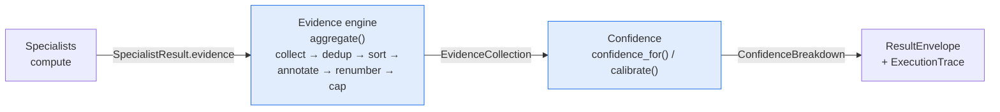
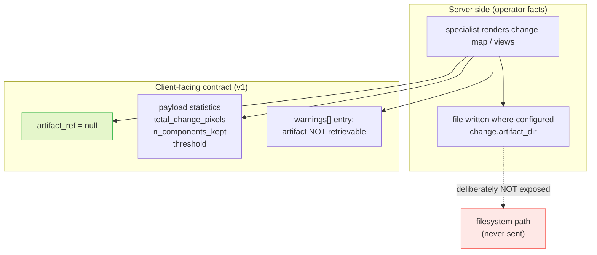
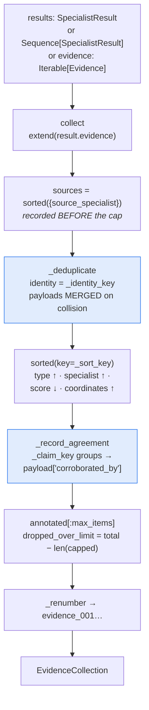
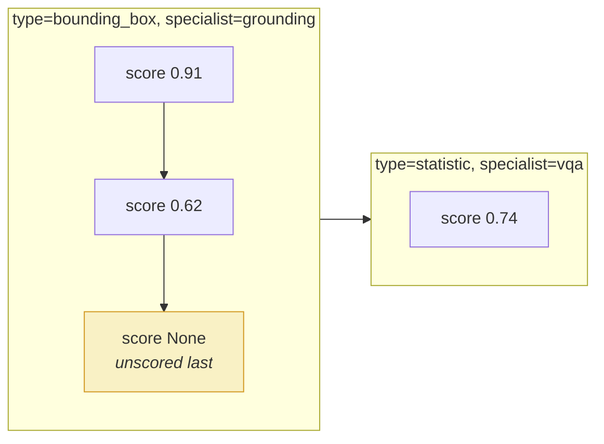
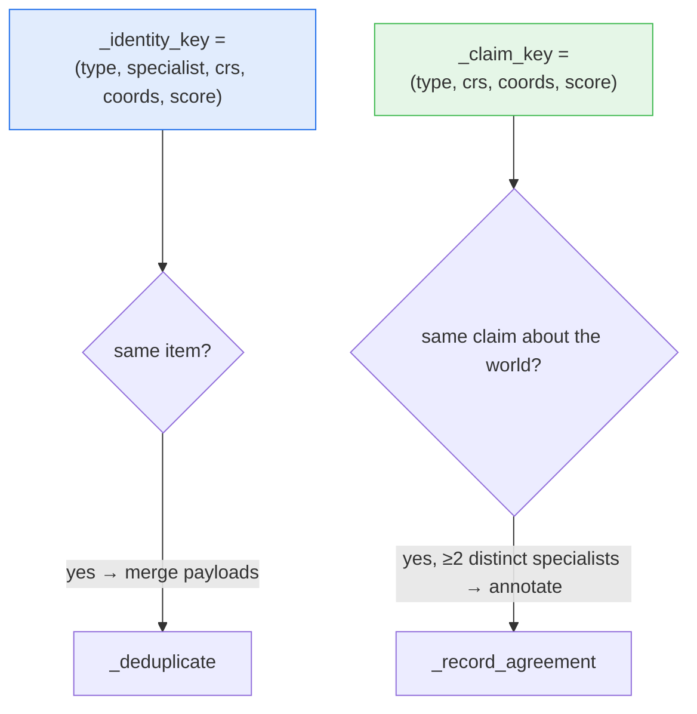
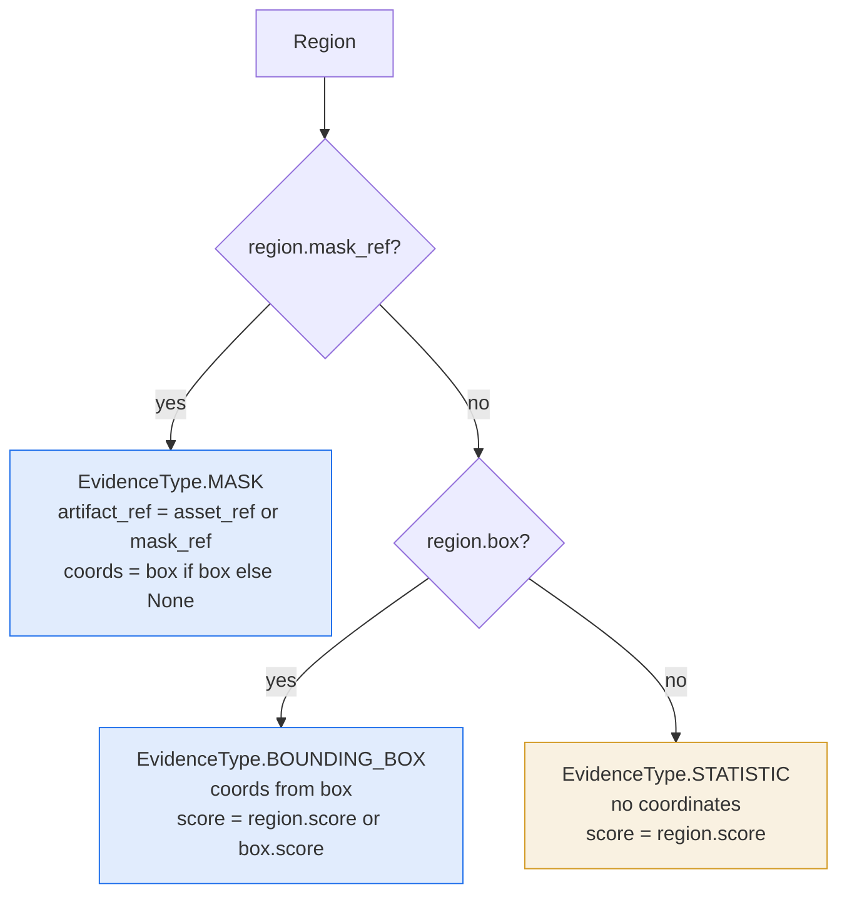
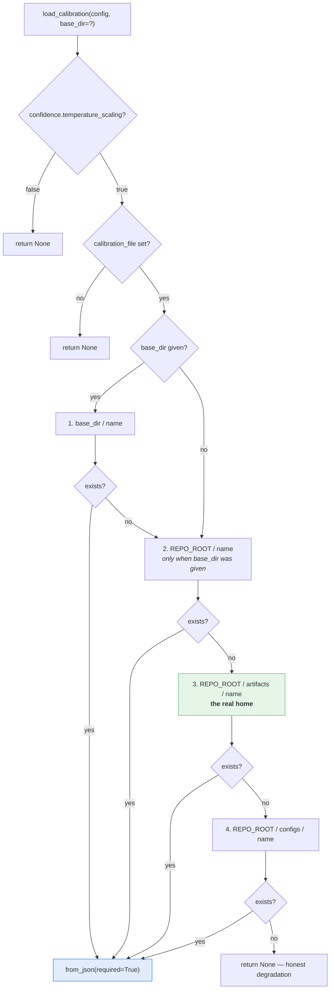
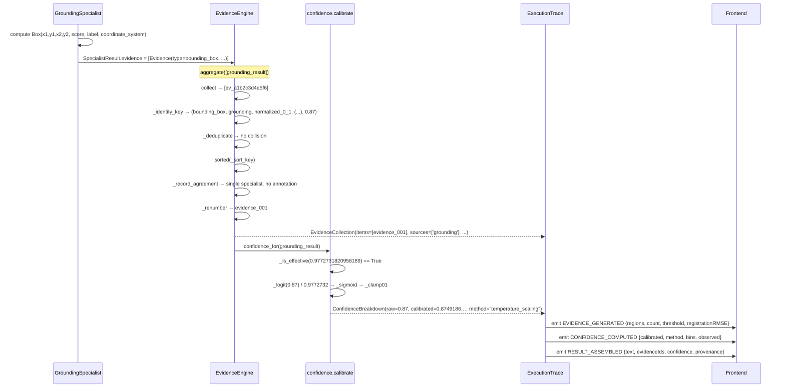

# 06 — Evidence and Confidence

**Parent:** [Architecture hub](README.md) · **Sibling chapters:**
[01 System overview](01-system-overview.md) · [05 Specialists](05-specialists.md) ·
[07 Configuration freeze](07-configuration-freeze.md)

**Primary sources read for this chapter (all under `C:/Users/anish/satquery-ai/`):**

| Source | What it establishes here |
|---|---|
| `evidence/engine.py` (714 lines) | the aggregation pipeline, purity contract, identity/sort/claim keys, `_deduplicate`, `_record_agreement`, `_renumber`, `evidence_type_for`, `evidence_from_box/region/geospatial`, `confidence_for`, `evidence_digest` |
| `evidence/confidence.py` (434 lines) | the honesty rule, `TemperatureCalibration`, `_is_effective`, `_logit`/`_sigmoid`, `_EPS`, `calibrate`, `calibrate_result`, `load_calibration` and its ordered candidate search |
| `core/schemas.py` (462 lines) | `Evidence`, `EvidenceType`, `ConfidenceBreakdown`, `ExecutionTrace`, `TraceStep`, `ModelRef`, `SpecialistResult`, `CoordinateSystem`, and every validator |
| `configs/base.yaml` (§`evidence`, §`confidence`) | `evidence.max_items: 32`, `confidence.temperature_scaling: true`, `confidence.calibration_file: calibration_v001.json` |
| `artifacts/calibration_v001.json` | the measured fitted temperature and the reliability diagram |
| `frontend/assets/js/core.js` | `SQ.EVENT_NAMES` — the eight execution events |
| `frontend/assets/js/mission.js` | `markState()` and the `.trace__fill` width formula |
| `docs/ARCHITECTURE_FREEZE.md` §1, §3, §5 | the layer verbs and the frozen non-negotiables |
| `docs/PHASE13_EVIDENCE_ENGINE.md` | the phase record for this package (77 tests) |
| `docs/API_CONTRACT.md` §2.4, §3.3, §4 | the client-facing shape of evidence and confidence |
| `docs/DEPLOYMENT_ARCHITECTURE.md` §5.5 | the F-16 owner ruling on artifact refs |
| `docs/STEP7_BACKEND_CHAIN_REPORT.md` §7, §8 | the measured calibration and evidence integration results |

---

## 1. Where this subsystem sits

`docs/ARCHITECTURE_FREEZE.md` §5 gives every layer exactly one verb:

> Router *understands*; policy engine *decides*; specialists *compute*; VLM *explains*;
> **evidence engine *proves*.**

Two consecutive stages implement that last verb:



The freeze §1 pipeline diagram places them adjacently:

```
   +---------+---------+---------+
   |         |         |         |
 VQA/CAP  GROUNDING  CHANGE   OPTICAL-SAR
   |         |         |         |
   +---------+---------+---------+
                 |
                 v
          Evidence engine          <- this chapter, part A
                 |
                 v
       Confidence calibration      <- this chapter, part B
                 |
                 v
          Result normaliser  ->  JSON + trace + PDF
```

**Division of labour, stated precisely.** `evidence/engine.py` does **not** re-derive any
specialist's claim. The module docstring is explicit (`evidence/engine.py:10-14`):

> This module is the "proves" step. Specialists each emit `Evidence` for what *they*
> computed (see `GroundingSpecialist._build_evidence`). This engine does not re-derive any
> of that. Its job is aggregation:
>
>     collect across specialists -> order -> deduplicate -> renumber -> bound

**Status of this subsystem.**

| Component | Status | Basis |
|---|---|---|
| Evidence aggregation | `IMPLEMENTED` + `VERIFIED` | `evidence/engine.py`; 77 tests in `tests/unit/test_evidence_engine.py` (`docs/PHASE13_EVIDENCE_ENGINE.md` §7) |
| Dedup / ordering / renumber / cap | `IMPLEMENTED` + `VERIFIED` | pinned by named tests (`docs/PHASE13_EVIDENCE_ENGINE.md` §2.2–§2.5) |
| Confidence honesty rule (uncalibrated pass-through) | `IMPLEMENTED` + `VERIFIED` | `evidence/confidence.py:296-311` |
| Temperature-scaling transform | `IMPLEMENTED` + `VERIFIED` | monotonicity + endpoint-safety tests (`docs/PHASE13_EVIDENCE_ENGINE.md` §3.3) |
| Calibration artifact fitted | `MEASURED` | `artifacts/calibration_v001.json` |
| Calibration **improves** ECE | **`REJECTED` — it does not** | ECE 0.013755 → 0.014929 (worse); see §7 |
| Evidence engine wired into the controller | `IMPLEMENTED` (Phase 14) | `docs/PHASE13_EVIDENCE_ENGINE.md` §8 recorded it as "not yet wired"; the live run path emits the eight events (§9) |
| Artifact rendering / retrieval | `OPEN` — deliberately `null` in v1 | F-16 ruling, §3.2 |

---

# Part A — The evidence schema

## 2. `Evidence` — the canonical record

`Evidence` is defined once, in `core/schemas.py:216-253`. Every specialist emits it; nothing
invents a second shape (`docs/ARCHITECTURE_FREEZE.md` §3: *"Single schema for every
specialist. No specialist invents its own shape."*).

```python
class Evidence(BaseModel):
    model_config = ConfigDict(extra="forbid")

    evidence_id: str = Field(default_factory=lambda: _new_id("ev"))
    type: EvidenceType
    source_specialist: str
    coordinate_system: CoordinateSystem | None = None
    coordinates: list[float] | None = None
    score: float | None = Field(default=None, ge=0.0, le=1.0)
    artifact_ref: str | None = Field(
        default=None,
        description=(
            "Reference to an externally retrievable artifact. NEVER a "
            "filesystem path (F-16, owner ruling 2026-09-23): v1 exposes no "
            "artifact-serving endpoint, so this is null unless a deployment "
            "supplies a client-fetchable reference. An artifact may still be "
            "written server-side where configured; being written is not the "
            "same as being retrievable."
        ),
    )
    payload: dict[str, Any] = Field(default_factory=dict)
```

### 2.1 Every field, exhaustively

| Field | Type | Required | Default | Meaning | Note |
|---|---|---|---|---|---|
| `evidence_id` | `str` | no | `_new_id("ev")` → `ev_<12 hex>` | the item's identity | **run-local**, engine-assigned after aggregation (§5.8); a uuid before that |
| `type` | `EvidenceType` | **yes** | — | the *kind* of proof | closed 11-member enum, §3 |
| `source_specialist` | `str` | **yes** | — | which specialist made this claim | a **single string**, not a set — this is load-bearing, §5.7 |
| `coordinate_system` | `CoordinateSystem \| None` | no | `None` | the frame the coordinates live in | **mandatory in practice** for spatial types — see the validator, §4 |
| `coordinates` | `list[float] \| None` | no | `None` | the geometry | a flat list; a box is `[x1, y1, x2, y2]` |
| `score` | `float \| None` | no | `None` | reliability, bounded | `ge=0.0, le=1.0` — Pydantic rejects out-of-range |
| `artifact_ref` | `str \| None` | no | `None` | a *retrievable* artifact reference | **always `null` in v1** — §2.3 |
| `payload` | `dict[str, Any]` | no | `{}` | observations that *support* the claim without being it | where `corroborated_by` is written, §5.7 |

### 2.2 What `Evidence` deliberately does **not** have

These absences are load-bearing; each one is why a downstream design decision exists.

| Absent field | Why it is absent | Consequence |
|---|---|---|
| any ordering field (`index`, `rank`, `order`) | the engine owns order; a specialist must not pre-empt it | order is defined by `_sort_key`, §5.6 |
| `value` | the field is called **`score`** | `docs/PHASE19_FINAL_HARDENING.md` §3.6 records that the docs once said `value` and that was one of nine validated defects |
| `source` | the field is called **`source_specialist`** | same defect class; a frontend using `source` renders nothing |
| `summary` | not in the schema | same defect class |
| `contributing_specialists: list[str]` | **proposed and NOT adopted** | see §5.7 and `docs/PHASE13_EVIDENCE_ENGINE.md` §5 |
| `label` at top level | labels live in `payload` | `evidence_from_box` writes `payload["label"]` |
| a `retrievable` boolean | retrieval is not a v1 capability | `artifact_ref` being `null` *is* the signal, §2.3 |

`model_config = ConfigDict(extra="forbid")` is what makes all of the above enforceable: a
response carrying `value` instead of `score` is a **422**, not a silently-ignored key. The
conformance test asserts this directly — `docs/STEP7_BACKEND_CHAIN_REPORT.md` §D records
"`extra="forbid"` on all eight client-facing models; `GeoMetadata` is the one documented
`extra="allow"` exception."

### 2.3 `artifact_ref` is permanently `null` in v1 — owner ruling F-16

This is the single most mis-documented field in the system, and the ruling is recorded in
three places: the field's own `description` (`core/schemas.py:225-235`), the client contract
(`docs/API_CONTRACT.md` §2.4 "Artifact refs — `null` in v1, and why"), and the audit
(`docs/DEPLOYMENT_ARCHITECTURE.md` §5.5).

**The ruling (F-16, owner, 2026-09-23): never expose filesystem paths.**

`docs/API_CONTRACT.md:586-602` states the contract in full:

> **Every `artifact_ref` and `change_map` in a v1 response is `null`.** This is a deliberate
> contract, not a missing value.
>
> F-16 (owner ruling 2026-09-23): **never expose filesystem paths.** The specialists *do*
> render their artifacts — the change map and the optical/SAR views are written
> server-side — but their location is an operator fact, not a client-facing one. A response
> that carried the server's path would disclose the deployment's directory layout to an
> unauthenticated caller, and nothing the frontend can do requires it.
>
> **No `artifact://` URI is fabricated in its place.** v1 has **no artifact-serving
> endpoint**, so a URI would be a promise the service cannot keep — strictly worse than
> `null`, because the frontend would build a link that 404s.

The docstring's own phrasing is the crispest statement of the principle:

> **being written is not the same as being retrievable.**



**What replaces the ref** (`docs/API_CONTRACT.md:604-610`):

| Removed | Replaced by |
|---|---|
| `change_map` path | `null`, plus the change statistics in the CHANGE_MAP evidence's `payload` (`total_change_pixels`, `n_components_kept`, `threshold`) |
| view `artifact_ref` path | `null`, plus `payload.rendered` / `payload.retrievable` / `payload.retrieval` |
| — | an explicit `warnings[]` entry saying the artifact is **NOT retrievable** |

**Two live carriers, and the half-implementation that followed.** The audit records that the
ruling was initially applied to only one carrier
(`docs/DEPLOYMENT_ARCHITECTURE.md:361`):

> **Two live carriers** — `change` and `croma` — and **both** had to be brought into line:
> fixing only the `croma` carrier left the ruling half implemented.

`docs/STATUS.md:21` names the lesson: *"The finding worth carrying forward: the F-16 ruling
was HALF IMPLEMENTED, and the suite was green."*

**F-16c — the consequence the fix introduced, measured and left open.** The ruling removed a
proxy and thereby changed a `degraded` signal. The `SpecialistResult` validator used to read
(`core/schemas.py:362-372`, retained as a comment):

```python
if self.task is Task.CHANGE and self.change_map is None and not self.regions:
    ... "change analysis produced no spatial output" ... degraded = True
```

`change_map` was a *proxy* for "a map was produced". With the ref permanently `null`, the
clause collapsed to `not regions`, and a **successful no-change analysis began reporting
`degraded: true`**. The clause was therefore **removed** under ruling F-16c
(`core/schemas.py:362-395`). The comment left in its place is worth quoting because it states
the reasoning better than a summary could:

> That conflated two different things, and the conflation WAS the defect. `degraded` means
> "the analysis could not be fully performed": no trained detector, or co-registration too
> poor to support a spatial claim. Both are set by the specialist itself
> (`specialists/change/specialist.py:345` and `:365`) and neither is this validator's to
> invent. **"No change was detected" is a NORMAL, successful outcome.**

And, on why no replacement clause was added:

> No replacement clause is added, deliberately. A narrower "empty answer => degraded" rule
> was tried and backed out: it is not what the ruling asked for, it invented a semantic the
> specialist already owns, and it made a pre-existing, unrelated fixture
> (`test_change_with_regions_is_not_degraded`, a result with regions and no answer) fail. **A
> fix that forces edits to tests it has nothing to do with is signalling over-reach, not
> diligence.** CHANGE is the one task whose `degraded` flag is now set entirely by its
> specialist.

**Status:** F-16 `CLOSED` (both carriers conform). F-16c `RESOLVED` by clause removal — the
narrower replacement rule is `REJECTED`. `mask_ref` is *not* an exemption: the audit
corrected an earlier working note that had listed it alongside `artifact_ref`
(`docs/DEPLOYMENT_ARCHITECTURE.md:868-871`).

## 3. `EvidenceType` — the closed 11-member vocabulary

```python
class EvidenceType(str, Enum):
    IMAGE_CROP = "image_crop"
    TILE = "tile"
    BOUNDING_BOX = "bounding_box"
    MASK = "mask"
    CHANGE_MAP = "change_map"
    OPTICAL_VIEW = "optical_view"
    SAR_VIEW = "sar_view"
    JOINT_FEATURE_REGION = "joint_feature_region"
    STATISTIC = "statistic"
    GEOLOCATION = "geolocation"
    AVAILABILITY_MASK = "availability_mask"   # C-1: modality trust evidence
```

`core/schemas.py:65-76`. **All eleven members, with what each one asserts:**

| # | Member | Wire value | Asserts | Typically emitted by |
|---|---|---|---|---|
| 1 | `IMAGE_CROP` | `image_crop` | a rectangular raster crop exists | preprocessing / tiling |
| 2 | `TILE` | `tile` | one tile of the tiling policy was examined | `preprocessing/tiling.py` |
| 3 | `BOUNDING_BOX` | `bounding_box` | a rectangle locates a referent | grounding, change |
| 4 | `MASK` | `mask` | a per-pixel region exists | grounding, change |
| 5 | `CHANGE_MAP` | `change_map` | a bitemporal difference map exists | change specialist |
| 6 | `OPTICAL_VIEW` | `optical_view` | the optical rendering of an optical/SAR pair | optical-SAR specialist |
| 7 | `SAR_VIEW` | `sar_view` | the SAR rendering of an optical/SAR pair | optical-SAR specialist |
| 8 | `JOINT_FEATURE_REGION` | `joint_feature_region` | a region defined in CROMA's **joint** embedding space | optical-SAR specialist |
| 9 | `STATISTIC` | `statistic` | a measured scalar or count, with no geometry | VQA, caption, unsupported, and any geometry-less region |
| 10 | `GEOLOCATION` | `geolocation` | the raster is georeferenced and *where* it sits | geospatial layer |
| 11 | `AVAILABILITY_MASK` | `availability_mask` | which modality channels were actually available | sensor adapter (C-1) |

### 3.1 `availability_mask` — the member the freeze prose omits

`docs/ARCHITECTURE_FREEZE.md` §3's prose list of evidence types stops at ten members and does
**not** name `availability_mask`. The enum member is nevertheless real, and the engine says
so explicitly (`evidence/engine.py:441-447`):

> The members are exactly those of `core.schemas.EvidenceType`. The freeze's section 3 prose
> list omits `availability_mask`; that member is real (C-1: modality trust evidence) and is
> included here because **a missing member would otherwise force a wrong fallback.**

Its existence follows from finding C-1: the channel-availability mask is a first-class fusion
input and is **never** a CROMA input (`core/schemas.py:7`; `docs/PHASE0_CONTRACT_VALIDATION.md`
§1.2). Because the mask is a first-class *input*, it is also a first-class *observation* —
"these twelve optical channels were present and these two SAR channels were not" is a fact a
consumer can audit. `docs/API_CONTRACT.md:579` lists all eleven values for the frontend.

### 3.2 Which types are spatial

The engine's own validator names the spatial set (`core/schemas.py:240-247`) — this is the
authoritative list, not a prose paraphrase:

```python
spatial = {
    EvidenceType.BOUNDING_BOX,
    EvidenceType.MASK,
    EvidenceType.CHANGE_MAP,
    EvidenceType.TILE,
    EvidenceType.IMAGE_CROP,
    EvidenceType.JOINT_FEATURE_REGION,
}
```

| Type | Spatial? | Why |
|---|---|---|
| `BOUNDING_BOX` | **yes** | a box is meaningless without a frame |
| `MASK` | **yes** | pixels need a frame |
| `CHANGE_MAP` | **yes** | a map is a raster |
| `TILE` | **yes** | a tile is a rectangle of a raster |
| `IMAGE_CROP` | **yes** | a crop is a rectangle of a raster |
| `JOINT_FEATURE_REGION` | **yes** | a region in a feature grid still needs a frame |
| `STATISTIC` | no | a scalar has no geometry |
| `GEOLOCATION` | no *(by this validator)* | geo bounds are already self-describing via `payload["crs"]`; `evidence_from_geospatial` sets `CoordinateSystem.GEO` when bounds are given |
| `OPTICAL_VIEW` | no *(by this validator)* | a whole-frame view is not a sub-region claim |
| `SAR_VIEW` | no *(by this validator)* | as above |
| `AVAILABILITY_MASK` | no *(by this validator)* | a channel-presence vector is not spatial |

## 4. The validator that refuses coordinates without a frame

```python
@model_validator(mode="after")
def _spatial_needs_crs(self) -> "Evidence":
    spatial = {
        EvidenceType.BOUNDING_BOX,
        EvidenceType.MASK,
        EvidenceType.CHANGE_MAP,
        EvidenceType.TILE,
        EvidenceType.IMAGE_CROP,
        EvidenceType.JOINT_FEATURE_REGION,
    }
    if self.type in spatial and self.coordinates and self.coordinate_system is None:
        raise ValueError(
            f"evidence type '{self.type.value}' carries coordinates "
            "but no coordinate_system"
        )
    return self
```

`core/schemas.py:238-253`. Three things about this are deliberate:

1. **It is a `model_validator(mode="after")`, not a `field_validator`.** The rule is
   *cross-field* — it depends on `type`, `coordinates` and `coordinate_system` together, so
   it cannot be expressed on any single field.
2. **The trigger is `self.coordinates`, not `is not None`.** An empty list is falsy and does
   not trip the rule; a non-empty list does. A spatial item with **no** coordinates at all is
   legal (a `MASK` whose geometry lives only in a `mask_ref`).
3. **It raises rather than defaulting.** Defaulting to `normalized_0_1` would silently
   mislabel pixel or geo coordinates as normalized, which is the failure mode the finding
   exists to prevent. `docs/ARCHITECTURE_FREEZE.md` §3 puts the requirement bluntly:

   > Every spatial object carries `coordinate_system` ∈ `{normalized_0_1, pixel, geo}`.

`docs/ARCHITECTURE_FREEZE.md` §2.3 states the origin: internal box coordinates are
**normalised 0–1**, **always with an explicit `coordinate_system` field** (finding C-5).

### 4.1 `CoordinateSystem` — three values, exact spellings

```python
class CoordinateSystem(str, Enum):
    """Never omit this. A bare box is meaningless without it. (C-5)"""

    NORMALIZED_0_1 = "normalized_0_1"
    PIXEL = "pixel"
    GEO = "geo"
```

`core/schemas.py:57-62`.

| Member | Wire value | Frame |
|---|---|---|
| `NORMALIZED_0_1` | `normalized_0_1` | fractions of the frame, `[0, 1]` |
| `PIXEL` | `pixel` | integer-ish pixel indices |
| `GEO` | `geo` | a projected/geographic CRS named in `payload["crs"]` |

> **Documentation hazard, measured.** `docs/PHASE19_FINAL_HARDENING.md` §3.6 records that the
> docs once spelled these `normalized` / `geographic`. The real values are
> `normalized_0_1` / `geo`. *"A frontend using the documented names would send values the
> server rejects with 422."* `docs/STEP7_BACKEND_CHAIN_REPORT.md` §D confirms the live enum is
> exactly `{normalized_0_1, pixel, geo}`.

`Evidence`'s `coordinate_system` is `CoordinateSystem | None` — the field is optional *in
type* but effectively mandatory *in practice*, because the validator above enforces it for
every spatial type that carries coordinates.

---

# Part B — The aggregation pipeline

## 5. `EvidenceEngine.aggregate()` — collect → dedup → sort → annotate → renumber → cap

### 5.1 Why the module exists: three problems a specialist cannot solve

The module docstring enumerates them (`evidence/engine.py:18-36`); each is real and none is
fixable inside a single specialist:

| # | Problem | Why a specialist cannot fix it |
|---|---|---|
| 1 | **Stable identity** | `Evidence.evidence_id` defaults to a random uuid — fine within one result, useless once four specialists' evidence is merged into one trace. *"Nothing can be cited."* |
| 2 | **Order** | `Evidence` has no ordering field, so the collection's order follows **specialist completion order** — the same inputs produce different JSON on different runs. *"Pure functions must not do that, and this whole system's reproducibility argument rests on it."* |
| 3 | **Duplication** | the VQA specialist emits a `STATISTIC` carrying its answer, *and* that answer travels in `SpecialistResult.answer`; two specialists that georeference the same asset emit the same `GEOLOCATION`. *"Neither is wrong, and neither knows about the other."* |

### 5.2 The pipeline, in one place



The implementation, verbatim (`evidence/engine.py:324-350`):

```python
def _canonicalise(self, raw: Iterable[Evidence]) -> EvidenceCollection:
    """Dedup -> sort -> renumber -> cap. The whole pipeline, in one place."""
    items = list(raw)
    sources = sorted({item.source_specialist for item in items})

    deduped, dropped_duplicates = self._deduplicate(items)
    ordered = sorted(deduped, key=_sort_key)
    # Two specialists can make the same claim, and `deduplicate` keeps both
    # (different `source_specialist` -> different key). Record the agreement
    # now that ordering is fixed, so the annotation is part of the pure
    # pipeline rather than a post-hoc edit a caller might forget.
    annotated = self._record_agreement(ordered)

    total = len(annotated)
    capped = annotated[: self.max_items]
    dropped_over_limit = total - len(capped)

    return EvidenceCollection(
        items=[
            self._renumber(item, index) for index, item in enumerate(capped, start=1)
        ],
        sources=sources,
        dropped_duplicates=dropped_duplicates,
        dropped_over_limit=dropped_over_limit,
        total_before_limit=total,
        truncated=dropped_over_limit > 0,
    )
```

Note the ordering choice: **annotate comes after sort but before cap**. Annotating before
sorting would be equivalent (the annotation is a payload key, which is not in `_sort_key`),
but the docstring's stated reason is that the annotation must be *inside* the pure pipeline
rather than "a post-hoc edit a caller might forget".

### 5.3 The entry point and its argument rules

```python
def aggregate(
    self,
    results: SpecialistResult | Sequence[SpecialistResult] | None = None,
    *,
    evidence: Iterable[Evidence] | None = None,
) -> EvidenceCollection:
```

`evidence/engine.py:280-320`. Two argument invariants, both raising:

| Condition | Behaviour | Reason given in the docstring |
|---|---|---|
| both `results` and `evidence` are `None` | `ValueError("aggregate() requires results= or evidence=")` | there is nothing to aggregate |
| both are supplied | `ValueError("aggregate() accepts results= or evidence=, not both")` | ambiguity about precedence |
| empty list | returns an empty `EvidenceCollection` | *"Never raises on empty input."* |

**Only `result.evidence` is read.** The docstring explains why reading both forms would
double-count (`evidence/engine.py:292-297`):

> Specialists state their evidence twice — in `SpecialistResult.evidence` and via
> `Specialist.produce_evidence`, which currently delegates to the same list — so only
> `result.evidence` is read. Reading both would double-count every item and inflate the
> duplicate count.

### 5.4 The purity contract

```python
"""THE PURITY CONTRACT
-------------------
`aggregate` is pure and deterministic:

    * source results are never mutated -- `model_copy` is used to rebuild the
      collection rather than editing `Evidence.evidence_id` in place;
    * ids are assigned from the sorted position, not from input order;
    * dedup is order-insensitive by construction (the key is built from the
      sorted specialist list);
    * no clock, no RNG, no I/O.

Same inputs -> byte-identical output. `tests/unit/test_evidence_engine.py`
pins this.
"""
```

`evidence/engine.py:38-50`.

| Property | Mechanism | Pinned by |
|---|---|---|
| source non-mutation | `model_copy(update={...})` at every write — `_renumber` (`:430`), payload merge (`:385`), agreement (`:424`) | *"the original keeps its uuid and the aggregated copy is a different object"* (`docs/PHASE13_EVIDENCE_ENGINE.md` §2.1) |
| ids from sorted position | `enumerate(capped, start=1)` after `sorted(...)` | §5.8 |
| order-insensitive dedup | key content-only; `_record_agreement` sorts `names` | §5.5, §5.7 |
| no clock / RNG / I/O | the module imports only `hashlib`, `collections.abc`, `dataclasses`, `typing` | `evidence/engine.py:80-102` |

The dedup merge rebuilds rather than mutates, and the comment says why
(`evidence/engine.py:379-382`):

> Survivor's own keys win; the loser only fills gaps. Mutating the survivor in place would be
> fine here because `merged` holds the same object, but rebuilding keeps the "never mutate a
> source result" contract true even if the caller kept a reference.

### 5.5 Deduplication — identity is *defined*, not assumed

The module docstring (`evidence/engine.py:52-68`) states the principle:

> `Evidence.evidence_id` is a uuid default, so it cannot be part of an identity key — two
> structurally identical items from two runs would never dedup. The key is therefore the
> *content* of the observation.

```python
def _identity_key(item: Evidence) -> tuple[Any, ...]:
    coords = (
        tuple(_round(c) for c in item.coordinates)
        if item.coordinates is not None
        else None
    )
    return (
        item.type.value,
        item.source_specialist,
        item.coordinate_system.value if item.coordinate_system else None,
        coords,
        _round(item.score),
    )
```

`evidence/engine.py:125-142`.

| Key component | Included? | Rationale |
|---|---|---|
| `type` | **yes** | a box and a mask are different claims even at the same coordinates |
| `source_specialist` | **yes** | keeps two specialists' identical claims as two items (§5.7) |
| `coordinate_system` | **yes** | the same four numbers in `pixel` and in `geo` are different claims |
| rounded `coordinates` | **yes** | disagreeing geometry ⇒ two claims; suppressing it would be a silent contradiction |
| rounded `score` | **yes** | different reliability is a different observation |
| `evidence_id` | **NO** | *"including it would mean dedup never fires in production"* |
| `payload` | **NO** | *"a detail of the claim, not a different claim"* |
| `artifact_ref` | **NO** | *"two renderings of one claim are still one claim"* |

The docstring on the exclusions is the clearest statement of intent
(`evidence/engine.py:60-68`):

> `payload` and `artifact_ref` are deliberately EXCLUDED. Two items that agree on the same
> geolocation, one carrying a `crs` in its payload and one not, have made the same claim
> about the world; deduplicating them is correct, and the surviving item's payload is merged
> with the discarded one's so the `crs` is not lost. Conversely two items that share a type
> and score but disagree on coordinates are two different claims and are both kept — which
> matters, because **suppressing a spatial disagreement would be exactly the silent
> contradiction the freeze forbids.**

**The rounding constant.**

```python
#: Rounding applied before an evidence item is turned into a dedup key. Six
#: decimals on normalized coordinates is ~1e-6 of the frame, far below any
#: meaningful spatial difference, but enough to absorb float noise from two
#: specialists rounding the same value two different ways.
_KEY_PRECISION = 6

def _round(value: float | None) -> float | None:
    return None if value is None else round(float(value), _KEY_PRECISION)
```

`evidence/engine.py:114-122`. `_round` is `None`-safe: a `None` coordinate stays `None` and
does not become `0.0` in the *identity* key (unlike the sort key, §5.6, where a missing
coordinate becomes `0.0` because a total order needs a value).

**Payloads are MERGED on collision.**

```python
dropped += 1
# Survivor's own keys win; the loser only fills gaps.
payload = {**item.payload, **existing.payload}
if payload != existing.payload:
    updated = existing.model_copy(update={"payload": payload})
    seen[key] = updated
    merged[merged.index(existing)] = updated
```

`evidence/engine.py:378-387`. The spread order is `{**loser, **survivor}` — because Python
dict unpacking is last-wins, `existing.payload` (the survivor's) overrides the loser's on
key collision. This is the "survivor's own keys win; the loser only fills gaps" rule
expressed directly in the merge order.

| Behaviour | Result |
|---|---|
| survivor had `crs`, loser did not | survivor's `crs` survives |
| loser had `crs`, survivor did not | `crs` is **filled in** from the loser — the information is not lost |
| both had `crs` with different values | survivor's wins; the loser's value is dropped |
| no payload difference | no `model_copy` is performed (the `if payload != existing.payload` guard) |

`docs/PHASE13_EVIDENCE_ENGINE.md` §2.3 names the test that pins this:
`test_deduplication_ignores_payload_differences_and_merges_them`.

**What dedup does *not* merge.** Because the key includes `source_specialist`, *"only
same-specialist repeats are merged here; two specialists agreeing is handled by
`_record_agreement`, which preserves the second specialist's identity rather than discarding
it"* (`evidence/engine.py:356-361`).

### 5.6 The total sort order — and why each level exists

```python
def _sort_key(item: Evidence) -> tuple[Any, ...]:
    if item.score is None:
        score_key: tuple[int, float] = (1, 0.0)
    else:
        score_key = (0, -float(item.score))
    coords = (
        tuple(_round(c) or 0.0 for c in item.coordinates)
        if item.coordinates is not None
        else ()
    )
    return (item.type.value, item.source_specialist, score_key, coords)
```

`evidence/engine.py:165-190`.

| # | Key | Direction | Why it exists (verbatim from the docstring) |
|---|---|---|---|
| 1 | `type` | ascending | *"groups like with like, so a reader sees all the boxes together"* |
| 2 | `source_specialist` | ascending | *"stable and meaningful, unlike the uuid"* |
| 3 | `score` | **descending** | *"within a type, the strongest claim leads"* — implemented as `-score` so the tuple stays uniformly ascending |
| 4 | `coordinates` | ascending | *"the tie-breaker that makes the order total. Without it two items of the same type, specialist and score would sort by Python's stable-sort insertion order, which reintroduces input-order dependence."* |

`docs/PHASE13_EVIDENCE_ENGINE.md` §2.2 restates key 4 and names the pinning test:

> Key 4 is not decoration. Without it, two items of the same type, specialist and score would
> sort by Python's stable-sort insertion order — which reintroduces exactly the input-order
> dependence the sort exists to remove. Pinned by
> `test_equal_scores_order_deterministically_by_coordinates`.

**Unscored items sort last.** *"Items with no score sort AFTER items with a score: a missing
score is not evidence of strength."* (`evidence/engine.py:178-179`). The mechanism is a
`(0, …)` / `(1, …)` discriminator in `score_key`: a scored item leads with `0`, an unscored
item leads with `1`, so every scored item precedes every unscored item **within the same
`(type, specialist)` group**.



### 5.7 `_record_agreement` — corroboration, and why nothing is ever removed

**The problem.** `source_specialist` is a single `str`, not a set (the schema is frozen), so
two specialists making the same claim are two *different* items under `_identity_key` and
**both survive**. The docstring calls this *"the correct conservative behaviour"*
(`evidence/engine.py:70-77`):

> That is the correct conservative behaviour: collapsing them would require the engine to pick
> a winner, and the engine has no basis for that. What it does instead is keep both and record
> the disagreement-free agreement in the collection's `sources` and in each item's `payload`
> via `_record_agreement`.

**The claim key — deliberately distinct from the identity key.**

```python
def _claim_key(item: Evidence) -> tuple[Any, ...]:
    """Identity of the *claim*, ignoring which specialist made it.

    Used only to detect corroboration. Deliberately distinct from
    `_identity_key`: that one answers "is this the same item", this one answers
    "are these two specialists saying the same thing about the world".
    """
    coords = (
        tuple(_round(c) for c in item.coordinates)
        if item.coordinates is not None
        else None
    )
    return (
        item.type.value,
        item.coordinate_system.value if item.coordinate_system else None,
        coords,
        _round(item.score),
    )
```

`evidence/engine.py:145-162`. The **only** difference from `_identity_key` is the absent
`source_specialist` component.



**The annotation.**

```python
AGREEMENT_KEY = "corroborated_by"

...
out = list(items)
for indexes in groups.values():
    if len(indexes) < 2:
        continue
    names = sorted({items[i].source_specialist for i in indexes})
    if len(names) < 2:
        # Same specialist restating itself across the collection. The
        # identity key would normally have merged these, so reaching
        # here means the payloads differed; it is not corroboration.
        continue
    for i in indexes:
        item = out[i]
        others = [n for n in names if n != item.source_specialist]
        payload = {**item.payload, EvidenceCollection.AGREEMENT_KEY: others}
        out[i] = item.model_copy(update={"payload": payload})
return out
```

`evidence/engine.py:391-425`.

**Why the payload, and not a schema field.** The constant's own comment states it
(`evidence/engine.py:234-238`):

> Payload key under which `_record_agreement` stashes the specialists that made the identical
> claim. **A single string field cannot hold a set, so the agreement is recorded in the
> payload** — which is exactly what the payload is for: observations that support the evidence
> but are not the claim.

The `contributing_specialists: list[str]` field that would have made this first-class was
**proposed and rejected** — `docs/PHASE13_EVIDENCE_ENGINE.md` §5 records the full
ARCHITECTURE CHANGE entry. The three reasons:

| # | Reason |
|---|---|
| 1 | Adding a field is a frozen-contract change, and the freeze rule requires evidence that the current design is insufficient. No such evidence exists: identity comes from `evidence_id`; provenance is already served by `EvidenceCollection.sources` + `Evidence.source_specialist`; corroboration is recorded in `payload["corroborated_by"]`. |
| 2 | Because `source_specialist` is a single string, two specialists making the identical claim are two items and **both survive**. Collapsing them would require the engine to pick a winner, and the engine has no basis for that. |
| 3 | Reversing this later is cheap: the engine already computes `_claim_key()`, which groups items by claim ignoring the specialist. Adopting the field would mean emitting one item per group instead of N. |

**Decision: proposal `REJECTED`; `core/schemas.py` unchanged.** Adopted interim =
`source_specialist` (single) + `EvidenceCollection.sources` (run-level provenance) +
`payload["corroborated_by"]` (per-claim corroboration). *"Revisit only if a downstream
consumer needs corroboration as a first-class, queryable field."*

**Nothing is ever removed.** The docstring is unambiguous (`evidence/engine.py:401-403`):

> **Nothing is removed:** dropping a member would throw away a specialist's attribution, and
> the freeze does not permit silently discarding a specialist's evidence.

**The two guards inside the loop** are worth naming because they are the two ways a
non-corroboration could masquerade as one:

| Guard | Condition | Why |
|---|---|---|
| group size | `len(indexes) < 2` → skip | a lone item is not agreement |
| distinct specialists | `len(names) < 2` → skip | the same specialist restating itself is *not* corroboration; if this is reached, the payloads differed (otherwise `_identity_key` would have merged them) |

`corroborated_by` is always the **other** specialists (`others = [n for n in names if n !=
item.source_specialist]`), so an item never lists itself.

**Excluded from the digest.** *"The corroboration annotation in the payload IS excluded,
because it is a derived observation about the collection, not part of the claim."*
(`evidence/engine.py:692-693`) — consistent with `payload` being excluded from
`_identity_key`.

### 5.8 Renumbering to `evidence_001…`

```python
ID_PREFIX = "evidence"

@staticmethod
def _renumber(item: Evidence, index: int) -> Evidence:
    """Give one item its canonical id, leaving the source untouched."""
    return item.model_copy(update={"evidence_id": f"{ID_PREFIX}_{index:03d}"})
```

`evidence/engine.py:104-107`, `:427-430`.

| Property | Value | Reason |
|---|---|---|
| format | `evidence_001` … | zero-padded to three digits |
| why three digits | *"so lexical sort matches numeric sort up to 999 items -- well past the `evidence.max_items` bound of 32"* (`:104-107`) |
| assignment basis | **sorted position**, not input order | `enumerate(capped, start=1)` after `sorted` |
| scope | **run-local** | *"Ids restart at `001` for each `aggregate` call — they are run-local citations, not global identities."* (`docs/PHASE13_EVIDENCE_ENGINE.md` §2.4) |
| source untouched | `model_copy` | the source keeps its `ev_<uuid>` |

**Why this matters at all** (`evidence/engine.py:21-25`):

> `Evidence.evidence_id` defaults to a random uuid, which is fine within one result but
> useless when the controller merges four specialists' evidence into the trace of a single
> run. Nothing can be cited. The engine renumbers to `evidence_001`, `evidence_002`, … so a
> downstream artefact (report, UI, audit) can reference one item deterministically.

### 5.9 The cap, and loss accounting that is never silent

```python
DEFAULT_MAX_ITEMS = 32
```

`evidence/engine.py:109-112`, mirroring `configs/base.yaml`:

```yaml
evidence:
  max_items: 32
  coordinate_system_default: normalized_0_1
```

`EvidenceEngine.__init__` **refuses** a non-positive cap (`evidence/engine.py:267-276`):

```python
if max_items < 1:
    raise ValueError(f"max_items must be >= 1, got {max_items}")
```

> a cap of zero would silently discard every piece of evidence, which is a policy decision
> this engine has no business making on its own. (`evidence/engine.py:258-261`)

**The accounting fields, all five:**

| Field | Type | Meaning | Non-zero means |
|---|---|---|---|
| `sources` | `list[str]` | sorted specialist names that contributed anything, **BEFORE** the cap | provenance — *"Provenance is a property of the run, not of the surviving items."* |
| `dropped_duplicates` | `int` | items merged into an existing claim | **normal and healthy** — two specialists agreed |
| `dropped_over_limit` | `int` | items the cap discarded | **a warning** — a specialist's evidence did not survive |
| `total_before_limit` | `int` | deduplicated count prior to capping | the denominator for the two drop counts |
| `truncated` | `bool` | `dropped_over_limit > 0` | a boolean summary so a trace can branch without recomputing |

`evidence/engine.py:196-217`; restated in `docs/PHASE13_EVIDENCE_ENGINE.md` §2.5.

> Losses are **counted, never silent**.

And on why `sources` is recorded pre-cap:

> `sources` is recorded pre-cap deliberately: provenance is a property of the *run*, not of
> the surviving items. A specialist whose evidence did not fit under the cap still ran, and
> the trace must still say so. (`docs/PHASE13_EVIDENCE_ENGINE.md` §2.5)

This is the same principle as `core/config.py`'s refusal to silently truncate and
`evidence/confidence.py`'s refusal to fabricate a number: **a bounded output must declare
what the bound cost.**

### 5.10 `EvidenceCollection` — the returned container

```python
@dataclass(frozen=True)
class EvidenceCollection:
    items: list[Evidence] = field(default_factory=list)
    sources: list[str] = field(default_factory=list)
    dropped_duplicates: int = 0
    dropped_over_limit: int = 0
    total_before_limit: int = 0
    truncated: bool = False
```

`evidence/engine.py:193-250`. It is `frozen=True` — a dataclass decorator that blocks
attribute *rebinding* on the collection, complementing the `model_copy` discipline that keeps
the individual `Evidence` items unmutated.

| Method | Returns | Purpose |
|---|---|---|
| `__len__` | `int` | `len(items)` |
| `__iter__` | iterator | iterate the items directly |
| `ids()` | `list[str]` | `[item.evidence_id for item in self.items]` |
| `by_type(t)` | `list[Evidence]` | filter by `EvidenceType` (identity comparison: `item.type is evidence_type`) |
| `by_specialist(name)` | `list[Evidence]` | filter by `source_specialist` |
| `summary()` | `dict[str, Any]` | the observable trace facts |
| `AGREEMENT_KEY` | `"corroborated_by"` | the payload key for corroboration |

**`summary()` — the trace-facing view.**

```python
def summary(self) -> dict[str, Any]:
    """Observable trace facts. No chain-of-thought, no interpretation."""
    return {
        "returned": len(self.items),
        "total_before_limit": self.total_before_limit,
        "dropped_duplicates": self.dropped_duplicates,
        "dropped_over_limit": self.dropped_over_limit,
        "truncated": self.truncated,
        "sources": list(self.sources),
        "types": sorted({item.type.value for item in self.items}),
    }
```

`evidence/engine.py:240-250`. Note `types` is a **sorted set** of the type *values* actually
present in the surviving items — so a consumer can see which evidence kinds survived the cap
without walking the list. The docstring's first line is a constraint, not a description: *"No
chain-of-thought, no interpretation."* This mirrors `docs/ARCHITECTURE_FREEZE.md` §5's *"Every
result carries an observable execution trace. No chain-of-thought."*

### 5.11 `evidence_digest()` — reproducibility as an assertion

```python
def evidence_digest(collection: EvidenceCollection | Sequence[Evidence]) -> str:
    items = (
        collection.items
        if isinstance(collection, EvidenceCollection)
        else list(collection)
    )
    hasher = hashlib.sha256()
    for item in items:
        hasher.update(repr(_identity_key(item)).encode("utf-8"))
        hasher.update(b"\n")
    return hasher.hexdigest()
```

`evidence/engine.py:680-704`.

| Design choice | Consequence |
|---|---|
| built from `_identity_key`, **in order** | changes when the *claims* change |
| **not** from `evidence_id` | does **not** change when a specialist restates the same claim under a new uuid |
| **not** from `payload` | payload is a detail of the claim, not the claim |
| `repr(...)` + `b"\n"` separator | unambiguous framing; no two distinct sequences can hash the same |
| corroboration annotation excluded | *"it is a derived observation about the collection, not part of the claim"* |

The docstring states the contract it enables (`evidence/engine.py:687-690`):

> That is what makes it useful as a reproducibility assertion:
>
>     aggregate(inputs_a) is reproducible iff digest(a) == digest(b)
>
> against the same input, **even across processes where the uuid defaults differ.**

### 5.12 The canonical vocabulary: `evidence_type_for`

```python
@staticmethod
def evidence_type_for(result: SpecialistResult) -> EvidenceType:
    from core.schemas import Task

    mapping = {
        Task.GROUNDING: EvidenceType.BOUNDING_BOX,
        Task.CHANGE: EvidenceType.CHANGE_MAP,
        Task.OPTICAL_SAR: EvidenceType.JOINT_FEATURE_REGION,
        Task.VQA: EvidenceType.STATISTIC,
        Task.CAPTION: EvidenceType.STATISTIC,
        Task.UNSUPPORTED: EvidenceType.STATISTIC,
    }
    return mapping.get(result.task, EvidenceType.STATISTIC)
```

`evidence/engine.py:434-458`.

> This is the ONE place that knows the mapping from specialist task to evidence vocabulary, so
> no specialist needs to branch on it. Note it returns the *primary* type; a specialist's own
> `produce_evidence` emits its real per-artefact types, and those are preserved by `aggregate`.

| Task | Primary `EvidenceType` | Why |
|---|---|---|
| `grounding` | `BOUNDING_BOX` | the task *is* localisation |
| `change` | `CHANGE_MAP` | the task *is* a change map |
| `optical_sar` | `JOINT_FEATURE_REGION` | the claim lives in CROMA's joint embedding space |
| `vqa` | `STATISTIC` | an answer is a measured scalar, not geometry |
| `caption` | `STATISTIC` | as above |
| `unsupported` | `STATISTIC` | there is no claim to localise |
| *(fallback)* | `STATISTIC` | `.get(..., STATISTIC)` — an unknown task degrades to a non-spatial claim rather than a wrong spatial one |

**`change_vqa` is absent from the mapping.** `Task.CHANGE_VQA` exists in the enum
(`core/schemas.py:46`) but has no row, so it falls through to `STATISTIC` — which is correct:
change-VQA returns a short *answer*, not a map. The docstring's note that this returns the
*primary* type matters here: a change-VQA result may still carry `CHANGE_MAP` evidence
emitted by the detector it shares, and `aggregate` preserves that.

### 5.13 The three `evidence_from_*` constructors

These exist so the controller does not hand-build `Evidence` objects — the module docstring
calls them *"Convenience for the controller when it needs evidence for a box that a specialist
emitted but did not itself describe."*

#### `evidence_from_box`

```python
def evidence_from_box(self, box, *, source_specialist, payload=None, asset_ref=None) -> Evidence:
    return Evidence(
        type=EvidenceType.BOUNDING_BOX,
        source_specialist=source_specialist,
        coordinate_system=box.coordinate_system,
        coordinates=[box.x1, box.y1, box.x2, box.y2],
        score=box.score,
        artifact_ref=asset_ref,
        payload={"label": box.label, **(payload or {})},
    )
```

`evidence/engine.py:462-485`.

> The `coordinate_system` is copied from the box, **never assumed** — `core.schemas` requires
> it and `Evidence` rejects spatial coordinates without one.

The coordinates are flattened to `[x1, y1, x2, y2]` — matching the flat-`Box` shape that
`docs/PHASE19_FINAL_HARDENING.md` §3.6 records as a corrected documentation defect.

#### `evidence_from_region` — a three-way branch

`evidence/engine.py:487-540`. A region may carry a mask, a box, both, or neither, and each
case maps to a different evidence type:



> A region carrying a mask reference becomes `MASK` evidence; one with only a box becomes
> `BOUNDING_BOX` evidence. A region with neither is reported as a `STATISTIC` **rather than a
> spatial claim, because there is no geometry to prove.** (`evidence/engine.py:496-500`)

Two details worth naming:

- The `MASK` branch's `coordinates` are `None` when `region.box is None` — a mask without a
  bounding box is legal, and the validator (§4) only fires when coordinates are *present*.
- The `BOUNDING_BOX` branch reads `coordinate_system` from **`region.box.coordinate_system`**
  (the box's own frame), not from `region.coordinate_system`. The frame of the geometry is
  the frame of the geometry.

#### `evidence_from_geospatial` — may return `None`

```python
def evidence_from_geospatial(self, geo, *, source_specialist, bounds=None, score=None) -> Evidence | None:
    if not geo.has_crs and not geo.crs:
        return None
    return Evidence(
        type=EvidenceType.GEOLOCATION,
        source_specialist=source_specialist,
        coordinate_system=CoordinateSystem.GEO if bounds else None,
        coordinates=list(bounds) if bounds else None,
        score=score,
        payload={
            "crs": geo.crs,
            "bounds": list(geo.bounds) if geo.bounds else None,
            "width": geo.width,
            "height": geo.height,
            "is_georeferenced": geo.is_georeferenced,
        },
    )
```

`evidence/engine.py:542-572`.

> Returns `None` when there is no CRS to report. Emitting a `GEOLOCATION` item without a CRS
> would assert a placement the data does not support, which is the same failure mode the
> grounding degenerate-box guard exists to prevent.

This is the honesty rule applied to geometry: **a claim that cannot be supported is not
emitted, rather than emitted with a placeholder.** Note the guard is `not geo.has_crs and not
geo.crs` — either signal is sufficient, so a raster that reports a CRS string without the
`has_crs` flag still produces evidence.

## 6. `confidence_for()` — calibrating through the engine's artifact

```python
def confidence_for(
    self,
    result: SpecialistResult | ConfidenceBreakdown,
    *,
    extra_components: dict[str, float] | None = None,
    degraded: bool | None = None,
    degradation_reason: str | None = None,
) -> ConfidenceBreakdown:
```

`evidence/engine.py:576-637`. It accepts either form so *"a caller that already has the pieces
does not rebuild a `SpecialistResult` to use it."*

**The degradation rule — the specialist's verdict WINS.**

> The specialist's own degradation verdict WINS unless explicitly overridden: it knows things
> the engine does not (a zero-shot fallback, a failed input-quality gate), and overwriting
> `degraded=False` here would **launder a degraded result into a confident-looking one.**
> (`evidence/engine.py:589-592`)

| Situation | Result |
|---|---|
| `degraded=None`, specialist said `degraded=True` | stays `True` |
| `degraded=None`, specialist said `degraded=False` | stays `False` |
| `degraded=True` explicitly | `True`, and if the specialist had not flagged it, the reason is sourced from `result.warnings[0]` — *"so the reason is a fact rather than a restatement of the boolean"* (`:618-622`) |
| `degraded=True` and no reason and no warnings | falls back to the literal string `"aggregate degraded"` (`:628-629`) |
| `degradation_reason` explicitly passed | that string is used verbatim |

**`calibrate_result()`** (`evidence/engine.py:639-643`) is the narrower entry point:

```python
def calibrate_result(self, result: SpecialistResult) -> ConfidenceBreakdown:
    """Calibrate a result's existing breakdown, preserving its provenance."""
    return calibrate_result(result.confidence, self.calibration)
```

**`from_config()`** (`evidence/engine.py:647-665`):

```python
@classmethod
def from_config(cls, config, *, calibration=None, base_dir=None) -> "EvidenceEngine":
    return cls(
        max_items=int(config.get("evidence.max_items", DEFAULT_MAX_ITEMS)),
        calibration=calibration,
    )
```

> `calibration` is explicit rather than auto-loaded: whether a fitted artifact exists is an
> operational fact the caller may know better than the config file does, and silently loading
> one would make the engine's behaviour depend on filesystem state.

The `base_dir` parameter is accepted for signature symmetry with
`evidence.confidence.load_calibration` but **is not used** by this classmethod — the engine
does not resolve the artifact itself.

**Module-level shorthand** (`evidence/engine.py:668-677`):

```python
def aggregate_evidence(results, *, max_items=DEFAULT_MAX_ITEMS, calibration=None) -> EvidenceCollection:
    return EvidenceEngine(max_items=max_items, calibration=calibration).aggregate(results)
```

---

# Part C — The confidence system

## 7. The honesty rule

`evidence/confidence.py:12-30` is the reason the module exists at all. It is worth quoting in
full because it is the single most important design statement in this subsystem:

> **THE HONESTY RULE (the reason this module exists at all)**
>
> A calibration that claims to be fitted when it is not is a **FALSE CLAIM OF RELIABILITY** —
> strictly worse than reporting nothing, because a downstream consumer will trust it. So:
>
>     no fitted artifact  ->  pass the raw score through unchanged,
>                             set `method="uncalibrated"`,
>                             leave `calibrated=None`
>
> `calibrated=None` is what makes it honest: `ConfidenceBreakdown.value` then returns `raw`,
> and any consumer that wants to distinguish "we calibrated this" from "we did not" can read
> `method` or `calibrated is None`. **We never fill in a plausible-looking number to make a
> schema field look complete.**

### 7.1 The three states

`docs/PHASE13_EVIDENCE_ENGINE.md` §3.1 tabulates the decision:

| State | `calibrated` | `method` | `value` |
|---|---|---|---|
| no fitted artifact | `None` | `"uncalibrated"` | falls back to `raw` |
| fitted artifact, `T ≠ 1` | mapped value | `"temperature_scaling"` | `calibrated` |
| fitted artifact, `T = 1` | `None` | `"uncalibrated"` | falls back to `raw` |

**The method strings are module constants** (`evidence/confidence.py:73-78`):

```python
METHOD_TEMPERATURE = "temperature_scaling"
METHOD_UNCALIBRATED = "uncalibrated"
```

> Method string reported whenever no mapping was applied. Matches the literal the existing
> specialists already emit, so trace consumers see one vocabulary.

That last clause is a real constraint: `VLMSpecialist._confidence_for` and
`GroundingSpecialist._confidence_for` already emit `method="uncalibrated", calibrated=None`
independently. The engine generalises that behaviour rather than introducing a second
vocabulary (`docs/PHASE13_EVIDENCE_ENGINE.md` §3.1).

### 7.2 `ConfidenceBreakdown` — the schema

```python
class ConfidenceBreakdown(BaseModel):
    """Never an LLM utterance. Always measurable signals (plan section 26)."""
    model_config = ConfigDict(extra="forbid")

    raw: float = Field(ge=0.0, le=1.0)
    calibrated: float | None = Field(default=None, ge=0.0, le=1.0)
    method: str = "uncalibrated"
    components: dict[str, float] = Field(default_factory=dict)
    degraded: bool = False
    degradation_reason: str | None = None

    @property
    def value(self) -> float:
        return self.calibrated if self.calibrated is not None else self.raw
```

`core/schemas.py:259-273`.

| Field | Type | Note |
|---|---|---|
| `raw` | `float`, `[0,1]` | the specialist's hand-weighted score — *not* a probability |
| `calibrated` | `float \| None`, `[0,1]` | `None` means **no mapping was applied** — the honesty signal |
| `method` | `str`, default `"uncalibrated"` | one of the two constants |
| `components` | `dict[str, float]` | diagnostic signals; `docs/API_CONTRACT.md:682` — *"**Diagnostic only** — do not compute a confidence from it"* |
| `degraded` | `bool` | *"Whether this confidence should be trusted"* |
| `degradation_reason` | `str \| None` | why, when `degraded` |

**`value` is a Python `@property` and is NOT serialised.** This is the trap
`docs/API_CONTRACT.md:571` warns about:

> `result.confidence.value` | **NOT a JSON field.** It is a Python `@property` on
> `ConfidenceBreakdown` and is **not serialised** (verified: `model_dump()` yields only
> `calibrated, components, degradation_reason, degraded, method, raw`). To get the number the
> user should see, read `calibrated` if it is non-null, otherwise `raw`.

`docs/STEP7_BACKEND_CHAIN_REPORT.md` §D verifies this against the real model: *"`confidence.value`
**is not serialised** — the six-key set matches the contract's parsed claim exactly."*

### 7.3 The four rules the frontend must follow

`docs/API_CONTRACT.md:686-694`:

1. Display `calibrated` when it is not `null`; otherwise display `raw`.
2. Display `method` next to the value. `temperature_scaling` means a fitted correction was
   applied; `uncalibrated` means it was not.
3. **Never present a confidence as a percentage without its method.** A raw 0.99 and a
   calibrated 0.99 do not mean the same thing.
4. When `degraded` is `true`, show `degradation_reason`. Confidence that is degraded is not a
   quality signal.

## 8. Temperature scaling — the derivation

### 8.1 Why the transform is needed at all

`evidence/confidence.py:5-9`:

> Specialists produce a *raw* reliability score from signals they can actually point at
> (`max_objectness`, input-quality autocorrelation, `used_head`, …). That raw score is **not a
> probability: it is a hand-weighted sum, and a hand-weighted sum is not calibrated by
> construction.** This module is the one place that maps raw -> calibrated.

The signals named in `docs/PHASE13_EVIDENCE_ENGINE.md` §3.1 are `max_objectness`,
`top_mean_objectness`, `score_contrast`, `used_head`, and input-quality autocorrelation. The
plan (§26) names per-task signals too: for grounding, *"box confidence + text/image similarity
+ augmentation consistency"*; for change, *"mean pixel probability + component stability +
registration quality"*; for optical-SAR, *"fusion classifier margin + optical confidence + SAR
confidence + cross-modal agreement"*.

### 8.2 The formula

```
logit(z)   = log(z / (1 - z))
calibrated = sigmoid(logit(z) / T)
```

`evidence/confidence.py:39-47`:

> The standard formulation maps a logit through `sigmoid(logit / T)`. Our raw scores are
> already in (0, 1), so they are read as probabilities and converted to log-odds first.

```python
def apply(self, raw: float) -> float:
    """Map a raw score in [0, 1] through the fitted temperature."""
    return _clamp01(_sigmoid(_logit(float(raw)) / self.temperature))
```

`evidence/confidence.py:165-167`. Three operations in order: `_logit` → divide by `T` →
`_sigmoid` → `_clamp01`.

| `T` | Effect | Verified |
|---|---|---|
| `T > 1` | **softens** — pulls scores toward the middle | `docs/PHASE13_EVIDENCE_ENGINE.md` §3.3 |
| `T < 1` | **sharpens** — pushes scores away from the middle | `docs/PHASE13_EVIDENCE_ENGINE.md` §3.3; measured: `calibrate(0.87, T=0.9772732)` → `0.8749186077809417` |
| `T = 1` | **identity** | handled as uncalibrated, §8.3 |

**The transform is monotonic**, so calibration respaces scores without reordering them —
pinned by `test_temperature_scaling_is_monotonic` (`docs/PHASE13_EVIDENCE_ENGINE.md` §3.3).

### 8.3 `_is_effective` — why a "fitted" `T` of exactly 1.0 is reported as uncalibrated

```python
#: How close to 1.0 a fitted temperature must land before it is treated as
#: "does nothing". Bit-for-bit 1.0 is the honest test; this tolerance absorbs
#: float round-trip through JSON without accepting a real transform.
_IDENTITY_TOLERANCE = 1e-6

def _is_effective(temperature: float) -> bool:
    """Does this temperature actually transform anything?

    A temperature within `_IDENTITY_TOLERANCE` of 1.0 is the identity map. It is
    treated as "not fitted" so the honest report wins: an artifact that carries
    T=1.0 has learned nothing, and reporting `method="temperature_scaling"` for
    it would assert a correction that was never made.
    """
    return abs(temperature - 1.0) > _IDENTITY_TOLERANCE
```

`evidence/confidence.py:90-93`, `:118-126`.

**Verified empirically** (read-only check against the shipped module):

| Input | `_is_effective` | Result |
|---|---|---|
| `0.9772731820958189` (the fitted T) | `True` | a real transform is applied |
| `1.0` | `False` | reported as uncalibrated |

**Why the tolerance and not `!= 1.0`.** The comment gives the reason: *"Bit-for-bit 1.0 is the
honest test; this tolerance absorbs float round-trip through JSON without accepting a real
transform."* A JSON round-trip of `1.0` can land at `1.0000000000000002`; an exact `!= 1.0`
test would then accept a transform that does nothing. `1e-6` is wide enough to absorb the
round-trip and far too narrow to swallow any real fitted temperature.

**The identity branch records why** (`evidence/confidence.py:299-303`):

```python
if calibration is not None:
    # A real artifact was supplied but it is the identity map. Say so
    # rather than dropping the information on the floor.
    components["calibration_identity"] = 1.0
    components.update(calibration.components)
```

Measured components for `T = 1.0`:
`{'calibrated_applied': 0.0, 'calibration_identity': 1.0, 'temperature': 1.0}`.

`docs/PHASE13_EVIDENCE_ENGINE.md` §3.2 frames this as the same failure mode as §3.1: *"This is
a small case the brief did not name explicitly; it is the same false-claim failure mode as
§3.1 and is handled by the same principle."*

### 8.4 `_EPS` — endpoint clamping so a hard 0.0 / 1.0 cannot become `NaN`

```python
#: Scores are clamped to this closed interval before the log-odds transform.
#: `logit(0)` and `logit(1)` are infinite; clamping at the boundary keeps the
#: mapping finite and keeps a hard 0.0 / 1.0 from becoming a NaN.
_EPS = 1e-6

def _logit(p: float) -> float:
    """Log-odds of a probability, with the endpoints clamped to stay finite."""
    clamped = min(1.0 - _EPS, max(_EPS, p))
    return math.log(clamped / (1.0 - clamped))
```

`evidence/confidence.py:80-83`, `:108-111`.

| Input `z` | Unclamped `logit(z)` | With `_EPS` clamp | Result |
|---|---|---|---|
| `0.0` | `log(0)` = `-inf` | `logit(1e-6)` ≈ `-13.8155` | finite |
| `1.0` | `log(1/0)` = `+inf` | `logit(1 - 1e-6)` ≈ `+13.8155` | finite |
| `0.5` | `0.0` | `0.0` | unchanged |

Pinned by `test_endpoint_scores_do_not_produce_nan` (`docs/PHASE13_EVIDENCE_ENGINE.md` §3.3).

### 8.5 `_sigmoid` — numerically stable, and why the branch exists

```python
def _sigmoid(x: float) -> float:
    """Numerically stable logistic function.

    The naive form overflows for large negative `x`; the branch below keeps
    `exp`'s argument non-positive so the result is finite for every input.
    """
    if x >= 0.0:
        return 1.0 / (1.0 + math.exp(-x))
    z = math.exp(x)
    return z / (1.0 + z)
```

`evidence/confidence.py:96-105`. For `x >= 0` the `exp` argument is `-x <= 0`; for `x < 0` the
`exp` argument is `x < 0`. **In both branches `math.exp` receives a non-positive argument**, so
it can never overflow. The two forms are algebraically identical
(`1/(1+e^-x) ≡ e^x/(1+e^x)`) but only one of them is safe on each side of zero.

```python
def _clamp01(x: float) -> float:
    return min(1.0, max(0.0, x))
```

`evidence/confidence.py:114-115`. The final guard: `sigmoid` returns `(0, 1)` mathematically,
but float rounding can produce exactly `0.0` or `1.0`, and `_clamp01` keeps the value inside
the schema's `ge=0.0, le=1.0` bound so Pydantic never rejects an output of this module.

### 8.6 `TemperatureCalibration` — the artifact object

```python
@dataclass(frozen=True)
class TemperatureCalibration:
    temperature: float
    fitted_on: str | None = None
    artifact: str | None = None
    n_samples: int | None = None
```

`evidence/confidence.py:129-150`.

| Field | Type | Meaning (docstring) |
|---|---|---|
| `temperature` | `float` | *"the fitted scalar. `T > 1` softens …, `T < 1` sharpens. Validated on construction."* |
| `fitted_on` | `str \| None` | *"free-text provenance, e.g. `"valid"` or a split hash. Carried into the breakdown components so a result can be traced back to the artifact that shaped it."* |
| `artifact` | `str \| None` | *"path/identifier of the source file, for the same reason."* |
| `n_samples` | `int \| None` | *"how many validation samples the fit used, when known."* |

**Range validation** (`evidence/confidence.py:85-88`, `:152-159`):

```python
_MIN_TEMPERATURE = 1e-3
_MAX_TEMPERATURE = 1e3

def __post_init__(self) -> None:
    t = float(self.temperature)
    if not math.isfinite(t) or not _MIN_TEMPERATURE <= t <= _MAX_TEMPERATURE:
        raise ValueError(
            f"temperature must be finite and in "
            f"[{_MIN_TEMPERATURE}, {_MAX_TEMPERATURE}], got {self.temperature!r}"
        )
    object.__setattr__(self, "temperature", t)
```

> A temperature of zero or below is not a calibration; it is a division error.
> (`evidence/confidence.py:85-88`)

The check is `math.isfinite(t)` **and** the range — so `NaN` and `±inf` are both rejected, and
`object.__setattr__` is used because the dataclass is `frozen=True`.

**Two methods:**

| Method | Returns | Purpose |
|---|---|---|
| `is_effective()` | `bool` | `_is_effective(self.temperature)` |
| `apply(raw)` | `float` | `_clamp01(_sigmoid(_logit(raw) / T))` |
| `components` *(property)* | `dict[str, float]` | `{"temperature": T}` plus `{"calibration_samples": n}` when known |
| `describe()` | `dict[str, Any]` | `{method, temperature, effective, fitted_on, artifact, n_samples}` |

**`from_dict()` — accepts two shapes** (`evidence/confidence.py:187-219`):

```python
body: Any = payload
if isinstance(payload.get("temperature_scaling"), dict):
    body = payload["temperature_scaling"]
elif isinstance(payload.get("calibration"), dict):
    body = payload["calibration"]

if not isinstance(body, dict) or "temperature" not in body:
    raise ValueError(
        "calibration artifact has no 'temperature' field "
        f"(source: {source or '<dict>'})"
    )
```

> Accepts either the flat form (`{"temperature": 1.4, ...}`) or a nested
> `{"temperature_scaling": {...}}` form, because the artifact format is owned by
> `training/calibration/` and this loader should not be the thing that decides it.

`fitted_on` reads `body.get("fitted_on") or body.get("split")`; `artifact` prefers the
`source` path over `body.get("artifact")`; `n_samples` is coerced to `int` when present.
**The shipped artifact uses the nested form** — `artifacts/calibration_v001.json` has a
top-level `"temperature_scaling": {"fitted_on": "Val", "n_samples": 16441, "temperature":
0.9772731820958189}` block. This is exactly why `from_dict` accepts it.

**`from_json()` — `required` semantics** (`evidence/confidence.py:221-252`):

| Condition | `required=False` (default) | `required=True` |
|---|---|---|
| file absent | returns `None` | raises `FileNotFoundError` |
| file present, valid JSON | returns the object | returns the object |
| file present, **malformed JSON** | **raises `ValueError`** | **raises `ValueError`** |

> `ValueError`: the file exists and is malformed (**never swallowed**: a corrupt artifact
> silently treated as "no artifact" would hide an operational defect).

This is the same asymmetry as the evidence cap and the config validation: **absent is a
legitimate state; corrupt is a defect and must be loud.**

### 8.7 `calibrate()` — the single entry point

```python
def calibrate(
    raw: float,
    calibration: TemperatureCalibration | None,
    *,
    extra_components: dict[str, float] | None = None,
    degraded: bool = False,
    degradation_reason: str | None = None,
) -> ConfidenceBreakdown:
```

`evidence/confidence.py:255-323`. **This is the single entry point used by
`EvidenceEngine.confidence_for`.**

**Non-finite input RAISES** (`evidence/confidence.py:289-292`):

```python
value = float(raw)
if not math.isfinite(value):
    raise ValueError(f"raw confidence must be finite, got {raw!r}")
clamped = _clamp01(value)
```

> Refusing is deliberate: a non-finite score is a bug upstream, and clamping it to 0.5 would
> **invent a measurement.** (`evidence/confidence.py:284-287`)

Note the asymmetry with `_logit`'s endpoint clamping: an **infinite** input is refused, but a
**finite** `0.0` or `1.0` is accepted and clamped *inside* the transform. The distinction is
that `0.0` is a real measurement (a specialist is certain it found nothing) while `NaN` is
not a measurement at all.

**The honest path** (`evidence/confidence.py:296-311`):

```python
if calibration is None or not calibration.is_effective():
    components["calibrated_applied"] = 0.0
    if calibration is not None:
        components["calibration_identity"] = 1.0
        components.update(calibration.components)
    return ConfidenceBreakdown(
        raw=clamped,
        calibrated=None,
        method=METHOD_UNCALIBRATED,
        components=components,
        degraded=degraded,
        degradation_reason=degradation_reason,
    )
```

**The fitted path** (`evidence/confidence.py:313-323`):

```python
components["calibrated_applied"] = 1.0
components.update(calibration.components)

return ConfidenceBreakdown(
    raw=clamped,
    calibrated=calibration.apply(clamped),
    method=METHOD_TEMPERATURE,
    components=components,
    degraded=degraded,
    degradation_reason=degradation_reason,
)
```

**Measured component blocks** (read-only verification against the shipped module):

| Case | `components` |
|---|---|
| `calibrate(0.87, T=0.9772731820958189)` | `{'calibrated_applied': 1.0, 'temperature': 0.9772731820958189, 'calibration_samples': 16441.0}` |
| `calibrate(0.87, T=1.0)` | `{'calibrated_applied': 0.0, 'calibration_identity': 1.0, 'temperature': 1.0}` |
| `calibrate(0.87, None)` | `{'calibrated_applied': 0.0}` |

The `calibrated_applied` flag is a **`float`, not a `bool`**, because `components` is typed
`dict[str, float]`. `0.0` / `1.0` is the encoding. `raw` is retained in every case — the
breakdown always carries both the input and the output, so nothing is destroyed by
calibrating.

### 8.8 `calibrate_result()` — preserve the specialist's judgement

```python
def calibrate_result(breakdown, calibration) -> ConfidenceBreakdown:
    return calibrate(
        breakdown.raw,
        calibration,
        extra_components=dict(breakdown.components),
        degraded=breakdown.degraded,
        degradation_reason=breakdown.degradation_reason,
    )
```

`evidence/confidence.py:326-346`.

> The specialist's own components and degradation reason are carried through untouched: **this
> function adds the calibration, it does not re-judge the specialist's measurement.**

Pinned by `test_specialist_degradation_survives_calibration`
(`docs/PHASE13_EVIDENCE_ENGINE.md` §3.5): *"A `degraded=True` fallback result stays degraded
after calibration, with its `degradation_reason` intact."*

## 9. `load_calibration()` — the ordered candidate search

### 9.1 The frozen keys it reads

```yaml
confidence:
  temperature_scaling: true
  calibration_file: calibration_v001.json
```

`configs/base.yaml:231-233`.

```python
if not bool(config.get("confidence.temperature_scaling", False)):
    return None

filename = config.get("confidence.calibration_file")
if not filename:
    return None
```

`evidence/confidence.py:396-401`. It returns `None` — **never a fabricated default** — when:

| Condition | Returns |
|---|---|
| the master switch is off | `None` |
| no filename is configured | `None` |
| the artifact is absent from every candidate | `None` |
| the artifact is present but malformed | **raises `ValueError`** |

> Every one of those is a legitimate deployment state (an HF Space may ship without the fitted
> artifact), and each degrades to the pass-through. (`evidence/confidence.py:361-364`)

### 9.2 The ordered search

```python
name = str(filename)
candidates: list[Path] = []

if base_dir is not None:
    # An explicit base_dir is honoured first, but a REPO-anchored candidate
    # is still tried: several call sites in this repo pass "." meaning "the
    # repo", which only works when CWD happens to be the repo root.
    candidates.append(Path(base_dir) / name)

from core.config import REPO_ROOT  # local import: keeps this module cheap

if base_dir is not None:
    candidates.append(Path(REPO_ROOT) / name)
candidates.append(Path(REPO_ROOT) / "artifacts" / name)
candidates.append(Path(REPO_ROOT) / "configs" / name)

for candidate in candidates:
    if candidate.exists():
        return TemperatureCalibration.from_json(candidate, required=True)

# Nothing found: the master switch is on but no artifact ships. Degrade.
return None
```

`evidence/confidence.py:403-424`.



**The exact candidate list, by input:**

| `base_dir` | candidate 1 | candidate 2 | candidate 3 | candidate 4 |
|---|---|---|---|---|
| `None` | — | — | `REPO_ROOT/artifacts/name` | `REPO_ROOT/configs/name` |
| `"."` | `./name` | `REPO_ROOT/name` | `REPO_ROOT/artifacts/name` | `REPO_ROOT/configs/name` |
| `"configs"` | `configs/name` | `REPO_ROOT/name` | `REPO_ROOT/artifacts/name` | `REPO_ROOT/configs/name` |
| `"artifacts/calibration/confidence_calibration_v001"` | that dir / name | `REPO_ROOT/name` | `REPO_ROOT/artifacts/name` | `REPO_ROOT/configs/name` |

> The search is ordered and deterministic: **the first existing candidate wins**, and no
> candidate existing means `None` (honest degradation, not an error).
> (`evidence/confidence.py:388-389`)

### 9.3 The silent-failure shape this fixes

`evidence/confidence.py:366-386` documents the defect precisely:

> `base_dir` is resolved in this order (added 2026-09-22):
>
> 1. an explicit `base_dir` argument, when the caller passes one;
> 2. `configs/` under the repository root, **but only if the artifact is actually there** — it
>    never is by default, so this branch exists only to keep an existing caller that parks the
>    artifact beside the config working;
> 3. `<repo root>/artifacts/` — **the artifact's real home**, and the location
>    `scripts/fit_calibration.py` writes to.
>
> Step 3 is the important one and **it is why this function changed.** The frozen config names
> a *bare filename* (`calibration_v001.json`), while the docstring examples in this
> repository's own docs pass `base_dir="."` AND `base_dir="configs"` — two different
> directories, neither of which is `artifacts/`. A deployment following either example would
> **silently resolve to a nonexistent path, degrade to `method="uncalibrated"`, and report a
> fitted artifact as never having been fitted.** That is precisely the silent-failure shape
> this project's provenance discipline exists to prevent, so the search now anchors to the
> repository root using the same `REPO_ROOT` that `app/serving.py` uses for the change
> checkpoint.

**The failure shape, stated as a table:**

| Step | Pre-fix behaviour | Post-fix behaviour |
|---|---|---|
| caller passes `base_dir="."` from a non-repo CWD | resolves to `$CWD/calibration_v001.json` → absent → `None` → `uncalibrated` | candidate 1 fails, candidate 3 succeeds → the artifact loads |
| caller passes `base_dir="configs"` | resolves to `configs/calibration_v001.json` → absent → `None` → `uncalibrated` | candidate 1 fails, candidate 3 succeeds → the artifact loads |
| caller passes nothing | resolved to `$CWD/...` (`base_dir` defaulted to `Path.cwd()` pre-fix) | candidate 3 succeeds → the artifact loads |
| the artifact is genuinely absent | `None` | `None` (unchanged) |
| the artifact is present but corrupt | depends on the path resolved | **raises** — never swallowed |

The critical property is the *symptom*: the pre-fix failure was **silent and
indistinguishable from "no artifact was ever fitted"**. A fitted model reported itself as
unfitted. That is the same class of defect as a fabricated confidence number — it makes the
system lie about its own state.

**Verified against the shipped repo** (read-only execution):

| Call | Resolved artifact |
|---|---|
| `load_calibration(config)` | `…/satquery-ai/artifacts/calibration_v001.json` |
| `load_calibration(config, base_dir="configs")` | `…/satquery-ai/artifacts/calibration_v001.json` |
| `load_calibration(config, base_dir=".")` | `…/satquery-ai/artifacts/calibration_v001.json` |

All three resolve to the **same** file via candidate 3. The artifact's own
`consumer_contract.resolution` field recommends `load_calibration(config, base_dir='configs')`
— which now works, and works for the reason the fix was made.

**The older record, and its status.** `docs/PHASE13_EVIDENCE_ENGINE.md` §4.2 was written
before the fix and describes the pre-fix behaviour (`base_dir` defaults to `Path.cwd()`;
*"the controller must pass `base_dir` explicitly"*; *"Current behaviour on the real config, for
the record: `load_calibration` returns `None`, because no artifact has been fitted yet"*).
Two things changed since: the search was repo-anchored (2026-09-22), and
`artifacts/calibration_v001.json` now exists. The current measured behaviour is the table
above. The PHASE13 §4.1 expectation of
`artifacts/calibration/confidence_calibration_v001/calibration_v001.json` did **not** hold —
the artifact lives at `artifacts/calibration_v001.json` — which is fine because the bare
filename plus the `artifacts/` candidate resolves it.

## 10. The MEASURED calibration result — a negative result, reported as one

### 10.1 The artifact

`artifacts/calibration_v001.json` is the fitted artifact. Its top-level keys:
`consumer_contract`, `created_utc`, `fit_diagnostics`, `metrics`, `provenance`,
`reliability_diagram`, `schema`, `scope`, `temperature_scaling`, `type_mask_applied`.

**`fit_diagnostics`:**

| Field | Value |
|---|---|
| `temperature` | `0.9772731820958189` |
| `log_temperature` | `-0.022989052824434128` |
| `iterations` | `200` |
| `n_samples` | `16441` |
| `nll_before` | `0.6897411093435998` |
| `nll_after` | `0.689630751845387` |
| `nll_improvement` | `0.0001103574982127542` |
| `effective` | `true` |
| `hit_bound` | `false` |

Note `log_temperature = log(0.9772731820958189) = -0.022989…` — the fitter optimised in
log-space, and `hit_bound: false` means the optimum was interior, not at a clamp.

**`metrics`:**

| Field | Value |
|---|---|
| `ece_before` | `0.013755` |
| `ece_after` | `0.014929` |
| **`ece_improvement`** | **`-0.001174` (WORSE)** |
| `nll_before` | `0.689741` |
| `nll_after` | `0.689631` |
| `nll_improvement` | `0.00011` |
| `n_bins` | `15` |
| `n_classes` | `19` |
| `n_samples` | `16441` |

**`provenance`:**

| Field | Value |
|---|---|
| `checkpoint_path` | `artifacts/change_vqa/run/head.pt` |
| `checkpoint_sha256` | `cfae5e43b97ca930f568dc5b8ae4f36b24e9ff717af226159802206ffd63a82a` |
| `config_hash` | `78f1e3700da15aa1` |
| `dataset_id` | `cdvqa` |
| `feature_spec` | `change_feat_v1` |
| `fitted_on` | `Val` |
| `held_out_splits_excluded` | `["Test", "Test2"]` |
| `method` | `temperature_scaling` |
| `objective` | `mean_negative_log_likelihood` |
| `optimizer` | `golden_section_on_log_temperature` |
| `space` | `multiclass_logits` |
| `iterations` | `200` |
| `n_classes` | `19` |
| `n_samples` | `16441` |

**`scope` — what this artifact calibrates, and what it does not:**

> **This temperature calibrates the R-02 change-VQA head's answer confidence. Other
> specialists emit their own raw scores and are unaffected.**

**`type_mask_applied`:** `false`.

### 10.2 The result, stated exactly

> The raw softmax was **already near-calibrated** (ECE 0.013755) and temperature scaling made
> ECE very slightly **worse** (0.014929) while improving NLL marginally. This is a
> measurement, not a quality judgment, and **it must not be described as scaling being "more
> accurate".** — `docs/STEP7_BACKEND_CHAIN_REPORT.md` §7

`docs/FINAL_DELIVERY_TODO.md:104` records it in the measured-metrics table as
`0.013755 → 0.014929 (worse)` with status **"measured (not an improvement)"**, sourced to
`artifacts/calibration_v001.json:26-35`. `docs/PHASE19_FINAL_HARDENING.md:377` records the
same: *"**Not claimed as an improvement.** … Nothing is calibrated in a deployed path"*.

| Metric | Before | After | Δ | Reading |
|---|---|---|---|---|
| ECE (15 bins) | 0.013755 | 0.014929 | **−0.001174** | **WORSE** |
| NLL | 0.689741 | 0.689631 | +0.000110 | marginally better |

**Why both numbers matter, and neither alone.** The fitter's objective was
`mean_negative_log_likelihood`, and NLL *did* improve — that is why `T = 0.9773…` was
selected at all. But the metric a consumer reads as "is this probability trustworthy" is ECE,
and **ECE got worse**. Reporting only NLL would present a fitted artifact as a success;
reporting only ECE would hide why the value was chosen. Both are reported, and the headline is
the ECE regression.

**Why the reliability diagram is not a single score.** The artifact's own note:

> Equal-width bins over predicted-class confidence. **ECE is bin-count sensitive and is not an
> aggregate score.** — `artifacts/calibration_v001.json`, `reliability_diagram.note`

The diagram is a 15-bin list. The first two bins (`[0.0, 0.0667)` and `[0.0667, 0.1333)`)
have `count: 0` and `null` accuracy/confidence/gap — the model never predicts that low. The
remaining thirteen bins are populated; the largest is `[0.9333, 1.0]` with `count: 2814`,
`accuracy: 0.969794`, `confidence: 0.966895`, `gap: 0.002899`. The largest |gap| is
`-0.027817` at `[0.6667, 0.7333)` (`count: 1494`).

| Bin `[lo, hi)` | count | accuracy | confidence | gap |
|---|---|---|---|---|
| 0.0000–0.0667 | 0 | — | — | — |
| 0.0667–0.1333 | 0 | — | — | — |
| 0.1333–0.2000 | 8 | 0.25 | 0.188409 | +0.061591 |
| 0.2000–0.2667 | 437 | 0.283753 | 0.241931 | +0.041822 |
| 0.2667–0.3333 | 736 | 0.290761 | 0.299846 | −0.009085 |
| 0.3333–0.4000 | 626 | 0.386581 | 0.367128 | +0.019454 |
| 0.4000–0.4667 | 690 | 0.450725 | 0.434665 | +0.016060 |
| 0.4667–0.5333 | 1380 | 0.534783 | 0.504472 | +0.030310 |
| 0.5333–0.6000 | 1521 | 0.558185 | 0.565780 | −0.007595 |
| 0.6000–0.6667 | 1395 | 0.624373 | 0.633333 | −0.008961 |
| 0.6667–0.7333 | 1494 | 0.672691 | 0.700507 | **−0.027817** |
| 0.7333–0.8000 | 1611 | 0.742396 | 0.766718 | −0.024322 |
| 0.8000–0.8667 | 1701 | 0.833039 | 0.834257 | −0.001218 |
| 0.8667–0.9333 | 2028 | 0.892998 | 0.903143 | −0.010145 |
| 0.9333–1.0000 | 2814 | 0.969794 | 0.966895 | +0.002899 |

*(values verbatim from `artifacts/calibration_v001.json`; the `gap` column is the artifact's
own `accuracy − confidence`)*

### 10.3 A structural note on the transform, recorded rather than glossed

The artifact's `consumer_contract` states:

```json
"applied_as": "sigmoid(logit(z) / T) for a scalar z; softmax(logits / T) for a distribution",
"class": "TemperatureCalibration",
"module": "evidence.confidence",
"read_keys": ["temperature", "fitted_on|split", "artifact", "n_samples"],
"resolution": "load_calibration(config, base_dir='configs')"
```

The artifact's provenance records `space: "multiclass_logits"` and `n_classes: 19` — the fit
happened over a 19-class softmax. The consumer class
(`evidence.confidence.TemperatureCalibration.apply`) implements the **scalar** form:
`_clamp01(_sigmoid(_logit(raw) / T))`. The class reads exactly the four keys the artifact
declares (`temperature`, `fitted_on|split`, `artifact`, `n_samples`) and reads nothing else —
the multiclass branch is a documented capability of the *artifact format*, not a code path in
`evidence/confidence.py`. Both facts are stated here so the boundary is visible; no claim is
made about which form a deployed path exercises, because
`docs/PHASE19_FINAL_HARDENING.md:377` records that *"Nothing is calibrated in a deployed
path"*.

### 10.4 The deployment state

| Question | Answer | Source |
|---|---|---|
| Does a fitted artifact exist? | **yes** — `artifacts/calibration_v001.json` | filesystem |
| Does `load_calibration(config)` find it? | **yes** — via candidate 3 | verified read-only |
| Is `T` effective (non-identity)? | **yes** — `_is_effective(0.9772731820958189) == True` | verified read-only |
| Does it improve ECE? | **no** — 0.013755 → 0.014929 | artifact `metrics` |
| Is it wired into a served path? | `OPEN` / not claimed — *"Nothing is calibrated in a deployed path"* | `docs/PHASE19_FINAL_HARDENING.md:377` |
| Which specialist does it cover? | `change_vqa` only | artifact `scope` |

The artifact's `config_hash` is `78f1e3700da15aa1` — the same frozen hash as
`configs/base.yaml` (§[07](07-configuration-freeze.md)). **The artifact is keyed to the config
that produced it**, which is exactly the provenance link the config hash exists to provide.

## 11. What is deliberately absent from the confidence system

### 11.1 No LLM path

> **NO LLM PATH EXISTS HERE.** There is deliberately no function that turns text into a number.
> Confidence is a measurement (freeze section 5: "No LLM-generated confidence"). The only
> inputs accepted are a float the specialist computed and a calibration artifact fitted on
> validation data. — `evidence/confidence.py:32-37`

`docs/ARCHITECTURE_FREEZE.md` §5 lists it as a non-negotiable: *"No LLM-generated coordinates.
No LLM-generated confidence."* And the plan §26 opens with it: *"No LLM-generated confidence."*

### 11.2 No temperature fitter

> **A fitter is NOT included:** Phase 13 fits T on validation data, and inventing one here
> would be exactly the kind of unfounded number this module refuses to emit.
> `TemperatureCalibration` is the *consumer* of a fitted `T`; the artifact loader reads
> whatever `training/calibration/` produces. — `evidence/confidence.py:57-61`

The fitter lives in `training/calibration/` (`__init__.py`, `artifact.py`, `evaluate.py`,
`fitter.py`) and produced the artifact in §10. `evidence/confidence.py` deliberately does not
contain one — the separation is what makes "the number came from a fit" a checkable claim.

### 11.3 No retrieval path

There is no artifact-serving endpoint in v1 (F-16, §2.3). This is why `artifact_ref` is
permanently `null` and why the confidence module's `artifact` field carries a **path for
provenance**, not a client-facing reference. `TemperatureCalibration.artifact` is used in
`describe()` for operator diagnostics; it is not serialised into a client response.

---

# Part D — The execution trace and the eight events

## 12. `ExecutionTrace` — observable facts only

```python
class ExecutionTrace(BaseModel):
    model_config = ConfigDict(extra="forbid")

    run_id: str = Field(default_factory=lambda: _new_id("run"))
    schema_version: str = SCHEMA_VERSION
    task: Task | None = None
    query: str | None = None
    inputs: list[str] = Field(default_factory=list)
    modalities: list[Modality] = Field(default_factory=list)
    intent: Intent | None = None
    validation: dict[str, Any] = Field(default_factory=dict)
    workflow: list[str] = Field(default_factory=list)
    steps: list[TraceStep] = Field(default_factory=list)
    selected_models: list[ModelRef] = Field(default_factory=list)
    parameters: dict[str, Any] = Field(default_factory=dict)
    outputs: list[str] = Field(default_factory=list)
    confidence: ConfidenceBreakdown | None = None
    timings: dict[str, float] = Field(default_factory=dict)
    fallbacks: list[str] = Field(default_factory=list)
    errors: list[dict[str, Any]] = Field(default_factory=list)
    contradiction: bool = False
    config_hash: str | None = None
    started_at: str = Field(default_factory=_utcnow)
    finished_at: str | None = None
```

`core/schemas.py:296-319`. The section header above it reads:
**`# Execution trace (observable facts only — never chain-of-thought)`**
(`core/schemas.py:277`).

| Field | Type | Carries |
|---|---|---|
| `run_id` | `str` | `run_<12 hex>`, generated per run |
| `schema_version` | `str` | `SCHEMA_VERSION` = `"1.0"` |
| `task` | `Task \| None` | the routed task |
| `query` | `str \| None` | the user's question, verbatim |
| `inputs` | `list[str]` | asset references |
| `modalities` | `list[Modality]` | inferred modalities |
| `intent` | `Intent \| None` | the router's advisory output |
| `validation` | `dict[str, Any]` | input-validation facts (`input_count`, `format`, `modality` in the plan §27 shape) |
| `workflow` | `list[str]` | the planned step names |
| `steps` | `list[TraceStep]` | the state machine's visits |
| `selected_models` | `list[ModelRef]` | which models ran |
| `parameters` | `dict[str, Any]` | parameters used |
| `outputs` | `list[str]` | output kinds (`bbox`, `answer`, …) |
| `confidence` | `ConfidenceBreakdown \| None` | the confidence breakdown |
| `timings` | `dict[str, float]` | measured durations |
| `fallbacks` | `list[str]` | which fallbacks fired |
| `errors` | `list[dict[str, Any]]` | error records |
| `contradiction` | `bool` | whether a contradiction was detected |
| `config_hash` | `str \| None` | the frozen config identity — `78f1e3700da15aa1` for this revision |
| `started_at` / `finished_at` | `str` | ISO-8601 UTC |

**`TraceStep`** (`core/schemas.py:279-285`):

```python
class TraceStep(BaseModel):
    model_config = ConfigDict(extra="forbid")

    state: ControllerState
    started_at: str = Field(default_factory=_utcnow)
    duration_ms: float | None = None
    detail: dict[str, Any] = Field(default_factory=dict)
```

**`ModelRef`** (`core/schemas.py:288-293`):

```python
class ModelRef(BaseModel):
    model_config = ConfigDict(extra="forbid")

    name: str
    revision: str | None = None
    role: str | None = None
```

**`ControllerState`** — the nine states (`core/schemas.py:79-88`):

| # | State | Meaning |
|---|---|---|
| 1 | `RECEIVE` | the request arrived |
| 2 | `PARSE` | the query was parsed |
| 3 | `VALIDATE` | inputs validated |
| 4 | `PLAN` | the workflow was chosen |
| 5 | `PREPROCESS` | tiling / normalisation |
| 6 | `EXECUTE` | specialists ran |
| 7 | `AGGREGATE` | evidence was aggregated |
| 8 | `VERIFY` | confidence was computed |
| 9 | `RESPOND` | the envelope was assembled |

`configs/base.yaml` §`agent.states` declares exactly this list, in this order — so the
config and the enum cannot drift.

### 12.1 There is no field for reasoning

`ExecutionTrace` has **no** `reasoning`, `thought`, `rationale`, or `chain_of_thought` field,
and `model_config = ConfigDict(extra="forbid")` means one cannot be smuggled in. This is a
structural guarantee, not a convention. `docs/ARCHITECTURE_FREEZE.md` §5:

> Every result carries an observable execution trace. **No chain-of-thought.**

The plan §27 says the same at the end of its trace example: *"No chain-of-thought. Only
observable execution facts."* The `summary()` methods in the evidence layer obey the same
rule — `EvidenceCollection.summary()`'s docstring: *"Observable trace facts. No chain-of-thought,
no interpretation."*

## 13. The eight execution events

The frontend's event protocol is the integration seam between the backend and the instrument
UI. It is declared in `frontend/assets/js/core.js:616-620`:

```javascript
SQ.EVENT_NAMES = [
  'QUERY_RECEIVED', 'QUERY_UNDERSTOOD', 'ROUTE_SELECTED',
  'SPECIALIST_STARTED', 'SPECIALIST_COMPLETED',
  'EVIDENCE_GENERATED', 'CONFIDENCE_COMPUTED', 'RESULT_ASSEMBLED'
];
```

| # | Event | What it reports | Drives the stage |
|---|---|---|---|
| 1 | `QUERY_RECEIVED` | the query text, the scene seed, the AOI, the GSD, the date pair | `QUERY` |
| 2 | `QUERY_UNDERSTOOD` | the routed task, the parsed slots, the policy id | `UNDERSTAND` |
| 3 | `ROUTE_SELECTED` | the task, the specialist list, the rule trace, the policy version | `ROUTE` |
| 4 | `SPECIALIST_STARTED` | which component, its index/ordinal, its stage, its model, its device | `ANALYZE` / `GROUND` |
| 5 | `SPECIALIST_COMPLETED` | which component, its duration, its output kind | (advances the active marker) |
| 6 | `EVIDENCE_GENERATED` | the evidence regions, the count, the threshold, the registration RMSE | `EVIDENCE` |
| 7 | `CONFIDENCE_COMPUTED` | the reported/calibrated values, the method, the reliability bins | `CONFIDENCE` |
| 8 | `RESULT_ASSEMBLED` | the answer text, the task, the specialists, the evidence ids, the confidence, the provenance | `ANSWER` |

**The stage rail** is a separate, coarser list (`frontend/assets/js/core.js:605-614`):

```javascript
SQ.STAGES = [
  { id: 'QUERY', label: 'QUERY' },
  { id: 'UNDERSTAND', label: 'UNDERSTAND' },
  { id: 'ROUTE', label: 'ROUTE' },
  { id: 'ANALYZE', label: 'ANALYZE' },
  { id: 'GROUND', label: 'GROUND' },
  { id: 'EVIDENCE', label: 'EVIDENCE' },
  { id: 'CONFIDENCE', label: 'CONFIDENCE' },
  { id: 'ANSWER', label: 'ANSWER' }
];
```

Eight stages for eight events — but **not a 1:1 mapping**: events 4 and 5 share the
`ANALYZE`/`GROUND` stages, because a specialist's start and completion are two events about
one stage visit.

### 13.1 The run engine is deliberately dumb

`frontend/assets/js/core.js:8-11`:

> The run engine is deliberately dumb: it renders whatever events it receives. **Nothing about
> the visuals depends on the events being synthetic.** Swapping the mock driver for a
> websocket / SSE feed of the same event names is the entire integration surface.

```javascript
/**
 * THE INTEGRATION SEAM.
 * Feed real execution events here — same names, same payload shapes — and
 * every visual state in the prototype updates identically.
 */
ingest: function (type, payload) { ... }
```

`frontend/assets/js/core.js:737-742`. `ingest()` is a `switch` over the eight names, each
case updating `state` and calling `emit()`. `emit()` records
`{type, t, seq, payload}` where `t = performance.now() - t0` and `seq` is a monotonic counter
(`frontend/assets/js/core.js:709-718`).

**Two drivers exist, and they are not interchangeable:**

| Driver | When | Payload honesty |
|---|---|---|
| `startMock(query, scene)` | **preview only** — when no file is selected | synthetic; marked `is-mock` |
| `runLive(query)` in `frontend/assets/js/mission.js` | the production path | payloads come from the real network response |

`docs/FINAL_DELIVERY_TODO.md:73` records the distinction: *"`runMock` only when no file is
selected; emits empty payloads, marked `is-mock`; not in production path."* The live driver
emits all eight events around real network calls (`docs/FINAL_DELIVERY_TODO.md:71`):
*"`runLive` emits 8 events around real network calls; `markState` uses real values."*

### 13.2 `markState` — the trace is driven by events, never by a timer

`frontend/assets/js/mission.js:404-425`:

```javascript
function markState(id, note, isLive) {
  var n = traceNodes[id];
  if (!n) return;
  n.node.classList.toggle('is-mock', !isLive);
  n.tm.textContent = note !== undefined ? note : (STATE_NOTE[id] || '');

  /* Advance the trace to the furthest state reached. This is driven by the
     same events that carry the real result, so the bar and the node states
     move only when the run actually reaches a stage — never on a timer. The
     fill spans from the left edge to the centre of the current node. */
  var idx = STATES.indexOf(id);
  if (idx > traceProgress) traceProgress = idx;
  ...
  if (traceFill) {
    traceFill.style.width = (((traceProgress + 0.5) / STATES.length) * 100) + '%';
  }
}
```

The design property in the comment is the important one: **the progress bar is a function of
reached states, not of elapsed time.** A run that stalls shows a stalled bar.

### 13.3 The measured 94.4444 % trace fill

`docs/FINAL_DELIVERY_TODO.md:72`:

| Area | Status | Evidence |
|---|---|---|
| Execution trace (progress bar) | **VERIFIED** | `.trace__fill` width is set from real event count (measured **94.4444 %** live, 2026-09-25) |

**The number is derivable from the formula**, which is why it is a real measurement rather
than a coincidence. The live path reaches `RESPOND`, the ninth of nine `ControllerState`
values:

```
width = ((traceProgress + 0.5) / STATES.length) * 100
      = ((8 + 0.5) / 9) * 100
      = (8.5 / 9) * 100
      = 94.4444… %
```

`STATES` is the nine-state `ControllerState` list (§12); `traceProgress = 8` is the
zero-based index of `RESPOND`. The `+ 0.5` is what makes the bar span *to the centre of the
current node* rather than to its left edge — so a fully-completed run stops at 94.4444 %, not
100 %, because the last node's centre is half a node-width short of the right edge. **A bar
that read 100 % on a nine-state rail would be reporting something the run never did.**

## 14. Worked example — one item's full journey

The following traces a single grounding claim from a specialist's `Box` to a client-facing
evidence item. Every step is a real code path.



**The state of the item at each step:**

| Step | `evidence_id` | `type` | `source_specialist` | `coordinate_system` | `coordinates` | `score` | `artifact_ref` | `payload` |
|---|---|---|---|---|---|---|---|---|
| specialist output | `ev_a1b2c3d4e5f6` | `bounding_box` | `grounding` | `normalized_0_1` | `[0.21,0.33,0.47,0.61]` | `0.87` | `null` | `{"label": "water"}` |
| after dedup | unchanged | unchanged | unchanged | unchanged | unchanged | unchanged | unchanged | unchanged |
| after sort | unchanged | unchanged | unchanged | unchanged | unchanged | unchanged | unchanged | unchanged |
| after agreement | unchanged | unchanged | unchanged | unchanged | unchanged | unchanged | unchanged | `{"label": "water"}` *(no corroboration — single specialist)* |
| after renumber | **`evidence_001`** | … | … | … | … | … | … | … |

**And the source object is untouched.** After `aggregate` returns, the original
`SpecialistResult.evidence[0]` still has `evidence_id == "ev_a1b2c3d4e5f6"`. This is the purity
contract (§5.4) made concrete: `_renumber` calls `model_copy(update={"evidence_id": ...})`,
which produces a **new** object and leaves the source alone.

**Verified confidence values** (read-only execution against the shipped module):

| Input | `raw` | `calibrated` | `method` |
|---|---|---|---|
| `calibrate(0.87, T=0.9772731820958189)` | `0.87` | `0.8749186077809417` | `temperature_scaling` |
| `calibrate(0.87, T=1.0)` | `0.87` | `None` | `uncalibrated` |
| `calibrate(0.0, None)` | `0.0` | `None` | `uncalibrated` |

---

# Part E — Honest boundaries

## 15. What is NOT RUN, OPEN, BLOCKED or REJECTED for this topic

| Item | Status | Note |
|---|---|---|
| Calibration **improves** ECE | **`REJECTED`** | measured 0.013755 → 0.014929 (worse). The artifact is retained because it is in the frozen config, not because it helps. |
| Calibration applied in a **served** path | `OPEN` | `docs/PHASE19_FINAL_HARDENING.md:377` — *"Nothing is calibrated in a deployed path"* |
| Calibration covers specialists other than `change_vqa` | `NOT RUN` | the artifact's `scope` covers `change_vqa` only; every other specialist's confidence is uncalibrated |
| A second fitted artifact for the other specialists | `NOT RUN` | no artifact exists |
| `EvidenceEngine` wired into `core/controller.py` | `IMPLEMENTED` (Phase 14) | `docs/PHASE13_EVIDENCE_ENGINE.md` §8 recorded it as not-yet-wired at Phase 13; the live run path emits the eight events |
| Artifact **rendering** (crops, masks, change maps served to a client) | `OPEN` | *"`artifact_ref` and the `evidence_from_*` methods provide the hooks; rendering crops, masks and change maps is controller/GUI territory."* (`docs/PHASE13_EVIDENCE_ENGINE.md` §8) |
| Artifact **retrieval** endpoint | `REJECTED` for v1 | F-16: no artifact-serving endpoint exists, so `artifact_ref` is permanently `null` |
| `contributing_specialists` field on `Evidence` | `REJECTED` | proposed and not adopted; `core/schemas.py` unchanged (`docs/PHASE13_EVIDENCE_ENGINE.md` §5) |
| Change-degradation clause in `SpecialistResult` | `RESOLVED` (removed, F-16c) | the narrower replacement rule is `REJECTED` (`core/schemas.py:362-395`) |
| `payload["corroborated_by"]` exercised by a live multi-specialist run | `UNKNOWN — not established from the available evidence` | the annotation is pinned by unit tests; no live run was found that produced two specialists making an identical claim |
| The multiclass (`softmax(logits/T)`) form of the calibration applied in code | `UNKNOWN — not established from the available evidence` | the artifact documents the capability; `evidence/confidence.py` implements the scalar form (§10.3) |
| Whether `_sort_key`'s coordinate tie-break is exercised with non-equal coordinates in production | `UNKNOWN — not established from the available evidence` | pinned by unit test `test_equal_scores_order_deterministically_by_coordinates` |
| The exact count of live runs that populated `dropped_over_limit > 0` | `UNKNOWN — not established from the available evidence` | no run record was found |
| `evidence.max_items = 32` ever being the binding constraint in a live run | `UNKNOWN — not established from the available evidence` | the cap is config-declared; no live run's `total_before_limit` was found |

## 16. Where the evidence lives

| Claim | Source |
|---|---|
| `Evidence` fields and the spatial validator | `core/schemas.py:216-253` |
| `artifact_ref` is permanently `null` (F-16) | `core/schemas.py:225-235`; `docs/API_CONTRACT.md` §2.4; `docs/DEPLOYMENT_ARCHITECTURE.md` §5.5 |
| F-16c and the removed change clause | `core/schemas.py:362-395`; `docs/DEPLOYMENT_ARCHITECTURE.md:855-866` |
| `EvidenceType` — all 11 members | `core/schemas.py:65-76` |
| `CoordinateSystem` — 3 values | `core/schemas.py:57-62` |
| Purity contract | `evidence/engine.py:38-50` |
| `_identity_key` and its exclusions | `evidence/engine.py:125-142`; `:52-68` |
| `_claim_key` | `evidence/engine.py:145-162` |
| `_sort_key` and the four-level rationale | `evidence/engine.py:165-190` |
| `_deduplicate` and the payload merge | `evidence/engine.py:352-389` |
| `_record_agreement` and `AGREEMENT_KEY` | `evidence/engine.py:391-425`; `:234-238` |
| `_renumber` and `ID_PREFIX` | `evidence/engine.py:427-430`; `:104-107` |
| The cap and the five accounting fields | `evidence/engine.py:193-217`; `:337-350` |
| `evidence_digest` | `evidence/engine.py:680-704` |
| `evidence_type_for` | `evidence/engine.py:434-458` |
| `evidence_from_box/region/geospatial` | `evidence/engine.py:462-572` |
| `confidence_for` and the degradation-wins rule | `evidence/engine.py:576-637` |
| The honesty rule | `evidence/confidence.py:12-30` |
| `logit`/`sigmoid`/`_EPS`/`_clamp01` | `evidence/confidence.py:80-115` |
| `_is_effective` and `_IDENTITY_TOLERANCE` | `evidence/confidence.py:90-93`, `:118-126` |
| `TemperatureCalibration` and its range guard | `evidence/confidence.py:129-252` |
| `calibrate` / `calibrate_result` | `evidence/confidence.py:255-346` |
| `load_calibration` and the ordered search | `evidence/confidence.py:349-424` |
| The 77-test phase record | `docs/PHASE13_EVIDENCE_ENGINE.md` |
| The measured calibration result | `artifacts/calibration_v001.json`; `docs/STEP7_BACKEND_CHAIN_REPORT.md` §7; `docs/FINAL_DELIVERY_TODO.md:104` |
| The eight events | `frontend/assets/js/core.js:616-620` |
| The stage rail | `frontend/assets/js/core.js:605-614` |
| `markState` and the fill formula | `frontend/assets/js/mission.js:404-425` |
| The 94.4444 % measurement | `docs/FINAL_DELIVERY_TODO.md:72` |
| `ExecutionTrace` / `TraceStep` / `ModelRef` | `core/schemas.py:279-319` |
| `ControllerState` — nine states | `core/schemas.py:79-88`; `configs/base.yaml` §`agent.states` |
| `evidence.max_items: 32` | `configs/base.yaml` §`evidence` |
| `confidence.*` frozen keys | `configs/base.yaml` §`confidence` |
| Layer verbs | `docs/ARCHITECTURE_FREEZE.md` §5 |

**Next:** [07 Configuration freeze](07-configuration-freeze.md) — the registry, the enforced
invariants, and the hash `78f1e3700da15aa1` that every artifact in this chapter is keyed to.
