# 08 — The API Contract

**Parent:** [Architecture hub](README.md) · **Status tags:** `IMPLEMENTED` · `VERIFIED` ·
`MEASURED` · `NOT RUN` · `OPEN`

**Sources of truth for this chapter, all read in full before writing:**

| Source | What it establishes |
|---|---|
| `core/schemas.py` (462 lines) | the binding typed contract: `AnalysisRequest`, `ResultEnvelope`, `HealthStatus`, `SpecialistResult`, `ExecutionTrace`, `Task`, … |
| `core/errors.py` (315 lines) | the 23-code error taxonomy, `recoverable` defaults, `scrub_paths` |
| `app/space_app.py` (735 lines) | the four Codespace endpoints, `build_space_app()`, the G-1 and return-annotation traps, the five entrypoint requirements |
| `gateway/policy.py` (937 lines) | `_CODE_STATUS`, `DEFECT_CODES`, `GATEWAY_ORIGIN_CODES`, `GatewayConfig`, `admit()`, CORS, body validation, `translate_error` |
| `gateway/app.py` (691 lines) | `PROXIED_ROUTES`, `BLOCKED_ROUTES`, `COSTLY_ROUTES`, `_proxy()`, the no-retry rule |
| `gateway/assets.py` (516 lines) | `AssetStore`, `read_body_bounded`, handle opacity, TTL, capacity |
| `deploy/render/main.py` (532 lines) | the `/api/*` gateway mirror (monorepo copy) |
| `deploy/render/codespaces.py` (178 lines) | the GitHub Codespaces control-plane client |
| `render.yaml` (25 lines) | the Render blueprint's env-var declarations |
| `docs/API_CONTRACT.md` (916 lines) | the client-facing specification, read fully |
| `docs/DEPLOYMENT_ARCHITECTURE.md` §3.3, §2.3 | the entrypoint requirements and the code-passthrough rule |
| `docs/DEPLOYMENT_TOPOLOGY.md` (248 lines) | the active topology and the measured live env-var set |
| `docs/FRONTEND_INTEGRATION.md` (417 lines) | the integration guide, and what it says is *not* guaranteed |

> **The one rule that governs this whole chapter.** A claim here is only as good as the file it came
> from. Where the code and a document disagree, the code is authoritative and the disagreement is
> stated. Where neither answers, this chapter writes
> `UNKNOWN — not established from the available evidence`.

---

## 1. Scope, and where this subsystem sits

The API contract is the **outermost** typed surface of SatQuery AI. Everything inside the system —
router, planner, controller, specialists, evidence engine, confidence stage — is reachable only
through four HTTP endpoints. There is no fifth door, no streaming channel, and no persistent session.

The chapter covers:

1. the **four** Codespace endpoints and their **`/api/*` gateway mirror** (§2–§4);
2. the **cheap / COSTLY** split and what each class is allowed to do (§3);
3. the request and response **envelopes**, with real JSON (§5–§7);
4. the **error taxonomy**, its machine codes and the `recoverable` flag (§8);
5. the **`x-satquery-transport`** header and what it proves (§4.3);
6. the **size and limit** rules (§9);
7. the **CORS allowlist** rule, which is never `*` (§10);
8. the **HARD RULE** that the gateway must not retry `POST /api/infer` (§11);
9. the **verified examples** (§12);
10. the **five entrypoint requirements** (§13);
11. the **two annotation traps** that make a FastAPI app silently wrong (§14);
12. what is `NOT RUN` / `OPEN` / `BLOCKED` (§15) and where the evidence lives (§16).

### 1.1 Two vocabularies, deliberately

The system publishes **two** path vocabularies and they are not interchangeable:

| Vocabulary | Owner | Path shape | Audience |
|---|---|---|---|
| `/v1/*` | the inference service (`app/space_app.py`) | `/v1/health`, `/v1/capabilities`, `/v1/analyze`, `/v1/assets` | the gateway, and any direct caller of the Codespace |
| `/api/*` | the orchestrator (`deploy/render/main.py`) | `/api/health`, `/api/infer`, `/api/capabilities`, `/api/assets` | the browser |

The browser talks only to `/api/*`. The `/v1/*` surface is the Codespace's own; the orchestrator
holds the security boundary and is *"the only public door"* (`frontend/assets/js/live.js:54`). The
naming is not cosmetic — `live.js` records why the frontend cannot simply use `/v1/*`:

> *"The orchestrator's proxied routes (`deploy/render/main.py`). These are NOT the Space's own
> `/v1/*` routes -- the browser never talks to the Space directly; the orchestrator is the only
> public door."* (`frontend/assets/js/live.js:52-54`)

### 1.2 The contract's own status

`docs/API_CONTRACT.md` §8 states the status of each element. Reproduced because it is the contract's
own honest self-assessment and it must not be softened:

| Element | Status (verbatim from `docs/API_CONTRACT.md` §8) |
|---|---|
| Endpoint surface (`/v1/health`, `/v1/capabilities`, `/v1/analyze`, `/v1/assets`) | **Fixed** — 3 by the plan, the 4th by the owner ruling of 2026-09-22 |
| Request/response shapes | **Existing and tested** — `core/schemas.py` |
| Error taxonomy and `code` values | **Existing and tested** — `core/errors.py` |
| Error envelope (`{"error": {...}}`) | **Specified here.** The gateway must produce it; the Space's own errors are translated by the gateway |
| `POST /v1/assets` | **Implemented**, Option A |
| Multipart upload into `/v1/analyze` | **Not implemented**, and not chosen — Option B was rejected |
| Authentication | **Deliberately absent** (plan §74) |
| Streaming / progress | **Not in v1** |
| Rate-limit values | **Not specified by the plan.** The gateway must choose them; ask the maintainer |
| Asset TTL, size cap and content-type allowlist values | **Deployment configuration**, not contract constants |

> *"**Nothing in the 'Status' column above may be treated as settled if it says 'Not in v1', 'Not
> implemented' or 'Not specified by the plan'** — unless the row also names a decision that closed
> it. Those are gaps this document surfaces rather than fills."* (`docs/API_CONTRACT.md` §8)

---

## 2. The four endpoints

The surface is **four** endpoints. The original plan fixed three; the owner ruling of 2026-09-22
added the fourth by choosing Option A for upload (`docs/API_CONTRACT.md` §2).

| # | Method | Path (Codespace) | Purpose | Auth | Class |
|---|---|---|---|---|---|
| 1 | `GET` | `/v1/health` | Liveness + which models are loaded | none | **cheap** |
| 2 | `GET` | `/v1/capabilities` | What this deployment can actually do right now | none | **cheap** |
| 3 | `POST` | `/v1/analyze` | Run one analysis request | none | **COSTLY** |
| 4 | `POST` | `/v1/assets` | Upload one image out of band; returns an opaque handle | none | **COSTLY** |

The endpoint table is declared in code in `app/space_app.py`, where the routes are registered:

```python
@api.get("/v1/health")
async def health() -> JSONResponse: ...
@api.get("/v1/capabilities")
async def capabilities() -> JSONResponse: ...
@api.post("/v1/assets")
async def assets(request: Request) -> JSONResponse: ...
@api.post("/v1/analyze")
async def analyze(payload: dict[str, Any]) -> JSONResponse: ...
```
(`app/space_app.py:521`, `:549`, `:555`, `:661`)

The four-endpoint statement is repeated in the entrypoint's own module docstring:

> *"The app itself is where the contract's **four** endpoints are served (`/v1/health`,
> `/v1/capabilities`, `/v1/analyze`, `/v1/assets` -- the fourth per the owner ruling of 2026-09-22);
> the gateway sits in front of it and holds the security boundary."* (`app/space_app.py:412-416`)

### 2.1 Why the fourth endpoint exists at all

`AnalyzeRequest.assets` is `list[str]` — asset *handles*, not bytes — and the original plan defines no
upload endpoint. `docs/API_CONTRACT.md` §2.5.1 records the gap as **"NOT IN THE PLAN"** and preserves
the phrase *"because it is the finding, and a decision record that deletes the problem it solved is
not a record."* The two options were:

| Option | Shape | Trade-off |
|---|---|---|
| **A. Out-of-band upload** — **CHOSEN** | `POST /v1/assets` → `{"asset_id": "...", "expires_at": "..."}`. Frontend uploads first, then calls `/v1/analyze` with the returned ids | Keeps `/v1/analyze` JSON-only and lets the gateway enforce a size limit *before* the JSON body is parsed. Costs one extra round trip |
| **B. Inline multipart** — not chosen | `/v1/analyze` accepts `multipart/form-data` directly | One round trip. Couples upload and analysis; a retry re-uploads |

The three things the frontend needs — *a per-file size limit, a content-type allowlist, and an
idempotency story for retries* — were resolved by Option A. Note the third resolved to **"there is
none, a retry mints a new handle"**, and the contract explains why that is a decision rather than an
omission:

> *"with no request key in the contract, a deduplicating server would have to hash payloads, and a
> content-hash handle is exactly the guessable identifier §2.5 forbids."* (`docs/API_CONTRACT.md` §2.5.1)

### 2.2 The multipart form on `/v1/analyze` is specified but not implemented

`docs/API_CONTRACT.md` §2.4 documents a `multipart/form-data` request shape for `/v1/analyze`:

| Part | Type | Notes |
|---|---|---|
| `assets` | file, repeatable | 1–2 image files. Field name repeats for the pair |
| `request` | text | A JSON string of the `AnalysisRequest` body with `assets` omitted |

and then states its own status plainly:

> *"**Not yet implemented.** The multipart entry point is part of the gateway's contract but the
> reference implementation serves the JSON form only. […] Build the frontend against the JSON form,
> which pairs with `POST /v1/assets`."* (`docs/API_CONTRACT.md` §2.4)

The shipped handler confirms this: `analyze(payload: dict[str, Any])` reads a JSON body and validates
it with `AnalysisRequest.model_validate(payload)` (`app/space_app.py:662-683`). No multipart parsing
exists on that path.

---

## 3. Cheap versus COSTLY — the distinction that orders everything

The gateway splits its routes into two classes. This is not documentation prose; it is a tuple in the
code:

```python
#: Routes the gateway rate-limits, because they cost GPU quota or disk.
COSTLY_ROUTES: tuple[str, ...] = ("/v1/analyze", "/v1/assets")
```
(`gateway/app.py:199`)

and the rate limiter is applied only when the route is costly:

```python
# 4. Rate limiting, only for routes that cost GPU quota. Rate-limiting
#    health checks would make the frontend's load probe fail for no gain.
if cost:
    allowed, remaining, retry_after = self.limiter.check(identity.key())
```
(`gateway/policy.py:620-623`)

| Route | Class | Rate-limited? | May load a model? | Cost |
|---|---|---|---|---|
| `GET /v1/health` | cheap | no | **never** | CPU only; no GPU, no weights |
| `GET /v1/capabilities` | cheap | no | **never** | filesystem + config reads |
| `POST /v1/analyze` | **COSTLY** | yes | yes, lazily | the only route that consumes GPU quota |
| `POST /v1/assets` | **COSTLY** | yes | no | writes disk; consumes one of a bounded number of handles |

`docs/API_CONTRACT.md` §2.4 states the analyze cost in one line: *"Run one analysis. This is the only
endpoint that can consume GPU quota."*

### 3.1 Why upload is COSTLY even though it touches no GPU

`gateway/app.py` records the reasoning, because grouping upload with analyze is the non-obvious call:

> *"`docs/API_CONTRACT.md` section 6 tells the frontend to *"serialize requests"* and warns that every
> `/v1/analyze` costs quota. `POST /v1/assets` does not touch the GPU, but it does write to the
> Space's disk and consume one of a bounded number of handles (`gateway/assets.py`), so an unthrottled
> upload loop is a cheap denial of service against a 5-GPU-minute deployment. It is therefore
> rate-limited alongside analyze."* (`gateway/app.py:188-193`)

and the two allowlists are kept separate on purpose:

> *"This is a separate allowlist from `PROXIED_ROUTES` because the two answer different questions --
> "may this reach the Space at all?" and "does it cost a metered resource?" -- and collapsing them
> would make the rate limiter's coverage depend on the proxy allowlist."* (`gateway/app.py:195-198`)

### 3.2 The costly classification is passed explicitly, not derived from the path

`_proxy()` passes `is_analyze=path in COSTLY_ROUTES` rather than letting `admit()` infer it:

```python
is_analyze=path in COSTLY_ROUTES,
```
(`gateway/app.py:437`)

with the reason recorded at the call site:

> *"Explicit rather than derived from the path. `policy.admit`'s own docstring says tests pass this so
> "a route rename cannot silently disable rate limiting"; passing it here means ADDING a costly route
> cannot silently miss the limiter either, which is exactly the mistake this would otherwise have made
> for `/v1/assets`."* (`gateway/app.py:432-436`)

`GatewayPolicy.admit()` accepts the same override for the same reason:

> *"`is_analyze`: override for the "this route costs GPU" test. Defaults to a path check. Tests pass
> it explicitly so a route rename cannot silently disable rate limiting."* (`gateway/policy.py:579-581`)

### 3.3 What a cheap route is forbidden to do

Requirement 4 of the entrypoint requirements (§13) is the operative prohibition:

> *"**Never load a model for a metadata request.** Health and capabilities read artifact *presence*
> (filesystem) and configuration, not weights."* (`docs/DEPLOYMENT_ARCHITECTURE.md` §3.3)

`docs/API_CONTRACT.md` §2.1 states the consequence for the caller:

> *"This endpoint is answered **without loading any model and without importing torch** — the device
> is resolved from configuration, not by probing the runtime. A liveness probe that built the world
> would consume GPU quota to say "I am alive"."*

The corresponding implementation note in `app/space_app.py` records that this was *not* free:

> *"`docs/DEPLOYMENT_ARCHITECTURE.md` section 3.3 […] two things there *did* import torch:
> `build_serving_registry()` (via `Config.device_preference`, a `@property` that calls
> `_torch_cuda_available()`) and any read of that property. Both were removed: the adapter enumerates
> capabilities from `default_specs()` and resolves the device from environment and configuration only.
> The test `test_the_metadata_path_does_not_import_torch` runs the import in a subprocess and asserts
> `torch imported: False`."* (`docs/DEPLOYMENT_ARCHITECTURE.md` §3.3, requirement 1)

---

## 4. The gateway mirror — `/api/*` ⇄ `/v1/*`

### 4.1 The mapping

`deploy/render/main.py` declares the mapping in its module docstring:

```
Proxied routes (never answered locally)
---------------------------------------
    POST /api/infer        -> POST {codespace}/v1/analyze
    GET  /api/capabilities-> GET  {codespace}/v1/capabilities
    POST /api/assets       -> POST {codespace}/v1/assets
```
(`deploy/render/main.py:22-26`)

| `/api/*` (browser) | `/v1/*` (Codespace) | Answered locally? |
|---|---|---|
| `GET /api/health` | — (none) | **yes** — the orchestrator's own liveness |
| `GET /api/capabilities` | `GET /v1/capabilities` | no — proxied |
| `POST /api/infer` | `POST /v1/analyze` | no — proxied |
| `POST /api/assets` | `POST /v1/assets` | no — proxied |

The route registration in the monorepo copy:

```python
@app.get("/api/health")
async def health() -> dict[str, Any]: ...

@app.post("/api/infer")
async def infer(request: Request) -> JSONResponse: ...

@app.get("/api/capabilities")
async def capabilities() -> JSONResponse: ...

@app.post("/api/assets")
async def assets(request: Request) -> JSONResponse: ...
```
(`deploy/render/main.py:444`, `:468`, `:491`, `:497`)

`/api/health` is deliberately **not** a proxy:

> *"Orchestrator liveness. Reports its own configuration; never answers for the Codespace (that is
> /api/capabilities)."* (`deploy/render/main.py:446-447`)

and the design reason for keeping the two healths apart is recorded in the other gateway
implementation, `gateway/app.py`:

> *"Separate from `/v1/health` on purpose: conflating them would make a gateway that is up but whose
> upstream is down indistinguishable from a gateway that is itself broken. This route never touches
> the Space, so it costs nothing."* (`gateway/app.py:243-247`)

### 4.2 No second copy of the capability table

The orchestrator does **not** decide capabilities. `deploy/render/main.py` states this as a design
rule:

> *"There is deliberately **no second copy** of the capability table here; the gateway proxies
> `/v1/capabilities` and nothing else decides that question."* (`deploy/render/main.py:28-29`)

The handler confirms it:

```python
@app.get("/api/capabilities")
async def capabilities() -> JSONResponse:
    """Proxy ``GET /v1/capabilities`` — no local capability table."""
    base, _ = await ensure_codespace_up()
    return await _proxy("GET", f"{base}/v1/capabilities")
```
(`deploy/render/main.py:491-495`)

This is the orchestrator-side expression of the "single capability authority" ruling that
`docs/DEPLOYMENT_ARCHITECTURE.md` §3.3.1 records for the inference side.

### 4.3 The `x-satquery-transport` header — the measured proof of the path taken

The **measured** transport value is `tunnel`. `docs/FINAL_DELIVERY_TODO.md` §6 E-03 records the
verification:

> *"`E-03` | P3-T01 | `curl …/api/capabilities`, `POST /api/infer {}` | 200 (6× available:true); 422
> `invalid_request`, header `x-satquery-transport: tunnel` | VERIFIED"*

and §1.4:

> *"Tunnel up / warm | **VERIFIED** | health `tunnel.agent_connected:true`; `/api/infer` returns
> header `x-satquery-transport: tunnel`"* (`docs/FINAL_DELIVERY_TODO.md` §1.4)

The client reads it deliberately, before the response object is discarded:

```js
/* Read the transport/state headers BEFORE parsing: they are evidence
   about WHICH path served the request, and they are gone once the
   response object is discarded. `x-satquery-transport: tunnel` is the
   proof that Render forwarded to the Codespace rather than answering
   locally. */
var state = resp.headers.get('X-SatQuery-State') || '';
var transport = resp.headers.get('x-satquery-transport') || '';
```
(`frontend/assets/js/live.js:311-317`)

| Header | Values | Meaning | Source |
|---|---|---|---|
| `x-satquery-transport` | `tunnel` (measured) | the request was forwarded to the Codespace rather than answered locally | `docs/FINAL_DELIVERY_TODO.md` §6 E-03; `frontend/assets/js/live.js:315` |
| `X-SatQuery-State` | `waking` \| `ready` | whether a cold start occurred | `deploy/render/main.py:488` |

`X-SatQuery-State` is set on the `/api/infer` path in the monorepo copy:

```python
out.headers["X-SatQuery-State"] = "waking" if woke else "ready"
```
(`deploy/render/main.py:488`)

> **The tunnel header is not set by the monorepo copy.** `deploy/render/main.py` is **532 lines with
> no tunnel code at all**; the deployed `SatQuery-Backend/main.py` is **768–769 lines with it**
> (`docs/FINAL_DELIVERY_TODO.md` §1.1; `DELIVERY_REPORT_2026-09-25.md` §4). The monorepo copy
> therefore documents the *contract* of the route, while the `tunnel` value is a **measured live
> fact** recorded in the delivery evidence. See §15 for the consequence.

`docs/DEPLOYMENT_TOPOLOGY.md` §2 states the measured transport shape in full:

> *"**Measured 2026-09-25 (live).** Transport is an **outbound tunnel**, not a polled forwarded port:
> the Codespace runs `deploy/codespace/tunnel_agent.py`, which dials out to `POST /tunnel/agent`
> (long-poll) and executes against `http://127.0.0.1:8000` locally. When the Codespace is stopped the
> agent stops polling → `GET /api/health` reports `tunnel.agent_connected:false` and `POST /api/infer`
> parks until `SATQUERY_TUNNEL_TIMEOUT_S` (150 s), then returns `tunnel_offline` (503,
> `recoverable:true`)."*

### 4.4 The gateway's own route allowlists

The *deployed* gateway's allowlists live in `SatQuery-Backend/main.py`, but the monorepo copy in
`gateway/app.py` declares the same three tuples and their reasoning:

```python
PROXIED_ROUTES: tuple[str, ...] = (
    "/v1/health",
    "/v1/capabilities",
    "/v1/analyze",
    "/v1/assets",
)

BLOCKED_ROUTES: tuple[str, ...] = ()

COSTLY_ROUTES: tuple[str, ...] = ("/v1/analyze", "/v1/assets")
```
(`gateway/app.py:170-199`)

`BLOCKED_ROUTES` is **empty, and should stay that way**:

> *"EMPTY, and it should stay that way: this tuple exists so a route the contract discusses but the
> server does not implement answers *501 with a reason* instead of a 404 that a frontend developer
> would debug as a typo. Nothing is in that state right now."* (`gateway/app.py:177-184`)

> *"An allowlist, not a passthrough: a gateway that forwarded arbitrary paths would expose every route
> the Space happens to serve, including ones the contract does not document."*
> (`gateway/app.py:161-163`)

---

## 5. `GET /v1/health` — the cheap liveness probe

### 5.1 Shape

The response shape is `HealthStatus` (`core/schemas.py:430`):

```python
class HealthStatus(BaseModel):
    model_config = ConfigDict(extra="forbid")

    status: Literal["ok", "degraded", "error"] = "ok"
    schema_version: str = SCHEMA_VERSION
    models: dict[str, str] = Field(default_factory=dict)
    device: str | None = None
    gpu_available: bool = False
```

### 5.2 A real measured response

`docs/API_CONTRACT.md` §2.1 publishes the **measured** output of a deployment where the CROMA
checkpoint is not shipped:

```json
{
  "status": "degraded",
  "schema_version": "1.0",
  "models": {
    "caption": "not_requested",
    "change": "not_requested",
    "change_vqa": "not_requested",
    "grounding": "not_requested",
    "optical_sar": "absent",
    "vqa": "not_requested"
  },
  "device": "cpu",
  "gpu_available": false
}
```
(`docs/API_CONTRACT.md` §2.1)

### 5.3 Field by field

| Field | Type | Notes (verbatim where quoted) |
|---|---|---|
| `status` | `"ok" \| "degraded" \| "error"` | `degraded` = the service is up but at least one capability is not servable. **Derived, not asserted**: any `absent` capability makes the service `degraded`; any `unavailable` makes it `error` |
| `schema_version` | `string` | Always present; `"1.0"` (`core/schemas.py:21`) |
| `models` | `object<string,string>` | Per-capability state. Values are **strings, not booleans**, so a reason can be carried |
| `device` | `string \| null` | `"cpu"`, `"cuda"`, `"mps"`, or `null` if unknown |
| `gpu_available` | `boolean` | Whether a CUDA/MPS device was detected |

**Every capability the registry resolves appears in `models`**, and the set is identical to
`capabilities[].task`:

> *"the two endpoints are generated from one source, so they cannot enumerate different capabilities.
> A key is never absent; a capability that cannot be served is reported with a state, not by
> omission."* (`docs/API_CONTRACT.md` §2.1)

The implementation asserts this rather than trusting it:

```python
payload = health_payload()
# Asserted rather than trusted: `HealthStatus` is `extra="forbid"`, so a
# key added to the payload without a key added to the model would make
# the response invalid against the project's own contract. Finding H-1
# was exactly this failure in the other direction.
from core.schemas import HealthStatus
HealthStatus.model_validate(payload)
return JSONResponse(payload)
```
(`app/space_app.py:537-547`)

### 5.4 `device` is a closed set, and `null` means the value was not understood

This is F-8, and it is worth restating because the failure mode is a false statement about the
deployment:

> *"This row has always published four legal values, but the reader accepted **any** string and echoed
> it into the field, so `SATQUERY_DEVICE=garbage` served `{"device": "garbage"}` — a value the
> frontend has no rendering for. The reader now casefolds and validates against the set above;
> anything unrecognised is served as `null`. `null` is deliberately **not** a silent `"cpu"`:
> reporting the CPU because the operator mistyped would be a false statement about the deployment,
> and it is the same mistake that F-7 fixed in a different variable."* (`docs/API_CONTRACT.md` §2.1)

The invariant the frontend may rely on:

> *"**if `device == "cuda"` then `gpu_available` is `true`.** The converse does **not** hold — a GPU
> may exist while `device` is `"cpu"` (the operator chose it, or the config did)."*
> (`docs/API_CONTRACT.md` §2.1)

### 5.5 `gpu_available: false` is expected, not a fault

> *"**Important for the frontend:** `gpu_available: false` on a ZeroGPU Space is **expected**, not an
> error. ZeroGPU allocates the GPU only for the duration of a decorated call. Do not surface this as
> a fault."* (`docs/API_CONTRACT.md` §2.1)

On the **active** topology the declared device is `cpu` outright (`render.yaml:20-21`,
`docs/DEPLOYMENT_TOPOLOGY.md` header), so `device: "cpu"` / `gpu_available: false` is the expected
warm state rather than a transient one.

---

## 6. `GET /v1/capabilities` — what this deployment can do right now

### 6.1 The rule

> *"What the deployment can do **right now**, derived from actual artifact presence — not from what
> the code could theoretically do."* (`docs/API_CONTRACT.md` §2.2)

> *"**Every capability the registry resolves is listed**, including ones this deployment cannot serve.
> A capability that cannot be served is reported `available: false` with a reason, never omitted:
> omitting it would make it invisible to the frontend, which cannot disable an affordance it was never
> told about."* (`docs/API_CONTRACT.md` §2.2)

### 6.2 A real measured response

`docs/API_CONTRACT.md` §2.2 publishes the measured output where four of the six capabilities lack
runtime dependencies and `optical_sar` lacks its CROMA checkpoint:

```json
{
  "schema_version": "1.0",
  "capabilities": [
    {
      "task": "change",
      "available": true,
      "reason": null,
      "requires_pair": true,
      "max_assets": 2
    },
    {
      "task": "change_vqa",
      "available": true,
      "reason": null,
      "requires_pair": true,
      "max_assets": 2
    },
    {
      "task": "optical_sar",
      "available": false,
      "reason": "the CROMA backbone checkpoint (CROMA_base.pt) is not present in this deployment; without it optical/SAR fusion degrades to sensor-only; the trained optical/SAR fusion head is not present in this deployment; without it no fused prediction is produced",
      "requires_pair": true,
      "max_assets": 2,
      "modalities": ["optical", "sar"]
    },
    {
      "task": "caption",
      "available": true,
      "reason": "the SmolVLM weights are fetched from the Hugging Face Hub on first use and no local checkpoint_path is configured in this deployment",
      "requires_pair": false,
      "max_assets": 1
    }
  ],
  "deployment": {
    "platform": "huggingface-spaces",
    "zerogpu": true,
    "lazy_load": true,
    "cache_max_models": 1,
    "torch_compile": false
  }
}
```
(`docs/API_CONTRACT.md` §2.2 — abridged: the real response lists all six)

> *"note that `optical_sar`'s names **two** missing artifacts, because two are required and both are
> absent."* (`docs/API_CONTRACT.md` §2.2)

### 6.3 Field by field

| Field | Type | Notes |
|---|---|---|
| `capabilities[].task` | `string` | One of the `Task` enum values |
| `capabilities[].available` | `boolean` | Whether the task can be served **right now** |
| `capabilities[].reason` | `string \| null` | **Required when `available` is `false`.** *"A bare `false` with no reason is not compliant"* |
| `capabilities[].modalities` | `string[]` | **Optional; present only for `optical_sar`** |
| `capabilities[].requires_pair` | `boolean` | Whether two assets are required |
| `capabilities[].max_assets` | `integer` | Maximum assets accepted |
| `deployment.platform` | `string` | Deployment target, e.g. `"huggingface-spaces"` |
| `deployment.zerogpu` | `boolean` | Whether GPU work runs under ZeroGPU's per-call allocation |
| `deployment.lazy_load` | `boolean` | `true` means models load on first use |
| `deployment.cache_max_models` | `integer` | Resident-model cap. `1` means requests serialize |
| `deployment.torch_compile` | `boolean` | Always `false` |

`torch_compile` carries a specific obligation:

> *"Always `false`. `torch.compile` is unsupported on ZeroGPU and the config loader hard-fails on
> `true` (finding C-8). Echoed here so an operator can confirm the constraint from a single
> response."* (`docs/API_CONTRACT.md` §2.2)

### 6.4 A `reason` on an *available* capability is not a defect

This is the single most likely misreading of the endpoint, and the contract calls it out twice:

> *"**A `reason` on an *available* capability is not a defect.** Three capabilities above are
> `available: true` and still carry a reason — it reads *"…fetched from the Hub on first use, no local
> checkpoint configured"*. That is not an error; it is a disclosure that the first request will be
> slow and will need egress. A frontend that treats a non-null `reason` as a failure will mislay every
> cold start."* (`docs/API_CONTRACT.md` §2.2)

### 6.5 The capability state vocabulary — five words, closed

`models` in `/v1/health` uses a **five-word closed vocabulary**:

| Value | Meaning |
|---|---|
| `"loaded"` | Resident and ready |
| `"absent"` | The artifact is not present in this deployment. Permanent for this revision; not retryable |
| `"unavailable"` | Present but could not be loaded (corrupt, incompatible, dependency missing). **This is a defect**, distinct from `absent` |
| `"not_requested"` | Nothing has attempted to load it yet (normal with `lazy_load: true`) |
| `"evicted"` | Was loaded, was unloaded to make room (`cache_max_models: 1`) |

> *"`absent` and `unavailable` **must not be conflated** in the UI. Absent means "this build does not
> ship it"; unavailable means "this build ships it and it is broken"."* (`docs/API_CONTRACT.md` §2.3)

> *"**These five words are the complete permitted vocabulary.** They are the contract's vocabulary and
> are **not** the registry's."* (`docs/API_CONTRACT.md` §2.3)

### 6.6 The translation layer, and what it must never leak

The adapter derives the contract state from the registry's **declared spec table** and the
**filesystem**; it does not read a live registry state.

> *"`app/deployment.py` inspects the registry's declared **spec table** and the **filesystem** and
> derives the contract state from what it finds. It never calls `build()`/`build_all()`, because
> requirement 4 (`DEPLOYMENT_ARCHITECTURE.md` §3.3) forbids loading a model to answer a metadata
> request. A live registry state is therefore *not observable* on this path, and the registry's word is
> reconstructed from the contract state — not translated into it."* (`docs/API_CONTRACT.md` §2.3.1)

The exhaustive table of what the adapter can produce:

| Contract state | When it is emitted | `available` | Why |
|---|---|---|---|
| `not_requested` | All declared shipped artifacts are present, and nothing has attempted a load. **The normal healthy state under `lazy_load: true`** | `true` | Nothing is missing. Emitting `loaded` here would claim a model was resident, which cannot be known without loading one |
| `absent` | A required shipped artifact is not on disk in this deployment | `false` | Nothing is broken; the deployment does not ship it |
| `unavailable` | Construction was attempted in this process and failed (defect path only) | `false` | Present but broken — a genuine defect |
| `evicted` | *(never emitted)* | — | A runtime model-cache fact. No static inspection can observe it |
| `loaded` | *(never emitted)* | — | See above |

(`docs/API_CONTRACT.md` §2.3.1)

> **`available: true` and `models: "not_requested"` coexist by design, and that is not a
> contradiction.** *"The two fields answer different questions: `available` is "can this deployment
> serve this capability?" and `not_requested` is "has anything loaded it yet?". Under `lazy_load:
> true` the healthy answer to the second is *no, not yet* — for every capability, including ones that
> will work perfectly on the first request."* (`docs/API_CONTRACT.md` §2.3.1)

The registry's own vocabulary is **internal** and is never served on any endpoint.

### 6.7 The contract obligations that fall on the client

> *"- The frontend **MUST** build its UI affordances from this response, not from a hardcoded list. A
> capability that is `available: false` must be shown as disabled **with its `reason` displayed** —
> never hidden, never silently downgraded to a different task.
> - The deployment block echoes `configs/deploy.yaml`. Note `cache_max_models: 1`: at most one model
> is resident. Concurrent requests for different specialists will evict each other, so **the frontend
> must not assume parallel throughput**."* (`docs/API_CONTRACT.md` §2.2)

### 6.8 The `deployment` block on the live deployment is stale metadata

`docs/FINAL_DELIVERY_TODO.md` §1.7 item 6 records this as a known defect:

> *"**`/api/capabilities` `deployment` block** claims `huggingface-spaces`/`zerogpu` — stale
> metadata."*

The block is generated from `configs/deploy.yaml`, which is **frozen paperwork** describing an HF
Space + Gradio + ZeroGPU target that no longer matches the active Render + tunnel topology
(`docs/DEPLOYMENT_TOPOLOGY.md` §3.4; `docs/DEPLOYMENT_DECISION.md` §4). The capability **list** is
live and correct (six capabilities, `available: true`); the **deployment** block is not. This is
recorded as a defect rather than smoothed over, because a reader who trusts `platform:
"huggingface-spaces"` would look for a Space that does not exist.

---

## 7. `POST /v1/analyze` — the one endpoint that runs inference

### 7.1 The request shape — `AnalysisRequest`

```python
class AnalysisRequest(BaseModel):
    model_config = ConfigDict(extra="forbid")

    assets: list[str] = Field(min_length=1)
    query: str
    force_task: Task | None = None
    run_id: str | None = None
```
(`core/schemas.py:412-418`)

Four fields, and **`extra="forbid"`** — an unknown field is a `422`, not a silently ignored one.

#### A real request

```json
{
  "assets": ["asset_0", "asset_1"],
  "query": "How has the built-up area changed between these two dates?",
  "force_task": "change_vqa",
  "run_id": "9f2c1c0e-4a5b-4f5e-9a2c-1b3d4e5f6a7b"
}
```
(`docs/API_CONTRACT.md` §2.4)

#### Field by field

| Field | Type | Required | Notes |
|---|---|---|---|
| `assets` | `string[]` | **yes** | **Minimum length 1.** Values are **asset handles returned by the upload step** (§7.6), not base64 and not URLs |
| `query` | `string` | **yes** | Natural language. Empty string is permitted by the schema but will route to an `unsupported_query` error in practice |
| `force_task` | `string \| null` | no | One of the `Task` values. Bypasses the intent router |
| `run_id` | `string \| null` | no | Client-supplied correlation id. If omitted the server generates one. **The server always echoes a `run_id` in the response** |

(`docs/API_CONTRACT.md` §2.4)

#### `assets` min_length 1 is enforced at two layers

The schema declares `Field(min_length=1)` (`core/schemas.py:415`), and the gateway refuses an empty
array before it can cost a round trip:

```python
assets = parsed.get("assets")
if not isinstance(assets, list) or not assets:
    return None, (
        422,
        translate_error(
            "invalid_request",
            "`assets` must be a non-empty array of asset handles.",
            detail=f"assets={assets!r}",
        )[1],
    )
```
(`gateway/policy.py:815-824`)

The same function refuses a non-string entry, a missing/non-string `query`, an unknown `force_task`
value, and a non-string `run_id` — all as `422 invalid_request`, all **before** the Space is called:

```python
force_task = parsed.get("force_task")
if force_task is not None:
    if not isinstance(force_task, str):
        ...  # 422
    allowed = _task_values()
    if allowed is not None and force_task not in allowed:
        ...  # 422 `force_task` is not a recognised task
```
(`gateway/policy.py:857-880`)

The `force_task` check was **missing** and its omission was not harmless:

> *"This check was MISSING and the omission was not harmless: a body with `force_task: "nonsense"` was
> forwarded to the Space, whose schema rejected it -- so the client received a 502/upstream error for
> a defect entirely local to the request. That both mis-states the fault and spends a GPU-quota round
> trip on a body the Space cannot accept."* (`gateway/policy.py:846-851`)

#### `force_task` is derived from the `Task` enum, never hard-coded

```python
def _task_values() -> frozenset[str] | None:
    try:
        from core.schemas import Task
        return frozenset(member.value for member in Task)
    except Exception:  # pragma: no cover - only in a broken install
        return None
```
(`gateway/policy.py:896-919`)

and the asymmetry between the field check and the enum check is deliberate:

> *"An unknown-field check needs a field set, and the documented four field names are a short, stable
> list that has not changed since the contract was written. The `Task` values are a different case:
> they are the router's vocabulary and the schema is explicit that it may grow (`core/schemas.py`). A
> stale copy here would silently reject a newly-added task at the gateway, before the Space could
> accept it -- a gate that fails closed on valid input, which is worse than no gate."*
> (`gateway/policy.py:900-909`)

#### Unknown fields are rejected, and the correction matters

`docs/API_CONTRACT.md` §1.1 records a corrected claim — the earlier text asserted forward
compatibility on read, and **the code says otherwise**:

> *"`ResultEnvelope`, `HealthStatus`, `AnalysisRequest` and every other contract-facing model in
> `core/schemas.py` sets `extra="forbid"` — **with exactly one exception, `GeoMetadata`, which sets
> `extra="allow"`**."* (`docs/API_CONTRACT.md` §1.1)

`GeoMetadata` is the one open surface:

```python
class GeoMetadata(BaseModel):
    model_config = ConfigDict(extra="allow")
```
(`core/schemas.py:120-121`)

> *"It is the geospatial descriptor attached to `AssetMetadata.geo` and `SpecialistResult.geospatial`,
> so it **is** reachable in every `/v1/analyze` response. The reason is that a raster reader supplies
> whatever tags the source file carries, and forbidding unknown keys there would discard provenance a
> caller may need."* (`docs/API_CONTRACT.md` §1.1)

The corrected consequences, stated plainly:

- **Additive changes are not free.** Adding a field to a response breaks any client that validates
  strictly.
- **A version bump is required** when a field is added, not only when one is removed.
- **Clients should be written permissively even though the server is strict** — a client-side
  robustness measure, not a server guarantee.

### 7.2 The response shape — `ResultEnvelope`

```python
class ResultEnvelope(BaseModel):
    model_config = ConfigDict(extra="forbid")

    run_id: str
    result: SpecialistResult
    trace: ExecutionTrace
    schema_version: str = SCHEMA_VERSION
```
(`core/schemas.py:421-427`)

### 7.3 A real response

`docs/API_CONTRACT.md` §2.4 publishes the measured shape:

```json
{
  "run_id": "9f2c1c0e-4a5b-4f5e-9a2c-1b3d4e5f6a7b",
  "schema_version": "1.0",
  "result": {
    "task": "change_vqa",
    "answer": "The built-up area increased...",
    "labels": [],
    "regions": [],
    "boxes": [
      {
        "x1": 0.12, "y1": 0.34, "x2": 0.56, "y2": 0.78,
        "label": "expanded built-up area",
        "score": 0.81,
        "coordinate_system": "normalized_0_1"
      }
    ],
    "masks": [],
    "change_map": null,
    "evidence": [
      {
        "evidence_id": "ev_001",
        "type": "change_map",
        "score": 0.72,
        "source_specialist": "change_vqa",
        "coordinate_system": "normalized_0_1",
        "coordinates": [0.12, 0.34, 0.56, 0.78],
        "artifact_ref": null,
        "payload": {}
      }
    ],
    "confidence": {
      "raw": 0.991,
      "calibrated": 0.987,
      "method": "temperature_scaling",
      "components": {},
      "degraded": false,
      "degradation_reason": null
    },
    "geospatial": {},
    "execution_trace": null,
    "schema_version": "1.0",
    "warnings": [],
    "degraded": false
  },
  "trace": {
    "run_id": "9f2c1c0e-4a5b-4f5e-9a2c-1b3d4e5f6a7b",
    "task": "change_vqa",
    "intent": null,
    "query": "How has the built-up area changed?",
    "modalities": ["optical"],
    "workflow": [],
    "steps": [],
    "timings": {},
    "selected_models": [],
    "parameters": {},
    "config_hash": "78f1e3700da15aa1",
    "inputs": [],
    "outputs": [],
    "errors": [],
    "fallbacks": [],
    "contradiction": false,
    "validation": {},
    "confidence": null,
    "started_at": "2026-09-22T04:12:21.000Z",
    "finished_at": "2026-09-22T04:12:29.400Z",
    "schema_version": "1.0"
  }
}
```
(`docs/API_CONTRACT.md` §2.4)

> *"`trace` above lists every field `ExecutionTrace` defines. Fields left `null` or empty here are
> genuinely optional, not omitted from the contract — the model uses defaults, so they will normally
> be **present** in a real response."* (`docs/API_CONTRACT.md` §2.4)

### 7.4 The fields a client must read correctly

| Field | Why it matters |
|---|---|
| `result.confidence.value` | **NOT a JSON field.** It is a Python `@property` on `ConfidenceBreakdown` and is **not serialised**. Read `calibrated` if it is non-null, otherwise `raw` |
| `result.confidence.method` | `"uncalibrated"` or `"temperature_scaling"` |
| `result.confidence.degraded` / `degradation_reason` | Whether the confidence is trustworthy. **Display the reason verbatim when set** |
| `result.degraded` + `result.warnings` | The result is served but something was degraded |
| `result.answer` | `""` for non-VQA tasks. Empty is valid |
| `result.boxes[].coordinate_system` | **Read this per box** |
| `result.boxes[]` flat geometry | `x1, y1, x2, y2` are **flat fields on the box**, not a nested `box` object. `Region` is the one with a nested `box` |
| `result.evidence[]` shape | Every item carries `evidence_id`, `type`, `score`, `source_specialist`, `coordinate_system`, `coordinates`, `artifact_ref`, `payload`. Note `score` — not `value` — and `source_specialist` — not `source`. **`artifact_ref` is always `null` in v1** |
| `result.evidence[].type` | One of 11 `EvidenceType` values |
| `trace.steps[].state` | `ControllerState` — the pipeline stage. `detail` and `duration_ms` accompany it |
| `trace.steps` | Observable facts only. **Never chain-of-thought** (plan §26). Safe to display |
| `trace.config_hash` | The frozen config identity. `78f1e3700da15aa1` for this revision |

(`docs/API_CONTRACT.md` §2.4)

The `value` property is real and private to Python:

```python
@property
def value(self) -> float:
    return self.calibrated if self.calibrated is not None else self.raw
```
(`core/schemas.py:271-273`)

> *"**NOT a JSON field.** […] (verified: `model_dump()` yields only `calibrated, components,
> degradation_reason, degraded, method, raw`)."* (`docs/API_CONTRACT.md` §2.4)

The client implements the rule with `??`:

```js
const shown = c.calibrated ?? c.raw;      // NOT c.value — it is not serialised
```
(`docs/FRONTEND_INTEGRATION.md` §4.2)

### 7.5 The confidence contract

`ConfidenceBreakdown` (`core/schemas.py:259-273`):

| Field | Meaning |
|---|---|
| `raw` | The uncalibrated score |
| `calibrated` | The post-calibration score, or `null` |
| `method` | `"uncalibrated"` or `"temperature_scaling"` |
| `components` | A `string -> float` map. May be empty. **Diagnostic only** — do not compute a confidence from it |
| `degraded` | Whether this confidence should be trusted |
| `degradation_reason` | Why, when `degraded` is `true` |

**The four rules the frontend MUST follow:**

> *"1. Display `calibrated` when it is not `null`; otherwise display `raw`.
> 2. Display `method` next to the value. `temperature_scaling` means a fitted correction was applied;
> `uncalibrated` means it was not.
> 3. **Never present a confidence as a percentage without its method.** A raw 0.99 and a calibrated
> 0.99 do not mean the same thing.
> 4. When `degraded` is `true`, show `degradation_reason`. Confidence that is degraded is not a
> quality signal."* (`docs/API_CONTRACT.md` §4)

**The measured caveat, recorded honestly:**

> *"The R-02 calibration fit (`artifacts/calibration_v001.json`, `T = 0.9772731820958189`, 16,441 Val
> rows) found that the raw softmax was **already near-calibrated** (ECE 0.013755) and that temperature
> scaling made ECE very slightly **worse** (0.014929) while improving NLL marginally (0.689741 →
> 0.689631). The frontend must not imply that `temperature_scaling` is inherently "more accurate" than
> `uncalibrated`."* (`docs/API_CONTRACT.md` §4)

### 7.6 Artifact refs are `null` in v1, and why

> *"**Every `artifact_ref` and `change_map` in a v1 response is `null`.** This is a deliberate
> contract, not a missing value."* (`docs/API_CONTRACT.md` §2.4)

F-16 (owner ruling 2026-09-23): **never expose filesystem paths.**

> *"The specialists *do* render their artifacts — the change map and the optical/SAR views are written
> server-side — but their location is an operator fact, not a client-facing one. A response that
> carried the server's path would disclose the deployment's directory layout to an unauthenticated
> caller, and nothing the frontend can do requires it."* (`docs/API_CONTRACT.md` §2.4)

> *"**No `artifact://` URI is fabricated in its place.** v1 has **no artifact-serving endpoint**, so a
> URI would be a promise the service cannot keep — strictly worse than `null`, because the frontend
> would build a link that 404s."* (`docs/API_CONTRACT.md` §2.4)

What replaces the ref:

| Removed | Replaced by |
|---|---|
| `change_map` path | `null`, plus the change statistics in the CHANGE_MAP evidence's `payload` (`total_change_pixels`, `n_components_kept`, `threshold`) |
| view `artifact_ref` path | `null`, plus `payload.rendered` / `payload.retrievable` / `payload.retrieval` |
| — | an explicit `warnings[]` entry saying the artifact is **NOT retrievable** |

The schema carries the ruling in the field description:

```python
artifact_ref: str | None = Field(
    default=None,
    description=(
        "Reference to an externally retrievable artifact. NEVER a "
        "filesystem path (F-16, owner ruling 2026-09-23): v1 exposes no "
        "artifact-serving endpoint, so this is null unless a deployment "
        "supplies a client-fetchable reference. An artifact may still be "
        "written server-side where configured; being written is not the "
        "same as being retrievable."
    ),
)
```
(`core/schemas.py:225-235`)

### 7.7 The handle → path translation happens in exactly one place

The controller needs a path to inspect; the contract carries handles. The handler is the one place
that translates:

```
handle -> AssetStore.get() -> path -> AnalysisRequest.assets
```
(`app/space_app.py:674`)

```python
store = get_asset_store()
try:
    handles = store.resolve_many(list(request.assets))
except UnknownAssetError as exc:
    ...  # input_error: "One or more asset handles are unknown or have expired."
# Rebuild the request with resolved PATHS. `model_copy` rather than
# mutating, because `AnalysisRequest` is the contract's model and a
# handler must not rewrite a validated request in place.
request = request.model_copy(
    update={"assets": [str(handle.path) for handle in handles]}
)
```
(`app/space_app.py:709-724`)

> *"A handle that is unknown or expired is refused HERE, with a named error, rather than being passed
> to the controller as a path that does not exist -- which would surface as a raster read failure and
> name the wrong cause."* (`app/space_app.py:676-678`)

`resolve_many` is all-or-nothing:

> *"All-or-nothing: a partial resolution would let an analysis start with one of a required pair
> missing, which the specialists would then reject with a pairing error that names the wrong cause.
> Failing here names the real one."* (`gateway/assets.py:400-406`)

### 7.8 The success status

`/v1/analyze` returns `200` with the envelope. `deploy/render/main.py`'s `_proxy()` passes the upstream
status through unchanged:

> *"Connection/transport errors and non-JSON upstream bodies are translated into the v1 envelope
> (`502`, `recoverable: true`); the upstream status is otherwise passed through unchanged."*
> (`deploy/render/main.py:372-376`)

---

## 8. `POST /v1/assets` — the upload endpoint (Option A)

### 8.1 The request

`multipart/form-data` with exactly one part, the file. The `Content-Type` of the part is the declared
type (`docs/API_CONTRACT.md` §2.5).

The shipped client sends **raw bytes**, not multipart, and says why:

```js
/**
 * Upload ONE File and return its asset handle.
 *
 * The body is the raw bytes with the derived Content-Type -- not multipart.
 * `/v1/assets` reads the raw body (gateway/assets.py `read_body_bounded`), so
 * wrapping the file in a form would store the multipart wrapper as the image.
 */
```
(`frontend/assets/js/live.js:190-196`)

```js
return fetch(SQ.live.url('assets'), {
  method: 'POST',
  headers: { 'Content-Type': contentType },
  body: file,
  signal: opts.signal
})
```
(`frontend/assets/js/live.js:215-220`)

> **Note the divergence and do not smooth it over.** `docs/API_CONTRACT.md` §2.5 and
> `docs/FRONTEND_INTEGRATION.md` §3.2 both describe the upload as `multipart/form-data` with a part
> named `file`, and the integration guide even warns *"Do not set `Content-Type` manually."* The
> **shipped** client (`live.js`) sends raw bytes with an explicit `Content-Type` derived from the file
> extension. The Space's handler reads the raw body — `raw, too_large = await
> read_body_bounded(request, _asset_max_file_bytes())` (`app/space_app.py:610`) — and takes the type
> from the header — `store.put(raw, content_type=request.headers.get("content-type"))`
> (`app/space_app.py:625-628`). Raw-body upload is what the deployed path exercises; the multipart
> description in the two documents is not what the shipped client does. This is recorded rather than
> resolved, because only the raw path has been run.

The content type is derived from the extension on purpose:

```js
/*: Sent explicitly rather than relying on `File.type`. Deliberate: a GeoTIFF
    arrives as `""` in Chrome and Firefox, and an empty Content-Type is rejected
    by the store. Deriving it from the extension means the client and the server
    agree on the same fact. */
```
(`frontend/assets/js/live.js:75-78`)

### 8.2 The response `201`

```json
{
  "asset_id": "asset_7c6f64a4a4c821e25d518467a1cc5d47",
  "content_type": "image/png",
  "bytes": 20481,
  "expires_at": "2026-09-22T04:42:21.000Z"
}
```
(`docs/API_CONTRACT.md` §2.5)

The handler returns exactly this shape:

```python
return JSONResponse(status_code=201, content=handle.to_response())
```
(`app/space_app.py:659`)

and `to_response()` deliberately omits the path:

```python
def to_response(self) -> dict[str, Any]:
    """The `POST /v1/assets` response body.

    `path` is deliberately absent. Returning it would hand a client a
    server-side filesystem location -- an information disclosure, and an
    invitation to construct a path directly instead of via a handle.
    """
    return {
        "asset_id": self.asset_id,
        "content_type": self.content_type,
        "bytes": self.bytes,
        "expires_at": self.expires_at_iso,
    }
```
(`gateway/assets.py:219-231`)

### 8.3 Opacity — the handle *is* the access control

> *"`asset_id` is `asset_` + 32 hex characters, from `secrets.token_hex(16)`. It is **128 bits of
> entropy and carries no information about the upload** — no filename, no type, no index, no position.
> There is no auth in v1 (§7), so this handle **is** the access control for the uploaded bytes"*
> (`docs/API_CONTRACT.md` §2.5)

```python
def _new_handle() -> str:
    """An opaque, unguessable handle.

    `secrets`, not `random`: the handle is this endpoint's only access control
    (`API_CONTRACT.md` section 7 -- there is no auth in v1). 128 bits from
    `token_hex(16)` is not brute-forceable, and the prefix keeps a handle
    recognisable in a log without making it derivable.
    """
    return f"asset_{secrets.token_hex(16)}"
```
(`gateway/assets.py:466-474`)

The stored filename is derived from the **content type**, never the client's filename:

```python
#: Content type -> stored suffix. Derived from the TYPE, never from the
#: client-supplied filename, so a hostile name cannot influence a path.
_SUFFIXES: Mapping[str, str] = {
    "image/tiff": ".tif",
    "image/geotiff": ".tif",
    "image/png": ".png",
    "image/jpeg": ".jpg",
    "application/octet-stream": ".bin",
}
```
(`gateway/assets.py:477-485`)

### 8.4 The three guarantees the frontend depends on

| Concern | Guarantee |
|---|---|
| **Opacity** | 128 bits of entropy from `secrets.token_hex(16)`; no filename, type, index or position |
| **Size limit** | A per-file byte cap, configurable per deployment. **It is enforced at two layers and a client should rely on both.** The *gateway* refuses an over-limit body from a declared `Content-Length` **and**, since the F-6 fix, while reading the bytes — so omitting the header does not evade it. The *Space* does the same since the F-9 fix, via the shared `gateway/assets.py::read_body_bounded`. An over-limit upload gets `413` and **writes nothing** |
| **Content-type allowlist** | A **closed list of exactly five types**. A request with **no** declared type is **refused rather than defaulted**. A disallowed type gets `415`. Media-type parameters are ignored |
| **Retries** | There is **no idempotency key**. A retry is a **new** upload that mints a **new** handle |

(`docs/API_CONTRACT.md` §2.5)

The five allowed types, declared identically on both layers:

```python
#: The content types this endpoint accepts. Mirrors
#: `GatewayConfig.allowed_content_types`; the Space's copy exists because the
#: Space validates independently (defence in depth) rather than trusting that
#: the gateway is the only caller.
_ALLOWED_ASSET_CONTENT_TYPES: tuple[str, ...] = (
    "image/tiff",
    "image/geotiff",
    "image/png",
    "image/jpeg",
    "application/octet-stream",
)
```
(`app/space_app.py:381-391`)

and on the gateway side:

```python
allowed_content_types: tuple[str, ...] = (
    "image/tiff",
    "image/geotiff",
    "image/png",
    "image/jpeg",
    "application/octet-stream",
)
```
(`gateway/policy.py:229-236`)

> *"**`image/tiff` is the type the geospatial specialists need** — a client that uploads only PNG/JPEG
> can serve the VQA, caption and grounding tasks but not the change or optical/SAR ones."*
> (`docs/API_CONTRACT.md` §2.5)

An absent type normalises to the empty string so the allowlist refuses it:

```python
def _normalise_content_type(content_type: str | None) -> str:
    """Lower-case the type and strip parameters, or '' when absent.

    `image/tiff; charset=binary` is a legitimate header and the parameter is not
    part of the type. `None` becomes `''` so the allowlist check refuses it --
    defaulting an absent type to `application/octet-stream` would make the
    allowlist unenforceable for exactly the clients that omit the header.
    """
    if not content_type:
        return ""
    return content_type.split(";", 1)[0].strip().lower()
```
(`gateway/assets.py:488-498`)

A zero-byte upload is refused before the raster reader ever sees it:

```python
if not data:
    # A zero-byte upload cannot be a raster. Refused here rather than
    # downstream so the failure names the upload, not the reader.
    raise AssetTooLargeError("the uploaded file is empty")
```
(`gateway/assets.py:313-316`)

### 8.5 Errors on this endpoint

`413` over the size limit · `415` unsupported or absent content type · `503` the asset store is not
configured on this deployment · `400` for a malformed body. All use the §9 envelope
(`docs/API_CONTRACT.md` §2.5).

The handler maps each store error onto an **existing** taxonomy code:

```python
except AssetTooLargeError as exc:
    status, body = translate_error("oversized_image", "The uploaded file is too large.", detail=exc.detail)
except UnsupportedContentTypeError as exc:
    status, body = translate_error("raster_read_error", "This file type is not accepted.", detail=exc.detail)
except AssetStoreFullError as exc:
    status, body = translate_error("model_unavailable", "The upload buffer is full. Please wait and retry.", detail=exc.detail, recoverable=True)
except AssetStoreError as exc:  # pragma: no cover - defensive
    status, body = translate_error("input_error", "The upload could not be stored.", detail=exc.detail)
```
(`app/space_app.py:629-657`)

`gateway/assets.py` explains why the store's own error family is **not** part of `core/errors.py`:

> *"Deliberately NOT a `core.errors.SatQueryError`: `core/errors.py` is the taxonomy the contract
> publishes (`API_CONTRACT.md` section 5.2, 23 codes), and none of those codes means "this handle is
> unknown". Adding one would move the taxonomy, which the contract forbids the gateway from doing
> (`docs/DEPLOYMENT_ARCHITECTURE.md` section 2.3). The route therefore maps these onto *existing*
> codes, and says which."* (`gateway/assets.py:156-163`)

> **The two layers do not map identically.** The Space maps `UnsupportedContentTypeError` to
> `raster_read_error`, while `docs/FRONTEND_INTEGRATION.md` §3.3's table names `unsupported_bands` for
> the `415` case. The code is authoritative: the shipped handler emits `raster_read_error`
> (`app/space_app.py:638`). The integration guide's table is a client-facing approximation and
> disagrees with the code on this one row.

### 8.6 When upload is disabled

The endpoint fails closed. `_asset_store_available()` requires **both** variables:

```python
def _asset_store_available() -> bool:
    """Whether the upload endpoint is enabled.

    Off by default in a deployment that has not set `SATQUERY_ASSET_DIR`, and
    ON when it has -- so turning on the fourth endpoint is an explicit operator
    action rather than something that starts writing to a temp directory
    unbidden. `/v1/capabilities` is where a client learns which it is.
    """
    import os

    return bool(os.environ.get("SATQUERY_ASSET_ENABLED", "")) and bool(
        os.environ.get("SATQUERY_ASSET_DIR")
    )
```
(`app/space_app.py:394-406`)

```python
if not _asset_store_available():
    # A deployment that has not enabled uploads says so, with the reason
    # and the switch, rather than accepting bytes it cannot keep.
    status, body = translate_error(
        "model_unavailable",
        "Asset upload is not enabled on this deployment.",
        detail=(
            "Set SATQUERY_ASSET_ENABLED=1 and SATQUERY_ASSET_DIR to a "
            "writable path to enable POST /v1/assets. See "
            "docs/DEPLOYMENT_ARCHITECTURE.md."
        ),
        recoverable=False,
    )
```
(`app/space_app.py:578-591`)

`docs/DEPLOYMENT_TOPOLOGY.md` §3.3 states the same requirement in the env-var table: *"Both required
for `/v1/assets`; fails closed (503) otherwise"*.

### 8.7 Lifetime, capacity, and the refusal-not-eviction rule

> *"Handles expire on a TTL and are **refused on read** once lapsed — a lapsed handle is rejected even
> if nothing has swept it, so a client never succeeds by racing a cleanup job. Capacity is bounded, and
> **a live handle is never evicted to make room**: when the store is full it refuses (`503`) rather
> than invalidating a handle a client is about to use. A handle is single-use in practice — consuming
> it in `/v1/analyze` does not consume it, so the same handle may be analysed repeatedly until it
> expires."* (`docs/API_CONTRACT.md` §2.5)

Expiry is checked on read:

```python
def get(self, asset_id: str, *, now: float | None = None) -> AssetHandle:
    """Resolve a handle, or raise `UnknownAssetError`.

    Expiry is evaluated here rather than trusted to a sweeper: a handle past
    its deadline is unknown even if nothing has run `sweep()`. That is what
    makes the TTL a guarantee instead of a housekeeping hope.
    """
```
(`gateway/assets.py:370-376`)

`UnknownAssetError` deliberately merges *expired* and *never issued*:

> *"The two are one error on purpose: a client cannot act on the difference (both mean "upload
> again"), and distinguishing them would report whether a handle had ever existed -- a small
> information leak about other clients' uploads, which matters precisely because there is no auth."*
> (`gateway/assets.py:183-189`)

Sizing defaults, and the env-var overrides:

| Knob | Default | Env var | Source |
|---|---|---|---|
| Per-file cap | `4 * 1024 * 1024` (4 MiB) | `SATQUERY_MAX_FILE_BYTES` | `app/space_app.py:359`; `gateway/policy.py:324` |
| Capacity (handles) | `32` | `SATQUERY_ASSET_MAX_FILES` | `app/space_app.py:278` |
| TTL | `900.0` s (15 min) | `SATQUERY_ASSET_TTL_S` | `app/space_app.py:298` |
| Root | `tempfile.gettempdir()/satquery-assets` | `SATQUERY_ASSET_DIR` | `app/space_app.py:310` |
| Enable switch | off | `SATQUERY_ASSET_ENABLED` | `app/space_app.py:404` |

> **The measured per-file limit is 4,194,304 bytes.** `HANDOFF_NEXT_AGENT.md` §4 (session workspace)
> records it as a hard constraint: *"Per-file upload limit 4,194,304 bytes (HTTP 413 above it)."* The
> default in code is `4 * 1024 * 1024` = 4,194,304, so the default and the measured value agree.

The capacity default was hardcoded until the STEP 8 audit:

> *"These two were hardcoded until the STEP 8 audit recorded the resulting scaling limit: a deployment
> with ample `SATQUERY_ASSET_DIR` and a burst of concurrent users could hit the ceiling before the TTL
> reaped anything and answer `503` with disk free. That is a *refusal*, not corruption -- the store
> never evicts a live handle -- but it is a limit an operator should be able to raise without editing
> code."* (`app/space_app.py:254-261`)

`stats()` was **removed** rather than left wired:

> *"F-11 (owner ruling 2026-09-23): `stats()` lived here. It reported
> `live`/`capacity`/`ttl_seconds`/`max_file_bytes`/`sweeps`/`capacity_refusals` for an operator, but
> **no production module ever called it** -- `docs/DEPLOYMENT_ARCHITECTURE.md` section 5 pointed an
> operator at an instrument the deployment did not expose."* (`gateway/assets.py:449-457`)

---

## 9. Size and limit rules

### 9.1 Two caps, both enforced twice

| Cap | Default | Where declared | Enforced at |
|---|---|---|---|
| Whole-request body | `8 * 1024 * 1024` (8 MiB) | `GatewayConfig.max_body_bytes` (`gateway/policy.py:219`) | gateway: `Content-Length` check (admit step 3) **and** while reading (`_read_body_bounded`) |
| Per-file upload | `4 * 1024 * 1024` (4 MiB) | `GatewayConfig.max_file_bytes` (`gateway/policy.py:221`) and `_asset_max_file_bytes()` (`app/space_app.py:359`) | gateway **and** Space, both while reading |

The invariant that ties them together:

```python
if self.max_file_bytes > self.max_body_bytes:
    raise ValueError(
        "max_file_bytes exceeds max_body_bytes; the per-file cap would "
        "be unreachable and the body check would fire first"
    )
```
(`gateway/policy.py:273-277`)

### 9.2 The `Content-Length` check is declarative; the read-time check is not

The admit ladder's step 3:

```python
# 3. Body size, BEFORE the body is read. This is the check that saves
#    quota and memory; everything downstream has already buffered it.
if content_length is not None and content_length > self.config.max_body_bytes:
    status, body = translate_error(
        "oversized_image",
        "The request body is too large.",
        detail=(
            f"Content-Length {content_length} exceeds the "
            f"{self.config.max_body_bytes} byte limit"
        ),
        request_id=request_id,
    )
    return PolicyDecision.refused(request_id, status, body, headers)
```
(`gateway/policy.py:606-618`)

F-6's measurement is the reason a second, read-time check exists:

> *"Measured through this stack on 2026-09-22 with `max_body_bytes` at 8 MiB:
>
> ```
> Content-Length declared, 12 MiB -> 413 oversized_image, peak 0.2 MiB,
>                                    0 bytes read (the cap worked)
> Content-Length omitted,  12 MiB -> 502 model_unavailable, peak 13.9 MiB,
>                                    12 MiB read (the cap was SKIPPED)
> ```
>
> and allocation tracked the body size exactly with no ceiling -- 1/8/16/32/64 MiB in produced
> 3.0/8.1/16.0/32.0/64.0 MiB allocated. So the header check protects the common case and bounds nothing
> in the hostile one."* (`gateway/app.py:460-478`)

The read-time cap is unconditional and shared by both layers:

```python
async def read_body_bounded(request: Any, limit: int) -> tuple[bytes, bool]:
    """Read a request body, refusing it the moment it exceeds `limit`.
    ...
    The `Content-Length` header is deliberately NOT consulted here, not even as a
    fast path. The F-6 measurement is the reason: a declared length drew `413`
    with 0.2 MiB peak, but an **omitted** one drew `502` with a 13.9 MiB peak, so
    anything keyed on that header holds only for clients that tell the truth.
    """
    chunks: list[bytes] = []
    total = 0
    async for chunk in request.stream():
        total += len(chunk)
        if total > limit:
            return b"", True
        chunks.append(chunk)
    return b"".join(chunks), False
```
(`gateway/assets.py:100-148`)

The F-9 measurement on the **Space** side:

> *"Measured 2026-09-22 with the cap at 1 MiB: a 64 MiB body produced a peak allocation of **128 MiB**
> and a 16 MiB body 32 MiB, tracking body size linearly with no ceiling, and the `413` came only after
> everything had been held."* (`app/space_app.py:595-598`)

### 9.3 The F-7 correction — one variable, and it must mean one value

`SATQUERY_MAX_FILE_BYTES` is read by **both** layers, and until F-7 each layer parsed it separately:

> *"Measured on four inputs (probe `probe_f7_cap_parsers.py`): `'abc'` and `'4e6'` made the gateway
> **raise at startup** while the Space **silently returned the 4 MiB default**; `'0'` and `'-1'` were
> **accepted** by the gateway while the Space rejected them only when the first upload arrived.
> Neither layer was right in both directions. Both now refuse an unparsable **or non-positive** value,
> naming the variable, and a cross-layer agreement test drives the whole matrix through both real
> parsers."* (`docs/API_CONTRACT.md` §2.5)

The Space's reader now refuses rather than defaulting:

```python
try:
    value = int(raw)
except ValueError:
    raise ValueError(
        f"SATQUERY_MAX_FILE_BYTES={raw!r} is not an integer. It is NOT "
        f"defaulted, because the gateway refuses this same value at startup "
        f"and silently substituting a different cap here would leave the two "
        f"layers disagreeing about what 'too large' means -- the exact "
        f"failure this shared variable exists to prevent."
    ) from None
if value <= 0:
    raise ValueError(...)
```
(`app/space_app.py:360-378`)

The gateway refuses it at startup:

```python
max_file_bytes = _int("SATQUERY_MAX_FILE_BYTES", 4 * 1024 * 1024)
if max_file_bytes <= 0:
    raise ValueError(
        f"SATQUERY_MAX_FILE_BYTES={max_file_bytes} is not positive. A "
        f"non-positive per-file cap would make every upload fail on the "
        f"Space while the gateway kept admitting it; the Space's AssetStore "
        f"rejects the same value, so it is refused here to fail at startup "
        f"with the variable named rather than on the first upload"
    )
```
(`gateway/policy.py:324-332`)

> *"A deployment whose cap is malformed no longer starts at all, at either layer, instead of quietly
> running on a limit nobody chose."* (`docs/API_CONTRACT.md` §2.5)

### 9.4 The pixel budget is a different limit, owned by the planner

The per-file byte cap is not the image-size limit. `core/planner.py` owns a **pixel budget** of
25,000,000, and exceeding it is `oversized_image` (`recoverable: True` — retry at reduced resolution):

```python
class OversizedImageError(InputError):
    code = "oversized_image"
    user_message = "The image exceeds the configured pixel budget."
    # Recoverable via downscale.
```
(`core/errors.py:147-154`)

`HANDOFF_NEXT_AGENT.md` §8 item 6 and the release chapter 03 §25 record the value as 25,000,000; this
chapter does not restate the planner's rules (see
[03 — Request Lifecycle](./03-request-lifecycle.md) §25).

### 9.5 Rate limiting — fairness, not protection

```python
#: Per-IP request budget for `POST /v1/analyze`.
rate_limit_per_ip: int = 10
#: Window for the per-IP budget, in seconds.
rate_limit_window_s: float = 60.0
```
(`gateway/policy.py:222-225`)

The limiter is **in-memory** and **fixed-window**:

> *"A distributed limiter needs shared state, and the plan forbids Redis-cluster infrastructure
> (`docs/DEPLOYMENT_ARCHITECTURE.md` section 6). An in-memory limiter in a single-instance Railway
> service loses its counters on restart -- which is correct behaviour for protecting a *daily* GPU
> budget, because the thing being protected (the Space's quota) is unaffected by a gateway restart.
> The limiter therefore protects the budget, not a billing invariant."* (`gateway/policy.py:362-373`)

A denied request does **not** increment the counter:

```python
if state.count >= self.limit:
    retry_after = self.window_s - (now - state.window_start)
    return False, 0, max(0.0, retry_after)
```
(`gateway/policy.py:396-398`)

> *"A denied request does **not** increment the counter -- otherwise a client hammering the endpoint
> would push its own reset further away on every rejected attempt."* (`gateway/policy.py:386-389`)

The client identity is best-effort, and the contract says so:

> *"`X-Forwarded-For` is used because the gateway sits behind Railway's proxy, but it is
> attacker-controlled absent a trusted proxy, so this is a best-effort guard, not a security boundary.
> The runbook says so."* (`gateway/policy.py:408-413`)

and the limiter bounds request **count**, not request **size**:

> *"It bounds request COUNT (10/60s, measured engaging at exactly 10), not request SIZE -- ten admitted
> 16 MiB requests are 160 MiB of unaccounted memory. That is the F-5 distinction again: a fairness
> control is not a protection control."* (`gateway/app.py:475-478`)

**Rate-limit values are not specified by the plan** (`docs/API_CONTRACT.md` §8), so the numbers above
are this implementation's defaults, not contract constants.

---

## 10. CORS — an explicit allowlist, never `*`

### 10.1 The rule

> *"The gateway sets CORS explicitly to the deployed frontend origin. It does not use a wildcard. A
> preflight `OPTIONS` is answered by the gateway, not by the HF Space."* (`docs/API_CONTRACT.md` §7.1)

The configuration refuses to start rather than guess:

```python
if not self.allowed_origins:
    raise ValueError(
        "allowed_origins must be non-empty. An empty allowlist would "
        "either block every browser or, if the app fell back to '*', "
        "expose the Space. Refuse to start rather than guess."
    )
if "*" in self.allowed_origins:
    raise ValueError(
        "allowed_origins must not contain '*'. A wildcard exposes the "
        "Space to any origin (docs/DEPLOYMENT_ARCHITECTURE.md 2.1)"
    )
```
(`gateway/policy.py:248-258`)

### 10.2 A disallowed origin receives no CORS headers at all

```python
def build_cors_headers(
    origin: str | None, allowed: Sequence[str], *, request_headers: str = ""
) -> dict[str, str]:
    """Explicit CORS headers, or none.
    ...
    A disallowed origin receives **no CORS headers at all**, which is what makes
    the browser block the response. Echoing the origin back with
    `Access-Control-Allow-Origin: <origin>` regardless would defeat the
    allowlist entirely.
    """
    if not origin or origin not in allowed:
        return {}
    return {
        "Access-Control-Allow-Origin": origin,
        "Access-Control-Allow-Methods": "GET, POST, OPTIONS",
        "Access-Control-Allow-Headers": request_headers or "Content-Type, X-Request-Id",
        "Access-Control-Max-Age": "600",
        "Vary": "Origin",
    }
```
(`gateway/policy.py:429-454`)

`docs/DEPLOYMENT_TOPOLOGY.md` §3.2 lists the rule among the gateway's responsibilities: *"CORS
allowlist (never `*`)"*.

### 10.3 Preflight is answered by the gateway, never forwarded

```python
# 1. Preflight is answered here, never forwarded. The Space has no CORS
#    configuration and forwarding OPTIONS would waste a round trip.
if method == "OPTIONS":
    return PolicyDecision.allowed(request_id, headers)
```
(`gateway/policy.py:589-592`)

### 10.4 F-2 — the response leg strips every upstream CORS header

This is a **security** rule, not hygiene, and the bypass was measured:

> *"The bypass was measured, not theorised. With the allowlist set to
> `["https://app.example.com"]` and the Space answering with
> `Access-Control-Allow-Origin: *`:
>
> * `GET /v1/health` from `https://evil.example.net` returned **two** values for
> `access-control-allow-origin`, `*` and the allowlisted origin;
> * `POST /v1/analyze` from the same disallowed origin returned `200` with
> `Access-Control-Allow-Origin: *` and `Access-Control-Allow-Credentials: true`.
>
> Both are the failure `docs/DEPLOYMENT_ARCHITECTURE.md` §2.1 exists to prevent: the allowlist is
> bypassed by a header the gateway never inspected."* (`gateway/policy.py:705-723`)

The fix is a prefix filter on the response leg:

```python
return {
    key: value
    for key, value in upstream.items()
    if key.lower() not in DEFAULT_HOP_BY_HOP
    and key.lower() not in blocked
    # F-2. A prefix rule, not an enum: RFC 6648 discourages new `Access-`
    # headers, but the CORS family has grown (`-Allow-Credentials`,
    # `-Expose-Headers`, `-Max-Age`, `-Allow-Methods`, `-Allow-Headers`)
    # and an enum would silently miss whichever is added next.
    and not key.lower().startswith("access-control-")
}
```
(`gateway/policy.py:741-753`)

and `_proxy()` pins the filter with an assertion rather than trusting it:

```python
assert not any(_is_cors_header(k) for k in out_headers) or decision.headers, (
    "a CORS header reached the response without a policy decision; the "
    "upstream's headers are no longer filtered (see F-2)"
)
out_headers.update(decision.headers)
```
(`gateway/app.py:592-596`)

### 10.5 The orchestrator's own allowlist assembly

`deploy/render/main.py` assembles the list from three sources and re-checks for a wildcard, because
`CORSMiddleware` does not run `GatewayConfig.__post_init__`:

```python
raw = os.environ.get("SATQUERY_ALLOWED_ORIGINS", "")
origins: list[str] = [o.strip() for o in raw.split(",") if o.strip()]
...
origins.extend(_PRODUCTION_ORIGINS)
if include_dev:
    origins.extend(_DEV_ORIGINS)

if "*" in origins:
    raise ValueError(
        "SATQUERY_ALLOWED_ORIGINS must not contain '*'. A wildcard exposes "
        "the deployment to any origin (docs/DEPLOYMENT_ARCHITECTURE.md 2.1)."
    )
```
(`deploy/render/main.py:194-208`)

The production origin is hard-coded so an env-var typo cannot take the site down:

```python
#: The production frontend origin. Listed here rather than only in the
#: environment so that a deployment which forgets `SATQUERY_ALLOWED_ORIGINS`
#: still serves the real frontend -- an empty allowlist would otherwise take the
#: live site down, which is a worse failure than the one this guards.
_PRODUCTION_ORIGINS: tuple[str, ...] = ("https://satquery.pages.dev",)
```
(`deploy/render/main.py:145-149`)

The dev origins are **enumerated host:port pairs**, never a regex or a suffix match:

```python
_DEV_ORIGINS: tuple[str, ...] = tuple(
    f"http://{host}:{port}"
    for host in ("localhost", "127.0.0.1")
    for port in ("3000", "5500", "5173", "8000", "8080")
)
```
(`deploy/render/main.py:139-143`)

> *"This list is deliberately EXPLICIT, never a wildcard or a suffix match. It cannot be used to reach
> the deployment from an arbitrary host: only a browser running on the developer's own machine can
> send `Origin: http://localhost:*`."* (`deploy/render/main.py:135-138`)

The measured live allowlist is the single production origin:
`SATQUERY_ALLOWED_ORIGINS=https://satquery.pages.dev` (`docs/DEPLOYMENT_TOPOLOGY.md` header note).

---

## 11. The HARD RULE — the gateway must NOT retry `POST /api/infer`

### 11.1 The rule, stated three times in the sources

> *"Render must not retry `POST /api/infer` on its own — a retry would consume inference a second time.
> The client decides on retry. (Matches the gateway contract in `DEPLOYMENT_ARCHITECTURE.md` §2.2.)"*
> (`docs/DEPLOYMENT_TOPOLOGY.md` §2)

The code says it at the one place it could be violated — the transport-failure branch:

```python
except Exception as exc:  # network-level failure
    # NO RETRY. A retry on /v1/analyze would spend GPU quota twice
    # (docs/DEPLOYMENT_ARCHITECTURE.md section 2.2).
```
(`gateway/app.py:550-552`)

and the frontend says it to the user:

> *"**Never automatically retry `POST /v1/analyze`.** Each attempt consumes GPU quota, and on a
> 5-minute daily budget an auto-retry loop can exhaust the day. Retries must be an explicit user
> action."* (`docs/FRONTEND_INTEGRATION.md` §6.1)

### 11.2 Why: the retry is not free, and it is not the gateway's call

Three independent reasons, each recorded:

1. **It costs inference twice.** A retry on `/v1/analyze` spends GPU quota a second time
   (`gateway/app.py:551`).
2. **The gateway cannot know whether the first attempt succeeded.** A transport failure is ambiguous:
   the upstream may have completed the work and failed to answer. Only the client holds the intent.
3. **The plan's boundary excludes it.** `docs/DEPLOYMENT_ARCHITECTURE.md` §2.2 is the "what the
   gateway must NOT do" list, and `docs/API_CONTRACT.md` §8 records that the rate-limit values are the
   gateway's to choose while the retry policy is not.

### 11.3 What the gateway does instead

It classifies the failure and returns the envelope, with a stable `request_id` the client can quote:

```python
_log.error(
    "upstream transport failure for request_id=%s: %s: %s",
    decision.request_id,
    type(exc).__name__,
    exc,
    exc_info=exc,
)
status, err_body = translate_error(
    "model_unavailable",
    "The analysis service is not reachable.",
    detail=_transport_failure_detail(exc),
    recoverable=True,
    request_id=decision.request_id,
)
return JSONResponse(status_code=502, content=err_body, headers=decision.headers)
```
(`gateway/app.py:565-579`)

`recoverable: True` is the honest signal: *a retry may help, but the client decides.*

### 11.4 The client's side of the rule

The shipped client offers no auto-retry. It surfaces which step failed and what the server said:

> *"HONEST FAILURE. When the backend is unreachable, the caller is told which step failed and what the
> server said. Nothing is synthesised to fill the gap -- no invented answer, no placeholder
> confidence."* (`frontend/assets/js/live.js:24-26`)

> *"`GET /v1/health` and `/capabilities` are cheap and may be polled."*
> (`docs/FRONTEND_INTEGRATION.md` §6.1)

So the asymmetry is: **polling the cheap endpoints is fine; retrying the costly one is a user
decision.**

---

## 12. The error contract

### 12.1 The envelope

> *"Every non-2xx response body has this shape:"* (`docs/API_CONTRACT.md` §5)

```json
{
  "error": {
    "code": "pair_misaligned",
    "message": "The images are not sufficiently co-registered for spatial analysis.",
    "detail": "RMSE 4.21 px exceeds the 2.0 px budget",
    "recoverable": false,
    "request_id": "req_01H...",
    "run_id": "9f2c1c0e-..."
  }
}
```
(`docs/API_CONTRACT.md` §5)

> *"`code` is **stable** and comes from `core/errors.py`. `message` is operator-safe
> (`SatQueryError.user_message`). `detail` is technical and may be absent."* (`docs/API_CONTRACT.md` §5)

`translate_error` builds it:

```python
body: dict[str, Any] = {
    "error": {
        "code": code if known else "satquery_error",
        "message": message or "An internal error occurred.",
        "detail": detail or None,
        "recoverable": bool(recoverable),
        "request_id": request_id,
        "run_id": run_id,
    }
}
return status, body
```
(`gateway/policy.py:161-171`)

Note the two `or None` / `or "An internal error occurred."` defaults: `detail` is emitted as `null`
rather than `""` when absent, and `message` can never be empty.

### 12.2 The code is passed through unchanged

> *"The `code` is passed through **unchanged**. `docs/DEPLOYMENT_ARCHITECTURE.md` section 2.3 forbids
> the gateway from inventing or remapping codes: the taxonomy in `core/errors.py` is the single source
> of truth, and a gateway that renamed anything would make the frontend's error handling
> unpredictable."* (`gateway/policy.py:136-139`)

An **unrecognised** code is treated as `satquery_error` and mapped to `500` — never to a success
status — and the original code is preserved in `detail` for diagnosis:

```python
known = code in _CODE_STATUS
status = _CODE_STATUS.get(code, 500)
if not known:
    # Keep the original code visible in `detail` for diagnosis, but present
    # a code the contract defines. Swallowing it entirely would hide a real
    # defect behind a generic one.
    detail = f"unmapped error code {code!r}" + (f"; {detail}" if detail else "")
```
(`gateway/policy.py:153-159`)

### 12.3 The HTTP status mapping

| Status | When | `recoverable` |
|---|---|---|
| `400` | Malformed JSON, missing required field, or a malformed upload body | `false` |
| `404` | The path is not an endpoint at all (`routing_error`) | `false` |
| `405` | The path exists but not for this method (`routing_error`). `GET /v1/assets` is the common case | `false` |
| `413` | Upload exceeds the per-file size limit | `false` |
| `415` | Upload's content type is absent or not on the allowlist | `false` |
| `422` | Schema violation (unknown field with `extra="forbid"`, wrong enum value, `assets` empty) | `false` |
| `429` | Rate limited. Honours `Retry-After` | `true` |
| `500` | Unexpected internal failure | `false` |
| `503` | A required model is `absent` or `unavailable`; or GPU quota exhausted; or the asset store is unconfigured or full | depends |
| `504` | The specialist exceeded its budget (`specialist_timeout`) | `true` |

(`docs/API_CONTRACT.md` §5.1)

`413` and `415` are upload-only. A `415` is the expected answer to an upload with no declared
`Content-Type` — the server refuses rather than guessing (`docs/API_CONTRACT.md` §5.1).

### 12.4 `404` and `405` carry the same envelope — through both layers

> *"**`404` and `405` carry this same envelope**, which is worth stating because they are the two
> statuses a proxy framework raises before any handler runs. A client should therefore not special-case
> them: parse `error.code` as usual."* (`docs/API_CONTRACT.md` §5.1)

This is F-3 on the gateway and F-12 / F-12b on the Space. Measured before the fix, direct to the Space:

```
GET  /v1/whocares -> 404 {"detail":"Not Found"}
GET  /v1/assets   -> 405 {"detail":"Method Not Allowed"}
an unwrapped failure -> 500 text/plain, no envelope at all
```
(`app/space_app.py:448-451`)

Both layers register a handler for Starlette's `HTTPException`:

```python
@api.exception_handler(StarletteHTTPException)
async def _contract_envelope_for_transport_errors(
    request: Request, exc: StarletteHTTPException
) -> JSONResponse:
    code = "routing_error" if exc.status_code < 500 else "satquery_error"
    status, body = translate_error(
        code,
        "This endpoint does not exist."
        if exc.status_code == 404
        else str(exc.detail),
        detail=(
            f"{request.method} {request.url.path} -> {exc.status_code}; "
            f"see docs/API_CONTRACT.md sections 2 and 5"
        ),
        recoverable=False,
    )
    return JSONResponse(
        status_code=exc.status_code,
        content=body,
        headers=getattr(exc, "headers", None),
    )
```
(`app/space_app.py:465-491`; the gateway's copy is at `gateway/app.py:302-332`)

> *"the status is taken from the EXCEPTION, not from the code -- exactly as the gateway handler does
> it, so the two layers cannot drift."* (`app/space_app.py:454-457`)

An unhandled failure also answers with the envelope, and the client gets a **fixed, operator-safe**
message:

```python
@api.exception_handler(Exception)
async def _contract_envelope_for_unhandled_failures(
    request: Request, exc: Exception
) -> JSONResponse:
    """F-12b: an unwrapped failure answers with the envelope, not plain text.
    ...
    **F-15 is enforced here as well as in the handlers.** The client is told
    the code and a fixed, operator-safe message; the exception's own text is
    recorded SERVER-SIDE only. [...] A traceback in `detail` would disclose
    internal paths and library versions to an unauthenticated caller.
    """
    _log.exception(
        "unhandled failure on %s %s", request.method, request.url.path
    )
    status, body = translate_error(
        "satquery_error",
        "An internal error occurred.",
        detail="",
        recoverable=False,
    )
    return JSONResponse(status_code=status, content=body)
```
(`app/space_app.py:493-519`)

### 12.5 A trailing slash is a `307`, and it is a real footgun

> *"Starlette's default `redirect_slashes` behaviour applies: `GET /v1/analyze/` answers `307` with
> `Location: http://<gateway-host>/v1/analyze`. Two consequences a client must handle, both verified
> against the running app on 2026-09-22:
>
> * The `Location` is built from the gateway's own host, **not** from the client's request URL, so a
>   redirect followed naively after a `POST` may not land where the caller expects. Do not rely on it.
> * A `307` preserves the method and body, so a `POST /v1/analyze/` will re-send the body to
>   `/v1/analyze` — which is fine, but it is a second request against the rate limiter, and
>   `/v1/analyze` is a `COSTLY_ROUTE`."* (`docs/API_CONTRACT.md` §5.1)

> *"**Use exact paths with no trailing slash.** This is also why the runbook's `SATQUERY_SPACE_URL` is
> normalised with a trailing-slash strip."* (`docs/API_CONTRACT.md` §5.1)

The same normalisation exists for the orchestrator's upstream URL, and it refuses rather than trims:

```python
if self.upstream_url.endswith("/"):
    raise ValueError(
        "upstream_url must not have a trailing slash; a doubled slash "
        "produces a 404 from the Space that looks like an outage"
    )
```
(`gateway/policy.py:239-243`)

and the environment reader strips it so the operator cannot cause the failure:

```python
upstream_url=env.get("SATQUERY_SPACE_URL", "").rstrip("/"),
```
(`gateway/policy.py:335`)

### 12.6 The complete `code` taxonomy — 23 codes

From `core/errors.py`. The frontend should map these to user-facing copy; the `user_message` field is
a safe default (`docs/API_CONTRACT.md` §5.2).

| `code` | Meaning | Suggested UX |
|---|---|---|
| `satquery_error` | **Base class** — the fallback when a more specific code does not apply | Generic failure. Treat an unexpected occurrence as a defect |
| `input_error` | The uploaded input could not be read | Ask the user to re-upload |
| `raster_read_error` | Not a readable TIFF/GeoTIFF | "This file is not a readable GeoTIFF" |
| `missing_crs` | No coordinate reference system | "This image has no georeferencing" |
| `unsupported_bands` | Band layout unsupported | Explain expected bands |
| `oversized_image` | Exceeds the pixel budget | Offer downsampling |
| `pair_incompatible` | The two images do not match | Prompt for a better pair |
| `pair_misaligned` | Not co-registered | Explain alignment requirement |
| `temporal_pair_invalid` | Two distinct acquisitions required | Ask for a second date |
| `routing_error` | Request could not be interpreted | Offer `force_task` |
| `unsupported_query` | No specialist supports this | Show the capability list |
| `invalid_request` | Inputs do not support the task | Suggest a valid task |
| `workflow_plan_error` | Workflow could not be planned | Retry; report if persistent |
| `specialist_error` | A specialist failed | Generic failure |
| `model_load_error` | A model could not be loaded | **Defect** — surface it |
| `model_unavailable` | Model not available in this environment | Disable the capability |
| `out_of_memory` | OOM; retry at reduced resolution | Suggest a smaller image |
| `specialist_timeout` | Processing timed out | Offer retry |
| `schema_validation_error` | The system produced a malformed result | **Defect** — always report |
| `coordinate_error` | Invalid spatial coordinates | **Defect** |
| `confidence_range_error` | Confidence out of range | **Defect** |
| `leakage_violation` | A data isolation rule was violated | **Defect** — never user-facing |
| `benchmark_freeze_error` | The benchmark is not frozen | Evaluation-only |

(`docs/API_CONTRACT.md` §5.2)

> *"**Render `user_message` as the default and override specific codes with better copy.** Do not
> invent a mapping from `detail` — it is not stable."* (`docs/API_CONTRACT.md` §5.2)

The class hierarchy that produces these codes (`core/errors.py`):

```mermaid
classDiagram
  class SatQueryError { code = "satquery_error" }
  class InputError { code = "input_error" }
  class RasterReadError { code = "raster_read_error" }
  class MissingCRSError { code = "missing_crs"; recoverable default True }
  class UnsupportedBandsError { code = "unsupported_bands" }
  class OversizedImageError { code = "oversized_image"; recoverable default True }
  class PairCompatibilityError { code = "pair_incompatible" }
  class PairMisalignmentError { code = "pair_misaligned" }
  class TemporalPairError { code = "temporal_pair_invalid" }
  class RoutingError { code = "routing_error" }
  class UnsupportedQueryError { code = "unsupported_query" }
  class InvalidRequestError { code = "invalid_request" }
  class WorkflowPlanError { code = "workflow_plan_error" }
  class SpecialistError { code = "specialist_error" }
  class ModelLoadError { code = "model_load_error" }
  class ModelUnavailableError { code = "model_unavailable"; recoverable default True }
  class OutOfMemoryError { code = "out_of_memory"; recoverable default True }
  class SpecialistTimeoutError { code = "specialist_timeout"; recoverable default True }
  class SchemaValidationError { code = "schema_validation_error" }
  class CoordinateError { code = "coordinate_error" }
  class ConfidenceRangeError { code = "confidence_range_error" }
  class LeakageError { code = "leakage_violation" }
  class BenchmarkFreezeError { code = "benchmark_freeze_error" }

  SatQueryError <|-- InputError
  InputError <|-- RasterReadError
  InputError <|-- MissingCRSError
  InputError <|-- UnsupportedBandsError
  InputError <|-- OversizedImageError
  SatQueryError <|-- PairCompatibilityError
  PairCompatibilityError <|-- PairMisalignmentError
  PairCompatibilityError <|-- TemporalPairError
  SatQueryError <|-- RoutingError
  RoutingError <|-- UnsupportedQueryError
  SatQueryError <|-- InvalidRequestError
  SatQueryError <|-- WorkflowPlanError
  SatQueryError <|-- SpecialistError
  SpecialistError <|-- ModelLoadError
  SpecialistError <|-- ModelUnavailableError
  SpecialistError <|-- OutOfMemoryError
  SpecialistError <|-- SpecialistTimeoutError
  SatQueryError <|-- SchemaValidationError
  SchemaValidationError <|-- CoordinateError
  SchemaValidationError <|-- ConfidenceRangeError
  SatQueryError <|-- LeakageError
  SatQueryError <|-- BenchmarkFreezeError
```



### 12.7 The `recoverable` flag — what it means and where it comes from

`recoverable` is a field on the base exception, defaulting to `False`:

```python
class SatQueryError(Exception):
    """Base class for every SatQuery failure.

    Attributes:
        code:        stable machine-readable identifier, used in traces.
        user_message: text safe to show the operator.
        detail:      technical detail for the execution trace (never chain-of-thought).
        recoverable: whether the controller may continue with a fallback.
    """

    code: str = "satquery_error"
    user_message: str = "An internal error occurred."

    def __init__(
        self,
        detail: str = "",
        *,
        user_message: str | None = None,
        recoverable: bool = False,
        context: dict[str, Any] | None = None,
    ) -> None:
```
(`core/errors.py:82-106`)

Four subclasses override the default to `True`, each with a stated reason:

| Class | `recoverable` | Reason |
|---|---|---|
| `MissingCRSError` | `True` | *"Degraded, not fatal: non-geospatial analysis may still be possible."* (`core/errors.py:135`) |
| `OversizedImageError` | `True` | *"Recoverable via downscale."* (`core/errors.py:150`) |
| `ModelUnavailableError` | `True` | *"Recoverable: the controller degrades the workflow."* (`core/errors.py:220`) |
| `OutOfMemoryError` | `True` | *"Recoverable: retry at lower resolution."* (`core/errors.py:230`) |
| `SpecialistTimeoutError` | `True` | see below |

`SpecialistTimeoutError` carries the longest justification in the file, and it documents a **defect
that was fixed**:

> *"`: Recoverable, per `docs/API_CONTRACT.md` section 5.1, which maps 504 with `recoverable: true`.
> Two independent reasons:
>
> 1. `docs/API_CONTRACT.md` is the frozen frontend-facing contract. A frontend that reads
>    `recoverable: false` will not offer a retry for the one failure the contract explicitly tells it
>    to retry.
> 2. The plan's Failure Matrix (§57) lists Timeout with the recovery "abort specialist" and the
>    fallback "partial result" -- i.e. the controller continues rather than failing the request. A
>    terminal `recoverable=False` contradicts that.
>
> Inheriting `False` from `SatQueryError` was the defect this default corrects. Note the controller
> currently only reuses `.code` for its budget-skip trace entry (`core/controller.py:464`), so nothing
> in the pipeline constructed this class and the wrong default was never observable from the inside --
> only from a client."* (`core/errors.py:240-255`)

The client's use of the flag is one branch:

```js
if (!res.ok) {
  const { error } = await res.json();
  if (error.recoverable) { /* offer a retry affordance */ }
  else { /* terminal: explain, do not offer retry */ }
}
```
(`docs/FRONTEND_INTEGRATION.md` §5)

The shipped client keeps the flag on its error object so a caller can branch on it:

```python
err.recoverable = !!opts.recoverable;
```
(`frontend/assets/js/live.js:160`)

### 12.8 `DEFECT_CODES` — the five that mean the system is broken

```python
#: Codes that indicate the *system* is broken, not the request. The frontend is
#: instructed to surface these rather than swallow them (`API_CONTRACT.md` 5.2).
DEFECT_CODES: frozenset[str] = frozenset(
    {
        "model_load_error",
        "schema_validation_error",
        "coordinate_error",
        "confidence_range_error",
        "leakage_violation",
    }
)
```
(`gateway/policy.py:95-105`)

> *"For these, show a generic failure **and** capture the `request_id` so it can be reported. Do not
> attempt to explain them to the user."* (`docs/FRONTEND_INTEGRATION.md` §5)

### 12.9 Gateway-origin codes — a separate set, and why they must stay separate

There is exactly **one** code a client can receive that is *not* in the taxonomy:

| `code` | Meaning | Suggested UX |
|---|---|---|
| `rate_limited` | **Gateway-origin.** The proxy's per-IP rate limit refused the request; it never reached the Space. `429`, and `Retry-After` is set | Wait `Retry-After` seconds, then retry. Not a bug |

(`docs/API_CONTRACT.md` §5.3)

```python
GATEWAY_ORIGIN_CODES: frozenset[str] = frozenset({"rate_limited"})

_CODE_STATUS["rate_limited"] = 429
```
(`gateway/policy.py:120-122`)

> *"`tests/unit/test_gateway_responsibilities.py` asserts that §5.2 and `core/errors.py` are in
> **exact one-to-one correspondence** (23 codes), and `tests/unit/test_gateway_policy.py` asserts that
> a gateway-origin code may **never** shadow a taxonomy code. Both hold only if the two sets stay
> disjoint — so `rate_limited` is documented here, beside the taxonomy rather than inside it, and the
> correspondence test keeps its meaning."* (`docs/API_CONTRACT.md` §5.3)

The rule that still holds:

> *"the gateway never invents a code for an error that ORIGINATED in the Space. Those pass through
> unchanged."* (`gateway/policy.py:118-119`)

### 12.10 The status map is total, and an unknown code cannot become a 200

```python
#: HTTP status per SatQuery error code. From `docs/API_CONTRACT.md` section 5.1.
#:
#: The mapping is TOTAL over the taxonomy in `core/errors.py`: every code either
#: appears here or falls through to 500, and `tests/unit/test_gateway_policy.py`
#: asserts that no code silently maps to the wrong class. A gateway that let an
#: unknown code produce a 200 would turn a defect into a success.
_CODE_STATUS: dict[str, int] = {
    "input_error": 400,
    "raster_read_error": 400,
    "missing_crs": 400,
    "unsupported_bands": 400,
    "oversized_image": 413,
    "pair_incompatible": 422,
    "pair_misaligned": 422,
    "temporal_pair_invalid": 422,
    "routing_error": 422,
    "unsupported_query": 422,
    "invalid_request": 422,
    "workflow_plan_error": 500,
    "specialist_error": 500,
    "model_load_error": 503,
    "model_unavailable": 503,
    "out_of_memory": 503,
    "specialist_timeout": 504,
    "schema_validation_error": 500,
    "coordinate_error": 500,
    "confidence_range_error": 500,
    "leakage_violation": 500,
    "benchmark_freeze_error": 500,
    # The base class. A bare `satquery_error` means no specific code applied,
    # which is an internal failure, not a client error.
    "satquery_error": 500,
}
```
(`gateway/policy.py:61-93`)

> **Note a real divergence between the map and the contract table.** `_CODE_STATUS` maps
> `routing_error` to **422**, while `docs/API_CONTRACT.md` §5.1 maps `404`/`405` to `routing_error`.
> The Space's and gateway's transport handlers take the status from the **exception**
> (`status_code=exc.status_code`) and use `translate_error` only for the *body*, which is exactly why
> the divergence is invisible on that path — and it is stated here rather than left for a reader to
> trip over.

### 12.11 `detail` never carries a path

F-15 (owner ruling 2026-09-23): *sanitize all client-facing exception messages; retain full exception
details only in server-side diagnostics.* The scrubber reduces absolute paths to their basename:

```python
def scrub_paths(text: str | None) -> str | None:
    """Reduce every absolute filesystem path in `text` to its final component.
    ...
    Exception messages in this repo routinely embed an absolute path:
    `specialists/optical_sar/croma.py` raises *"CROMA requires the vendored
    'use_croma.py', which is not in 'C:\\\\...\\\\empty_vendor_dir'"* and
    `specialists/change/stanet.py` raises *"could not read encoder weights from
    C:\\\\..."*. Those strings reach client-visible fields, and
    `API_CONTRACT.md` section 7 records that v1 has **no auth**.
    """
```
(`core/errors.py:39-68`)

> *"URLs are left intact on purpose: `https://github.com/antofuller/CROMA` appears inside one of the
> very messages this scrubs, and mangling it would be a worse defect than the one being repaired."*
> (`core/errors.py:65-67`)

Relative paths are deliberately **not** matched:

> *"A rule broad enough to catch `artifacts/change/head.pt` also catches `and/or` and the path segments
> of a URL, and a scrubber that mangles ordinary prose is a worse defect than the disclosure it
> fixes."* (`core/errors.py:24-27`)

Two further disclosures were closed on the same ruling and are worth naming because they are the
same class of bug:

- **F-13.** `trace.inputs` echoed `request.assets` *after* handles had become paths. Measured
  end-to-end: *"the client sent the handle `asset_d243f7f85d8c2f3c02981f0af9737f01` and received back
  `C:\Users\anish\sq_scratch\...\assets\asset_d243...7f01.tif`."* The fix is `_asset_label(a)` —
  the basename (`core/controller.py:263-277`).
- **F-14.** The same disclosure again, one record later, in the `PARSE` step's `detail`
  (`core/controller.py:288-300`).

Both now use the **one** `_asset_label` rule, because *"a second copy of an existing rule is a second
thing that can drift from it."*

### 12.12 The transport-failure classifier — a classification, not an exception dump

F-15c. The gateway's transport branch used to publish the exception's own class name and message:

```python
#: Transport failures, mapped to a CONTRACT-level classification. Ordered, most
#: specific first. Matched on the exception's MRO class names rather than with
#: `isinstance`, so the classifier keeps working when `httpx` is absent (the
#: caller passes `httpx=None` in that case) and does not couple the client-facing
#: vocabulary to a third-party type hierarchy that can be renamed.
_TRANSPORT_FAILURES: tuple[tuple[str, str], ...] = (
    ("TimeoutException", "the upstream did not respond within the gateway timeout"),
    ("ConnectError", "the upstream could not be reached"),
    ("ProxyError", "the gateway's egress proxy refused the connection"),
)

_TRANSPORT_FAILURE_FALLBACK = "the upstream request failed at the transport layer"
```
(`gateway/app.py:125-136`)

> *"what the client needs is *which kind* of transport failure this was -- unreachable, timed out, or
> refused by the proxy -- because those imply different operator actions. What it must not receive is
> the exception's own text, which names the gateway's HTTP client, its internals, and potentially a
> proxy URL or a path. The full exception still reaches the operator through `_log.error(...,
> exc_info=exc)` in the caller, so nothing is lost -- it is moved, not deleted."*
> (`gateway/app.py:141-149`)

### 12.13 A non-JSON upstream body is a defect, on every status

```python
content_type = upstream.headers.get("content-type", "")
if "application/json" not in content_type and path != "/v1/health":
    status, err_body = translate_error(
        "schema_validation_error",
        "The analysis service returned a malformed response.",
        detail=(
            f"content-type={content_type!r} for {path} "
            f"(upstream status {upstream.status_code})"
        ),
        request_id=decision.request_id,
    )
    # 502 regardless of the upstream's own status: the fault the CLIENT can
    # act on is "the gateway's upstream misbehaved", and echoing e.g. a 404
    # from a reverse proxy would suggest the API path itself was wrong.
    return JSONResponse(status_code=502, content=err_body, headers=decision.headers)
```
(`gateway/app.py:616-630`)

> *"The guard covers EVERY status, not only 2xx. It originally read `upstream.status_code < 400`,
> which meant a non-JSON 4xx/5xx from the upstream -- a proxy error page, an HTML 502 from a load
> balancer, a plain-text stack trace from a misconfigured Space -- was forwarded verbatim. […]
> the upstream's own wording was passed through unfiltered, which is how this was found: a sandbox
> egress proxy returned a 502 whose body disclosed `os error 10061`."* (`gateway/app.py:600-612`)

`/v1/health` is exempt because *"a liveness probe may legitimately answer non-JSON, and it consumes no
GPU quota."* (`gateway/app.py:614-615`)

The orchestrator applies the same rule in its own `_proxy()`:

```python
except Exception:
    _log.error(
        "non-JSON upstream response from %s (status %s)", url, resp.status_code
    )
    return _envelope(
        "schema_validation_error",
        "The inference engine returned a non-JSON response.",
        f"upstream status {resp.status_code}",
        status=502,
        recoverable=True,
    )
```
(`deploy/render/main.py:404-414`)

### 12.14 The orchestrator's own error codes

`deploy/render/main.py` defines three orchestrator-local codes, which are **not** in the 23-code
taxonomy because they describe the proxy, not an analysis:

| Class | `code` | status | `recoverable` |
|---|---|---|---|
| `WakeTimeout` | `wake_timeout` | `504` | `True` |
| `OrchestratorConfigError` | `orchestrator_config_error` | `500` | `False` |
| `OrchestratorUpstreamError` | `upstream_unreachable` | `502` | `True` |

(`deploy/render/main.py:247-272`)

and two more codes minted at the call sites:

| `code` | Where | status |
|---|---|---|
| `upstream_error` | `deploy/render/main.py:395` (generic `httpx.HTTPError`) | `502` |
| `invalid_request` | `deploy/render/main.py:480` (body was not valid JSON) | `400` |

`wake_timeout`'s message is deliberately actionable:

```python
class WakeTimeout(OrchestratorError):
    """The Codespace did not reach `available` within the wake timeout."""

    code = "wake_timeout"
    message = "The inference engine did not start in time. Please retry shortly."
    status = 504
    recoverable = True
```
(`deploy/render/main.py:247-253`)

and the orchestrator's envelope carries **four** fields, not six — it has no `request_id` or `run_id`
to offer at that layer:

```python
body = {
    "error": {
        "code": code,
        "message": message,
        "detail": detail or None,
        "recoverable": bool(recoverable),
    }
}
```
(`deploy/render/main.py:283-290`)

> **This is a real shape difference between the two layers' envelopes.** The gateway's envelope
> carries `request_id` and `run_id` (`gateway/policy.py:161-170`); the orchestrator's carries neither
> (`deploy/render/main.py:283-290`). A client that reads `error.request_id` must tolerate its absence
> when the error originated at the orchestrator.

### 12.15 `tunnel_offline` — a code that exists only on the deployed backend

`docs/DEPLOYMENT_TOPOLOGY.md` §2 records that when the tunnel agent is absent, `POST /api/infer`
parks until `SATQUERY_TUNNEL_TIMEOUT_S` (150 s) and then returns **`tunnel_offline` (503,
`recoverable:true`)**. That code is minted by the deployed `SatQuery-Backend/main.py`, which is **not**
in this repository (B-03). It is therefore:

`IMPLEMENTED (not in this repository)` — the code and its semantics are recorded in
`docs/DEPLOYMENT_TOPOLOGY.md` §2 and `docs/FINAL_DELIVERY_TODO.md` §5 (B-07), but the source line that
emits it was not read for this chapter.

---

## 13. The five entrypoint requirements

`docs/DEPLOYMENT_ARCHITECTURE.md` §3.3 fixes five requirements for the inference entrypoint. They are
reproduced in `app/space_app.py`'s module docstring under the heading *"THE FIVE ENTRYPOINT
REQUIREMENTS"*, and each is implemented in a way a reader can check.

### 13.1 Requirement 1 — import cheaply and without torch

> *"**Import cheaply and without torch.** `GET /v1/health` and `/v1/capabilities` must answer on CPU
> with no GPU and no model load. This follows the existing project convention: `app/serving.py`
> imports `build_*` functions lazily inside the builders precisely so that importing the module does
> not pull the model stack."* (`docs/DEPLOYMENT_ARCHITECTURE.md` §3.3)

The implementation defers both the web framework and the model stack:

```python
def get_controller() -> Any:
    """Build (once) and return the serving controller.

    Requirement 2: this delegates to `app.serving.build_serving_controller()`, […]
    The call is deferred to first use, not performed at import: requirement 1
    says importing this module must not pull the model stack.
    """
    global _CONTROLLER
    if _CONTROLLER is None:
        from app.serving import build_serving_controller

        _CONTROLLER = build_serving_controller()
    return _CONTROLLER
```
(`app/space_app.py:168-185`)

```python
def build_space_app() -> Any:
    """...
    `FastAPI` is imported HERE, inside the function, which is correct and
    deliberate: requirement 1 says importing this module must not pull the web
    framework, and a name used only at build time does not need to be in the
    module namespace. The annotation subjects (`Request`, `Response`,
    `JSONResponse`) are the opposite case and ARE module-level -- see the import
    comment for why the distinction is load-bearing.
    """
    from fastapi import FastAPI
    ...
```
(`app/space_app.py:409-432`)

The ZeroGPU decorator is applied **conditionally** so the module imports everywhere:

```python
def _spaces_module() -> Any | None:
    """Import `spaces` if present.

    ZeroGPU Spaces ship it; a CPU-only machine does not. Returning None rather
    than raising keeps the module importable everywhere, which requirement 1 of
    section 3.3 demands.
    """
    try:
        import spaces  # type: ignore[import-not-found]

        return spaces
    except Exception:
        return None
```
(`app/space_app.py:129-141`)

> **The decoration has never executed.** `app/space_app.py`'s own implementation note is explicit:
> *"The consequence is recorded in `docs/PHASE19_FINAL_HARDENING.md`: the ZeroGPU decoration has
> **never executed** here. It is specified from finding C-8 and the frozen `gpu_duration_*` values,
> and that is all it is."* (`app/space_app.py:40-42`)

### 13.2 Requirement 2 — reuse `app.serving`'s composition root

> *"**Reuse `app.serving`.** `build_serving_controller()` is the existing, tested composition root. It
> already wires the change head and the change-VQA head through the registry's `builders=` override —
> the mechanism that avoids editing `configs/base.yaml` and therefore avoids moving `Config.hash`.
> **The entrypoint must not reimplement this wiring**; doing so would duplicate the F2 train/serve-skew
> fix."* (`docs/DEPLOYMENT_ARCHITECTURE.md` §3.3)

The single call site, with the reasoning at the call:

```python
"""Requirement 2: this delegates to `app.serving.build_serving_controller()`,
the existing composition root that wires the change head and the change-VQA
head through the registry's `builders=` override. That override is a call-site
argument rather than config, which is what keeps `Config.hash` unchanged
(requirement 5)."""
```
(`app/space_app.py:171-175`)

### 13.3 Requirement 3 — degrade, do not crash, but corrupt artifacts raise `ModelLoadError`

> *"**Degrade, do not crash.** `app/serving.py` documents the contract: absent artifacts degrade;
> *corrupt* artifacts raise `ModelLoadError`. A capability whose artifacts are absent reports
> `available: false` **with a reason**, and `/v1/health` returns `status: "degraded"`. A Space that
> refuses to boot because an optional artifact is absent is a worse failure than one that serves a
> reduced capability set."* (`docs/DEPLOYMENT_ARCHITECTURE.md` §3.3)

The **corrected** statement of what a bare host reports:

> *"**Corrected 2026-09-22.** This requirement previously added *"On a Space with no artifacts, every
> capability reports `available: false`"*. That is no longer the behaviour and was never the right
> target: `change` and `change_vqa` are shipped in-repo, so they report **available** even on a bare
> host. The accurate statement is that an *unservable* capability is reported unavailable **and still
> listed** — never omitted from the enumeration, because a frontend cannot disable an affordance it was
> never told about."* (`docs/DEPLOYMENT_ARCHITECTURE.md` §3.3)

The two error classes that carry the distinction are separate types, not one type with a flag:

```python
class ModelLoadError(SpecialistError):
    code = "model_load_error"
    user_message = "A required model could not be loaded."


class ModelUnavailableError(SpecialistError):
    code = "model_unavailable"
    user_message = "A required model is not available in this environment."
    # Recoverable: the controller degrades the workflow.
```
(`core/errors.py:212-225`)

`model_load_error` is a **DEFECT code** (§12.8) and maps to `503`; `model_unavailable` is recoverable
and also maps to `503`. The distinction is `recoverable`, and it is carried into the UI.

### 13.4 Requirement 4 — never load a model for a metadata request

> *"**Never load a model for a metadata request.** Health and capabilities read artifact *presence*
> (filesystem) and configuration, not weights."* (`docs/DEPLOYMENT_ARCHITECTURE.md` §3.3)

The adapter is the implementation, and its docstring names the method it must not reuse:

```python
def describe_deployment() -> dict[str, Any]:
    """Report what this deployment can do, without loading any model.
    ...
    It does **not** reuse `AnalystController.health()`, which its own docstring
    documents as "Constructs everything" -- the opposite of what a metadata
    request may do. Per the ruling, that method is retired as a public API path.
    """
    from app.deployment import deployment_report

    return deployment_report().as_internal()
```
(`app/space_app.py:188-215`)

> *"The adapter reads the spec table plus the filesystem and never calls `build()` or `build_all()`. It
> is asserted by `test_it_does_not_use_the_constructing_controller_health`, which fails if the metadata
> path reaches `AnalysisController` — the class whose `health()` *constructs everything*."*
> (`docs/DEPLOYMENT_ARCHITECTURE.md` §3.3, requirement 4)

### 13.5 Requirement 5 — honour the config hash; never merge `deploy.yaml`

> *"**Honour the config hash.** The entrypoint must not mutate the config, merge `deploy.yaml` into the
> registry, or otherwise move `Config.hash` off `78f1e3700da15aa1`."*
> (`docs/DEPLOYMENT_ARCHITECTURE.md` §3.3)

Three places in the code that exist *because* of this requirement:

**The GPU duration table.** `change_vqa` has no key of its own and reuses `change`:

```python
#: ZeroGPU duration per task, from `configs/deploy.yaml` -- the FROZEN values,
#: not new guesses. `change_vqa` has no key of its own and reuses `change`,
#: because adding a key would move `Config.hash` off `78f1e3700da15aa1`
#: (`docs/DEPLOYMENT_ARCHITECTURE.md` section 3.4).
GPU_DURATIONS: dict[str, int] = {
    "vqa": 20,
    "caption": 20,
    "grounding": 45,
    "change": 30,
    "optical_sar": 45,
    "change_vqa": 30,
}
```
(`app/space_app.py:105-116`)

A missing duration is a programming error, not a default:

```python
if task not in GPU_DURATIONS:
    raise KeyError(
        f"no gpu_duration_* is declared for {task!r}; add it to "
        f"configs/deploy.yaml (which moves Config.hash) or map it to an "
        f"existing task. Do not guess a duration."
    )
```
(`app/space_app.py:152-157`)

**The asset sizing knobs are read from the environment, not from `configs/base.yaml`:**

```python
"""Read from the environment rather than from `configs/base.yaml` on purpose:
adding a key there moves `Config.hash` off `78f1e3700da15aa1` and invalidates
the frozen Phase-9 benchmark. Sizing is deployment state, and the same
reasoning already governs `SATQUERY_MAX_FILE_BYTES`."""
```
(`app/space_app.py:263-266`)

**The `builders=` override is a call-site argument, not config** — which is what requirement 2's
docstring calls out as *"what keeps `Config.hash` unchanged"* (`app/space_app.py:174-175`).

The frozen hash itself is `78f1e3700da15aa1`, and it appears in the response:

```json
"config_hash": "78f1e3700da15aa1"
```
(`docs/API_CONTRACT.md` §2.4; `docs/DEPLOYMENT_TOPOLOGY.md` §5)

---

## 14. The two annotation traps — how a FastAPI app becomes silently wrong

Both traps have the same root cause and **opposite diagnosability**. They are documented at length in
the source because both fired in this codebase, and because a future handler can re-introduce either
by moving one import.

### 14.1 G-1 — an unresolvable *parameter* annotation is silently reinterpreted

The module uses `from __future__ import annotations`, so `request: Request` is a **string** at
runtime. FastAPI resolves it with `eval(annotation, func.__globals__)`, so the name must be in the
module's globals:

```python
# `Request` is bound at MODULE scope, and this is load-bearing rather than
# stylistic -- it is the G-1 defect, and it would be re-introduced here by a
# local import.
#
# This module uses `from __future__ import annotations`, so `request: Request`
# in the `/v1/assets` handler below is a *string* at runtime. FastAPI resolves
# it with `eval(annotation, func.__globals__)`, so the name must be in this
# module's globals. If `Request` were imported inside `build_space_app`, it would
# be a local of that function, `eval` would fail, and FastAPI would **not raise**
# -- it would silently reinterpret the parameter as a required *query* parameter
# named `request`, answering every upload with
# `422 {"detail":[{"loc":["query","request"]}]}` and never entering the handler.
```
(`app/space_app.py:55-66`)

The same trap is documented in `gateway/app.py` with the measured symptom:

> *"FastAPI then does not raise -- it silently falls back to treating the parameter as a *query*
> parameter named `request`. The observable consequence was that every POST to `/v1/analyze` and
> `/v1/assets` returned
>
> ```
> 422 {"detail":[{"loc":["query","request"],"msg":"Field required"}]}
> ```
>
> without ever entering the handler: the request body was never read, the gateway's own validation
> never ran, and the error envelope was FastAPI's `{"detail": ...}` rather than the contract's
> `{"error": {...}}`. No test caught this because no test could import FastAPI when this file was
> written."* (`gateway/app.py:63-73`)

### 14.2 The return annotation — an unresolvable one *raises*

```python
# `Response` is bound for the same reason, and its necessity was discovered the
# hard way. Every route in this module is annotated `-> JSONResponse` while
# `JSONResponse` was imported INSIDE `build_space_app`. With
# `from __future__ import annotations`, FastAPI evaluates that return annotation
# against `space_app.__globals__`, where `JSONResponse` did not exist, so
# `add_api_route` raised:
#
#     pydantic.errors.PydanticUndefinedAnnotation: name 'JSONResponse' is not defined
#
# and `build_space_app()` could not be called at all. This is the SAME class of
# defect as G-1 -- a name needed by `eval` at route-registration time bound in a
# narrower scope than the annotation evaluator can see -- and it is why every
# route annotation subject in this file is now module-level.
#
# Note this one FAILS LOUDLY, where G-1 failed silently. The difference is
# whether the unresolved name is a parameter annotation (FastAPI falls back to a
# query parameter) or a return annotation (FastAPI has no fallback and raises).
```
(`app/space_app.py:73-89`)

### 14.3 The asymmetry, stated as the lesson

| Unresolved name is… | FastAPI behaviour | Symptom |
|---|---|---|
| a **parameter** annotation | falls back to a required query parameter | `422 {"detail":[{"loc":["query","request"]}]}`, handler never runs, **silent** |
| a **return** annotation | no fallback; raises at `add_api_route` | `PydanticUndefinedAnnotation: name 'JSONResponse' is not defined`; the app cannot be built, **loud** |

> *"Note the asymmetry with G-1, which is worth internalising: an unresolvable PARAMETER annotation is
> silently reinterpreted (FastAPI treats it as a query parameter and the handler never runs), while an
> unresolvable RETURN annotation raises. Same root cause, opposite diagnosability. Binding the name
> here fixes both and makes the difference moot."* (`gateway/app.py:101-105`)

### 14.4 What this means for a maintainer

Three rules, all derived from the above:

1. **Every annotation subject must be module-level.** `Request`, `Response`, `JSONResponse` are
   imported at module scope in both files with `# noqa: E402` and a comment (`app/space_app.py:71`,
   `:90`, `:91`; `gateway/app.py:85`, `:86`, `:106`).
2. **A name used only at build time may stay inside the function.** `FastAPI` is imported inside
   `build_space_app` deliberately, and the docstring says why the distinction is load-bearing
   (`app/space_app.py:418-423`).
3. **A route rename is not the only way to disable rate limiting.** The `is_analyze` override exists
   because a path-derived cost check can be silently wrong (§3.2) — the same class of
   "make the implicit explicit" repair.

---

## 15. What is NOT RUN, OPEN or BLOCKED for this topic

The style guide requires this list explicitly, and it must not be softened.

| Item | Status | Detail |
|---|---|---|
| Multipart upload into `/v1/analyze` | **NOT IMPLEMENTED** | Option B was rejected; the JSON form plus `/v1/assets` is the surface (`docs/API_CONTRACT.md` §2.4, §2.5.1) |
| `/v1/assets` exercised against a **live** deployment end to end | **NOT RUN at the contract level** | `docs/FRONTEND_INTEGRATION.md` §9: *"Upload is defined but not yet exercised against a live deployment. […] no request has traversed the real gateway-to-Space path, because no egress to it exists in the build environment."* The **live** path that has been exercised is the deployed `/api/assets` → tunnel → `/v1/assets` chain (E-03, E-05), which is a different statement from the integration suite's |
| Multipart upload through the real gateway | **NOT RUN** | The shipped client sends raw bytes (§8.1); the multipart description has no live evidence |
| `GET /v1/analyze/` trailing-slash behaviour | **VERIFIED (2026-09-22)** | *"verified against the running app on 2026-09-22"* (`docs/API_CONTRACT.md` §5.1) |
| End-to-end **benchmark** of the API surface (latency, throughput) | **NOT RUN — none exists** | *"Latency is not characterized. No cold-start or throughput measurement has been taken against a live Space."* (`docs/FRONTEND_INTEGRATION.md` §9) |
| Rate-limit **values** as contract constants | **NOT SPECIFIED BY THE PLAN** | *"The gateway must choose them; ask the maintainer"* (`docs/API_CONTRACT.md` §8) |
| Streaming / progress API | **NOT IN v1** | `docs/API_CONTRACT.md` §8 |
| Authentication | **DELIBERATELY ABSENT** | plan §74; `docs/API_CONTRACT.md` §7 |
| `tunnel_offline` code | **IMPLEMENTED (not in this repository)** | recorded in `docs/DEPLOYMENT_TOPOLOGY.md` §2; the emitting source is in the private `SatQuery-Backend` repo |
| The `deployment` block of `/api/capabilities` | **STALE — known defect** | claims `huggingface-spaces`/`zerogpu` on a Render+tunnel deployment (`docs/FINAL_DELIVERY_TODO.md` §1.7 item 6) |
| `gateway/app.py` route wiring actually executing | **NOT RUN** | *"the route wiring below has never executed. Its logic is not untested -- every decision it makes lives in `gateway.policy`, which has 51 passing tests -- but the FastAPI plumbing […] is **specified and reviewed, not run**."* (`gateway/app.py:22-27`) |
| The `x-satquery-transport: tunnel` header as a **contract** field | **MEASURED, not contracted** | It is a live fact (E-03) and a client read (`live.js:315`), but it is **not** in `docs/API_CONTRACT.md` |
| `model_load_error` observed from a live client | **NOT RUN** | The class and its `503` mapping exist; no measurement of it reaching a client was found |
| **UNKNOWN — not established from the available evidence** | — | the exact HTTP status the **deployed** tunnel returns for each failure mode; the rate-limit values in force on the live Render service; whether `/v1/assets` is enabled on the live Codespace (`SATQUERY_ASSET_ENABLED`/`SATQUERY_ASSET_DIR` are not in the measured live env-var list in `docs/DEPLOYMENT_TOPOLOGY.md`) |

### 15.1 A note on what "VERIFIED" means for this contract

`docs/API_CONTRACT.md` §8 is explicit that the contract's own verification has a boundary:

> *"`docs/ITEM5_INTEGRATION_SUITE_SCOPE.md` records what the 26-test integration suite proves (the
> app's *boundary*, in-process) and what only a live deployment can prove (reachability, cold start,
> memory ceilings). Read it before treating a green `tests/integration` run as evidence about a
> deployment — **no test in this repository dials a network address**, including this contract's own
> `/v1/*` examples."* (`docs/API_CONTRACT.md` §8)

So this chapter distinguishes three grades of claim, and never blends them:

1. **shape** — verified against the Pydantic models and the handlers (in-process);
2. **behaviour** — verified against a running app on a named date (the `307`, the `404`/`405`
   envelopes, the two body-cap measurements);
3. **deployment** — verified against the live Render + tunnel stack (E-03, E-05, E-11, E-14), and
   only for the paths those runs exercised.

---

## 16. Where the evidence lives

| Claim class | File | What it establishes |
|---|---|---|
| Request/response shapes | `core/schemas.py` | `AnalysisRequest` (:412), `ResultEnvelope` (:421), `HealthStatus` (:430), `SpecialistResult` (:325), `ExecutionTrace` (:296) |
| Error taxonomy | `core/errors.py` | 23 codes, `recoverable` defaults, `scrub_paths` |
| The four endpoints | `app/space_app.py` | `:521` health, `:549` capabilities, `:555` assets, `:661` analyze |
| Entrypoint requirements | `app/space_app.py:17-29`; `docs/DEPLOYMENT_ARCHITECTURE.md` §3.3 | the five requirements |
| G-1 and the return-annotation trap | `app/space_app.py:55-91`; `gateway/app.py:53-106` | both traps, with the measured symptom |
| Status map, `DEFECT_CODES`, gateway-origin codes | `gateway/policy.py` | `:61-93`, `:95-105`, `:120-122` |
| CORS | `gateway/policy.py:429-454`, `:698-753`; `deploy/render/main.py:139-216` | allowlist, F-2, dev origins |
| Body caps, F-6, F-7, F-9 | `gateway/policy.py:606-618`; `gateway/assets.py:100-148`; `app/space_app.py:313-378`, `:593-621` | both caps and both measurements |
| Asset store | `gateway/assets.py` | handle opacity (:466), TTL (:370), capacity (:328), allowlist (:318) |
| `/api/*` mirror | `deploy/render/main.py` | route table (:22-26), handlers (:444-508) |
| Gateway allowlists | `gateway/app.py:170-199` | `PROXIED_ROUTES`, `BLOCKED_ROUTES`, `COSTLY_ROUTES` |
| The no-retry rule | `gateway/app.py:550-552`; `docs/DEPLOYMENT_TOPOLOGY.md` §2; `docs/FRONTEND_INTEGRATION.md` §6.1 | three independent statements |
| Verified live example | `docs/FINAL_DELIVERY_TODO.md` §6 E-03 | `POST /api/infer {}` → `422 invalid_request`, `x-satquery-transport: tunnel` |
| Live validation | `docs/FINAL_DELIVERY_TODO.md` §6 E-11, E-14 | 8/8 × 3 passes, `mock_nodes=0`, all `/api/*` → `onrender.com` |
| Client-facing specification | `docs/API_CONTRACT.md` (916 lines) | read fully; the authority for everything a client author reads |
| Integration guidance | `docs/FRONTEND_INTEGRATION.md` (417 lines) | §9 "what is NOT guaranteed" |
| Active topology | `docs/DEPLOYMENT_TOPOLOGY.md` (248 lines) | the `/api/*` route list (§3.2), the measured transport (§2) |
| Blueprint | `render.yaml` (25 lines) | the declared Render env vars |

### 16.1 Cross-references

| For… | Read |
|---|---|
| the topology, the wake flow, the tunnel, the health payload | [02 — Deployment Topology](./02-deployment-topology.md) |
| the controller's nine states, the planner, the raster contract, the events | [03 — Request Lifecycle](./03-request-lifecycle.md) |
| the evidence record, the confidence rules, the trace's fields | [06 — Evidence and Confidence](./06-evidence-and-confidence.md) |
| the static tier, the Analyze console, the client, the harness | [09 — Frontend](./09-frontend.md) |
| the health payload's every field, the trace as an observability object, the runbook | [10 — Observability and Operations](./10-observability-and-ops.md) |
