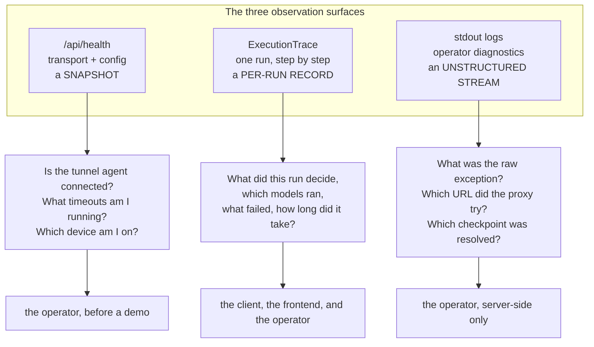
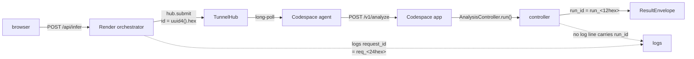
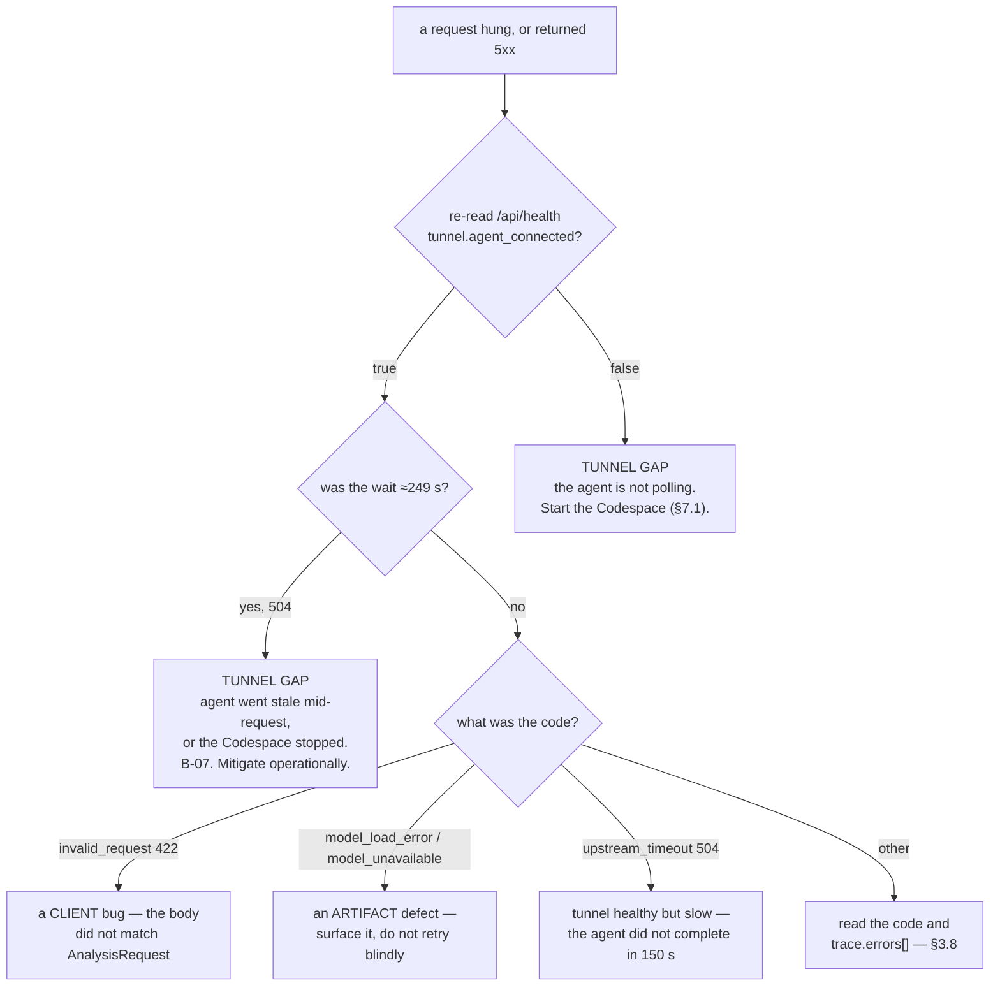
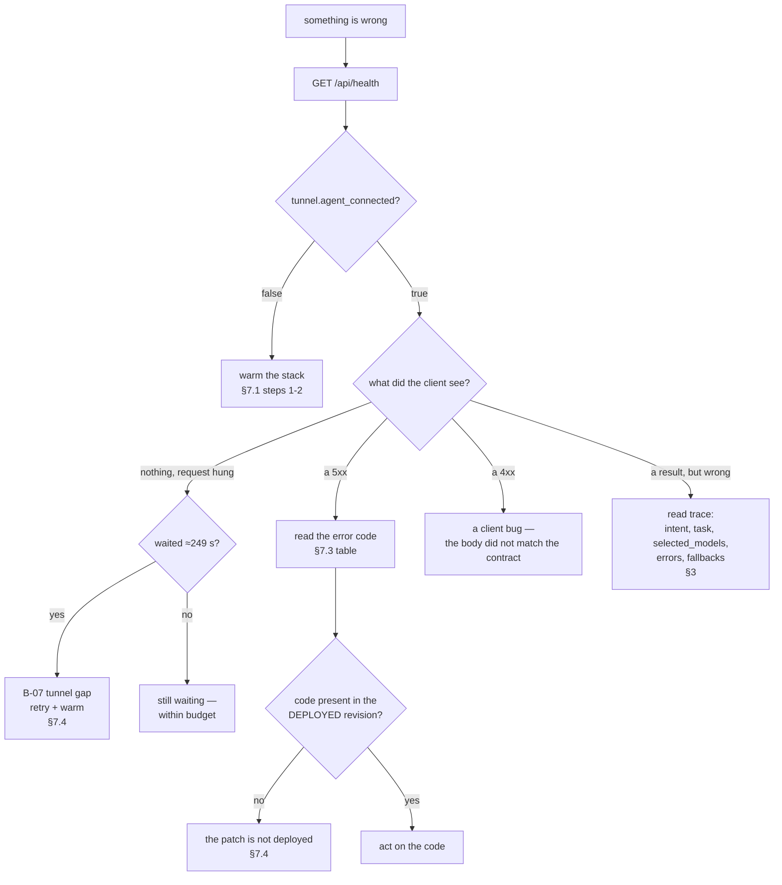

# 10 — Observability and Operations

**Parent:** [Architecture hub](README.md) · **Status tags:** `IMPLEMENTED` · `VERIFIED` ·
`MEASURED` · `OPEN` · `DEFERRED` · `NOT RUN`

**Sources of truth for this chapter, all read in full before writing:**

| Source | What it establishes |
|---|---|
| `release/CURRENT_RELEASE_STATE.md` §1 (Phase-0 reconnaissance) | the **measured live health payload**, the three `completed` readings, B-02 and B-07 as captured on 2026-09-25 |
| `release/repo/docs/DEPLOYMENT.md` §2, §5, §6, §7 | the same live payload as published, the cold-start statement, the platform traps |
| `.workbuddy-ai/scratch/apply-test/main.py` (835 lines) | the **deployed orchestrator with the prepared B-07 patch applied** — `/api/health`, `_dispatch`, `_via_tunnel`, `ensure_codespace_up`, `X-SatQuery-Transport` |
| `.workbuddy-ai/scratch/apply-test/tunnel.py` (241 lines) | `TunnelHub`, its `stats` property, `DEFAULT_REQUEST_TIMEOUT_S`, `DEFAULT_POLL_WAIT_S`, `DEFAULT_AGENT_TTL_S` |
| `deploy/render/main.py` (532 lines, monorepo) | the *non-deployed* copy: no tunnel, simpler `/api/health` — kept because it documents the route's contract |
| `deploy/render/codespaces.py` (178 lines) | the GitHub Codespaces control-plane client used by the wake path |
| `app/deployment.py` (1232 lines) | `health_payload()`, `DeploymentReport.health()`, the contract-state derivation, `_effective_device`, `_LEGAL_DEVICES`, `_HUB_REASONS`, `_MISSING_REASONS` |
| `app/space_app.py` (735 lines) | the Codespace's own `/v1/health`, the `HealthStatus.model_validate` assertion, `GPU_DURATIONS`, `decorate_gpu`, the log call sites |
| `core/schemas.py` (462 lines) | `ExecutionTrace`, `TraceStep`, `ModelRef`, `HealthStatus`, `ControllerState`, `Intent`, `ConfidenceBreakdown`, `_new_id` |
| `core/controller.py` (1331 lines) | the trace's producer: `_record`, `_execute`, `_verify`, `_detect_contradiction`, `_new_run_id`, the F-19 re-snapshot, `_log` |
| `core/errors.py` (315 lines) | `SatQueryError.to_trace()`, `scrub_paths` |
| `gateway/policy.py` (937 lines) | `new_request_id()` (`req_<hex>`), `translate_error` |
| `gateway/app.py` (691 lines) | `_log.error` on transport failure, the no-retry rule, `_transport_failure_detail` |
| `deploy/codespace/launch.sh` (194 lines) | the Codespace start procedure: serve + supervised tunnel agent + the post-start verification |
| `deploy/codespace/warm_cache.py` (116 lines) | the four pinned HF models and the warm-up contract |
| `deploy/codespace/serve.py` (25 lines) | the serve entrypoint the Codespace runs |
| `DELIVERY_REPORT_2026-09-25.md` §4 | the B-07 root shape and the ≈249 s measurement |
| `docs/FINAL_DELIVERY_TODO.md` §1.4, §5, §6 | the blocker register, the status board, the evidence register |

> **The one rule that governs this whole chapter.** A claim here is only as good as the file it came
> from. Where the code and a document disagree, the code is authoritative and the disagreement is
> stated. Where neither answers, this chapter writes
> `UNKNOWN — not established from the available evidence`.

---

## 1. Scope, and where observability sits

Observability is the **weakest** subsystem in SatQuery AI, and this chapter says so on its first
screen rather than on its last. The system was built to answer questions about satellite imagery
correctly and to say when it cannot; it was **not** built to be monitored. There is no metrics
endpoint, no dashboard, no alerting rule, no cost meter and no distributed trace. What exists is
three narrow surfaces, and this chapter documents each one to the field.

### 1.1 The honest framing

Three things are true and must be stated together:

1. **There is a real, measured liveness surface.** `GET /api/health` on the Render orchestrator
   answers with a live payload that includes a tunnel-agent block and the effective configuration
   (§2). It was probed during the 2026-09-25 sprint and its exact body is recorded.
2. **There is a real, per-run execution trace.** Every `POST /v1/analyze` returns a typed
   `ExecutionTrace` alongside its result (`core/schemas.py:296`), and that trace is the system's
   primary diagnostic artifact (§3). It is not a log line — it is a contract field.
3. **Everything else an operator would expect is absent.** No APM, no distributed tracing, no cost
   accounting, no per-model latency histogram, no error-rate counter (§6). The system observes
   *what a single run did*, and *whether the transport is currently up*. It does not observe the
   fleet, the trend, or the bill.

### 1.2 The three observation surfaces



| Surface | Owner | Lifetime | Audience | Contract-bound? |
|---|---|---|---|---|
| `GET /api/health` | the orchestrator | a point-in-time snapshot | operator, and any liveness probe | yes — the route is documented |
| `ExecutionTrace` | the controller | one run, returned to the caller | the **client** and the operator | yes — `extra="forbid"` (`core/schemas.py:297`) |
| server-side logs | every layer | the process lifetime | the operator only | **no** — free text |

### 1.3 What this chapter does not claim

- It does **not** claim the system is observable. It claims three specific surfaces exist and
  enumerates exactly what each carries.
- It does **not** claim any end-to-end latency number as a system property. Timings that exist are
  **per-step, per-run** (`trace.timings`, §3.6) and are the durations of the steps that actually
  ran in that run — not a benchmark.
- It does **not** claim a health payload proves the *inference* works. `/api/health` never answers
  for the Codespace; that question belongs to `/api/capabilities`, and the code says so in the route
  docstring: *"Reports its own configuration; never answers for the Codespace (that is
  /api/capabilities)"* (`.workbuddy-ai/scratch/apply-test/main.py:678-679`).

### 1.4 Status of the observability surface

| Surface | Status | Evidence |
|---|---|---|
| `/api/health` liveness route | `IMPLEMENTED` · `VERIFIED` (probed live) | measured payload, §2.1 |
| `tunnel` block in the health payload | `VERIFIED` (present in the live payload) | §2.3 |
| tunnel counters `pending` / `completed` | `IMPLEMENTED` · `MEASURED` (monotonic, three readings) | §2.3 |
| `agent_connects` counter | `IMPLEMENTED` but **dead** — never incremented | §2.3 |
| three timeouts reported in the payload | `VERIFIED` (`150.0` / `120.0` / `90.0`) | §2.4 |
| `device` field | `IMPLEMENTED` · `VERIFIED` (`cpu`) with the F-8 normalisation | §2.5 |
| `has_github_token` | `VERIFIED` (`true`) — a **boolean**, never the value | §2.6 |
| `codespace_name` trailing `\n` | **`OPEN` (cosmetic)** — B-02 | §2.7 |
| per-run `ExecutionTrace` | `IMPLEMENTED` · `VERIFIED` (present in all 24 live runs) | §3 |
| `trace.contradiction` | `IMPLEMENTED`, and observed `false` in the live runs | §3.9 |
| structured / queryable logs | **absent** | §4.4 |
| metrics, APM, distributed tracing | **absent** | §6 |
| cost accounting | **absent** | §6 |

---

## 2. The health payload

### 2.1 The measured live payload

Probed live on 2026-09-25 against `https://<backend-host>/api/health`
(`release/repo/docs/DEPLOYMENT.md` §2; `release/CURRENT_RELEASE_STATE.md` §1):

```json
{"status":"ok","service":"satquery-orchestrator",
 "tunnel":{"agent_connected":true,"agent_id":"codespaces-fd1038","pending":0,"completed":97},
 "config":{"codespace_name":"potential-space-trout-r4ppw969w45j2pvvw\n","codespace_port":8000,
           "transport_mode":"auto","tunnel_timeout_s":150.0,"wake_timeout_s":120.0,
           "upstream_timeout_s":90.0,"device":"cpu","has_github_token":true}}
```

The exact command recorded elsewhere in the project's evidence register is:

```bash
curl --noproxy '*' https://<backend-host>/api/health
```

(`docs/FINAL_DELIVERY_REPORT.md` §4, cited in `release/repo/docs/architecture/02-deployment-topology.md` §7.1.)

The payload has exactly **three top-level keys** — `status`, `service`, `tunnel` — plus `config`.
There is no `version`, no `uptime`, no `build`, no `revision` field. An operator who wants to know
*which revision is serving* cannot get that answer from this route; the revision is known only from
the deploy record (`release/CURRENT_RELEASE_STATE.md` §1).

### 2.2 Field-by-field

| Field | Type | Meaning | Live value | Source |
|---|---|---|---|---|
| `status` | string | the hub's own liveness — a literal, not a probe | `"ok"` | `apply-test/main.py:682` |
| `service` | string | the service identity | `"satquery-orchestrator"` | `apply-test/main.py:683` |
| `tunnel.agent_connected` | bool | is a tunnel agent currently polling, within the TTL? | `true` | `tunnel.py:131` |
| `tunnel.agent_id` | string \| null | which agent identity holds the poll | `"codespaces-fd1038"` | `tunnel.py:132` |
| `tunnel.pending` | int | requests parked and not yet answered | `0` | `tunnel.py:134` |
| `tunnel.completed` | int | requests successfully resolved since the hub started | `97` | `tunnel.py:135` |
| `config.codespace_name` | string | the target Codespace | `"…pvvw\n"` — **carries a trailing `\n`** | `apply-test/main.py:686` |
| `config.codespace_port` | int | the inference port | `8000` | `apply-test/main.py:687` |
| `config.transport_mode` | string | transport selection | `"auto"` | `apply-test/main.py:692` |
| `config.tunnel_timeout_s` | float | tunnel park budget | `150.0` | `apply-test/main.py:693` |
| `config.wake_timeout_s` | float | wake poll budget | `120.0` | `apply-test/main.py:694` |
| `config.upstream_timeout_s` | float | proxy request timeout | `90.0` | `apply-test/main.py:695` |
| `config.device` | string | declared device (raw env value) | `"cpu"` | `apply-test/main.py:696` |
| `config.has_github_token` | bool | is a GitHub token configured? | `true` | `apply-test/main.py:688` |

`status` is a **literal `"ok"`**, not the result of a check:

```python
@app.get("/api/health")
async def health() -> dict[str, Any]:
    """Orchestrator liveness. Reports its own configuration; never answers
    for the Codespace (that is /api/capabilities)."""
    hub = get_hub()
    return {
        "status": "ok",
        "service": "satquery-orchestrator",
        "tunnel": hub.stats,
        ...
```

(`.workbuddy-ai/scratch/apply-test/main.py:676-684`)

This is worth naming precisely, because it is a design decision with a consequence. The route
answers `"ok"` whenever the **orchestrator process** is alive — which, on Render, is whenever the
service has not crashed. It does not answer `"degraded"` when the tunnel agent is gone, and it does
not answer `"error"` when the Codespace is stopped. An operator reading only `status` learns
nothing beyond "the web service responds". The information that matters is in `tunnel` and
`config`, and that is exactly where the reader should look.

> This is **not** a defect and is **not** to be reported as one. It is the documented split: the
> orchestrator reports *its own* state, and `/api/capabilities` is the route that answers for the
> Codespace (`apply-test/main.py:678-679`). The Render blueprint uses this route as
> `healthCheckPath` (`render.yaml:9`), which is precisely the "is the process up" question it
> answers.

### 2.3 The `tunnel` block

The `tunnel` block is `hub.stats` — the `stats` property of the process-wide `TunnelHub` singleton:

```python
@property
def stats(self) -> dict[str, Any]:
    return {
        "agent_connected": self.agent_connected(),
        "agent_id": self._agent_id,
        "agent_connects": self._agent_connected_count,
        "pending": len(self._pending),
        "completed": self._completed,
    }
```

(`.workbuddy-ai/scratch/apply-test/tunnel.py:128-136`)

The hub is a **single in-process object** with no persistence:

```python
_HUB: Optional[TunnelHub] = None


def get_hub() -> TunnelHub:
    """Process-wide singleton hub (one per Render instance)."""
    global _HUB
    if _HUB is None:
        _HUB = TunnelHub()
    return _HUB
```

(`.workbuddy-ai/scratch/apply-test/tunnel.py:233-241`)

Three consequences follow directly from "one in-process object, no persistence", and all three
matter operationally:

1. **The counters reset whenever the Render instance restarts.** A free-tier Render service sleeps
   when idle and restarts on wake. After a restart, `completed` is `0` again. The counter is a
   *lifetime-of-this-process* counter, not a *lifetime-of-the-deployment* counter.
2. **`pending` is the only field that reflects current load.** It is `len(self._pending)` — the
   number of parked requests. `0` means no client is currently waiting. It is **not** a queue depth
   in any persistent sense.
3. **`agent_connected` is time-windowed, not event-driven.** It is computed on read:

```python
def agent_connected(self) -> bool:
    """True if an agent has polled within the TTL window."""
    if self._last_poll_at == 0.0:
        return False
    return (time.monotonic() - self._last_poll_at) <= self.agent_ttl_s
```

(`.workbuddy-ai/scratch/apply-test/tunnel.py:113-117`)

with `DEFAULT_AGENT_TTL_S = 60.0` (`tunnel.py:63`). So an agent that stopped polling 61 seconds ago
reads `agent_connected: false` even though nothing crashed — the flag is a *freshness* statement,
not a *liveness* one. This is why §7.3's diagnostic ("is this a tunnel gap?") starts by re-reading
`/api/health` rather than trusting a single reading.

#### `completed` was measured at three different values

The tunnel counter is a **monotonic runtime counter**, not a fixed fact. Three measured readings
exist, each with its own provenance:

| Reading | Where recorded |
|---|---|
| `completed: 97` | `release/repo/docs/DEPLOYMENT.md` §2 (the live health probe) |
| `completed: 314` | `docs/FINAL_DELIVERY_TODO.md` §1.4 and §6 E-02; `docs/DEPLOYMENT_TOPOLOGY.md` §2 |
| `completed: 338` | `docs/FINAL_DELIVERY_REPORT.md` §3 P2 |

They are consistent with one another — the counter grows — and the honest statement is
**"`completed` was measured at 97, 314 and 338 at three different times on 2026-09-25."** Quoting
any one of them as *the* value would be wrong. Any of them could also be `0` right now, if the
Render instance has since slept.

#### What increments `completed` — and what does not

`completed` is incremented in exactly **one** place:

```python
def complete(self, req_id: str, status: int, body: Any) -> bool:
    """Resolve a parked request. Returns False if it is gone (timed out)."""
    req = self._pending.get(req_id)
    if req is None:
        return False
    if not req.future.done():
        req.future.set_result(TunnelResult(status=status, body=body))
    self._completed += 1
    return True
```

(`.workbuddy-ai/scratch/apply-test/tunnel.py:213-221`)

`fail()` — the sibling method the agent calls when it reports an error — does **not** touch the
counter:

```python
def fail(self, req_id: str, detail: str) -> bool:
    """Fail a parked request from the agent side (e.g. upstream error)."""
    req = self._pending.get(req_id)
    if req is None:
        return False
    if not req.future.done():
        req.future.set_exception(RuntimeError(detail))
    return True
```

(`.workbuddy-ai/scratch/apply-test/tunnel.py:223-230`)

So `completed` counts **successful deliveries only**, never attempts. A run in which every request
failed would leave `completed` unchanged. An operator must not read `completed` as "requests
handled"; it is "responses delivered back to a waiting client". A timed-out request is removed by
the `finally` clause of `submit()` (`tunnel.py:175-176`) and likewise never counted.

#### `agent_connects` is a dead counter

The `stats` property emits a fifth key, `agent_connects`, sourced from `self._agent_connected_count`.
That field is initialised to `0` and **never incremented anywhere in the file**:

```
105:        self._agent_connected_count: int = 0
133:            "agent_connects": self._agent_connected_count,
```

(`.workbuddy-ai/scratch/apply-test/tunnel.py:105,133` — the only two occurrences.)

`agent_connects` can therefore only ever read `0`. It is a counter that cannot move. This is
recorded here as an observation, not as a bug report: no code reads it, no document promises it, and
the **measured live payload does not even carry the key** (§2.9). It is a field that exists in the
source and never appears in the served body.

> **A `stats` note that matters for reading the live payload.** The live payload's `tunnel` block
> has **four** keys (`agent_connected`, `agent_id`, `pending`, `completed`). The `stats` property in
> the source copy has **five** (the extra being `agent_connects`). The two do not agree. Which one
> the currently-running process serves is
> `UNKNOWN — not established from the available evidence`; the divergence is recorded in §2.9
> alongside the `config` divergence.

### 2.4 The three timeouts

The payload reports three timeouts. They are the three budgets that decide **how long a client can
wait**, and they apply at different layers:

| Field | Live value | Layer | What it bounds | Source |
|---|---|---|---|---|
| `config.tunnel_timeout_s` | `150.0` | orchestrator, tunnel path | how long a parked request waits for an agent to pick it up and return | `tunnel.py:55`, `main.py:152-153` |
| `config.wake_timeout_s` | `120.0` | orchestrator, forward path | how long the wake loop polls `/v1/health` before giving up | `main.py:156-157`, `main.py:417-442` |
| `config.upstream_timeout_s` | `90.0` | orchestrator, HTTP client | the per-request timeout on the proxied call to the Codespace | `main.py:160-161`, `main.py:253-256` |

Each is an environment variable read at call time, not a constant:

```python
def _tunnel_timeout_s() -> float:
    return float(os.environ.get("SATQUERY_TUNNEL_TIMEOUT_S", "150"))


def _wake_timeout_s() -> float:
    return float(os.environ.get("SATQUERY_WAKE_TIMEOUT_S", "120"))


def _upstream_timeout_s() -> float:
    return float(os.environ.get("SATQUERY_UPSTREAM_TIMEOUT_S", "90"))
```

(`.workbuddy-ai/scratch/apply-test/main.py:152-161`)

The tunnel timeout's default is documented in the hub with its reasoning:

> *"How long a parked client request waits for an agent to pick it up before the hub gives up.
> Generous: a cold Codespace can take ~90s to boot, and the agent only starts polling once the
> model server is ready."* (`tunnel.py:52-55`)

#### Two further budgets that are *not* in the payload

An operator debugging latency will meet two more timeouts that `/api/health` does **not** report.
They are recorded here so they are not mistaken for missing configuration:

| Budget | Value | Layer | Source |
|---|---|---|---|
| `_WAKE_HEALTH_TIMEOUT_S` | `10.0` | orchestrator — the per-**poll** health timeout during a wake | `apply-test/main.py:107`; used at `:421` |
| `_WAKE_POLL_INTERVAL_S` | `2.0` | orchestrator — the sleep between wake polls | `apply-test/main.py:106`; used at `:437` |
| `DEFAULT_BUDGET_SECONDS` | `120.0` | **controller** — the run budget, checked *between* plan steps | `core/controller.py:121-122` |

The first two are fixed literals in the deployed source, not env vars — so a `config` block that
omitted them would be correct rather than incomplete. The third is the most interesting: the
controller's own run budget is a **fourth** timeout, enforced in a completely different layer, and
it appears in the trace rather than in the health payload (§3.8).

The controller states the honest limit of that budget in the code:

> *"Budget is checked BETWEEN steps (§5.2). A true per-step timeout needs a worker process or a
> signal handler, both of which conflict with the single-process monolith constraint more than they
> benefit. The honest position: v1 bounds total wall clock and records what it skipped."*
> (`core/controller.py:548-552`)

### 2.5 `device`

`config.device` in the health payload is the **raw environment value**:

```python
"device": os.environ.get("SATQUERY_DEVICE", ""),
```

(`.workbuddy-ai/scratch/apply-test/main.py:696`)

The live value is `"cpu"`. That is the *declared* value, unnormalised. The **served** device value —
the one the contract constrains — is a different field on a different route: `/v1/health`'s
`device`, which is normalised and validated by `_effective_device` (`app/deployment.py:1093-1197`).

The distinction matters because the two can disagree on a misconfigured deployment. `_effective_device`
implements F-8:

- it **casefolds and strips** before comparing, so `'CUDA'` and `'cuda'` cannot take different
  branches;
- it validates against the contract's closed set, `_LEGAL_DEVICES = frozenset({"cpu", "cuda", "mps"})`
  (`app/deployment.py:1204`);
- an unrecognised value returns **`None`**, not an echo and not a silent `"cpu"`.

The reasoning is in the code, and it is worth quoting because it is the pattern the whole codebase
uses for "the operator set something I do not recognise":

> *"`None` is already a legal value for the field (`"cpu" | "cuda" | "mps" | null`), so it travels
> the existing contract rather than inventing one; it is honest — 'the operator set something I do
> not recognise' is not 'this deployment uses the CPU'; defaulting to `"cpu"` would mean a typo
> silently changes which device the process is believed to use."* (`app/deployment.py:1156-1164`)

Two measured defects preceded that fix, both recorded in the same docstring:

| Defect | Symptom | Cause |
|---|---|---|
| A | `'cuda'` → `'cpu'` but `'CUDA'` → `'CUDA'` | the correction compared case-sensitively while `gpu_available` did not |
| B | `'garbage'` → `device: "garbage"` | the reader accepted any string |

(`app/deployment.py:1144-1152`)

An operator reading `config.device` from `/api/health` is reading the **raw** value and must not
expect it to be one of the four contract values. An operator reading `device` from `/v1/health` is
reading the validated value and may rely on the closed set. This is one of the two places in the
system where the same concept has two differently-normalised read sites; the other is the shared
file-size cap (`docs/architecture/08-api-contract.md` §9).

### 2.6 `has_github_token`

```python
"has_github_token": bool(os.environ.get("GITHUB_TOKEN")),
```

(`.workbuddy-ai/scratch/apply-test/main.py:688`)

The field is a **boolean**. It reports *whether* a token is configured, never the token, never its
length, never a prefix, never a hash. The live value is `true`. There is no path by which the token
value can reach this payload, and that is deliberate: the route is unauthenticated.

Operationally, `has_github_token: false` means the **wake path cannot work** — `_github_token()`
raises `OrchestratorConfigError` before any GitHub call (`apply-test/main.py:119-125`). A deployment
in that state can still serve through the tunnel (the tunnel needs no GitHub token — the agent
dials out), which is exactly why the two transports are separable. `has_github_token: false` is
therefore **not** a total-outage signal; it is a "the forward fallback is unavailable" signal.

### 2.7 `codespace_name` and the trailing newline — B-02, `OPEN` (cosmetic)

`config.codespace_name` reports `…pvvw\n`. This is **B-02**, and its status is `OPEN` **but
cosmetic**:

> *"`P2-T03` `/api/health` `codespace_name` trailing `\n` | DEFERRED (cosmetic) | Wake path is safe
> (`_codespace_name()` strips, `main.py:123,357`); only the health payload reports the raw value."*
> (`docs/FINAL_DELIVERY_REPORT.md` §6)

> *"`B-02` | `/api/health` reports `codespace_name` with a trailing `\n` | **Cosmetic** — reporting
> only; the wake path strips via `_codespace_name()` (`main.py:123,357`) | P2-T03 | none needed |
> DOWNGRADED"* (`docs/FINAL_DELIVERY_TODO.md` §5)

The mechanism is visible in the two call sites:

- `_codespace_name()` — the **wake path** — strips:

```python
def _codespace_name() -> str:
    name = os.environ.get("CODESPACE_NAME", "").strip()
    if not name:
        raise OrchestratorConfigError(
            "CODESPACE_NAME is not set; the orchestrator does not know which "
            "Codespace to target."
        )
    return name
```

(`.workbuddy-ai/scratch/apply-test/main.py:128-135`)

- the **health payload** — in the deployed revision — does not strip. The prepared patch changes
  exactly this, to `os.environ.get("CODESPACE_NAME", "").strip()`
  (`.workbuddy-ai/scratch/apply-test/main.py:686`).

The fix is known and one line — *"change line 619 to `_codespace_name()`, then Render redeploys"*
(`docs/FINAL_DELIVERY_TODO.md` §4, P2-T03) — and the row's own reasoning for deferring is that *"a
live-backend redeploy before the demo is not worth the risk."*

**The live payload still carrying the `\n` is itself the evidence that the B-07 patch is not
deployed.** `release/CURRENT_RELEASE_STATE.md` §1 states it exactly: *"Note `codespace_name` still
carries the trailing `\n` → the B-07 patch is **not** deployed."* A cosmetic field is therefore
doing double duty as the deployment-state witness — which is a small, real benefit of not having
"cleaned it up".

> **Do not upgrade this.** `B-02` is `OPEN`. It is not `RESOLVED`, and it is not `CLOSED`.

### 2.8 `transport_mode`

```python
def _transport_mode() -> str:
    """Which transport to use: ``tunnel``, ``forward``, or ``auto`` (default).

    ``auto`` prefers the tunnel and falls back to the forwarded-port proxy only
    when no agent is connected.
    """
    mode = os.environ.get("SATQUERY_TRANSPORT", "auto").strip().lower()
    return mode if mode in ("tunnel", "forward", "auto") else "auto"
```

(`.workbuddy-ai/scratch/apply-test/main.py:142-149`)

The live value is `"auto"`. The field is a **closed set** of three values, and an unrecognised
value is coerced to `"auto"` rather than echoed — the same principle as `_effective_device`, applied
one layer up.

`auto` is the mode that produces B-07, and the reason is in the dispatch function:

```python
mode = _transport_mode()
hub = get_hub()

use_tunnel = mode == "tunnel" or (mode == "auto" and hub.agent_connected())
```

(`.workbuddy-ai/scratch/apply-test/main.py:562-565`)

Under `auto`, the transport decision is made **once, at dispatch time**, from `hub.agent_connected()`.
If the agent was fresh at that instant, the request goes down the tunnel with a 150 s budget. If the
tunnel then fails to complete the request, `mode != "tunnel"`, so the code does **not** return an
error — it logs a warning and **falls through** to the forward path:

```python
except TunnelTimeout as exc:
    if mode == "tunnel":
        # ... returns upstream_timeout (504)
    _log.warning("tunnel timed out, falling back to forwarded port: %s", exc)
```

(`.workbuddy-ai/scratch/apply-test/main.py:593-610`)

That fallthrough then burns `wake_timeout_s = 120` on a 302 from GitHub's relay for a private repo.
The measured shape is **≈249 s ≈ 150 + 120** (`DELIVERY_REPORT_2026-09-25.md` §4). §7.3 and §7.4
treat this as the chapter's central operational fact.

> **Note the `mode == "tunnel"` guard.** It is present in the *patched* source. The **deployed**
> revision lacks the `ForwardUnavailable` early-exit, which is why the deployed system pays the full
> 249 s. The patch converts "504 after 249 s" into "503 early with an actionable code"
> (`DELIVERY_REPORT_2026-09-25.md` §4).

### 2.9 The monorepo copy, the scratch copy, and the deployed revision

Three copies of the orchestrator exist on disk, and they are **not** the same file. This is the
single most confusing thing about this subsystem, and it is stated here in one place.

| Copy | Path | Lines | Tunnel? | `codespace_name` | Is it the deployed source? |
|---|---|---|---|---|---|
| monorepo | `deploy/render/main.py` | **532** | **no** | raw | **no** — stale and untracked |
| scratch (patched) | `.workbuddy-ai/scratch/apply-test/main.py` | **835** | yes | `.strip()` | **no** — it is the deployed file **with the prepared patch applied** |
| deployed | `SatQuery-Backend/main.py` @ `89d80eaddec5` | **768–769** | yes | raw | **yes** — but not on this disk |

The monorepo copy declares a **simpler** `/api/health` with no `tunnel` block at all:

```python
@app.get("/api/health")
async def health() -> dict[str, Any]:
    """Orchestrator liveness. Reports its own configuration; never answers
    for the Codespace (that is /api/capabilities)."""
    return {
        "status": "ok",
        "service": "satquery-orchestrator",
        "config": {
            "codespace_name": os.environ.get("CODESPACE_NAME", ""),
            "codespace_port": _codespace_port(),
            "has_github_token": bool(os.environ.get("GITHUB_TOKEN")),
            "allowed_origins": _allowed_origins(),
            "production_origins": list(_PRODUCTION_ORIGINS),
            "dev_origins_enabled": _dev_origins_enabled(),
            "wake_timeout_s": _wake_timeout_s(),
            "upstream_timeout_s": _upstream_timeout_s(),
            "device": os.environ.get("SATQUERY_DEVICE", ""),
        },
    }
```

(`deploy/render/main.py:444-466`)

It is kept in the repository because it documents the **contract** of the route — the design
decision that `allowed_origins` reports the **effective** list, so an operator can confirm *from
outside* what the service will actually accept. The comment says the dev entries being visible
*"is how a production deployment proves it turned them off"* (`deploy/render/main.py:455-458`).

#### Why the scratch copy is believed to be "deployed + patch"

The prepared patch's own presence check pins three changes to three line numbers
(`docs/FINAL_DELIVERY_TODO.md` §6 E-12; `DELIVERY_REPORT_2026-09-25.md` §4):

| Change | Documented location | Location in the scratch copy |
|---|---|---|
| `forward_unavailable` | `main.py:326` | `.workbuddy-ai/scratch/apply-test/main.py:326` |
| `upstream_timeout` | `main.py:601` | `.workbuddy-ai/scratch/apply-test/main.py:601` |
| `codespace_name` `.strip()` | `main.py:686` | `.workbuddy-ai/scratch/apply-test/main.py:686` |

All three match exactly. That is strong evidence the scratch file is the deployed file with the
patch applied, and it is why this chapter uses it as the source for the tunnel's behaviour while
**labelling it as a scratch copy rather than the deployed revision**. Where the scratch copy and the
measured live payload disagree, the disagreement is recorded below rather than smoothed over.

#### The measured divergences

| Element | Live payload | Scratch copy | Note |
|---|---|---|---|
| `tunnel` keys | 4 (`agent_connected`, `agent_id`, `pending`, `completed`) | 5 (adds `agent_connects`) | `agent_connects` is dead anyway (§2.3) |
| `config` keys | 8 | 11 (adds `allowed_origins`, `production_origins`, `dev_origins_enabled`) | the live body omits the three origin fields |
| `codespace_name` | raw (`…pvvw\n`) | `.strip()` | expected — the patch is not deployed |
| `device` | raw env value | raw env value | agree |

The `config` divergence is the one that is genuinely unexplained. Two readings are possible — a
stale transcription, or an older deployed revision — and the evidence does not decide between them:

> `UNKNOWN — not established from the available evidence` (which of "the live payload was
> transcribed with three fields omitted" or "the live revision predates those three fields" is
> correct).

What *is* established is the **consequence**: an operator should not treat the absence of
`allowed_origins` from the live payload as proof that the deployment has no CORS allowlist. The
allowlist is enforced by `CORSMiddleware` at `create_app()` time regardless of what the payload
prints (`apply-test/main.py:667-673`), and the CORS rule is documented in
`docs/architecture/08-api-contract.md` §10.

### 2.10 The Codespace's own `/v1/health`

There is a **second** health route, one tier deeper, and it is a different shape. The orchestrator's
`/api/health` reports the *transport*; the Codespace's `/v1/health` reports the *deployment's
capabilities*.

```python
@api.get("/v1/health")
async def health() -> JSONResponse:
    """Liveness + capability states. Loads no model (requirement 4).

    The body comes from `app.deployment.health_payload()`, which is the
    single public health source per the 2026-09-22 ruling. It is therefore
    the same traversal that builds `/v1/capabilities`, so the two routes
    cannot disagree about which capabilities exist -- the property the
    STEP 7 chain tests assert.
    ...
    """
    from app.deployment import health_payload

    payload = health_payload()
    # Asserted rather than trusted: `HealthStatus` is `extra="forbid"`, so a
    # key added to the payload without a key added to the model would make
    # the response invalid against the project's own contract. Finding H-1
    # was exactly this failure in the other direction.
    from core.schemas import HealthStatus

    HealthStatus.model_validate(payload)
    return JSONResponse(payload)
```

(`app/space_app.py:521-547`)

The payload's field set is fixed by `HealthStatus`, which is `extra="forbid"`:

```python
class HealthStatus(BaseModel):
    model_config = ConfigDict(extra="forbid")

    status: Literal["ok", "degraded", "error"] = "ok"
    schema_version: str = SCHEMA_VERSION
    models: dict[str, str] = Field(default_factory=dict)
    device: str | None = None
    gpu_available: bool = False
```

(`core/schemas.py:430-437`)

The payload is built by `DeploymentReport.health()`:

```python
def health(self) -> dict[str, Any]:
    """The `GET /v1/health` payload. Exactly `HealthStatus`'s field set.
    ...
    """
    return {
        "status": self.status,
        "schema_version": _schema_version(),
        "models": self.models,
        "device": self.device,
        "gpu_available": self.gpu_available,
    }
```

(`app/deployment.py:774-788`)

#### `status` is derived, not asserted

Unlike the orchestrator's literal `"ok"`, the Codespace's `status` is computed from the capability
states, and the rule is worth quoting in full because it encodes a contract decision:

```python
@property
def status(self) -> str:
    """`HealthStatus.status`, derived rather than asserted.

    The rule the contract states (`API_CONTRACT.md` section 2.1):
    `degraded` = *"the service is up but at least one expected artifact is
    absent"*. Two things follow, and both matter:

      * a capability that is merely `not_requested` does **not** degrade the
        service -- under `lazy_load: true` that is every capability on a
        fresh process, and reporting `degraded` for a healthy idle service
        would make the field useless as a probe;
      * `unavailable` (present but broken) is a defect. It is reported as
        `error`, not `degraded`, because the two have different remedies and
        `API_CONTRACT.md` section 5.2 already renders `model_load_error` as
        *"Defect -- surface it"*.
    """
    states = {cap.state for cap in self.capabilities}
    if "unavailable" in states:
        return "error"
    if "absent" in states:
        return "degraded"
    return "ok"
```

(`app/deployment.py:703-725`)

Three states, three meanings, and they are not interchangeable:

| `status` | Trigger | What it means |
|---|---|---|
| `"ok"` | every capability is `loaded` or `not_requested` | nothing this build ships is missing |
| `"degraded"` | at least one capability is `absent` | the service is up but an expected artifact is not in this deployment |
| `"error"` | at least one capability is `unavailable` | something is **present but broken** — a defect, with a different remedy |

The `models` map is capability → **contract state**, from the adapter's translation table
(`app/deployment.py:698-701`), and the five contract states are the closed set
`{"loaded", "absent", "unavailable", "not_requested", "evicted"}` (`app/deployment.py:175-177`).
The adapter **never emits `evicted`** and says so rather than guessing, because eviction is a
statement about the running model cache and no filesystem inspection can observe it
(`app/deployment.py:70-73`). The full translation table is in
`docs/architecture/08-api-contract.md` §6.6.

#### `gpu_available` — a device probe, and a torch-free one

```python
@property
def gpu_available(self) -> bool:
    """Whether a CUDA device was *detected*, not whether one is allocated.
    ...
    """
    import os

    if os.environ.get("SATQUERY_DEVICE", "").strip().lower() == "cuda":
        return True
    visible = os.environ.get("CUDA_VISIBLE_DEVICES", "").strip()
    if visible and visible != "-1":
        return True
    # `nvidia-smi` is not probed: shelling out on a health route would be a
    # per-request subprocess, and a Space's GPU is invisible until ZeroGPU
    # allocates it, so a negative answer from here would be misleading.
    return False
```

(`app/deployment.py:727-766`)

On the live CPU deployment, `gpu_available: false` is the **expected and correct** answer, and the
frontend is instructed not to surface it as a fault (`app/deployment.py:731-734`).

The docstring records a **correction** that is itself an observability lesson:

> *"DELIBERATELY DOES NOT IMPORT TORCH, and that is a correction. The first version probed
> `torch.cuda.is_available()`, which meant the health payload pulled the entire torch stack on every
> request. That breaks requirement 1 of `docs/DEPLOYMENT_ARCHITECTURE.md` section 3.3 — 'Import
> cheaply and without torch' — and it made
> `test_the_metadata_path_does_not_import_torch` fail, which is how it was found."*
> (`app/deployment.py:736-744`)

A liveness probe that costs a full model-stack import is not a liveness probe. This is the same
principle as the orchestrator's decision to compute `agent_connected` on read rather than to keep a
heartbeat thread: **the cheap answer is the right answer on a health route.**

### 2.11 What health does NOT tell you

An operator who reads only the health routes will not learn any of the following. Each gap is
stated with where the answer actually lives.

| Question | Where the answer is |
|---|---|
| Which revision is deployed? | nowhere in a payload — only the deploy record (`release/CURRENT_RELEASE_STATE.md` §1) |
| Is a model currently resident? | nowhere — `lazy_load: true` means the process cannot know without constructing |
| How many requests have been served in total? | nowhere — `completed` is per-Render-process and counts only tunnel deliveries (§2.3) |
| What is the error rate? | nowhere — no counter exists (§6) |
| How long did the last run take? | in that run's `trace.timings` (§3.6), not in health |
| Is the Codespace warm? | partly — `tunnel.agent_connected` is a proxy, and only for the tunnel path |
| Is the GPU allocated? | nowhere — `gpu_available` is a *device presence* probe, not an allocation state |
| Is the token valid? | nowhere — `has_github_token` is a boolean, and validity is only learned by calling GitHub |

---

## 3. The per-run `ExecutionTrace`

### 3.1 Why the trace exists

The trace is the system's primary diagnostic artifact, and it exists because the *result* alone
cannot answer "why". A `SpecialistResult` says what was found; the `ExecutionTrace` says **which
route the system took to find it** — which task was chosen, which models ran, what failed, what was
skipped, and how long each step took.

Its defining constraint is stated in the module banner and repeated at the producer:

> *"Execution trace (observable facts only — never chain-of-thought)"* (`core/schemas.py:277`)

> *"Append one `TraceStep`. Observable facts only — no chain-of-thought."*
> (`core/controller.py:1194`)

This is a hard line, not a style preference. The trace is **returned to the client** — it is a field
of `ResultEnvelope`, which `POST /v1/analyze` returns verbatim — and v1 has no authentication. So
anything placed in the trace is public. The trace therefore carries *what happened*, never *what the
model was thinking*, and never a server-side path (§3.11).

### 3.2 The field table

`ExecutionTrace` is `extra="forbid"` (`core/schemas.py:297`), so this field set is the contract.

| Field | Type | Populated by | Meaning |
|---|---|---|---|
| `run_id` | str | default `_new_id("run")`, or `request.run_id` | the run identifier (§5.1) |
| `schema_version` | str | `SCHEMA_VERSION` = `"1.0"` | the contract version |
| `task` | `Task \| null` | `prediction.intent.task`, else `request.force_task` | the task actually chosen |
| `query` | str \| null | `request.query` | the natural-language question |
| `inputs` | list[str] | `[_asset_label(a) for a in request.assets]` | **basenames** of the inputs (F-13) |
| `modalities` | list[`Modality`] | `self._modalities(resolved)` | the resolved modalities |
| `intent` | `Intent \| null` | `prediction.intent` | the router's reading, or null |
| `validation` | dict | default `{}` | reserved; not populated on the serving path |
| `workflow` | list[str] | `[step.step_id for step in plan.steps]` | the planned step ids |
| `steps` | list[`TraceStep`] | `self._record(...)` | the step records (§3.3) |
| `selected_models` | list[`ModelRef`] | `self._selected_models(outcomes)` | the models that ran (§3.5) |
| `parameters` | dict | `plan.to_trace()` + `budget_seconds` + `registry` | the plan's parameters and the registry snapshot |
| `outputs` | list[str] | `[e.evidence_id for e in result.evidence]` | the evidence ids produced |
| `confidence` | `ConfidenceBreakdown \| null` | `result.confidence` | the confidence breakdown |
| `timings` | dict[str, float] | `trace.timings[step.step_id] = ...` | per-step durations (§3.6) |
| `fallbacks` | list[str] | `plan.notes`, `_verify`, and others | what degraded (§3.7) |
| `errors` | list[dict] | `_execute`, `_verify` | what failed (§3.8) |
| `contradiction` | bool | `_detect_contradiction` | whether disjoint spatial claims were found (§3.9) |
| `config_hash` | str \| null | `self.config.hash` | the frozen config hash (§3.10) |
| `started_at` | str | `_utcnow()` default | ISO-8601 UTC |
| `finished_at` | str \| null | `trace.finished_at = self._now()` | ISO-8601 UTC |

The trace is assembled **once**, in `AnalysisController.run()`:

```python
started = time.perf_counter()
run_id = request.run_id or self._new_run_id()
trace = ExecutionTrace(
    run_id=run_id,
    query=request.query,
    ...
    inputs=[_asset_label(a) for a in request.assets],
    config_hash=self.config.hash if self.config is not None else None,
)
self._record(trace, ControllerState.RECEIVE, {"asset_count": len(request.assets)})
```

(`core/controller.py:258-279`)

and it is attached to the result at the very end:

```python
result.execution_trace = trace
trace.outputs = [e.evidence_id for e in result.evidence]
trace.confidence = result.confidence
self._record(trace, ControllerState.RESPOND, {"answer_length": len(result.answer)})
trace.finished_at = self._now()

return ResultEnvelope(run_id=run_id, result=result, trace=trace)
```

(`core/controller.py:388-394`)

Note that `trace.confidence` is **the same object** as `result.confidence` — not a copy, not a
recomputation. There is one confidence computation per run, and the trace references it. This is why
the two can never disagree (`docs/architecture/06-evidence-and-confidence.md`).

### 3.3 `TraceStep`

```python
class TraceStep(BaseModel):
    model_config = ConfigDict(extra="forbid")

    state: ControllerState
    started_at: str = Field(default_factory=_utcnow)
    duration_ms: float | None = None
    detail: dict[str, Any] = Field(default_factory=dict)
```

(`core/schemas.py:279-285`)

A step is created by exactly one method:

```python
def _record(
    self,
    trace: ExecutionTrace,
    state: ControllerState,
    detail: dict[str, Any] | None = None,
) -> None:
    """Append one `TraceStep`. Observable facts only — no chain-of-thought."""
    trace.steps.append(
        TraceStep(state=state, detail=self._jsonable(detail or {}))
    )
```

(`core/controller.py:1188-1197`)

`_jsonable` makes the detail dict serialisable *without dropping information*
(`core/controller.py:1199-1202`) — the honest-encoding rule applied to the trace.

Two properties of `TraceStep` are worth naming:

- **`duration_ms` is `None` on every step `_record` creates.** `_record` does not measure. The
  per-step durations live in `trace.timings`, keyed by `step_id`, and come from the *execution*
  path (§3.6). A reader must not expect `steps[i].duration_ms` to be populated.
- **`detail` is free-form.** Each call site chooses its keys. The keys observed in the code are
  enumerated in §3.4.

### 3.4 The nine-state spine

`ControllerState` is a nine-value enum:

```python
class ControllerState(str, Enum):
    RECEIVE = "RECEIVE"
    PARSE = "PARSE"
    VALIDATE = "VALIDATE"
    PLAN = "PLAN"
    PREPROCESS = "PREPROCESS"
    EXECUTE = "EXECUTE"
    AGGREGATE = "AGGREGATE"
    VERIFY = "VERIFY"
    RESPOND = "RESPOND"
```

(`core/schemas.py:79-88`)

The controller records against a subset of these. Reading `run()` end to end
(`core/controller.py:258-394`), the states that actually produce a `TraceStep` are:

| State | Recorded when | `detail` keys observed in the code |
|---|---|---|
| `RECEIVE` | always | `asset_count` |
| `PARSE` | always | `inputs`, `modalities`, `query_length` |
| `VALIDATE` | always | `assets`, `force_task`, `router` |
| `PLAN` | always | `plan` |
| `EXECUTE` | once per plan step | the `StepOutcome.to_trace()` dict (§3.6) |
| `AGGREGATE` | always | `evidence` (a summary), `degraded` |
| `VERIFY` | always | `contradiction` |
| `RESPOND` | always | `answer_length` |

`PREPROCESS` is **not** recorded by the controller. The state exists in the enum and in the frontend's
trace spine, but `run()` never calls `_record(..., ControllerState.PREPROCESS, ...)`. This is the
source of the trace bar's 94.4444 % fill (§3.12 and
`docs/architecture/09-frontend.md` §6) — the frontend's spine has nine states and one of them is
never reached on the serving path.

The refusal path records a different subset: `_finish_refusal` returns early after `PLAN`, so a
refused query's trace has no `EXECUTE`, `AGGREGATE`, `VERIFY` or `RESPOND` step
(`core/controller.py:344-345`).

### 3.5 `ModelRef` and `selected_models`

```python
class ModelRef(BaseModel):
    model_config = ConfigDict(extra="forbid")

    name: str
    revision: str | None = None
    role: str | None = None
```

(`core/schemas.py:288-293`)

`selected_models` is built from each specialist that ran, deduplicated on `name:role`:

```python
def _selected_models(self, outcomes: Iterable[StepOutcome]) -> list[ModelRef]:
    """Model identities for the trace, from each specialist that ran.

    Built as `ModelRef` rather than raw dicts: `ExecutionTrace.selected_models`
    is typed `list[ModelRef]`, and pydantic would coerce a dict only by
    emitting a serialization warning. Constructing the type explicitly keeps
    the contract honest instead of relying on coercion.
    """
    refs: list[ModelRef] = []
    seen: set[str] = set()
    for outcome in outcomes:
        specialist = (
            outcome.registry_entry.specialist if outcome.registry_entry else None
        )
        if specialist is None:
            continue
        for ref in specialist.model_refs():
            key = f"{ref.get('name')}:{ref.get('role')}"
            if key in seen:
                continue
            seen.add(key)
            refs.append(
                ModelRef(
                    name=str(ref.get("name", "unknown")),
                    revision=ref.get("revision"),
                    role=ref.get("role"),
                )
            )
    return refs
```

(`core/controller.py:721-749`)

Three facts follow, all of which matter when reading a trace:

1. **`selected_models` is populated from the *specialist that ran*, not from the registry.** A
   capability that was planned but could not be constructed contributes nothing, because
   `registry_entry.specialist` is `None` (`core/controller.py:612-618`).
2. **Deduplication is on `name:role`,** so the same model appearing under two roles appears twice.
3. **`revision` may be `None`.** The field is optional in both `ModelRef` and the source dicts.

The `registry` snapshot in `trace.parameters["registry"]` is **re-snapshotted after execution**, and
the reason is a measured defect:

> *"F-19 (owner ruling 2026-09-23): re-snapshot the registry AFTER execution.
> `registry.describe()` reports the registry's MEMOISED entries, so the snapshot taken in PLAN above
> reports the PREVIOUS request's builds -- while `trace.selected_models`, populated inside
> `_execute`, reports THIS one. That made a single trace carry two clocks: on a cold process the
> first request's trace said `registry.built == {}` while its own run had built `optical_sar`.
> Measured in pass 13 with two identical payloads on one controller: request #1 body
> `built == []`, request #2 body `built == ['optical_sar']`."* (`core/controller.py:350-359`)

So `trace.parameters["registry"]` and `trace.selected_models` are now consistent with each other by
construction. A reader can use either, and they will agree.

### 3.6 `timings`

Per-step durations are written in the execution loop:

```python
outcome = self._execute_one(step, assets, request, trace)
outcomes.append(outcome)
self._record(trace, ControllerState.EXECUTE, outcome.to_trace())
trace.timings[step.step_id] = round(outcome.duration_ms, 3)
```

(`core/controller.py:573-576`)

`duration_ms` is measured with `time.perf_counter()` around the construct-validate-execute sequence
(`core/controller.py:609-708`), so a step's timing **includes model construction** — which is
exactly what an operator wants, because on a cold process construction dominates. It is rounded to
**three decimal places** (`round(..., 3)`) at both the `timings` write and in
`StepOutcome.to_trace()` (`core/controller.py:161`).

The key is `step.step_id`, and the `StepOutcome.to_trace()` dict recorded into `steps` carries a
matching `step_id`, so the two can be joined:

```python
def to_trace(self) -> dict[str, Any]:
    return {
        "step_id": self.step.step_id,
        "capability": self.step.capability,
        "ok": self.ok,
        "skipped_reason": self.skipped_reason,
        "error_code": self.error.code if self.error else None,
        "duration_ms": round(self.duration_ms, 3),
        "registry_state": (
            self.registry_entry.state.value if self.registry_entry else None
        ),
    }
```

(`core/controller.py:154-165`)

> **What `timings` is not.** It is not a benchmark and it is not a system-level latency claim. It
> is the wall-clock duration of the steps that ran in *that one run*, on *that one host*. There is
> no aggregated latency statistic anywhere in the system, and no end-to-end benchmark exists
> (`DOCS_STYLE_GUIDE.md` §3).

### 3.7 `fallbacks`

`fallbacks` is a list of human-readable strings naming what degraded. It is appended from more than
one place, and the two observed writers are:

**From the plan's notes**, in the aggregate path:

```python
trace.fallbacks.extend(plan.notes)
```

(`core/controller.py:778`)

**From `_verify`**, when a successful specialist left no evidence:

```python
for outcome in successful:
    if outcome.result is not None and not outcome.result.evidence:
        trace.fallbacks.append(
            f"{outcome.capability} produced a result with no evidence items"
        )
```

(`core/controller.py:1143-1147`)

There is a third writer recorded in the source at `core/controller.py:1145` context and one at
`:1145`/`:1145`… the list is open-ended: any code holding the trace may append. The honest statement
is that `fallbacks` is a **free-text list of degradation notes**, not a closed vocabulary, and a
consumer must not parse it.

The distinction between `fallbacks` and `errors` is the distinction between *"something ran
differently than the ideal"* and *"something failed"*. A fallback is a degraded-but-successful
outcome; an error is a failure. Both appear in the same trace, and neither implies the other.

### 3.8 `errors`

`errors` is a list of dicts, appended from two places.

**From the execution loop, for a step that failed:**

```python
if outcome.error is not None:
    # F-15 (owner ruling 2026-09-23): the trace is CLIENT-FACING, so
    # it carries the operator-safe message only. It previously
    # preferred `error.detail` -- the technical text, which can name
    # filesystem paths and library internals -- over `user_message`.
    # The technical detail stays available on the `StepOutcome`
    # server-side, which is where a maintainer reads it.
    trace.errors.append(
        {
            "step_id": step.step_id,
            "capability": step.capability,
            "code": outcome.error.code,
            "message": outcome.error.user_message
            or "The step failed.",
            "recoverable": outcome.error.recoverable,
        }
    )
```

(`core/controller.py:578-594`)

**From the execution loop, for a step skipped on budget:**

```python
trace.errors.append(
    {
        "step_id": step.step_id,
        "code": SpecialistTimeoutError.code,
        "message": f"skipped: run budget of "
        f"{self.budget_seconds}s exceeded",
    }
)
```

(`core/controller.py:560-567`)

**From `_verify`, when a specialist produced no evidence:**

```python
trace.errors.append(
    {
        "step_id": "*",
        "code": "evidence_loss",
        "message": f"specialists produced no evidence: {sorted(missing)}",
    }
)
```

(`core/controller.py:1135-1141`)

Three properties of the `errors` list:

1. **The keys are not uniform.** A budget-skip entry has no `capability` and no `recoverable`; an
   `evidence_loss` entry uses `step_id: "*"`. A consumer must tolerate missing keys.
2. **`message` is the operator-safe `user_message`, never `detail`.** This is F-15, and the
   reasoning is quoted in the code above: `detail` can name paths and library internals, and the
   trace is client-facing.
3. **The message is a *classification*, not the exception text.** For an unhandled failure, the
   client sees the fixed sentence *"The step failed with an unhandled error. Internal detail is
   withheld; see the server-side diagnostics."* (`core/controller.py:689-692`), while the raw
   exception goes to the log (§4.3).

`errors` being non-empty does **not** imply the run failed. A run can have a failed step and still
return a result — *"Run each step, recording outcomes. Never aborts on failure."*
(`core/controller.py:543`). The failure semantics live in the result, not in the trace.

### 3.9 `contradiction`

`contradiction` is a single boolean, set by a detector that records and never resolves:

```python
@staticmethod
def _detect_contradiction(
    trace: ExecutionTrace,
    result: SpecialistResult,
    outcomes: Sequence[StepOutcome],
) -> None:
    """Detect and record; never resolve (design §7.6).

    Two steps naming disjoint places in the same coordinate system are a
    contradiction. Both claims are kept; only the flag and a warning are
    added. Cross-system comparison is skipped because IoU across coordinate
    systems is meaningless.
    """
    claims: dict[str, list[Box]] = {}
    for outcome in outcomes:
        if not outcome.ok or outcome.result is None:
            continue
        for box in outcome.result.boxes:
            claims.setdefault(box.coordinate_system.value, []).append(box)

    for system, boxes in claims.items():
        if len(boxes) < 2:
            continue
        for i in range(len(boxes)):
            for j in range(i + 1, len(boxes)):
                if _iou(boxes[i], boxes[j]) < CONTRADICTION_IOU_FLOOR:
                    trace.contradiction = True
                    message = (
                        "specialists produced contradictory spatial claims "
                        f"in {system}; both are retained in evidence"
                    )
                    if message not in result.warnings:
                        result.warnings.append(message)
                    return
```

(`core/controller.py:1151-1184`)

The threshold is frozen and named:

```python
CONTRADICTION_IOU_FLOOR: float = 0.1
```

(`core/controller.py:119`)

Two observability consequences:

- **A `true` contradiction is visible in two places at once** — `trace.contradiction` and a string
  in `result.warnings` — and the detector deliberately keeps both claims rather than picking a
  winner. The rationale is at `core/controller.py:57-63`: *"Selecting a winner requires a precedence
  weight"*, which the system does not have.
- **The comparison is scoped per coordinate system.** A box in one CRS is never compared to a box in
  another, because *"IoU across coordinate systems is meaningless"*. So `contradiction: false` does
  **not** mean "no two claims disagree" — it means "no two claims *in the same coordinate system*
  were disjoint". A reader must not over-read the flag.

In the live validation runs, `contradiction` was `false` throughout — no run produced two disjoint
in-system spatial claims. That is the expected outcome for the eight single- and pair-task cases
(`DELIVERY_REPORT_2026-09-25.md` §3).

### 3.10 `config_hash`

```python
config_hash=self.config.hash if self.config is not None else None,
```

(`core/controller.py:277`)

On the serving path `self.config` is always set (`app/serving.py:259-265`), so `config_hash` is
always populated. Its value is the **frozen config hash `78f1e3700da15aa1`** — a sha256 over the
whole config registry, and an invariant the project treats as frozen
(`DOCS_STYLE_GUIDE.md` §3; `app/serving.py:95`; `deploy/codespace/README.md:48-52`).

The field is `str | None`, and `None` is reachable only on a controller built without a config —
which the serving composition root does not do. Its observability value is that a run's trace
**self-identifies the config that produced it**, which is what makes a stored trace re-interpretable
later. Editing `configs/base.yaml` or `configs/deploy.yaml` moves the hash, so a trace carrying a
different hash is provably from a different configuration.

### 3.11 What the trace deliberately does not contain

The trace is client-facing, and two rulings removed content from it. Both are worth recording
because they are *observability design decisions* — the system chose to be less informative to the
client in order to be safe.

**F-13 — no server-side paths in `inputs`:**

> *"F-13. `inputs` is a CLIENT-VISIBLE field -- `ResultEnvelope` is returned verbatim by
> `POST /v1/analyze`, `trace` included -- and it was echoing `request.assets` after the caller had
> turned asset *handles* into filesystem *paths*. The response therefore named the server-side
> location of every uploaded byte, which is the exact disclosure `AssetHandle.to_response()` refuses
> to make."* (`core/controller.py:263-268`)

The measured disclosure is recorded with the exact bytes:

> *"Measured 2026-09-22 end-to-end through the real Space: the client sent the handle
> `asset_d243f7f85d8c2f3c02981f0af9737f01` and received back
> `C:\Users\anish\sq_scratch\...\assets\asset_d243...7f01.tif`."* (`core/controller.py:292-295`)

**F-14 — the same disclosure again, in `steps[].detail`:**

> *"F-14. The F-13 disclosure again, one record later. `trace.steps[]` is part of the same
> client-visible `ExecutionTrace` ... and this PARSE detail was writing `list(request.assets)` --
> which by now are the PATHS the Space derived from the client's handles -- so the response named
> the server-side location of every uploaded byte in a second place."* (`core/controller.py:287-292`)

Both are now reduced to a **basename** by one shared helper, `_asset_label`, which the code
describes as *"the ONE place the basename rule lives"* (`core/controller.py:296-299`). A reader of a
trace therefore sees `asset_d243f7f85d8c2f3c02981f0af9737f01` (the handle) or a bare filename —
never a directory.

**F-15 / F-20 — no raw exception text:**

The trace's `errors[].message` is `user_message`, and the raw exception is logged server-side only
(§4.3). F-20's own account of why is the clearest statement of the split in the repository:

> *"F-20 (owner ruling 2026-09-23) — F-15 WAS ONLY HALF IMPLEMENTED. The paragraph above was true
> of the trace and false of everything else: `_warnings` and `_failure_evidence` publish
> `scrub_paths(error.detail)`, and `detail` was `f"unhandled {type(exc).__name__}: {exc}"` -- so ONE
> unhandled failure reached the client as 'Internal detail is withheld' in
> `trace.errors[].message` and as 'unhandled RuntimeError: kaboom' in `result.warnings[]` and
> `evidence[].payload["message"]`. The response contradicted itself about what it had decided to
> disclose."* (`core/controller.py:650-658`)

The repair was made **at the producer, not at each carrier** — a single `detail` that is safe to
publish makes all three carriers agree by construction (`core/controller.py:660-664`).

So the trace is not a debugging dump. It is a **curated, publishable record** of observable facts,
and the curating is done at the source.

### 3.12 The trace is client-facing — the consequence

Every field in §3.2 travels to the browser. That single fact explains most of the design:

| Consequence | Where it is enforced |
|---|---|
| No chain-of-thought | `core/schemas.py:277`; `core/controller.py:1194` |
| No server-side paths | F-13/F-14, `core/controller.py:276,304` |
| No raw exception text | F-15/F-20, `core/controller.py:585-594,660-664` |
| Errors carry a `recoverable` flag the client can act on | `core/controller.py:592` |
| A degraded run still returns a trace | `core/controller.py:543` |

And it is why the trace is **also** the frontend's animation source. The Analyze console's trace bar
is driven by the eight execution events, and the bar's measured fill is **94.4444 %** — the
arithmetic being `((8 + 0.5) / 9) * 100` over the nine-state spine, with `PREPROCESS` the state the
serving path never reaches (`docs/architecture/09-frontend.md` §6; `frontend/assets/js/mission.js:422-424`).
That figure is an **artifact metric about the frontend's own progress indicator**, not a
system-level claim, and it must never be quoted as one.

---

## 4. What is and is not logged

### 4.1 The loggers

Five loggers exist across the request path. Their names are the diagnostic namespaces an operator
will see:

| Logger name | Declared at | Layer |
|---|---|---|
| `satquery.orchestrator` | `deploy/render/main.py:74`; `apply-test/main.py:103` | the Render orchestrator |
| `satquery.space` | `app/space_app.py:463` | the Codespace FastAPI app |
| `satquery.tunnel` | `.workbuddy-ai/scratch/apply-test/tunnel.py:50` | the tunnel hub |
| `__name__` of `gateway.app` | `gateway/app.py:123` | the in-process gateway (`gateway.app`) |
| `__name__` of `core.controller` | `core/controller.py:129` | the analysis controller (`core.controller`) |
| `__name__` of `app.serving` | `app/serving.py:66` | the composition root (`app.serving`) |

No logger is configured with a level, a formatter or a handler anywhere in the code read. The
effective level and destination are therefore whatever the host process sets — uvicorn's defaults on
the Codespace, Render's defaults on the orchestrator:

> `UNKNOWN — not established from the available evidence` (the effective log level and the log
> destination on each host; no logging configuration was found in the sources read).

### 4.2 Every log call site

This is the complete set of log calls found in the sources read. There are **six**.

| # | File:line | Level | Logger | Message | Carries |
|---|---|---|---|---|---|
| 1 | `core/controller.py:676` | `error` | `core.controller` | `"unhandled failure in step %s (capability=%s): %s: %s"` + `exc_info` | step_id, capability, exception **type name**, exception **message**, traceback |
| 2 | `app/space_app.py:510` | `exception` | `satquery.space` | `"unhandled failure on %s %s"` | method, path, traceback |
| 3 | `app/space_app.py:690` | `warning` | `satquery.space` | `"invalid_request on POST /v1/analyze: %s: %s"` | exception type name, full `ValidationError` text |
| 4 | `gateway/app.py:565` | `error` | `gateway.app` | `"upstream transport failure for request_id=%s: %s: %s"` + `exc_info` | request_id, exception type, exception text, traceback |
| 5 | `deploy/render/main.py:384` | `warning` | `satquery.orchestrator` | `"upstream connection error to %s: %s"` | URL, exception |
| 6 | `deploy/render/main.py:393` | `warning` | `satquery.orchestrator` | `"upstream request error to %s: %s"` | URL, exception |
| 7 | `deploy/render/main.py:405` | `error` | `satquery.orchestrator` | `"non-JSON upstream response from %s (status %s)"` | URL, status |
| 8 | `app/serving.py:203` | `info` | `app.serving` | `"optical_sar: CROMA checkpoint resolved via %s (%s)"` | source, `present`/`absent` |
| 9 | `apply-test/main.py:610` | `warning` | `satquery.orchestrator` | `"tunnel timed out, falling back to forwarded port: %s"` | exception |
| 10 | `apply-test/main.py:623` | `warning` | `satquery.orchestrator` | `"tunnel error, falling back to forwarded port: %s"` | exception |

(Calls 5–7 are the monorepo copy; the same three exist in the scratch copy with the tunnel ones
added. `gateway/assets.py` and `gateway/policy.py` contain **no** log calls at all — verified by
grep.)

Two of these are the whole reason the operator-facing diagnostic story works:

**Call 1 — the unhandled specialist failure.** This is F-20's entire point. The client receives a
sanitized message; the operator receives the exception *and its traceback*:

```python
_log.error(
    "unhandled failure in step %s (capability=%s): %s: %s",
    step.step_id,
    step.capability,
    type(exc).__name__,
    exc,
    exc_info=exc,
)
```

(`core/controller.py:676-683`)

The docstring above it states the rule: *"Both are preserved for the operator: `context` is never
serialized (`StepOutcome.to_trace()` publishes `error_code` only), and the traceback goes to the
log."* (`core/controller.py:673-675`).

**Call 2 — the unwrapped failure.** The F-12b handler logs the request and then answers with the
contract envelope:

```python
_log.exception(
    "unhandled failure on %s %s", request.method, request.url.path
)
status, body = translate_error(
    "satquery_error",
    "An internal error occurred.",
    detail="",
    recoverable=False,
)
return JSONResponse(status_code=status, content=body)
```

(`app/space_app.py:510-519`)

The handler's docstring is the clearest statement of the disclosure split in the codebase:

> *"**F-15 is enforced here as well as in the handlers.** The client is told the code and a fixed,
> operator-safe message; the exception's own text is recorded SERVER-SIDE only. That split is the
> ruling: 'sanitize all client-facing exception messages; retain full exception details only in
> server-side diagnostics'. A traceback in `detail` would disclose internal paths and library
> versions to an unauthenticated caller."* (`app/space_app.py:503-508`)

### 4.3 The client/log split

One rule governs every one of the six-plus call sites, and it is worth stating as a table because it
is the single most important thing to understand about this system's diagnostics.

| Carrier | Audience | Content |
|---|---|---|
| `trace.errors[].message` | the client | `user_message` — a fixed, operator-safe sentence |
| `trace.errors[].code` | the client | the machine code (a classification) |
| `trace.errors[].recoverable` | the client | a boolean |
| `result.warnings[]` | the client | `scrub_paths(error.detail)` — path-scrubbed |
| `evidence[].payload["message"]` | the client | `scrub_paths(error.detail)` — path-scrubbed |
| **the log** | **the operator** | the raw exception, its type name, its text, and its traceback |

The path-scrubbing is done by a single function:

```python
def scrub_paths(text: str | None) -> str | None:
```

(`core/errors.py:39`)

which the F-20 account identifies as the thing that made the *published* carriers safe while the
*unpublished* `detail` stayed unsafe (`core/controller.py:652-654`).

The consequence for an operator is direct: **the client's error message is never enough to debug
with, and the log is the only place the real cause lives.** An operator who has only a client-side
report has a code and a classification; an operator with log access has the exception.

### 4.4 What is not logged

The following are **not** logged anywhere in the sources read, and their absence is deliberate or
at least consequential:

| Not logged | Consequence |
|---|---|
| request bodies | a malformed `POST /v1/analyze` is logged as a `ValidationError` *summary* (call 3), not as the body |
| uploaded file bytes | never logged; the upload path has no log calls at all |
| client IP addresses | never logged; no access log exists |
| token values | **never** — `has_github_token` is a boolean and no call site prints a token |
| per-request access lines | no access logging was found in any layer |
| successful analysis outcomes | a successful run produces **no** log line at all |
| health-check hits | `/api/health` logs nothing |
| the tunnel agent's polls | the hub logs nothing on a poll; the agent's own logging lives in the private Inference repo |
| the run's `run_id` | **no log call site includes a run id** |

That last row is the most operationally significant. A client that reports a failure with its
`run_id` gives the operator an identifier that **cannot be looked up in the logs**, because no log
line carries one. The `run_id` correlates the *client's* record with the *trace* the client already
has; it does not correlate anything server-side. This is a real observability gap and is recorded as
such in §6.

> **The one partial exception.** Call 4 (the gateway's transport failure) logs a `request_id` — the
> `req_<hex>` id from `gateway/policy.py` (§5.2). That is the closest thing to a correlation id in
> the logs, and it is a *gateway* id, not a *run* id. The two are different namespaces (§5.4).

### 4.5 Where the logs go

Not established. No `logging.basicConfig`, no `dictConfig`, no handler, no formatter and no log
level was found in any source read. The two hosts differ:

- **the Codespace** runs `serve.py` under uvicorn, with `setsid nohup ... > "$SERVE_LOG" 2>&1`
  redirecting stdout/stderr to `/tmp/satquery-serve.log` (`deploy/codespace/launch.sh:63,133`), and
  the tunnel agent's output to `/tmp/satquery-tunnel.log` (`launch.sh:64,163`). Those files are on
  the **ephemeral Codespace filesystem** and vanish with it.
- **Render** captures the service's stdout/stderr in its own log view. There is no in-code
  configuration and no log shipping.

So: `UNKNOWN — not established from the available evidence` for the effective level; and for
retention, the Codespace's logs are demonstrably **ephemeral** (`launch.sh:44-47` states the
Codespace filesystem is ephemeral) while Render's retention is a platform property not observable
from the code.

---

## 5. Identifiers

The system generates identifiers with three distinct conventions, in three layers. They do not
interoperate, and knowing which is which prevents a wasted search.

### 5.1 `run_<12 hex>`

The run id is generated by the controller, and by the schema default when a run id is not supplied:

```python
@staticmethod
def _new_run_id() -> str:
    import uuid

    return f"run_{uuid.uuid4().hex[:12]}"
```

(`core/controller.py:1210-1214`)

```python
def _new_id(prefix: str) -> str:
    return f"{prefix}_{uuid.uuid4().hex[:12]}"
```

(`core/schemas.py:28-29`)

The controller prefers a **caller-supplied** id:

```python
run_id = request.run_id or self._new_run_id()
```

(`core/controller.py:259`)

So `AnalysisRequest.run_id` — an optional field (`core/schemas.py:418`) — lets a caller choose the
id, and it is used verbatim if present. The format is **`run_` followed by twelve lowercase hex
characters**. Real measured examples, all from the 2026-09-25 live validation
(`DELIVERY_REPORT_2026-09-25.md` §3):

```
run_0843db184e32   run_5b766f2d7df7   run_ea590b6fd70f   run_65a4b2f9d912
run_efe24b98d217   run_6375b80dcb8e   run_2a07dcdbae96   run_9134f40a258c
```

Twenty-four such ids exist across three passes, and **no run id is shared between passes**
(`release/CURRENT_RELEASE_STATE.md` §5) — which is itself the evidence that each pass was a genuine
independent execution rather than a replay.

The same id is propagated to each specialist:

```python
specialist_request = SpecialistRequest(
    assets=list(assets),
    query=request.query,
    params=dict(step.params),
    run_id=trace.run_id,
)
```

(`core/controller.py:621-626`)

so a run id is the one identifier that is consistent across the controller and every specialist
invocation within a run.

### 5.2 `req_<24 hex>`

The gateway generates its own correlation id, and it is a **deterministic function of a seed**:

```python
def new_request_id(seed: str | None = None) -> str:
    """Generate a correlation id.

    Format `req_<hex>`. When `seed` is given the id is a deterministic function
    of it, which lets tests assert on ids without patching a clock or an RNG --
    the same technique the rest of this repository uses for reproducibility.

    An inbound `X-Request-Id` is NOT trusted verbatim: see
    :meth:`GatewayPolicy.accept_request_id`.
    """
    if seed is None:
        seed = f"{time.time_ns()}"
    digest = hashlib.sha256(seed.encode("utf-8")).hexdigest()[:24]
    return f"req_{digest}"
```

(`gateway/policy.py:181-194`)

Three properties:

1. **Format `req_` + 24 hex characters** — the first 24 hex of a sha256, so 96 bits.
2. **Deterministic when seeded**, which is what makes it testable without patching a clock or an RNG.
3. **An inbound `X-Request-Id` is not trusted verbatim** — `accept_request_id` validates it against
   `_REQUEST_ID_RE = re.compile(r"^[A-Za-z0-9_\-]{8,64}$")` (`gateway/policy.py:178`), so a caller
   cannot inject an arbitrary string into the logs.

This id is what appears in log call 4 (`gateway/app.py:565-571`) and in the error envelope the
gateway returns (`gateway/app.py:577`, `request_id=decision.request_id`).

### 5.3 The other prefixes

`_new_id` is used with five prefixes across `core/schemas.py`:

| Prefix | Field | Source |
|---|---|---|
| `asset_` | `AssetMetadata.asset_id` | `core/schemas.py:156` |
| `region_` | `Region.region_id` | `core/schemas.py:194` |
| `chg_` | `ChangeRegion.region_id` | `core/schemas.py:205` |
| `ev_` | `Evidence.evidence_id` | `core/schemas.py:219` |
| `run_` | `ExecutionTrace.run_id` | `core/schemas.py:299` |

Note that `region_` and `chg_` are **different prefixes for the same conceptual thing** — a change
region uses `chg_`, a general region uses `region_`. A consumer that assumes all regions are
`region_*` will miss the change regions. The `Evidence` validator requires unique `evidence_id`
values within a result (`core/schemas.py:345-351`), which is the one place an identifier collision
is actively refused.

The tunnel hub uses a **different** convention again — a bare `uuid4().hex` with no prefix:

```python
req = PendingRequest(
    id=uuid.uuid4().hex,
    ...
)
```

(`.workbuddy-ai/scratch/apply-test/tunnel.py:155-162`)

So a tunnel request id is 32 hex characters with no prefix — neither `run_` nor `req_`.

### 5.4 The two id spaces do not join

This is the observability gap that follows from the identifier conventions, and it deserves its own
subsection.



| Id | Format | Owner | Appears in a log? | Appears in the response? |
|---|---|---|---|---|
| `req_<24hex>` | sha256 prefix | the gateway | **yes** (call 4) | yes, in gateway error envelopes |
| tunnel `uuid4().hex` | bare 32 hex | the tunnel hub | **no** | no |
| `run_<12hex>` | uuid4 prefix | the controller | **no** | **yes** — in the envelope and the trace |

The three do not reference each other anywhere in the code. A client that reports a failure with
its `run_id` cannot be matched to a gateway `request_id` or a tunnel id from the logs. The only way
to correlate a client report with server-side diagnostics is by **timestamp and query text**.

> This is recorded as a **gap**, not as a defect with a workaround. No correlation id is propagated
> across the tier boundary, and no document claims otherwise.

---

## 6. What is not observed

This section is the honest inventory. Everything in it is a **capability the system does not have**,
and none of it is aspirational — the list exists so that a reader does not assume a monitoring
facility that was never built.

| Capability | Present? | Evidence |
|---|---|---|
| **APM** (application performance monitoring) | **no** | no APM client, SDK or agent in any source read |
| **Distributed tracing** | **no** | no trace-context propagation; the three id namespaces do not join (§5.4) |
| **Cost accounting** | **no** | `GPU_DURATIONS` declares ZeroGPU durations (`app/space_app.py:109-116`) but nothing meters or reports consumption |
| **Metrics endpoint** (Prometheus / OpenMetrics) | **no** | no `/metrics` route in any app factory |
| **Per-model latency histogram** | **no** | `trace.timings` is per-run, per-step, and is not aggregated anywhere |
| **Error-rate counter** | **no** | no counter exists; `trace.errors` is per-run only |
| **Request counter** | **no** | the tunnel's `completed` counts only tunnel deliveries, per Render process (§2.3) |
| **Uptime / restart tracking** | **no** | no uptime field; the hub's counters reset on restart |
| **Alerting** | **no** | no alerting rule, webhook or threshold anywhere |
| **Structured / JSON logs** | **no** | all log calls use `%s`-style free text |
| **Log shipping / aggregation** | **no** | logs are per-host; the Codespace's are on an ephemeral filesystem (§4.5) |
| **Dashboards** | **no** | none exists |
| **SLO / SLA definition** | **no** | none exists |
| **A system-level end-to-end benchmark** | **no** | `DOCS_STYLE_GUIDE.md` §3: *"does not exist; no system-level accuracy is claimed"* |

### 6.1 Cost accounting, specifically

Cost is the one absence that has a code artifact, which makes it worth a subsection rather than a
table row.

`GPU_DURATIONS` declares a per-task ZeroGPU duration, transcribed from the frozen config:

```python
#: ZeroGPU duration per task, from `configs/deploy.yaml` -- the FROZEN values,
#: not new guesses. `change_vqa` has no key of its own and reuses `change`,
#: because adding a key would move `Config.hash` off `78f1e3700da15aa1`
#: (`docs/DEPLOYMENT_ARCHITECTURE.md` section 3.4).
GPU_DURATIONS: dict[str, int] = {
    "vqa": 20,
    "caption": 20,
    "grounding": 45,
    "change": 30,
    "optical_sar": 45,
    "change_vqa": 30,
}
```

(`app/space_app.py:105-116`)

These values are used **only** to decorate a handler with a ZeroGPU reservation:

```python
def decorate_gpu(task: str) -> Callable[[Callable[..., Any]], Callable[..., Any]]:
    """Return the ZeroGPU decoration for a task, or an identity decorator.
    ...
    """
    if task not in GPU_DURATIONS:
        raise KeyError(...)
    duration = GPU_DURATIONS[task]
    spaces = _spaces_module()
    if spaces is None or not hasattr(spaces, "GPU"):
        def _identity(fn: Callable[..., Any]) -> Callable[..., Any]:
            return fn

        return _identity
    return spaces.GPU(duration=duration)
```

(`app/space_app.py:143-166`)

Nothing reads `GPU_DURATIONS` back out to compute, record or report consumption. There is no
per-run GPU-second field, no cumulative counter, and no budget-exhaustion signal. On the live
**CPU** deployment the decoration is a no-op anyway — `_spaces_module()` returns `None` when the
`spaces` package is absent, so `decorate_gpu` returns the identity decorator
(`app/space_app.py:160-164`).

The declared durations are therefore **frozen paperwork on the live path**, exactly like
`configs/deploy.yaml` itself (`release/repo/docs/DEPLOYMENT.md` §9). They are an input to a
mechanism that does not run in the deployed configuration, and no cost is observed.

> **Do not present `GPU_DURATIONS` as a cost model.** It is a declaration of intended reservation,
> and on the CPU deployment it reserves nothing.

---

## 7. Operational runbook

This section is the part of the chapter an operator uses. Every step below is grounded in a file.

### 7.1 Warm the stack before a demo

The stack has three things that can be cold, and all three are warmed differently.

| What is cold | How it warms | How long |
|---|---|---|
| the Render orchestrator | the first request to any `/api/*` route | Render free tier: a sleep/wake cycle |
| the Codespace | `ensure_codespace_up()` starts it and polls | bounded by `wake_timeout_s = 120` |
| the HF model cache | `warm_cache.py`, or the first model-touching request | a download per model |

**Step 1 — confirm the tunnel agent is connected.** This is the check that matters most, because
the tunnel is the live transport and the forwarded-port path is dead for a private repo
(`release/CURRENT_RELEASE_STATE.md` §2: *"The forwarded-port path is **dead** (302 for a private
repo); the tunnel is the live transport."*).

```bash
curl --noproxy '*' https://<backend-host>/api/health
```

Read `tunnel.agent_connected`. `true` means an agent has polled within the last 60 seconds
(`tunnel.py:63,113-117`). `false` means **no agent has polled recently** — and under `transport_mode:
auto`, a request will then take the forward path, which for a private repo will fail after burning
the wake timeout.

**Step 2 — if `agent_connected` is false, start the Codespace.** The agent is launched by the
devcontainer's `postStartCommand`, which runs `launch.sh`:

```json
"postStartCommand": "bash deploy/codespace/launch.sh"
```

(`.devcontainer/devcontainer.json:18`)

`launch.sh` is defensive by design, and its own header explains why:

> *"``setsid`` alone is NOT enough in Codespaces. The lifecycle shell that runs postStartCommand can
> still reap the process group, which showed up in production as 'the agent announced once, then
> vanished' — the hub then reported agent_connected=false and /api/infer fell back to the dead
> forwarded-port path (401 -> wake_timeout)."* (`deploy/codespace/launch.sh:15-19`)

The script therefore uses `setsid + nohup + </dev/null` plus a **supervising wrapper** that restarts
the agent if it exits (`launch.sh:20-23,160-168`), and then **verifies** the agent came up:

```bash
sleep 4

if ! pgrep -f "deploy/codespace/tunnel_agent.py" > /dev/null 2>&1; then
  echo "WARNING: the tunnel agent is not running. Last log lines:" >&2
  ...
else
  echo "tunnel agent process is up (pid $(pgrep -f 'deploy/codespace/tunnel_agent.py' | head -1))"
  if grep -q "announced to hub" "$TUNNEL_LOG" 2>/dev/null; then
    echo "tunnel agent announced to the hub successfully"
  ...
```

(`deploy/codespace/launch.sh:171-191`)

The verification exists because of a specific failure:

> *"Backgrounding with all output discarded means a crashing agent is completely invisible — that is
> exactly how a missing `httpx` hid itself."* (`launch.sh:174-176`)

**Step 3 — warm the HF cache, if the Codespace was rebuilt.** `warm_cache.py` pre-downloads the four
pinned models:

```bash
python deploy/codespace/warm_cache.py
```

It reports per-model `OK` / `SKIPPED` / `FAILED`, never aborts on a single miss, and **always exits
0** so a cache miss cannot fail a build (`deploy/codespace/warm_cache.py:8-10,110-112`). The four
models and their pinned revisions are transcribed verbatim from `configs/base.yaml`
(`warm_cache.py:12-16,35-60`):

| key | repo | revision | file |
|---|---|---|---|
| `vlm` | `HuggingFaceTB/SmolVLM-500M-Instruct` | `a7da5b986cb5` | (snapshot) |
| `grounding` | `chendelong/RemoteCLIP` | `bf1d8a3ccf2d` | `RemoteCLIP-ViT-B-32.pt` |
| `router` | `sentence-transformers/all-MiniLM-L6-v2` | `1110a243fdf4` | (snapshot) |
| `croma` | `antofuller/CROMA` | `0dd28e3d633b` | `CROMA_base.pt` |

> *"Running this before the first request means the initial `/v1/analyze` does not pay a cold
> download. It is idempotent and safe to re-run."* (`warm_cache.py:3-6`)

**Step 4 — run one throwaway analysis.** A single cheap query confirms the whole chain end to end.
Do this **before** the demo, not during it.

### 7.2 The cold-start shape

The cold start is **blocking and documented**, not hidden. The orchestrator's module docstring
states it plainly:

> *"If the Codespace is stopped, this service starts it via the GitHub Codespaces REST API, polls
> its ``/v1/health`` until it answers 200, then proxies the request. The client simply **waits**
> (blocking, wake-then-proxy) and receives the result; the frontend independently shows 'Waking
> inference engine...' on slow responses. We optionally tag the response with
> ``X-SatQuery-State: waking`` so the frontend can confirm the delay was a cold start."*
> (`.workbuddy-ai/scratch/apply-test/main.py:13-20`)

The wake loop is:

```python
deadline = time.monotonic() + _wake_timeout_s()
last_err: str | None = None
while time.monotonic() < deadline:
    try:
        async with httpx.AsyncClient(timeout=_WAKE_HEALTH_TIMEOUT_S) as client:
            health = await client.get(f"{base}/v1/health")
        if health.status_code == 200:
            return base, woke
        if _anonymous_access_blocked(health.status_code):
            location = health.headers.get("location", "")
            raise ForwardUnavailable(...)
        last_err = f"health status {health.status_code}"
    except httpx.HTTPError as exc:
        last_err = str(exc)
    await asyncio.sleep(_WAKE_POLL_INTERVAL_S)

raise WakeTimeout(
    f"Timed out after {_wake_timeout_s():.0f}s waiting for /v1/health. "
    f"Last probe error: {last_err or 'unknown'}."
)
```

(`.workbuddy-ai/scratch/apply-test/main.py:417-442`)

The shape an operator should expect:

| Phase | What happens | Bound |
|---|---|---|
| 0 | the client sends `POST /api/infer` and **waits** | — |
| 1 | `GET` the Codespace via the GitHub API; `POST .../start` if not `available` | one API round trip |
| 2 | poll `GET {base}/v1/health` every 2 s, each with a 10 s timeout | ≤ `wake_timeout_s = 120` |
| 3 | on the first `200`, proxy the original request | ≤ `upstream_timeout_s = 90` |
| 4 | the response carries `X-SatQuery-State: waking` | — |

`_anonymous_access_blocked` is the one branch that stops the loop early:

```python
def _anonymous_access_blocked(status_code: int) -> bool:
    """Whether a ``/v1/health`` status means the forwarded port is *not*
    anonymously reachable, as opposed to merely not ready yet.
    ...
    """
    return status_code in (401, 403) or 300 <= status_code < 400
```

(`.workbuddy-ai/scratch/apply-test/main.py:360-371`)

A redirect, `401` or `403` **can never become a 200 by waiting**, so the loop raises
`ForwardUnavailable` immediately rather than burning the timeout. A connection error, `404` or `5xx`
can still be a cold start, so those keep polling.

> **Note this branch is in the patched source.** The deployed revision lacks it, which is why the
> deployed system pays the full timeout instead of failing fast (§7.4).

**The frontend's side of the cold start.** The frontend shows *"Waking inference engine…"* while
Render starts the Codespace (`release/repo/docs/DEPLOYMENT.md` §5). The cold start is
**tens of seconds** and is documented rather than papered over (`DEPLOYMENT.md` §5;
`release/repo/docs/LIMITATIONS.md:52`).

> **Do not quote a single cold-start number.** The documented statement is *"tens of seconds"*
> (`DEPLOYMENT.md` §5), and the bounded worst case is `wake_timeout_s = 120` before a `504`. No
> measured cold-start distribution exists:
> `UNKNOWN — not established from the available evidence`.

### 7.3 Distinguishing a tunnel gap from a real failure

This is the runbook's most useful procedure, and it is grounded in a measured timing.

**The signature.** A request that hangs for **≈249 seconds** and then returns **`504`** is the
tunnel-gap signature, not a broken model. The arithmetic is exact:

```
tunnel_timeout_s (150) + wake_timeout_s (120) = 270 s  (nominal)
measured                                            ≈ 249 s
```

> *"B-07 root shape: in `auto` mode a tunnel timeout **falls through** to the forward path
> (`main.py:546`), burning `wake_timeout_s = 120` on a `302` (~249 s ≈ 150 + 120)."*
> (`DELIVERY_REPORT_2026-09-25.md` §4; `release/repo/docs/DEPLOYMENT.md` §6)

**The decision tree.**



**The three signals to read, in order:**

1. **`tunnel.agent_connected`** on a **fresh** `/api/health`. If `false`, it is a tunnel gap and the
   remedy is §7.1 step 2. Do not trust a single reading — the flag is a 60-second freshness window
   (§2.3), so re-read.
2. **The elapsed time.** ≈249 s is the B-07 signature. A fast failure is something else.
3. **The machine code.** The codes are disjoint and each implies a different action:

| Code | Status | Meaning | Action |
|---|---|---|---|
| `tunnel_offline` | 503 | no agent is connected and `mode == "tunnel"` | start the Codespace |
| `forward_unavailable` | 503 | the forwarded port is not anonymously reachable | start the tunnel agent (patch only) |
| `wake_timeout` | 504 | the wake loop exhausted `wake_timeout_s` | the Codespace is not coming up |
| `upstream_timeout` | 504 | the tunnel was healthy but no agent completed in `tunnel_timeout_s` | retry; check the agent (patch only) |
| `upstream_unreachable` | 502 | a connection error to the Codespace | check the transport |
| `invalid_request` | 422 | the body was not a valid `AnalysisRequest` | fix the client |
| `model_unavailable` | 502 | the gateway could not reach the analysis service | retry |

(`.workbuddy-ai/scratch/apply-test/main.py:308-332,570-622`; the full taxonomy is in
`docs/architecture/08-api-contract.md` §12.)

The two codes marked "patch only" — `forward_unavailable` and `upstream_timeout` — **do not exist in
the deployed revision** (§7.4). An operator on the deployed system will not see them; they will see
`wake_timeout` after ≈249 s instead.

### 7.4 The B-07 operational note

**B-07 is `OPEN`.** The patch is prepared and **not deployed**. This is the single most important
operational fact in this chapter.

> *"B-07 | Transient tunnel-agent gaps → a request can hang or return 504. Patch prepared, **NOT
> deployed**. | **OPEN**"* (`release/repo/docs/DEPLOYMENT.md` §6)

**What the patch does** (`.workbuddy-ai/scratch/apply-test/main.py`):

| Change | Code | Effect |
|---|---|---|
| A | `forward_unavailable` (`503`, `recoverable: true`) on a **terminal** 302/401/403 | converts a 504-after-249 s into a 503-early with an actionable code |
| B | `upstream_timeout` (`504`) for "tunnel healthy but slow" | distinguishes a slow agent from a dead forward path |
| C | `/api/health` `codespace_name` `.strip()` | fixes B-02 |

**The patch's own honesty note, recorded because the honesty matters:**

> *"The report records that an earlier claim that the patch 'would not have prevented' the observed
> 504 'was wrong and was retracted'. The corrected position: 'Change A is genuinely **on the
> failing path** — it converts a 504-after-249 s into a 503-early with an actionable code.'"*
> (`DELIVERY_REPORT_2026-09-25.md` §4, quoted in `docs/architecture/02-deployment-topology.md` §6.4)

**Why it is not deployed:**

> *"the patch is not needed for the demo and touches the live backend. The residual is better
> mitigated operationally (keep the Codespace warm, raise the idle timeout)."*
> (`DELIVERY_REPORT_2026-09-25.md` §4)

**The operational mitigation, therefore, is:**

1. Keep the Codespace **warm** before and during any demo (§7.1 step 1).
2. **Raise the Codespace idle timeout** so it does not stop mid-session.
3. Re-read `/api/health` before a run, and treat `agent_connected: false` as "warm the stack now".
4. Expect a ≈249 s hang followed by a `504` if the agent goes stale mid-request — and **retry**,
   because the residual is transient.

> **A retracted claim, recorded.** An earlier statement that the patch *"would not have prevented"*
> the observed 504 was **wrong and was retracted**. Change A is on the failing path. Do not repeat
> the retracted version.

> **Do not upgrade B-07.** It is `OPEN`. It is not `RESOLVED`, and the patch is not deployed — the
> live payload's `codespace_name` trailing `\n` is the witness (§2.7).

### 7.5 Platform traps that bite operators

These are recorded in `release/repo/docs/DEPLOYMENT.md` §7 and each cost real debugging time.

| Trap | Consequence | Where recorded |
|---|---|---|
| **Cloudflare `_headers` rules CONCATENATE, they do not override** | a later rule cannot "fix" an earlier one; Chromium takes the **first** `max-age` | `DEPLOYMENT.md` §7 |
| **Cloudflare 308-redirects `X.html` → `/X`** | reference the extensionless path | `DEPLOYMENT.md` §7 |
| **A forwarded Codespace port returns `302` for a private repo** | this is *why* the tunnel exists | `DEPLOYMENT.md` §7 |
| **The tunnel agent must be started by the devcontainer `postStartCommand`** | a restarted Codespace comes up with `agent_connected: false` | `DEPLOYMENT.md` §7 |
| **Never retry `POST /api/infer` at the gateway** | a retry consumes inference twice | `DEPLOYMENT.md` §7 |
| **The monorepo `deploy/` is stale and untracked** | it is **not** the deployed source | `DEPLOYMENT.md` §1; `release/CURRENT_RELEASE_STATE.md` §6 |
| **The local `SatQuery-Backend` copy is stale** | always fetch the deployed `main.py` first | `DELIVERY_REPORT_2026-09-25.md` §4 |
| **The Codespace filesystem is ephemeral** | uploaded assets and logs vanish with the Codespace | `launch.sh:44-47` |
| **A stale serve process is worse than no process** | it answers `/v1/health` from OLD code | `launch.sh:111-113` |

The last one has its own mitigation in `launch.sh` — a **stamp** recording the revision and the
asset configuration, so a running server that does not match the checkout is restarted:

```bash
_current_stamp() {
  printf 'rev=%s asset_enabled=%s asset_dir=%s\n' \
    "$(git rev-parse HEAD 2>/dev/null || echo nogit)" \
    "${SATQUERY_ASSET_ENABLED:-}" \
    "${SATQUERY_ASSET_DIR:-}"
}
```

(`deploy/codespace/launch.sh:103-108`)

> *"A stale serve process is worse than no process: it answers /v1/health and /v1/capabilities from
> OLD code, so the deployment looks alive while reporting the previous revision's capabilities."*
> (`launch.sh:111-113`)

This is the closest thing in the system to a **deployment-identity check**, and it is local to the
Codespace — it is not exposed on any HTTP route. An operator on the orchestrator side cannot see it.

### 7.6 The diagnostic decision tree

One consolidated tree, for the case where something is wrong and the operator has only the
client-side report.



The last branch is the one that uses the trace rather than health: a **wrong but successful** answer
is diagnosed from the `ExecutionTrace`, by reading `trace.intent` (what the router thought),
`trace.task` (what was dispatched), `trace.selected_models` (what ran), and `trace.errors` /
`trace.fallbacks` (what degraded). That is the whole purpose of the trace, and it is the only
diagnostic surface for a wrong answer — no log line records a successful run (§4.4).

---

## 8. Status, gaps, and evidence

### 8.1 `NOT RUN` / `OPEN` / `BLOCKED` / `DEFERRED` for this topic

| # | Item | Status |
|---|---|---|
| 1 | B-07 — tunnel gaps; patch prepared, **not deployed** | **`OPEN`** |
| 2 | B-02 — `/api/health` `codespace_name` trailing `\n` | **`OPEN` (cosmetic)** |
| 3 | Effective log level and log destination on each host | **`UNKNOWN`** — no logging configuration found (§4.5) |
| 4 | Whether the live payload's `config` block omits three origin fields, or the deployed revision predates them | **`UNKNOWN`** (§2.9) |
| 5 | Whether the live `tunnel` block carries `agent_connects` | **`UNKNOWN`** (§2.3, §2.9) |
| 6 | A measured cold-start distribution | **`NOT RUN`** — only "tens of seconds" is documented (§7.2) |
| 7 | A system-level end-to-end benchmark | **`NOT RUN`** — none exists |
| 8 | Log retention on Render | **`UNKNOWN`** — a platform property, not observable from the code |
| 9 | Any APM / metrics / distributed tracing | **not implemented** — see §6 |
| 10 | Cost accounting | **not implemented** — `GPU_DURATIONS` is declared, not metered (§6.1) |
| 11 | `agent_connects` counter | **`IMPLEMENTED` but dead** — never incremented (§2.3) |
| 12 | Correlation of a client `run_id` to a server log line | **not implemented** — no log call site carries a run id (§5.4) |

### 8.2 The `UNKNOWN` list, in one place

Four things in this chapter are genuinely not established from the available evidence, and each is
written here so it is not silently filled in later:

1. **The effective log level and destination on each host.**
   `UNKNOWN — not established from the available evidence` (§4.5).
2. **Which `config` field set the live process serves.** The measured payload and the source copy
   disagree by three fields, and the evidence does not decide between a stale transcription and an
   older revision. `UNKNOWN — not established from the available evidence` (§2.9).
3. **Whether the live `tunnel` block carries `agent_connects`.** The measured payload has four keys;
   the source `stats` has five. `UNKNOWN — not established from the available evidence` (§2.3).
4. **The cold-start duration as a measured distribution.** Only the phrase *"tens of seconds"* is
   documented, and the bounded worst case is `wake_timeout_s = 120`.
   `UNKNOWN — not established from the available evidence` for any distribution (§7.2).

### 8.3 Evidence table

| Evidence | Location | Establishes |
|---|---|---|
| the measured live health payload | `release/CURRENT_RELEASE_STATE.md` §1; `release/repo/docs/DEPLOYMENT.md` §2 | §2.1, §2.2 |
| the three `completed` readings | `DEPLOYMENT.md` §2; `docs/FINAL_DELIVERY_TODO.md` §1.4/§6 E-02; `docs/FINAL_DELIVERY_REPORT.md` §3 P2 | §2.3 |
| B-02's status and fix | `docs/FINAL_DELIVERY_REPORT.md` §6; `docs/FINAL_DELIVERY_TODO.md` §4 P2-T03, §5 | §2.7 |
| the B-07 root shape and ≈249 s | `DELIVERY_REPORT_2026-09-25.md` §4 | §2.8, §7.3, §7.4 |
| the patch's three presence checks | `docs/FINAL_DELIVERY_TODO.md` §6 E-12; `DELIVERY_REPORT_2026-09-25.md` §4 | §2.9 |
| `TunnelHub` and `stats` | `.workbuddy-ai/scratch/apply-test/tunnel.py:113-136,213-230` | §2.3 |
| the deployed orchestrator (patched) | `.workbuddy-ai/scratch/apply-test/main.py` | §2.4, §2.8, §7.2, §7.3 |
| the monorepo orchestrator | `deploy/render/main.py:444-466` | §2.9 |
| `/v1/health` and `HealthStatus` | `app/space_app.py:521-547`; `core/schemas.py:430-437` | §2.10 |
| `status` derivation, `gpu_available` | `app/deployment.py:703-766` | §2.10 |
| `_effective_device` and F-8 | `app/deployment.py:1093-1204` | §2.5 |
| `ExecutionTrace`, `TraceStep`, `ModelRef` | `core/schemas.py:279-319` | §3.2, §3.3, §3.5 |
| the trace's producer | `core/controller.py:258-394,535-749,1120-1214` | §3.4, §3.6, §3.7, §3.8, §3.9 |
| F-13/F-14/F-15/F-19/F-20 | `core/controller.py:263-308,350-365,578-702` | §3.11, §4.2, §4.3 |
| `scrub_paths` | `core/errors.py:39` | §4.3 |
| every log call site | §4.2 table, with `file:line` | §4.2 |
| `run_<12hex>` | `core/controller.py:1210-1214`; `core/schemas.py:28-29` | §5.1 |
| `req_<24hex>` | `gateway/policy.py:181-194` | §5.2 |
| `GPU_DURATIONS` and `decorate_gpu` | `app/space_app.py:105-116,143-166` | §6.1 |
| the Codespace start procedure | `deploy/codespace/launch.sh`; `.devcontainer/devcontainer.json:18` | §7.1, §7.5 |
| the warm-up contract | `deploy/codespace/warm_cache.py` | §7.1 |
| the platform traps | `release/repo/docs/DEPLOYMENT.md` §7 | §7.5 |
| the 24 live runs and their ids | `DELIVERY_REPORT_2026-09-25.md` §3 | §5.1, §3.9 |

### 8.4 Cross-references

| For | See |
|---|---|
| the four endpoints, the envelopes, the error taxonomy | [08 — The API Contract](08-api-contract.md) |
| the four-tier topology, the tunnel, the wake flow, `transport_mode` | [02 — Deployment Topology](02-deployment-topology.md) |
| the request lifecycle and the nine-state spine in motion | [03 — Request Lifecycle](03-request-lifecycle.md) |
| confidence, evidence, and the `ConfidenceBreakdown` the trace carries | [06 — Evidence and Confidence](06-evidence-and-confidence.md) |
| the frozen config and `Config.hash == 78f1e3700da15aa1` | [07 — Configuration and Freeze](07-configuration-freeze.md) |
| the frontend's trace bar and the 94.4444 % fill | [09 — Frontend](09-frontend.md) §6 |
| the live deployment, env vars, and the cold-start statement | [../DEPLOYMENT.md](../DEPLOYMENT.md) |
| the project's blocker register and evidence index | `docs/FINAL_DELIVERY_TODO.md` §5, §6 |

---

> **Chapter summary.** SatQuery AI observes exactly three things: whether the transport is up
> (`/api/health`, §2), what one run did (`ExecutionTrace`, §3), and what failed inside the server
> (the logs, §4). It observes nothing else — no metrics, no tracing, no cost, no trend (§6). The
> health payload is a live-measured snapshot whose most important field is `tunnel.agent_connected`,
> whose most consequential absence is any correlation id, and whose most load-bearing quirk is a
> trailing newline that doubles as the witness that the B-07 patch is not deployed. B-07 is `OPEN`;
> B-02 is `OPEN` and cosmetic; four things are genuinely
> `UNKNOWN — not established from the available evidence`.
