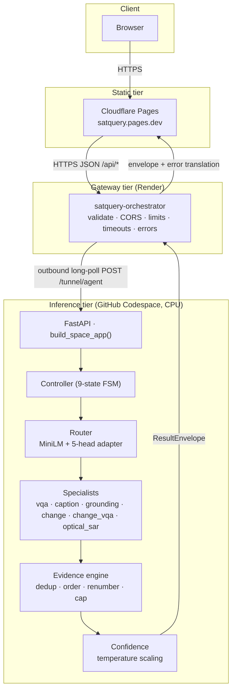

# SatQuery AI — Architecture

> This is the index for the architecture reference. Each chapter below is a separate file in this folder.

This is the architecture reference for SatQuery AI. It is written as a **hub plus ten deep
sub-documents**, because the system is large enough that a single file would either be superficial or
unreadable.

> **Status vocabulary used everywhere in these docs:** `IMPLEMENTED` (the code exists and runs) ·
> `VERIFIED` (checked against evidence) · `MEASURED` (a number was produced) · `ATTEMPTED` (tried,
> outcome recorded) · `NOT RUN` · `BLOCKED` · `DEFERRED` · `REJECTED` (tried and explicitly not
> accepted) · `OPEN` (known, unresolved) · `RESOLVED` · `CLOSED`.
>
> Every substantive claim in this set carries one of these tags, and every non-obvious claim cites
> the file it came from.

---

## 1. The thesis in one paragraph

SatQuery AI answers natural-language questions about satellite imagery. It is **not** one large
vision-language model. It is a **router plus specialists** system: a small learned router reads the
question and decides *which capability* is being asked for; the controller then runs exactly one
specialist; an evidence engine aggregates what that specialist produced; a confidence stage attaches
a calibrated (or honestly uncalibrated) number; and the whole thing is returned as one typed
`ResultEnvelope`. The only trained parameters in the system are six small modules sitting on frozen,
publicly-pinned backbones.

`docs/ARCHITECTURE_FREEZE.md` section 5 gives each layer exactly one verb, and the whole design
follows from that sentence:

> router **understands**; policy engine **decides**; specialists **compute**; VLM **explains**;
> evidence engine **proves**.

## 2. Sub-documents

| # | Document | What it covers |
|---|---|---|
| 01 | [System overview](01-system-overview.md) | the thesis, the component inventory, the frozen-backbone strategy, what is deliberately absent |
| 02 | [Deployment topology](02-deployment-topology.md) | the four tiers, the gateway, the outbound tunnel, wake flow, cold start, `transport_mode` |
| 03 | [Request lifecycle](03-request-lifecycle.md) | the nine-state controller, validation rules, modality inference, tiling |
| 04 | [Router](04-router.md) | frozen MiniLM, the five-head adapter, `interpret()` vs `chooseTask()`, the lexical fallback, the label space |
| 05 | [Specialists](05-specialists.md) | all six tasks: entry points, preprocessing, postprocessing, outputs |
| 06 | [Evidence and confidence](06-evidence-and-confidence.md) | the evidence schema, the aggregation pipeline, temperature scaling, the eight execution events |
| 07 | [Configuration freeze](07-configuration-freeze.md) | the registry, the enforced invariants, the config hash, why it is frozen |
| 08 | [API contract](08-api-contract.md) | the four endpoints, the envelopes, error codes, transport headers |
| 09 | [Frontend](09-frontend.md) | the static pages, the Analyze console, real-vs-preview, platform traps |
| 10 | [Observability and operations](10-observability-and-ops.md) | health, counters, traces, what is and is not observed |

## 3. The system at a glance

## 4. Cross-cutting principles

These recur in every sub-document and are the reason the code looks the way it does.

### 4.1 One config system, no magic numbers

Every tunable value lives in `configs/base.yaml`. The loader (`core/config.py`) validates it against
the frozen architecture and hashes it. **No number is hard-coded in Python.** This is enforced
socially and structurally: a reviewer who finds a literal in a specialist has found a bug.

### 4.2 Frozen backbones, trained modules

No backbone is fine-tuned. `all-MiniLM-L6-v2`, `SmolVLM-500M-Instruct`, `RemoteCLIP ViT-B/32` and
`CROMA-base` are all pinned **by revision** and fetched from the Hub at run time. What this project
trains is small: a 50,822-parameter router adapter, four heads, and one LoRA adapter. This is what
makes the system CPU-runnable.

### 4.3 Typed contracts between every layer

`core/schemas.py` is the binding contract. No specialist may invent its own result shape; every
specialist returns a `SpecialistResult`. The schemas carry validators that encode real findings —
for example `Evidence` **refuses** spatial coordinates without a `coordinate_system`, because a bare
box is meaningless.

### 4.4 Honest degradation over confident fabrication

The system is built so that "we could not do this" is representable and preferred to a plausible
guess. Concretely:

- a missing calibration artifact yields `method="uncalibrated"`, `calibrated=None` — **never** a
  fabricated fitted number;
- a missing optional artifact **degrades** a capability rather than crashing the service;
- a *corrupt* artifact **raises**, because silently treating a corrupt file as "no file" would hide
  an operational defect;
- the evidence engine records `dropped_over_limit` rather than silently truncating;
- the grounding specialist marks a result `degraded` when it produces no localisation.

### 4.5 Reproducibility is a structural property

`EvidenceEngine.aggregate` is pure and deterministic — no clock, no RNG, no I/O. Evidence ids are
assigned from *sorted position*, not input order, so the same inputs produce byte-identical output.
`evidence_digest()` exists so that reproducibility is a test assertion rather than a hope.

### 4.6 No chain-of-thought anywhere

`ExecutionTrace` records **observable facts only** — states, timings, counts, config hash, model
refs. There is no field for model reasoning and no LLM-generated confidence. This is a deliberate
constraint from the architecture freeze, not an omission.

## 5. What the system deliberately does not have

| Absent | Why |
|---|---|
| Database, auth, queue | the gateway is stateless by design |
| GPU requirement | device is chosen via `SATQUERY_DEVICE`; all placement is `.to(device)` |
| Gradio GUI | the frontend is a separate static tier; `app/space_app.py` serves JSON only |
| End-to-end benchmark | none exists; none is claimed |
| Chain-of-thought | traces carry observable facts only |
| Backbone redistribution | backbones are fetched, pinned by revision |

## 6. Where to start reading

- **New to the project** → [01 System overview](01-system-overview.md), then
  [03 Request lifecycle](03-request-lifecycle.md).
- **Running it** → [`DEPLOYMENT.md`](../DEPLOYMENT.md) and
  [02 Deployment topology](02-deployment-topology.md).
- **Auditing the numbers** → [`BENCHMARKS.md`](../BENCHMARKS.md) and [`EVALUATION.md`](../EVALUATION.md).
- **Understanding the router defect** → [04 Router](04-router.md) and
  [`RESEARCH_NOTES.md`](../RESEARCH_NOTES.md).
