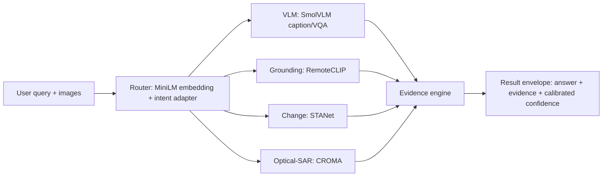

---
tags:
  - earth-observation
  - remote-sensing
  - vqa
  - satquery
library_name: transformers
models:
  - repo: HuggingFaceTB/SmolVLM-500M-Instruct
    revision: a7da5b986cb5
    role: vlm-captioning
  - repo: chendelong/RemoteCLIP
    revision: bf1d8a3ccf2d
    role: remote-sensing-grounding
  - repo: sentence-transformers/all-MiniLM-L6-v2
    revision: 1110a243fdf4
    role: router-embedding
  - repo: antofuller/CROMA
    revision: 0dd28e3d633b
    role: optical-sar-fusion
---

# SatQuery AI

SatQuery AI is a natural-language question-answering system for **satellite and
aerial imagery**. A user asks a question about an image (or a pair of images),
and SatQuery routes it to the right specialist models, collects evidence, and
returns a single, confidence-scored result envelope.

> **Project presence, not model weights.** SatQuery AI does **not** own any model
> weights. The models it uses are third-party pretrained models that are
> **pinned for reproducibility** in `configs/base.yaml`. This repository is the
> Hugging Face *project/model presence* and a pinned reference list — it ships no
> weights, no binaries, and no large artifacts.

## Overview

SatQuery is built around a small, deterministic pipeline:

1. **Router** — a `MiniLM` sentence-transformer embeds the user's query and a
   trained adapter classifies the *intent* (vqa, caption, grounding, change,
   optical_sar, change_vqa, or unsupported).
2. **Specialists** — depending on the routed intent, one or more domain
   specialists answer:
   - **SmolVLM** — visual question answering and image captioning.
   - **RemoteCLIP** — remote-sensing grounding (object/region localization in
     satellite imagery).
   - **STANet change specialist** — pixel-level change detection between two
     images.
   - **CROMA** — optical + SAR fusion for joint scene understanding.
   - **change-VQA head** — answers questions about detected changes.
3. **Evidence engine** — every answer is packaged with supporting evidence items
   (boxes, masks, crops, text) and a calibrated confidence.

The flow is: **router → specialists → evidence → result envelope**.

## Architecture

## Models we build on

These are **third-party models**, pinned to an exact revision in
`configs/base.yaml` for reproducibility. SatQuery ships **no weights** of its
own for any of them. Each links to the upstream Hugging Face model page.

| Role | Model (repo id) | Revision | Upstream |
| --- | --- | --- | --- |
| VLM captioning / VQA | `HuggingFaceTB/SmolVLM-500M-Instruct` | `a7da5b986cb5` | https://huggingface.co/HuggingFaceTB/SmolVLM-500M-Instruct |
| Remote-sensing grounding | `chendelong/RemoteCLIP` | `bf1d8a3ccf2d` | https://huggingface.co/chendelong/RemoteCLIP |
| Router embedding | `sentence-transformers/all-MiniLM-L6-v2` | `1110a243fdf4` | https://huggingface.co/sentence-transformers/all-MiniLM-L6-v2 |
| Optical-SAR fusion | `antofuller/CROMA` | `0dd28e3d633b` | https://huggingface.co/antofuller/CROMA |

The exact `repo_id` / `revision` strings and the load calls used in code are
listed in [`MODEL_REFERENCES.md`](./MODEL_REFERENCES.md).

## Capabilities

- `vqa` — answer natural-language questions about a satellite image.
- `caption` — produce a natural-language description of a scene.
- `grounding` — localize objects/regions described in text (boxes in 0–1 coords).
- `change` — pixel-level change detection between two co-registered images.
- `optical_sar` — joint interpretation of optical + SAR imagery via fusion.
- `change_vqa` — answer questions about detected changes.

See `docs/DEPLOYMENT_ARCHITECTURE.md` §3.3 for the authoritative capability list.

## Links

- **GitHub:** https://github.com/TODO/satquery-ai  *(TODO: replace with real repo URL)*
- **Live site:** https://satquery.pages.dev

## CPU-first note

SatQuery was adapted by its owner to run **CPU-first**. The serving entrypoint
(`app/space_app.py`) answers health and capability requests on CPU with no model
load and no GPU, and the intent router's frozen encoder is cached so capability
degradation (absent optional artifacts) never crashes the service — it degrades
gracefully. GPU (ZeroGPU) is used only for inference when a compatible runtime is
available.
